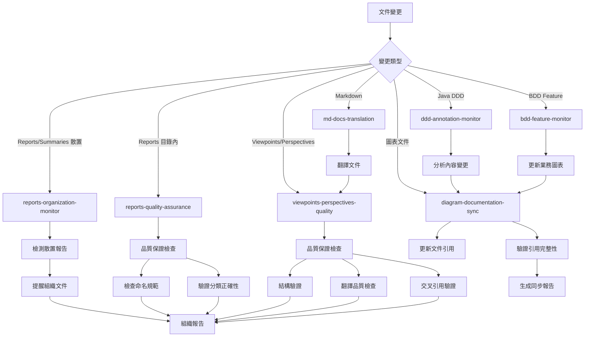

# Kiro Hooks Configuration

## 概覽

本目錄包含了 Kiro IDE 的自動化 hooks 配置，用於監控文件變更並觸發相應的自動化任務。

## 當前 Hooks 狀態

### 🟢 啟用的 Hooks

1. **reports-organization-monitor.kiro.hook** (v1.0) - **🆕 新增**
   - **功能**: 報告和總結文件組織監控
   - **監控**: *report*.md, *summary*.md 等報告文件
   - **作用**: 自動檢測散置的報告文件，提醒移動到 reports-summaries/ 目錄
   - **優先級**: 高 - 確保文件組織標準

2. **reports-quality-assurance.kiro.hook** (v1.0) - **🆕 新增**
   - **功能**: 報告目錄內文件品質保證
   - **監控**: reports-summaries/**/*.md
   - **作用**: 檢查命名規範、分類正確性、內容品質、索引更新
   - **優先級**: 中 - 維護報告品質標準

3. **viewpoints-perspectives-quality.kiro.hook** (v1.0)
   - **功能**: Rozanski & Woods 文件結構品質保證
   - **監控**: viewpoints/*.md, perspectives/*.md, templates/*.md, .terminology.json
   - **作用**: 結構驗證、翻譯品質檢查、交叉引用驗證、模板同步
   - **優先級**: 最高 - 確保架構文件品質

2. **md-docs-translation.kiro.hook** (v4.0) - **已增強**
   - **功能**: 中英文文件自動翻譯 (支援 Viewpoints & Perspectives)
   - **監控**: 中文 markdown 文件
   - **作用**: 自動翻譯到 docs/en/ 目錄，支援專業術語字典
   - **協調**: 與 viewpoints-perspectives-quality 協調工作

3. **diagram-documentation-sync.kiro.hook** (v1.0)
   - **功能**: 圖表與文件雙向同步
   - **監控**: 圖表文件 (*.puml, *.mmd, *.excalidraw) 和文件 (viewpoints/*.md, perspectives/*.md)
   - **作用**: 當圖表變更時自動更新文件引用，當文件變更時檢查圖表需求
   - **協調**: 與 viewpoints-perspectives-quality 協調工作

4. **ddd-annotation-monitor.kiro.hook** (v1.0)
   - **功能**: DDD 註解監控和結構分析
   - **監控**: Java 領域層文件 (@AggregateRoot, Domain Events, Services)
   - **作用**: 觸發 DDD 結構分析和圖表更新
   - **協調**: 與其他 hooks 協調工作

5. **bdd-feature-monitor.kiro.hook** (v1.0)
   - **功能**: BDD 特性文件監控和業務分析
   - **監控**: .feature 文件 (Scenarios, Actors, Business Events)
   - **作用**: 觸發業務流程分析和 Event Storming 更新
   - **協調**: 與其他 hooks 協調工作

### 🗑️ 已移除的 Hooks

1. **diagram-auto-generation.kiro.hook** - **已刪除**
   - **原因**: 功能完全被 diagram-documentation-sync.kiro.hook 取代
   - **狀態**: 已從系統中移除

## Hook 協調機制

### 主要同步流程



### 避免衝突的設計

1. **職責分離**:
   - `reports-organization-monitor`: 負責報告文件組織監控 (高優先級)
   - `reports-quality-assurance`: 負責報告目錄內品質保證 (中優先級)
   - `viewpoints-perspectives-quality`: 負責架構文件品質保證 (最高優先級)
   - `md-docs-translation`: 負責翻譯品質和一致性
   - `diagram-documentation-sync`: 負責圖表引用同步
   - `ddd-annotation-monitor`: 負責 DDD 內容分析
   - `bdd-feature-monitor`: 負責業務流程分析

2. **執行優先級**:
   - **第一級**: `viewpoints-perspectives-quality` (架構文件品質保證)
   - **第二級**: `reports-organization-monitor` (報告組織監控)
   - **第三級**: `md-docs-translation` (翻譯處理)
   - **第四級**: `reports-quality-assurance` (報告品質保證)
   - **第五級**: 內容分析 hooks (`ddd-annotation-monitor`, `bdd-feature-monitor`)
   - **第六級**: `diagram-documentation-sync` (引用同步)

3. **協調機制**:
   - 品質保證 hook 協調所有其他 hooks
   - 翻譯 hook 觸發品質檢查
   - 內容分析 hooks 通知圖表同步需求
   - 所有 hooks 共享品質標準和術語字典

4. **狀態管理**:
   - 每個 hook 都有明確的輸入輸出
   - 品質保證 hook 維護整體狀態
   - 避免同時修改同一文件
   - 使用鎖定機制防止衝突

## 配置文件

### 同步規則配置
- **位置**: `.kiro/settings/diagram-sync-rules.json`
- **內容**: 定義圖表與文件的對應關係
- **用途**: 指導自動同步行為

### 支援腳本
- **位置**: `scripts/sync-diagram-references.py`
- **功能**: 執行實際的同步邏輯
- **用法**: `python3 scripts/sync-diagram-references.py --comprehensive --validate --report`

## 使用指南

### 手動觸發同步

```bash
# 完整同步並生成報告
python3 scripts/sync-diagram-references.py --comprehensive --validate --report

# 只檢查圖表到文件的同步
python3 scripts/sync-diagram-references.py --mode=diagram-to-docs

# 只檢查文件到圖表的同步
python3 scripts/sync-diagram-references.py --mode=docs-to-diagram
```

### 檢查 Hook 狀態

```bash
# 查看所有 hooks
ls -la .kiro/hooks/

# 檢查特定 hook 配置
cat .kiro/hooks/diagram-documentation-sync.kiro.hook
```

## 最佳實踐

### 圖表命名規範

1. **聚合根詳細圖**: `{aggregate-name}-aggregate-details.puml`
2. **概覽圖**: `{concept}-overview.puml`
3. **流程圖**: `{process-name}-flow.puml`
4. **Event Storming**: `event-storming-{level}.puml`

### 文件引用規範

1. **相對路徑**: 使用 `../../diagrams/...` 格式
2. **分組**: 在「相關圖表」或「Related Diagrams」章節
3. **描述**: 提供有意義的圖表描述
4. **順序**: 按邏輯順序排列引用

### 衝突解決

1. **時間戳優先**: 較新的變更優先
2. **內容分析**: 分析變更意圖
3. **手動確認**: 複雜衝突需要人工介入

## 故障排除

### 常見問題

1. **引用路徑錯誤**:
   - 檢查相對路徑是否正確
   - 確認圖表文件存在

2. **Hook 未觸發**:
   - 檢查 hook 是否啟用
   - 確認文件模式匹配

3. **同步衝突**:
   - 查看同步報告
   - 手動解決衝突

### 調試命令

```bash
# 檢查圖表文件
find docs/diagrams -name "*.puml" -o -name "*.mmd" -o -name "*.excalidraw"

# 檢查文件引用
grep -r "diagrams.*\.puml\|diagrams.*\.mmd" docs/viewpoints/ docs/perspectives/

# 驗證引用完整性
python3 scripts/sync-diagram-references.py --validate --report
```

## 版本歷史

- **v1.0** (2024-12-19): 初始實現圖表文件同步系統
- **v1.1** (計劃): 增加 Excalidraw 支援
- **v1.2** (計劃): 增加自動圖表生成功能

## 相關文件

- 同步規則配置
- 同步腳本
- [Kiro 設定](../settings/)