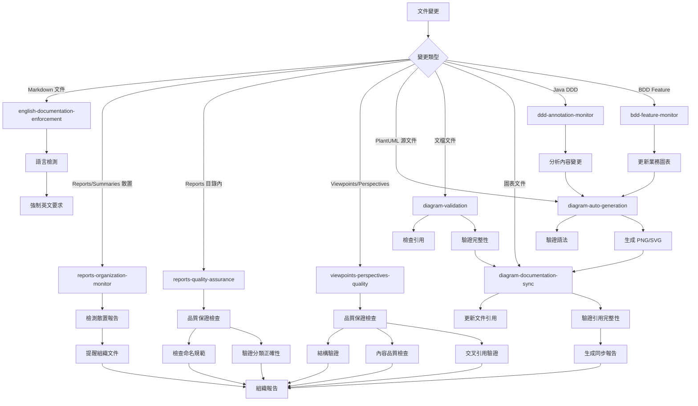

# Kiro Hooks Configuration

## 概覽

本目錄包含了 Kiro IDE 的自動化 hooks 配置，用於監控文件變更並觸發相應的自動化任務。

> **💡 設計哲學**: "Automate pain, not process" - 只自動化真正痛苦的任務，其他用腳本和手動檢查

## 當前 Hooks 狀態

### 🟢 啟用的 Hooks

1. **diagram-auto-generation.kiro.hook** (v1.0)
   - **功能**: PlantUML 圖表自動生成
   - **監控**: docs/diagrams/viewpoints/**/*.puml, docs/diagrams/perspectives/**/*.puml
   - **作用**: 當 .puml 文件變更時自動生成 PNG/SVG 圖表
   - **價值**: ⭐⭐⭐⭐⭐ 高 - 節省時間，防止忘記重新生成
   - **維護成本**: 低
   - **ROI**: 優秀

2. **documentation-sync.kiro.hook** (v1.0)
   - **功能**: 文檔同步提醒
   - **監控**: app/src/**/*.java, infrastructure/**/*.java, app/src/**/*.ts, infrastructure/**/*.ts
   - **作用**: 當代碼變更時提醒開發者更新相關文檔
   - **價值**: ⭐⭐⭐⭐ 高 - 防止文檔漂移，保持文檔與代碼同步
   - **維護成本**: 低
   - **ROI**: 優秀

### 📋 替代方案（推薦使用腳本而非 Hooks）

以下功能通過腳本和手動流程實現，無需 hooks：

#### 圖表驗證
```bash
# 手動運行或加入 pre-commit hook
./scripts/validate-diagrams.sh

# 或在 CI/CD 中運行
# 見 .github/workflows/validate-docs.yml
```

**為什麼不用 hook**: 
- 驗證不需要即時反饋
- Pre-commit 或 CI/CD 更合適
- 避免編輯時的干擾

#### DDD/BDD 監控
```bash
# 需要時手動分析
python3 scripts/analyze-ddd-code.py
python3 scripts/analyze-bdd-features.py
```

**為什麼不用 hook**:
- Code review 會抓到領域模型變更
- 不需要每次編輯都觸發
- 手動分析更有針對性

#### 文檔品質檢查
```bash
# 提交前運行
./scripts/validate-documentation-structure.sh
./scripts/check-spelling.sh
```

**為什麼不用 hook**:
- 品質判斷需要人工
- 模板已經提供結構指引
- Code review 是最佳品質閘門

### 🗑️ 已移除的 Hooks（簡化策略）

**移除日期**: 2025-01-17  
**原因**: 採用極簡主義策略 - "Automate pain, not process"

#### 已刪除的 Hooks

1. **diagram-validation.kiro.hook** - **已刪除 (2025-01-17)**
   - **原因**: 驗證可以在 pre-commit 或 CI/CD 中進行，不需要即時反饋
   - **替代方案**: `./scripts/validate-diagrams.sh` + Git pre-commit hook
   - **ROI**: 低 - 維護成本 > 實際價值

2. **ddd-annotation-monitor.kiro.hook** - **已刪除 (2025-01-17)**
   - **原因**: Code review 足以抓到領域模型變更，不需要自動監控
   - **替代方案**: 手動 code review + `scripts/analyze-ddd-code.py`
   - **ROI**: 低 - 對小團隊來說是過度工程

3. **bdd-feature-monitor.kiro.hook** - **已刪除 (2025-01-17)**
   - **原因**: Feature 變更在 code review 中很明顯，不需要自動監控
   - **替代方案**: 手動 code review + `scripts/analyze-bdd-features.py`
   - **ROI**: 低 - 增加噪音多於價值

4. **java-code-documentation-sync.kiro.hook** - **已刪除 (2025-09-24)**
   - **原因**: 95% 功能與 ddd-annotation-monitor.kiro.hook 重複
   - **狀態**: 功能已整合到 DDD 監控 hook（後來也被刪除）

5. **bdd-feature-documentation-sync.kiro.hook** - **已刪除 (2025-09-24)**
   - **原因**: 90% 功能與 bdd-feature-monitor.kiro.hook 重複
   - **狀態**: 功能已整合到 BDD 監控 hook（後來也被刪除）

6. **development-viewpoint-maintenance.kiro.hook** - **已刪除 (2025-09-24)**
   - **原因**: 定時 hook 不實用，功能重複
   - **狀態**: 轉為手動腳本執行

7. **development-viewpoint-quality-monitor.kiro.hook** - **已刪除 (2025-09-24)**
   - **原因**: 功能與 viewpoints-perspectives-quality.kiro.hook 重複
   - **狀態**: 功能已整合到主要品質保證 hook（從未實現）

### 📝 從未實現的 Hooks（已從計劃中移除）

這些 hooks 曾在文檔中規劃，但經過評估後決定不實現：

1. **english-documentation-enforcement.kiro.hook**
   - **原因**: Code review 可以抓到語言問題，自動化會產生誤報
   - **替代方案**: Code review + 團隊約定

2. **reports-organization-monitor.kiro.hook**
   - **原因**: 文件組織是簡單的手動任務，不需要自動化
   - **替代方案**: 定期手動整理

3. **reports-quality-assurance.kiro.hook**
   - **原因**: 報告是臨時文件，不需要嚴格品質控制
   - **替代方案**: 手動檢查

4. **viewpoints-perspectives-quality.kiro.hook**
   - **原因**: 模板 + code review 已經足夠，自動化過於複雜
   - **替代方案**: 模板 + `scripts/validate-documentation-structure.sh`

5. **diagram-documentation-sync.kiro.hook**
   - **原因**: 雙向同步過於複雜，容易產生衝突，價值不高
   - **替代方案**: 手動更新引用（不常發生）+ 驗證腳本

## Hook 協調機制

### 主要同步流程



### 避免衝突的設計

1. **職責分離**:
   - `english-documentation-enforcement`: 負責英文文檔標準強制執行 (最高優先級)
   - `reports-organization-monitor`: 負責報告文件組織監控 (高優先級)
   - `reports-quality-assurance`: 負責報告目錄內品質保證 (中優先級)
   - `viewpoints-perspectives-quality`: 負責架構文件品質保證 (高優先級)
   - `diagram-auto-generation`: 負責 PlantUML 圖表自動生成 (高優先級)
   - `diagram-validation`: 負責圖表引用驗證 (中優先級)
   - `diagram-documentation-sync`: 負責圖表引用同步 (中優先級)
   - `ddd-annotation-monitor`: 負責 DDD 內容分析 (低優先級)
   - `bdd-feature-monitor`: 負責業務流程分析 (低優先級)

2. **執行優先級**:
   - **第一級**: `english-documentation-enforcement` (英文標準強制執行)
   - **第二級**: `viewpoints-perspectives-quality` (架構文件品質保證)
   - **第三級**: `reports-organization-monitor` (報告組織監控)
   - **第四級**: `diagram-auto-generation` (圖表自動生成)
   - **第五級**: `reports-quality-assurance`, `diagram-validation` (品質檢查)
   - **第六級**: `diagram-documentation-sync` (引用同步)
   - **第七級**: 內容分析 hooks (`ddd-annotation-monitor`, `bdd-feature-monitor`)

3. **協調機制**:
   - 品質保證 hook 協調所有其他 hooks
   - 圖表生成 → 引用同步 → 驗證的流程
   - 內容分析 hooks 通知圖表生成需求
   - 所有 hooks 共享品質標準

4. **圖表 Hooks 協調流程**:
   ```
   .puml 文件變更
        ↓
   diagram-auto-generation (生成 PNG/SVG)
        ↓
   diagram-documentation-sync (更新引用)
        ↓
   diagram-validation (驗證完整性)
   ```

5. **狀態管理**:
   - 每個 hook 都有明確的輸入輸出
   - 品質保證 hook 維護整體狀態
   - 避免同時修改同一文件
   - 使用鎖定機制防止衝突
   - 圖表生成使用臨時文件避免衝突

## 配置文件

### 同步規則配置
- **位置**: `.kiro/settings/diagram-sync-rules.json`
- **內容**: 定義圖表與文件的對應關係
- **用途**: 指導自動同步行為

### 支援腳本
- **位置**: `scripts/sync-diagram-references.py`
- **功能**: 執行實際的同步邏輯
- **用法**: `python3 scripts/sync-diagram-references.py --comprehensive --validate --report`

## 使用指南

### 手動觸發同步

```bash
# 完整同步並生成報告
python3 scripts/sync-diagram-references.py --comprehensive --validate --report

# 只檢查圖表到文件的同步
python3 scripts/sync-diagram-references.py --mode=diagram-to-docs

# 只檢查文件到圖表的同步
python3 scripts/sync-diagram-references.py --mode=docs-to-diagram
```

### 檢查 Hook 狀態

```bash
# 查看所有 hooks
ls -la .kiro/hooks/

# 檢查特定 hook 配置
cat .kiro/hooks/diagram-documentation-sync.kiro.hook
```

## 最佳實踐

### 圖表命名規範

1. **聚合根詳細圖**: `{aggregate-name}-aggregate-details.puml`
2. **概覽圖**: `{concept}-overview.puml`
3. **流程圖**: `{process-name}-flow.puml`
4. **Event Storming**: `event-storming-{level}.puml`

### 文件引用規範

1. **相對路徑**: 使用 `../../diagrams/...` 格式
2. **分組**: 在「相關圖表」或「Related Diagrams」章節
3. **描述**: 提供有意義的圖表描述
4. **順序**: 按邏輯順序排列引用

### 衝突解決

1. **時間戳優先**: 較新的變更優先
2. **內容分析**: 分析變更意圖
3. **手動確認**: 複雜衝突需要人工介入

## 故障排除

### 常見問題

1. **引用路徑錯誤**:
   - 檢查相對路徑是否正確
   - 確認圖表文件存在

2. **Hook 未觸發**:
   - 檢查 hook 是否啟用
   - 確認文件模式匹配

3. **同步衝突**:
   - 查看同步報告
   - 手動解決衝突

### 調試命令

```bash
# 檢查圖表文件
find docs/diagrams -name "*.puml" -o -name "*.mmd" -o -name "*.excalidraw"

# 檢查文件引用
grep -r "diagrams.*\.puml\|diagrams.*\.mmd" docs/viewpoints/ docs/perspectives/

# 驗證引用完整性
python3 scripts/sync-diagram-references.py --validate --report
```

## 版本歷史

- **v1.0** (2024-12-19): 初始實現圖表文件同步系統
- **v1.1** (計劃): 增加 Excalidraw 支援
- **v1.2** (計劃): 增加自動圖表生成功能

## 相關文件

- 同步規則配置
- 同步腳本
- [Kiro 設定](../settings/)
