# Kiro Hooks Configuration

## 概覽

本目錄包含了 Kiro IDE 的自動化 hooks 配置，用於監控文件變更並觸發相應的自動化任務。

## 當前 Hooks 狀態

### 🟢 啟用的 Hooks

1. **english-documentation-enforcement.kiro.hook** (v1.0) - **🆕 新增**
   - **功能**: 英文文檔標準強制執行
   - **監控**: 所有 *.md 文件
   - **作用**: 自動檢測非英文內容，強制要求所有新文檔使用英文撰寫
   - **優先級**: 最高 - 確保語言標準一致性

2. **reports-organization-monitor.kiro.hook** (v1.0) - **🆕 新增**
   - **功能**: 報告和總結文件組織監控
   - **監控**: *report*.md, *summary*.md 等報告文件
   - **作用**: 自動檢測散置的報告文件，提醒移動到 reports-summaries/ 目錄
   - **優先級**: 高 - 確保文件組織標準

3. **reports-quality-assurance.kiro.hook** (v1.0) - **🆕 新增**
   - **功能**: 報告目錄內文件品質保證
   - **監控**: reports-summaries/**/*.md
   - **作用**: 檢查命名規範、分類正確性、內容品質、索引更新
   - **優先級**: 中 - 維護報告品質標準

4. **viewpoints-perspectives-quality.kiro.hook** (v1.1)
   - **功能**: Rozanski & Woods 文件結構品質保證
   - **監控**: viewpoints/*.md, perspectives/*.md, templates/*.md
   - **作用**: 結構驗證、內容品質檢查、交叉引用驗證、模板同步
   - **優先級**: 最高 - 確保架構文件品質

5. **diagram-documentation-sync.kiro.hook** (v1.0)
   - **功能**: 圖表與文件雙向同步
   - **監控**: 圖表文件 (*.puml, *.mmd, *.excalidraw) 和文件 (viewpoints/*.md, perspectives/*.md)
   - **作用**: 當圖表變更時自動更新文件引用，當文件變更時檢查圖表需求
   - **協調**: 與 viewpoints-perspectives-quality 協調工作

6. **ddd-annotation-monitor.kiro.hook** (v1.0)
   - **功能**: DDD 註解監控和結構分析
   - **監控**: Java 領域層文件 (@AggregateRoot, Domain Events, Services)
   - **作用**: 觸發 DDD 結構分析和圖表更新
   - **協調**: 與其他 hooks 協調工作

7. **bdd-feature-monitor.kiro.hook** (v1.0)
   - **功能**: BDD 特性文件監控和業務分析
   - **監控**: .feature 文件 (Scenarios, Actors, Business Events)
   - **作用**: 觸發業務流程分析和 Event Storming 更新
   - **協調**: 與其他 hooks 協調工作

### 🗑️ 已移除的 Hooks

1. **diagram-auto-generation.kiro.hook** - **已刪除**
   - **原因**: 功能完全被 diagram-documentation-sync.kiro.hook 取代
   - **狀態**: 已從系統中移除

2. **java-code-documentation-sync.kiro.hook** - **已刪除 (2025-09-24)**
   - **原因**: 95% 功能與 ddd-annotation-monitor.kiro.hook 重複
   - **狀態**: 功能已整合到 DDD 監控 hook

3. **bdd-feature-documentation-sync.kiro.hook** - **已刪除 (2025-09-24)**
   - **原因**: 90% 功能與 bdd-feature-monitor.kiro.hook 重複
   - **狀態**: 功能已整合到 BDD 監控 hook

4. **development-viewpoint-maintenance.kiro.hook** - **已刪除 (2025-09-24)**
   - **原因**: 定時 hook 不實用，功能重複
   - **狀態**: 轉為手動腳本執行

5. **development-viewpoint-quality-monitor.kiro.hook** - **已刪除 (2025-09-24)**
   - **原因**: 功能與 viewpoints-perspectives-quality.kiro.hook 重複
   - **狀態**: 功能已整合到主要品質保證 hook

## Hook 協調機制

### 主要同步流程

```mermaid
graph TB
    A[文件變更] --> B{變更類型}
    B -->|Markdown 文件| EN[english-documentation-enforcement]
    B -->|Reports/Summaries 散置| RO[reports-organization-monitor]
    B -->|Reports 目錄內| RQ[reports-quality-assurance]
    B -->|Viewpoints/Perspectives| VP[viewpoints-perspectives-quality]
    B -->|圖表文件| C[diagram-documentation-sync]
    B -->|Java DDD| D[ddd-annotation-monitor]
    B -->|BDD Feature| E[bdd-feature-monitor]

    EN --> ENA[語言檢測]
    RO --> ROA[檢測散置報告]
    RQ --> RQA[品質保證檢查]
    VP --> VPQ[品質保證檢查]
    C --> G[更新文件引用]
    D --> H[分析內容變更]
    E --> I[更新業務圖表]

    ENA --> ENB[強制英文要求]
    ROA --> ROB[提醒組織文件]
    RQA --> RQB[檢查命名規範]
    RQA --> RQC[驗證分類正確性]
    VPQ --> K[結構驗證]
    VPQ --> L[內容品質檢查]
    VPQ --> M[交叉引用驗證]
    
    H --> C
    I --> C

    
    C --> N[驗證引用完整性]
    N --> O[生成同步報告]
    
    ROB --> P[組織報告]
    RQB --> P
    RQC --> P
    K --> P
    L --> P
    M --> P
```



### 避免衝突的設計

1. **職責分離**:
   - `english-documentation-enforcement`: 負責英文文檔標準強制執行 (最高優先級)
   - `reports-organization-monitor`: 負責報告文件組織監控 (高優先級)
   - `reports-quality-assurance`: 負責報告目錄內品質保證 (中優先級)
   - `viewpoints-perspectives-quality`: 負責架構文件品質保證 (高優先級)
   - `diagram-documentation-sync`: 負責圖表引用同步
   - `ddd-annotation-monitor`: 負責 DDD 內容分析
   - `bdd-feature-monitor`: 負責業務流程分析

2. **執行優先級**:
   - **第一級**: `english-documentation-enforcement` (英文標準強制執行)
   - **第二級**: `viewpoints-perspectives-quality` (架構文件品質保證)
   - **第三級**: `reports-organization-monitor` (報告組織監控)
   - **第四級**: `reports-quality-assurance` (報告品質保證)
   - **第五級**: 內容分析 hooks (`ddd-annotation-monitor`, `bdd-feature-monitor`)
   - **第六級**: `diagram-documentation-sync` (引用同步)

3. **協調機制**:
   - 品質保證 hook 協調所有其他 hooks

   - 內容分析 hooks 通知圖表同步需求
   - 所有 hooks 共享品質標準

4. **狀態管理**:
   - 每個 hook 都有明確的輸入輸出
   - 品質保證 hook 維護整體狀態
   - 避免同時修改同一文件
   - 使用鎖定機制防止衝突

## 配置文件

### 同步規則配置
- **位置**: `.kiro/settings/diagram-sync-rules.json`
- **內容**: 定義圖表與文件的對應關係
- **用途**: 指導自動同步行為

### 支援腳本
- **位置**: `scripts/sync-diagram-references.py`
- **功能**: 執行實際的同步邏輯
- **用法**: `python3 scripts/sync-diagram-references.py --comprehensive --validate --report`

## 使用指南

### 手動觸發同步

```bash
# 完整同步並生成報告
python3 scripts/sync-diagram-references.py --comprehensive --validate --report

# 只檢查圖表到文件的同步
python3 scripts/sync-diagram-references.py --mode=diagram-to-docs

# 只檢查文件到圖表的同步
python3 scripts/sync-diagram-references.py --mode=docs-to-diagram
```

### 檢查 Hook 狀態

```bash
# 查看所有 hooks
ls -la .kiro/hooks/

# 檢查特定 hook 配置
cat .kiro/hooks/diagram-documentation-sync.kiro.hook
```

## 最佳實踐

### 圖表命名規範

1. **聚合根詳細圖**: `{aggregate-name}-aggregate-details.puml`
2. **概覽圖**: `{concept}-overview.puml`
3. **流程圖**: `{process-name}-flow.puml`
4. **Event Storming**: `event-storming-{level}.puml`

### 文件引用規範

1. **相對路徑**: 使用 `../../diagrams/...` 格式
2. **分組**: 在「相關圖表」或「Related Diagrams」章節
3. **描述**: 提供有意義的圖表描述
4. **順序**: 按邏輯順序排列引用

### 衝突解決

1. **時間戳優先**: 較新的變更優先
2. **內容分析**: 分析變更意圖
3. **手動確認**: 複雜衝突需要人工介入

## 故障排除

### 常見問題

1. **引用路徑錯誤**:
   - 檢查相對路徑是否正確
   - 確認圖表文件存在

2. **Hook 未觸發**:
   - 檢查 hook 是否啟用
   - 確認文件模式匹配

3. **同步衝突**:
   - 查看同步報告
   - 手動解決衝突

### 調試命令

```bash
# 檢查圖表文件
find docs/diagrams -name "*.puml" -o -name "*.mmd" -o -name "*.excalidraw"

# 檢查文件引用
grep -r "diagrams.*\.puml\|diagrams.*\.mmd" docs/viewpoints/ docs/perspectives/

# 驗證引用完整性
python3 scripts/sync-diagram-references.py --validate --report
```

## 版本歷史

- **v1.0** (2024-12-19): 初始實現圖表文件同步系統
- **v1.1** (計劃): 增加 Excalidraw 支援
- **v1.2** (計劃): 增加自動圖表生成功能

## 相關文件

- 同步規則配置
- 同步腳本
- [Kiro 設定](../settings/)