# 架構視點與觀點全面強化設計文檔

**建立日期**: 2025年9月23日 下午3:10 (台北時間)  
**設計版本**: v1.0  
**基於需求**: [requirements.md](./requirements.md)  
**評估基礎**: [COMPREHENSIVE_VIEWPOINTS_PERSPECTIVES_ASSESSMENT.md](../../../reports-summaries/architecture-design/COMPREHENSIVE_VIEWPOINTS_PERSPECTIVES_ASSESSMENT.md)

## 🎯 設計概述

本設計文檔基於深度評估報告的發現，針對薄弱的架構視點進行系統性強化，並建立跨視點整合機制。設計遵循現有的 DDD + 六角形架構 + 事件驅動架構模式，確保與現有系統的無縫整合。

## 🏗️ 整體架構設計

### 架構強化策略

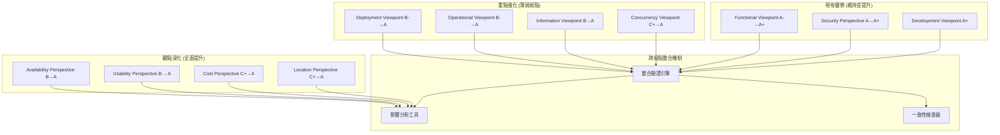
```mermaid
graph TB
    subgraph "現有優勢 (維持並提升)"
        A[Development Viewpoint A+]
        B[Security Perspective A→A+]
        C[Functional Viewpoint A-→A+]
    end
    
    subgraph "重點強化 (薄弱視點)"
        D[Concurrency Viewpoint C+→A]
        E[Information Viewpoint B→A]
        F[Operational Viewpoint B-→A]
        G[Deployment Viewpoint B-→A]
    end
    
    subgraph "觀點深化 (全面提升)"
        H[Location Perspective C+→A]
        I[Cost Perspective C+→A]
        J[Usability Perspective B-→A]
        K[Availability Perspective B→A]
    end
    
    subgraph "跨視點整合機制"
        L[整合驗證引擎]
        M[影響分析工具]
        N[一致性檢查器]
    end
    
    A --> L
    B --> L
    C --> L
    D --> L
    E --> L
    F --> L
    G --> L
    
    L --> M
    L --> N
    
    H --> M
    I --> M
    J --> M
    K --> M
```

### 技術架構整合設計

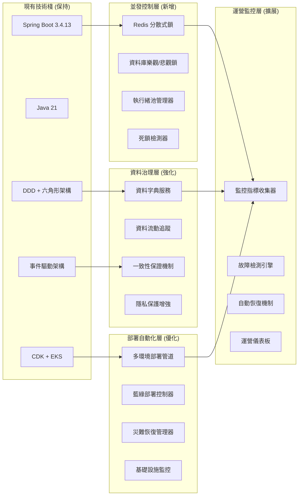
```mermaid
graph LR
    subgraph "現有技術棧 (保持)"
        A1[Spring Boot 3.4.13]
        A2[Java 21]
        A3[DDD + 六角形架構]
        A4[事件驅動架構]
        A5[CDK + EKS]
    end
    
    subgraph "並發控制層 (新增)"
        B1[Redis 分散式鎖]
        B2[資料庫樂觀/悲觀鎖]
        B3[執行緒池管理器]
        B4[死鎖檢測器]
    end
    
    subgraph "資料治理層 (強化)"
        C1[資料字典服務]
        C2[資料流動追蹤]
        C3[一致性保證機制]
        C4[隱私保護增強]
    end
    
    subgraph "運營監控層 (擴展)"
        D1[監控指標收集器]
        D2[故障檢測引擎]
        D3[自動恢復機制]
        D4[運營儀表板]
    end
    
    subgraph "部署自動化層 (優化)"
        E1[多環境部署管道]
        E2[藍綠部署控制器]
        E3[災難恢復管理器]
        E4[基礎設施監控]
    end
    
    A1 --> B1
    A3 --> C1
    A4 --> C3
    A5 --> E1
    
    B1 --> D1
    C1 --> D1
    E1 --> D1
```

## 🔧 核心組件設計

### 0. AWS CI/CD 管道組件設計 (前置基礎)

#### CodePipeline 管道配置設計

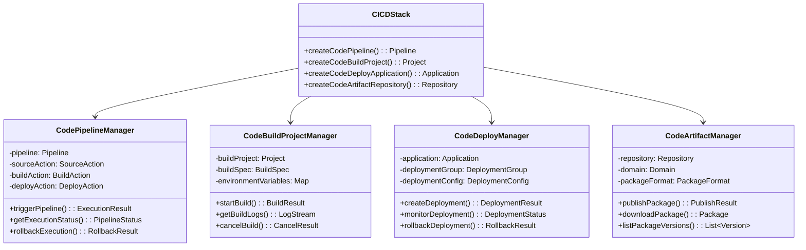
```mermaid
classDiagram
    class CICDStack {
        +createCodePipeline(): Pipeline
        +createCodeBuildProject(): Project
        +createCodeDeployApplication(): Application
        +createCodeArtifactRepository(): Repository
    }
    
    class CodePipelineManager {
        -pipeline: Pipeline
        -sourceAction: SourceAction
        -buildAction: BuildAction
        -deployAction: DeployAction
        +triggerPipeline(): ExecutionResult
        +getExecutionStatus(): PipelineStatus
        +rollbackExecution(): RollbackResult
    }
    
    class CodeBuildProjectManager {
        -buildProject: Project
        -buildSpec: BuildSpec
        -environmentVariables: Map
        +startBuild(): BuildResult
        +getBuildLogs(): LogStream
        +cancelBuild(): CancelResult
    }
    
    class CodeDeployManager {
        -application: Application
        -deploymentGroup: DeploymentGroup
        -deploymentConfig: DeploymentConfig
        +createDeployment(): DeploymentResult
        +monitorDeployment(): DeploymentStatus
        +rollbackDeployment(): RollbackResult
    }
    
    class CodeArtifactManager {
        -repository: Repository
        -domain: Domain
        -packageFormat: PackageFormat
        +publishPackage(): PublishResult
        +downloadPackage(): Package
        +listPackageVersions(): List~Version~
    }
    
    CICDStack --> CodePipelineManager
    CICDStack --> CodeBuildProjectManager
    CICDStack --> CodeDeployManager
    CICDStack --> CodeArtifactManager
```

#### CodeBuild 建構流程設計

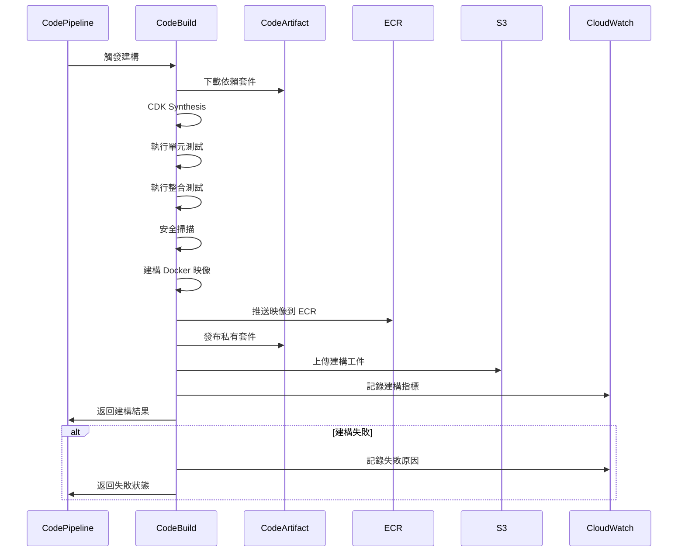
```mermaid
sequenceDiagram
    participant CP as CodePipeline
    participant CB as CodeBuild
    participant CA as CodeArtifact
    participant ECR as ECR
    participant S3 as S3
    participant CW as CloudWatch
    
    CP->>CB: 觸發建構
    CB->>CA: 下載依賴套件
    CB->>CB: CDK Synthesis
    CB->>CB: 執行單元測試
    CB->>CB: 執行整合測試
    CB->>CB: 安全掃描
    CB->>CB: 建構 Docker 映像
    CB->>ECR: 推送映像到 ECR
    CB->>CA: 發布私有套件
    CB->>S3: 上傳建構工件
    CB->>CW: 記錄建構指標
    CB->>CP: 返回建構結果
    
    alt 建構失敗
        CB->>CW: 記錄失敗原因
        CB->>CP: 返回失敗狀態
    end
```

#### CodeDeploy EKS Canary 整合設計

```mermaid
graph TB
    subgraph "CodeDeploy Application"
        A[EKS Application]
        B[Deployment Groups]
        C[Canary Deployment Configurations]
    end
    
    subgraph "EKS Cluster Integration"
        D[EKS Service Account]
        E[RBAC Permissions]
        F[Load Balancer Controller]
        G[Ingress Controller]
    end
    
    subgraph "Canary Deployment Strategy"
        H[Canary Deployment (10% → 50% → 100%)]
        I[Traffic Splitting]
        J[Automated Rollback]
    end
    
    subgraph "Monitoring & Validation"
        K[Kubernetes Readiness Probes]
        L[CloudWatch Metrics Analysis]
        M[Application Load Balancer Health Checks]
        N[X-Ray Performance Tracing]
        O[CloudWatch Synthetics]
    end
    
    A --> D
    B --> E
    C --> F
    
    D --> H
    E --> I
    F --> J
    
    H --> K
    I --> L
    J --> M
    H --> N
    I --> O
```

#### Canary 部署流程設計

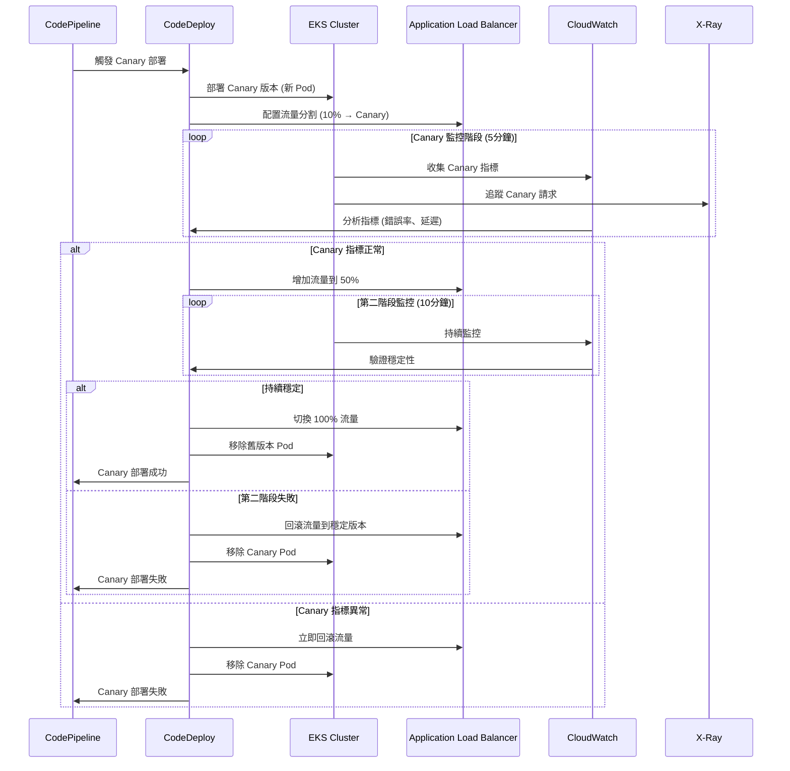
```mermaid
sequenceDiagram
    participant CP as CodePipeline
    participant CD as CodeDeploy
    participant EKS as EKS Cluster
    participant ALB as Application Load Balancer
    participant CW as CloudWatch
    participant XR as X-Ray
    
    CP->>CD: 觸發 Canary 部署
    CD->>EKS: 部署 Canary 版本 (新 Pod)
    CD->>ALB: 配置流量分割 (10% → Canary)
    
    loop Canary 監控階段 (5分鐘)
        EKS->>CW: 收集 Canary 指標
        EKS->>XR: 追蹤 Canary 請求
        CW->>CD: 分析指標 (錯誤率、延遲)
    end
    
    alt Canary 指標正常
        CD->>ALB: 增加流量到 50%
        loop 第二階段監控 (10分鐘)
            EKS->>CW: 持續監控
            CW->>CD: 驗證穩定性
        end
        
        alt 持續穩定
            CD->>ALB: 切換 100% 流量
            CD->>EKS: 移除舊版本 Pod
            CD->>CP: Canary 部署成功
        else 第二階段失敗
            CD->>ALB: 回滾流量到穩定版本
            CD->>EKS: 移除 Canary Pod
            CD->>CP: Canary 部署失敗
        end
    else Canary 指標異常
        CD->>ALB: 立即回滾流量
        CD->>EKS: 移除 Canary Pod
        CD->>CP: Canary 部署失敗
    end
```

### 1. 並發控制架構 (Concurrency Viewpoint)

#### 分散式鎖管理器設計

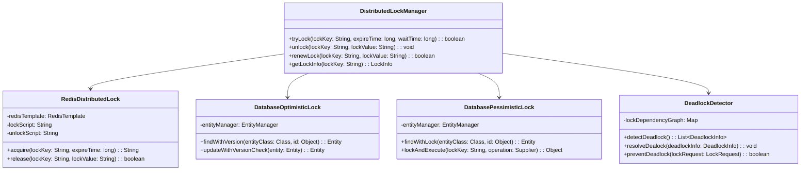
```mermaid
classDiagram
    class DistributedLockManager {
        +tryLock(lockKey: String, expireTime: long, waitTime: long): boolean
        +unlock(lockKey: String, lockValue: String): void
        +renewLock(lockKey: String, lockValue: String): boolean
        +getLockInfo(lockKey: String): LockInfo
    }
    
    class RedisDistributedLock {
        -redisTemplate: RedisTemplate
        -lockScript: String
        -unlockScript: String
        +acquire(lockKey: String, expireTime: long): String
        +release(lockKey: String, lockValue: String): boolean
    }
    
    class DatabaseOptimisticLock {
        -entityManager: EntityManager
        +findWithVersion(entityClass: Class, id: Object): Entity
        +updateWithVersionCheck(entity: Entity): Entity
    }
    
    class DatabasePessimisticLock {
        -entityManager: EntityManager
        +findWithLock(entityClass: Class, id: Object): Entity
        +lockAndExecute(lockKey: String, operation: Supplier): Object
    }
    
    class DeadlockDetector {
        -lockDependencyGraph: Map
        +detectDeadlock(): List~DeadlockInfo~
        +resolveDealock(deadlockInfo: DeadlockInfo): void
        +preventDeadlock(lockRequest: LockRequest): boolean
    }
    
    DistributedLockManager --> RedisDistributedLock
    DistributedLockManager --> DatabaseOptimisticLock
    DistributedLockManager --> DatabasePessimisticLock
    DistributedLockManager --> DeadlockDetector
```

#### 執行緒池管理架構

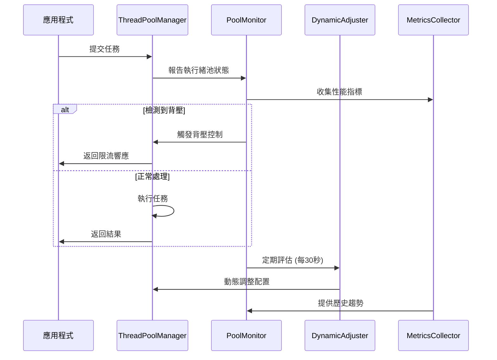
```mermaid
sequenceDiagram
    participant App as 應用程式
    participant TPM as ThreadPoolManager
    participant Monitor as PoolMonitor
    participant Adjuster as DynamicAdjuster
    participant Metrics as MetricsCollector
    
    App->>TPM: 提交任務
    TPM->>Monitor: 報告執行緒池狀態
    Monitor->>Metrics: 收集性能指標
    
    alt 檢測到背壓
        Monitor->>TPM: 觸發背壓控制
        TPM->>App: 返回限流響應
    else 正常處理
        TPM->>TPM: 執行任務
        TPM->>App: 返回結果
    end
    
    Monitor->>Adjuster: 定期評估 (每30秒)
    Adjuster->>TPM: 動態調整配置
    Metrics->>Monitor: 提供歷史趨勢
```

### 2. 資料治理架構 (Information Viewpoint)

#### 資料字典和流動追蹤設計

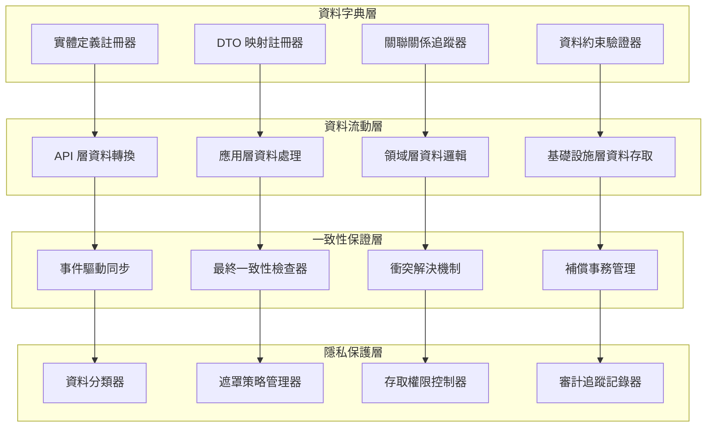
```mermaid
graph TB
    subgraph "資料字典層"
        A[實體定義註冊器]
        B[DTO 映射註冊器]
        C[關聯關係追蹤器]
        D[資料約束驗證器]
    end
    
    subgraph "資料流動層"
        E[API 層資料轉換]
        F[應用層資料處理]
        G[領域層資料邏輯]
        H[基礎設施層資料存取]
    end
    
    subgraph "一致性保證層"
        I[事件驅動同步]
        J[最終一致性檢查器]
        K[衝突解決機制]
        L[補償事務管理]
    end
    
    subgraph "隱私保護層"
        M[資料分類器]
        N[遮罩策略管理器]
        O[存取權限控制器]
        P[審計追蹤記錄器]
    end
    
    A --> E
    B --> F
    C --> G
    D --> H
    
    E --> I
    F --> J
    G --> K
    H --> L
    
    I --> M
    J --> N
    K --> O
    L --> P
```

#### 資料一致性策略設計

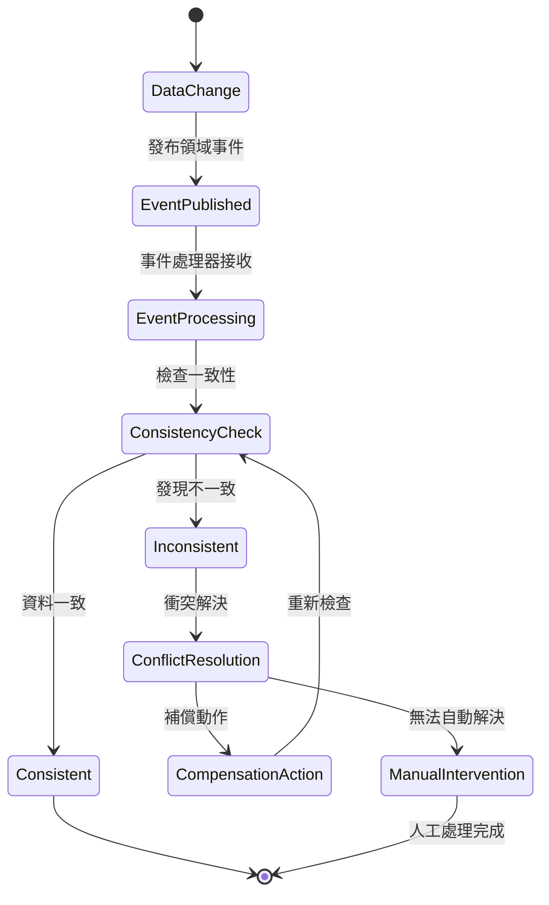
```mermaid
stateDiagram-v2
    [*] --> DataChange
    DataChange --> EventPublished : 發布領域事件
    EventPublished --> EventProcessing : 事件處理器接收
    
    EventProcessing --> ConsistencyCheck : 檢查一致性
    ConsistencyCheck --> Consistent : 資料一致
    ConsistencyCheck --> Inconsistent : 發現不一致
    
    Consistent --> [*]
    
    Inconsistent --> ConflictResolution : 衝突解決
    ConflictResolution --> CompensationAction : 補償動作
    CompensationAction --> ConsistencyCheck : 重新檢查
    
    ConflictResolution --> ManualIntervention : 無法自動解決
    ManualIntervention --> [*] : 人工處理完成
```

### 3. 運營監控架構 (Operational Viewpoint)

#### 監控體系設計

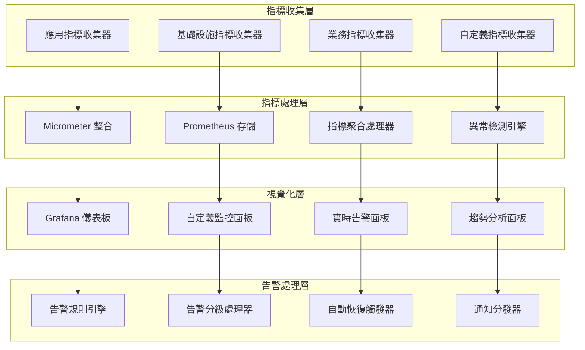
```mermaid
graph TB
    subgraph "指標收集層"
        A[應用指標收集器]
        B[基礎設施指標收集器]
        C[業務指標收集器]
        D[自定義指標收集器]
    end
    
    subgraph "指標處理層"
        E[Micrometer 整合]
        F[Prometheus 存儲]
        G[指標聚合處理器]
        H[異常檢測引擎]
    end
    
    subgraph "視覺化層"
        I[Grafana 儀表板]
        J[自定義監控面板]
        K[實時告警面板]
        L[趨勢分析面板]
    end
    
    subgraph "告警處理層"
        M[告警規則引擎]
        N[告警分級處理器]
        O[自動恢復觸發器]
        P[通知分發器]
    end
    
    A --> E
    B --> F
    C --> G
    D --> H
    
    E --> I
    F --> J
    G --> K
    H --> L
    
    I --> M
    J --> N
    K --> O
    L --> P
```

#### 故障處理流程設計

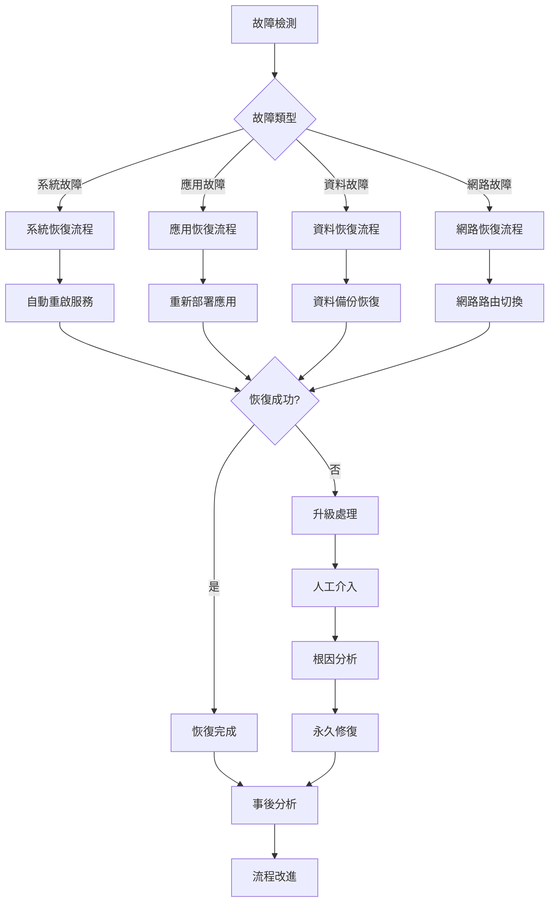
```mermaid
flowchart TD
    A[故障檢測] --> B{故障類型}
    
    B -->|系統故障| C[系統恢復流程]
    B -->|應用故障| D[應用恢復流程]
    B -->|資料故障| E[資料恢復流程]
    B -->|網路故障| F[網路恢復流程]
    
    C --> G[自動重啟服務]
    D --> H[重新部署應用]
    E --> I[資料備份恢復]
    F --> J[網路路由切換]
    
    G --> K{恢復成功?}
    H --> K
    I --> K
    J --> K
    
    K -->|是| L[恢復完成]
    K -->|否| M[升級處理]
    
    M --> N[人工介入]
    N --> O[根因分析]
    O --> P[永久修復]
    
    L --> Q[事後分析]
    P --> Q
    Q --> R[流程改進]
```

### 4. AWS CI/CD 管道架構 (Deployment Viewpoint 前置)

#### AWS 原生 CI/CD 服務整合設計

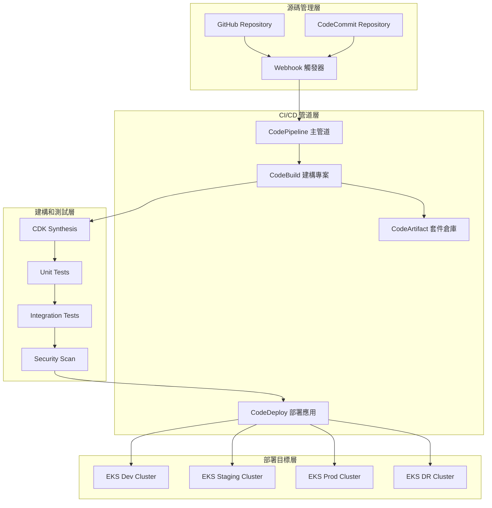
```mermaid
graph TB
    subgraph "源碼管理層"
        A[GitHub Repository]
        B[CodeCommit Repository]
        C[Webhook 觸發器]
    end
    
    subgraph "CI/CD 管道層"
        D[CodePipeline 主管道]
        E[CodeBuild 建構專案]
        F[CodeDeploy 部署應用]
        G[CodeArtifact 套件倉庫]
    end
    
    subgraph "建構和測試層"
        H[CDK Synthesis]
        I[Unit Tests]
        J[Integration Tests]
        K[Security Scan]
    end
    
    subgraph "部署目標層"
        L[EKS Dev Cluster]
        M[EKS Staging Cluster]
        N[EKS Prod Cluster]
        O[EKS DR Cluster]
    end
    
    A --> C
    B --> C
    C --> D
    
    D --> E
    E --> G
    E --> H
    H --> I
    I --> J
    J --> K
    
    K --> F
    F --> L
    F --> M
    F --> N
    F --> O
```

#### CodePipeline + CodeDeploy 整合流程

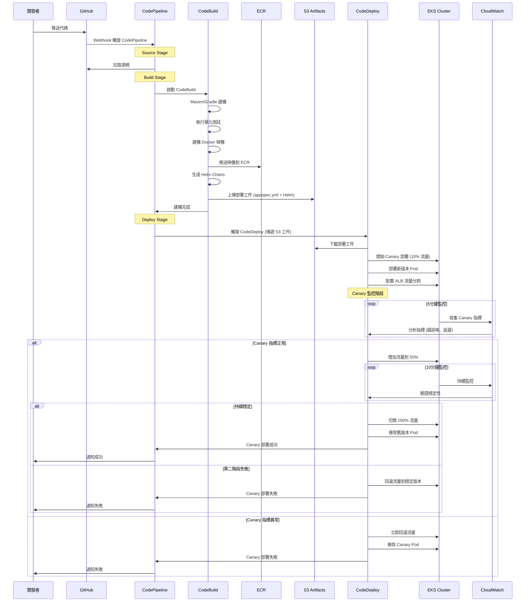
```mermaid
sequenceDiagram
    participant Dev as 開發者
    participant GH as GitHub
    participant CP as CodePipeline
    participant CB as CodeBuild
    participant ECR as ECR
    participant S3 as S3 Artifacts
    participant CD as CodeDeploy
    participant EKS as EKS Cluster
    participant CW as CloudWatch
    
    Dev->>GH: 推送代碼
    GH->>CP: Webhook 觸發 CodePipeline
    
    Note over CP: Source Stage
    CP->>GH: 拉取源碼
    
    Note over CP: Build Stage
    CP->>CB: 啟動 CodeBuild
    CB->>CB: Maven/Gradle 建構
    CB->>CB: 執行單元測試
    CB->>CB: 建構 Docker 映像
    CB->>ECR: 推送映像到 ECR
    CB->>CB: 生成 Helm Charts
    CB->>S3: 上傳部署工件 (appspec.yml + Helm)
    CB->>CP: 建構完成
    
    Note over CP: Deploy Stage
    CP->>CD: 觸發 CodeDeploy (傳遞 S3 工件)
    CD->>S3: 下載部署工件
    CD->>EKS: 開始 Canary 部署 (10% 流量)
    CD->>EKS: 部署新版本 Pod
    CD->>EKS: 配置 ALB 流量分割
    
    Note over CD: Canary 監控階段
    loop 5分鐘監控
        EKS->>CW: 收集 Canary 指標
        CW->>CD: 分析指標 (錯誤率、延遲)
    end
    
    alt Canary 指標正常
        CD->>EKS: 增加流量到 50%
        loop 10分鐘監控
            EKS->>CW: 持續監控
            CW->>CD: 驗證穩定性
        end
        
        alt 持續穩定
            CD->>EKS: 切換 100% 流量
            CD->>EKS: 移除舊版本 Pod
            CD->>CP: Canary 部署成功
            CP->>Dev: 通知成功
        else 第二階段失敗
            CD->>EKS: 回滾流量到穩定版本
            CD->>CP: Canary 部署失敗
            CP->>Dev: 通知失敗
        end
    else Canary 指標異常
        CD->>EKS: 立即回滾流量
        CD->>EKS: 移除 Canary Pod
        CD->>CP: Canary 部署失敗
        CP->>Dev: 通知失敗
    end
```

#### CodeArtifact 私有套件管理架構

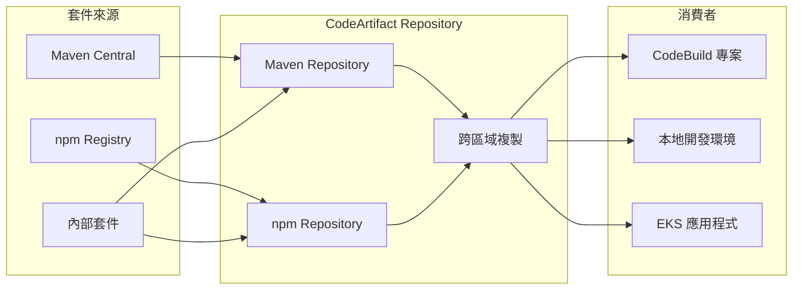
```mermaid
graph LR
    subgraph "套件來源"
        A[Maven Central]
        B[npm Registry]
        C[內部套件]
    end
    
    subgraph "CodeArtifact Repository"
        D[Maven Repository]
        E[npm Repository]
        F[跨區域複製]
    end
    
    subgraph "消費者"
        G[CodeBuild 專案]
        H[本地開發環境]
        I[EKS 應用程式]
    end
    
    A --> D
    B --> E
    C --> D
    C --> E
    
    D --> F
    E --> F
    
    F --> G
    F --> H
    F --> I
```

### 5. 部署自動化架構 (Deployment Viewpoint)

#### CodeDeploy + EKS 多環境部署管道設計

```mermaid
graph LR
    subgraph "開發環境 (CodePipeline Stage 1)"
        A[CodeBuild 建構]
        B[單元測試]
        C[整合測試]
        D[CodeDeploy to EKS Dev]
    end
    
    subgraph "測試環境 (CodePipeline Stage 2)"
        E[CodeDeploy 自動部署]
        F[E2E 測試]
        G[性能測試]
        H[Manual Approval Gate]
    end
    
    subgraph "預生產環境 (CodePipeline Stage 3)"
        I[CodeDeploy Canary 部署]
        J[煙霧測試]
        K[負載測試]
        L[Production Approval Gate]
    end
    
    subgraph "生產環境 (CodePipeline Stage 4)"
        M[CodeDeploy Canary 部署]
        N[健康檢查和指標監控]
        O[CloudWatch 自動化驗證]
    end
    
    A --> B --> C --> D
    D --> E --> F --> G --> H
    H --> I --> J --> K --> L
    L --> M --> N --> O
    
    subgraph "CodeDeploy 自動回滾機制"
        P[CloudWatch Alarms 觸發]
        Q[CodeDeploy 自動回滾]
        R[Aurora 資料恢復]
    end
    
    N --> P
    O --> P
    P --> Q --> R
```

#### 災難恢復架構設計

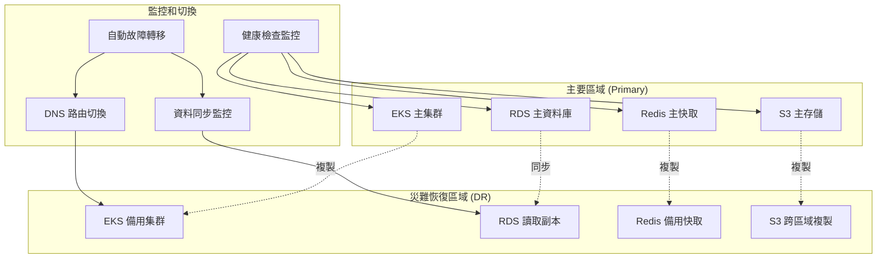
```mermaid
graph TB
    subgraph "主要區域 (Primary)"
        A[EKS 主集群]
        B[RDS 主資料庫]
        C[Redis 主快取]
        D[S3 主存儲]
    end
    
    subgraph "災難恢復區域 (DR)"
        E[EKS 備用集群]
        F[RDS 讀取副本]
        G[Redis 備用快取]
        H[S3 跨區域複製]
    end
    
    subgraph "監控和切換"
        I[健康檢查監控]
        J[自動故障轉移]
        K[DNS 路由切換]
        L[資料同步監控]
    end
    
    A -.->|複製| E
    B -.->|同步| F
    C -.->|複製| G
    D -.->|複製| H
    
    I --> A
    I --> B
    I --> C
    I --> D
    
    J --> K
    J --> L
    
    K --> E
    L --> F
```

### 6. GenBI Text-to-SQL 智能查詢架構 (Usability Viewpoint 增強)

#### GenBI Text-to-SQL 系統架構設計

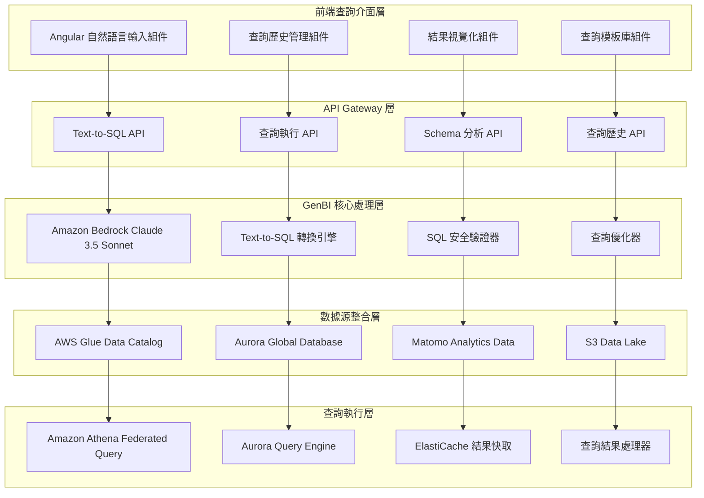
```mermaid
graph TB
    subgraph "前端查詢介面層"
        A[Angular 自然語言輸入組件]
        B[查詢歷史管理組件]
        C[結果視覺化組件]
        D[查詢模板庫組件]
    end
    
    subgraph "API Gateway 層"
        E[Text-to-SQL API]
        F[查詢執行 API]
        G[Schema 分析 API]
        H[查詢歷史 API]
    end
    
    subgraph "GenBI 核心處理層"
        I[Amazon Bedrock Claude 3.5 Sonnet]
        J[Text-to-SQL 轉換引擎]
        K[SQL 安全驗證器]
        L[查詢優化器]
    end
    
    subgraph "數據源整合層"
        M[AWS Glue Data Catalog]
        N[Aurora Global Database]
        O[Matomo Analytics Data]
        P[S3 Data Lake]
    end
    
    subgraph "查詢執行層"
        Q[Amazon Athena Federated Query]
        R[Aurora Query Engine]
        S[ElastiCache 結果快取]
        T[查詢結果處理器]
    end
    
    A --> E
    B --> F
    C --> G
    D --> H
    
    E --> I
    F --> J
    G --> K
    H --> L
    
    I --> M
    J --> N
    K --> O
    L --> P
    
    M --> Q
    N --> R
    O --> S
    P --> T
```

#### Text-to-SQL 轉換流程設計

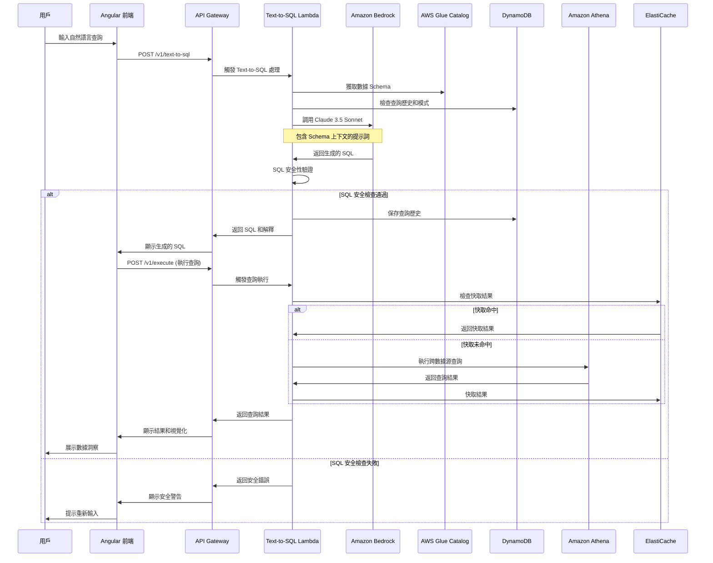
```mermaid
sequenceDiagram
    participant User as 用戶
    participant UI as Angular 前端
    participant API as API Gateway
    participant Lambda as Text-to-SQL Lambda
    participant Bedrock as Amazon Bedrock
    participant Glue as AWS Glue Catalog
    participant DDB as DynamoDB
    participant Athena as Amazon Athena
    participant Cache as ElastiCache
    
    User->>UI: 輸入自然語言查詢
    UI->>API: POST /v1/text-to-sql
    API->>Lambda: 觸發 Text-to-SQL 處理
    
    Lambda->>Glue: 獲取數據 Schema
    Lambda->>DDB: 檢查查詢歷史和模式
    
    Lambda->>Bedrock: 調用 Claude 3.5 Sonnet
    Note over Lambda,Bedrock: 包含 Schema 上下文的提示詞
    Bedrock->>Lambda: 返回生成的 SQL
    
    Lambda->>Lambda: SQL 安全性驗證
    alt SQL 安全檢查通過
        Lambda->>DDB: 保存查詢歷史
        Lambda->>API: 返回 SQL 和解釋
        API->>UI: 顯示生成的 SQL
        
        UI->>API: POST /v1/execute (執行查詢)
        API->>Lambda: 觸發查詢執行
        
        Lambda->>Cache: 檢查快取結果
        alt 快取命中
            Cache->>Lambda: 返回快取結果
        else 快取未命中
            Lambda->>Athena: 執行跨數據源查詢
            Athena->>Lambda: 返回查詢結果
            Lambda->>Cache: 快取結果
        end
        
        Lambda->>API: 返回查詢結果
        API->>UI: 顯示結果和視覺化
        UI->>User: 展示數據洞察
    else SQL 安全檢查失敗
        Lambda->>API: 返回安全錯誤
        API->>UI: 顯示安全警告
        UI->>User: 提示重新輸入
    end
```

#### GenBI 數據字典和 Schema 管理設計

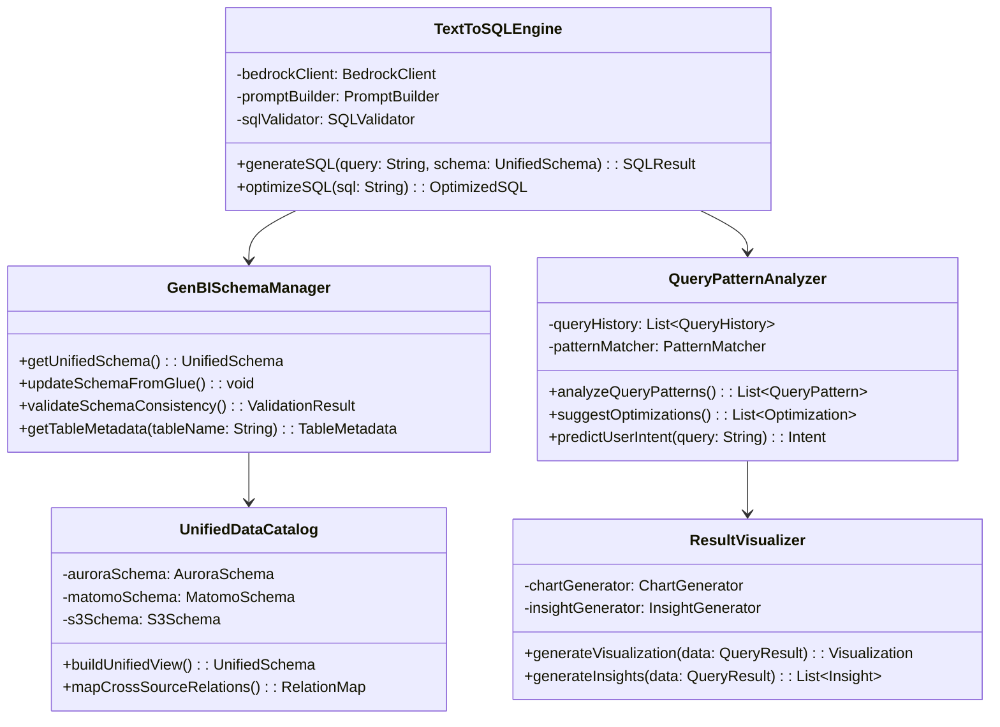
```mermaid
classDiagram
    class GenBISchemaManager {
        +getUnifiedSchema(): UnifiedSchema
        +updateSchemaFromGlue(): void
        +validateSchemaConsistency(): ValidationResult
        +getTableMetadata(tableName: String): TableMetadata
    }
    
    class UnifiedDataCatalog {
        -auroraSchema: AuroraSchema
        -matomoSchema: MatomoSchema
        -s3Schema: S3Schema
        +buildUnifiedView(): UnifiedSchema
        +mapCrossSourceRelations(): RelationMap
    }
    
    class TextToSQLEngine {
        -bedrockClient: BedrockClient
        -promptBuilder: PromptBuilder
        -sqlValidator: SQLValidator
        +generateSQL(query: String, schema: UnifiedSchema): SQLResult
        +optimizeSQL(sql: String): OptimizedSQL
    }
    
    class QueryPatternAnalyzer {
        -queryHistory: List~QueryHistory~
        -patternMatcher: PatternMatcher
        +analyzeQueryPatterns(): List~QueryPattern~
        +suggestOptimizations(): List~Optimization~
        +predictUserIntent(query: String): Intent
    }
    
    class ResultVisualizer {
        -chartGenerator: ChartGenerator
        -insightGenerator: InsightGenerator
        +generateVisualization(data: QueryResult): Visualization
        +generateInsights(data: QueryResult): List~Insight~
    }
    
    GenBISchemaManager --> UnifiedDataCatalog
    TextToSQLEngine --> GenBISchemaManager
    TextToSQLEngine --> QueryPatternAnalyzer
    QueryPatternAnalyzer --> ResultVisualizer
```

#### 查詢模板庫設計

```mermaid
graph TB
    subgraph "會員分析模板"
        A1[會員等級分佈查詢]
        A2[會員消費統計分析]
        A3[會員成長趨勢分析]
        A4[會員流失預測查詢]
    end
    
    subgraph "訂單分析模板"
        B1[訂單總覽統計]
        B2[高價值訂單分析]
        B3[訂單轉換漏斗]
        B4[季節性銷售趨勢]
    end
    
    subgraph "用戶行為分析模板"
        C1[頁面瀏覽行為分析]
        C2[購物車放棄率分析]
        C3[用戶旅程路徑分析]
        C4[A/B 測試效果分析]
    end
    
    subgraph "折扣效果分析模板"
        D1[折扣使用率統計]
        D2[折扣 ROI 分析]
        D3[會員折扣偏好分析]
        D4[促銷活動效果評估]
    end
    
    subgraph "模板管理系統"
        E[模板註冊器]
        F[參數化處理器]
        G[模板推薦引擎]
        H[自定義模板建構器]
    end
    
    A1 --> E
    A2 --> E
    B1 --> F
    B2 --> F
    C1 --> G
    C2 --> G
    D1 --> H
    D2 --> H
```

#### GenBI 安全性和權限控制設計

```mermaid
graph LR
    subgraph "查詢安全層"
        A[SQL 注入檢測器]
        B[查詢複雜度限制器]
        C[敏感資料存取控制器]
        D[查詢審計追蹤器]
    end
    
    subgraph "用戶權限層"
        E[角色權限管理]
        F[數據源存取控制]
        G[查詢結果過濾器]
        H[個人化權限檢查器]
    end
    
    subgraph "資料保護層"
        I[敏感欄位遮罩器]
        J[資料分類標籤器]
        K[存取日誌記錄器]
        L[合規性檢查器]
    end
    
    A --> E
    B --> F
    C --> G
    D --> H
    
    E --> I
    F --> J
    G --> K
    H --> L
```

### 7. RAG 智能對話機器人架構 (Usability Viewpoint 增強)

#### RAG 多模態對話系統架構設計

```mermaid
graph TB
    subgraph "多模態輸入層"
        A[文字輸入介面]
        B[語音輸入介面]
        C[語言檢測器 (中/英)]
        D[語音轉文字 (Amazon Transcribe)]
    end
    
    subgraph "對話管理層"
        E[對話狀態管理器]
        F[上下文維護器]
        G[意圖識別器]
        H[角色權限控制器]
    end
    
    subgraph "RAG 核心處理層"
        I[Amazon Bedrock Claude 3.5 Sonnet]
        J[知識庫檢索器 (Amazon Kendra)]
        K[向量相似度搜尋 (OpenSearch)]
        L[回答生成器]
    end
    
    subgraph "知識庫層"
        M[消費者知識庫 (產品、訂單、會員)]
        N[管理員知識庫 (營運、分析、系統)]
        O[共用知識庫 (政策、FAQ)]
        P[動態知識更新器]
    end
    
    subgraph "多模態輸出層"
        Q[文字回答生成器]
        R[語音合成器 (Amazon Polly)]
        S[多語言翻譯器]
        T[回答品質評估器]
    end
    
    A --> E
    B --> D
    C --> E
    D --> E
    
    E --> I
    F --> J
    G --> K
    H --> L
    
    I --> M
    J --> N
    K --> O
    L --> P
    
    M --> Q
    N --> R
    O --> S
    P --> T
```

#### RAG 知識庫架構和檢索流程設計

```mermaid
sequenceDiagram
    participant User as 用戶 (消費者/管理員)
    participant UI as 前端介面
    participant API as API Gateway
    participant Lambda as RAG Lambda
    participant Transcribe as Amazon Transcribe
    participant Kendra as Amazon Kendra
    participant Bedrock as Amazon Bedrock
    participant Polly as Amazon Polly
    participant DDB as DynamoDB
    
    User->>UI: 語音/文字輸入問題
    UI->>API: POST /v1/chat
    API->>Lambda: 觸發 RAG 處理
    
    alt 語音輸入
        Lambda->>Transcribe: 語音轉文字 (中/英)
        Transcribe->>Lambda: 返回文字內容
    end
    
    Lambda->>Lambda: 語言檢測和意圖識別
    Lambda->>DDB: 獲取對話歷史上下文
    
    Lambda->>Kendra: 檢索相關知識 (基於角色)
    Kendra->>Lambda: 返回相關文檔片段
    
    Lambda->>Bedrock: 調用 Claude 3.5 Sonnet
    Note over Lambda,Bedrock: RAG 提示詞 + 檢索內容 + 上下文
    Bedrock->>Lambda: 生成回答
    
    Lambda->>DDB: 保存對話歷史
    
    alt 語音輸出需求
        Lambda->>Polly: 文字轉語音 (中/英)
        Polly->>Lambda: 返回語音檔案
    end
    
    Lambda->>API: 返回文字/語音回答
    API->>UI: 顯示/播放回答
    UI->>User: 展示對話結果
```

#### 多語言和多模態處理設計

```mermaid
classDiagram
    class MultimodalRAGProcessor {
        +processTextInput(text: String, language: String): RAGResponse
        +processVoiceInput(audioFile: File): RAGResponse
        +generateTextResponse(answer: String, language: String): TextResponse
        +generateVoiceResponse(answer: String, language: String): VoiceResponse
    }
    
    class LanguageDetector {
        -supportedLanguages: List~String~
        +detectLanguage(text: String): Language
        +isChineseTraditional(text: String): boolean
        +isEnglish(text: String): boolean
    }
    
    class VoiceProcessor {
        -transcribeClient: TranscribeClient
        -pollyClient: PollyClient
        +speechToText(audioFile: File, language: String): String
        +textToSpeech(text: String, language: String, voice: String): AudioFile
    }
    
    class KnowledgeRetriever {
        -kendraClient: KendraClient
        -openSearchClient: OpenSearchClient
        +retrieveRelevantDocs(query: String, userRole: UserRole): List~Document~
        +vectorSimilaritySearch(embedding: Vector): List~Document~
    }
    
    class ContextManager {
        -conversationHistory: Map~String, List~Message~~
        +maintainContext(userId: String, message: Message): Context
        +getRelevantHistory(userId: String, maxTurns: int): List~Message~
        +clearContext(userId: String): void
    }
    
    class RoleBasedKnowledgeFilter {
        -consumerKnowledgeBase: KnowledgeBase
        -adminKnowledgeBase: KnowledgeBase
        +filterByRole(documents: List~Document~, role: UserRole): List~Document~
        +getAccessibleTopics(role: UserRole): List~Topic~
    }
    
    MultimodalRAGProcessor --> LanguageDetector
    MultimodalRAGProcessor --> VoiceProcessor
    MultimodalRAGProcessor --> KnowledgeRetriever
    MultimodalRAGProcessor --> ContextManager
    KnowledgeRetriever --> RoleBasedKnowledgeFilter
```

#### 知識庫內容分類和管理設計

```mermaid
graph TB
    subgraph "消費者知識庫 (Consumer KB)"
        A1[產品資訊和規格]
        A2[訂單和配送流程]
        A3[會員權益和等級]
        A4[折扣和優惠活動]
        A5[紅利點數使用]
        A6[退換貨政策]
        A7[客服和聯絡方式]
    end
    
    subgraph "管理員知識庫 (Admin KB)"
        B1[營運數據分析]
        B2[會員管理操作]
        B3[訂單處理流程]
        B4[庫存管理指南]
        B5[促銷活動設定]
        B6[系統操作手冊]
        B7[報表和分析工具]
    end
    
    subgraph "共用知識庫 (Shared KB)"
        C1[公司政策和規定]
        C2[常見問題 FAQ]
        C3[技術支援資訊]
        C4[法律條款說明]
        C5[隱私保護政策]
    end
    
    subgraph "知識庫管理系統"
        D1[內容版本控制]
        D2[知識更新檢測器]
        D3[內容品質評估器]
        D4[搜尋索引管理器]
    end
    
    A1 --> D1
    A2 --> D2
    B1 --> D3
    B2 --> D4
    C1 --> D1
```

#### RAG 對話品質優化設計

```mermaid
flowchart TD
    A[用戶問題輸入] --> B[問題理解和分析]
    B --> C{問題類型判斷}
    
    C -->|事實性問題| D[知識庫檢索]
    C -->|程序性問題| E[流程指導檢索]
    C -->|分析性問題| F[數據分析檢索]
    C -->|閒聊問題| G[通用對話處理]
    
    D --> H[相關性評分]
    E --> H
    F --> H
    G --> I[直接回答生成]
    
    H --> J{相關性閾值檢查}
    J -->|高相關性| K[RAG 回答生成]
    J -->|低相關性| L[建議相關問題]
    
    K --> M[回答品質檢查]
    L --> M
    I --> M
    
    M --> N{品質評估}
    N -->|高品質| O[返回最終回答]
    N -->|低品質| P[回答改進處理]
    
    P --> Q[重新檢索或轉人工]
    Q --> O
    
    O --> R[記錄對話和反饋]
```

#### 雙前端 RAG 整合架構設計

```mermaid
graph TB
    subgraph "Consumer Frontend (Angular)"
        CA[RAG 對話組件]
        CB[語音錄製組件]
        CC[對話歷史組件]
        CD[消費者知識搜尋]
    end
    
    subgraph "CMC Frontend (Next.js)"
        MA[RAG 管理介面]
        MB[語音分析工具]
        MC[對話監控面板]
        MD[管理員知識管理]
    end
    
    subgraph "RAG API Gateway"
        AG[統一 API 入口]
        AR[角色認證路由]
        AL[語言檢測路由]
        AM[模態選擇路由]
    end
    
    subgraph "RAG 核心服務層"
        RS[RAG 服務協調器]
        VS[語音處理服務]
        TS[文字處理服務]
        KS[知識庫服務]
    end
    
    subgraph "AWS 後端服務"
        BR[Bedrock Claude 3.5]
        KE[Kendra 知識庫]
        TR[Transcribe 語音轉文字]
        PO[Polly 文字轉語音]
        DY[DynamoDB 對話歷史]
    end
    
    CA --> AG
    CB --> AG
    CC --> AG
    CD --> AG
    
    MA --> AG
    MB --> AG
    MC --> AG
    MD --> AG
    
    AG --> AR
    AG --> AL
    AG --> AM
    
    AR --> RS
    AL --> RS
    AM --> RS
    
    RS --> VS
    RS --> TS
    RS --> KS
    
    VS --> TR
    VS --> PO
    TS --> BR
    KS --> KE
    
    RS --> DY
```

#### 多模態通訊流程設計

```mermaid
sequenceDiagram
    participant User as 用戶
    participant Frontend as 前端應用
    participant Gateway as RAG Gateway
    participant Voice as 語音服務
    participant Text as 文字服務
    participant Knowledge as 知識服務
    participant Bedrock as Amazon Bedrock
    
    Note over User,Bedrock: Text-to-Text 模式
    User->>Frontend: 輸入文字問題
    Frontend->>Gateway: POST /chat/text
    Gateway->>Text: 處理文字輸入
    Text->>Knowledge: 檢索相關知識
    Knowledge->>Bedrock: RAG 查詢
    Bedrock->>Knowledge: 生成回答
    Knowledge->>Text: 返回文字回答
    Text->>Gateway: 文字回答
    Gateway->>Frontend: 顯示文字回答
    Frontend->>User: 展示回答
    
    Note over User,Bedrock: Voice-to-Voice 模式
    User->>Frontend: 語音輸入
    Frontend->>Gateway: POST /chat/voice (音頻檔案)
    Gateway->>Voice: 處理語音輸入
    Voice->>Voice: Transcribe 語音轉文字
    Voice->>Knowledge: 檢索相關知識
    Knowledge->>Bedrock: RAG 查詢
    Bedrock->>Knowledge: 生成回答
    Knowledge->>Voice: 返回文字回答
    Voice->>Voice: Polly 文字轉語音
    Voice->>Gateway: 語音回答檔案
    Gateway->>Frontend: 返回語音檔案
    Frontend->>User: 播放語音回答
    
    Note over User,Bedrock: 混合模式切換
    User->>Frontend: 語音輸入
    Frontend->>Gateway: POST /chat/voice
    Gateway->>Voice: 檢測語音品質
    Voice->>Gateway: 品質不佳，建議文字模式
    Gateway->>Frontend: 建議切換到文字模式
    Frontend->>User: 提示切換到文字輸入
```

#### 雙語支援和語言檢測設計

```mermaid
classDiagram
    class LanguageProcessor {
        +detectLanguage(input: String): Language
        +processChineseInput(input: String): ProcessedInput
        +processEnglishInput(input: String): ProcessedInput
        +generateChineseResponse(content: String): String
        +generateEnglishResponse(content: String): String
    }
    
    class MultilingualKnowledgeBase {
        -chineseKB: KnowledgeBase
        -englishKB: KnowledgeBase
        -sharedKB: KnowledgeBase
        +searchByLanguage(query: String, language: Language): List~Document~
        +getTranslatedContent(docId: String, targetLang: Language): Document
    }
    
    class VoiceLanguageHandler {
        +transcribeChineseVoice(audio: AudioFile): String
        +transcribeEnglishVoice(audio: AudioFile): String
        +synthesizeChineseVoice(text: String): AudioFile
        +synthesizeEnglishVoice(text: String): AudioFile
        +detectVoiceLanguage(audio: AudioFile): Language
    }
    
    class ContextualTranslator {
        +translateQuery(query: String, sourceLang: Language, targetLang: Language): String
        +translateResponse(response: String, sourceLang: Language, targetLang: Language): String
        +maintainContextInTranslation(context: ConversationContext): TranslatedContext
    }
    
    LanguageProcessor --> MultilingualKnowledgeBase
    LanguageProcessor --> VoiceLanguageHandler
    LanguageProcessor --> ContextualTranslator
```

#### 業務知識庫架構和內容管理

```mermaid
graph TB
    subgraph "消費者業務知識庫"
        CK1[會員系統知識]
        CK2[產品和訂單知識]
        CK3[折扣和紅利知識]
        CK4[客服和政策知識]
    end
    
    subgraph "管理員業務知識庫"
        MK1[營運管理知識]
        MK2[數據分析知識]
        MK3[系統操作知識]
        MK4[業務流程知識]
    end
    
    subgraph "知識內容來源"
        S1[BDD Feature Files]
        S2[API 文檔]
        S3[業務流程文檔]
        S4[用戶手冊]
        S5[FAQ 資料庫]
        S6[政策文件]
    end
    
    subgraph "知識處理管道"
        P1[內容擷取器]
        P2[結構化處理器]
        P3[向量化處理器]
        P4[索引建構器]
        P5[品質驗證器]
    end
    
    S1 --> P1
    S2 --> P1
    S3 --> P1
    S4 --> P2
    S5 --> P2
    S6 --> P2
    
    P1 --> P3
    P2 --> P3
    P3 --> P4
    P4 --> P5
    
    P5 --> CK1
    P5 --> CK2
    P5 --> MK1
    P5 --> MK2
```

#### 綜合資料管道架構設計

```mermaid
graph TB
    subgraph "資料來源層"
        DS1[Aurora Global Database]
        DS2[MSK Kafka Streams]
        DS3[Matomo Analytics]
        DS4[CloudWatch Logs/Metrics]
        DS5[X-Ray Traces]
        DS6[EKS Container Logs]
        DS7[S3 Documents]
        DS8[Git Repository]
        DS9[Third-party APIs]
        DS10[Customer Service Systems]
        DS11[AWS Cost Reports]
        DS12[Security Logs]
    end
    
    subgraph "資料收集層"
        DC1[Kinesis Data Firehose]
        DC2[Lambda Data Collectors]
        DC3[EventBridge Rules]
        DC4[CloudWatch Agents]
        DC5[Fluent Bit Log Collectors]
        DC6[API Gateway Integrations]
    end
    
    subgraph "資料處理層"
        DP1[AWS Glue ETL Jobs]
        DP2[Lambda Processing Functions]
        DP3[Step Functions Workflows]
        DP4[Kinesis Analytics]
        DP5[EMR Spark Jobs]
        DP6[SageMaker Processing]
    end
    
    subgraph "資料儲存層"
        DST1[S3 Data Lake]
        DST2[Aurora Data Warehouse]
        DST3[OpenSearch Analytics]
        DST4[DynamoDB NoSQL]
        DST5[Redshift Analytics]
        DST6[Timestream Time Series]
    end
    
    subgraph "資料服務層"
        DSV1[Athena Query Service]
        DSV2[QuickSight BI Service]
        DSV3[Kendra Search Service]
        DSV4[Bedrock AI Service]
        DSV5[Comprehend NLP Service]
        DSV6[Personalize ML Service]
    end
    
    DS1 --> DC1
    DS2 --> DC2
    DS3 --> DC3
    DS4 --> DC4
    DS5 --> DC5
    DS6 --> DC5
    DS7 --> DC6
    DS8 --> DC6
    DS9 --> DC6
    DS10 --> DC2
    DS11 --> DC1
    DS12 --> DC4
    
    DC1 --> DP1
    DC2 --> DP2
    DC3 --> DP3
    DC4 --> DP4
    DC5 --> DP1
    DC6 --> DP2
    
    DP1 --> DST1
    DP2 --> DST2
    DP3 --> DST3
    DP4 --> DST4
    DP5 --> DST5
    DP6 --> DST6
    
    DST1 --> DSV1
    DST2 --> DSV2
    DST3 --> DSV3
    DST4 --> DSV4
    DST5 --> DSV5
    DST6 --> DSV6
```

#### GenBI 跨資料源查詢架構

```mermaid
sequenceDiagram
    participant User as 用戶
    participant GenBI as GenBI API
    participant Schema as Schema Registry
    participant Query as Query Engine
    participant Aurora as Aurora DB
    participant S3 as S3 Data Lake
    participant Matomo as Matomo API
    participant CW as CloudWatch
    participant Athena as Amazon Athena
    
    User->>GenBI: 自然語言查詢
    GenBI->>Schema: 獲取資料源 Schema
    Schema->>GenBI: 返回統一 Schema
    
    GenBI->>Query: 生成跨資料源 SQL
    Query->>Query: 分析資料來源需求
    
    par 並行資料查詢
        Query->>Aurora: 查詢交易資料
        Query->>S3: 查詢歷史資料
        Query->>Matomo: 查詢行為資料
        Query->>CW: 查詢監控資料
    end
    
    Aurora->>Query: 返回交易結果
    S3->>Query: 返回歷史結果
    Matomo->>Query: 返回行為結果
    CW->>Query: 返回監控結果
    
    Query->>Athena: 執行聯邦查詢
    Athena->>Query: 返回整合結果
    
    Query->>GenBI: 返回查詢結果
    GenBI->>User: 視覺化展示結果
```

#### 即時資料流處理架構

```mermaid
graph LR
    subgraph "即時事件來源"
        E1[用戶互動事件]
        E2[系統監控事件]
        E3[業務交易事件]
        E4[RAG 對話事件]
        E5[GenBI 查詢事件]
    end
    
    subgraph "事件處理管道"
        MSK[MSK Kafka]
        KDF[Kinesis Data Firehose]
        KDA[Kinesis Data Analytics]
        Lambda[Lambda Processors]
    end
    
    subgraph "即時分析"
        RT1[即時儀表板]
        RT2[即時告警]
        RT3[即時推薦]
        RT4[即時個人化]
    end
    
    subgraph "批次分析"
        BT1[每日報表]
        BT2[趨勢分析]
        BT3[模式識別]
        BT4[預測分析]
    end
    
    E1 --> MSK
    E2 --> MSK
    E3 --> MSK
    E4 --> KDF
    E5 --> KDF
    
    MSK --> KDA
    KDF --> Lambda
    
    KDA --> RT1
    KDA --> RT2
    Lambda --> RT3
    Lambda --> RT4
    
    MSK --> BT1
    KDF --> BT2
    KDA --> BT3
    Lambda --> BT4
```

## 🔗 跨視點整合機制設計

### 整合驗證引擎架構

```mermaid
classDiagram
    class ViewpointIntegrationEngine {
        +validateConsistency(viewpoints: List~Viewpoint~): ValidationResult
        +analyzeImpact(change: ViewpointChange): ImpactAnalysis
        +generateIntegrationReport(): IntegrationReport
    }
    
    class ViewpointRegistry {
        +registerViewpoint(viewpoint: Viewpoint): void
        +getViewpoint(name: String): Viewpoint
        +getAllViewpoints(): List~Viewpoint~
    }
    
    class CrossViewpointValidator {
        +validateFunctionalToInformation(): ValidationResult
        +validateConcurrencyToInformation(): ValidationResult
        +validateDeploymentToOperational(): ValidationResult
    }
    
    class ImpactAnalyzer {
        +analyzeFunctionalImpact(change: Change): Impact
        +analyzeSecurityImpact(change: Change): Impact
        +analyzePerformanceImpact(change: Change): Impact
    }
    
    class ConsistencyChecker {
        +checkArchitecturalConsistency(): ConsistencyReport
        +checkDocumentationConsistency(): ConsistencyReport
        +checkImplementationConsistency(): ConsistencyReport
    }
    
    ViewpointIntegrationEngine --> ViewpointRegistry
    ViewpointIntegrationEngine --> CrossViewpointValidator
    ViewpointIntegrationEngine --> ImpactAnalyzer
    ViewpointIntegrationEngine --> ConsistencyChecker
```

### 變更影響分析流程

```mermaid
sequenceDiagram
    participant Dev as 開發者
    participant VIE as ViewpointIntegrationEngine
    participant VA as ViewpointAnalyzer
    participant IA as ImpactAnalyzer
    participant CC as ConsistencyChecker
    participant Report as ReportGenerator
    
    Dev->>VIE: 提交視點變更
    VIE->>VA: 分析變更內容
    VA->>IA: 評估跨視點影響
    IA->>CC: 檢查一致性
    
    CC->>IA: 返回一致性結果
    IA->>VA: 返回影響分析
    VA->>VIE: 返回分析結果
    
    VIE->>Report: 生成影響報告
    Report->>Dev: 提供變更建議
    
    alt 發現衝突
        Dev->>VIE: 請求解決方案
        VIE->>Dev: 提供協調建議
    else 無衝突
        Dev->>VIE: 確認變更
        VIE->>VIE: 更新視點關係
    end
```

## 📊 資料模型設計

### 視點資料模型

```mermaid
erDiagram
    VIEWPOINT {
        string id PK
        string name
        string description
        enum status
        float completeness_score
        datetime last_updated
        string owner
    }
    
    PERSPECTIVE {
        string id PK
        string name
        string description
        float implementation_score
        datetime last_updated
    }
    
    VIEWPOINT_RELATIONSHIP {
        string id PK
        string source_viewpoint_id FK
        string target_viewpoint_id FK
        enum relationship_type
        float strength_score
        string description
    }
    
    PERSPECTIVE_COVERAGE {
        string id PK
        string perspective_id FK
        string viewpoint_id FK
        float coverage_score
        string implementation_notes
    }
    
    INTEGRATION_VALIDATION {
        string id PK
        string viewpoint_id FK
        enum validation_type
        enum status
        string validation_result
        datetime validated_at
    }
    
    VIEWPOINT ||--o{ VIEWPOINT_RELATIONSHIP : "source"
    VIEWPOINT ||--o{ VIEWPOINT_RELATIONSHIP : "target"
    VIEWPOINT ||--o{ PERSPECTIVE_COVERAGE : "covers"
    PERSPECTIVE ||--o{ PERSPECTIVE_COVERAGE : "covered_by"
    VIEWPOINT ||--o{ INTEGRATION_VALIDATION : "validates"
```

### 監控指標資料模型

```mermaid
erDiagram
    METRIC_DEFINITION {
        string id PK
        string name
        string description
        enum metric_type
        string unit
        json tags
    }
    
    METRIC_VALUE {
        string id PK
        string metric_id FK
        float value
        datetime timestamp
        json labels
    }
    
    ALERT_RULE {
        string id PK
        string metric_id FK
        string condition
        float threshold
        enum severity
        boolean enabled
    }
    
    ALERT_INSTANCE {
        string id PK
        string rule_id FK
        enum status
        datetime triggered_at
        datetime resolved_at
        string description
    }
    
    METRIC_DEFINITION ||--o{ METRIC_VALUE : "measures"
    METRIC_DEFINITION ||--o{ ALERT_RULE : "monitors"
    ALERT_RULE ||--o{ ALERT_INSTANCE : "triggers"
```

## 🧪 測試策略設計

### 測試架構分層

```mermaid
graph TB
    subgraph "單元測試層 (80%)"
        A[並發控制單元測試]
        B[資料治理單元測試]
        C[監控組件單元測試]
        D[部署工具單元測試]
    end
    
    subgraph "整合測試層 (15%)"
        E[跨視點整合測試]
        F[資料一致性測試]
        G[監控告警測試]
        H[部署流程測試]
    end
    
    subgraph "端到端測試層 (5%)"
        I[完整架構驗證測試]
        J[災難恢復測試]
        K[性能基準測試]
        L[安全滲透測試]
    end
    
    A --> E
    B --> F
    C --> G
    D --> H
    
    E --> I
    F --> J
    G --> K
    H --> L
```

### 並發測試策略

```mermaid
flowchart TD
    A[並發測試啟動] --> B[基礎功能測試]
    B --> C[負載壓力測試]
    C --> D[死鎖場景測試]
    D --> E[故障恢復測試]
    
    B --> B1[單一鎖測試]
    B --> B2[鎖重入測試]
    B --> B3[鎖超時測試]
    
    C --> C1[高並發競爭測試]
    C --> C2[長時間穩定性測試]
    C --> C3[記憶體洩漏檢測]
    
    D --> D1[人工死鎖構造]
    D --> D2[死鎖檢測驗證]
    D --> D3[死鎖恢復測試]
    
    E --> E1[Redis 故障恢復]
    E --> E2[資料庫故障恢復]
    E --> E3[網路分區恢復]
    
    B1 --> F[測試結果收集]
    B2 --> F
    B3 --> F
    C1 --> F
    C2 --> F
    C3 --> F
    D1 --> F
    D2 --> F
    D3 --> F
    E1 --> F
    E2 --> F
    E3 --> F
    
    F --> G[性能報告生成]
```

## 🔒 安全性設計考量

### 安全架構整合

```mermaid
graph TB
    subgraph "認證授權層"
        A[JWT Token 驗證]
        B[角色權限控制]
        C[API 存取控制]
    end
    
    subgraph "資料保護層"
        D[敏感資料加密]
        E[資料遮罩策略]
        F[存取審計追蹤]
    end
    
    subgraph "通信安全層"
        G[TLS 1.3 加密]
        H[內部服務認證]
        I[網路隔離]
    end
    
    subgraph "監控安全層"
        J[安全事件監控]
        K[異常行為檢測]
        L[安全告警處理]
    end
    
    A --> D
    B --> E
    C --> F
    
    D --> G
    E --> H
    F --> I
    
    G --> J
    H --> K
    I --> L
```

## 📈 性能優化設計

### 性能監控和調優架構

```mermaid
graph LR
    subgraph "性能監控"
        A[響應時間監控]
        B[吞吐量監控]
        C[資源使用監控]
        D[錯誤率監控]
    end
    
    subgraph "性能分析"
        E[瓶頸識別器]
        F[趨勢分析器]
        G[容量規劃器]
        H[優化建議器]
    end
    
    subgraph "自動優化"
        I[執行緒池調整器]
        J[快取策略優化器]
        K[資料庫查詢優化器]
        L[負載均衡調整器]
    end
    
    A --> E
    B --> F
    C --> G
    D --> H
    
    E --> I
    F --> J
    G --> K
    H --> L
```

## 🔗 相關文檔連結

- [需求文檔](./requirements.md)
- [評估報告](../../../reports-summaries/architecture-design/COMPREHENSIVE_VIEWPOINTS_PERSPECTIVES_ASSESSMENT.md)
- [Development Standards](../../../.kiro/steering/development-standards.md)
- [Security Standards](../../../.kiro/steering/security-standards.md)
- [Performance Standards](../../../.kiro/steering/performance-standards.md)

## 📝 設計決策記錄

### 決策 1: 基於現有架構擴展而非重構
**理由**: 評估報告顯示 Development Viewpoint 已達 A+ 級別，現有 DDD + 六角形架構基礎紮實，應保持並擴展而非重構。

### 決策 2: 優先強化薄弱視點
**理由**: 基於評估報告的優先級建議，重點投資 Concurrency (C+) 和 Information (B) 視點，以獲得最大改善效果。

### 決策 3: 漸進式整合策略
**理由**: 避免對現有系統造成衝擊，採用漸進式整合，確保每個階段都有可驗證的成果。

### 決策 4: 基於事件驅動的跨視點整合
**理由**: 利用現有的事件驅動架構，建立跨視點變更通知和一致性檢查機制。

---
**設計者**: Kiro AI Assistant  
**最後更新**: 2025年9月23日 下午3:10 (台北時間)  
**審核狀態**: 待審核