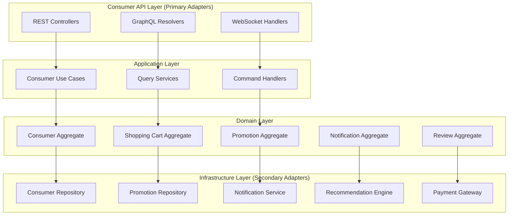

# Consumer API Gap Analysis Design Document

## Overview

本設計文檔旨在填補現有電商平台中消費者導向 API 的功能差距，基於 DDD 戰術設計和六角形架構原則，設計完整的消費者端 API 系統。設計將遵循現有專案的架構模式，包括聚合根、領域事件、端口與適配器等核心概念。

## Architecture

### 六角形架構設計



### DDD 戰術設計

#### 現有聚合根分析與增強

**現有的 Customer Aggregate** - 已存在但需要增強

- ✅ 已有基本客戶資料管理（姓名、郵箱、電話、地址、會員等級）
- ✅ 已有會員折扣服務和紅利點數服務
- ❌ 缺少完整的紅利點數狀態管理
- ❌ 缺少通知偏好設定
- ❌ 缺少購買歷史和偏好追蹤
- ❌ 缺少生日和註冊日期等重要資訊

#### 新增聚合根 (Aggregate Roots)

1. **Shopping Cart Aggregate** - 購物車聚合（新增）
   - 管理購物車商品項目
   - 計算優惠和折扣
   - 處理庫存預留

2. **Promotion Aggregate** - 促銷聚合（新增）
   - 管理各種促銷活動規則
   - 處理優惠券生成和驗證
   - 計算促銷價格

3. **Consumer Notification Aggregate** - 消費者通知聚合（新增）
   - 管理個人通知偏好
   - 處理通知發送和狀態追蹤

4. **Product Review Aggregate** - 商品評價聚合（新增）
   - 管理消費者評價和評分
   - 處理評價審核和統計

5. **Voucher Aggregate** - 優惠券聚合（新增）
   - 管理超商優惠券
   - 處理優惠券購買、使用、報失

## Components and Interfaces

### Primary Ports (入站端口)

#### Consumer Management Use Cases

```java
public interface ConsumerManagementUseCase {
    ConsumerProfileDto getConsumerProfile(String consumerId);
    void updateConsumerProfile(String consumerId, UpdateConsumerProfileCommand command);
    MembershipDto getMembershipInfo(String consumerId);
    RewardPointsDto getRewardPoints(String consumerId);
    void redeemRewardPoints(String consumerId, RedeemPointsCommand command);
}
```

#### Product Browsing Use Cases

```java
public interface ProductBrowsingUseCase {
    PagedResult<ProductSummaryDto> browseProducts(ProductBrowsingQuery query);
    ProductDetailDto getProductDetail(String productId);
    List<ProductSummaryDto> searchProducts(ProductSearchQuery query);
    List<CategoryDto> getProductCategories();
    List<ProductReviewDto> getProductReviews(String productId);
}
```

#### Shopping Cart Use Cases

```java
public interface ShoppingCartUseCase {
    ShoppingCartDto getShoppingCart(String consumerId);
    void addItemToCart(String consumerId, AddCartItemCommand command);
    void updateCartItem(String consumerId, UpdateCartItemCommand command);
    void removeCartItem(String consumerId, String itemId);
    CheckoutSummaryDto calculateCheckout(String consumerId);
}
```

#### Promotion Use Cases

```java
public interface PromotionUseCase {
    List<PromotionDto> getActivePromotions();
    List<PromotionDto> getPersonalizedPromotions(String consumerId);
    CouponDto applyCoupon(String consumerId, String couponCode);
    List<CouponDto> getConsumerCoupons(String consumerId);
    FlashSaleDto getFlashSaleInfo(String productId);
}
```

#### Order Tracking Use Cases

```java
public interface ConsumerOrderUseCase {
    PagedResult<OrderSummaryDto> getConsumerOrders(String consumerId, OrderQueryParams params);
    OrderDetailDto getOrderDetail(String consumerId, String orderId);
    void cancelOrder(String consumerId, String orderId, CancelOrderCommand command);
    DeliveryTrackingDto trackDelivery(String consumerId, String orderId);
    void updateDeliveryAddress(String consumerId, String orderId, UpdateAddressCommand command);
}
```

### Secondary Ports (出站端口)

#### Consumer Repository Port

```java
public interface ConsumerRepositoryPort {
    Optional<Consumer> findById(ConsumerId consumerId);
    void save(Consumer consumer);
    Optional<MembershipInfo> findMembershipInfo(ConsumerId consumerId);
    List<RewardPointTransaction> findRewardPointHistory(ConsumerId consumerId);
}
```

#### Promotion Repository Port

```java
public interface PromotionRepositoryPort {
    List<Promotion> findActivePromotions();
    List<Promotion> findPromotionsForConsumer(ConsumerId consumerId);
    Optional<Coupon> findCouponByCode(String couponCode);
    List<Coupon> findConsumerCoupons(ConsumerId consumerId);
    Optional<FlashSale> findActiveFlashSale(ProductId productId);
}
```

#### Recommendation Engine Port

```java
public interface RecommendationEnginePort {
    List<ProductRecommendation> getPersonalizedRecommendations(ConsumerId consumerId);
    List<ProductRecommendation> getRelatedProducts(ProductId productId);
    List<ProductRecommendation> getTrendingProducts();
}
```

#### Notification Service Port

```java
public interface ConsumerNotificationServicePort {
    void sendOrderNotification(ConsumerId consumerId, OrderNotification notification);
    void sendPromotionNotification(ConsumerId consumerId, PromotionNotification notification);
    void sendDeliveryNotification(ConsumerId consumerId, DeliveryNotification notification);
    List<Notification> getConsumerNotifications(ConsumerId consumerId);
}
```

## Data Models

### Consumer Domain Models

#### Enhanced Customer Aggregate Root (基於現有實現)

```java
@AggregateRoot(name = "Customer", description = "增強的客戶聚合根，支援完整的消費者功能")
@Entity
@Table(name = "customers")
public class Customer extends AggregateRoot<CustomerId> {
    private ConsumerId id;
    private PersonalInfo personalInfo;
    private MembershipLevel membershipLevel;
    private RewardPoints rewardPoints;
    private NotificationPreferences notificationPreferences;
    private List<Address> addresses;
    
    // Domain methods
    public void updateProfile(PersonalInfo newInfo) {
        this.personalInfo = newInfo;
        registerEvent(new ConsumerProfileUpdatedEvent(this.id, newInfo));
    }
    
    public void redeemPoints(int points, String reason) {
        if (!this.rewardPoints.canRedeem(points)) {
            throw new InsufficientPointsException();
        }
        this.rewardPoints = this.rewardPoints.redeem(points);
        registerEvent(new RewardPointsRedeemedEvent(this.id, points, reason));
    }
}
```

#### Shopping Cart Aggregate Root

```java
@AggregateRoot(name = "ShoppingCart", description = "購物車聚合根，管理消費者的購物車狀態和商品項目")
@Entity
@Table(name = "shopping_carts")
public class ShoppingCart extends AggregateRoot<ShoppingCartId> {
    private ShoppingCartId id;
    private ConsumerId consumerId;
    private List<CartItem> items;
    private List<AppliedPromotion> appliedPromotions;
    private Money totalAmount;
    
    public void addItem(ProductId productId, int quantity, Money unitPrice) {
        CartItem existingItem = findItem(productId);
        if (existingItem != null) {
            existingItem.increaseQuantity(quantity);
        } else {
            items.add(new CartItem(productId, quantity, unitPrice));
        }
        recalculateTotal();
        registerEvent(new CartItemAddedEvent(this.id, productId, quantity));
    }
    
    public void applyPromotion(Promotion promotion) {
        if (promotion.isApplicable(this)) {
            appliedPromotions.add(new AppliedPromotion(promotion));
            recalculateTotal();
            registerEvent(new PromotionAppliedEvent(this.id, promotion.getId()));
        }
    }
}
```

#### Promotion Aggregate Root

```java
@Entity
@Table(name = "promotions")
public class Promotion extends AggregateRoot<PromotionId> {
    private PromotionId id;
    private String name;
    private PromotionType type;
    private PromotionRule rule;
    private DateRange validPeriod;
    private PromotionStatus status;
    
    public boolean isApplicable(ShoppingCart cart) {
        return status == PromotionStatus.ACTIVE 
            && validPeriod.contains(LocalDateTime.now())
            && rule.matches(cart);
    }
    
    public Money calculateDiscount(ShoppingCart cart) {
        return rule.calculateDiscount(cart);
    }
}
```

### Value Objects (使用 Java Records)

#### RewardPoints - 紅利點數值對象

```java
public record RewardPoints(
    int balance,
    LocalDateTime lastUpdated
) {
    public RewardPoints {
        if (balance < 0) {
            throw new IllegalArgumentException("點數餘額不能為負數");
        }
    }
    
    public boolean canRedeem(int points) {
        return balance >= points;
    }
    
    public RewardPoints redeem(int points) {
        if (!canRedeem(points)) {
            throw new InsufficientPointsException();
        }
        return new RewardPoints(balance - points, LocalDateTime.now());
    }
    
    public RewardPoints add(int points) {
        return new RewardPoints(balance + points, LocalDateTime.now());
    }
    
    public static RewardPoints empty() {
        return new RewardPoints(0, LocalDateTime.now());
    }
}
```

#### NotificationPreferences - 通知偏好值對象

```java
public record NotificationPreferences(
    Set<NotificationType> enabledTypes,
    Set<NotificationChannel> enabledChannels,
    boolean marketingEnabled
) {
    public NotificationPreferences {
        enabledTypes = Set.copyOf(enabledTypes);
        enabledChannels = Set.copyOf(enabledChannels);
    }
    
    public boolean isEnabled(NotificationType type) {
        return enabledTypes.contains(type);
    }
    
    public boolean shouldSendVia(NotificationChannel channel) {
        return enabledChannels.contains(channel);
    }
    
    public static NotificationPreferences defaultPreferences() {
        return new NotificationPreferences(
            Set.of(NotificationType.ORDER_STATUS, NotificationType.DELIVERY_STATUS),
            Set.of(NotificationChannel.EMAIL),
            false
        );
    }
}
```

#### CartItem - 購物車項目值對象

```java
public record CartItem(
    ProductId productId,
    int quantity,
    Money unitPrice
) {
    public CartItem {
        if (quantity <= 0) {
            throw new IllegalArgumentException("商品數量必須大於 0");
        }
        if (unitPrice.getAmount().compareTo(BigDecimal.ZERO) <= 0) {
            throw new IllegalArgumentException("商品價格必須大於 0");
        }
    }
    
    public Money totalPrice() {
        return unitPrice.multiply(quantity);
    }
    
    public CartItem increaseQuantity(int additionalQuantity) {
        return new CartItem(productId, quantity + additionalQuantity, unitPrice);
    }
    
    public CartItem updateQuantity(int newQuantity) {
        return new CartItem(productId, newQuantity, unitPrice);
    }
    
    public CartItem updatePrice(Money newPrice) {
        return new CartItem(productId, quantity, newPrice);
    }
}
```

#### VoucherCode - 優惠券代碼值對象

```java
public record VoucherCode(
    String code,
    LocalDateTime generatedAt,
    LocalDateTime expiresAt
) {
    public VoucherCode {
        if (code == null || code.trim().isEmpty()) {
            throw new IllegalArgumentException("優惠券代碼不能為空");
        }
        if (expiresAt.isBefore(generatedAt)) {
            throw new IllegalArgumentException("過期時間不能早於生成時間");
        }
    }
    
    public boolean isValid() {
        return LocalDateTime.now().isBefore(expiresAt);
    }
    
    public boolean isExpired() {
        return !isValid();
    }
    
    public static VoucherCode generate(int validDays) {
        LocalDateTime now = LocalDateTime.now();
        String code = generateUniqueCode();
        return new VoucherCode(code, now, now.plusDays(validDays));
    }
    
    private static String generateUniqueCode() {
        return "VC" + System.currentTimeMillis() + 
               String.format("%04d", new Random().nextInt(10000));
    }
}
```

#### ReviewRating - 評價評分值對象

```java
public record ReviewRating(
    int score,
    String comment
) {
    public ReviewRating {
        if (score < 1 || score > 5) {
            throw new IllegalArgumentException("評分必須在 1-5 分之間");
        }
        if (comment != null && comment.length() > 500) {
            throw new IllegalArgumentException("評論內容不能超過 500 字");
        }
    }
    
    public Level getLevel() {
        return switch (score) {
            case 1 -> Level.POOR;
            case 2 -> Level.FAIR;
            case 3 -> Level.AVERAGE;
            case 4 -> Level.GOOD;
            case 5 -> Level.EXCELLENT;
            default -> throw new IllegalStateException("無效的評分: " + score);
        };
    }
    
    public boolean hasComment() {
        return comment != null && !comment.trim().isEmpty();
    }
    
    public enum Level {
        POOR, FAIR, AVERAGE, GOOD, EXCELLENT
    }
}
```

#### DeliveryAddress - 配送地址值對象

```java
public record DeliveryAddress(
    String recipientName,
    String recipientPhone,
    String street,
    String city,
    String zipCode,
    String country,
    String deliveryInstructions
) {
    public DeliveryAddress {
        if (recipientName == null || recipientName.trim().isEmpty()) {
            throw new IllegalArgumentException("收件人姓名不能為空");
        }
        if (recipientPhone == null || recipientPhone.trim().isEmpty()) {
            throw new IllegalArgumentException("收件人電話不能為空");
        }
        if (street == null || street.trim().isEmpty()) {
            throw new IllegalArgumentException("街道地址不能為空");
        }
    }
    
    public String getFullAddress() {
        return String.format("%s, %s %s, %s", street, city, zipCode, country);
    }
    
    public boolean isValidForDelivery() {
        return recipientName != null && !recipientName.trim().isEmpty() &&
               recipientPhone != null && !recipientPhone.trim().isEmpty() &&
               street != null && !street.trim().isEmpty();
    }
    
    public boolean hasDeliveryInstructions() {
        return deliveryInstructions != null && !deliveryInstructions.trim().isEmpty();
    }
}
```

#### PromotionRule - 促銷規則值對象介面

```java
public sealed interface PromotionRule 
    permits PercentageDiscountRule, FixedAmountDiscountRule, BuyOneGetOneRule, FlashSaleRule {
    
    boolean matches(ShoppingCart cart);
    Money calculateDiscount(ShoppingCart cart);
    String getDescription();
}

public record PercentageDiscountRule(
    BigDecimal percentage,
    Money minimumAmount
) implements PromotionRule {
    
    public PercentageDiscountRule {
        if (percentage.compareTo(BigDecimal.ZERO) <= 0 || 
            percentage.compareTo(BigDecimal.valueOf(100)) > 0) {
            throw new IllegalArgumentException("折扣百分比必須在 0-100 之間");
        }
    }
    
    @Override
    public boolean matches(ShoppingCart cart) {
        return cart.getTotalAmount().getAmount().compareTo(minimumAmount.getAmount()) >= 0;
    }
    
    @Override
    public Money calculateDiscount(ShoppingCart cart) {
        if (!matches(cart)) return Money.zero();
        
        BigDecimal discountAmount = cart.getTotalAmount().getAmount()
            .multiply(percentage)
            .divide(BigDecimal.valueOf(100), RoundingMode.HALF_UP);
        
        return new Money(discountAmount, cart.getTotalAmount().getCurrency());
    }
    
    @Override
    public String getDescription() {
        return String.format("滿 %s 享 %s%% 折扣", minimumAmount, percentage);
    }
}

public record FixedAmountDiscountRule(
    Money discountAmount,
    Money minimumAmount
) implements PromotionRule {
    
    @Override
    public boolean matches(ShoppingCart cart) {
        return cart.getTotalAmount().getAmount().compareTo(minimumAmount.getAmount()) >= 0;
    }
    
    @Override
    public Money calculateDiscount(ShoppingCart cart) {
        return matches(cart) ? discountAmount : Money.zero();
    }
    
    @Override
    public String getDescription() {
        return String.format("滿 %s 減 %s", minimumAmount, discountAmount);
    }
}
```

## Error Handling

### Consumer-Specific Exceptions

```java
// Domain Exceptions
public class InsufficientPointsException extends DomainException {
    public InsufficientPointsException() {
        super("INSUFFICIENT_POINTS", "消費者紅利點數不足");
    }
}

public class InvalidCouponException extends DomainException {
    public InvalidCouponException(String couponCode) {
        super("INVALID_COUPON", "優惠券代碼無效: " + couponCode);
    }
}

public class CartItemNotFoundException extends DomainException {
    public CartItemNotFoundException(String itemId) {
        super("CART_ITEM_NOT_FOUND", "購物車項目不存在: " + itemId);
    }
}

public class PromotionNotApplicableException extends DomainException {
    public PromotionNotApplicableException(String promotionId) {
        super("PROMOTION_NOT_APPLICABLE", "促銷活動不適用: " + promotionId);
    }
}
```

### Error Response Format

```java
@JsonInclude(JsonInclude.Include.NON_NULL)
public class ConsumerApiErrorResponse extends StandardErrorResponse {
    private String consumerMessage;  // 面向消費者的友善訊息
    private List<String> suggestions; // 建議的解決方案
    private String supportContactInfo; // 客服聯絡資訊
}
```

## 設計規範與約束

### 1. DDD 戰術模式註解規範

所有領域模型必須使用專案定義的 DDD 註解：

```java
// 聚合根
@AggregateRoot(name = "ShoppingCart", description = "購物車聚合根，管理消費者的購物車狀態")
public class ShoppingCart extends AggregateRoot<ShoppingCartId> { }

// 值對象 (Java Records)
@ValueObject(name = "RewardPoints", description = "紅利點數值對象，封裝點數餘額和相關業務邏輯")
public record RewardPoints(int balance, LocalDateTime lastUpdated) { }

// 領域服務
@DomainService(description = "促銷規則引擎，處理複雜的促銷計算邏輯")
public class PromotionEngineService { }

// 實體
@Entity(name = "CartItem", description = "購物車項目實體")
public class CartItem { }
```

### 2. 資料存儲規範

- **預設使用 JPA**：所有資料存取優先使用 JPA 和 Spring Data JPA
- **JPA 實體分離**：基礎設施層的 JPA 實體與領域模型分離
- **Repository 適配器模式**：使用適配器模式實現領域層定義的 Repository 介面
- **只有在 JPA 無法滿足需求時才考慮 JPQL**

```java
// 基礎設施層 JPA 實體
@Entity
@Table(name = "shopping_carts")
public class JpaShoppingCartEntity { }

// Repository 適配器
@Repository
public class ShoppingCartRepositoryJpaAdapter implements ShoppingCartRepository { }
```

### 3. API 文檔規範

所有公開 API 必須包含完整的 OpenAPI 定義：

```java
@RestController
@RequestMapping("/api/consumer/cart")
@Tag(name = "購物車管理", description = "消費者購物車相關的 API 操作")
public class ShoppingCartController {
    
    @GetMapping("/{consumerId}")
    @Operation(summary = "獲取購物車", description = "根據消費者ID獲取購物車詳細資訊")
    @ApiResponses(value = {
        @ApiResponse(responseCode = "200", description = "成功獲取購物車"),
        @ApiResponse(responseCode = "404", description = "消費者不存在")
    })
    public ResponseEntity<ShoppingCartDto> getShoppingCart(
        @Parameter(description = "消費者ID") @PathVariable String consumerId
    ) { }
}
```

### 4. 測試覆蓋規範

所有程式碼必須通過以下測試：

#### 單元測試

- 聚合根業務邏輯測試
- 值對象不變性和驗證邏輯測試
- 領域服務規則測試
- Repository 適配器測試

#### 整合測試

- API 端點整合測試
- JPA 資料存取測試
- 外部服務整合測試

#### BDD 測試 (Cucumber)

- 消費者完整購物流程測試
- 會員優惠使用場景測試
- 促銷活動參與測試

#### 架構測試 (ArchUnit)

- DDD 分層架構合規性測試
- 依賴方向檢查
- 註解使用規範檢查

### 5. 文檔維護規範

每次實作完成後必須更新：

- 主要 README.md 文件
- FULLSTACK_README.md 文件
- OpenAPI 規範文件
- 架構文檔和 UML 圖表

## Testing Strategy

### Unit Testing

- 聚合根業務邏輯測試
- 值對象不變性測試
- 領域服務規則測試

### Integration Testing

- API 端點整合測試
- 資料庫存取測試
- 外部服務整合測試

### Consumer Journey Testing

- 完整購物流程測試
- 會員優惠使用測試
- 促銷活動參與測試

### BDD Testing (新增 Feature Files)

#### Consumer Shopping Journey

```gherkin
Feature: Consumer Shopping Journey
  As a consumer
  I want to browse products and make purchases
  So that I can buy what I need online

  Scenario: Complete shopping journey with member discount
    Given I am a registered member with birthday this month
    When I browse the product catalog
    And I add products to my shopping cart
    And I apply my birthday discount
    And I proceed to checkout
    Then I should see the discounted total
    And I should be able to complete the purchase
```

#### Promotion Usage

```ghertml
Feature: Promotion Usage
  As a consumer
  I want to use various promotions
  So that I can save money on my purchases

  Scenario: Flash sale participation
    Given there is an active flash sale for "Wireless Earbuds"
    When I purchase the product during the flash sale period
    Then I should get the flash sale price
    And the purchase should be confirmed immediately
```

## Implementation Phases

### Phase 1: Core Consumer APIs

- Consumer profile management
- Basic product browsing
- Shopping cart functionality

### Phase 2: Promotion System

- Promotion engine implementation
- Coupon management
- Member discount system

### Phase 3: Advanced Features

- Recommendation system
- Review and rating system
- Advanced notification system

### Phase 4: Mobile and Real-time Features

- Mobile-optimized APIs
- Real-time notifications
- Push notification support

## Security Considerations

### Authentication & Authorization

- JWT-based authentication for consumers
- Role-based access control (Consumer, Premium Member, VIP)
- API rate limiting per consumer

### Data Privacy

- Personal data encryption
- GDPR compliance for consumer data
- Audit logging for sensitive operations

### API Security

- Input validation and sanitization
- SQL injection prevention
- XSS protection for consumer-generated content

## Performance Optimization

### Caching Strategy

- Product catalog caching
- Consumer profile caching
- Promotion rules caching
- Shopping cart session caching

### Database Optimization

- Read replicas for product browsing
- Indexing strategy for consumer queries
- Partitioning for large consumer data

### API Performance

- Pagination for large result sets
- Lazy loading for related data
- Compression for API responses

## Monitoring and Observability

### Consumer Metrics

- API response times
- Consumer engagement metrics
- Conversion rates
- Error rates by consumer segment

### Business Metrics

- Shopping cart abandonment rates
- Promotion effectiveness
- Member retention rates
- Average order value

### Alerting

- High error rates
- Performance degradation
- Promotion system failures
- Payment processing issues

## 完整實作範例

以下是一個完整的實作範例，展示如何遵循所有設計規範：

### 領域層實作

```java
// 聚合根
@AggregateRoot(name = "ShoppingCart", description = "購物車聚合根，管理消費者的購物車狀態")
public class ShoppingCart extends AggregateRoot<ShoppingCartId> {
    private ShoppingCartId id;
    private ConsumerId consumerId;
    private List<CartItem> items;
    
    public void addItem(ProductId productId, int quantity, Money unitPrice) {
        // 業務邏輯實作
        registerEvent(new CartItemAddedEvent(this.id, productId, quantity));
    }
}

// 值對象
@ValueObject(name = "CartItem", description = "購物車項目值對象")
public record CartItem(
    ProductId productId,
    int quantity,
    Money unitPrice
) {
    public CartItem {
        if (quantity <= 0) {
            throw new IllegalArgumentException("商品數量必須大於 0");
        }
    }
    
    public Money totalPrice() {
        return unitPrice.multiply(quantity);
    }
}

// 領域服務
@DomainService(description = "購物車計算服務，處理複雜的價格計算邏輯")
public class ShoppingCartCalculationService {
    public Money calculateTotal(ShoppingCart cart) {
        // 計算邏輯
    }
}
```

### 基礎設施層實作

```java
// JPA 實體
@Entity
@Table(name = "shopping_carts")
public class JpaShoppingCartEntity {
    @Id
    private String id;
    private String consumerId;
    // 其他欄位
}

// Repository 適配器
@Repository
public class ShoppingCartRepositoryJpaAdapter implements ShoppingCartRepository {
    private final JpaShoppingCartRepository jpaRepository;
    
    @Override
    public Optional<ShoppingCart> findById(ShoppingCartId id) {
        return jpaRepository.findById(id.getValue())
            .map(this::toDomainModel);
    }
}
```

### API 層實作

```java
@RestController
@RequestMapping("/api/consumer/cart")
@Tag(name = "購物車管理", description = "消費者購物車相關的 API 操作")
public class ShoppingCartController {
    
    @GetMapping("/{consumerId}")
    @Operation(summary = "獲取購物車", description = "根據消費者ID獲取購物車詳細資訊")
    @ApiResponses(value = {
        @ApiResponse(responseCode = "200", description = "成功獲取購物車"),
        @ApiResponse(responseCode = "404", description = "消費者不存在")
    })
    public ResponseEntity<ShoppingCartDto> getShoppingCart(
        @Parameter(description = "消費者ID") @PathVariable String consumerId
    ) {
        // API 實作
    }
}
```

### 測試實作

```java
// 單元測試
class ShoppingCartTest {
    @Test
    void shouldAddItemToCart() {
        // Given
        ShoppingCart cart = new ShoppingCart(cartId, consumerId);
        
        // When
        cart.addItem(productId, 2, Money.twd(100));
        
        // Then
        assertThat(cart.getItems()).hasSize(1);
    }
}

// BDD 測試
@CucumberTest
public class ShoppingCartStepDefinitions {
    @When("消費者添加商品到購物車")
    public void 消費者添加商品到購物車() {
        // BDD 步驟實作
    }
}

// ArchUnit 測試
class ConsumerApiArchitectureTest {
    @Test
    void aggregateRootsShouldBeAnnotated() {
        classes()
            .that().areAssignableTo(AggregateRoot.class)
            .should().beAnnotatedWith(solid.humank.genaidemo.domain.common.annotations.AggregateRoot.class);
    }
}
```

## 實作檢查清單

每個任務完成時必須確認：

### ✅ 程式碼品質檢查

- [ ] 所有領域模型使用正確的 DDD 註解
- [ ] Java Records 用於所有新的 Value Objects
- [ ] JPA 實體與領域模型分離
- [ ] Repository 使用適配器模式

### ✅ 測試覆蓋檢查

- [ ] 單元測試覆蓋率 > 80%
- [ ] 所有 API 端點有整合測試
- [ ] BDD 測試覆蓋主要使用場景
- [ ] ArchUnit 測試通過

### ✅ API 文檔檢查

- [ ] 所有公開 API 有完整 OpenAPI 註解
- [ ] API 文檔自動生成成功
- [ ] 錯誤回應格式統一
- [ ] API 版本管理正確

### ✅ 文檔更新檢查

- [ ] README.md 更新新功能說明
- [ ] FULLSTACK_README.md 更新
- [ ] 架構文檔反映新的聚合根
- [ ] UML 圖表更新
