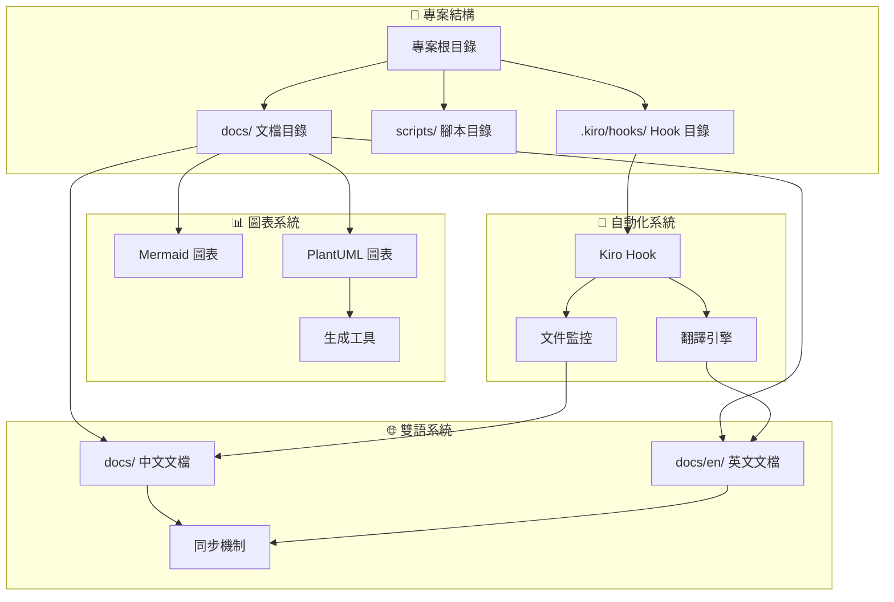
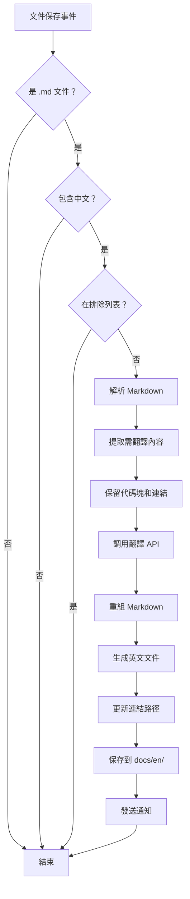
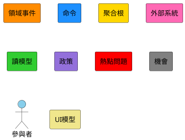

# 專案結構重整和圖表系統增強設計文檔

## 概述

本設計文檔詳細說明如何實現專案結構重整、雙語文檔系統和圖表系統增強，包括 Kiro Hook 自動翻譯機制的技術設計。

## 架構設計

### 整體架構



## 組件設計

### 1. 專案目錄結構設計

#### 新的目錄結構

```
genai-demo/
├── README.md                          # 主要說明文檔（中文）
├── README.en.md                       # 主要說明文檔（英文）
├── app/                               # 主應用程式
├── cmc-frontend/                      # Next.js 前端應用
├── consumer-frontend/                 # Angular 前端應用
├── deployment/                        # 部署相關檔案
├── docker/                           # Docker 相關檔案
├── scripts/                          # 腳本檔案
│   ├── generate-diagrams.sh         # 圖表生成腳本
│   ├── sync-docs.sh                 # 文檔同步腳本
│   └── validate-translations.sh     # 翻譯驗證腳本
├── tools/                            # 開發工具
│   └── plantuml.jar                 # PlantUML 工具
├── docs/                             # 中文文檔
│   ├── README.md                    # 文檔索引
│   ├── architecture/                # 架構文檔
│   │   ├── README.md
│   │   ├── overview.md
│   │   ├── hexagonal-architecture.md
│   │   ├── ddd-implementation.md
│   │   └── improvements-2025.md
│   ├── api/                         # API 文檔
│   │   ├── README.md
│   │   ├── versioning-strategy.md
│   │   └── openapi-spec.md
│   ├── diagrams/                    # 圖表文檔
│   │   ├── README.md
│   │   ├── mermaid/                # Mermaid 圖表
│   │   │   ├── architecture-overview.md
│   │   │   ├── hexagonal-architecture.md
│   │   │   └── event-driven-architecture.md
│   │   └── plantuml/               # PlantUML 圖表
│   │       ├── domain-model.puml
│   │       ├── sequence-diagrams/
│   │       └── event-storming/
│   ├── development/                 # 開發指南
│   │   ├── README.md
│   │   ├── getting-started.md
│   │   ├── coding-standards.md
│   │   └── testing-guide.md
│   ├── deployment/                  # 部署文檔
│   │   ├── README.md
│   │   ├── docker-guide.md
│   │   └── kubernetes-guide.md
│   ├── design/                      # 設計文檔
│   │   ├── README.md
│   │   ├── ddd-guide.md
│   │   ├── design-principles.md
│   │   └── refactoring-guide.md
│   ├── releases/                    # 發布說明
│   │   ├── README.md
│   │   └── 2025/
│   └── reports/                     # 報告文檔
│       ├── README.md
│       ├── project-summary-2025.md
│       ├── architecture-excellence-2025.md
│       └── technology-stack-2025.md
└── docs/en/                         # 英文文檔（鏡像結構）
    ├── README.md
    ├── architecture/
    ├── api/
    ├── diagrams/
    ├── development/
    ├── deployment/
    ├── design/
    ├── releases/
    └── reports/
```

### 2. Kiro Hook 設計

#### Hook 配置文件

```json
{
  "name": "Auto Translation Hook",
  "description": "Automatically translate Chinese markdown files to English",
  "trigger": {
    "event": "file.save",
    "pattern": "**/*.md",
    "exclude": [
      "docs/en/**",
      "node_modules/**",
      ".git/**"
    ]
  },
  "conditions": [
    {
      "type": "file_content",
      "pattern": "[\u4e00-\u9fff]",
      "description": "Contains Chinese characters"
    }
  ],
  "actions": [
    {
      "type": "translate_markdown",
      "source_lang": "zh-TW",
      "target_lang": "en",
      "preserve_code": true,
      "preserve_links": true,
      "output_path": "docs/en/{relative_path}"
    }
  ],
  "settings": {
    "batch_processing": true,
    "max_concurrent": 3,
    "timeout": 30000,
    "notification": true
  }
}
```

#### Hook 執行流程



### 3. 圖表系統設計

#### Mermaid 圖表組件

```typescript
interface MermaidDiagram {
  type: 'architecture' | 'sequence' | 'flowchart' | 'class';
  title: string;
  description: string;
  content: string;
  metadata: {
    version: string;
    lastUpdated: Date;
    author: string;
  };
}
```

#### PlantUML 圖表組件

```typescript
interface PlantUMLDiagram {
  type: 'class' | 'sequence' | 'component' | 'deployment' | 'usecase' | 
        'activity' | 'state' | 'object' | 'communication' | 'package' | 
        'composite-structure' | 'interaction-overview' | 'timing' | 'event-storming';
  sourceFile: string;
  outputFormats: ('png' | 'svg' | 'pdf')[];
  dependencies: string[];
  metadata: {
    version: string;
    lastUpdated: Date;
    complexity: 'simple' | 'medium' | 'complex';
    umlStandard: '2.5.1';
    category: 'structural' | 'behavioral' | 'interaction' | 'business';
  };
}

// UML 圖表分類
enum UMLDiagramCategory {
  STRUCTURAL = 'structural',      // 結構圖：類圖、對象圖、組件圖、部署圖、包圖、複合結構圖
  BEHAVIORAL = 'behavioral',      // 行為圖：用例圖、活動圖、狀態圖
  INTERACTION = 'interaction',    // 交互圖：時序圖、通信圖、交互概覽圖、時間圖
  BUSINESS = 'business'          // 業務圖：Event Storming、業務流程圖
}
```

### 4. 翻譯引擎設計

#### 翻譯處理器

```typescript
class MarkdownTranslator {
  private preservePatterns = [
    /```[\s\S]*?```/g,           // 代碼塊
    /`[^`]+`/g,                  // 行內代碼
    /\[([^\]]+)\]\([^)]+\)/g,    // 連結
    /!\[([^\]]*)\]\([^)]+\)/g,   // 圖片
    /{[^}]+}/g,                  // 變數
    /@\w+/g,                     // 註解
  ];

  async translateFile(filePath: string): Promise<string> {
    const content = await this.readFile(filePath);
    const preservedBlocks = this.extractPreservedBlocks(content);
    const translatedContent = await this.translateText(content);
    return this.restorePreservedBlocks(translatedContent, preservedBlocks);
  }

  private extractPreservedBlocks(content: string): Map<string, string> {
    // 提取需要保留的代碼塊和連結
  }

  private async translateText(content: string): Promise<string> {
    // 調用翻譯 API
  }

  private restorePreservedBlocks(content: string, blocks: Map<string, string>): string {
    // 恢復保留的塊
  }
}
```

### 5. 文檔同步機制

#### 同步狀態追蹤

```typescript
interface DocumentSyncStatus {
  chineseFile: string;
  englishFile: string;
  lastSyncTime: Date;
  chineseLastModified: Date;
  englishLastModified: Date;
  syncStatus: 'synced' | 'outdated' | 'missing' | 'conflict';
  autoTranslated: boolean;
}

class DocumentSyncManager {
  async checkSyncStatus(): Promise<DocumentSyncStatus[]> {
    // 檢查所有文檔的同步狀態
  }

  async syncDocument(chineseFile: string): Promise<void> {
    // 同步單個文檔
  }

  async batchSync(): Promise<void> {
    // 批量同步所有過期文檔
  }
}
```

### 6. Event Storming 顏色標準

#### 官方 Event Storming 顏色編碼

```typescript
enum EventStormingColors {
  DOMAIN_EVENT = '#FF8C00',      // 橙色 - 領域事件 (Domain Events)
  COMMAND = '#1E90FF',           // 藍色 - 命令 (Commands)
  AGGREGATE = '#FFD700',         // 黃色 - 聚合根 (Aggregates)
  EXTERNAL_SYSTEM = '#FF69B4',   // 粉色 - 外部系統 (External Systems)
  READ_MODEL = '#32CD32',        // 綠色 - 讀模型 (Read Models/Views)
  POLICY = '#9370DB',            // 紫色 - 政策 (Policies)
  HOTSPOT = '#FF0000',           // 紅色 - 熱點問題 (Hotspots)
  OPPORTUNITY = '#808080',       // 灰色 - 機會 (Opportunities)
  ACTOR = '#87CEEB',             // 淺藍色 - 參與者 (Actors/Users)
  UI_MOCKUP = '#F0E68C'          // 卡其色 - UI 模型 (UI Mockups)
}

interface EventStormingElement {
  type: 'domain-event' | 'command' | 'aggregate' | 'external-system' | 
        'read-model' | 'policy' | 'hotspot' | 'opportunity' | 'actor' | 'ui-mockup';
  color: EventStormingColors;
  text: string;
  position: { x: number; y: number };
  connections?: string[];
}
```

#### PlantUML Event Storming 模板



## 數據模型

### 文檔元數據

```typescript
interface DocumentMetadata {
  title: string;
  description: string;
  category: 'architecture' | 'api' | 'development' | 'deployment' | 'design' | 'reports';
  tags: string[];
  language: 'zh-TW' | 'en';
  version: string;
  lastUpdated: Date;
  author: string;
  reviewers: string[];
  translationStatus?: {
    autoTranslated: boolean;
    reviewRequired: boolean;
    lastTranslated: Date;
  };
}
```

### 圖表元數據

```typescript
interface DiagramMetadata {
  id: string;
  title: string;
  type: 'mermaid' | 'plantuml';
  category: 'architecture' | 'sequence' | 'class' | 'component' | 'event-storming';
  complexity: 'simple' | 'medium' | 'complex';
  dependencies: string[];
  relatedDocuments: string[];
  lastGenerated?: Date;
  outputFiles?: string[];
}
```

## 錯誤處理

### Hook 錯誤處理

```typescript
class HookErrorHandler {
  async handleTranslationError(error: TranslationError, context: HookContext): Promise<void> {
    switch (error.type) {
      case 'API_LIMIT_EXCEEDED':
        await this.scheduleRetry(context, 3600000); // 1 hour
        break;
      case 'INVALID_MARKDOWN':
        await this.notifyUser('Invalid markdown format', context.filePath);
        break;
      case 'NETWORK_ERROR':
        await this.scheduleRetry(context, 60000); // 1 minute
        break;
      default:
        await this.logError(error, context);
    }
  }
}
```

### 圖表生成錯誤處理

```typescript
class DiagramErrorHandler {
  async handleGenerationError(error: DiagramError, diagram: PlantUMLDiagram): Promise<void> {
    if (error.type === 'SYNTAX_ERROR') {
      await this.validateSyntax(diagram.sourceFile);
      await this.suggestFixes(error.details);
    } else if (error.type === 'DEPENDENCY_MISSING') {
      await this.installDependencies(diagram.dependencies);
    }
  }
}
```

## 性能考慮

### 翻譯性能優化

- 批處理多個文件的翻譯請求
- 緩存常用術語翻譯
- 增量翻譯（只翻譯變更部分）
- 並行處理多個翻譯任務

### 圖表生成優化

- 緩存生成的圖表文件
- 只在源文件變更時重新生成
- 並行生成多個圖表
- 壓縮輸出文件大小

## 測試策略

### Hook 測試

- 單元測試：翻譯邏輯、文件處理
- 整合測試：Hook 觸發機制
- 端到端測試：完整的翻譯流程

### 圖表測試

- 語法驗證測試
- 生成結果驗證
- 性能基準測試

### 文檔同步測試

- 同步狀態檢測
- 衝突解決機制
- 批量操作測試

## 部署和配置

### Hook 部署

1. 將 Hook 配置文件放置在 `.kiro/hooks/` 目錄
2. 配置翻譯 API 密鑰
3. 設置文件監控規則
4. 測試 Hook 觸發機制

### 圖表工具配置

1. 安裝 PlantUML JAR 文件到 `tools/` 目錄
2. 配置圖表生成腳本
3. 設置輸出目錄權限
4. 驗證圖表渲染效果

### 文檔結構遷移

1. 創建新的目錄結構
2. 遷移現有文檔到新位置
3. 更新所有內部連結
4. 生成英文版本文檔
5. 驗證連結完整性

這個設計提供了完整的技術架構來實現專案重整、雙語文檔系統和自動化翻譯功能。
