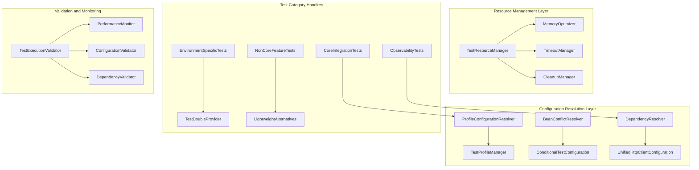

# Design Document

## Overview

This design document outlines a comprehensive solution for systematically reactivating 55 disabled tests across multiple categories. The solution addresses Spring Profile configuration conflicts, Bean definition issues, HTTP client dependency problems, memory constraints, and environment-specific functionality. The design provides a layered approach to fix different types of issues while maintaining system stability and test reliability.

## Architecture

### Current Problem Analysis

The 55 disabled tests suffer from multiple categories of interconnected issues:

1. **Configuration Issues (23 tests)**:
   - Spring Profile activation conflicts (ProfileActivationIntegrationTest - 7 tests)
   - Bean definition conflicts (HealthCheckIntegrationTest - 13 tests)
   - Test environment configuration problems

2. **Dependency Issues (12 tests)**:
   - HttpComponents dependency conflicts causing NoClassDefFoundError
   - TestRestTemplate configuration failures
   - AspectJ weaving conflicts

3. **Resource Constraints (8 tests)**:
   - Memory exhaustion in Prometheus metrics tests
   - Test execution timeouts
   - Insufficient JVM heap allocation

4. **Environment-Specific Features (12 tests)**:
   - Kubernetes probe tests not applicable in test environments
   - Swagger UI functionality tests for non-core features
   - Production-specific observability features

### Solution Architecture



## Components and Interfaces

### 1. Profile Configuration Resolver

**Purpose**: Resolve Spring Profile conflicts and ensure proper test environment setup.

```java
@TestConfiguration
@ConditionalOnProperty(name = "spring.profiles.active", havingValue = "test")
public class ProfileConfigurationResolver {
    
    @Bean
    @ConditionalOnMissingBean
    public ProfileConfigurationProperties testProfileProperties() {
        // Provide test-specific profile configuration
    }
    
    @Bean
    public ProfileActivationValidator profileValidator() {
        // Validate profile activation and detect conflicts
    }
    
    @EventListener
    public void handleProfileActivation(ApplicationEnvironmentPreparedEvent event) {
        // Ensure test profiles are properly activated
    }
}
```

### 2. Bean Conflict Resolver

**Purpose**: Eliminate Bean definition conflicts between test configurations.

```java
@TestConfiguration
@AutoConfigureBefore({HealthCheckConfiguration.class, TracingConfiguration.class})
public class BeanConflictResolver {
    
    @Bean
    @ConditionalOnProperty(name = "test.health.enabled", havingValue = "true", matchIfMissing = true)
    @Primary
    public HealthIndicator testHealthIndicator() {
        // Test-specific health indicator that doesn't conflict
    }
    
    @Bean
    @ConditionalOnProperty(name = "test.tracing.enabled", havingValue = "true", matchIfMissing = false)
    public TracingConfiguration testTracingConfiguration() {
        // Conditional tracing configuration for tests
    }
}
```

### 3. Unified HTTP Client Configuration

**Purpose**: Provide reliable HTTP client configuration for integration tests.

```java
@TestConfiguration
@Profile("test")
@ConditionalOnClass({TestRestTemplate.class, RestTemplate.class})
public class UnifiedHttpClientConfiguration {
    
    @Bean
    @Primary
    @ConditionalOnMissingBean
    public TestRestTemplate testRestTemplate() {
        // Unified TestRestTemplate with proper HttpComponents5 configuration
    }
    
    @Bean
    @Primary
    @ConditionalOnMissingBean  
    public RestTemplate testRestTemplate() {
        // Unified RestTemplate with consistent configuration
    }
    
    @Bean
    public ClientHttpRequestFactory clientHttpRequestFactory() {
        // Properly configured HttpComponents5 factory with error handling
    }
}
```

### 4. Test Resource Manager

**Purpose**: Manage memory allocation, timeouts, and resource cleanup for tests.

```java
@TestComponent
@Profile("test")
public class TestResourceManager {
    
    private final MemoryMonitor memoryMonitor;
    private final TimeoutManager timeoutManager;
    
    public void optimizeForTest(TestContext testContext) {
        // Optimize JVM settings and resource allocation for specific test
    }
    
    public void monitorMemoryUsage(String testName) {
        // Monitor memory usage during test execution
    }
    
    public void forceCleanup() {
        // Force garbage collection and resource cleanup
    }
    
    public boolean isMemoryAvailable(long requiredMemoryMB) {
        // Check if sufficient memory is available for test
    }
}
```

### 5. Environment-Specific Test Handler

**Purpose**: Handle tests that are specific to certain environments or non-core features.

```java
@TestConfiguration
public class EnvironmentSpecificTestHandler {
    
    @Bean
    @ConditionalOnProperty(name = "test.kubernetes.enabled", havingValue = "true", matchIfMissing = false)
    public KubernetesProbeTestDouble kubernetesProbeTestDouble() {
        // Test double for Kubernetes probe functionality
    }
    
    @Bean
    @ConditionalOnProperty(name = "test.swagger.enabled", havingValue = "true", matchIfMissing = false)
    public SwaggerTestValidator swaggerTestValidator() {
        // Lightweight Swagger validation for test environments
    }
    
    @Bean
    public ProductionFeatureTestDouble productionFeatureTestDouble() {
        // Test doubles for production-specific features
    }
}
```

### 3. Enhanced Test Base Classes

**Purpose**: Provide consistent test setup and utilities for integration tests.

```java
@SpringBootTest(webEnvironment = SpringBootTest.WebEnvironment.RANDOM_PORT)
@ActiveProfiles("test")
@Import(UnifiedTestHttpClientConfiguration.class)
public abstract class BaseIntegrationTest {
    
    @Autowired
    protected TestRestTemplate restTemplate;
    
    @LocalServerPort
    protected int port;
    
    protected String baseUrl;
    
    @BeforeEach
    void setUpBaseTest() {
        baseUrl = "http://localhost:" + port;
    }
}
```

### 4. Observability Test Validators

**Purpose**: Provide comprehensive validation of observability features.

```java
@Component
public class ObservabilityTestValidator {
    
    public ValidationResult validateMetricsEndpoint(String baseUrl, TestRestTemplate restTemplate);
    public ValidationResult validateHealthChecks(String baseUrl, TestRestTemplate restTemplate);
    public ValidationResult validateTracingConfiguration();
    public ValidationResult validateStructuredLogging();
}
```

## Data Models

### Test Configuration Model

```java
public record TestConfiguration(
    HttpClientType httpClientType,
    Duration connectionTimeout,
    Duration readTimeout,
    int maxConnections,
    boolean enableRetry,
    List<String> activeProfiles
) {
    public enum HttpClientType {
        SIMPLE_CLIENT_HTTP_REQUEST_FACTORY,
        HTTP_COMPONENTS_5,
        OK_HTTP
    }
}
```

### Test Validation Result Model

```java
public record ValidationResult(
    boolean success,
    String testName,
    Duration executionTime,
    List<String> errors,
    Map<String, Object> metrics,
    Optional<String> details
) {
    public static ValidationResult success(String testName, Duration executionTime) {
        return new ValidationResult(true, testName, executionTime, List.of(), Map.of(), Optional.empty());
    }
    
    public static ValidationResult failure(String testName, Duration executionTime, List<String> errors) {
        return new ValidationResult(false, testName, executionTime, errors, Map.of(), Optional.empty());
    }
}
```

## Error Handling

### HTTP Client Configuration Errors

1. **Dependency Resolution Failures**
   - Detect missing HttpComponents dependencies
   - Provide clear error messages with resolution steps
   - Fallback to SimpleClientHttpRequestFactory if needed

2. **Configuration Conflicts**
   - Detect multiple HTTP client configurations
   - Prioritize test configurations over production ones
   - Log configuration resolution decisions

### Test Execution Errors

1. **Connection Failures**
   - Implement retry mechanisms for transient failures
   - Provide detailed connection error diagnostics
   - Validate test environment setup before execution

2. **Resource Exhaustion**
   - Monitor memory usage during test execution
   - Implement proper resource cleanup
   - Provide early warnings for resource constraints

### Observability Validation Errors

1. **Endpoint Availability**
   - Validate that observability endpoints are accessible
   - Provide specific error messages for each endpoint type
   - Include suggestions for configuration fixes

2. **Data Format Validation**
   - Validate metrics format and content
   - Verify health check response structure
   - Ensure tracing data is properly formatted

## Testing Strategy

### Unit Testing

1. **Configuration Testing**
   - Test HTTP client bean creation
   - Validate configuration property binding
   - Test error handling scenarios

2. **Validator Testing**
   - Test observability validators in isolation
   - Mock external dependencies
   - Validate error handling and edge cases

### Integration Testing

1. **HTTP Client Integration**
   - Test actual HTTP requests using TestRestTemplate
   - Validate connection pooling and timeout behavior
   - Test retry mechanisms and error handling

2. **Observability Integration**
   - Test complete observability pipeline
   - Validate metrics collection and exposure
   - Test distributed tracing end-to-end

### End-to-End Testing

1. **Complete System Validation**
   - Test all observability features together
   - Validate system behavior under load
   - Test error scenarios and recovery

2. **Performance Validation**
   - Measure test execution times
   - Validate resource usage patterns
   - Ensure tests complete within time limits

## Implementation Strategy

### Phase 1: Dependency Resolution

1. **Audit Current Dependencies**
   - Review all HttpComponents dependencies in build.gradle
   - Identify version conflicts and missing dependencies
   - Document current configuration attempts

2. **Standardize Dependencies**
   - Use consistent HttpComponents5 versions
   - Remove conflicting or redundant dependencies
   - Add missing required dependencies

### Phase 2: Configuration Consolidation

1. **Create Unified Configuration**
   - Merge existing test configurations into single class
   - Remove redundant configuration classes
   - Implement proper bean prioritization

2. **Test Configuration Validation**
   - Create tests for configuration loading
   - Validate bean creation and injection
   - Test configuration in different profiles

### Phase 3: Test Reactivation

1. **Reactivate Simple Tests First**
   - Start with SimpleEndToEndValidationTest
   - Validate basic HTTP connectivity
   - Ensure health endpoints are accessible

2. **Reactivate Complex Tests**
   - Enable EndToEndIntegrationTest
   - Validate observability features
   - Test concurrent execution scenarios

### Phase 4: Optimization and Documentation

1. **Performance Optimization**
   - Optimize test execution times
   - Implement proper resource management
   - Add performance monitoring

2. **Documentation and Maintenance**
   - Create comprehensive test documentation
   - Provide troubleshooting guides
   - Establish maintenance procedures

## Configuration Management

### Test Profile Properties

```yaml
# application-test.yml
spring:
  profiles:
    active: test
  
  # HTTP Client Configuration
  http:
    client:
      factory: simple  # Use SimpleClientHttpRequestFactory by default
      connection-timeout: 5s
      read-timeout: 10s
      max-connections: 20
  
  # Test-specific overrides
  main:
    lazy-initialization: true
  jmx:
    enabled: false
  
  # Observability configuration for tests
  management:
    endpoints:
      web:
        exposure:
          include: health,metrics,prometheus,info
    endpoint:
      health:
        show-details: always
    metrics:
      export:
        prometheus:
          enabled: true

# Logging configuration for tests
logging:
  level:
    root: ERROR
    solid.humank.genaidemo: INFO
    org.springframework.web: DEBUG
    org.apache.http: DEBUG
```

### Gradle Configuration Updates

```gradle
dependencies {
    // Unified HttpComponents5 dependencies with consistent versions
    implementation 'org.apache.httpcomponents.client5:httpclient5:5.3.1'
    implementation 'org.apache.httpcomponents.core5:httpcore5:5.2.4'
    implementation 'org.apache.httpcomponents.core5:httpcore5-h2:5.2.4'
    
    // Test-specific HTTP client dependencies
    testImplementation 'org.apache.httpcomponents.client5:httpclient5:5.3.1'
    testImplementation 'org.apache.httpcomponents.core5:httpcore5:5.2.4'
    testImplementation 'org.apache.httpcomponents.client5:httpclient5-fluent:5.3.1'
}

// Test task optimization
tasks.withType(Test) {
    // Increased memory allocation for integration tests
    maxHeapSize = '4g'
    minHeapSize = '1g'
    
    // JVM arguments for HttpComponents
    jvmArgs += [
        '-Dorg.apache.commons.logging.Log=org.apache.commons.logging.impl.SimpleLog',
        '-Dorg.apache.commons.logging.simplelog.showdatetime=true',
        '-Dorg.apache.commons.logging.simplelog.log.org.apache.http=DEBUG'
    ]
}
```

## Monitoring and Observability

### Test Execution Monitoring

1. **Performance Metrics**
   - Test execution times
   - Memory usage patterns
   - HTTP request/response times
   - Resource utilization

2. **Error Tracking**
   - Configuration loading errors
   - HTTP client creation failures
   - Test execution failures
   - Resource exhaustion events

### Observability Feature Validation

1. **Metrics Validation**
   - Prometheus endpoint accessibility
   - Metrics format validation
   - Custom business metrics verification
   - Performance metrics accuracy

2. **Health Check Validation**
   - All health indicators status
   - Response time validation
   - Detailed health information
   - Custom health checks

3. **Tracing Validation**
   - Trace context propagation
   - Span creation and completion
   - Distributed tracing across services
   - Trace data export validation

This design provides a comprehensive solution for reactivating the disabled tests while establishing a robust foundation for future test development and maintenance.
