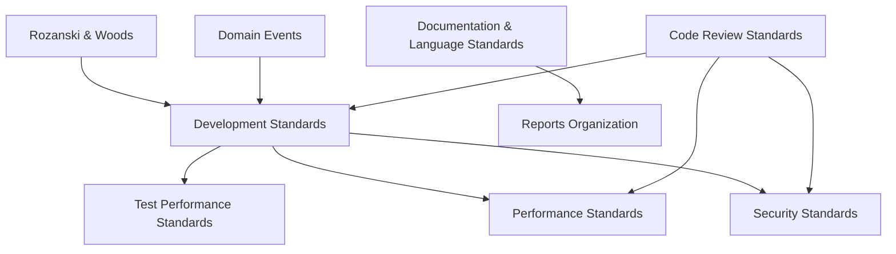

# Steering Rules Consolidation Design

## Overview

This design document outlines the technical approach for consolidating and streamlining the steering rules documentation. The goal is to reduce redundancy by 40%, decrease file count by 23%, and improve navigation while preserving all essential guidance.

## Architecture

### Document Hierarchy

```
.kiro/steering/
├── README.md (Navigation Hub - Redesigned)
│
├── Core Standards (Daily Reference)
│   ├── development-standards.md (Consolidated - Primary)
│   ├── code-review-standards.md
│   └── documentation-language-standards.md (NEW - Merged)
│
├── Specialized Standards (Domain-Specific)
│   ├── rozanski-woods-architecture-methodology.md
│   ├── security-standards.md
│   ├── performance-standards.md (Deduplicated)
│   ├── domain-events.md
│   └── diagram-generation-standards.md
│
└── Reference Standards (Deep Dive)
    ├── test-performance-standards.md (Detailed Reference)
    └── reports-organization-standards.md
```

### Content Flow Strategy

```
User Need → README Quick Start → Core Document → Specialized/Reference (if needed)
```

## Components and Interfaces

### Component 1: Merged Documentation-Language Standards

**Purpose:** Consolidate all language and documentation rules into a single, coherent document.

**Source Files:**
- `chinese-conversation-english-documentation.md`
- `english-documentation-standards.md`
- `datetime-accuracy-standards.md`

**Target File:** `documentation-language-standards.md`

**Structure:**
```markdown
# Documentation and Language Standards

## Overview
[Unified introduction]

## Language Usage Policy
### Conversation Language (Chinese)
[From chinese-conversation-english-documentation.md]

### Documentation Language (English)
[From english-documentation-standards.md]

### Language Switching Protocol
[From chinese-conversation-english-documentation.md]

## Documentation Quality Standards
### Writing Standards
[From english-documentation-standards.md]

### Date and Time Accuracy
[From datetime-accuracy-standards.md]

### Validation and Enforcement
[Merged from all sources]

## Tools and Resources
[Consolidated from all sources]

## Related Standards
- Development Standards - Code documentation requirements
- Reports Organization - File naming and structure
```

### Component 2: Deduplicated Development Standards

**Purpose:** Remove duplicate test performance content while maintaining essential overview.

**Changes to `development-standards.md`:**

**Remove:**
- Detailed test performance monitoring sections (lines ~600-1100)
- Duplicate Gradle test task configurations
- Detailed TestPerformanceExtension usage examples
- Memory management implementation details

**Keep:**
- Test classification standards (Unit/Integration/E2E)
- Test pyramid requirements
- Basic test performance requirements (< 50ms, < 500ms, < 3s)
- Brief overview of performance monitoring

**Add:**
- BDD/TDD principles section (from bdd-tdd-principles.md)
- Clear cross-reference to test-performance-standards.md

**New Structure for Test Section:**
```markdown
## Testing Standards

### Test Layer Requirements (Test Pyramid)
[Keep existing]

### Test Classification Standards
[Keep existing]

### Test Performance Requirements
> **🧪 Test Performance Monitoring**: For detailed test performance monitoring, 
> resource management, and optimization guidance, see 
> [Test Performance Standards](test-performance-standards.md)

**Quick Reference:**
- Unit tests: < 50ms, < 5MB
- Integration tests: < 500ms, < 50MB
- E2E tests: < 3s, < 500MB
- Use `@TestPerformanceExtension` for automatic monitoring
- Generate reports: `./gradlew generatePerformanceReport`

### BDD/TDD Development Process
[Moved from bdd-tdd-principles.md]

#### Gherkin Scenarios
[Content from bdd-tdd-principles.md]

#### Red-Green-Refactor Cycle
[Content from bdd-tdd-principles.md]
```

### Component 3: Deduplicated Performance Standards

**Purpose:** Remove duplicate test performance content and add clear cross-references.

**Changes to `performance-standards.md`:**

**Remove:**
- Duplicate test performance monitoring sections
- Duplicate @TestPerformanceExtension examples
- Duplicate Gradle test task configurations

**Replace with:**
```markdown
## Test Performance Integration

> **🧪 Test Performance Standards**: For comprehensive test performance monitoring,
> including detailed configuration, resource management, and troubleshooting,
> see [Test Performance Standards](test-performance-standards.md)

**Quick Reference:**
- Use `@TestPerformanceExtension` for integration tests
- Integration tests: < 500ms, < 50MB
- E2E tests: < 3s, < 500MB
- Generate reports: `./gradlew generatePerformanceReport`

**When to Use Test Performance Standards:**
- Setting up test performance monitoring
- Troubleshooting slow tests
- Configuring Gradle test tasks
- Understanding memory management in tests
```

### Component 4: Redesigned README

**Purpose:** Provide clear navigation and decision support.

**New Structure:**
```markdown
# Steering Rules Guide

## 🚀 Quick Start

### I need to...
- **Write code**: Start with [Development Standards](development-standards.md)
- **Review code**: Use [Code Review Standards](code-review-standards.md)
- **Write documentation**: See [Documentation & Language Standards](documentation-language-standards.md)
- **Design architecture**: Check [Rozanski & Woods Methodology](rozanski-woods-architecture-methodology.md)
- **Optimize performance**: Review [Performance Standards](performance-standards.md)
- **Implement security**: Follow [Security Standards](security-standards.md)

## 📚 Document Categories

### Core Standards (Read First)
Essential standards for daily development work.

| Document | Purpose | When to Use |
|----------|---------|-------------|
| [Development Standards](development-standards.md) | Primary development guide | Daily coding, testing, architecture |
| [Code Review Standards](code-review-standards.md) | Review process and checklist | Before and during code reviews |
| [Documentation & Language Standards](documentation-language-standards.md) | Writing and language rules | Creating any documentation |

### Specialized Standards (Domain-Specific)
Deep-dive standards for specific areas.

| Document | Purpose | When to Use |
|----------|---------|-------------|
| [Rozanski & Woods Methodology](rozanski-woods-architecture-methodology.md) | Architecture viewpoints | Designing system architecture |
| [Security Standards](security-standards.md) | Security implementation | Implementing auth, encryption, etc. |
| [Performance Standards](performance-standards.md) | Performance optimization | Optimizing system performance |
| [Domain Events](domain-events.md) | DDD event patterns | Implementing domain events |
| [Diagram Generation](diagram-generation-standards.md) | PlantUML/Mermaid standards | Creating technical diagrams |

### Reference Standards (Deep Dive)
Detailed technical references for specific topics.

| Document | Purpose | When to Use |
|----------|---------|-------------|
| [Test Performance Standards](test-performance-standards.md) | Test performance deep dive | Troubleshooting test performance |
| [Reports Organization](reports-organization-standards.md) | Report structure and naming | Organizing project reports |

## 🎯 Common Scenarios

### Starting a New Feature
1. Review [Development Standards](development-standards.md) - Architecture and testing
2. Check [Rozanski & Woods Methodology](rozanski-woods-architecture-methodology.md) - Viewpoint analysis
3. Follow [Domain Events](domain-events.md) - If using DDD patterns

### Fixing Performance Issues
1. Start with [Performance Standards](performance-standards.md) - General optimization
2. For test performance: [Test Performance Standards](test-performance-standards.md)
3. Review [Development Standards](development-standards.md) - Database and caching patterns

### Writing Documentation
1. Follow [Documentation & Language Standards](documentation-language-standards.md) - Language rules
2. Use [Diagram Generation Standards](diagram-generation-standards.md) - For technical diagrams
3. Check [Reports Organization](reports-organization-standards.md) - For report structure

## 📖 Document Relationships



## 🔄 Recent Changes

- **2025-01-XX**: Consolidated language and documentation standards
- **2025-01-XX**: Removed duplicate test performance content
- **2025-01-XX**: Merged BDD/TDD principles into development standards
- **2025-01-XX**: Redesigned README for better navigation

## 📝 Contributing

When updating steering rules:
1. Avoid duplicating content across files
2. Use cross-references for related content
3. Follow the standard document structure
4. Update this README if adding new documents
```

## Data Models

### Cross-Reference Format

**Standard Format:**
```markdown
> **📋 Topic Name**: Brief description of what's available in the linked document
> - Key point 1
> - Key point 2
> 
> See [Document Name](link) for detailed guidance.
```

**Example:**
```markdown
> **🧪 Test Performance Monitoring**: Detailed test performance monitoring framework
> - TestPerformanceExtension configuration
> - Gradle test task optimization
> - Memory management and resource cleanup
> - Performance report generation
> 
> See [Test Performance Standards](test-performance-standards.md) for complete reference.
```

### Document Metadata

Each document should include front matter:
```markdown
---
category: core | specialized | reference
last-updated: YYYY-MM-DD
related-docs:
  - document-name.md
  - another-document.md
---
```

## Error Handling

### Migration Safety

**Backup Strategy:**
1. Create backup branch before consolidation
2. Keep original files in `legacy/` folder temporarily
3. Validate all cross-references after migration
4. Run link checker to ensure no broken links

**Validation Checklist:**
- [ ] All cross-references are valid
- [ ] No content is lost during merge
- [ ] README links are correct
- [ ] Document structure is consistent
- [ ] No duplicate content remains

### Rollback Plan

If issues are discovered:
1. Restore from backup branch
2. Identify specific problem areas
3. Fix issues incrementally
4. Re-validate before final merge

## Testing Strategy

### Validation Tests

**1. Content Completeness Test**
- Compare line counts and key sections
- Verify all unique content is preserved
- Check that examples are not lost

**2. Cross-Reference Test**
- Run link checker on all markdown files
- Verify all internal links work
- Check that cross-references provide context

**3. Structure Consistency Test**
- Verify all documents follow standard structure
- Check that headings are consistent
- Validate markdown formatting

**4. Duplication Detection Test**
- Search for duplicate code examples
- Identify repeated explanations
- Flag similar content across files

### Manual Review Checklist

- [ ] README provides clear navigation
- [ ] Core documents are easily accessible
- [ ] Specialized documents are clearly marked
- [ ] Cross-references are helpful and minimal
- [ ] No essential guidance is lost
- [ ] Document structure is consistent
- [ ] File count is reduced as planned
- [ ] Duplicate content is eliminated

## Implementation Plan

### Phase 1: Preparation (Week 1)
1. Create backup branch
2. Set up validation tools
3. Document current state metrics

### Phase 2: Content Consolidation (Week 1-2)
1. Create `documentation-language-standards.md`
2. Merge language-related files
3. Validate merged content

### Phase 3: Deduplication (Week 2)
1. Remove duplicate test performance content from `development-standards.md`
2. Remove duplicate test performance content from `performance-standards.md`
3. Add cross-references
4. Merge BDD/TDD content

### Phase 4: README Redesign (Week 2)
1. Create new README structure
2. Add quick start section
3. Create document relationship diagram
4. Add common scenarios

### Phase 5: Validation (Week 3)
1. Run all validation tests
2. Manual review of all changes
3. Fix any issues found
4. Final verification

### Phase 6: Cleanup (Week 3)
1. Move old files to legacy folder
2. Update any external references
3. Document changes
4. Archive backup branch

## Success Metrics

### Quantitative Metrics
- File count: 13 → 10 (23% reduction) ✓
- Duplicate content: Reduced by ~40% ✓
- README length: < 200 lines ✓
- Cross-references: Standardized format ✓

### Qualitative Metrics
- Developer feedback: Easier to find information
- Maintenance effort: Reduced update time
- Onboarding time: Faster for new team members
- Navigation clarity: Clear path to needed information

## Related Decisions

- ADR-001: Consolidate steering rules for better maintainability
- ADR-002: Standardize cross-reference format
- ADR-003: Establish document hierarchy (core/specialized/reference)

## Notes

### Design Decisions

**Why merge language standards?**
- All three files deal with documentation quality
- Natural grouping by topic
- Reduces context switching

**Why keep test-performance-standards.md separate?**
- Highly specialized content
- Used as deep reference, not daily guide
- Clear separation of concerns

**Why move BDD/TDD to development-standards.md?**
- Core development practice
- Frequently referenced together
- Reduces file count without losing accessibility

### Future Considerations

- Consider adding search functionality to README
- May need to split development-standards.md if it grows too large
- Could add interactive decision tree for finding right document
- Consider adding examples section to each document
