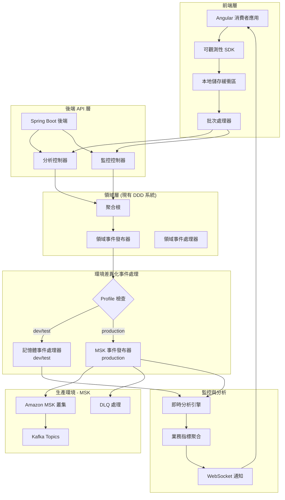

# 前端後端可觀測性整合設計

## 概述

本設計文件概述了 Angular 消費者前端與 Spring Boot 後端之間可觀測性能力的全面整合，為電商系統創建統一的全棧監控和分析平台。

設計重點在於建立從前端用戶互動到後端業務指標的無縫數據流，實現對用戶行為、系統效能和業務成果的完整可見性。解決方案建立在現有強大的後端可觀測性基礎設施之上，同時添加全面的前端監控能力。

### 核心設計原則

1. **端到端可追溯性**: 每個用戶請求都可以從前端追蹤到資料庫
2. **即時分析**: 業務指標可近即時提供以供決策制定
3. **效能優先**: 監控開銷不得影響用戶體驗
4. **可擴展架構**: 設計支援大量數據收集和處理
5. **隱私合規**: 所有數據收集都尊重用戶隱私和法規要求

## 架構

### 高層架構



### 數據流架構

#### 開發/測試環境數據流

1. **前端收集**: 透過可觀測性 SDK 收集用戶互動和效能指標
2. **批次處理**: 數據在本地緩衝並以優化批次發送到後端
3. **領域事件轉換**: 後端將前端事件轉換為領域事件
4. **記憶體處理**: 事件在記憶體中處理，支援快速開發和測試
5. **即時分析**: 基於記憶體事件的即時指標計算

#### 生產環境數據流

1. **前端收集**: 同開發環境的事件收集機制
2. **批次處理**: 同樣的批次處理策略
3. **領域事件發布**: 事件透過現有 DDD 系統發布到 MSK
4. **MSK 分散式處理**: 事件在 Kafka 中持久化和分散式處理
5. **多消費者處理**: 支援多個消費者進行不同類型的分析處理
6. **DLQ 錯誤處理**: 失敗事件進入死信佇列進行後續處理

## 組件和介面

### 前端組件

#### 1. 可觀測性 SDK (`ObservabilityService`)

```typescript
interface ObservabilityService {
  // 用戶行為追蹤
  trackPageView(page: string, metadata?: Record<string, any>): void;
  trackUserAction(action: string, context: Record<string, any>): void;
  trackBusinessEvent(event: BusinessEvent): void;
  
  // 效能監控
  trackPerformanceMetric(metric: PerformanceMetric): void;
  trackApiCall(request: ApiCallMetric): void;
  
  // 錯誤追蹤
  trackError(error: ErrorEvent): void;
  
  // 配置
  configure(config: ObservabilityConfig): void;
  flush(): Promise<void>;
}

interface BusinessEvent {
  type: 'product_view' | 'cart_add' | 'purchase_complete' | 'search' | 'filter_apply';
  data: Record<string, any>;
  timestamp: number;
  sessionId: string;
  userId?: string;
}

interface PerformanceMetric {
  type: 'lcp' | 'fid' | 'cls' | 'ttfb' | 'page_load';
  value: number;
  page: string;
  timestamp: number;
}
```

#### 2. 批次處理服務 (`BatchProcessor`)

```typescript
interface BatchProcessor {
  addEvent(event: ObservabilityEvent): void;
  processBatch(): Promise<void>;
  configure(config: BatchConfig): void;
}

interface BatchConfig {
  maxBatchSize: number;        // 預設: 50 個事件
  maxWaitTime: number;         // 預設: 30 秒
  retryAttempts: number;       // 預設: 3 次
  backoffMultiplier: number;   // 預設: 2
}
```

#### 3. 本地儲存管理器 (`StorageManager`)

```typescript
interface StorageManager {
  store(events: ObservabilityEvent[]): void;
  retrieve(): ObservabilityEvent[];
  clear(): void;
  getStorageSize(): number;
  isStorageAvailable(): boolean;
}
```

### 後端組件

#### 1. 分析控制器

```java
@RestController
@RequestMapping("/../api/analytics")
@Validated
public class AnalyticsController {
    
    private final ObservabilityEventService observabilityEventService;
    private final ObservabilityTraceContextManager traceContextManager;
    
    @PostMapping("/events")
    public ResponseEntity<Void> receiveEvents(
        @Valid @RequestBody List<AnalyticsEventDto> events,
        @RequestHeader("X-Trace-Id") String traceId,
        @RequestHeader("X-Session-Id") String sessionId
    ) {
        // 立即設定 MDC 上下文以確保所有後續處理都有正確的 correlation ID
        traceContextManager.setObservabilityContext(traceId, sessionId);
        
        try {
            logger.info("Received {} analytics events [correlationId: {}]", events.size(), traceId);
            
            // 處理事件 (內部會重新設定 MDC，但這裡先設定確保 Controller 層的日誌正確)
            observabilityEventService.processAnalyticsEvents(events, traceId, sessionId);
            
            return ResponseEntity.ok().build();
            
        } finally {
            // 清理 MDC 上下文
            traceContextManager.clearObservabilityContext();
        }
    }
    
    @PostMapping("/performance")
    public ResponseEntity<Void> receivePerformanceMetrics(
        @Valid @RequestBody List<PerformanceMetricDto> metrics,
        @RequestHeader("X-Trace-Id") String traceId,
        @RequestHeader("X-Session-Id") String sessionId
    ) {
        traceContextManager.setObservabilityContext(traceId, sessionId);
        
        try {
            logger.info("Received {} performance metrics [correlationId: {}]", metrics.size(), traceId);
            
            observabilityEventService.processPerformanceMetrics(metrics, traceId, sessionId);
            
            return ResponseEntity.ok().build();
            
        } finally {
            traceContextManager.clearObservabilityContext();
        }
    }
    
    @GetMapping("/stats")
    public ResponseEntity<AnalyticsStatsDto> getStats(
        @RequestParam String timeRange,
        @RequestParam(required = false) String filter,
        @RequestHeader(value = "X-Trace-Id", required = false) String traceId
    ) {
        // 為查詢操作也設定追蹤上下文
        if (traceId != null) {
            traceContextManager.setObservabilityContext(traceId, null);
        }
        
        try {
            // 實作統計查詢邏輯
            AnalyticsStatsDto stats = analyticsStatsService.getStats(timeRange, filter);
            return ResponseEntity.ok(stats);
            
        } finally {
            if (traceId != null) {
                traceContextManager.clearObservabilityContext();
            }
        }
    }
}
```

#### 2. 環境差異化事件處理服務

```java
@Service
@Transactional
public class ObservabilityEventService {
    
    private final DomainEventApplicationService domainEventService;
    private final ObservabilityTraceContextManager traceContextManager;
    
    public void processAnalyticsEvents(List<AnalyticsEventDto> events, String traceId, String sessionId) {
        // 設定 MDC 上下文，整合現有追蹤系統
        traceContextManager.setObservabilityContext(traceId, sessionId);
        
        try {
            logger.info("Processing {} analytics events [correlationId: {}]", events.size(), traceId);
            
            // 轉換為領域事件
            List<DomainEvent> domainEvents = convertToAnalyticsEvents(events, traceId);
            
            // 透過現有 DDD 系統發布事件 (會自動使用 MDC 中的 correlationId)
            domainEvents.forEach(domainEventService::publishEvent);
            
            logger.debug("Successfully processed analytics events [correlationId: {}]", traceId);
            
        } finally {
            // 清理 MDC 上下文
            traceContextManager.clearObservabilityContext();
        }
    }
    
    public void processPerformanceMetrics(List<PerformanceMetricDto> metrics, String traceId, String sessionId) {
        // 設定 MDC 上下文
        traceContextManager.setObservabilityContext(traceId, sessionId);
        
        try {
            logger.info("Processing {} performance metrics [correlationId: {}]", metrics.size(), traceId);
            
            // 轉換為效能領域事件
            List<DomainEvent> performanceEvents = convertToPerformanceEvents(metrics, traceId);
            
            // 發布效能事件 (會自動使用 MDC 中的 correlationId)
            performanceEvents.forEach(domainEventService::publishEvent);
            
            logger.debug("Successfully processed performance metrics [correlationId: {}]", traceId);
            
        } finally {
            // 清理 MDC 上下文
            traceContextManager.clearObservabilityContext();
        }
    }
}

@Component
public class ObservabilityEventPublisher {
    
    @Value("${genai-demo.events.publisher:in-memory}")
    private String publisherType;
    
    @EventListener
    public void handleAnalyticsEvent(AnalyticsEventReceivedEvent event) {
        if ("kafka".equals(publisherType)) {
            // 生產環境：發布到 MSK
            publishToKafka(event);
        } else {
            // 開發/測試環境：記憶體處理
            processInMemory(event);
        }
    }
}
```

#### 3. Profile-Aware 即時分析引擎

```java
@Component
public class ProfileAwareAnalyticsEngine {
    
    @Value("${spring.profiles.active}")
    private String activeProfile;
    
    @EventListener
    @ConditionalOnProperty(name = "genai-demo.events.publisher", havingValue = "in-memory")
    public void handleInMemoryAnalyticsEvent(AnalyticsEventReceivedEvent event) {
        // 開發/測試環境的即時處理
        processEventInMemory(event);
        updateRealTimeMetrics(event);
    }
    
    @KafkaListener(topics = "#{@kafkaTopicConfig.getAnalyticsTopicName()}")
    @ConditionalOnProperty(name = "genai-demo.events.publisher", havingValue = "kafka")
    public void handleKafkaAnalyticsEvent(AnalyticsEventReceivedEvent event) {
        // 生產環境的 Kafka 事件處理
        processEventFromKafka(event);
        updateRealTimeMetrics(event);
    }
    
    private void updateRealTimeMetrics(AnalyticsEventReceivedEvent event) {
        // 統一的指標更新邏輯
        metricsService.updateBusinessMetrics(event);
        webSocketService.broadcastUpdate(event);
    }
}
```

### 整合介面

#### 1. 追蹤 ID 傳播

```typescript
// 前端 HTTP 攔截器
@Injectable()
export class ObservabilityTraceInterceptor implements HttpInterceptor {
  intercept(req: HttpRequest<any>, next: HttpHandler): Observable<HttpEvent<any>> {
    const traceId = this.generateOrGetTraceId();
    const sessionId = this.sessionService.getSessionId();
    
    // 設定追蹤標頭，與後端 MDC 系統整合
    const tracedReq = req.clone({
      setHeaders: {
        'X-Trace-Id': traceId,        // 對應後端 MDC correlationId
        'X-Session-Id': sessionId,    // 對應後端 MDC sessionId
        'X-Correlation-Id': traceId   // 明確的 correlation ID
      }
    });
    
    // 在前端也維護 trace context
    this.observabilityContext.setCurrentTrace(traceId, sessionId);
    
    return next.handle(tracedReq);
  }
  
  private generateOrGetTraceId(): string {
    // 檢查是否已有 trace ID (例如從 session storage)
    let traceId = this.observabilityContext.getCurrentTraceId();
    if (!traceId) {
      traceId = this.generateUniqueTraceId();
      this.observabilityContext.setCurrentTrace(traceId, this.sessionService.getSessionId());
    }
    return traceId;
  }
  
  private generateUniqueTraceId(): string {
    // 生成與後端 MDC 兼容的 trace ID 格式
    return `trace-${Date.now()}-${Math.random().toString(36).substr(2, 9)}`;
  }
}
```

```java
// 後端追蹤上下文 (整合現有 MDC 系統)
@Component
public class ObservabilityTraceContextManager {
    
    private static final String TRACE_ID_HEADER = "X-Trace-Id";
    private static final String SESSION_ID_HEADER = "X-Session-Id";
    private static final String CORRELATION_ID_KEY = "correlationId";
    private static final String TRACE_ID_KEY = "traceId";
    private static final String SESSION_ID_KEY = "sessionId";
    
    public void setObservabilityContext(String traceId, String sessionId) {
        // 整合現有 MDC 系統
        MDC.put(CORRELATION_ID_KEY, traceId); // 使用 traceId 作為 correlationId
        MDC.put(TRACE_ID_KEY, traceId);
        MDC.put(SESSION_ID_KEY, sessionId);
    }
    
    public String getCurrentTraceId() {
        return MDC.get(TRACE_ID_KEY);
    }
    
    public String getCurrentCorrelationId() {
        return MDC.get(CORRELATION_ID_KEY);
    }
    
    public String getCurrentSessionId() {
        return MDC.get(SESSION_ID_KEY);
    }
    
    public void clearObservabilityContext() {
        MDC.remove(CORRELATION_ID_KEY);
        MDC.remove(TRACE_ID_KEY);
        MDC.remove(SESSION_ID_KEY);
    }
}
```

#### 2. WebSocket 即時更新

```typescript
// 前端 WebSocket 服務
@Injectable()
export class RealTimeAnalyticsService {
  private socket: WebSocket;
  
  connect(): void;
  subscribe(channel: string, callback: (data: any) => void): void;
  unsubscribe(channel: string): void;
  disconnect(): void;
}
```

```java
// 後端 WebSocket 配置
@Configuration
@EnableWebSocket
public class WebSocketConfig implements WebSocketConfigurer {
    
    @Override
    public void registerWebSocketHandlers(WebSocketHandlerRegistry registry) {
        registry.addHandler(new AnalyticsWebSocketHandler(), "/ws/analytics")
                .setAllowedOrigins("*");
    }
}
```

## 數據模型

### 前端數據模型

```typescript
interface ObservabilityEvent {
  id: string;
  type: EventType;
  timestamp: number;
  sessionId: string;
  userId?: string;
  traceId: string;
  data: Record<string, any>;
}

interface UserBehaviorEvent extends ObservabilityEvent {
  type: 'page_view' | 'user_action' | 'business_event';
  page?: string;
  action?: string;
  duration?: number;
}

interface PerformanceEvent extends ObservabilityEvent {
  type: 'performance_metric';
  metricType: 'lcp' | 'fid' | 'cls' | 'ttfb';
  value: number;
  page: string;
}

interface ErrorEvent extends ObservabilityEvent {
  type: 'error';
  errorType: 'javascript' | 'api' | 'network';
  message: string;
  stack?: string;
  url?: string;
}
```

### 後端數據模型

```java
// 可觀測性領域事件 (整合現有 DDD 系統)
public record UserBehaviorAnalyticsEvent(
    String eventId,
    String eventType,
    String sessionId,
    Optional<String> userId,
    String traceId,
    Map<String, Object> eventData,
    LocalDateTime receivedAt,
    UUID domainEventId,
    LocalDateTime occurredOn
) implements DomainEvent {
    
    public static UserBehaviorAnalyticsEvent create(
        String eventId,
        String eventType,
        String sessionId,
        Optional<String> userId,
        String traceId,
        Map<String, Object> eventData
    ) {
        DomainEvent.EventMetadata metadata = DomainEvent.createEventMetadata();
        return new UserBehaviorAnalyticsEvent(
            eventId, eventType, sessionId, userId, traceId, eventData,
            LocalDateTime.now(), metadata.eventId(), metadata.occurredOn()
        );
    }
    
    @Override
    public String getAggregateId() { return sessionId; }
    
    @Override
    public String getEventType() {
        return "UserBehaviorAnalytics";
    }
}

public record PerformanceMetricReceivedEvent(
    String metricId,
    String metricType,
    double value,
    String page,
    String sessionId,
    String traceId,
    LocalDateTime receivedAt,
    UUID domainEventId,
    LocalDateTime occurredOn
) implements DomainEvent {
    
    public static PerformanceMetricReceivedEvent create(
        String metricId,
        String metricType,
        double value,
        String page,
        String sessionId,
        String traceId
    ) {
        DomainEvent.EventMetadata metadata = DomainEvent.createEventMetadata();
        return new PerformanceMetricReceivedEvent(
            metricId, metricType, value, page, sessionId, traceId,
            LocalDateTime.now(), metadata.eventId(), metadata.occurredOn()
        );
    }
    
    @Override
    public String getAggregateId() { return sessionId; }
    
    @Override
    public String getEventType() {
        return "PerformanceMetricReceived";
    }
}
```

```java
// 可觀測性會話聚合根 (整合現有 DDD 架構)
@AggregateRoot(name = "ObservabilitySession", description = "可觀測性會話聚合根", boundedContext = "Observability", version = "1.0")
public class ObservabilitySession implements AggregateRootInterface {
    
    private final SessionId sessionId;
    private final Optional<UserId> userId;
    private final LocalDateTime startTime;
    private LocalDateTime lastActivity;
    private final List<UserBehaviorEvent> behaviorEvents;
    private final List<PerformanceMetric> performanceMetrics;
    
    public void recordUserBehavior(UserBehaviorEvent event) {
        validateEvent(event);
        this.behaviorEvents.add(event);
        this.lastActivity = LocalDateTime.now();
        
        // 發布用戶行為分析事件
        collectEvent(UserBehaviorAnalyticsEvent.create(
            event.getEventId(),
            event.getEventType(),
            sessionId.getValue(),
            userId.map(UserId::getValue),
            event.getTraceId(),
            event.getData()
        ));
    }
    
    public void recordPerformanceMetric(PerformanceMetric metric) {
        validatePerformanceMetric(metric);
        this.performanceMetrics.add(metric);
        this.lastActivity = LocalDateTime.now();
        
        // 發布效能指標事件
        collectEvent(PerformanceMetricReceivedEvent.create(
            metric.getMetricId(),
            metric.getMetricType(),
            metric.getValue(),
            metric.getPage(),
            sessionId.getValue(),
            metric.getTraceId()
        ));
    }
    
    // 整合現有 DDD 事件系統
    public void publishCollectedEvents() {
        // 事件將根據 profile 配置自動路由到記憶體或 MSK
        // 透過 DomainEventApplicationService 處理
    }
}
```

### 環境差異化配置

#### 開發/測試環境配置

```yaml
# application-dev.yml / application-test.yml
genai-demo:
  events:
    publisher: in-memory  # 記憶體事件處理
    async: false         # 同步處理便於除錯
  observability:
    analytics:
      enabled: true
      storage: in-memory  # 指標存在記憶體中
      retention-minutes: 60
```

#### 生產環境配置 (MSK Profile)

```yaml
# application-msk.yml (生產環境啟用)
spring:
  kafka:
    bootstrap-servers: ${MSK_BOOTSTRAP_SERVERS}
    security:
      protocol: SASL_SSL
    sasl:
      mechanism: AWS_MSK_IAM

genai-demo:
  events:
    publisher: kafka     # MSK 事件處理
    async: true         # 非同步處理
  domain-events:
    topic:
      prefix: genai-demo.${spring.profiles.active}
      partitions: 6
      replication-factor: 3
      # 可觀測性專用 topics
      observability:
        user-behavior: genai-demo.${spring.profiles.active}.observability.user.behavior
        performance-metrics: genai-demo.${spring.profiles.active}.observability.performance.metrics
        business-analytics: genai-demo.${spring.profiles.active}.observability.business.analytics
    publishing:
      enabled: true
      async: true
      dlq:
        enabled: true    # 死信佇列處理
        topic-suffix: .dlq
```

#### Kafka Topic 結構 (與 CDK 配置一致)

**現有業務領域事件 Topics (CDK 已定義)**:

```
genai-demo.${environment}.customer.created
genai-demo.${environment}.customer.updated
genai-demo.${environment}.order.created
genai-demo.${environment}.order.confirmed
genai-demo.${environment}.order.cancelled
genai-demo.${environment}.payment.processed
genai-demo.${environment}.payment.failed
genai-demo.${environment}.inventory.reserved
genai-demo.${environment}.inventory.released
genai-demo.${environment}.product.created
genai-demo.${environment}.product.updated
```

**新增可觀測性事件 Topics (需要在 CDK 中添加)**:

```
# 用戶行為分析事件
genai-demo.${environment}.observability.user.behavior

# 效能指標事件  
genai-demo.${environment}.observability.performance.metrics

# 業務分析事件
genai-demo.${environment}.observability.business.analytics

# 死信佇列
genai-demo.${environment}.observability.user.behavior.dlq
genai-demo.${environment}.observability.performance.metrics.dlq
genai-demo.${environment}.observability.business.analytics.dlq
```

**Topic 命名規範**:

- 格式: `${projectName}.${environment}.${domain}.${event}`
- 分隔符: 使用 `.` (點) 而非 `-` (破折號)
- 環境變數: 透過 `${spring.profiles.active}` 動態設定

#### 與現有 MDC 追蹤系統整合

**現有系統使用 MDC (Mapped Diagnostic Context)**:

- `correlationId`: 主要的追蹤識別碼
- `traceId`: OpenTelemetry 追蹤 ID  
- `sessionId`: 用戶會話 ID

**整合策略**:

```java
// 現有系統已在 InMemoryDomainEventPublisher 中使用 MDC
String correlationId = MDC.get("correlationId");
if (correlationId == null) {
    correlationId = event.getEventId().toString();
    MDC.put("correlationId", correlationId);
}
```

**可觀測性系統的 MDC 整合**:

- 前端的 `X-Trace-Id` 對應後端的 `correlationId`
- 保持與現有日誌格式的兼容性
- 重用現有的 logback-spring.xml 配置中的 `%mdc` 模式

**日誌輸出格式 (現有)**:

```
# 開發環境
[%X{traceId:-},%X{spanId:-},%X{correlationId:-}]

# 生產環境  
[%X{correlationId:-}]

# JSON 格式
"mdc": "%mdc"
```

#### CDK 配置更新需求

需要在 `infrastructure/lib/stacks/msk-stack.ts` 中添加可觀測性 topics：

```typescript
// 在 createOutputs 方法中更新 domainEventTopics 陣列
const domainEventTopics = [
    // 現有業務領域事件
    'customer.created',
    'customer.updated',
    'order.created',
    'order.confirmed',
    'order.cancelled',
    'payment.processed',
    'payment.failed',
    'inventory.reserved',
    'inventory.released',
    'product.created',
    'product.updated',
    
    // 新增可觀測性事件
    'observability.user.behavior',
    'observability.performance.metrics',
    'observability.business.analytics'
];
```

**Topic 命名規範**:

- 格式: `${projectName}.${environment}.${domain}.${event}`
- 分隔符: 使用 `.` (點) 而非 `-` (破折號)
- 環境變數: 透過 `${spring.profiles.active}` 動態設定

## 錯誤處理

### 前端錯誤處理策略

#### 1. 網路韌性

```typescript
@Injectable()
export class ResilientHttpService {
  
  sendAnalyticsData(data: any[]): Observable<any> {
    return this.http.post('/../api/analytics/events', data).pipe(
      retry({
        count: 3,
        delay: (error, retryCount) => timer(Math.pow(2, retryCount) * 1000)
      }),
      catchError(error => {
        // 儲存失敗的數據以供稍後重試
        this.storageManager.store(data);
        return of(null);
      })
    );
  }
}
```

#### 2. 離線支援

```typescript
@Injectable()
export class OfflineManager {
  
  private isOnline = navigator.onLine;
  
  constructor() {
    window.addEventListener('online', () => {
      this.isOnline = true;
      this.flushOfflineData();
    });
    
    window.addEventListener('offline', () => {
      this.isOnline = false;
    });
  }
  
  private async flushOfflineData(): Promise<void> {
    const offlineData = this.storageManager.retrieve();
    if (offlineData.length > 0) {
      await this.batchProcessor.processBatch(offlineData);
      this.storageManager.clear();
    }
  }
}
```

### 環境差異化錯誤處理策略

#### 1. Profile-Aware 事件處理韌性

```java
@Component
public class ProfileAwareEventProcessor {
    
    @Value("${genai-demo.events.publisher}")
    private String publisherType;
    
    @Retryable(
        value = {TransientException.class},
        maxAttempts = 3,
        backoff = @Backoff(delay = 1000, multiplier = 2)
    )
    public void processObservabilityEvent(UserBehaviorAnalyticsEvent event) {
        try {
            if ("kafka".equals(publisherType)) {
                // 生產環境：MSK 處理
                processEventWithKafka(event);
            } else {
                // 開發/測試環境：記憶體處理
                processEventInMemory(event);
            }
        } catch (Exception e) {
            logger.error("Failed to process observability event: {} for trace: {} in {} mode", 
                event.eventId(), event.traceId(), publisherType, e);
            throw e;
        }
    }
    
    @Recover
    public void recoverFromEventProcessingFailure(TransientException ex, UserBehaviorAnalyticsEvent event) {
        if ("kafka".equals(publisherType)) {
            // 生產環境：發送到 MSK DLQ
            kafkaDeadLetterService.send(event, ex);
        } else {
            // 開發環境：記錄到檔案或記憶體
            inMemoryDeadLetterService.store(event, ex);
        }
        
        // 觸發環境適當的警報
        alertService.triggerAlert(AlertType.EVENT_PROCESSING_FAILURE, 
            Map.of("eventId", event.eventId(), "error", ex.getMessage(), "environment", publisherType));
    }
}
```

#### 2. 環境適應性斷路器模式

```java
@Component
public class EnvironmentAwareCircuitBreakerService {
    
    @Value("${genai-demo.events.publisher}")
    private String publisherType;
    
    @CircuitBreaker(name = "observability-processing", fallbackMethod = "fallbackProcessing")
    public void processEvents(List<UserBehaviorAnalyticsEvent> events) {
        if ("kafka".equals(publisherType)) {
            // 生產環境：MSK 處理
            kafkaEventProcessor.processEvents(events);
        } else {
            // 開發/測試環境：記憶體處理
            inMemoryEventProcessor.processEvents(events);
        }
    }
    
    public void fallbackProcessing(List<UserBehaviorAnalyticsEvent> events, Exception ex) {
        if ("kafka".equals(publisherType)) {
            // 生產環境：儲存到 MSK 備援 topic
            kafkaBackupService.storeForLaterProcessing(events);
        } else {
            // 開發環境：儲存到本地檔案或記憶體
            localBackupService.storeForLaterProcessing(events);
        }
        
        // 記錄斷路器啟動
        logger.warn("Observability processing circuit breaker activated in {} mode, storing {} events for later processing", 
            publisherType, events.size());
    }
}
```

## 測試策略

### 測試金字塔優化策略

根據開發標準指導原則，採用以下測試分層策略：

1. **單元測試 (80%)**: `@ExtendWith(MockitoExtension.class)` - 快速、輕量
2. **切片測試 (15%)**: `@WebMvcTest`, `@DataJpaTest` - 部分 Spring 上下文
3. **端到端測試 (5%)**: `@SpringBootTest` - 僅關鍵業務流程

### 效能目標

- 單元測試: < 50ms, < 5MB
- 整合測試: < 500ms, < 50MB  
- E2E 測試: < 3s, < 500MB

### 前端測試方法

#### 1. 單元測試

```typescript
describe('ObservabilityService', () => {
  let service: ObservabilityService;
  let mockBatchProcessor: jasmine.SpyObj<BatchProcessor>;
  
  beforeEach(() => {
    const spy = jasmine.createSpyObj('BatchProcessor', ['addEvent']);
    TestBed.configureTestingModule({
      providers: [
        ObservabilityService,
        { provide: BatchProcessor, useValue: spy }
      ]
    });
    service = TestBed.inject(ObservabilityService);
    mockBatchProcessor = TestBed.inject(BatchProcessor) as jasmine.SpyObj<BatchProcessor>;
  });
  
  it('should track page view with correct metadata', () => {
    // 給定
    const page = '/products';
    const metadata = { category: 'electronics' };
    
    // 當
    service.trackPageView(page, metadata);
    
    // 那麼
    expect(mockBatchProcessor.addEvent).toHaveBeenCalledWith(
      jasmine.objectContaining({
        type: 'page_view',
        page: page,
        data: metadata
      })
    );
  });
});
```

#### 2. Integration Testing

```typescript
describe('Analytics Integration', () => {
  let httpTestingController: HttpTestingController;
  let service: ObservabilityService;
  
  beforeEach(() => {
    TestBed.configureTestingModule({
      imports: [HttpClientTestingModule],
      providers: [ObservabilityService]
    });
    httpTestingController = TestBed.inject(HttpTestingController);
    service = TestBed.inject(ObservabilityService);
  });
  
  it('should send batched events to analytics endpoint', fakeAsync(() => {
    // Given
    service.trackPageView('/home');
    service.trackUserAction('click', { button: 'add-to-cart' });
    
    // When
    tick(30000); // Trigger batch processing
    
    // Then
    const req = httpTestingController.expectOne('/../api/analytics/events');
    expect(req.request.method).toBe('POST');
    expect(req.request.body).toHaveLength(2);
    req.flush({});
  }));
});
```

### 後端測試方法 (優化版)

#### 1. 單元測試 (優先使用)

```java
@ExtendWith(MockitoExtension.class)
class AnalyticsSessionUnitTest {
    
    @Test
    void should_collect_analytics_event_when_recording_event() {
        // Given
        SessionId sessionId = SessionId.generate();
        AnalyticsSession session = new AnalyticsSession(sessionId, Optional.empty());
        AnalyticsEvent event = createTestAnalyticsEvent();
        
        // When
        session.recordEvent(event);
        
        // Then
        assertThat(session.hasUncommittedEvents()).isTrue();
        List<DomainEvent> events = session.getUncommittedEvents();
        assertThat(events).hasSize(1);
        assertThat(events.get(0)).isInstanceOf(AnalyticsEventReceivedEvent.class);
        
        AnalyticsEventReceivedEvent domainEvent = (AnalyticsEventReceivedEvent) events.get(0);
        assertThat(domainEvent.sessionId()).isEqualTo(sessionId.getValue());
        assertThat(domainEvent.eventType()).isEqualTo(event.getEventType());
    }
}
```

#### 2. 輕量級整合測試 (優先使用)

```java
@WebMvcTest(AnalyticsController.class)
@ActiveProfiles("test")
class AnalyticsControllerWebMvcTest {
    
    @Autowired
    private MockMvc mockMvc;
    
    @MockBean
    private ObservabilityEventService observabilityEventService;
    
    @Test
    void should_accept_analytics_events_successfully() throws Exception {
        // Given
        String eventsJson = """
            [
                {
                    "eventId": "test-event-1",
                    "eventType": "page_view",
                    "sessionId": "session-123",
                    "data": {"page": "/products"}
                }
            ]
            """;
        
        // When & Then
        mockMvc.perform(post("/../api/analytics/events")
                .contentType(MediaType.APPLICATION_JSON)
                .header("X-Trace-Id", "test-trace-123")
                .content(eventsJson))
                .andExpect(status().isOk());
        
        // Verify service was called
        verify(observabilityEventService).processAnalyticsEvents(
            any(List.class), eq("test-trace-123"));
    }
}
```

#### 3. 資料庫整合測試 (僅測試資料層)

```java
@DataJpaTest
@ActiveProfiles("test")
class ObservabilitySessionRepositoryTest {
    
    @Autowired
    private TestEntityManager entityManager;
    
    @Autowired
    private ObservabilitySessionRepository repository;
    
    @Test
    void should_save_and_find_observability_session() {
        // Given
        ObservabilitySession session = new ObservabilitySession(
            SessionId.generate(),
            Optional.empty()
        );
        
        // When
        ObservabilitySession saved = repository.save(session);
        entityManager.flush();
        
        // Then
        Optional<ObservabilitySession> found = repository.findById(saved.getId());
        assertThat(found).isPresent();
        assertThat(found.get().getSessionId()).isEqualTo(session.getSessionId());
    }
}
```

#### 4. 最小化端到端測試 (僅關鍵流程)

```java
@SlowTest
@SpringBootTest(webEnvironment = SpringBootTest.WebEnvironment.RANDOM_PORT)
@ActiveProfiles("test")
class CriticalObservabilityFlowE2ETest {
    
    @Autowired
    private TestRestTemplate restTemplate;
    
    @Test
    void should_process_critical_business_events_end_to_end() {
        // 僅測試最關鍵的業務流程
        // Given
        List<AnalyticsEventDto> criticalEvents = List.of(
            createPurchaseCompletedEvent(),
            createErrorEvent()
        );
        
        HttpHeaders headers = new HttpHeaders();
        headers.set("X-Trace-Id", "critical-flow-test");
        
        // When
        ResponseEntity<Void> response = restTemplate.postForEntity(
            "/../api/analytics/events", 
            new HttpEntity<>(criticalEvents, headers), 
            Void.class
        );
        
        // Then - 僅驗證最基本的成功回應
        assertThat(response.getStatusCode()).isEqualTo(HttpStatus.OK);
        
        // 等待事件處理完成 (簡化驗證)
        await().atMost(Duration.ofSeconds(2))
               .untilAsserted(() -> {
                   // 驗證關鍵指標已更新
                   assertThat(getBusinessMetricValue("purchase_completed")).isGreaterThan(0);
               });
    }
    
    private AnalyticsEventDto createPurchaseCompletedEvent() {
        return new AnalyticsEventDto(
            "purchase-" + UUID.randomUUID(),
            "purchase_completed",
            "session-123",
            Map.of("amount", 100.0, "productId", "P001")
        );
    }
}
```

### 測試最佳實踐

#### 避免重量級測試

```java
// ❌ 錯誤：不必要的 @SpringBootTest
@SpringBootTest
class ObservabilityConfigurationTest {
    // 配置類測試不需要完整 Spring 上下文
}

// ✅ 正確：使用單元測試
@ExtendWith(MockitoExtension.class)
class ObservabilityConfigurationUnitTest {
    // 輕量級測試配置邏輯
}
```

#### 測試分類標記

```java
@UnitTest        // 快速單元測試
@SlowTest        // 標記慢速測試
@IntegrationTest // 整合測試標記
```

#### 記憶體和效能優化

- 使用 `@MockBean` 而非真實依賴
- 避免不必要的 Spring 上下文載入
- 使用 `@TestPropertySource` 覆蓋配置
- 利用 `@DirtiesContext` 控制上下文重用

```

## 設計決策和理由

### 1. 批次處理策略

**決策**: 實施客戶端批次處理，可配置批次大小（50 個事件）和時間窗口（30 秒）。

**理由**:

- 減少網路開銷和伺服器負載
- 透過避免頻繁的網路呼叫提供更好的用戶體驗
- 允許離線支援和重試機制
- 可配置參數能根據使用模式進行優化

**權衡**:

- 即時分析略有延遲（對大多數用例可接受）
- 增加客戶端記憶體使用（影響最小）
- 錯誤處理的額外複雜性

### 2. 整合現有 DDD 領域事件系統

**決策**: 整合現有的 DDD 領域事件系統，而非重新建立獨立的事件處理架構。

**理由**:

- 充分利用現有的成熟 DDD 事件基礎設施
- 保持架構一致性，避免系統碎片化
- 重用現有的事件發布、處理和錯誤處理機制
- 減少開發和維護成本

**權衡**:

- 需要適應現有系統的約束和模式
- 可觀測性事件需要符合現有的領域事件規範
- 依賴現有系統的穩定性和效能

### 3. 環境差異化事件處理策略

**決策**: 根據 Spring Profile 實施不同的事件處理策略：開發/測試使用記憶體處理，生產使用 MSK。

**理由**:

- 開發環境快速回饋：記憶體處理提供即時除錯和測試能力
- 生產環境可擴展性：MSK 支援大規模分散式事件處理
- 成本效益：開發環境無需昂貴的 Kafka 基礎設施
- 一致的開發體驗：相同的程式碼在不同環境中自動適應

**權衡**:

- 需要維護兩套事件處理邏輯
- 開發和生產環境的行為差異可能導致測試盲點
- 配置複雜性增加

### 4. MSK 整合與 DLQ 處理

**決策**: 在生產環境中使用 Amazon MSK 進行事件處理，並實施完整的 DLQ (Dead Letter Queue) 錯誤處理機制。

**理由**:

- MSK 提供完全託管的 Kafka 服務，減少營運負擔
- IAM 整合提供安全的認證和授權
- DLQ 確保失敗事件不會遺失，支援後續分析和重處理
- 支援大規模、高可用性的事件處理

**權衡**:

- AWS 服務依賴和成本考量
- MSK 配置和監控的複雜性
- 需要處理網路分割和服務中斷情況

### 5. 漸進式部署和測試策略

**決策**: 實施漸進式部署策略，支援從開發環境的記憶體處理平滑過渡到生產環境的 MSK 處理。

**理由**:

- 降低部署風險：可以在開發環境充分測試後再啟用 MSK
- 成本控制：避免在開發階段產生不必要的 MSK 成本
- 除錯友善：記憶體處理便於開發階段的除錯和測試
- 彈性切換：可以根據需要在不同處理模式間切換

**權衡**:

- 需要維護兩套處理邏輯的測試覆蓋率
- 配置管理的複雜性
- 開發和生產環境差異可能導致的潛在問題

## 總結

此設計充分整合現有的 DDD 領域事件系統和環境配置，提供了：

1. **環境適應性**: 根據 Spring Profile 自動切換事件處理模式
2. **架構一致性**: 重用現有的 DDD 事件基礎設施
3. **生產就緒**: 完整的 MSK 整合和 DLQ 錯誤處理
4. **開發友善**: 記憶體處理支援快速開發和測試
5. **可擴展性**: 支援從小規模開發到大規模生產的平滑擴展

這個設計為前端後端可觀測性整合提供了實用、可維護且符合現有架構的解決方案。
