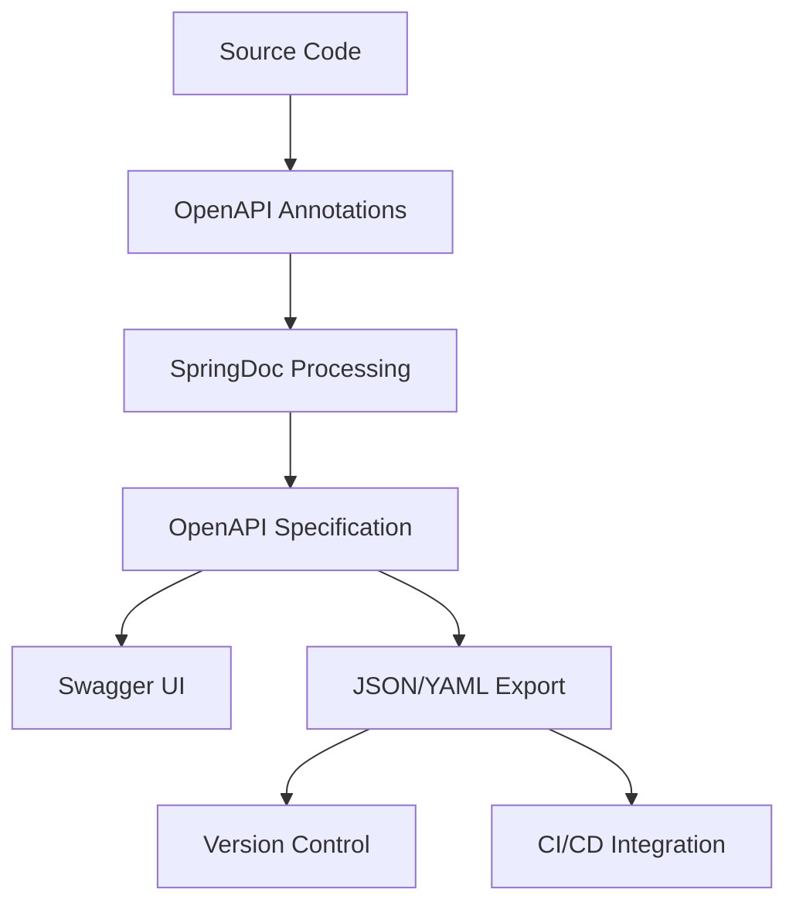

# Design Document

## Overview

本設計文件描述如何完善現有的 OpenAPI 配置，為 DDD 電商平台提供完整、專業的 API 文檔解決方案。設計將基於現有的架構，在不破壞 DDD 分層原則的前提下，增強 API 文檔的完整性和可用性。

## Architecture

### 分層架構整合

```
┌─────────────────────────────────────────┐
│           Interface Layer               │
│  ┌─────────────────────────────────────┐│
│  │     REST Controllers                ││
│  │  + OpenAPI Annotations              ││
│  │  + @Tag, @Operation, @ApiResponses  ││
│  └─────────────────────────────────────┘│
│  ┌─────────────────────────────────────┐│
│  │          DTO Classes                ││
│  │  + @Schema Annotations              ││
│  │  + Validation Annotations           ││
│  └─────────────────────────────────────┘│
└─────────────────────────────────────────┘
┌─────────────────────────────────────────┐
│        Infrastructure Layer            │
│  ┌─────────────────────────────────────┐│
│  │      OpenAPI Configuration         ││
│  │  + API Info & Metadata             ││
│  │  + Server Configuration            ││
│  │  + Tag Definitions                 ││
│  └─────────────────────────────────────┘│
│  ┌─────────────────────────────────────┐│
│  │    Global Exception Handler        ││
│  │  + Standardized Error Responses    ││
│  │  + OpenAPI Error Documentation     ││
│  └─────────────────────────────────────┘│
└─────────────────────────────────────────┘
```

### 文檔生成流程



## Components and Interfaces

### 1. 控制器註解增強

#### 現有控制器分析

- OrderController: 已有部分 @Tag 註解
- PaymentController: 缺少 OpenAPI 註解
- InventoryController: 缺少 OpenAPI 註解
- ProductController: 缺少 OpenAPI 註解
- CustomerController: 缺少 OpenAPI 註解
- PricingController: 缺少 OpenAPI 註解
- ActivityController: 缺少 OpenAPI 註解
- StatsController: 缺少 OpenAPI 註解

#### 註解標準化模板

```java
@RestController
@RequestMapping("/api/{module}")
@Tag(name = "模組名稱", description = "模組功能描述")
@Validated
public class ModuleController {
    
    @PostMapping
    @Operation(
        summary = "操作摘要",
        description = "詳細操作描述"
    )
    @ApiResponses(value = {
        @ApiResponse(
            responseCode = "201",
            description = "創建成功",
            content = @Content(
                mediaType = "application/json",
                schema = @Schema(implementation = ResponseDto.class)
            )
        ),
        @ApiResponse(
            responseCode = "400",
            description = "請求參數無效",
            content = @Content(
                mediaType = "application/json",
                schema = @Schema(implementation = StandardErrorResponse.class)
            )
        )
    })
    public ResponseEntity<ResponseDto> createResource(
        @Parameter(description = "請求參數描述", required = true)
        @Valid @RequestBody RequestDto request) {
        // 實作邏輯
    }
}
```

### 2. DTO Schema 文檔化

#### Schema 註解標準

```java
@Schema(description = "資料傳輸物件描述")
public class ExampleDto {
    
    @Schema(
        description = "欄位描述",
        example = "範例值",
        required = true
    )
    @NotBlank(message = "欄位不能為空")
    private String field;
    
    @Schema(
        description = "數值欄位描述",
        minimum = "0",
        maximum = "100",
        example = "50"
    )
    @Min(0)
    @Max(100)
    private Integer numericField;
    
    @Schema(
        description = "列舉欄位描述",
        allowableValues = {"VALUE1", "VALUE2", "VALUE3"},
        example = "VALUE1"
    )
    private EnumType enumField;
}
```

### 3. 標準化錯誤回應

#### 統一錯誤回應結構

```java
@Schema(description = "標準錯誤回應")
public class StandardErrorResponse {
    
    @Schema(description = "錯誤代碼", example = "VALIDATION_ERROR")
    private String code;
    
    @Schema(description = "錯誤訊息", example = "請求參數驗證失敗")
    private String message;
    
    @Schema(description = "錯誤發生時間", example = "2024-01-15T10:30:00Z")
    private LocalDateTime timestamp;
    
    @Schema(description = "請求路徑", example = "/api/orders")
    private String path;
    
    @Schema(description = "詳細錯誤資訊")
    private List<FieldError> details;
    
    @Schema(description = "欄位錯誤詳情")
    public static class FieldError {
        @Schema(description = "欄位名稱", example = "customerId")
        private String field;
        
        @Schema(description = "錯誤訊息", example = "客戶ID不能為空")
        private String message;
        
        @Schema(description = "拒絕的值", example = "null")
        private Object rejectedValue;
    }
}
```

#### 全域例外處理器

```java
@RestControllerAdvice
public class GlobalExceptionHandler {
    
    @ExceptionHandler(MethodArgumentNotValidException.class)
    @ResponseStatus(HttpStatus.BAD_REQUEST)
    @Operation(hidden = true)
    public StandardErrorResponse handleValidationException(
        MethodArgumentNotValidException ex,
        HttpServletRequest request) {
        // 處理驗證錯誤
    }
    
    @ExceptionHandler(BusinessException.class)
    @Operation(hidden = true)
    public ResponseEntity<StandardErrorResponse> handleBusinessException(
        BusinessException ex,
        HttpServletRequest request) {
        // 處理業務邏輯錯誤
    }
}
```

### 4. 自動化文檔生成

#### 測試驅動的文檔生成

```java
@SpringBootTest
@AutoConfigureWebMvc
@ActiveProfiles("test")
public class OpenApiDocumentationTest {
    
    @Autowired
    private MockMvc mockMvc;
    
    @Test
    public void generateOpenApiSpecification() throws Exception {
        // 生成 JSON 格式規範
        MvcResult result = mockMvc.perform(get("/v3/api-docs"))
                .andExpect(status().isOk())
                .andReturn();
        
        String openApiJson = result.getResponse().getContentAsString();
        writeToFile("docs/api/openapi.json", formatJson(openApiJson));
    }
    
    @Test
    public void generateOpenApiYaml() throws Exception {
        // 生成 YAML 格式規範
        MvcResult result = mockMvc.perform(get("/v3/api-docs.yaml"))
                .andExpect(status().isOk())
                .andReturn();
        
        String openApiYaml = result.getResponse().getContentAsString();
        writeToFile("docs/api/openapi.yaml", openApiYaml);
    }
}
```

#### Gradle 任務整合

```gradle
task generateApiDocs(type: Test) {
    description = '生成 OpenAPI 規範檔案'
    useJUnitPlatform()
    include '**/OpenApiDocumentationTest.class'
    
    doFirst {
        println '正在生成 OpenAPI 文檔...'
    }
    
    doLast {
        println 'OpenAPI 文檔生成完成！'
        println '檔案位置: docs/api/'
        println 'Swagger UI: http://localhost:8080/swagger-ui.html'
    }
}
```

## Data Models

### OpenAPI 配置模型

```java
@Configuration
public class OpenApiConfig {
    
    @Bean
    public OpenAPI customOpenAPI() {
        return new OpenAPI()
                .info(createApiInfo())
                .servers(createServers())
                .tags(createTags())
                .components(createComponents());
    }
    
    private Info createApiInfo() {
        return new Info()
                .title("GenAI Demo - DDD 電商平台 API")
                .description(createApiDescription())
                .version("1.0.0")
                .contact(createContact())
                .license(createLicense());
    }
    
    private Components createComponents() {
        return new Components()
                .addSecuritySchemes("bearerAuth", createBearerAuthScheme())
                .addSchemas("StandardErrorResponse", createErrorSchema());
    }
}
```

### 配置檔案結構

```yaml
# application-openapi.yml
springdoc:
  api-docs:
    path: /v3/api-docs
    enabled: true
  swagger-ui:
    path: /swagger-ui.html
    enabled: true
    try-it-out-enabled: true
    operations-sorter: method
    tags-sorter: alpha
    display-request-duration: true
  show-actuator: true
  group-configs:
    - group: 'public-api'
      display-name: '公開 API'
      paths-to-match: '/api/**'
      paths-to-exclude: '/api/internal/**'
    - group: 'internal-api'
      display-name: '內部 API'
      paths-to-match: '/api/internal/**'
    - group: 'management'
      display-name: '管理端點'
      paths-to-match: '/actuator/**'
```

## Error Handling

### 錯誤分類和處理策略

1. **驗證錯誤 (400 Bad Request)**
   - Bean Validation 失敗
   - 請求格式錯誤
   - 必填欄位缺失

2. **業務邏輯錯誤 (422 Unprocessable Entity)**
   - 庫存不足
   - 訂單狀態不允許操作
   - 業務規則違反

3. **資源不存在 (404 Not Found)**
   - 訂單不存在
   - 產品不存在
   - 客戶不存在

4. **系統錯誤 (500 Internal Server Error)**
   - 資料庫連線失敗
   - 外部服務不可用
   - 未預期的系統異常

### 錯誤回應標準化

```java
public enum ErrorCode {
    VALIDATION_ERROR("VALIDATION_ERROR", "請求參數驗證失敗"),
    RESOURCE_NOT_FOUND("RESOURCE_NOT_FOUND", "請求的資源不存在"),
    BUSINESS_RULE_VIOLATION("BUSINESS_RULE_VIOLATION", "違反業務規則"),
    INSUFFICIENT_INVENTORY("INSUFFICIENT_INVENTORY", "庫存不足"),
    INVALID_ORDER_STATUS("INVALID_ORDER_STATUS", "訂單狀態不允許此操作"),
    SYSTEM_ERROR("SYSTEM_ERROR", "系統內部錯誤");
    
    private final String code;
    private final String message;
}
```

## Testing Strategy

### 1. 文檔生成測試

```java
@Test
public void shouldGenerateCompleteApiDocumentation() {
    // 驗證所有控制器都有適當的 OpenAPI 註解
    // 驗證所有 DTO 都有 Schema 註解
    // 驗證錯誤回應格式一致性
}
```

### 2. API 契約測試

```java
@Test
public void shouldMaintainApiContract() {
    // 驗證 API 規範的向後相容性
    // 檢查必填欄位變更
    // 驗證回應格式穩定性
}
```

### 3. Swagger UI 功能測試

```java
@Test
public void shouldProvideWorkingSwaggerUI() {
    // 驗證 Swagger UI 可正常載入
    // 測試 Try it out 功能
    // 驗證 API 分組顯示正確
}
```

### 4. 多環境配置測試

```java
@Test
@ActiveProfiles("production")
public void shouldApplyProductionConfiguration() {
    // 驗證生產環境配置正確載入
    // 檢查敏感資訊是否隱藏
    // 驗證效能最佳化設定
}
```

## Implementation Phases

### Phase 1: 基礎設施完善

- 增強 OpenApiConfig 配置
- 建立標準化錯誤回應結構
- 設定環境特定配置

### Phase 2: 控制器註解

- 為所有控制器添加 @Tag 註解
- 為所有端點添加 @Operation 和 @ApiResponses
- 標準化參數文檔

### Phase 3: DTO 文檔化

- 為所有 DTO 添加 @Schema 註解
- 完善驗證註解
- 添加範例值和描述

### Phase 4: 自動化和整合

- 實作文檔生成測試
- 建立 Gradle 任務
- 撰寫使用文檔

### Phase 5: 最佳化和維護

- 效能調校
- 安全性配置
- 監控和維護指南
