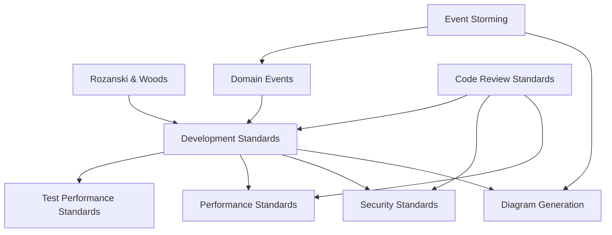

# Steering Rules Guide

## 🚀 Quick Start

### I need to

- **Write code**: Start with [Development Standards](development-standards.md)
- **Review code**: Use [Code Review Standards](code-review-standards.md)
- **Write documentation**: See [Development Standards](development-standards.md) and [Diagram Generation Standards](diagram-generation-standards.md)
- **Design architecture**: Check [Rozanski & Woods Methodology](rozanski-woods-architecture-methodology.md)
- **Optimize performance**: Review [Performance Standards](performance-standards.md)
- **Implement security**: Follow [Security Standards](security-standards.md)

## 📚 Document Categories

### Core Standards (Read First)

Essential standards for daily development work.

| Document | Purpose | When to Use |
|----------|---------|-------------|
| [Development Standards](development-standards.md) | Primary development guide | Daily coding, testing, architecture |
| [Code Review Standards](code-review-standards.md) | Review process and checklist | Before and during code reviews |

### Specialized Standards (Domain-Specific)

Deep-dive standards for specific areas.

| Document | Purpose | When to Use |
|----------|---------|-------------|
| [Rozanski & Woods Methodology](rozanski-woods-architecture-methodology.md) | Architecture viewpoints | Designing system architecture |
| [Event Storming Standards](event-storming-standards.md) | Collaborative domain modeling | Conducting Event Storming workshops |
| [Security Standards](security-standards.md) | Security implementation | Implementing auth, encryption, etc. |
| [Performance Standards](performance-standards.md) | Performance optimization | Optimizing system performance |
| [Domain Events](domain-events.md) | DDD event patterns | Implementing domain events |
| [Diagram Standards](diagram-standards.md) | When to use ASCII/Mermaid/PlantUML/Excalidraw | Creating any diagram |
| [Diagram Generation](diagram-generation-standards.md) | PlantUML generation details | Generating PlantUML diagrams |

### Reference Standards (Deep Dive)

Detailed technical references for specific topics.

| Document | Purpose | When to Use |
|----------|---------|-------------|
| [Test Performance Standards](test-performance-standards.md) | Test performance deep dive | Troubleshooting test performance |

## 🎯 Common Scenarios

### Starting a New Feature

1. Review [Development Standards](development-standards.md) - Architecture and testing
2. Check [Rozanski & Woods Methodology](rozanski-woods-architecture-methodology.md) - Viewpoint analysis
3. Conduct [Event Storming](event-storming-standards.md) - For domain discovery
4. Follow [Domain Events](domain-events.md) - If using DDD patterns
5. Create diagrams using [Diagram Standards](diagram-standards.md) - Choose right format

### Fixing Performance Issues

1. Start with [Performance Standards](performance-standards.md) - General optimization
2. For test performance: [Test Performance Standards](test-performance-standards.md)
3. Review [Development Standards](development-standards.md) - Database and caching patterns

### Writing Documentation

1. Follow [Development Standards](development-standards.md) - Documentation guidelines
2. Choose diagram format with [Diagram Standards](diagram-standards.md) - ASCII/Mermaid/PlantUML/Excalidraw
3. Generate PlantUML with [Diagram Generation Standards](diagram-generation-standards.md) - For complex UML
4. Document [Event Storming Sessions](event-storming-standards.md) - For workshop results

## 📖 Document Relationships

## 🔄 Recent Changes

- **2025-01-XX**: Consolidated language and documentation standards
- **2025-01-XX**: Removed duplicate test performance content
- **2025-01-XX**: Merged BDD/TDD principles into development standards
- **2025-01-XX**: Redesigned README for better navigation

## 📝 Contributing

When updating steering rules:

1. Avoid duplicating content across files
2. Use cross-references for related content
3. Follow the standard document structure
4. Update this README if adding new documents

---

**Total Documents**: 17  
**Last Updated**: 2025-11-08  
**Owner**: Development Team
