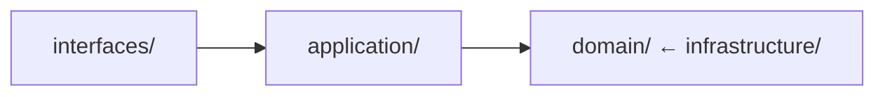
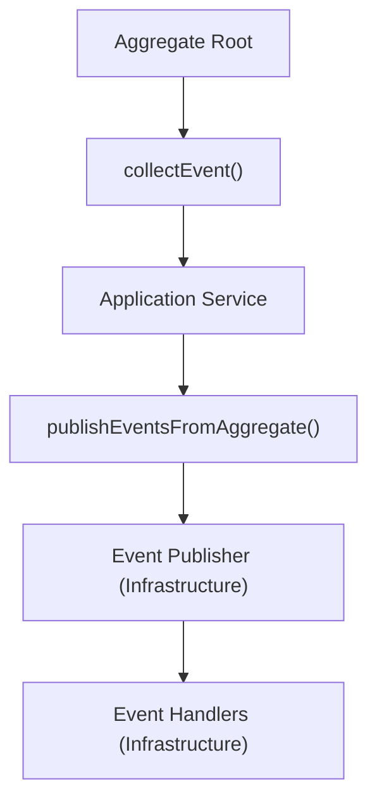

# Architecture Constraints

## Overview

This document defines the mandatory architecture constraints for this project based on Hexagonal Architecture (Ports and Adapters) and Domain-Driven Design.

**Purpose**: Provide clear rules for layer dependencies and package organization.
**Detailed Guide**: See `.kiro/examples/architecture/` for comprehensive architecture guides.

---

## Layer Dependencies

### Dependency Rule



### Must Follow

- [ ] **Domain layer**: No dependencies on any other layer
- [ ] **Application layer**: Depends only on domain layer
- [ ] **Infrastructure layer**: Depends on domain layer (implements interfaces)
- [ ] **Interfaces layer**: Depends on application and domain layers

### Must Avoid

- [ ] ❌ Domain depending on infrastructure
- [ ] ❌ Domain depending on application
- [ ] ❌ Circular dependencies between layers
- [ ] ❌ Infrastructure depending on interfaces

**Detailed Architecture**: #[[file:../examples/architecture/hexagonal-architecture.md]]

---

## Package Structure Standards

### Domain Layer

```text
domain/
├── {context}/
│   ├── model/
│   │   ├── aggregate/      # Aggregate roots
│   │   ├── entity/         # Entities (non-root)
│   │   ├── valueobject/    # Value objects
│   │   └── specification/  # Business rules
│   ├── events/             # Domain events
│   ├── repository/         # Repository interfaces
│   ├── service/            # Domain services
│   └── validation/         # Validation logic
└── shared/                 # Shared kernel
    └── valueobject/        # Shared value objects
```

### Application Layer

```text
application/
└── {context}/
    ├── {UseCase}ApplicationService.java
    ├── command/            # Command objects
    ├── query/              # Query objects
    └── dto/                # Data transfer objects
```

### Infrastructure Layer

```text
infrastructure/
└── {context}/
    ├── persistence/        # Repository implementations
    │   ├── entity/        # JPA entities
    │   ├── mapper/        # Domain ↔ Entity mappers
    │   └── repository/    # JPA repositories
    ├── messaging/          # Event publishers
    ├── external/           # External service adapters
    └── config/             # Infrastructure configuration
```

### Interfaces Layer

```text
interfaces/
├── rest/
│   └── {context}/
│       ├── controller/     # REST controllers
│       ├── dto/            # Request/Response DTOs
│       └── mapper/         # DTO ↔ Domain mappers
└── web/                    # Web UI controllers
```

---

## Bounded Context Rules

### Must Follow

- [ ] Each context is independent and self-contained
- [ ] Communication between contexts via domain events only
- [ ] No direct dependencies between bounded contexts
- [ ] Shared kernel in `domain/shared/` for common concepts
- [ ] Context map documented

### Context Isolation

```java
// ✅ GOOD: Communication via events
@Component
public class OrderSubmittedEventHandler {
    private final InventoryService inventoryService;
    
    @EventListener
    public void handle(OrderSubmittedEvent event) {
        inventoryService.reserveItems(event.orderId());
    }
}

// ❌ BAD: Direct dependency between contexts
public class OrderService {
    private final InventoryRepository inventoryRepository; // Wrong!
}
```

### Bounded Contexts in This Project

- Customer Context
- Order Context
- Product Context
- Inventory Context
- Payment Context
- Shipping/Logistics Context
- Promotion Context
- Notification Context
- Review Context
- Shopping Cart Context
- Pricing Context
- Seller Context
- Delivery Context

---

## Cross-Cutting Concerns

### Must Follow

- [ ] **Logging**: Infrastructure layer only
- [ ] **Metrics**: Infrastructure layer only
- [ ] **Security**: Infrastructure layer only
- [ ] **Tracing**: Infrastructure layer only
- [ ] **Caching**: Infrastructure layer only

### Implementation Location

```text
infrastructure/
├── logging/
├── metrics/
├── security/
├── tracing/
└── cache/
```

---

## Dependency Injection Rules

### Must Follow

- [ ] Use constructor injection
- [ ] Inject interfaces, not implementations
- [ ] No `@Autowired` on fields
- [ ] Use `final` for injected dependencies

### Example

```java
// ✅ GOOD: Constructor injection with interface
@Service
public class OrderApplicationService {
    private final OrderRepository orderRepository;
    private final DomainEventApplicationService eventService;
    
    public OrderApplicationService(
        OrderRepository orderRepository,
        DomainEventApplicationService eventService
    ) {
        this.orderRepository = orderRepository;
        this.eventService = eventService;
    }
}

// ❌ BAD: Field injection
@Service
public class OrderApplicationService {
    @Autowired
    private OrderRepository orderRepository;
}
```

---

## Configuration Management

### Must Follow

- [ ] Configuration in `config/` package
- [ ] Use `@Configuration` classes
- [ ] Profile-specific configuration
- [ ] Externalize sensitive data

### Configuration Structure

```text
config/
├── DatabaseConfiguration.java
├── RedisConfiguration.java
├── SecurityConfiguration.java
├── ObservabilityConfiguration.java
└── ProfileConfiguration.java
```

---

## API Design Constraints

### REST API Structure

```text
interfaces/rest/{context}/
├── controller/
│   └── {Entity}Controller.java
├── dto/
│   ├── request/
│   └── response/
└── mapper/
    └── {Entity}DtoMapper.java
```

### Must Follow

- [ ] RESTful URL conventions
- [ ] Proper HTTP methods (GET, POST, PUT, DELETE)
- [ ] Consistent response format
- [ ] API versioning (`/api/v1/`)

---

## Event-Driven Architecture

### Event Flow



### Must Follow

- [ ] Aggregates collect events, don't publish
- [ ] Application services publish after successful transaction
- [ ] Event handlers in infrastructure layer
- [ ] Use `@TransactionalEventListener(phase = AFTER_COMMIT)`

---

## Testing Architecture

### Test Package Structure

```text
test/
├── unit/                   # Unit tests (domain logic)
├── integration/            # Integration tests
├── e2e/                    # End-to-end tests
└── bdd/                    # BDD/Cucumber tests
```

### Must Follow

- [ ] Unit tests for domain logic
- [ ] Integration tests for infrastructure
- [ ] E2E tests for complete flows
- [ ] BDD tests for business scenarios

---

## Validation Commands

### Architecture Compliance

```bash
./gradlew archUnit  # Verify all architecture rules
```

### ArchUnit Rules

```java
// Layer dependency rules
@ArchTest
static final ArchRule domainLayerRules = classes()
    .that().resideInAPackage("..domain..")
    .should().onlyDependOnClassesThat()
    .resideInAnyPackage("..domain..", "java..");

// Package structure rules
@ArchTest
static final ArchRule aggregateRootRules = classes()
    .that().areAnnotatedWith(AggregateRoot.class)
    .should().resideInAPackage("..domain..model.aggregate..");

// Naming convention rules
@ArchTest
static final ArchRule repositoryRules = classes()
    .that().haveSimpleNameEndingWith("Repository")
    .and().areInterfaces()
    .should().resideInAPackage("..domain..repository..");
```

---

## Quick Reference

| Layer | Dependencies | Location | Purpose |
|-------|--------------|----------|---------|
| Domain | None | `domain/` | Business logic and rules |
| Application | Domain | `application/` | Use case orchestration |
| Infrastructure | Domain | `infrastructure/` | Technical implementations |
| Interfaces | Application, Domain | `interfaces/` | External communication |

---

## Related Documentation

- **Core Principles**: #[[file:core-principles.md]]
- **DDD Patterns**: #[[file:ddd-tactical-patterns.md]]
- **Design Principles**: #[[file:design-principles.md]]
- **Architecture Examples**: #[[file:../examples/architecture/]]

---

**Document Version**: 1.0
**Last Updated**: 2025-01-17
**Owner**: Architecture Team
