# Core Development Principles

## Overview

This document defines the fundamental principles that guide all development work in this project. These principles are mandatory and must be followed by all team members.

**Purpose**: Provide a concise reference of core principles without detailed examples.
**Detailed Examples**: See `.kiro/examples/` for comprehensive implementation guides.

---

## Architecture Principles

### Must Follow

- [ ] **DDD + Hexagonal Architecture**: Domain-Driven Design with ports and adapters
- [ ] **Event-Driven Design**: Use domain events for cross-context communication
- [ ] **Bounded Context Isolation**: Each context is independent and self-contained
- [ ] **Dependency Rule**: Domain layer has no dependencies on infrastructure

### Architecture Layers

```mermaid
graph LR
    N1["interfaces/"]
    N2["application/"]
    N1 --> N2
    N3["domain/ ← infrastructure/"]
    N2 --> N3
```



**Detailed Guide**: #[[file:../examples/architecture/hexagonal-architecture.md]]

---

## Domain Model Principles

### Aggregate Roots

- [ ] Extend `AggregateRoot` base class
- [ ] Use `@AggregateRoot` annotation
- [ ] Aggregates collect events, application services publish them
- [ ] No direct repository access from domain layer

### Domain Events

- [ ] Use Record implementation for immutability
- [ ] Implement `DomainEvent` interface
- [ ] Use factory method with `createEventMetadata()`
- [ ] Events are immutable and contain all necessary data

### Value Objects

- [ ] Use Record for immutability
- [ ] Validate in constructor
- [ ] No setters
- [ ] Implement equals/hashCode based on value

**Detailed Patterns**: #[[file:ddd-tactical-patterns.md]]

---

## Code Quality Principles

### SOLID Principles

- [ ] **Single Responsibility**: One class, one reason to change
- [ ] **Open/Closed**: Open for extension, closed for modification
- [ ] **Liskov Substitution**: Subtypes must be substitutable
- [ ] **Interface Segregation**: Small, focused interfaces
- [ ] **Dependency Inversion**: Depend on abstractions, not concretions

### Clean Code Standards

- [ ] **Meaningful Names**: Clear, descriptive naming
- [ ] **Small Functions**: < 20 lines per method
- [ ] **Single Level of Abstraction**: One abstraction level per function
- [ ] **No Duplication**: DRY principle
- [ ] **Error Handling**: Use specific exceptions with context

**Detailed Principles**: #[[file:design-principles.md]]
**Quality Checklist**: #[[file:code-quality-checklist.md]]

---

## Test-First Development

### BDD/TDD Approach

- [ ] Write Gherkin scenarios before implementation
- [ ] Write failing tests first (Red)
- [ ] Write minimal code to pass (Green)
- [ ] Refactor for quality (Refactor)

### Test Pyramid

- **Unit Tests (80%)**: < 50ms, < 5MB
- **Integration Tests (15%)**: < 500ms, < 50MB
- **E2E Tests (5%)**: < 3s, < 500MB

**Testing Strategy**: #[[file:testing-strategy.md]]

---

## Technology Stack

### Backend

- Spring Boot 3.4.5 + Java 21 + Gradle 8.x
- Spring Data JPA + Hibernate + Flyway
- H2 (dev/test) + PostgreSQL (prod)
- SpringDoc OpenAPI 3 + Swagger UI

### Frontend

- CMC Management: Next.js 14 + React 18 + TypeScript
- Consumer App: Angular 18 + TypeScript

### Testing

- JUnit 5 + Mockito + AssertJ
- Cucumber 7 (BDD) + Gherkin
- ArchUnit (Architecture Testing)

### Infrastructure

- AWS EKS + RDS + ElastiCache + MSK
- AWS CDK for Infrastructure as Code
- CloudWatch + X-Ray + Grafana for Observability

---

## Development Workflow

### Daily Development

```bash
./gradlew quickTest              # Fast feedback (< 2 min)
./gradlew preCommitTest          # Pre-commit verification (< 5 min)
./gradlew fullTest               # Complete test suite
```

### Code Review

- [ ] All tests pass
- [ ] Code coverage > 80%
- [ ] ArchUnit rules pass
- [ ] No security vulnerabilities
- [ ] Documentation updated

**Review Guide**: #[[file:../examples/process/code-review-guide.md]]

---

## Validation Commands

### Architecture Compliance

```bash
./gradlew archUnit               # Verify architecture rules
```

### Code Quality

```bash
./gradlew test jacocoTestReport  # Check test coverage
./gradlew pmdMain                # Check code smells
./gradlew checkstyleMain         # Check code style
```

### Documentation

```bash
./scripts/validate-diagrams.sh   # Validate diagrams
./scripts/validate-links.sh      # Check broken links
```

---

## Quick Reference

| Principle | Key Rule | Validation |
|-----------|----------|------------|
| Architecture | Domain has no infrastructure dependencies | `./gradlew archUnit` |
| Domain Model | Aggregates collect events, services publish | Code review |
| Code Quality | SOLID + Clean Code | `./gradlew pmdMain` |
| Testing | Test-first, > 80% coverage | `./gradlew test` |

---

## Related Documentation

- **Design Principles**: #[[file:design-principles.md]]
- **DDD Patterns**: #[[file:ddd-tactical-patterns.md]]
- **Architecture Constraints**: #[[file:architecture-constraints.md]]
- **Code Quality Checklist**: #[[file:code-quality-checklist.md]]
- **Testing Strategy**: #[[file:testing-strategy.md]]

---

**Document Version**: 1.0
**Last Updated**: 2025-01-17
**Owner**: Architecture Team
