# Development Standards and Guidelines

---

## 🚨 CRITICAL REMINDER - DOCUMENTATION DATES 🚨

**BEFORE creating or updating ANY documentation file:**

```bash
# MANDATORY FIRST STEP - Get current date
date +%Y-%m-%d

# Then use that ACTUAL date in ALL date fields
```

**📄 READ THE COMPLETE GUIDE:**
- **[documentation-date-requirements.md](documentation-date-requirements.md)** - MANDATORY reading

**Why this matters:**
- ❌ Using wrong dates (2024 instead of 2025) causes confusion
- ❌ Using placeholder dates (YYYY-MM-DD) is unprofessional
- ✅ Accurate dates enable proper tracking and maintenance

---

## Technology Stack Requirements

### Backend Technologies

- Spring Boot 3.4.5 + Java 21 + Gradle 8.x
- Spring Data JPA + Hibernate + Flyway
- H2 (dev/test) + PostgreSQL (prod)
- SpringDoc OpenAPI 3 + Swagger UI
- Spring Boot Actuator + AWS X-Ray + Micrometer

### Frontend Technologies

- CMC Management: Next.js 14 + React 18 + TypeScript
- Consumer App: Angular 18 + TypeScript
- UI Components: shadcn/ui + Radix UI

### Testing Frameworks

- JUnit 5 + Mockito + AssertJ
- Cucumber 7 (BDD) + Gherkin
- ArchUnit (Architecture Testing)

### Documentation and Diagrams

> **📊 圖表標準**: 完整的圖表生成和管理標準請參考 [Diagram Generation Standards](diagram-generation-standards.md)

**快速參考**:

- **主要格式**: PNG (GitHub 文檔推薦)
- **生成命令**: `./scripts/generate-diagrams.sh --format=png`
- **PlantUML**: 複雜 UML 圖表和詳細系統架構
- **Mermaid**: 簡單流程圖和基本架構圖表

#### Documentation Date Standards

> **🚨 CRITICAL - MANDATORY READING 🚨**
> 
> **Complete documentation date requirements:**
> 
> **📄 [documentation-date-requirements.md](documentation-date-requirements.md)**
> 
> This is a **MANDATORY** standalone guide that MUST be followed.

**Quick Summary**:

- **🔴 ALWAYS FIRST**: Execute `date +%Y-%m-%d` to get the current date **BEFORE** creating/updating any documentation
- **🔴 NEVER**: Use placeholder dates like "YYYY-MM-DD", "2025-01-XX", or hardcoded dates
- **🔴 NEVER**: Copy dates from other files or use remembered dates
- **🔴 ALWAYS**: Update the following fields with the **ACTUAL CURRENT DATE**:
  - Frontmatter `last_updated` field
  - Document header `Last Updated` field
  - Change History table entries
  - ADR date fields
  - Any timestamp fields
  - Commit message dates

**For complete requirements, examples, and checklist:**
- **[documentation-date-requirements.md](documentation-date-requirements.md)** ← **READ THIS**

**Example - Correct Usage**:

```bash
# Get current date first
CURRENT_DATE=$(date +%Y-%m-%d)

# Then use it in documentation
---
last_updated: "2025-10-22"  # ✅ Actual current date
---

> **Last Updated**: 2025-10-22  # ✅ Actual current date
```

**Example - Incorrect Usage**:

```markdown
---
last_updated: "2025-01-22"  # ❌ Hardcoded old date
---

> **Last Updated**: YYYY-MM-DD  # ❌ Placeholder
```

**Rationale**: Accurate timestamps are essential for:

- Tracking documentation freshness
- Identifying outdated content
- Audit trails and compliance
- Team coordination and maintenance scheduling

## Error Handling Standards

### Exception Design Patterns

#### Custom Exception Hierarchy

```java
// Base domain exception
public abstract class DomainException extends RuntimeException {
    private final String errorCode;
    private final Map<String, Object> context;
    
    protected DomainException(String errorCode, String message, Map<String, Object> context) {
        super(message);
        this.errorCode = errorCode;
        this.context = context != null ? context : Map.of();
    }
    
    public String getErrorCode() { return errorCode; }
    public Map<String, Object> getContext() { return context; }
}

// Business rule violation
public class BusinessRuleViolationException extends DomainException {
    public BusinessRuleViolationException(String rule, String message) {
        super("BUSINESS_RULE_VIOLATION", message, Map.of("rule", rule));
    }
}

// Resource not found
public class ResourceNotFoundException extends DomainException {
    public ResourceNotFoundException(String resourceType, String resourceId) {
        super("RESOURCE_NOT_FOUND", 
              String.format("%s with id %s not found", resourceType, resourceId),
              Map.of("resourceType", resourceType, "resourceId", resourceId));
    }
}
```

#### Error Code Standards

- Format: `{DOMAIN}_{ERROR_TYPE}_{SPECIFIC_ERROR}`
- Examples:
  - `CUSTOMER_VALIDATION_INVALID_EMAIL`
  - `ORDER_BUSINESS_RULE_INSUFFICIENT_INVENTORY`
  - `PAYMENT_INTEGRATION_GATEWAY_TIMEOUT`

#### Global Exception Handler

```java
@RestControllerAdvice
public class GlobalExceptionHandler {
    
    @ExceptionHandler(DomainException.class)
    public ResponseEntity<ErrorResponse> handleDomainException(DomainException ex) {
        ErrorResponse response = ErrorResponse.builder()
            .errorCode(ex.getErrorCode())
            .message(ex.getMessage())
            .context(ex.getContext())
            .timestamp(Instant.now())
            .build();
            
        return ResponseEntity.badRequest().body(response);
    }
    
    @ExceptionHandler(ValidationException.class)
    public ResponseEntity<ErrorResponse> handleValidation(ValidationException ex) {
        // Handle validation errors with field-level details
    }
}
```

### Logging Standards

#### Structured Logging Format

```java
// Use structured logging with consistent fields
log.info("Order processed successfully", 
    kv("orderId", order.getId()),
    kv("customerId", order.getCustomerId()),
    kv("amount", order.getTotalAmount()),
    kv("processingTimeMs", processingTime));

// Error logging with context
log.error("Payment processing failed",
    kv("orderId", orderId),
    kv("paymentMethod", paymentMethod),
    kv("errorCode", ex.getErrorCode()),
    ex);
```

#### Log Levels Usage

- **ERROR**: System errors, exceptions that require immediate attention
- **WARN**: Business rule violations, recoverable errors
- **INFO**: Important business events, API calls, state changes
- **DEBUG**: Detailed execution flow, variable values
- **TRACE**: Very detailed debugging information

## API Design Standards

### REST API Conventions

#### URL Naming Standards

```text
GET    /../api/v1/customers                    # List customers
GET    /api/v1/customers/{id}               # Get customer by ID
POST   /api/v1/customers                    # Create customer
PUT    /api/v1/customers/{id}               # Update customer (full)
PATCH  /../api/v1/customers/{id}               # Update customer (partial)
DELETE /../api/v1/customers/{id}               # Delete customer

# Nested resources
GET    /api/v1/customers/{id}/orders        # Get customer's orders
POST   /api/v1/customers/{id}/orders        # Create order for customer

# Actions (non-CRUD operations)
POST   /../api/v1/orders/{id}/cancel           # Cancel order
POST   /api/v1/orders/{id}/ship             # Ship order
```

#### HTTP Status Code Standards

- **200 OK**: Successful GET, PUT, PATCH
- **201 Created**: Successful POST
- **204 No Content**: Successful DELETE
- **400 Bad Request**: Validation errors, malformed requests
- **401 Unauthorized**: Authentication required
- **403 Forbidden**: Authorization failed
- **404 Not Found**: Resource not found
- **409 Conflict**: Business rule violation
- **422 Unprocessable Entity**: Semantic validation errors
- **500 Internal Server Error**: System errors

#### Request/Response Format Standards

```java
// Request DTO
public record CreateCustomerRequest(
    @NotBlank String name,
    @Email String email,
    @Valid AddressDto address
) {}

// Response DTO
public record CustomerResponse(
    String id,
    String name,
    String email,
    AddressDto address,
    Instant createdAt,
    Instant updatedAt
) {}

// Error Response
public record ErrorResponse(
    String errorCode,
    String message,
    Map<String, Object> context,
    Instant timestamp,
    List<FieldError> fieldErrors
) {}
```

#### API Versioning Strategy

- Use URL versioning: `/../api/v1/`, `/api/v2/`
- Maintain backward compatibility for at least 2 versions
- Deprecation headers for old versions:

  ```
  Deprecation: true
  Sunset: 2024-12-31T23:59:59Z
  Link: </api/v2/customers>; rel="successor-version"
  ```

## Architecture Constraints

### Package Structure Standards

- `domain/{context}/model/` - Aggregate roots, entities, value objects
- `domain/{context}/events/` - Domain events (Records)
- `application/{context}/` - Use case implementations
- `infrastructure/{context}/persistence/` - Persistence adapters

### Layer Dependency Rules

```mermaid
graph LR
    N1["interfaces/"]
    N2["application/"]
    N1 --> N2
    N3["domain/ ← infrastructure/"]
    N2 --> N3
```



### Domain Event Design Constraints

- Use immutable Records implementation
- Aggregate roots collect events, application services publish events
- Event handlers in infrastructure layer

## Testing Standards

### Test Layer Requirements (Test Pyramid)

- Unit Tests (80%): < 50ms, < 5MB
- Integration Tests (15%): < 500ms, < 50MB  
- E2E Tests (5%): < 3s, < 500MB

### Test Classification Standards

#### Unit Tests (Preferred)

- **Annotation**: `@ExtendWith(MockitoExtension.class)`
- **Applicable**: Pure business logic, utilities, configuration classes
- **Prohibited**: Spring context
- **When to Use**:
  - Testing domain logic in isolation
  - Validating business rules
  - Testing utility functions
  - Verifying calculations and transformations

#### Integration Tests (Use Cautiously)

- **Annotation**: `@DataJpaTest`, `@WebMvcTest`, `@JsonTest`
- **Applicable**: Database integration, external services
- **Requirement**: Partial Spring context
- **When to Use**:
  - Testing repository implementations
  - Validating database queries
  - Testing API endpoints
  - Verifying serialization/deserialization

#### E2E Tests (Minimal Use)

- **Annotation**: `@SpringBootTest(webEnvironment = RANDOM_PORT)`
- **Applicable**: Complete business process verification
- **Requirement**: Full Spring context
- **When to Use**:
  - Testing complete user journeys
  - Validating system integration
  - Smoke testing critical paths

### Test Scenario Classification

#### Domain Logic Tests (Unit)

```java
@ExtendWith(MockitoExtension.class)
class CustomerUnitTest {
    
    @Test
    void should_throw_exception_when_email_is_invalid() {
        // Test business rule validation
        assertThatThrownBy(() -> new Customer("John", "invalid-email"))
            .isInstanceOf(InvalidEmailException.class)
            .hasMessage("Email format is invalid");
    }
    
    @Test
    void should_calculate_discount_correctly_for_premium_customer() {
        // Test business calculation
        Customer customer = createPremiumCustomer();
        Order order = createOrder(100.0);
        
        BigDecimal discount = customer.calculateDiscount(order);
        
        assertThat(discount).isEqualTo(new BigDecimal("10.00"));
    }
}
```

#### Repository Tests (Integration)

```java
@DataJpaTest
@ActiveProfiles("test")
class CustomerRepositoryTest {
    
    @Autowired
    private TestEntityManager entityManager;
    
    @Autowired
    private CustomerRepository repository;
    
    @Test
    void should_find_customers_by_email_domain() {
        // Given
        Customer customer1 = createCustomer("john@company.com");
        Customer customer2 = createCustomer("jane@company.com");
        Customer customer3 = createCustomer("bob@other.com");
        
        entityManager.persistAndFlush(customer1);
        entityManager.persistAndFlush(customer2);
        entityManager.persistAndFlush(customer3);
        
        // When
        List<Customer> results = repository.findByEmailDomain("company.com");
        
        // Then
        assertThat(results).hasSize(2)
            .extracting(Customer::getEmail)
            .containsExactlyInAnyOrder("john@company.com", "jane@company.com");
    }
}
```

#### API Tests (Integration)

```java
@WebMvcTest(CustomerController.class)
class CustomerControllerTest {
    
    @Autowired
    private MockMvc mockMvc;
    
    @MockBean
    private CustomerService customerService;
    
    @Test
    void should_return_customer_when_valid_id_provided() throws Exception {
        // Given
        Customer customer = createCustomer();
        when(customerService.findById("123")).thenReturn(customer);
        
        // When & Then
        mockMvc.perform(get("/../api/v1/customers/123"))
            .andExpect(status().isOk())
            .andExpect(jsonPath("$.id").value("123"))
            .andExpect(jsonPath("$.name").value("John Doe"));
    }
}
```

### Mock Strategy Guidelines

#### When to Mock

- External services (payment gateways, email services)
- Repositories in service tests
- Time-dependent operations
- Complex dependencies that are tested separately

#### When NOT to Mock

- Value objects and entities
- Simple data structures
- Domain logic being tested
- Infrastructure that can be easily replaced (in-memory implementations)

#### Mock Best Practices

```java
// ✅ Good: Specific, focused mocking
@Test
void should_send_welcome_email_when_customer_created() {
    // Given
    Customer customer = createCustomer();
    when(emailService.sendWelcomeEmail(customer.getEmail()))
        .thenReturn(EmailResult.success());
    
    // When
    customerService.createCustomer(customer);
    
    // Then
    verify(emailService).sendWelcomeEmail(customer.getEmail());
}

// ❌ Bad: Over-mocking, testing implementation details
@Test
void should_create_customer() {
    when(customerRepository.save(any())).thenReturn(customer);
    when(eventPublisher.publish(any())).thenReturn(true);
    when(validator.validate(any())).thenReturn(ValidationResult.valid());
    // ... too many mocks
}
```

### Test Data Management

#### Test Data Builders

```java
public class CustomerTestDataBuilder {
    private String name = "John Doe";
    private String email = "john@example.com";
    private CustomerType type = CustomerType.REGULAR;
    
    public static CustomerTestDataBuilder aCustomer() {
        return new CustomerTestDataBuilder();
    }
    
    public CustomerTestDataBuilder withName(String name) {
        this.name = name;
        return this;
    }
    
    public CustomerTestDataBuilder withEmail(String email) {
        this.email = email;
        return this;
    }
    
    public CustomerTestDataBuilder premium() {
        this.type = CustomerType.PREMIUM;
        return this;
    }
    
    public Customer build() {
        return new Customer(name, email, type);
    }
}

// Usage
Customer customer = aCustomer()
    .withName("Jane Smith")
    .withEmail("jane@example.com")
    .premium()
    .build();
```

#### Test Database Management

```java
@TestConfiguration
public class TestDatabaseConfiguration {
    
    @Bean
    @Primary
    public DataSource testDataSource() {
        return new EmbeddedDatabaseBuilder()
            .setType(EmbeddedDatabaseType.H2)
            .addScript("classpath:schema-test.sql")
            .addScript("classpath:test-data.sql")
            .build();
    }
}
```

### Test Tagging System

```java
@Target(ElementType.TYPE)
@Retention(RetentionPolicy.RUNTIME)
@Tag("unit")
public @interface UnitTest {}

@Target(ElementType.TYPE)
@Retention(RetentionPolicy.RUNTIME)
@Tag("integration")
public @interface IntegrationTest {}

@Target(ElementType.TYPE)
@Retention(RetentionPolicy.RUNTIME)
@Tag("slow")
public @interface SlowTest {}

@Target(ElementType.TYPE)
@Retention(RetentionPolicy.RUNTIME)
@Tag("smoke")
public @interface SmokeTest {}
```

### Performance Benchmark Requirements

- Unit tests: < 50ms, < 5MB, success rate > 99%
- Integration tests: < 500ms, < 50MB, success rate > 95%
- End-to-end tests: < 3s, < 500MB, success rate > 90%

### Test Performance Monitoring

> **🧪 Test Performance Standards**: For comprehensive test performance monitoring, resource management, and optimization, see [Test Performance Standards](test-performance-standards.md)

**Quick Reference:**

- Use `@TestPerformanceExtension` for automatic performance monitoring
- Integration tests: < 500ms, < 50MB
- E2E tests: < 3s, < 500MB
- Generate reports: `./gradlew generatePerformanceReport`

**Key Features:**

- Automatic test execution time and memory tracking
- Performance regression detection
- Resource cleanup and memory management
- Detailed HTML and CSV reports

### Test Environment Isolation

#### Database Isolation

```java
@Transactional
@Rollback
public abstract class DatabaseTestBase {
    
    @BeforeEach
    void setUp() {
        // Clean database state
        cleanDatabase();
        // Set up test data
        setupTestData();
    }
    
    @AfterEach
    void tearDown() {
        // Cleanup is automatic with @Rollback
    }
}
```

#### External Service Isolation

```java
@TestConfiguration
public class TestExternalServiceConfiguration {
    
    @Bean
    @Primary
    public PaymentService mockPaymentService() {
        return Mockito.mock(PaymentService.class);
    }
    
    @Bean
    @Primary
    public EmailService inMemoryEmailService() {
        return new InMemoryEmailService();
    }
}

## Test Task Organization

### Gradle Test Tasks

```bash
# Daily development - fast feedback
./gradlew quickTest              # Unit tests only (< 2 minutes)

# Pre-commit verification
./gradlew preCommitTest          # Unit + Integration tests (< 5 minutes)

# Pre-release verification
./gradlew fullTest               # All test types including E2E and Cucumber

# Specific test types
./gradlew unitTest               # Fast unit tests (~5MB, ~50ms each)
./gradlew integrationTest        # Integration tests (~50MB, ~500ms each)
./gradlew e2eTest               # End-to-end tests (~500MB, ~3s each)
./gradlew cucumber              # BDD Cucumber tests
```text

> **🧪 Advanced Test Configuration**: For detailed Gradle test task configuration, JVM tuning, memory management, and performance report generation, see [Test Performance Standards](test-performance-standards.md)

## BDD/TDD Development Process

### Overview

Behavior-Driven Development (BDD) and Test-Driven Development (TDD) are core development practices that ensure code quality and alignment with business requirements.

### BDD Principles

#### Gherkin Scenarios

- Use Given-When-Then format
- Write scenarios before implementation
- Focus on business behavior
- Use ubiquitous language

#### Example Scenario

```gherkin
Feature: Customer Registration
  Scenario: Successful customer registration
    Given a new customer with valid information
    When they submit the registration form
    Then they should receive a confirmation email
    And their account should be created
```text

### TDD Principles

#### Red-Green-Refactor Cycle

1. **Red**: Write a failing test
2. **Green**: Write minimal code to pass
3. **Refactor**: Improve code quality

#### Test Structure

- **Arrange**: Set up test data
- **Act**: Execute the behavior
- **Assert**: Verify the outcome

### Mandatory Development Steps

1. Write Gherkin scenarios (`src/test/resources/features/`)
2. Implement step definitions (Red)
3. TDD implement domain logic (Green)
4. Refactor optimization (Refactor)

### Best Practices

- Test behavior, not implementation
- Use descriptive test names
- Keep tests simple and focused
- Maintain test independence

### Tools and Frameworks

- JUnit 5 for unit testing
- Cucumber for BDD scenarios
- Mockito for mocking
- AssertJ for assertions

### Quality Gates

- All tests must pass before merge
- Code coverage > 80%
- No skipped tests in CI/CD
- BDD scenarios for all user stories

## Code Standards

### Naming Conventions

```java
// Aggregate root
@AggregateRoot
public class Customer implements AggregateRootInterface { }

// Value object
@ValueObject
public record CustomerId(String value) { }

// Domain event
public record CustomerCreatedEvent(...) implements DomainEvent { }

// Test class
@ExtendWith(MockitoExtension.class)
class CustomerServiceUnitTest { }

// Test performance utilities (to avoid naming conflicts)
@TestComponent
public class TestPerformanceResourceManager { }

public class TestPerformanceMonitor implements BeforeAllCallback { }

@TestConfiguration
public class TestPerformanceConfiguration { }
```text

**Test Utility Naming Standards:**

- Use `TestPerformance*` prefix for performance-related test utilities
- Use `Test*` prefix for general test utilities  
- Avoid generic names like `ResourceManager` or `Monitor` in test packages
- Include descriptive suffixes: `Manager`, `Monitor`, `Configuration`, `Extension`

### Mock Usage Rules

- Only mock interactions actually used in tests
- Avoid global stubbing
- Handle null cases

## ArchUnit Rules

### Mandatory Architecture Rules

- Layer dependency checks
- DDD tactical pattern verification
- Package naming convention checks

### Prohibited Anti-patterns

```java
// ❌ Wrong: Configuration class tests don't need full Spring context
@SpringBootTest
class DatabaseConfigurationTest { ... }

// ✅ Correct: Use unit tests
@ExtendWith(MockitoExtension.class)
class DatabaseConfigurationUnitTest { ... }
```text

## Quality Standards

### Must-Achieve Metrics

- Code coverage > 80%
- Test execution time < 15s (unit tests)
- Test failure rate < 1%
- Architecture compliance 100%

### BDD Scenario Coverage Requirements

- Core business processes 100% coverage
- Exception handling scenario coverage
- User experience critical path coverage

## Development Workflow

### New Feature Development Sequence

1. BDD scenario design
2. Domain modeling (DDD)
3. TDD implementation
4. Integration testing
5. ArchUnit verification

### Daily Development Commands

```bash
./gradlew quickTest              # Development quick feedback (2s)
./gradlew unitTest               # Pre-commit full verification (11s)
./gradlew integrationTest        # PR integration test check
./gradlew test                   # Pre-release full test
```text
