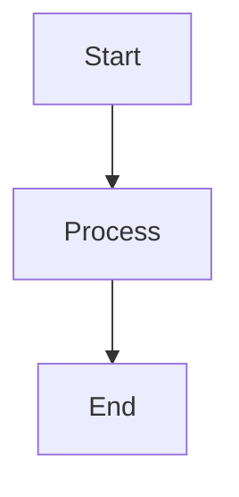

# Diagram Generation Standards

## Overview

This document defines the standards for generating and managing diagrams in the project, with specific focus on PlantUML and Mermaid diagram formats.

## PlantUML Diagram Standards

### Format Priority for GitHub Documentation

#### Primary Format: PNG ✅ **RECOMMENDED**
- **Use Case**: All GitHub documentation references
- **Advantages**:
  - Superior text clarity and readability
  - Consistent rendering across browsers
  - Optimal file size for web display
  - Better contrast and sharpness
- **Generation**: `./scripts/generate-diagrams.sh --format=png`
- **File Location**: `docs/diagrams/generated/{category}/{diagram-name}.png`

#### Secondary Format: SVG 📋 **SUPPLEMENTARY**
- **Use Case**: High-resolution printing, scalable displays
- **Advantages**:
  - Vector format with infinite zoom
  - Smaller file size for simple diagrams
  - Scalable without quality loss
- **Generation**: `./scripts/generate-diagrams.sh --format=svg`
- **File Location**: `docs/diagrams/generated/{category}/{diagram-name}.svg`

### Generation Workflow

#### Automatic Generation
```bash
# Generate both PNG and SVG (recommended)
./scripts/generate-diagrams.sh

# Generate only PNG for GitHub docs
./scripts/generate-diagrams.sh --format=png

# Generate only SVG for printing
./scripts/generate-diagrams.sh --format=svg
```

#### Manual Generation for Specific Diagrams
```bash
# Generate specific diagram
./scripts/generate-diagrams.sh bounded-contexts-overview.puml

# Validate diagram syntax
./scripts/generate-diagrams.sh --validate
```

### Documentation Reference Standards

#### Markdown Link Format
```markdown
<!-- ✅ CORRECT: Reference PNG for better GitHub display -->


<!-- ❌ AVOID: SVG may appear too small in GitHub -->


<!-- 📋 OPTIONAL: Provide both formats -->

*[High-resolution SVG version](../../diagrams/generated/functional/bounded-contexts-overview.svg)*
```

#### HTML Format (when needed)
```html
<!-- For better control over image size -->

```

## Mermaid Diagram Standards

### GitHub Native Support ✅ **PREFERRED**

#### Inline Code Blocks (Recommended)
```markdown

```

#### Standalone Files
- **File Extension**: `.mmd`
- **Location**: `docs/diagrams/mermaid/`
- **GitHub Rendering**: Automatic for `.mmd` files
- **Reference**: Direct link to `.mmd` file

### When to Use Each Format

#### Use Mermaid When:
- Simple process flows
- Basic architecture diagrams
- Quick conceptual diagrams
- Need immediate GitHub rendering
- Collaborative editing required

#### Use PlantUML When:
- Complex UML diagrams
- Detailed class diagrams
- Comprehensive system architecture
- Need precise layout control
- Professional documentation requirements

## File Organization Standards

### Directory Structure
```
docs/diagrams/
├── generated/                    # Auto-generated PNG/SVG files
│   ├── functional/              # Functional viewpoint diagrams
│   ├── information/             # Information viewpoint diagrams
│   ├── deployment/              # Deployment viewpoint diagrams
│   └── perspectives/            # Cross-cutting perspective diagrams
├── viewpoints/                  # PlantUML source files
│   ├── functional/              # *.puml files for functional viewpoint
│   ├── information/             # *.puml files for information viewpoint
│   └── deployment/              # *.puml files for deployment viewpoint
├── mermaid/                     # Mermaid diagram files
│   ├── architecture-overview.md # Mermaid diagrams in markdown
│   └── process-flows.mmd        # Standalone mermaid files
└── legacy/                      # Legacy diagram files
    ├── plantuml/               # Old PlantUML organization
    └── uml/                    # Legacy UML files
```

### Naming Conventions

#### PlantUML Files
- **Source**: `{concept}-{type}.puml`
  - Examples: `bounded-contexts-overview.puml`, `customer-aggregate-details.puml`
- **Generated PNG**: `{concept}-{type}.png`
- **Generated SVG**: `{concept}-{type}.svg`

#### Mermaid Files
- **Standalone**: `{concept}-{type}.mmd`
- **In Markdown**: Use descriptive section headers

## Quality Standards

### Image Quality Requirements

#### PNG Generation Settings
- **Resolution**: High DPI for text clarity
- **Compression**: Balanced for file size vs quality
- **Text Rendering**: Anti-aliased for smooth appearance

#### Layout Optimization
- **Width**: Optimize for GitHub's content width (~800-1000px)
- **Height**: Avoid excessive vertical scrolling
- **Text Size**: Ensure readability at default zoom levels
- **Color Scheme**: Use high contrast for accessibility

### Validation Requirements

#### Pre-commit Checks
```bash
# Validate all PlantUML syntax
./scripts/generate-diagrams.sh --validate

# Check for missing generated images
./scripts/validate-diagrams.py --check-generated

# Verify documentation references
./scripts/check-links-advanced.js
```

#### Automated Generation
- **Trigger**: On PlantUML file changes
- **Hook**: `.kiro/hooks/diagram-documentation-sync.kiro.hook`
- **Output**: Both PNG and SVG formats
- **Validation**: Syntax check before generation

## Integration with Documentation

### Viewpoint Documentation

#### Functional Viewpoint
- **Source**: `docs/diagrams/viewpoints/functional/*.puml`
- **Generated**: `docs/diagrams/generated/functional/*.png`
- **References**: `docs/viewpoints/functional/*.md`

#### Information Viewpoint
- **Source**: `docs/diagrams/viewpoints/information/*.puml`
- **Generated**: `docs/diagrams/generated/information/*.png`
- **References**: `docs/viewpoints/information/*.md`

#### Deployment Viewpoint
- **Source**: `docs/diagrams/viewpoints/deployment/*.puml`
- **Generated**: `docs/diagrams/generated/deployment/*.png`
- **References**: `docs/viewpoints/deployment/*.md`

### Cross-Reference Management

#### Automatic Synchronization
- **Hook Trigger**: File changes in diagram directories
- **Action**: Update documentation references
- **Validation**: Check for broken links
- **Cleanup**: Remove references to deleted diagrams

## Best Practices

### Development Workflow

1. **Create PlantUML Source**: Write `.puml` file in appropriate viewpoint directory
2. **Generate Images**: Run `./scripts/generate-diagrams.sh --format=png`
3. **Update Documentation**: Reference PNG file in relevant markdown
4. **Validate**: Check syntax and links before commit
5. **Commit**: Include both source and generated files

### Maintenance Guidelines

#### Regular Tasks
- **Weekly**: Regenerate all diagrams to ensure consistency
- **Monthly**: Review and cleanup unused diagrams
- **Quarterly**: Optimize diagram layouts for readability

#### Performance Considerations
- **File Size**: Monitor PNG file sizes, optimize if >500KB
- **Generation Time**: Batch generate for efficiency
- **Storage**: Use Git LFS for large diagram files if needed

## Troubleshooting

### Common Issues

#### PlantUML Generation Failures
```bash
# Check Java installation
java -version

# Validate PlantUML syntax
./scripts/generate-diagrams.sh --validate

# Clean and regenerate
./scripts/generate-diagrams.sh --clean
./scripts/generate-diagrams.sh --format=png
```

#### GitHub Display Issues
- **Problem**: Diagram appears too small
- **Solution**: Use PNG instead of SVG
- **Alternative**: Add HTML img tag with width specification

#### Link Validation Failures
```bash
# Check all documentation links
./scripts/check-links-advanced.js

# Fix broken diagram references
./scripts/fix-broken-links.py --diagrams-only
```

This standard ensures consistent, high-quality diagram generation and integration with project documentation.