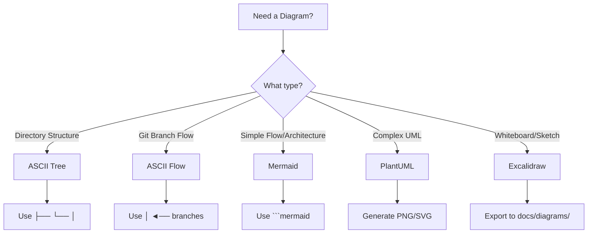
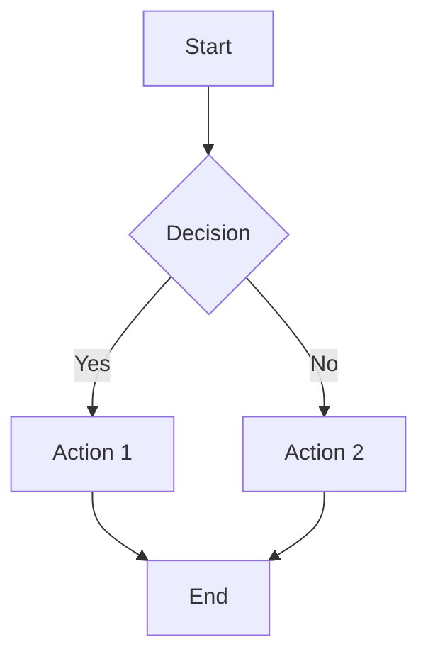
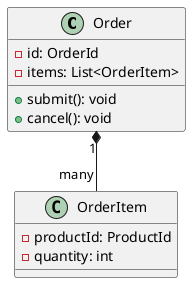
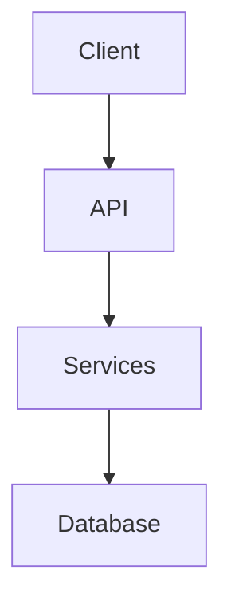
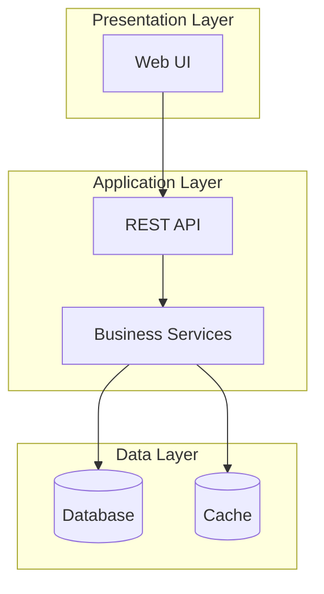
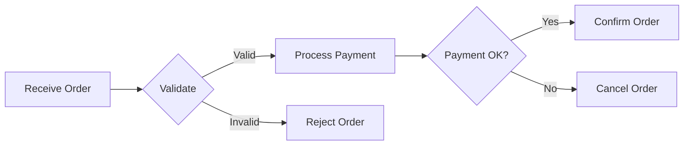
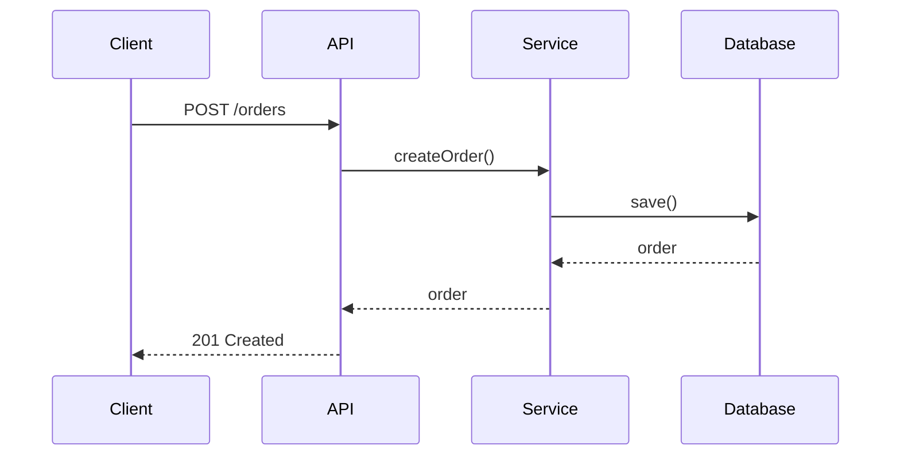

# Diagram Standards and Best Practices

## Overview

This document defines when and how to use different diagram formats in our documentation. Choosing the right format improves readability, maintainability, and GitHub rendering.

---

## Diagram Format Decision Tree



---

## When to Use Each Format

### ASCII Art

**Use For:**
- ✅ Directory/file structures
- ✅ Git branch workflows
- ✅ Simple hierarchical trees
- ✅ Quick inline examples

**Advantages:**
- Fast to create and edit
- No external tools needed
- Clear in plain text
- Version control friendly
- Works in all environments

**Disadvantages:**
- Limited visual complexity
- Hard to maintain for large diagrams
- No automatic rendering

**Example:**

```text
src/
├── domain/
│   ├── customer/
│   ├── order/
│   └── shared/
├── application/
└── infrastructure/
```

**When NOT to Use:**
- Complex flowcharts with multiple paths
- Architecture diagrams with many components
- Diagrams that need frequent updates

---

### Mermaid

**Use For:**
- ✅ Flowcharts and process flows
- ✅ Architecture diagrams
- ✅ Sequence diagrams
- ✅ State diagrams
- ✅ Entity relationship diagrams
- ✅ Gantt charts

**Advantages:**
- Native GitHub rendering
- Easy to update (text-based)
- Version control friendly
- Multiple diagram types
- Good for documentation

**Disadvantages:**
- Limited layout control
- Cannot handle very complex diagrams
- Styling options are limited

**Example:**



**Best Practices:**
- Keep diagrams simple (< 20 nodes)
- Use descriptive node labels
- Group related nodes with subgraphs
- Use appropriate diagram type (graph, sequenceDiagram, etc.)

**File Location:**
- Inline in markdown: `docs/**/*.md`
- Standalone files: `docs/diagrams/mermaid/*.mmd`

---

### PlantUML

**Use For:**
- ✅ Detailed UML class diagrams
- ✅ Complex component diagrams
- ✅ Deployment diagrams
- ✅ Professional documentation
- ✅ Precise layout requirements

**Advantages:**
- Comprehensive UML support
- Fine-grained layout control
- Professional output quality
- Supports complex diagrams
- Good for architecture documentation

**Disadvantages:**
- Requires generation step
- Not rendered natively on GitHub
- Needs Java runtime
- Steeper learning curve

**Example:**



**Best Practices:**
- Use for detailed technical diagrams
- Generate both PNG and SVG
- Store source in `docs/diagrams/viewpoints/`
- Store generated in `docs/diagrams/generated/`
- Reference PNG in markdown (better GitHub display)

**Generation:**
```bash
./scripts/generate-diagrams.sh --format=png
```

**File Organization:**
```text
docs/diagrams/
├── viewpoints/
│   ├── functional/*.puml
│   ├── information/*.puml
│   └── deployment/*.puml
└── generated/
    ├── functional/*.png
    ├── information/*.png
    └── deployment/*.png
```

---

### Excalidraw

**Use For:**
- ✅ Whiteboard-style sketches
- ✅ Brainstorming diagrams
- ✅ Hand-drawn look diagrams
- ✅ Collaborative design sessions
- ✅ Conceptual illustrations

**Advantages:**
- Intuitive drawing interface
- Hand-drawn aesthetic
- Great for collaboration
- Easy to create quickly
- Good for presentations

**Disadvantages:**
- Not text-based (harder to version)
- Requires export step
- Not suitable for precise diagrams
- Larger file sizes

**Best Practices:**
- Use for early-stage design
- Export to PNG/SVG for documentation
- Store source `.excalidraw` files
- Use for high-level concepts only

**File Organization:**
```text
docs/diagrams/excalidraw/
├── sources/
│   └── *.excalidraw
└── exports/
    └── *.png
```

**Workflow:**
1. Create diagram in Excalidraw
2. Save source to `docs/diagrams/excalidraw/sources/`
3. Export PNG to `docs/diagrams/excalidraw/exports/`
4. Reference PNG in markdown

---

## Conversion Guidelines

### ASCII to Mermaid

**Convert When:**
- Diagram has arrows (→, ↓) indicating flow
- Multiple paths or decision points
- Need better GitHub rendering
- Diagram is frequently updated

**Keep ASCII When:**
- Simple directory structures
- Git branch flows
- Hierarchical trees
- Quick inline examples

**Conversion Tool:**
```bash
python3 scripts/convert-ascii-to-mermaid.py docs/ .kiro/
```

### Mermaid to PlantUML

**Convert When:**
- Need precise layout control
- Diagram becomes too complex (> 20 nodes)
- Professional documentation required
- UML compliance needed

### PlantUML to Excalidraw

**Convert When:**
- Need hand-drawn aesthetic
- Presenting to non-technical audience
- Want more visual flexibility
- Creating marketing materials

---

## Diagram Maintenance

### Update Frequency

| Format | Update Effort | Best For |
|--------|--------------|----------|
| ASCII | Low | Frequently changing structures |
| Mermaid | Low | Evolving processes |
| PlantUML | Medium | Stable architecture |
| Excalidraw | High | One-time illustrations |

### Version Control

**Text-Based (ASCII, Mermaid, PlantUML):**
- ✅ Commit source files
- ✅ Easy to review changes
- ✅ Merge conflicts manageable
- ✅ History tracking clear

**Binary (Excalidraw exports, PNG):**
- ⚠️ Commit both source and exports
- ⚠️ Use Git LFS for large files
- ⚠️ Difficult to review changes
- ⚠️ Merge conflicts problematic

### Documentation Standards

**Every diagram should have:**
1. **Title**: Clear, descriptive name
2. **Context**: What does it show?
3. **Date**: When was it created/updated?
4. **Owner**: Who maintains it?
5. **Related Docs**: Links to related documentation

**Example:**

```markdown
## System Architecture Overview

**Purpose**: Shows the high-level architecture of the e-commerce platform

**Last Updated**: 2025-11-08

**Owner**: Architecture Team



**Related Documentation:**
- [Deployment Viewpoint](../viewpoints/deployment/overview.md)
- [ADR-002: Hexagonal Architecture](../architecture/adrs/002-adopt-hexagonal-architecture.md)
```

---

## Quality Checklist

### Before Creating a Diagram

- [ ] Is a diagram really needed? (Can text explain it better?)
- [ ] What is the target audience? (Technical vs. non-technical)
- [ ] How often will it change? (Choose format accordingly)
- [ ] Where will it be used? (GitHub, presentations, print)

### After Creating a Diagram

- [ ] Is it clear and easy to understand?
- [ ] Are labels descriptive and consistent?
- [ ] Is the complexity appropriate? (Not too simple or complex)
- [ ] Is it properly documented? (Title, context, date)
- [ ] Is it in the right location?
- [ ] Does it render correctly on GitHub?

---

## Common Patterns

### Architecture Diagrams

**Use:** Mermaid for simple, PlantUML for complex



### Process Flows

**Use:** Mermaid



### Sequence Diagrams

**Use:** Mermaid



### Directory Structures

**Use:** ASCII

```text
project/
├── src/
│   ├── main/
│   │   ├── java/
│   │   └── resources/
│   └── test/
│       ├── java/
│       └── resources/
├── docs/
└── scripts/
```

---

## Tools and Resources

### Mermaid
- **Live Editor**: https://mermaid.live/
- **Documentation**: https://mermaid.js.org/
- **VS Code Extension**: Mermaid Preview

### PlantUML
- **Live Editor**: http://www.plantuml.com/plantuml/
- **Documentation**: https://plantuml.com/
- **VS Code Extension**: PlantUML

### Excalidraw
- **Web App**: https://excalidraw.com/
- **VS Code Extension**: Excalidraw

### ASCII Art
- **ASCII Flow**: https://asciiflow.com/
- **Tree Generator**: `tree` command (macOS/Linux)

---

## Migration Strategy

### Existing Diagrams

1. **Audit**: Identify all diagrams in documentation
2. **Categorize**: Classify by type and complexity
3. **Prioritize**: Focus on frequently accessed docs
4. **Convert**: Use appropriate format
5. **Validate**: Ensure rendering and clarity
6. **Document**: Update references and metadata

### New Diagrams

1. **Plan**: Choose format based on guidelines
2. **Create**: Use recommended tools
3. **Review**: Check quality checklist
4. **Document**: Add context and metadata
5. **Commit**: Include source and generated files

---

## Related Documentation

- [Diagram Generation Standards](diagram-generation-standards.md) - PlantUML generation details
- [Development Standards](development-standards.md) - General documentation standards
- [Code Review Standards](code-review-standards.md) - Review process for diagrams

---

**Document Version**: 1.0  
**Last Updated**: 2025-11-08  
**Owner**: Documentation Team
