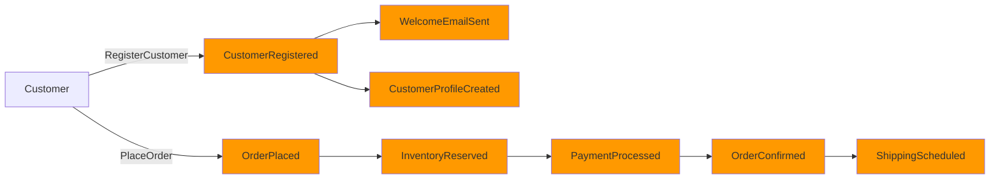
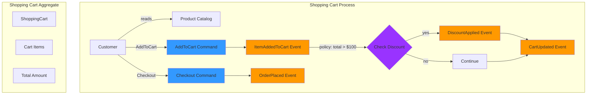
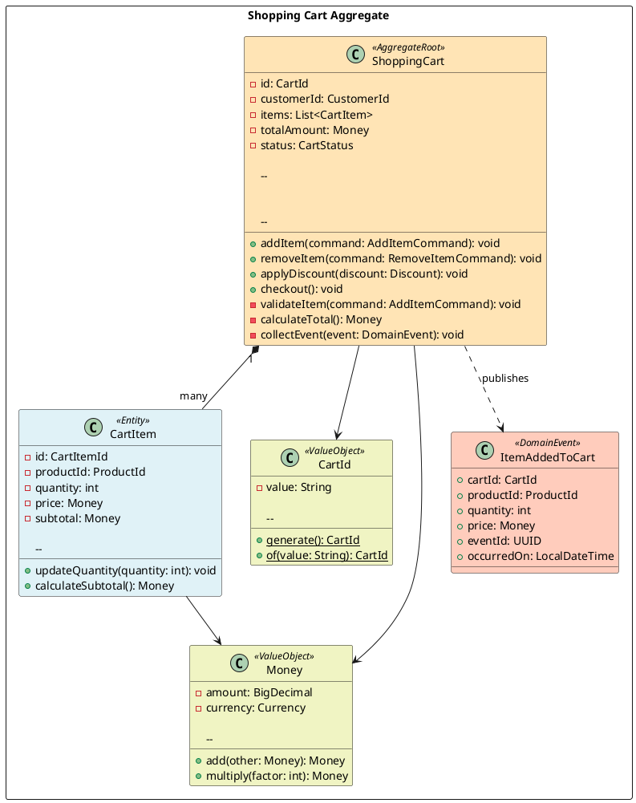

# Event Storming Standards and Guidelines

## Overview

This document provides comprehensive guidelines for conducting Event Storming workshops and documenting the results in our DDD + Hexagonal Architecture project. Event Storming is a collaborative workshop technique for exploring complex business domains through domain events.

> **🔗 Related Standards**:
>
> - [Domain Events](domain-events.md) - Implementation of discovered events
> - [Development Standards](development-standards.md) - Architecture and coding standards
> - [Diagram Generation Standards](diagram-generation-standards.md) - Visual documentation

## Event Storming Fundamentals

### What is Event Storming

Event Storming is a rapid, lightweight, and often fun workshop technique for collaborative exploration of complex business domains. It was invented by Alberto Brandolini and focuses on domain events as the primary building blocks.

### Core Principles

1. **Invite the Right People**: Domain experts, developers, product owners, and stakeholders
2. **Unlimited Modeling Space**: Use a large wall or digital whiteboard
3. **Domain Events First**: Start with what happens in the domain
4. **Temporal Flow**: Arrange events in chronological order
5. **Collaborative Discovery**: Everyone participates equally
6. **Visual Language**: Use color-coded sticky notes

## Event Storming Color Coding Standard

### Standard Color Palette

| Color | Element | Description | Example |
|-------|---------|-------------|---------|
| 🟧 **Orange** | Domain Event | Something that happened in the past | `CustomerRegistered`, `OrderPlaced` |
| 🟦 **Blue** | Command | Action that triggers an event | `RegisterCustomer`, `PlaceOrder` |
| 🟨 **Yellow** | Actor/User | Person or system initiating commands | `Customer`, `Admin`, `PaymentGateway` |
| 🟪 **Purple** | Policy/Rule | Business rule or automation | `When OrderPlaced, then ReserveInventory` |
| 🟩 **Green** | Read Model/View | Information displayed to users | `OrderSummary`, `CustomerProfile` |
| 🟥 **Red** | Hot Spot | Problem, question, or concern | `What if payment fails?` |
| 📄 **White** | External System | Third-party system or service | `PaymentGateway`, `EmailService` |
| 🟫 **Brown** | Aggregate | Consistency boundary | `Order`, `Customer`, `Product` |

## Three Phases of Event Storming

### Phase 1: Big Picture Event Storming

**Goal**: Understand the entire business process flow and identify domain events

**Duration**: 2-4 hours

**Participants**: All stakeholders, domain experts, developers

#### Activities

1. **Chaotic Exploration** (30-45 min)
   - Everyone writes domain events on orange sticky notes
   - Place events on the timeline without order
   - Focus on "what happened" not "how it happened"
   - Use past tense verbs

2. **Enforce Timeline** (45-60 min)
   - Arrange events in chronological order
   - Identify parallel flows
   - Group related events
   - Mark unclear areas with red hot spots

3. **Add Actors and External Systems** (30-45 min)
   - Identify who triggers each event
   - Mark external systems involved
   - Document system boundaries

4. **Identify Pivotal Events** (15-30 min)
   - Mark events that change system state significantly
   - Identify events that trigger multiple consequences
   - These often become aggregate boundaries

#### Deliverables

- Complete timeline of domain events
- Identified actors and external systems
- Hot spots and questions documented
- Initial understanding of business process flow

#### Example Output Structure

```json
[Customer] --RegisterCustomer--> [CustomerRegistered] 
    --> [WelcomeEmailSent]
    --> [CustomerProfileCreated]

[Customer] --PlaceOrder--> [OrderPlaced]
    --> [InventoryReserved]
    --> [PaymentProcessed]
    --> [OrderConfirmed]
    --> [ShippingScheduled]
```

### Phase 2: Process Level Event Storming

**Goal**: Deep dive into specific processes, identify commands, policies, and aggregates

**Duration**: 2-3 hours per process

**Participants**: Domain experts, developers, product owners

#### Activities

1. **Select Process** (15 min)
   - Choose a specific business process from Phase 1
   - Define process boundaries
   - Set clear goals for the session

2. **Add Commands** (45-60 min)
   - For each event, identify the command that triggered it
   - Place blue command sticky notes before events
   - Connect commands to actors

3. **Identify Policies** (30-45 min)
   - Find automation rules: "When X happens, then do Y"
   - Place purple policy sticky notes
   - Document business rules and constraints

4. **Define Read Models** (30-45 min)
   - Identify information needed to make decisions
   - Place green read model sticky notes
   - Connect to commands that use them

5. **Identify Aggregates** (45-60 min)
   - Group related commands and events
   - Define consistency boundaries
   - Name aggregates (brown sticky notes)
   - Validate with domain experts

#### Deliverables

- Detailed process flow with commands, events, and policies
- Identified aggregates and their boundaries
- Read models and their relationships
- Business rules documented

#### Example Output Structure

```json
[Customer] 
    --reads--> [ProductCatalog]
    --executes--> [AddToCart]
        --> [ItemAddedToCart]
            --policy--> "If cart total > $100, apply discount"
                --> [DiscountApplied]
    
[ShoppingCart Aggregate]

    - AddToCart
    - RemoveFromCart
    - ApplyDiscount
    - Checkout

```

### Phase 3: Design Level Event Storming

**Goal**: Translate discoveries into technical design and implementation details

**Duration**: 2-3 hours per aggregate

**Participants**: Developers, architects, technical leads

#### Activities

1. **Refine Aggregates** (45-60 min)
   - Define aggregate root
   - Identify entities and value objects
   - Define aggregate invariants
   - Document state transitions

2. **Design Commands** (30-45 min)
   - Define command structure and validation
   - Identify command handlers
   - Document preconditions and postconditions

3. **Design Events** (30-45 min)
   - Define event structure and payload
   - Identify event handlers
   - Document event versioning strategy

4. **Define Bounded Contexts** (45-60 min)
   - Group related aggregates
   - Define context boundaries
   - Identify context maps and relationships
   - Document integration patterns

5. **Technical Decisions** (30-45 min)
   - Database schema considerations
   - API design
   - Integration patterns
   - Technology choices

#### Deliverables

- Aggregate design with entities and value objects
- Command and event specifications
- Bounded context map
- Technical architecture decisions
- Implementation roadmap

#### Example Output Structure

```java
// Aggregate Root
@AggregateRoot
public class ShoppingCart {
    private CartId id;
    private CustomerId customerId;
    private List<CartItem> items;
    private Money totalAmount;
    
    // Commands
    public void addItem(AddItemCommand command) {
        validateItem(command);
        CartItem item = new CartItem(command);
        items.add(item);
        collectEvent(ItemAddedToCart.create(id, item));
    }
    
    // Business Rules
    private void validateItem(AddItemCommand command) {
        if (command.quantity() <= 0) {
            throw new InvalidQuantityException();
        }
    }
}

// Domain Event
public record ItemAddedToCart(
    CartId cartId,
    ProductId productId,
    int quantity,
    Money price,
    UUID eventId,
    LocalDateTime occurredOn
) implements DomainEvent { }
```

## Diagram Generation for Event Storming

### Recommended Approach: Mermaid for Event Storming

**Why Mermaid?**

- Native GitHub rendering
- Easy to update and maintain
- Collaborative editing
- Version control friendly
- Quick iterations

**When to Use PlantUML?**

- Final documentation requiring precise layout
- Complex aggregate diagrams
- Professional presentations
- Detailed class diagrams

### Phase 1: Big Picture - Mermaid Timeline



**File Location**: `docs/diagrams/mermaid/event-storming/phase1-big-picture.md`

### Phase 2: Process Level - Mermaid Flowchart



**File Location**: `docs/diagrams/mermaid/event-storming/phase2-shopping-cart-process.md`

### Phase 3: Design Level - PlantUML Class Diagram

For Phase 3, use PlantUML for detailed aggregate design:



**File Location**: `docs/diagrams/viewpoints/functional/shopping-cart-aggregate.puml`

**Generated**: `docs/diagrams/generated/functional/shopping-cart-aggregate.png`

## Documentation Structure

### Event Storming Session Documentation

Create a dedicated directory for each Event Storming session:

```text
docs/event-storming/
├── sessions/
│   ├── 2025-01-20-big-picture/
│   │   ├── README.md                    # Session overview
│   │   ├── participants.md              # Attendees and roles
│   │   ├── timeline.md                  # Event timeline
│   │   ├── hot-spots.md                 # Questions and concerns
│   │   └── diagrams/
│   │       └── big-picture-timeline.md  # Mermaid diagram
│   │
│   ├── 2025-01-22-order-process/
│   │   ├── README.md
│   │   ├── commands-and-events.md
│   │   ├── policies.md
│   │   ├── aggregates.md
│   │   └── diagrams/
│   │       └── order-process-flow.md
│   │
│   └── 2025-01-24-shopping-cart-design/
│       ├── README.md
│       ├── aggregate-design.md
│       ├── bounded-context.md
│       ├── technical-decisions.md
│       └── diagrams/
│           └── shopping-cart-aggregate.puml
│
└── templates/
    ├── session-template.md
    ├── big-picture-template.md
    ├── process-level-template.md
    └── design-level-template.md
```

### Session Documentation Template

```markdown
---
title: "Event Storming Session: {Process Name}"
date: "YYYY-MM-DD"
phase: "big-picture|process-level|design-level"
facilitator: "Name"
participants: ["Name1", "Name2", "Name3"]
duration: "X hours"
status: "completed|in-progress|planned"
---

# Event Storming: {Process Name}

## Session Overview

**Phase**: {Phase Number and Name}
**Date**: YYYY-MM-DD
**Duration**: X hours
**Facilitator**: Name

## Participants

- **Domain Experts**: Name1, Name2
- **Developers**: Name3, Name4
- **Product Owners**: Name5
- **Stakeholders**: Name6

## Goals

1. Goal 1
2. Goal 2
3. Goal 3

## Discoveries

### Domain Events

| Event Name | Description | Triggered By | Consequences |
|------------|-------------|--------------|--------------|
| CustomerRegistered | Customer completes registration | RegisterCustomer command | Welcome email sent, Profile created |
| OrderPlaced | Customer places an order | PlaceOrder command | Inventory reserved, Payment processed |

### Commands

| Command Name | Description | Actor | Preconditions | Postconditions |
|--------------|-------------|-------|---------------|----------------|
| RegisterCustomer | Register new customer | Customer | Valid email, Unique email | CustomerRegistered event |
| PlaceOrder | Place a new order | Customer | Items in cart, Valid payment | OrderPlaced event |

### Policies

| Policy | Trigger | Action | Business Rule |
|--------|---------|--------|---------------|
| Auto-discount | Cart total > $100 | Apply 10% discount | Premium customers only |
| Inventory check | OrderPlaced | Reserve inventory | Must have sufficient stock |

### Aggregates

| Aggregate Name | Responsibilities | Commands | Events |
|----------------|------------------|----------|--------|
| ShoppingCart | Manage cart items | AddToCart, RemoveFromCart, Checkout | ItemAdded, ItemRemoved, OrderPlaced |
| Customer | Manage customer profile | RegisterCustomer, UpdateProfile | CustomerRegistered, ProfileUpdated |

## Hot Spots

### Unresolved Questions

1. **Question**: What happens if payment fails after inventory is reserved?
   - **Impact**: High
   - **Owner**: Product Team
   - **Status**: Open

2. **Question**: How long should we hold inventory reservation?
   - **Impact**: Medium
   - **Owner**: Business Team
   - **Status**: Resolved - 15 minutes

### Technical Concerns

1. **Concern**: Handling concurrent cart updates
   - **Solution**: Optimistic locking with version numbers
   - **Status**: Resolved

## Diagrams

### Process Flow

```mermaid
[Include Mermaid diagram here]
```text

## Next Steps

1. [ ] Schedule follow-up session for {specific process}
2. [ ] Resolve open hot spots
3. [ ] Create technical design documents
4. [ ] Begin implementation of {aggregate name}

## Related Documentation

- [Domain Events Implementation](../../architecture/domain-events.md)
- [Aggregate Design](../../viewpoints/functional/aggregates.md)
- [Bounded Context Map](../../viewpoints/context/bounded-contexts.md)

---

**Session Notes**: [Link to detailed notes if available]
**Recording**: [Link to session recording if available]

```

## Best Practices

### Workshop Facilitation

1. **Preparation**
   - Book a large room with wall space or use digital whiteboard
   - Prepare sticky notes in all required colors
   - Invite all necessary participants
   - Set clear objectives and time limits

2. **During the Session**
   - Start with domain events, not solutions
   - Encourage everyone to participate
   - Don't get stuck on details in Phase 1
   - Use hot spots to park unresolved questions
   - Take photos of the board regularly

3. **After the Session**
   - Document discoveries immediately
   - Create digital diagrams from photos
   - Share results with all participants
   - Schedule follow-up sessions
   - Track action items

### Common Pitfalls to Avoid

1. **Starting with Solutions**: Focus on "what happened" not "how to implement"
2. **Skipping Phases**: Each phase builds on the previous one
3. **Too Much Detail Too Soon**: Keep Phase 1 high-level
4. **Ignoring Domain Experts**: They know the business best
5. **Not Documenting Hot Spots**: Capture all questions and concerns
6. **Forgetting to Take Photos**: Document the board state regularly

### Integration with Development

1. **From Event Storming to Code**
   - Use discovered events to create domain event classes
   - Implement aggregates based on consistency boundaries
   - Create commands from identified actions
   - Implement policies as event handlers

2. **Continuous Refinement**
   - Update Event Storming diagrams as understanding evolves
   - Conduct mini-sessions for new features
   - Review and validate with domain experts regularly

## Tools and Resources

### Digital Tools

- **Miro**: Excellent for remote Event Storming
- **Mural**: Good collaboration features
- **FigJam**: Simple and intuitive
- **EventStorming.com**: Official resources and templates

### Physical Materials

- **Sticky Notes**: Orange, blue, yellow, purple, green, red, white, brown
- **Markers**: Black for writing, colored for highlighting
- **Wall Space**: At least 4-6 meters of continuous wall
- **Painter's Tape**: For creating timeline
- **Camera**: For documenting the board

## References

- **Book**: "Introducing EventStorming" by Alberto Brandolini
- **Website**: https://www.eventstorming.com/
- **Video**: "50,000 Orange Stickies Later" by Alberto Brandolini
- **Community**: EventStorming Slack community

---

**Document Version**: 1.0
**Last Updated**: 2025-01-17
**Owner**: Architecture Team
