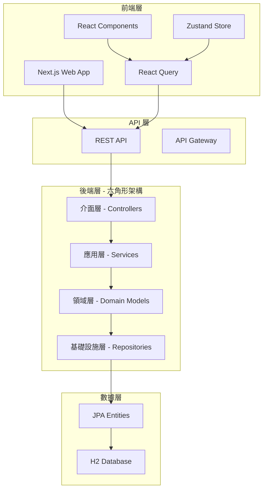

# GenAI Demo - 全棧電商管理系統

> **完整的 DDD + 六角形架構示範專案**  
> 🚀 **後端**: Spring Boot 3 + Java 21 + DDD  
> 🎨 **前端**: Next.js 14 + React 18 + TypeScript

這是一個展示現代軟體架構最佳實踐的全棧電商管理系統，結合了領域驅動設計 (DDD)、六角形架構 (Hexagonal Architecture) 和現代前端技術。

## 🏗️ 系統架構



## 🎯 專案特色

### 後端特色
- ✅ **DDD 戰術模式**: 聚合根、實體、值對象、領域事件
- ✅ **六角形架構**: 端口與適配器模式
- ✅ **事件驅動**: 領域事件發布與訂閱
- ✅ **CQRS 模式**: 命令查詢職責分離
- ✅ **架構測試**: ArchUnit 確保架構合規性
- ✅ **BDD 測試**: Cucumber 行為驅動開發
- ✅ **測試報告**: Allure 詳細測試報告

### 前端特色
- ✅ **現代化 UI**: shadcn/ui + Tailwind CSS
- ✅ **類型安全**: 完整 TypeScript 支援
- ✅ **狀態管理**: Zustand + React Query
- ✅ **響應式設計**: 支援桌面、平板、手機
- ✅ **實時更新**: 自動數據同步和緩存
- ✅ **錯誤處理**: 優雅的錯誤處理和重試機制

## 🚀 快速開始

### 方法一：一鍵啟動（推薦）

```bash
# 克隆專案
git clone <your-repo-url>
cd genai-demo

# 一鍵啟動全棧應用
./start-fullstack.sh
```

### 方法二：分別啟動

#### 啟動後端
```bash
# 構建並運行後端
./gradlew bootRun

# 或運行所有測試
./gradlew runAllTestsWithReport
```

#### 啟動前端
```bash
# 進入前端目錄
cd frontend

# 安裝依賴
npm install

# 啟動開發服務器
npm run dev
```

### 訪問應用

- 🎨 **前端應用**: http://localhost:3000
- 🔧 **後端 API**: http://localhost:8080
- 📊 **API 文檔**: http://localhost:8080/swagger-ui.html
- 🏥 **健康檢查**: http://localhost:8080/actuator/health

## 📱 功能模組

### 1. 訂單管理系統
- **創建訂單**: 支援多商品訂單創建
- **狀態管理**: 完整的訂單生命週期管理
- **項目管理**: 動態添加/移除訂單項目
- **折扣應用**: 支援各種促銷折扣

### 2. 商品管理系統
- **商品目錄**: 完整的商品資訊管理
- **庫存控制**: 實時庫存監控和預留
- **分類管理**: 商品分類和標籤系統
- **價格管理**: 動態定價和促銷價格

### 3. 客戶管理系統
- **客戶檔案**: 完整的客戶資料管理
- **會員等級**: 多層級會員系統
- **購買記錄**: 客戶購買歷史追蹤
- **偏好設定**: 個人化設定和通知偏好

### 4. 支付處理系統
- **多種支付方式**: 信用卡、電子錢包等
- **支付狀態追蹤**: 實時支付狀態更新
- **退款處理**: 完整的退款流程
- **安全保障**: 支付安全和風險控制

### 5. 促銷活動系統
- **閃購活動**: 限時特價促銷
- **優惠券系統**: 多種類型優惠券
- **滿額贈品**: 購滿贈送活動
- **加購優惠**: 搭配商品優惠

### 6. 物流配送系統
- **配送安排**: 智能配送路線規劃
- **狀態追蹤**: 實時配送狀態更新
- **配送選項**: 多種配送方式選擇
- **異常處理**: 配送異常處理流程

## 🧪 測試策略

### 後端測試
```bash
# 運行所有測試
./gradlew runAllTests

# 運行單元測試
./gradlew test

# 運行 BDD 測試
./gradlew cucumber

# 運行架構測試
./gradlew testArchitecture

# 生成測試報告
./gradlew runAllTestsWithReport
```

### 前端測試
```bash
cd frontend

# 運行單元測試
npm run test

# 運行 E2E 測試
npm run test:e2e

# 類型檢查
npm run type-check
```

## 📊 測試覆蓋率

- **單元測試**: 覆蓋領域邏輯和業務規則
- **整合測試**: 測試各層之間的協作
- **BDD 測試**: 驗證業務需求和用戶故事
- **架構測試**: 確保架構規範和約束
- **E2E 測試**: 端到端用戶流程測試

## 🔧 開發工具

### 後端工具
- **IDE**: IntelliJ IDEA / Eclipse
- **構建**: Gradle 8.x
- **測試**: JUnit 5, Cucumber, ArchUnit
- **報告**: Allure 2
- **文檔**: PlantUML, Swagger

### 前端工具
- **IDE**: VS Code / WebStorm
- **構建**: Next.js 14
- **測試**: Jest, Playwright
- **開發**: React DevTools, React Query DevTools
- **樣式**: Tailwind CSS IntelliSense

## 📚 學習資源

### 架構模式
- [領域驅動設計 (DDD)](docs/DesignGuideline.MD)
- [六角形架構實現](docs/HexagonalArchitectureSummary.md)
- [事件驅動架構](docs/architecture-overview.md)

### 測試實踐
- [BDD 測試指南](docs/uml/es-gen-guidance-tc.md)
- [架構測試規範](app/src/test/java/solid/humank/genaidemo/architecture/README.md)
- [測試最佳實踐](docs/releases/test-quality-improvement-2025-07-18.md)

### 前端開發
- [React 最佳實踐](frontend/README.md)
- [TypeScript 指南](frontend/src/types/domain.ts)
- [狀態管理模式](frontend/src/lib/store.ts)

## 🚀 部署指南

### Docker 部署

#### 後端 Dockerfile
```dockerfile
FROM openjdk:21-jdk-slim
COPY app/build/libs/*.jar app.jar
EXPOSE 8080
ENTRYPOINT ["java", "-jar", "/app.jar"]
```

#### 前端 Dockerfile
```dockerfile
FROM node:18-alpine
WORKDIR /app
COPY frontend/package*.json ./
RUN npm ci --only=production
COPY frontend/ .
RUN npm run build
EXPOSE 3000
CMD ["npm", "start"]
```

#### Docker Compose
```yaml
version: '3.8'
services:
  backend:
    build: .
    ports:
      - "8080:8080"
    environment:
      - SPRING_PROFILES_ACTIVE=docker
  
  frontend:
    build: ./frontend
    ports:
      - "3000:3000"
    environment:
      - NEXT_PUBLIC_API_URL=http://backend:8080/api
    depends_on:
      - backend
```

### 雲端部署

#### AWS 部署
- **後端**: AWS ECS + RDS
- **前端**: Vercel / AWS Amplify
- **CDN**: CloudFront

#### Azure 部署
- **後端**: Azure Container Instances
- **前端**: Azure Static Web Apps
- **數據庫**: Azure Database

## 🔒 安全考量

### 後端安全
- **認證授權**: Spring Security + JWT
- **數據驗證**: Bean Validation
- **SQL 注入防護**: JPA + Prepared Statements
- **CORS 配置**: 跨域請求控制

### 前端安全
- **XSS 防護**: React 內建防護
- **CSRF 防護**: CSRF Token
- **內容安全策略**: CSP Headers
- **敏感數據**: 環境變數管理

## 🎯 性能優化

### 後端優化
- **數據庫優化**: 索引、查詢優化
- **緩存策略**: Redis / 內存緩存
- **連接池**: HikariCP 配置
- **JVM 調優**: 垃圾回收優化

### 前端優化
- **代碼分割**: Next.js 自動分割
- **圖片優化**: Next.js Image 組件
- **緩存策略**: React Query 緩存
- **懶加載**: 組件和路由懶加載

## 🤝 貢獻指南

1. **Fork 專案**
2. **創建功能分支** (`git checkout -b feature/AmazingFeature`)
3. **遵循代碼規範** (ESLint + Prettier)
4. **添加測試** (單元測試 + 整合測試)
5. **提交更改** (`git commit -m 'Add some AmazingFeature'`)
6. **推送分支** (`git push origin feature/AmazingFeature`)
7. **開啟 Pull Request**

## 📈 路線圖

### 短期目標 (1-3 個月)
- [ ] 完善移動端響應式設計
- [ ] 添加實時通知功能
- [ ] 實現數據導出功能
- [ ] 添加更多支付方式

### 中期目標 (3-6 個月)
- [ ] 微服務架構重構
- [ ] 添加 GraphQL API
- [ ] 實現離線功能 (PWA)
- [ ] 添加多語言支援

### 長期目標 (6-12 個月)
- [ ] AI 推薦系統
- [ ] 大數據分析平台
- [ ] 區塊鏈整合
- [ ] 雲原生部署

## 📄 授權

本專案採用 MIT 授權協議 - 詳見 [LICENSE](LICENSE) 文件。

## 🙏 致謝

感謝所有為這個專案做出貢獻的開發者和社區成員。

---

**Happy Coding! 🚀**
