# 現代軟體架構最佳實踐範例專案

> **基於 Rozanski & Woods 方法論的企業級架構展示**

> **Language / 語言選擇**  
> 🇺🇸 **English**: [English Documentation](docs/en/README.md) | [English Project README](docs/en/PROJECT_README.md)  
> 🇹🇼 **繁體中文**: 您正在閱讀繁體中文版本

這不是一個簡單的電商 demo，而是一個**現代軟體架構最佳實踐的綜合展示專案**，完整實現了企業級架構方法論、AI 輔助開發和品質工程標準。

## 🎯 專案價值主張

這個專案展示了現代軟體架構的完整實踐，涵蓋從架構設計到品質工程的各個層面：

### 🏗️ 架構方法論展示

**完整實現 Rozanski & Woods 的 7 大 Viewpoints + 8 大 Perspectives**
- **功能視點**: DDD 戰術模式 + 聚合根設計 + 界限上下文
- **資訊視點**: 領域事件 + Event Storming + 資料一致性策略
- **並發視點**: 事件驅動架構 + 非同步處理 + 交易邊界
- **開發視點**: 六角架構 + 測試策略 + 建置系統
- **部署視點**: 容器化 + 雲端架構 + 基礎設施即程式碼
- **運營視點**: 可觀測性 + 監控 + SRE 實踐

### 🎯 最佳實踐集合

**DDD + 六角架構 + 事件驅動 + 測試驅動開發**
- **13 個界限上下文**: 完整的戰術和戰略模式實現
- **568 個測試**: BDD + TDD + 架構測試，100% 通過率
- **Java 21 Record**: 減少 30-40% 樣板代碼，提升類型安全
- **事件驅動設計**: 完整的事件收集、發布和處理機制

### 📊 可觀測性系統現狀

#### ✅ 目前已實現

- **結構化日誌**: 統一格式 + 關聯 ID + PII 遮罩
- **基礎監控**: Spring Boot Actuator + 健康檢查
- **前端追蹤**: 用戶行為分析和性能監控（本地處理）
- **基礎 API**: 部分 Analytics API 端點可用

#### 🚧 部分實現（前端就緒，後端計劃中）

- **Analytics API**: 前端完整實現，後端部分可用
- **管理儀表板**: UI 完整，使用模擬數據展示

#### 🚀 下一階段開發計劃

**Phase 1: WebSocket 即時功能 (1-2個月)**

- **🔌 WebSocket 後端**: 實現 `/ws/analytics` 端點和訊息處理
- **📊 即時儀表板**: 啟用真實的即時數據推送
- **📈 Event Streaming**: 完整的事件追蹤和分析系統

**Phase 2: 高級分析功能 (2-3個月)**

- **🎯 Performance Monitoring**: 後端性能監控和 Web Vitals 整合
- **🔍 Error Tracking**: 增強的錯誤追蹤和報告系統
- **☁️ CloudWatch 整合**: 自定義指標 + Prometheus 端點

**Phase 3: 企業級功能 (3+個月)**

- **⚡ Kafka 消息中間件**: 分散式事件處理
- **🤖 智能警報**: 基於機器學習的異常檢測
- **📊 高級分析**: 預測分析和業務智能

### 🤖 AI 輔助開發工具

#### MCP (Model Context Protocol) 整合

本專案整合了完整的 MCP 工具生態系統，提供 AI 輔助的架構分析、成本優化和可視化功能：

- **🎨 Excalidraw MCP**: AI 驅動的圖表創建和架構可視化
- **📚 AWS Docs MCP**: 即時 AWS 文檔查詢和最佳實踐指導
- **💰 AWS Pricing MCP**: 自動化成本分析和優化建議
- **🔧 AWS CDK MCP**: CDK 最佳實踐檢查和 Nag 規則解釋
- **⏰ Time MCP**: 時區轉換和時間格式化工具

#### 快速開始 MCP 設置

```bash
# 一鍵安裝所有 MCP 服務器
./scripts/setup-mcp-servers.sh

# 或手動安裝 Excalidraw MCP
npm install mcp-excalidraw-server
```

**詳細指南**:
- 📖 [MCP 整合指南](infrastructure/docs/MCP_INTEGRATION_GUIDE.md)
- 🎨 [Excalidraw MCP 使用指南](docs/mcp/excalidraw-mcp-usage-guide.md)
- 🚀 [快速開始指南](infrastructure/docs/MCP_INTEGRATION_GUIDE.md#-quick-start-installation-guide)

### 🤖 AI 輔助開發展示

**Model Context Protocol (MCP) 整合，展示未來開發模式**

#### 🔧 完整的 AI 輔助開發工具鏈

- **📚 智能文檔查詢**: AWS 官方文檔即時搜索和最佳實踐指導
- **💰 成本優化分析**: 自動化 CDK/Terraform 成本分析和優化建議
- **🏗️ 架構決策支援**: CDK Nag 規則解釋和最佳實踐建議
- **🎨 可視化設計**: Excalidraw MCP 支援 AI 驅動的圖表創建
- **⏰ 開發工具**: 時區轉換、時間格式化等實用工具

#### 🚀 AI 輔助開發價值

- **開發效率提升**: 減少查找文檔時間，提高開發決策品質
- **架構合規檢查**: 自動化架構最佳實踐驗證
- **成本意識開發**: 開發階段即時成本分析和優化建議
- **知識管理**: 將企業知識整合到開發工作流程中

#### ⚙️ MCP 配置範例

```bash
# 專案級別 MCP 配置
.kiro/settings/mcp.json

# 一鍵安裝所有 MCP 服務器
./scripts/setup-mcp-servers.sh
```

### 📚 學習資源

**120+ 文件，涵蓋完整的企業級開發標準**
- **架構文檔**: 完整的 Rozanski & Woods 方法論實踐
- **開發標準**: 安全、性能、程式碼審查、測試標準
- **最佳實踐**: DDD、六角架構、事件驅動設計指南
- **實戰範例**: 基於真實業務場景的完整實現

### 🧪 品質工程

**568 個測試，測試性能監控框架，架構合規驗證**
- **測試金字塔**: Unit (80%) + Integration (15%) + E2E (5%)
- **測試性能監控**: TestPerformanceExtension 自動追蹤測試效能
- **架構合規性**: ArchUnit 測試確保架構一致性
- **品質度量**: 程式碼覆蓋率 > 80%，測試執行時間優化 99%+

#### 🚀 測試性能監控框架 - NEW

**TestPerformanceExtension** 提供自動化測試性能監控：

- **⏱️ 執行時間追蹤**: 毫秒級精度的測試執行時間監控
- **💾 記憶體使用監控**: 測試前後的堆記憶體使用量追蹤
- **📊 性能回歸檢測**: 自動檢測性能退化，可配置閾值
- **📈 詳細報告生成**: 文字和 HTML 格式的性能分析報告
- **🐌 慢測試識別**: 自動標記超過 5 秒的慢測試
- **🧹 資源管理**: 自動清理測試資源，防止記憶體洩漏

```java
// 使用範例
@TestPerformanceExtension(maxExecutionTimeMs = 10000, maxMemoryIncreaseMB = 100)
@IntegrationTest
public class MyIntegrationTest extends BaseIntegrationTest {
    // 測試方法會自動被監控性能
}
```

**性能報告位置**: `build/reports/test-performance/`

## 🤝 適用場景

### 🎓 學習和教育
- **軟體架構課程**: Rozanski & Woods 方法論的完整實踐範例
- **DDD 和六角架構**: 從理論到實踐的完整實現
- **現代測試策略**: BDD + TDD + 架構測試的最佳實踐
- **AI 輔助開發**: MCP 協議的實際應用和整合

### 🏢 企業參考
- **企業級架構設計**: 可直接參考的架構決策和實現模式
- **開發標準和規範**: 完整的開發、安全、性能標準模板
- **可觀測性系統**: 生產就緒的監控和日誌系統實現指南
- **雲原生部署**: AWS CDK + Kubernetes 的最佳實踐

### 🔬 技術研究
- **架構方法論**: Rozanski & Woods 在實際專案中的應用
- **測試性能優化**: 從 13分52秒 → <30秒 的優化技術
- **MCP 協議整合**: Model Context Protocol 的實踐和整合模式
- **現代 Java 生態**: Java 21 + Spring Boot 3.4.5 的綜合運用

## 🚀 快速體驗

### 方式一：Docker 一鍵啟動 (推薦)
```bash
docker-compose up -d
```

### 方式二：本地開發環境
```bash
./scripts/start-fullstack.sh
```

**體驗端點**:
- 🌐 **API 文檔**: http://localhost:8080/swagger-ui/index.html
- 📊 **管理介面**: http://localhost:3002
- 🛒 **消費者介面**: http://localhost:3001
- 💰 **成本分析**: http://localhost:8080/api/cost-optimization/recommendations

## 📚 學習資源

### 🎯 按學習目標導航
- **學習現代架構** → [架構視點文檔](docs/viewpoints/README.md)
- **學習 DDD 實踐** → [領域驅動設計](docs/viewpoints/functional/domain-model.md)
- **學習測試策略** → \1
- **學習 AI 輔助開發** → [MCP 整合指南](docs/mcp/README.md)

### 👨‍💼 按角色導航
- **架構師** → [Rozanski & Woods 評估](docs/architecture/rozanski-woods-architecture-assessment.md)
- **開發者** → [開發標準規範](docs/viewpoints/development/README.md)
- **DevOps** → [部署和運營](docs/viewpoints/deployment/README.md)
- **QA 工程師** → \1

## 🏆 專案成果

### 📈 量化指標
- **代碼品質**: 250,000+ 行高品質代碼
- **測試覆蓋**: 568 個測試，100% 通過率
- **性能優化**: 測試執行時間優化 99%+ (13分52秒 → <30秒)
- **文檔完整性**: 120+ 個詳細文檔頁面
- **架構合規**: ArchUnit 測試確保架構一致性

### 🎯 技術亮點
- **Java 21 + Spring Boot 3.4.5**: 最新技術棧
- **雙前端架構**: Next.js 14 + Angular 18
- **完整 CI/CD**: GitHub Actions + AWS CDK
- **企業級可觀測性**: 監控、日誌、追蹤、警報

## 📖 完整文檔

> **文檔中心**: [docs/README.md](docs/README.md)

### Rozanski & Woods 七大視點
1. **[功能視點](docs/viewpoints/functional/README.md)** - 系統功能和職責
2. **[資訊視點](docs/viewpoints/information/README.md)** - 資料和資訊流  
3. **[並發視點](docs/viewpoints/concurrency/README.md)** - 並發和同步
4. **[開發視點](docs/viewpoints/development/README.md)** - 開發和建置
5. **[部署視點](docs/viewpoints/deployment/README.md)** - 部署和環境
6. **[運營視點](docs/viewpoints/operational/README.md)** - 運營和維護
7. **[情境視點](docs/viewpoints/context/README.md)** - 系統邊界和外部依賴

### 八大架構觀點
1. **[安全性](docs/perspectives/security/README.md)** - 安全和合規
2. **[性能](docs/perspectives/performance/README.md)** - 性能和可擴展性
3. **[可用性](docs/perspectives/availability/README.md)** - 可用性和韌性
4. **[演進性](docs/perspectives/evolution/README.md)** - 演進和維護
5. **[使用性](docs/perspectives/usability/README.md)** - 使用者體驗
6. **[法規](docs/perspectives/regulation/README.md)** - 法規合規
7. **[位置](docs/perspectives/location/README.md)** - 地理分佈
8. **[成本](docs/perspectives/cost/README.md)** - 成本優化

## 🚀 快速開始

### 記憶體和效能優化 (v3.0.1 新增)

本專案已針對編譯和測試期間的記憶體使用進行優化：

#### 🔧 優化配置

- **記憶體配置**: 編譯和測試最大堆記憶體增加至 4GB
- **日誌優化**: 測試期間只輸出 ERROR 級別日誌，大幅減少輸出量
- **JVM 優化**: 使用 G1 垃圾收集器和字串去重優化
- **並行處理**: 優化 Gradle 並行執行配置

#### 🛠️ 優化的執行腳本

```bash
# 測試優化演示 (推薦) - 展示測試性能優化成果
./run-optimized-tests.sh

# 優化的編譯 (減少日誌輸出，增加記憶體)
./scripts/build-optimized.sh

# 優化的測試執行 (只顯示錯誤日誌)
./scripts/run-tests-optimized.sh

# 記憶體使用監控
./scripts/monitor-memory.sh

# 系統資源檢查
./scripts/check-system-resources.sh
```

#### 🔍 可觀測性端點

```bash
# 應用監控
curl http://localhost:8080/actuator/health     # 健康檢查
curl http://localhost:8080/actuator/metrics    # 應用指標
curl http://localhost:8080/actuator/info       # 應用資訊

# 成本優化 API
curl http://localhost:8080/api/cost-optimization/recommendations  # 成本建議
curl http://localhost:8080/api/cost-optimization/analysis         # 成本分析
```

### 方式一：Docker 容器化部署 (推薦)

```bash
# 構建 ARM64 優化映像
./docker/docker-build.sh

# 啟動容器化環境
docker-compose up -d

# 查看服務狀態
docker-compose ps

# 停止所有服務
docker-compose down
```

**服務端點：**

- 🌐 **API 文檔**: <http://localhost:8080/swagger-ui/index.html>
- 🏥 **健康檢查**: <http://localhost:8080/actuator/health>
- 📊 **應用指標**: <http://localhost:8080/actuator/metrics>
- 💰 **成本優化**: <http://localhost:8080/api/cost-optimization/recommendations>
- 🗄️ **H2 資料庫控制台**: <http://localhost:8080/h2-console>

### 方式二：本地開發環境

```bash
# 啟動完整的前後端應用
./scripts/start-fullstack.sh

# 停止所有服務
./scripts/stop-fullstack.sh
```

### 方式三：單獨啟動服務

```bash
# 僅啟動後端 (Spring Boot)
./gradlew :app:bootRun

# 僅啟動前端 (Next.js)
cd cmc-frontend && npm run dev
```

## 🏗️ 架構設計

### 六角形架構 + DDD 分層

```
interfaces/ → application/ → domain/ ← infrastructure/
```

- **領域層**: 業務邏輯 + 聚合根 + 值對象 + 領域事件 + 規格模式
- **應用層**: 用例協調 + 事件發布 + 跨聚合操作
- **基礎設施層**: 持久化 + 外部系統 + 事件處理
- **介面層**: REST API + OpenAPI 3.0 + Swagger UI

## 📁 專案目錄結構

```
genai-demo/
├── app/                    # 主應用程式
│   ├── src/main/java/      # Java 原始碼
│   └── src/test/java/      # 測試程式碼
├── cmc-frontend/           # Next.js 14.2.30 前端應用 (CMC)
├── consumer-frontend/      # Angular 18.2.0 前端應用 (Consumer)
├── deployment/             # 部署相關檔案
│   ├── k8s/               # Kubernetes 配置
│   └── deploy-to-eks.sh   # EKS 部署腳本
├── docker/                 # Docker 相關檔案
│   ├── docker-build.sh    # 映像構建腳本
│   └── verify-deployment.sh # 部署驗證腳本
├── docs/                   # 專案文檔
│   ├── api/               # API 文檔
│   ├── en/                # 英文文檔
│   ├── architecture/      # 架構文檔
│   ├── diagrams/          # 圖表文檔 (Mermaid + PlantUML)
│   └── reports/           # 專案報告
├── scripts/                # 各種腳本檔案
│   ├── start-fullstack.sh # 啟動全棧應用
│   └── stop-fullstack.sh  # 停止所有服務
├── tools/                  # 開發工具
│   └── plantuml.jar       # UML 圖表生成工具
├── docker-compose.yml      # Docker Compose 配置
├── Dockerfile             # Docker 映像定義
└── README.md              # 專案說明文檔
```

### 雙前端架構

**CMC 管理端 (Next.js 14.2.30)**  
TypeScript + Tailwind CSS + shadcn/ui + Zustand + React Query

**消費者端 (Angular 18.2.0)**  
TypeScript + Tailwind CSS + PrimeNG + RxJS + Jasmine

## 🆕 版本更新 (v3.3.0 - 2025年9月)

### 🚀 主要新增功能

- ✅ **AI 輔助開發 (MCP 整合)**: 完整的 Model Context Protocol 整合，支援 AWS 生態和 GitHub 操作
- ✅ **測試性能監控框架**: 全新的測試性能監控系統，自動追蹤執行時間和記憶體使用
- 🚧 **可觀測性系統重構**: 前端完整實現，後端簡化為核心功能 (前端就緒，後端計劃中)
- ✅ **開發標準規範**: 完整的開發、安全、性能和程式碼審查標準文檔

### 📈 架構與品質提升

- 🤖 **MCP Servers**: 整合 4 個穩定的 MCP servers (time, aws-docs, aws-cdk, aws-pricing)
- 🧪 **測試性能優化**: 新增 TestPerformanceExtension 自動監控測試執行效能
- 🚧 **可觀測性架構重構**: 簡化為核心監控功能，移除複雜的 Analytics 和 WebSocket (已完成)
- 📋 **下一階段計劃**: Analytics、Event Tracking 和 WebSocket 即時通訊將在後續版本實現
- 📋 **開發規範**: 新增 5 個核心開發標準文檔，涵蓋完整開發生命週期

### 🔧 技術債務清理

- 🗑️ **移除過時文檔**: 清理了 20+ 個過時的技術文檔和配置檔案
- 🧹 **程式碼重構**: 移除重複的 HTTP 客戶端配置，統一測試基礎設施
- 📦 **依賴優化**: 清理 Jest 快取和不必要的建置檔案
- 🤖 **IDE 自動修復**: Kiro IDE 自動格式化和優化了前端代碼，保持註釋完整性

## 🛠️ 技術棧

### 後端技術

- **核心框架**: Spring Boot 3.4.5
- **程式語言**: Java 21 (啟用預覽功能)
- **構建工具**: Gradle 8.x
- **數據庫**: H2 (開發) + PostgreSQL (生產) + Flyway (遷移管理)
- **API 文檔**: SpringDoc OpenAPI 3 + Swagger UI
- **可觀測性**:
  - Micrometer - 指標收集
  - AWS X-Ray - 分散式追蹤
  - Logback - 結構化日誌
  - Spring Boot Actuator - 健康檢查
- **測試框架**:
  - JUnit 5 - 單元測試
  - Cucumber 7.15.0 - BDD 測試
  - ArchUnit 1.3.0 - 架構測試
  - Mockito 5.8.0 - 模擬對象
  - Allure 2.22.1 - 測試報告與可視化
- **其他工具**:
  - Lombok 1.18.38 - 減少樣板代碼
  - PlantUML - UML 圖表生成

### 前端技術

**CMC 管理端**: Next.js 14.2.30 + TypeScript + Tailwind + shadcn/ui + Zustand + React Query  
**消費者端**: Angular 18.2.0 + TypeScript + Tailwind + PrimeNG + RxJS + Jasmine

## 📊 數據與 API

### 數據庫初始化

專案使用 Flyway 進行數據庫版本管理，包含豐富的業務測試數據：

- **100+ 產品庫存記錄** - 涵蓋電子產品、服裝、家居用品等
- **完整訂單流程數據** - 訂單、訂單項目、支付記錄
- **台灣本地化數據** - 真實地址、繁體中文產品名稱
- **多種支付方式** - 信用卡、數位錢包、銀行轉帳、貨到付款
- **獨立產品表** - 支持完整的產品生命週期管理

### API 文檔與端點

#### 📖 Swagger UI 文檔

- **Swagger UI**: <http://localhost:8080/swagger-ui/index.html>
- **OpenAPI 規範**: <http://localhost:8080/v3/api-docs>
- **API 分組**:
  - 公開 API: `/v3/api-docs/public-api`
  - 內部 API: `/v3/api-docs/internal-api`
  - 管理端點: `/v3/api-docs/management`

#### 🔧 主要 API 端點

```bash
# 產品管理 API
GET /api/products                 # 產品列表 (支持分頁)
GET /api/products/{productId}     # 獲取單個產品
PUT /api/products/{productId}     # 更新產品信息
DELETE /api/products/{productId}  # 刪除產品
POST /api/products                # 創建新產品

# 庫存管理 API
GET /api/inventory/{productId}    # 獲取產品庫存
POST /api/inventory/{productId}/adjust  # 調整庫存
POST /api/inventory/{productId}/reserve # 預留庫存
POST /api/inventory/{productId}/release # 釋放庫存

# 訂單管理 API
GET /api/orders                   # 訂單列表
GET /api/orders/{orderId}         # 獲取單個訂單
POST /api/orders                  # 創建新訂單
PUT /api/orders/{orderId}         # 更新訂單

# 支付管理 API
POST /api/payments                # 創建支付
GET /api/payments/{paymentId}     # 獲取支付詳情
PUT /api/payments/{paymentId}     # 更新支付狀態

# 成本優化 API
GET /api/cost-optimization/recommendations  # 獲取成本優化建議
GET /api/cost-optimization/analysis         # 獲取成本分析報告
POST /api/cost-optimization/right-sizing    # 執行資源右調分析

# 客戶管理 API
GET /api/customers                # 客戶列表
GET /api/customers/{customerId}   # 獲取客戶詳情

# 定價管理 API
GET /api/pricing/rules            # 獲取定價規則
POST /api/pricing/rules           # 創建定價規則
PUT /api/pricing/commission-rates # 更新佣金費率

# 數據統計 API
GET /api/stats                    # 總體數據統計
GET /api/stats/order-status       # 訂單狀態分布
GET /api/stats/payment-methods    # 支付方式分布
GET /api/stats/database           # 數據庫統計

# 活動記錄 API
GET /api/activities               # 系統活動記錄

# 健康檢查與監控
GET /actuator/health              # 應用健康狀態
GET /actuator/metrics             # 應用指標
GET /actuator/info                # 應用資訊
GET /actuator/prometheus          # Prometheus 指標

# H2 數據庫控制台
http://localhost:8080/h2-console  # 數據庫管理界面
```

## 📱 前端功能

### 主要頁面

- **儀表板** (`/`) - 系統概覽和統計數據
- **訂單管理** (`/orders`) - 訂單列表和詳情
  - 訂單詳情頁面 (`/orders/[orderId]`) - 完整訂單信息展示
- **產品管理** (`/products`) - 產品展示和庫存
  - 產品詳情頁面 (`/products/[productId]`) - 產品詳細信息和操作
  - 產品編輯功能 - 支持名稱、描述、價格、分類修改
  - 庫存調整功能 - 支持增加、減少、設定庫存數量
  - 產品刪除功能 - 安全的產品刪除操作
- **客戶管理** (`/customers`) - 客戶信息管理

### 產品管理功能

- ✏️ **產品編輯** - 完整的產品信息編輯界面
  - 產品名稱、描述修改
  - 價格和貨幣設定 (TWD, USD, EUR)
  - 產品分類管理 (電子產品、服飾、食品等)
- 📦 **庫存管理** - 靈活的庫存調整系統
  - 設定庫存 - 直接設定庫存數量
  - 增加庫存 - 進貨補充庫存
  - 減少庫存 - 損耗或退貨處理
  - 調整原因記錄 - 完整的庫存變動追蹤
- 🗑️ **產品刪除** - 安全的產品刪除功能
  - 確認對話框防止誤刪
  - 自動更新產品列表

### UI/UX 特色

- 🎨 現代化設計系統 (shadcn/ui + Tailwind CSS)
- 📱 完全響應式設計
- 🌙 深色/淺色主題支持
- ⚡ 實時數據更新 (React Query)
- 🔄 加載狀態和錯誤處理
- 📊 數據可視化圖表
- 🎯 直觀的操作界面
- 📝 表單驗證和用戶反饋
- 🔔 Toast 通知系統

## 📋 開發標準與規範 - NEW

專案建立了完整的開發標準體系，位於 `.kiro/steering/` 目錄：

### 🎯 核心開發標準

- **[開發標準](/.kiro/steering/development-standards.md)**: 技術棧、錯誤處理、API 設計、測試策略
- **[安全標準](/.kiro/steering/security-standards.md)**: 認證授權、資料保護、輸入驗證、安全測試
- **[性能標準](/.kiro/steering/performance-standards.md)**: 響應時間、吞吐量、快取策略、性能監控
- **[程式碼審查標準](/.kiro/steering/code-review-standards.md)**: 審查流程、品質檢查、回饋指南
- **[測試性能標準](/.kiro/steering/test-performance-standards.md)**: 測試監控、資源管理、性能優化

### 🏗️ 架構方法論

- **[Rozanski & Woods 架構方法論](/.kiro/steering/rozanski-woods-architecture-methodology.md)**:
  - 強制性架構觀點檢查 (功能、資訊、並發、開發、部署、營運)
  - 品質屬性場景需求 (性能、安全、可用性、可擴展性、可用性)
  - 架構合規規則和 ArchUnit 測試
  - 四個視角檢查清單 (安全、性能、可用性、演進)

### 📐 領域事件設計

- **[領域事件指南](/.kiro/steering/domain-events.md)**:
  - 事件定義和收集標準
  - 事件處理和發布機制
  - 事件版本控制和向後相容性
  - Event Store 解決方案 (EventStore DB, JPA, In-Memory)

## 📚 文檔

> **文檔中心**: [docs/README.md](docs/README.md) - 完整的文檔導航和分類

專案包含豐富的文檔，按功能分類組織：

### 🎯 快速導航

- **👨‍💼 專案經理**: [專案總結 2025](reports-summaries/project-management/project-summary-2025.md) | ## 架構概覽

```mermaid
graph TB
    subgraph USERS ["用戶與角色"]
        CUSTOMER[👤 顧客<br/>購物與下單]
        SELLER[🏪 賣家<br/>商品管理]
        ADMIN[👨‍💼 管理員<br/>系統管理]
        DELIVERY[🚚 配送員<br/>物流配送]
    end
    
    subgraph FRONTEND ["前端應用"]
        WEB_APP[🌐 Web 應用<br/>Next.js 14 + TypeScript<br/>顧客購物界面]
        MOBILE_APP[📱 移動應用<br/>Angular 18 + TypeScript<br/>消費者應用]
        ADMIN_PANEL[🖥️ 管理面板<br/>React Admin Dashboard<br/>後台管理系統]
        SELLER_PORTAL[🏪 賣家門戶<br/>商家管理界面<br/>商品與訂單管理]
    end
    
    subgraph API_GATEWAY ["API 網關層"]
        GATEWAY[🚪 API Gateway<br/>路由與認證<br/>限流與監控]
        LOAD_BALANCER[⚖️ 負載均衡器<br/>流量分發<br/>健康檢查]
    end
    
    subgraph MICROSERVICES ["微服務架構"]
        subgraph CORE_SERVICES ["核心業務服務"]
            CUSTOMER_SVC[👤 Customer Service<br/>客戶管理服務<br/>會員系統與檔案]
            ORDER_SVC[📦 Order Service<br/>訂單管理服務<br/>訂單生命週期]
            PRODUCT_SVC[🛍️ Product Service<br/>商品管理服務<br/>商品目錄與搜尋]
            PAYMENT_SVC[💰 Payment Service<br/>支付處理服務<br/>多種支付方式]
            INVENTORY_SVC[📊 Inventory Service<br/>庫存管理服務<br/>庫存追蹤與預留]
        end
        
        subgraph BUSINESS_SERVICES ["業務支援服務"]
            CART_SVC[🛒 Shopping Cart Service<br/>購物車服務<br/>購物流程管理]
            PRICING_SVC[💲 Pricing Service<br/>定價服務<br/>動態定價與折扣]
            PROMOTION_SVC[🎁 Promotion Service<br/>促銷服務<br/>優惠券與活動]
            DELIVERY_SVC[🚚 Delivery Service<br/>配送服務<br/>物流與追蹤]
            REVIEW_SVC[⭐ Review Service<br/>評價服務<br/>商品評價系統]
        end
        
        subgraph PLATFORM_SERVICES ["平台服務"]
            NOTIFICATION_SVC[🔔 Notification Service<br/>通知服務<br/>多渠道消息推送]
            SEARCH_SVC[🔍 Search Service<br/>搜尋服務<br/>全文搜索與推薦]
            ANALYTICS_SVC[📈 Analytics Service<br/>分析服務<br/>數據統計與報表]
            AUDIT_SVC[📋 Audit Service<br/>審計服務<br/>操作日誌與合規]
        end
    end
    
    subgraph INFRASTRUCTURE ["基礎設施層"]
        subgraph DATABASES ["數據存儲"]
            POSTGRES[(🗄️ PostgreSQL<br/>主資料庫<br/>事務性數據)]
            REDIS[(⚡ Redis<br/>快取資料庫<br/>會話與快取)]
            OPENSEARCH[(🔍 OpenSearch<br/>搜尋引擎<br/>全文搜索)]
            S3[(📁 S3<br/>對象存儲<br/>文件與媒體)]
        end
        
        subgraph MESSAGE_QUEUE ["消息隊列"]
            MSK[📊 Amazon MSK<br/>Kafka 集群<br/>事件流處理]
            SQS[📬 Amazon SQS<br/>消息隊列<br/>異步任務處理]
            SNS[📢 Amazon SNS<br/>通知服務<br/>消息推送]
        end
        
        subgraph EXTERNAL_SERVICES ["外部服務"]
            STRIPE[💳 Stripe<br/>支付網關<br/>信用卡處理]
            PAYPAL[💰 PayPal<br/>支付平台<br/>數字錢包]
            EMAIL_SVC[📧 Email Service<br/>郵件服務<br/>SES/SMTP]
            SMS_SVC[📱 SMS Service<br/>簡訊服務<br/>SNS/Twilio]
            LOGISTICS[🚚 Logistics API<br/>物流服務<br/>第三方配送]
        end
    end
    
    subgraph OBSERVABILITY ["可觀測性"]
        MONITORING[📊 Monitoring<br/>Prometheus + Grafana<br/>指標監控]
        LOGGING[📝 Logging<br/>ELK Stack<br/>日誌聚合]
        TRACING[🔍 Tracing<br/>AWS X-Ray<br/>分布式追蹤]
        ALERTING[🚨 Alerting<br/>CloudWatch Alarms<br/>告警通知]
    end
    
    subgraph SECURITY ["安全與合規"]
        IAM[🔐 Identity & Access<br/>AWS IAM<br/>身份認證授權]
        WAF[🛡️ Web Application Firewall<br/>AWS WAF<br/>應用防護]
        SECRETS[🔑 Secrets Management<br/>AWS Secrets Manager<br/>密鑰管理]
        COMPLIANCE[📋 Compliance<br/>合規監控<br/>GDPR/PCI DSS]
    end
    
    %% User to Frontend Connections
    CUSTOMER --> WEB_APP
    CUSTOMER --> MOBILE_APP
    SELLER --> SELLER_PORTAL
    ADMIN --> ADMIN_PANEL
    DELIVERY --> MOBILE_APP
    
    %% Frontend to API Gateway
    WEB_APP --> GATEWAY
    MOBILE_APP --> GATEWAY
    ADMIN_PANEL --> GATEWAY
    SELLER_PORTAL --> GATEWAY
    
    %% API Gateway to Load Balancer
    GATEWAY --> LOAD_BALANCER
    
    %% Load Balancer to Core Services
    LOAD_BALANCER --> CUSTOMER_SVC
    LOAD_BALANCER --> ORDER_SVC
    LOAD_BALANCER --> PRODUCT_SVC
    LOAD_BALANCER --> PAYMENT_SVC
    LOAD_BALANCER --> INVENTORY_SVC
    
    %% Load Balancer to Business Services
    LOAD_BALANCER --> CART_SVC
    LOAD_BALANCER --> PRICING_SVC
    LOAD_BALANCER --> PROMOTION_SVC
    LOAD_BALANCER --> DELIVERY_SVC
    LOAD_BALANCER --> REVIEW_SVC
    
    %% Load Balancer to Platform Services
    LOAD_BALANCER --> NOTIFICATION_SVC
    LOAD_BALANCER --> SEARCH_SVC
    LOAD_BALANCER --> ANALYTICS_SVC
    LOAD_BALANCER --> AUDIT_SVC
    
    %% Service to Database Connections
    CUSTOMER_SVC --> POSTGRES
    ORDER_SVC --> POSTGRES
    PRODUCT_SVC --> POSTGRES
    PAYMENT_SVC --> POSTGRES
    INVENTORY_SVC --> POSTGRES
    CART_SVC --> REDIS
    PRICING_SVC --> REDIS
    PROMOTION_SVC --> POSTGRES
    DELIVERY_SVC --> POSTGRES
    REVIEW_SVC --> POSTGRES
    SEARCH_SVC --> OPENSEARCH
    ANALYTICS_SVC --> POSTGRES
    AUDIT_SVC --> POSTGRES
    
    %% Service to Cache Connections
    CUSTOMER_SVC --> REDIS
    PRODUCT_SVC --> REDIS
    PRICING_SVC --> REDIS
    SEARCH_SVC --> REDIS
    
    %% Service to Message Queue Connections
    ORDER_SVC --> MSK
    PAYMENT_SVC --> MSK
    INVENTORY_SVC --> MSK
    NOTIFICATION_SVC --> MSK
    NOTIFICATION_SVC --> SQS
    NOTIFICATION_SVC --> SNS
    ANALYTICS_SVC --> MSK
    AUDIT_SVC --> MSK
    
    %% Service to External Service Connections
    PAYMENT_SVC --> STRIPE
    PAYMENT_SVC --> PAYPAL
    NOTIFICATION_SVC --> EMAIL_SVC
    NOTIFICATION_SVC --> SMS_SVC
    DELIVERY_SVC --> LOGISTICS
    
    %% File Storage Connections
    PRODUCT_SVC --> S3
    CUSTOMER_SVC --> S3
    AUDIT_SVC --> S3
    
    %% Observability Connections
    CUSTOMER_SVC --> MONITORING
    ORDER_SVC --> MONITORING
    PRODUCT_SVC --> MONITORING
    PAYMENT_SVC --> MONITORING
    INVENTORY_SVC --> MONITORING
    CART_SVC --> MONITORING
    PRICING_SVC --> MONITORING
    PROMOTION_SVC --> MONITORING
    DELIVERY_SVC --> MONITORING
    REVIEW_SVC --> MONITORING
    NOTIFICATION_SVC --> MONITORING
    SEARCH_SVC --> MONITORING
    ANALYTICS_SVC --> MONITORING
    AUDIT_SVC --> MONITORING
    
    MONITORING --> LOGGING
    MONITORING --> TRACING
    MONITORING --> ALERTING
    
    %% Security Connections
    GATEWAY --> IAM
    GATEWAY --> WAF
    CUSTOMER_SVC --> SECRETS
    PAYMENT_SVC --> SECRETS
    NOTIFICATION_SVC --> SECRETS
    AUDIT_SVC --> COMPLIANCE
    
    %% Inter-Service Communication (Event-Driven)
    ORDER_SVC -.->|OrderCreated| INVENTORY_SVC
    ORDER_SVC -.->|OrderCreated| PAYMENT_SVC
    ORDER_SVC -.->|OrderCreated| NOTIFICATION_SVC
    PAYMENT_SVC -.->|PaymentProcessed| ORDER_SVC
    PAYMENT_SVC -.->|PaymentProcessed| DELIVERY_SVC
    INVENTORY_SVC -.->|StockReserved| ORDER_SVC
    INVENTORY_SVC -.->|StockUpdated| PRODUCT_SVC
    CUSTOMER_SVC -.->|CustomerRegistered| NOTIFICATION_SVC
    REVIEW_SVC -.->|ReviewCreated| PRODUCT_SVC
    DELIVERY_SVC -.->|DeliveryStatusChanged| ORDER_SVC
    DELIVERY_SVC -.->|DeliveryStatusChanged| NOTIFICATION_SVC
    
    %% Styling
    classDef user fill:#e3f2fd,stroke:#1976d2,stroke-width:2px
    classDef frontend fill:#e8f5e8,stroke:#388e3c,stroke-width:2px
    classDef gateway fill:#fff3e0,stroke:#f57c00,stroke-width:2px
    classDef core fill:#f3e5f5,stroke:#7b1fa2,stroke-width:2px
    classDef business fill:#e1f5fe,stroke:#0277bd,stroke-width:2px
    classDef platform fill:#fce4ec,stroke:#c2185b,stroke-width:2px
    classDef database fill:#f1f8e9,stroke:#689f38,stroke-width:2px
    classDef message fill:#fff8e1,stroke:#fbc02d,stroke-width:2px
    classDef external fill:#ffebee,stroke:#d32f2f,stroke-width:2px
    classDef observability fill:#f3e5f5,stroke:#9c27b0,stroke-width:2px
    classDef security fill:#e8eaf6,stroke:#3f51b5,stroke-width:2px
    
    class CUSTOMER,SELLER,ADMIN,DELIVERY user
    class WEB_APP,MOBILE_APP,ADMIN_PANEL,SELLER_PORTAL frontend
    class GATEWAY,LOAD_BALANCER gateway
    class CUSTOMER_SVC,ORDER_SVC,PRODUCT_SVC,PAYMENT_SVC,INVENTORY_SVC core
    class CART_SVC,PRICING_SVC,PROMOTION_SVC,DELIVERY_SVC,REVIEW_SVC business
    class NOTIFICATION_SVC,SEARCH_SVC,ANALYTICS_SVC,AUDIT_SVC platform
    class POSTGRES,REDIS,OPENSEARCH,S3 database
    class MSK,SQS,SNS message
    class STRIPE,PAYPAL,EMAIL_SVC,SMS_SVC,LOGISTICS external
    class MONITORING,LOGGING,TRACING,ALERTING observability
    class IAM,WAF,SECRETS,COMPLIANCE security
```


- **🏗️ 架構師**: [架構決策記錄](docs/architecture/adr/) | [架構文檔](docs/architecture/) | [圖表文檔](docs/diagrams/)
- **👨‍💻 開發者**: [開發指南](docs/development/) | [API 文檔](docs/api/) | [開發說明](docs/development/instructions.md)
- **🚀 DevOps**: [部署文檔](docs/deployment/) | [Docker 指南](docs/deployment/docker-guide.md)
- **🔍 可觀測性**: [生產環境測試指南](docs/viewpoints/operational/production-observability-testing-guide.md) | [可觀測性系統](docs/observability/)
- **🤖 MCP 整合**: [MCP 指南](docs/mcp/) | [AI 輔助開發](docs/mcp/README.md)

### 📊 核心圖表 (Mermaid - GitHub 直接顯示)

- ## 🏗️ 系統架構概覽

```mermaid
graph TB
    subgraph USERS ["用戶與角色"]
        CUSTOMER[👤 顧客<br/>購物與下單]
        SELLER[🏪 賣家<br/>商品管理]
        ADMIN[👨‍💼 管理員<br/>系統管理]
        DELIVERY[🚚 配送員<br/>物流配送]
    end
    
    subgraph FRONTEND ["前端應用"]
        WEB_APP[🌐 Web 應用<br/>Next.js 14 + TypeScript<br/>顧客購物界面]
        MOBILE_APP[📱 移動應用<br/>Angular 18 + TypeScript<br/>消費者應用]
        ADMIN_PANEL[🖥️ 管理面板<br/>React Admin Dashboard<br/>後台管理系統]
        SELLER_PORTAL[🏪 賣家門戶<br/>商家管理界面<br/>商品與訂單管理]
    end
    
    subgraph API_GATEWAY ["API 網關層"]
        GATEWAY[🚪 API Gateway<br/>路由與認證<br/>限流與監控]
        LOAD_BALANCER[⚖️ 負載均衡器<br/>流量分發<br/>健康檢查]
    end
    
    subgraph MICROSERVICES ["微服務架構"]
        subgraph CORE_SERVICES ["核心業務服務"]
            CUSTOMER_SVC[👤 Customer Service<br/>客戶管理服務<br/>會員系統與檔案]
            ORDER_SVC[📦 Order Service<br/>訂單管理服務<br/>訂單生命週期]
            PRODUCT_SVC[🛍️ Product Service<br/>商品管理服務<br/>商品目錄與搜尋]
            PAYMENT_SVC[💰 Payment Service<br/>支付處理服務<br/>多種支付方式]
            INVENTORY_SVC[📊 Inventory Service<br/>庫存管理服務<br/>庫存追蹤與預留]
        end
        
        subgraph BUSINESS_SERVICES ["業務支援服務"]
            CART_SVC[🛒 Shopping Cart Service<br/>購物車服務<br/>購物流程管理]
            PRICING_SVC[💲 Pricing Service<br/>定價服務<br/>動態定價與折扣]
            PROMOTION_SVC[🎁 Promotion Service<br/>促銷服務<br/>優惠券與活動]
            DELIVERY_SVC[🚚 Delivery Service<br/>配送服務<br/>物流與追蹤]
            REVIEW_SVC[⭐ Review Service<br/>評價服務<br/>商品評價系統]
        end
        
        subgraph PLATFORM_SERVICES ["平台服務"]
            NOTIFICATION_SVC[🔔 Notification Service<br/>通知服務<br/>多渠道消息推送]
            SEARCH_SVC[🔍 Search Service<br/>搜尋服務<br/>全文搜索與推薦]
            ANALYTICS_SVC[📈 Analytics Service<br/>分析服務<br/>數據統計與報表]
            AUDIT_SVC[📋 Audit Service<br/>審計服務<br/>操作日誌與合規]
        end
    end
    
    subgraph INFRASTRUCTURE ["基礎設施層"]
        subgraph DATABASES ["數據存儲"]
            POSTGRES[(🗄️ PostgreSQL<br/>主資料庫<br/>事務性數據)]
            REDIS[(⚡ Redis<br/>快取資料庫<br/>會話與快取)]
            OPENSEARCH[(🔍 OpenSearch<br/>搜尋引擎<br/>全文搜索)]
            S3[(📁 S3<br/>對象存儲<br/>文件與媒體)]
        end
        
        subgraph MESSAGE_QUEUE ["消息隊列"]
            MSK[📊 Amazon MSK<br/>Kafka 集群<br/>事件流處理]
            SQS[📬 Amazon SQS<br/>消息隊列<br/>異步任務處理]
            SNS[📢 Amazon SNS<br/>通知服務<br/>消息推送]
        end
        
        subgraph EXTERNAL_SERVICES ["外部服務"]
            STRIPE[💳 Stripe<br/>支付網關<br/>信用卡處理]
            PAYPAL[💰 PayPal<br/>支付平台<br/>數字錢包]
            EMAIL_SVC[📧 Email Service<br/>郵件服務<br/>SES/SMTP]
            SMS_SVC[📱 SMS Service<br/>簡訊服務<br/>SNS/Twilio]
            LOGISTICS[🚚 Logistics API<br/>物流服務<br/>第三方配送]
        end
    end
    
    subgraph OBSERVABILITY ["可觀測性"]
        MONITORING[📊 Monitoring<br/>Prometheus + Grafana<br/>指標監控]
        LOGGING[📝 Logging<br/>ELK Stack<br/>日誌聚合]
        TRACING[🔍 Tracing<br/>AWS X-Ray<br/>分布式追蹤]
        ALERTING[🚨 Alerting<br/>CloudWatch Alarms<br/>告警通知]
    end
    
    subgraph SECURITY ["安全與合規"]
        IAM[🔐 Identity & Access<br/>AWS IAM<br/>身份認證授權]
        WAF[🛡️ Web Application Firewall<br/>AWS WAF<br/>應用防護]
        SECRETS[🔑 Secrets Management<br/>AWS Secrets Manager<br/>密鑰管理]
        COMPLIANCE[📋 Compliance<br/>合規監控<br/>GDPR/PCI DSS]
    end
    
    %% User to Frontend Connections
    CUSTOMER --> WEB_APP
    CUSTOMER --> MOBILE_APP
    SELLER --> SELLER_PORTAL
    ADMIN --> ADMIN_PANEL
    DELIVERY --> MOBILE_APP
    
    %% Frontend to API Gateway
    WEB_APP --> GATEWAY
    MOBILE_APP --> GATEWAY
    ADMIN_PANEL --> GATEWAY
    SELLER_PORTAL --> GATEWAY
    
    %% API Gateway to Load Balancer
    GATEWAY --> LOAD_BALANCER
    
    %% Load Balancer to Core Services
    LOAD_BALANCER --> CUSTOMER_SVC
    LOAD_BALANCER --> ORDER_SVC
    LOAD_BALANCER --> PRODUCT_SVC
    LOAD_BALANCER --> PAYMENT_SVC
    LOAD_BALANCER --> INVENTORY_SVC
    
    %% Load Balancer to Business Services
    LOAD_BALANCER --> CART_SVC
    LOAD_BALANCER --> PRICING_SVC
    LOAD_BALANCER --> PROMOTION_SVC
    LOAD_BALANCER --> DELIVERY_SVC
    LOAD_BALANCER --> REVIEW_SVC
    
    %% Load Balancer to Platform Services
    LOAD_BALANCER --> NOTIFICATION_SVC
    LOAD_BALANCER --> SEARCH_SVC
    LOAD_BALANCER --> ANALYTICS_SVC
    LOAD_BALANCER --> AUDIT_SVC
    
    %% Service to Database Connections
    CUSTOMER_SVC --> POSTGRES
    ORDER_SVC --> POSTGRES
    PRODUCT_SVC --> POSTGRES
    PAYMENT_SVC --> POSTGRES
    INVENTORY_SVC --> POSTGRES
    CART_SVC --> REDIS
    PRICING_SVC --> REDIS
    PROMOTION_SVC --> POSTGRES
    DELIVERY_SVC --> POSTGRES
    REVIEW_SVC --> POSTGRES
    SEARCH_SVC --> OPENSEARCH
    ANALYTICS_SVC --> POSTGRES
    AUDIT_SVC --> POSTGRES
    
    %% Service to Cache Connections
    CUSTOMER_SVC --> REDIS
    PRODUCT_SVC --> REDIS
    PRICING_SVC --> REDIS
    SEARCH_SVC --> REDIS
    
    %% Service to Message Queue Connections
    ORDER_SVC --> MSK
    PAYMENT_SVC --> MSK
    INVENTORY_SVC --> MSK
    NOTIFICATION_SVC --> MSK
    NOTIFICATION_SVC --> SQS
    NOTIFICATION_SVC --> SNS
    ANALYTICS_SVC --> MSK
    AUDIT_SVC --> MSK
    
    %% Service to External Service Connections
    PAYMENT_SVC --> STRIPE
    PAYMENT_SVC --> PAYPAL
    NOTIFICATION_SVC --> EMAIL_SVC
    NOTIFICATION_SVC --> SMS_SVC
    DELIVERY_SVC --> LOGISTICS
    
    %% File Storage Connections
    PRODUCT_SVC --> S3
    CUSTOMER_SVC --> S3
    AUDIT_SVC --> S3
    
    %% Observability Connections
    CUSTOMER_SVC --> MONITORING
    ORDER_SVC --> MONITORING
    PRODUCT_SVC --> MONITORING
    PAYMENT_SVC --> MONITORING
    INVENTORY_SVC --> MONITORING
    CART_SVC --> MONITORING
    PRICING_SVC --> MONITORING
    PROMOTION_SVC --> MONITORING
    DELIVERY_SVC --> MONITORING
    REVIEW_SVC --> MONITORING
    NOTIFICATION_SVC --> MONITORING
    SEARCH_SVC --> MONITORING
    ANALYTICS_SVC --> MONITORING
    AUDIT_SVC --> MONITORING
    
    MONITORING --> LOGGING
    MONITORING --> TRACING
    MONITORING --> ALERTING
    
    %% Security Connections
    GATEWAY --> IAM
    GATEWAY --> WAF
    CUSTOMER_SVC --> SECRETS
    PAYMENT_SVC --> SECRETS
    NOTIFICATION_SVC --> SECRETS
    AUDIT_SVC --> COMPLIANCE
    
    %% Inter-Service Communication (Event-Driven)
    ORDER_SVC -.->|OrderCreated| INVENTORY_SVC
    ORDER_SVC -.->|OrderCreated| PAYMENT_SVC
    ORDER_SVC -.->|OrderCreated| NOTIFICATION_SVC
    PAYMENT_SVC -.->|PaymentProcessed| ORDER_SVC
    PAYMENT_SVC -.->|PaymentProcessed| DELIVERY_SVC
    INVENTORY_SVC -.->|StockReserved| ORDER_SVC
    INVENTORY_SVC -.->|StockUpdated| PRODUCT_SVC
    CUSTOMER_SVC -.->|CustomerRegistered| NOTIFICATION_SVC
    REVIEW_SVC -.->|ReviewCreated| PRODUCT_SVC
    DELIVERY_SVC -.->|DeliveryStatusChanged| ORDER_SVC
    DELIVERY_SVC -.->|DeliveryStatusChanged| NOTIFICATION_SVC
    
    %% Styling
    classDef user fill:#e3f2fd,stroke:#1976d2,stroke-width:2px
    classDef frontend fill:#e8f5e8,stroke:#388e3c,stroke-width:2px
    classDef gateway fill:#fff3e0,stroke:#f57c00,stroke-width:2px
    classDef core fill:#f3e5f5,stroke:#7b1fa2,stroke-width:2px
    classDef business fill:#e1f5fe,stroke:#0277bd,stroke-width:2px
    classDef platform fill:#fce4ec,stroke:#c2185b,stroke-width:2px
    classDef database fill:#f1f8e9,stroke:#689f38,stroke-width:2px
    classDef message fill:#fff8e1,stroke:#fbc02d,stroke-width:2px
    classDef external fill:#ffebee,stroke:#d32f2f,stroke-width:2px
    classDef observability fill:#f3e5f5,stroke:#9c27b0,stroke-width:2px
    classDef security fill:#e8eaf6,stroke:#3f51b5,stroke-width:2px
    
    class CUSTOMER,SELLER,ADMIN,DELIVERY user
    class WEB_APP,MOBILE_APP,ADMIN_PANEL,SELLER_PORTAL frontend
    class GATEWAY,LOAD_BALANCER gateway
    class CUSTOMER_SVC,ORDER_SVC,PRODUCT_SVC,PAYMENT_SVC,INVENTORY_SVC core
    class CART_SVC,PRICING_SVC,PROMOTION_SVC,DELIVERY_SVC,REVIEW_SVC business
    class NOTIFICATION_SVC,SEARCH_SVC,ANALYTICS_SVC,AUDIT_SVC platform
    class POSTGRES,REDIS,OPENSEARCH,S3 database
    class MSK,SQS,SNS message
    class STRIPE,PAYPAL,EMAIL_SVC,SMS_SVC,LOGISTICS external
    class MONITORING,LOGGING,TRACING,ALERTING observability
    class IAM,WAF,SECRETS,COMPLIANCE security
``` - 完整的系統架構圖 (7層架構)
- [🔵 六角形架構](docs/diagrams/mermaid/hexagonal-architecture.md) - 端口與適配器架構
- [🏛️ DDD 分層架構](docs/diagrams/mermaid/ddd-layered-architecture.md) - 領域驅動設計分層
- [⚡ 事件驅動架構](docs/diagrams/mermaid/event-driven-architecture.md) - 事件處理機制
- [🔌 API 交互圖](docs/diagrams/mermaid/api-interactions.md) - API 調用關係

### 📋 詳細 UML 圖表 (PlantUML)

- **結構圖**: 類圖、對象圖、組件圖、部署圖、包圖、複合結構圖
- **行為圖**: 用例圖、活動圖、狀態圖
- **交互圖**: 時序圖、通信圖、交互概覽圖、時間圖
- **Event Storming**: Big Picture、Process Level、Design Level

### 🏆 核心報告 (2025年9月更新)

- [📋 專案總結報告 2025](reports-summaries/project-management/project-summary-2025.md) - 完整的專案成果和技術亮點總結
- [🏗️ 架構卓越性報告 2025](docs/reports/architecture-excellence-2025.md) - 詳細的架構評估和最佳實踐分析
- [🚀 技術棧詳細說明 2025](docs/reports/technology-stack-2025.md) - 完整的技術選型和實現細節
- [📝 文檔清理報告 2025](docs/reports/documentation-cleanup-2025.md) - 文檔重整和優化記錄

### 🛠️ 圖表生成工具

```bash
# 生成所有 PlantUML 圖表
./scripts/generate-diagrams.sh

# 生成特定圖表
./scripts/generate-diagrams.sh domain-model-class-diagram.puml

# 驗證圖表語法
./scripts/generate-diagrams.sh --validate
```

## 🧪 測試

### 🚀 測試優化演示腳本 (推薦)

專案提供了一個測試優化演示腳本，展示測試性能優化的成果：

```bash
# 運行測試優化演示 - 展示優化前後對比
./run-optimized-tests.sh
```

**腳本特色：**

- 📊 **性能對比展示**: 優化前 13分52秒 → 優化後 < 30秒 (99%+ 改善)
- 🎯 **分層測試策略**: Unit → Integration → E2E 測試金字塔
- 💾 **記憶體優化**: 從 6GB → 1-3GB (50-83% 節省)
- ⚡ **並行執行**: 多核心並行處理，大幅提升效率
- 📈 **實時性能統計**: 顯示每個測試階段的執行時間
- 🎨 **彩色輸出**: 清晰的視覺化進度和結果展示

**建議的開發流程：**

1. **開發時**: `./gradlew quickTest` (快速回饋，< 5秒)
2. **提交前**: `./gradlew unitTest` (完整單元測試，< 10秒)
3. **PR 檢查**: `./gradlew integrationTest` (集成驗證)
4. **發布前**: `./gradlew test` (完整測試套件)

### 運行所有測試

```bash
./gradlew runAllTests                    # 運行所有測試 (568 個測試)
./gradlew runAllTestsWithReport         # 運行測試並生成 Allure 報告
./gradlew runAllTestsComplete           # 運行完整測試套件
```

### 運行特定類型測試

```bash
./gradlew test                          # 單元測試 (JUnit 5)
./gradlew unitTest                      # 快速單元測試 (~5MB, ~50ms 每個)
./gradlew quickTest                     # 快速測試 - 日常開發使用 (< 2分鐘)
./gradlew integrationTest               # 集成測試 (~50MB, ~500ms 每個)
./gradlew e2eTest                       # 端到端測試 (~500MB, ~3s 每個)
./gradlew preCommitTest                 # 提交前測試 (< 5分鐘)
./gradlew fullTest                      # 完整測試 - 發布前使用
./gradlew cucumber                      # BDD 測試 (Cucumber 7.15.0)
./gradlew testArchitecture             # 架構測試 (ArchUnit 1.3.0)
```

### 測試報告

- **Cucumber HTML 報告**: `app/build/reports/cucumber/cucumber-report.html`
- **JUnit HTML 報告**: `app/build/reports/tests/test/index.html`
- **Allure 報告**: `app/build/reports/allure-report/allureReport/index.html`
- **Allure 結果目錄**: `app/build/allure-results/`

### 架構測試

使用 ArchUnit 1.3.0 確保代碼遵循預定的架構規則：

- **DddEntityRefactoringArchitectureTest** - 確保 DDD 實體重構符合架構規範
- **六角形架構合規性** - 確保端口與適配器分離
- **DDD 戰術模式** - 確保正確使用聚合根、值對象、領域事件、規格模式、政策模式
- **包結構規範** - 確保包結構符合 DDD 分層架構
- **註解驗證** - 確保正確使用 `@AggregateRoot`、`@ValueObject`、`@Specification`、`@Policy` 等註解

### BDD 測試

使用 Cucumber 7.15.0 進行行為驅動開發測試，覆蓋：

- **消費者功能** (Consumer) - 購物旅程、購物車管理
- **客戶管理** (Customer) - 會員系統、紅利點數、會員折扣
- **訂單管理** (Order) - 訂單聚合根、訂單工作流
- **庫存管理** (Inventory) - 庫存管理
- **支付處理** (Payment) - 支付聚合根、支付折扣
- **物流配送** (Logistics) - 配送管理、配送系統
- **通知服務** (Notification) - 通知管理、通知服務
- **促銷活動** (Promotion) - 優惠券系統、閃購活動、超商優惠券、加購活動、贈品活動
- **產品管理** (Product) - 產品搜尋、產品組合
- **定價管理** (Pricing) - 佣金費率
- **完整工作流** (Workflow) - 端到端業務流程

## 🔧 開發工具

### 數據生成

```bash
python3 scripts/generate_data.py       # 生成大量測試數據
```

### 服務管理

```bash
./scripts/start-fullstack.sh           # 啟動全棧應用
./scripts/stop-fullstack.sh            # 停止所有服務
```

### 前端開發

#### CMC Frontend (Next.js)

```bash
cd cmc-frontend
npm install                             # 安裝依賴
npm run dev                            # 開發模式 (http://localhost:3002)
npm run build                          # 生產構建
npm run lint                           # 代碼檢查
npm run type-check                     # TypeScript 類型檢查
npm test                               # 運行測試
npm run test:e2e                       # E2E 測試 (Playwright)
```

#### Consumer Frontend (Angular)

```bash
cd consumer-frontend
npm install                             # 安裝依賴
npm start                              # 開發模式 (http://localhost:3001)
npm run build                          # 生產構建
npm test                               # 運行測試 (Jasmine + Karma)
```

## 🎯 UML 圖表

本專案使用 PlantUML 生成各種 UML 圖表：

- 類別圖、對象圖、組件圖、部署圖
- 時序圖（訂單處理、定價處理、配送處理）
- 狀態圖、活動圖
- 領域模型圖、六角形架構圖、DDD分層架構圖

查看 [圖表文檔說明](docs/diagrams/README.md) 獲取更多信息。

## 🚨 常見問題

### 配置緩存問題

```bash
./gradlew --no-configuration-cache <task>
```

### Allure 報告問題

```bash
./gradlew clean
./gradlew runAllTestsWithReport
```

### 前端依賴問題

```bash
cd cmc-frontend
rm -rf node_modules package-lock.json
npm install
```

## 🤝 貢獻

歡迎提交 Pull Request 或開 Issue 討論改進建議。

## 📄 授權

本專案採用 MIT 授權協議 - 詳見 [LICENSE](LICENSE) 文件。

## 🔗 相關連結

- **DeepWiki 整合**: [](https://deepwiki.com/humank/genai-demo)
- **Consumer 前端**: <http://localhost:3001> (開發模式)
- **CMC 前端**: <http://localhost:3002> (開發模式)
- **後端 API**: <http://localhost:8080>
- **Swagger UI**: <http://localhost:8080/swagger-ui/index.html>
- **OpenAPI 規範**: <http://localhost:8080/v3/api-docs>
- **H2 控制台**: <http://localhost:8080/h2-console>

---

**專案維護者**: 現代軟體架構實踐團隊  
**技術棧**: Java 21 + Spring Boot 3.4.5 + Next.js 14 + Angular 18  
**架構方法論**: Rozanski & Woods + DDD + 六角架構 + 事件驅動  
**最後更新**: 2025年1月21日
