# Enterprise E-Commerce Platform

> **A Modern Software Architecture Showcase Based on Rozanski & Woods Methodology, Domain-Driven Design, and Behavior-Driven Development**

[](https://openjdk.java.net/)
[](https://spring.io/projects/spring-boot)
[](https://aws.amazon.com/cdk/)
[](LICENSE)

## 📑 Table of Contents

- [🎯 Project Overview](#-project-overview)
- [✨ Key Features](#-key-features)
- [🚀 Quick Start](#-quick-start)
- [🎯 I Want To...](#-i-want-to)
- [🏛️ Architecture Highlights](#️-architecture-highlights)
- [🛠️ Technology Stack](#️-technology-stack)
- [📚 Documentation](#-documentation)
- [🤝 Contributing](#-contributing)
- [❓ FAQ](#-faq)

---

## 🎯 Project Overview

This project demonstrates **enterprise-grade software architecture** through a comprehensive e-commerce platform. It showcases how to design, develop, test, and deploy production-ready systems using industry-leading methodologies.

### System Overview

```mermaid
graph TB
    User["👤 Users<br/>Customers & Admins"]
    Frontend["🖥️ Frontend Apps<br/>Next.js + Angular"]
    API["🔌 API Gateway<br/>Spring Boot"]
    Services["⚙️ Microservices<br/>13 Bounded Contexts"]
    Data["💾 Databases<br/>PostgreSQL + Redis"]
    Events["📨 Event Bus<br/>Apache Kafka"]
    Cache["⚡ Cache<br/>Redis Cluster"]
    Observability["📊 Observability<br/>CloudWatch + X-Ray"]
    
    User --> Frontend
    Frontend --> API
    API --> Services
    Services --> Data
    Services --> Events
    Services --> Cache
    Services --> Observability
    
    style User fill:#e1f5ff,stroke:#01579b,stroke-width:2px
    style Frontend fill:#fff3e0,stroke:#e65100,stroke-width:2px
    style API fill:#f3e5f5,stroke:#4a148c,stroke-width:2px
    style Services fill:#e8f5e9,stroke:#1b5e20,stroke-width:2px
    style Data fill:#ffebee,stroke:#b71c1c,stroke-width:2px
    style Events fill:#fff9c4,stroke:#f57f17,stroke-width:2px
    style Cache fill:#e0f2f1,stroke:#004d40,stroke-width:2px
    style Observability fill:#fce4ec,stroke:#880e4f,stroke-width:2px
```



### Core Design Principles

- **🏛️ Architecture-Driven**: [Rozanski & Woods](docs/rozanski-woods-methodology-guide.md) methodology with 7 Viewpoints + 8 Perspectives
- **🎯 Domain-Driven Design**: 13 bounded contexts with strategic and tactical DDD patterns
- **📋 Behavior-Driven Development**: 28+ Gherkin feature files with Cucumber integration
- **☁️ Cloud-Native**: AWS infrastructure with EKS, RDS, MSK, and comprehensive observability

---

## ✨ Key Features

### 🏗️ Architecture Excellence

- **Systematic Design**: Complete implementation of Rozanski & Woods methodology
- **Hexagonal Architecture**: Clean separation between business logic and infrastructure
- **Event-Driven**: Asynchronous communication through domain events
- **CQRS Pattern**: Optimized read and write models

### 🎯 Domain Model

**13 Bounded Contexts** following DDD principles:
- Customer Management, Product Catalog, Inventory Management
- Order Management, Payment Processing, Promotion Engine
- Pricing Strategy, Shopping Cart, Logistics & Delivery
- Notification Service, Reward Points, Analytics & Reporting
- Workflow Orchestration

**📖 Details**: [Functional Viewpoint](docs/viewpoints/functional/README.md)

### 🧪 Quality Assurance

- **Test Pyramid**: 80% unit tests, 15% integration, 5% E2E
- **BDD Testing**: Executable specifications with Cucumber
- **Architecture Testing**: ArchUnit for enforcing architectural rules
- **Performance Testing**: Custom framework with automated monitoring

### ☁️ Cloud Infrastructure

- **AWS Services**: EKS, RDS, MSK, ElastiCache, CloudWatch, X-Ray
- **Infrastructure as Code**: AWS CDK with TypeScript
- **Multi-Region**: Support for disaster recovery and geographic distribution
- **GitOps**: Automated deployment with ArgoCD

---

## 🚀 Quick Start

### Prerequisites

- Java 21+, Gradle 8.x, Docker, Node.js 18+

### 1️⃣ Clone & Setup

```bash
git clone https://github.com/yourusername/genai-demo.git
cd genai-demo
make dev-setup  # One-command setup
```

### 2️⃣ Start Services

```bash
docker-compose up -d        # Start dependencies (PostgreSQL, Redis)
./gradlew :app:bootRun      # Start application
```

### 3️⃣ Verify

- 🌐 **API**: http://localhost:8080
- 📚 **Swagger UI**: http://localhost:8080/swagger-ui.html
- ✅ **Health Check**: http://localhost:8080/actuator/health

**📖 Detailed Setup**: See [Development Setup Guide](docs/development/setup/README.md)

---

## 🎯 I Want To...

<details>
<summary>🆕 <b>Get Started as a New Developer</b></summary>

### Learning Path (2-3 hours)

1. **Understand the System**
   - Read [Project Overview](#-project-overview)
   - Review [System Context](docs/viewpoints/context/README.md)

2. **Set Up Environment**
   - Follow [Quick Start](#-quick-start)
   - Configure [IDE](docs/development/setup/ide-configuration.md)

3. **Learn the Codebase**
   - Study [Development Viewpoint](docs/viewpoints/development/README.md)
   - Review [Coding Standards](docs/development/coding-standards/README.md)

4. **Make Your First Contribution**
   - Check [Contributing Guide](CONTRIBUTING.md)
   - Pick a [good first issue](https://github.com/yourusername/genai-demo/labels/good%20first%20issue)

</details>

<details>
<summary>🏗️ <b>Understand the Architecture</b></summary>

### Architecture Learning Path (4-6 hours)

1. **Start with Context**
   - [Context Viewpoint](docs/viewpoints/context/README.md) - System boundaries
   - [Functional Viewpoint](docs/viewpoints/functional/README.md) - Business capabilities

2. **Dive into Structure**
   - [Information Viewpoint](docs/viewpoints/information/README.md) - Data models
   - [Development Viewpoint](docs/viewpoints/development/README.md) - Code organization
   - [Deployment Viewpoint](docs/viewpoints/deployment/README.md) - Infrastructure

3. **Understand Quality Attributes**
   - [Security Perspective](docs/perspectives/security/README.md)
   - [Performance Perspective](docs/perspectives/performance/README.md)
   - [Availability Perspective](docs/perspectives/availability/README.md)

4. **Review Decisions**
   - [Architecture Decision Records](docs/architecture/adrs/README.md)
   - [Design Patterns](docs/architecture/patterns/README.md)

**📖 Complete Guide**: [Rozanski & Woods Methodology](docs/rozanski-woods-methodology-guide.md)

</details>

<details>
<summary>🚀 <b>Deploy to Production</b></summary>

### Deployment Path (1-2 days)

1. **Understand Infrastructure**
   - [Deployment Viewpoint](docs/viewpoints/deployment/README.md)
   - [AWS Architecture](docs/operations/deployment/aws-architecture.md)

2. **Prepare Deployment**
   - Review [Deployment Guide](docs/operations/deployment/README.md)
   - Check [Environment Configuration](docs/operations/deployment/environments.md)

3. **Deploy**
   - Follow [Deployment Process](docs/operations/deployment/deployment-process.md)
   - Verify with [Smoke Tests](docs/operations/deployment/smoke-tests.md)

4. **Set Up Operations**
   - Configure [Monitoring](docs/operations/monitoring/README.md)
   - Review [Runbooks](docs/operations/runbooks/README.md)
   - Set up [Alerts](docs/operations/monitoring/alerts.md)

</details>

<details>
<summary>🧪 <b>Write Tests</b></summary>

### Testing Guide

1. **Understand Testing Strategy**
   - [Testing Strategy](docs/development/testing/testing-strategy.md)
   - [Test Pyramid](docs/development/testing/test-pyramid.md)

2. **Write Unit Tests**
   - [Unit Testing Guide](docs/development/testing/unit-testing.md)
   - [Mocking Guidelines](docs/development/testing/mocking.md)

3. **Write BDD Tests**
   - [BDD Testing Guide](docs/development/testing/bdd-testing.md)
   - [Gherkin Best Practices](docs/development/testing/gherkin-guide.md)

4. **Run Tests**
   ```bash
   ./gradlew :app:test              # Unit tests
   ./gradlew :app:cucumber          # BDD tests
   ./gradlew :app:jacocoTestReport  # Coverage report
   ```

</details>

<details>
<summary>🔧 <b>Troubleshoot Issues</b></summary>

### Troubleshooting Resources

1. **Common Issues**
   - [Troubleshooting Guide](docs/operations/troubleshooting/common-issues.md)
   - [Debugging Guide](docs/operations/troubleshooting/debugging-guide.md)

2. **Operational Procedures**
   - [Runbooks](docs/operations/runbooks/README.md)
   - [Incident Response](docs/operations/runbooks/incident-response.md)

3. **Get Help**
   - Check [FAQ](#-faq)
   - Ask in [Discussions](https://github.com/yourusername/genai-demo/discussions)
   - Email: yikaikao@gmail.com

</details>

---

## 🏛️ Architecture Highlights

This project follows the **Rozanski & Woods Software Systems Architecture** methodology, providing systematic analysis through **7 Viewpoints** (system structure) and **8 Perspectives** (quality attributes).

### 📐 Architecture Viewpoints

Viewpoints describe **WHAT** the system is and **HOW** it's organized:

| Viewpoint | Purpose | Documentation |
|-----------|---------|---------------|
| **[Context](docs/viewpoints/context/README.md)** | System boundaries, external integrations | [📄 View](docs/viewpoints/context/README.md) |
| **[Functional](docs/viewpoints/functional/README.md)** | Business capabilities, bounded contexts | [📄 View](docs/viewpoints/functional/README.md) |
| **[Information](docs/viewpoints/information/README.md)** | Data models, event flows | [📄 View](docs/viewpoints/information/README.md) |
| **[Concurrency](docs/viewpoints/concurrency/README.md)** | Asynchronous processing patterns | [📄 View](docs/viewpoints/concurrency/README.md) |
| **[Development](docs/viewpoints/development/README.md)** | Code organization, build process | [📄 View](docs/viewpoints/development/README.md) |
| **[Deployment](docs/viewpoints/deployment/README.md)** | Infrastructure, scaling strategy | [📄 View](docs/viewpoints/deployment/README.md) |
| **[Operational](docs/viewpoints/operational/README.md)** | Monitoring, incident response | [📄 View](docs/viewpoints/operational/README.md) |

### 🎯 Quality Perspectives

Perspectives describe **quality attributes** that affect the entire system:

| Perspective | Key Concerns | Documentation |
|-------------|--------------|---------------|
| **[Security](docs/perspectives/security/README.md)** | Authentication, authorization, encryption | [📄 View](docs/perspectives/security/README.md) |
| **[Performance](docs/perspectives/performance/README.md)** | Response times, throughput, scaling | [📄 View](docs/perspectives/performance/README.md) |
| **[Availability](docs/perspectives/availability/README.md)** | High availability, disaster recovery | [📄 View](docs/perspectives/availability/README.md) |
| **[Evolution](docs/perspectives/evolution/README.md)** | Extensibility, maintainability | [📄 View](docs/perspectives/evolution/README.md) |
| **[Accessibility](docs/perspectives/accessibility/README.md)** | UI/API usability, documentation | [📄 View](docs/perspectives/accessibility/README.md) |
| **[Development Resource](docs/perspectives/development-resource/README.md)** | Team structure, skills, tools | [📄 View](docs/perspectives/development-resource/README.md) |
| **[Internationalization](docs/perspectives/internationalization/README.md)** | Multi-language support | [📄 View](docs/perspectives/internationalization/README.md) |
| **[Location](docs/perspectives/location/README.md)** | Geographic distribution | [📄 View](docs/perspectives/location/README.md) |

**📖 Complete Methodology**: [Rozanski & Woods Guide](docs/rozanski-woods-methodology-guide.md)

---

## 🛠️ Technology Stack

### Backend

| Category | Technology |
|----------|-----------|
| **Framework** | Spring Boot 3.3.13 + Java 21 |
| **Data Access** | Spring Data JPA + Hibernate |
| **Database** | PostgreSQL (prod), H2 (local/test) |
| **Caching** | Redis (prod), In-memory (local) |
| **Messaging** | Apache Kafka (MSK) |
| **API Docs** | SpringDoc OpenAPI 3 + Swagger UI |

### Testing

| Category | Technology |
|----------|-----------|
| **Unit Testing** | JUnit 5 + Mockito + AssertJ |
| **BDD Testing** | Cucumber 7 + Gherkin |
| **Architecture Testing** | ArchUnit |
| **Performance Testing** | Custom framework |
| **Coverage** | JaCoCo (target: 80%+) |

### Infrastructure

| Category | Technology |
|----------|-----------|
| **Cloud Provider** | AWS |
| **IaC** | AWS CDK (TypeScript) |
| **Orchestration** | Amazon EKS |
| **CI/CD** | GitHub Actions + ArgoCD |
| **Monitoring** | CloudWatch + X-Ray + Grafana |
| **Lambda Functions** | Python 3.9+ with separate files |

### Frontend

| Application | Technology |
|-------------|-----------|
| **CMC Management** | Next.js 14 + React 18 + TypeScript |
| **Consumer App** | Angular 18 + TypeScript |

**📖 Detailed Stack**: See [Technology Stack Documentation](docs/architecture/technology-stack.md)

---

## 📚 Documentation

Our documentation follows the **Rozanski & Woods** methodology with clear separation between structure and quality:

### 📖 Quick Links

| Category | Description | Link |
|----------|-------------|------|
| **Getting Started** | New developer onboarding | [🚀 Start Here](docs/getting-started/README.md) |
| **Architecture** | Complete methodology guide | [🏛️ Architecture](docs/rozanski-woods-methodology-guide.md) |
| **Viewpoints** | All 7 viewpoints overview | [📐 Viewpoints](docs/viewpoints/README.md) |
| **Perspectives** | All 8 perspectives overview | [🎯 Perspectives](docs/perspectives/README.md) |
| **API Documentation** | REST API & Events | [🔌 API Docs](docs/api/README.md) |
| **Operations** | Runbooks & procedures | [🔧 Operations](docs/operations/README.md) |
| **Development** | Coding standards & guides | [💻 Development](docs/development/README.md) |
| **Infrastructure** | Lambda & CDK improvements | [☁️ Infrastructure](docs/infrastructure/lambda-refactoring-and-test-improvements.md) |

### 📂 Documentation Structure

```text
docs/
├── viewpoints/              # System Structure (7 Viewpoints)
├── perspectives/            # Quality Attributes (8 Perspectives)
├── architecture/            # ADRs & Design Patterns
├── api/                     # API Documentation
├── development/             # Developer Guides
├── operations/              # Operational Procedures
└── getting-started/         # Onboarding Materials
```

**📖 Full Documentation Index**: [docs/README.md](docs/README.md)

---

## 🛠️ Development Commands

| Command | Description |
|---------|-------------|
| `make help` | Show all available commands |
| `make dev-setup` | Complete development environment setup |
| `make diagrams` | Validate and generate all diagrams |
| `make pre-commit` | Run all pre-commit checks |
| `make status` | Check project status |

**Full Command Reference**: Run `make help` or see [Makefile](Makefile)

### Common Development Tasks

```bash
# Run tests
./gradlew :app:test              # Unit tests
./gradlew :app:cucumber          # BDD tests
./gradlew :app:jacocoTestReport  # Coverage report

# Run application
./gradlew :app:bootRun           # Start application

# Build
./gradlew :app:build             # Build application

# Deploy
cd infrastructure
npm run deploy:staging           # Deploy to staging
npm run deploy:production        # Deploy to production
```

---

## 🤝 Contributing

We welcome contributions! Here's how to get started:

### Quick Contribution Guide

1. **Fork & Clone**: Fork the repo and clone locally
2. **Create Branch**: `git checkout -b feature/your-feature`
3. **Make Changes**: Follow our [Coding Standards](docs/development/coding-standards/README.md)
4. **Write Tests**: Maintain 80%+ coverage
5. **Run Checks**: `make pre-commit`
6. **Submit PR**: Create a pull request with clear description

### Detailed Guides

- 📖 [Contributing Guide](CONTRIBUTING.md)
- 🎨 [Code Style Guide](docs/development/coding-standards/README.md)
- 🧪 [Testing Guide](docs/development/testing/README.md)
- 📝 [Documentation Guide](docs/STYLE-GUIDE.md)
- 🔀 [Git Workflow](docs/development/workflows/git-workflow.md)

### Development Standards

- **Code Style**: Follow Google Java Style Guide
- **Testing**: Maintain 80%+ code coverage
- **BDD**: Write Gherkin scenarios before implementation
- **Architecture**: Comply with ArchUnit rules
- **Documentation**: Update relevant viewpoint documentation

### Need Help?

- 💬 [GitHub Discussions](https://github.com/yourusername/genai-demo/discussions)
- 🐛 [Report Issues](https://github.com/yourusername/genai-demo/issues)
- 📧 Email: yikaikao@gmail.com

---

## ❓ FAQ

<details>
<summary><b>Q: Why use Rozanski & Woods methodology?</b></summary>

**A**: It provides systematic architectural analysis through viewpoints (structure) and perspectives (quality attributes), making complex systems easier to understand and maintain. This methodology is widely adopted in enterprise architecture and provides a common language for discussing system design.

**Learn More**: [Rozanski & Woods Guide](docs/rozanski-woods-methodology-guide.md)
</details>

<details>
<summary><b>Q: Can I run this without AWS?</b></summary>

**A**: Yes! Use the `local` profile which uses H2 database and in-memory cache. This is perfect for development and testing.

```bash
./gradlew :app:bootRun --args='--spring.profiles.active=local'
```

**Learn More**: [Local Development Setup](docs/development/setup/local-environment.md)
</details>

<details>
<summary><b>Q: How do I add a new bounded context?</b></summary>

**A**: Follow our DDD implementation guide which provides step-by-step instructions for:
1. Defining the bounded context boundaries
2. Creating domain models (aggregates, entities, value objects)
3. Implementing repositories and services
4. Adding domain events
5. Writing tests

**Learn More**: [DDD Implementation Guide](docs/development/ddd-implementation-guide.md)
</details>

<details>
<summary><b>Q: What's the difference between viewpoints and perspectives?</b></summary>

**A**: 
- **Viewpoints** describe the system's **structure** (what it is and how it's organized)
- **Perspectives** describe **quality attributes** that cut across all viewpoints (security, performance, etc.)

Think of viewpoints as different angles to view the system structure, and perspectives as quality lenses to evaluate the system.

**Learn More**: [Architecture Methodology](docs/rozanski-woods-methodology-guide.md)
</details>

<details>
<summary><b>Q: How do I run integration tests?</b></summary>

**A**: Integration tests run against real AWS services in the staging environment:

```bash
# Deploy to staging
cd infrastructure
npm run deploy:staging

# Run integration tests
cd ../staging-tests
./gradlew test
```

**Learn More**: [Testing Strategy](docs/development/testing/testing-strategy.md)
</details>

<details>
<summary><b>Q: Where can I find API documentation?</b></summary>

**A**: API documentation is available in multiple formats:
- **Interactive**: Swagger UI at http://localhost:8080/swagger-ui.html
- **OpenAPI Spec**: http://localhost:8080/api-docs
- **Documentation**: [API Documentation](docs/api/README.md)

**Learn More**: [API Documentation Guide](docs/api/README.md)
</details>

<details>
<summary><b>Q: How do I contribute to documentation?</b></summary>

**A**: We welcome documentation contributions! Follow these steps:
1. Read the [Documentation Style Guide](docs/STYLE-GUIDE.md)
2. Use appropriate [templates](docs/templates/)
3. Run validation: `make diagrams`
4. Submit a pull request

**Learn More**: [Documentation Contributing Guide](docs/STYLE-GUIDE.md)
</details>

**More Questions?** 
- Check our [Full FAQ](docs/FAQ.md)
- Ask in [GitHub Discussions](https://github.com/yourusername/genai-demo/discussions)
- Email: yikaikao@gmail.com

---

## 🏗️ Project Structure

```text
.
├── app/                          # Main application
│   ├── src/main/java/           # Source code
│   │   └── solid/humank/genaidemo/
│   │       ├── application/     # Application services (use cases)
│   │       ├── domain/          # Domain model (13 bounded contexts)
│   │       └── infrastructure/  # Infrastructure adapters
│   └── src/test/                # Tests
│       ├── java/                # Unit tests
│       └── resources/features/  # BDD feature files (28+)
│
├── infrastructure/              # AWS CDK infrastructure
│   └── lib/stacks/             # CDK stack definitions
│
├── cmc-frontend/               # Customer management console (Next.js)
├── consumer-frontend/          # Consumer app (Angular)
├── docs/                       # Documentation
└── scripts/                    # Utility scripts
```

**📖 Detailed Structure**: See [Development Viewpoint](docs/viewpoints/development/README.md)

---

## 📄 License

This project is licensed under the MIT License - see the [LICENSE](LICENSE) file for details.

---

## 🙏 Acknowledgments

- **Rozanski & Woods**: Software Systems Architecture methodology
- **Eric Evans**: Domain-Driven Design principles
- **Martin Fowler**: Enterprise architecture patterns
- **AWS**: Cloud infrastructure and services
- **Spring Team**: Spring Boot framework
- **Open Source Community**: All the amazing tools and libraries

---

## 📞 Contact & Support

- **Project Maintainer**: yikaikao@gmail.com
- **GitHub Issues**: [Report a bug](https://github.com/yourusername/genai-demo/issues)
- **Discussions**: [Ask questions](https://github.com/yourusername/genai-demo/discussions)
- **Documentation**: [docs/README.md](docs/README.md)

---

**Built with ❤️ using modern software engineering practices**

**Last Updated**: 2025-11-09
