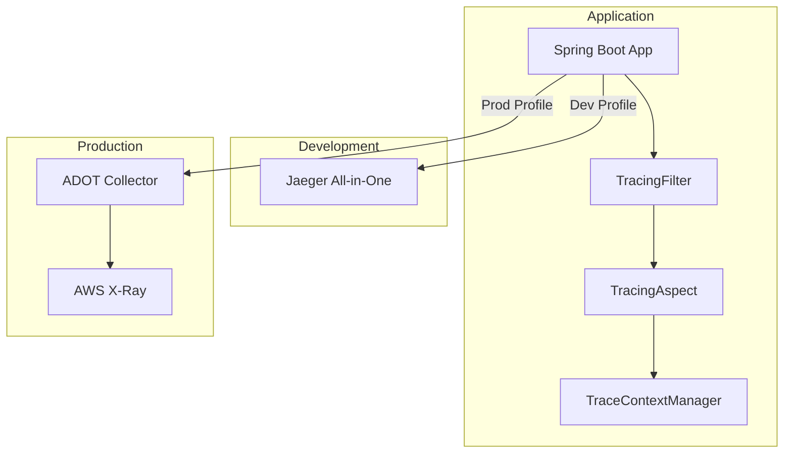

# Distributed Tracing Implementation

This document describes the implementation of distributed tracing in the GenAI Demo application using OpenTelemetry and AWS X-Ray.

## Overview

The distributed tracing system provides end-to-end visibility into request flows across the application, enabling developers to understand performance bottlenecks, debug issues, and monitor system behavior.

## Architecture

### Components

1. **OpenTelemetry SDK**: Core tracing library providing instrumentation APIs
2. **Jaeger**: Development environment tracing backend
3. **AWS X-Ray**: Production environment tracing backend
4. **ADOT Collector**: AWS Distro for OpenTelemetry collector for production
5. **Trace Context Manager**: Custom component for trace correlation

### Flow Diagram



## Implementation Details

### 1. OpenTelemetry Configuration

#### TracingConfiguration.java

- **Development Profile**: Configures Jaeger exporter with 100% sampling
- **Production Profile**: Configures OTLP exporter for AWS X-Ray with 10% sampling
- **Disabled Profile**: Provides no-op OpenTelemetry instance

Key features:

- Environment-specific exporter selection
- Configurable sampling rates
- AWS X-Ray ID generator for production
- W3C and AWS X-Ray propagation support

### 2. Trace Context Management

#### TraceContextManager.java

Manages trace context correlation between OpenTelemetry traces, logs, and metrics:

- **Correlation ID Management**: Links traces with business correlation IDs
- **MDC Integration**: Propagates trace context to logging framework
- **Business Context**: Adds business-specific attributes to spans
- **Error Recording**: Captures error information in spans

### 3. Automatic Instrumentation

#### TracingAspect.java

AOP aspect that automatically instruments:

- **Application Services**: Business logic operations
- **Domain Services**: Domain-specific operations
- **Repository Operations**: Data access operations
- **REST Controllers**: HTTP request handling

Features:

- Automatic span creation with proper naming
- Method parameter capture (excluding sensitive data)
- Error handling and recording
- Business context extraction

### 4. HTTP Request Tracing

#### TracingFilter.java

Servlet filter that handles HTTP-level tracing:

- **Trace Context Extraction**: Extracts trace context from HTTP headers
- **Correlation ID Management**: Generates or extracts correlation IDs
- **Response Headers**: Adds trace information to responses
- **Request Attributes**: Captures HTTP request details

## Configuration

### Application Properties

#### Base Configuration (application.yml)

```yaml
tracing:
  enabled: true
  sampling:
    ratio: 1.0
  jaeger:
    endpoint: http://localhost:14250
  otlp:
    endpoint: http://localhost:4317

otel:
  service:
    name: ${spring.application.name}
    version: ${spring.application.version}
  traces:
    exporter: jaeger
```

#### Development Profile (application-dev.yml)

```yaml
tracing:
  enabled: true
  sampling:
    ratio: 1.0  # Sample all traces in development

otel:
  traces:
    exporter: jaeger
  exporter:
    jaeger:
      endpoint: http://localhost:14250
```

#### Production Profile (application-production.yml)

```yaml
tracing:
  enabled: true
  sampling:
    ratio: 0.1  # Sample 10% of traces in production

otel:
  traces:
    exporter: otlp
  exporter:
    otlp:
      endpoint: http://localhost:4317
      protocol: grpc
```

#### Kubernetes Profile (application-kubernetes.yml)

```yaml
tracing:
  enabled: true
  sampling:
    ratio: ${TRACING_SAMPLING_RATIO:0.1}

otel:
  exporter:
    otlp:
      endpoint: ${OTEL_EXPORTER_OTLP_ENDPOINT:http://adot-collector:4317}
  resource:
    attributes:
      k8s.cluster.name: ${EKS_CLUSTER_NAME}
      k8s.namespace.name: ${KUBERNETES_NAMESPACE:default}
      k8s.pod.name: ${HOSTNAME}
```

### Environment Variables

| Variable | Description | Default |
|----------|-------------|---------|
| `TRACING_ENABLED` | Enable/disable tracing | `true` |
| `TRACING_SAMPLING_RATIO` | Sampling rate (0.0-1.0) | `1.0` (dev), `0.1` (prod) |
| `OTEL_EXPORTER_OTLP_ENDPOINT` | OTLP collector endpoint | `http://localhost:4317` |
| `AWS_XRAY_DAEMON_ADDRESS` | X-Ray daemon address | `localhost:2000` |

## Deployment

### Development Environment

#### Local Jaeger Setup

```bash
# Run Jaeger All-in-One
docker run -d --name jaeger \
  -p 16686:16686 \
  -p 14250:14250 \
  jaegertracing/all-in-one:1.51
```

#### Kubernetes Jaeger Deployment

```bash
kubectl apply -f infrastructure/k8s/observability/jaeger-deployment.yaml
```

Access Jaeger UI: <http://jaeger.kimkao.io>

### Production Environment

#### AWS X-Ray Daemon

```bash
kubectl apply -f infrastructure/k8s/observability/xray-daemon-deployment.yaml
```

#### ADOT Collector

```bash
kubectl apply -f infrastructure/k8s/observability/adot-collector-deployment.yaml
```

## Usage Examples

### Manual Span Creation

```java
@Service
public class OrderService {
    
    private final Tracer tracer;
    
    public void processOrder(Order order) {
        Span span = tracer.spanBuilder("process-order")
            .setAttribute("order.id", order.getId())
            .setAttribute("customer.id", order.getCustomerId())
            .startSpan();
            
        try (Scope scope = span.makeCurrent()) {
            // Business logic here
            span.setAttribute("order.status", "processed");
        } catch (Exception e) {
            span.recordException(e);
            span.setStatus(StatusCode.ERROR, e.getMessage());
            throw e;
        } finally {
            span.end();
        }
    }
}
```

### Trace Context Usage

```java
@RestController
public class OrderController {
    
    private final TraceContextManager traceContextManager;
    
    @PostMapping("/orders")
    public ResponseEntity<Order> createOrder(@RequestBody CreateOrderRequest request) {
        // Set business context
        traceContextManager.setBusinessContext(
            request.getCustomerId(), 
            null // orderId not available yet
        );
        
        // Record business operation
        traceContextManager.recordBusinessOperation(
            "order-creation", 
            "createOrder", 
            request.getCustomerId()
        );
        
        // Business logic...
        
        return ResponseEntity.ok(order);
    }
}
```

### Custom Attributes

```java
@Component
public class PaymentProcessor {
    
    public void processPayment(Payment payment) {
        Span currentSpan = Span.current();
        
        currentSpan.setAttribute("payment.method", payment.getMethod());
        currentSpan.setAttribute("payment.amount", payment.getAmount().toString());
        currentSpan.setAttribute("payment.currency", payment.getCurrency());
        
        // Process payment...
        
        currentSpan.setAttribute("payment.status", "completed");
    }
}
```

## Monitoring and Observability

### Key Metrics

1. **Trace Volume**: Number of traces generated per minute
2. **Sampling Rate**: Percentage of requests being traced
3. **Span Duration**: Time spent in different operations
4. **Error Rate**: Percentage of traces with errors
5. **Service Dependencies**: Inter-service communication patterns

### Dashboards

#### Jaeger (Development)

- Service map showing dependencies
- Trace timeline view
- Error analysis
- Performance bottleneck identification

#### AWS X-Ray (Production)

- Service map with latency and error rates
- Trace analysis with root cause identification
- Performance insights and recommendations
- Integration with CloudWatch metrics

### Alerting

Set up alerts for:

- High error rates in traces
- Unusual latency patterns
- Service dependency failures
- Tracing system health issues

## Best Practices

### 1. Span Naming

- Use descriptive, hierarchical names: `OrderService.createOrder`
- Include operation type: `HTTP GET /api/orders`
- Be consistent across services

### 2. Attribute Management

- Add business-relevant attributes
- Avoid sensitive data (PII, passwords)
- Use semantic conventions when possible
- Limit attribute cardinality

### 3. Error Handling

- Always record exceptions in spans
- Set appropriate error status
- Include error context and details
- Don't let tracing errors break business logic

### 4. Performance Considerations

- Use appropriate sampling rates
- Avoid creating too many spans
- Be mindful of attribute size
- Monitor tracing overhead

### 5. Security

- Mask sensitive data in spans
- Use secure transport (TLS)
- Implement proper access controls
- Audit trace data access

## Troubleshooting

### Common Issues

#### 1. Traces Not Appearing

- Check tracing configuration
- Verify exporter endpoints
- Confirm sampling settings
- Review application logs

#### 2. Missing Span Context

- Ensure proper context propagation
- Check async operation handling
- Verify thread-local context management

#### 3. Performance Impact

- Adjust sampling rates
- Optimize span creation
- Review attribute usage
- Monitor resource consumption

#### 4. Configuration Issues

- Validate environment variables
- Check profile-specific settings
- Verify network connectivity
- Review security permissions

### Debug Commands

```bash
# Check tracing configuration
kubectl get configmap adot-collector-config -o yaml

# View X-Ray daemon logs
kubectl logs -l app=xray-daemon -n observability

# Check ADOT collector status
kubectl get pods -l app=adot-collector -n observability

# View application tracing logs
kubectl logs -l app=genai-demo | grep -i trace
```

## Testing

### Unit Tests

- `TracingConfigurationTest`: Verifies OpenTelemetry configuration
- `TraceContextManagerTest`: Tests trace context management
- `TracingAspectTest`: Validates automatic instrumentation

### Integration Tests

- `TracingIntegrationTest`: End-to-end tracing verification
- HTTP request tracing validation
- Trace context propagation testing

### BDD Tests

- `distributed-tracing.feature`: Business-focused tracing scenarios
- Requirements validation through behavior testing
- Cross-environment tracing verification

## Future Enhancements

1. **Custom Samplers**: Implement business-logic-based sampling
2. **Trace Analytics**: Advanced trace analysis and insights
3. **Multi-Region Tracing**: Cross-region trace correlation
4. **Custom Exporters**: Additional tracing backend support
5. **Performance Optimization**: Further reduce tracing overhead

## References

- [OpenTelemetry Documentation](https://opentelemetry.io/docs/)
- [AWS X-Ray Developer Guide](https://docs.aws.amazon.com/xray/)
- [Jaeger Documentation](https://www.jaegertracing.io/docs/)
- [ADOT Documentation](https://aws-otel.github.io/docs/)
- [Spring Boot Observability](https://docs.spring.io/spring-boot/docs/current/reference/html/actuator.html#actuator.observability)
