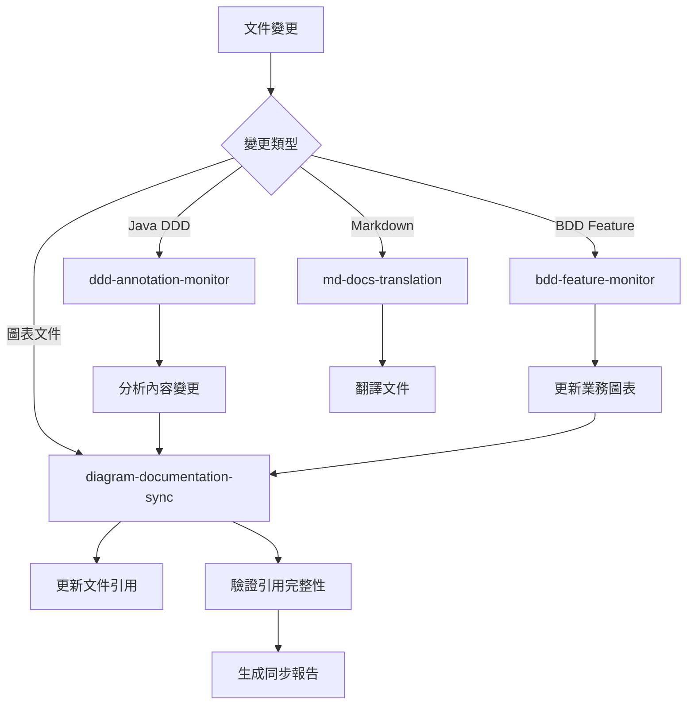

# Kiro Hooks Configuration

## Overview

本目錄包含了 Kiro IDE 的自動化 hooks 配置，用於Monitoring文件變更並觸發相應的自動化任務。

## 當前 Hooks 狀態

### 🟢 啟用的 Hooks

1. **diagram-documentation-sync.kiro.hook** (v1.0) - **新增**
   - **功能**: 圖表與文件雙向同步
   - **Monitoring**: 圖表文件 (*.puml, *.mmd, *.excalidraw) 和文件 (viewpoints/*.md, perspectives/*.md)
   - **作用**: 當圖表變更時自動更新文件引用，當文件變更時檢查圖表需求

2. **md-docs-translation.kiro.hook** (v4.0)
   - **功能**: 中英文文件自動翻譯
   - **Monitoring**: 中文 markdown 文件
   - **作用**: 自動翻譯到 docs/en/ 目錄

3. **ddd-annotation-monitor.kiro.hook** (v1.0) - **已簡化**
   - **功能**: DDD 註解Monitoring和結構分析
   - **Monitoring**: Java Domain Layer文件 (@AggregateRoot, Domain Events, Services)
   - **作用**: 觸發 DDD 結構分析和圖表更新
   - **協調**: 與 diagram-documentation-sync 協調工作

4. **bdd-feature-monitor.kiro.hook** (v1.0) - **已簡化**
   - **功能**: BDD 特性文件Monitoring和業務分析
   - **Monitoring**: .feature 文件 (Scenarios, Actors, Business Events)
   - **作用**: 觸發業務流程分析和 Event Storming 更新
   - **協調**: 與 diagram-documentation-sync 協調工作

### 🗑️ 已移除的 Hooks

1. **diagram-auto-generation.kiro.hook** - **已刪除**
   - **原因**: 功能完全被 diagram-documentation-sync.kiro.hook 取代
   - **狀態**: 已從系統中移除

## Hook 協調機制

### 主要同步流程



### Design

1. **職責分離**:
   - `diagram-documentation-sync`: 負責引用同步
   - `ddd-annotation-monitor`: 負責內容分析
   - `bdd-feature-monitor`: 負責業務流程分析

2. **執行順序**:
   - 內容分析 hooks 先執行
   - 同步 hook 後執行，處理引用更新

3. **狀態管理**:
   - 每個 hook 都有明確的輸入輸出
   - 避免同時修改同一文件

## 配置文件

### 同步規則配置
- **位置**: `.kiro/settings/diagram-sync-rules.json`
- **內容**: 定義圖表與文件的對應關係
- **用途**: 指導自動同步行為

### 支援腳本
- **位置**: `scripts/sync-diagram-references.py`
- **功能**: 執行實際的同步邏輯
- **用法**: `python3 scripts/sync-diagram-references.py --comprehensive --validate --report`

## Guidelines

### 手動觸發同步

```bash
# 完整同步並生成報告
python3 scripts/sync-diagram-references.py --comprehensive --validate --report

# 只檢查圖表到文件的同步
python3 scripts/sync-diagram-references.py --mode=diagram-to-docs

# 只檢查文件到圖表的同步
python3 scripts/sync-diagram-references.py --mode=docs-to-diagram
```

### 檢查 Hook 狀態

```bash
# 查看所有 hooks
ls -la .kiro/hooks/

# 檢查特定 hook 配置
cat .kiro/hooks/diagram-documentation-sync.kiro.hook
```

## Best Practices

### 圖表命名規範

1. **Aggregate Root詳細圖**: `{aggregate-name}-aggregate-details.puml`
2. **概覽圖**: `{concept}-overview.puml`
3. **流程圖**: `{process-name}-flow.puml`
4. **Event Storming**: `event-storming-{level}.puml`

### 文件引用規範

1. **相對路徑**: 使用 `../../diagrams/...` 格式
2. **分組**: 在「相關圖表」或「Related Diagrams」章節
3. **描述**: 提供有意義的圖表描述
4. **順序**: 按邏輯順序排列引用

### 衝突解決

1. **時間戳優先**: 較新的變更優先
2. **內容分析**: 分析變更意圖
3. **手動確認**: 複雜衝突需要人工介入

## Troubleshooting

### 常見問題

1. **引用路徑錯誤**:
   - 檢查相對路徑是否正確
   - 確認圖表文件存在

2. **Hook 未觸發**:
   - 檢查 hook 是否啟用
   - 確認文件模式匹配

3. **同步衝突**:
   - 查看同步報告
   - 手動解決衝突

### 調試Command

```bash
# 檢查圖表文件
find docs/diagrams -name "*.puml" -o -name "*.mmd" -o -name "*.excalidraw"

# 檢查文件引用
grep -r "diagrams.*\.puml\|diagrams.*\.mmd" ../viewpoints/ docs/perspectives/

# 驗證引用完整性
python3 scripts/sync-diagram-references.py --validate --report
```

## 版本歷史

- **v1.0** (2024-12-19): 初始實現圖表文件同步系統
- **v1.1** (計劃): 增加 Excalidraw 支援
- **v1.2** (計劃): 增加自動圖表生成功能

## 相關文件

- [同步規則配置](.kiro/settings/diagram-sync-rules.json)
- [同步腳本](../scripts/sync-diagram-references.py)
- [Kiro 設定](../settings/)