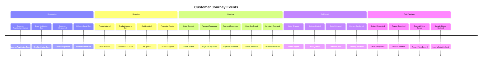
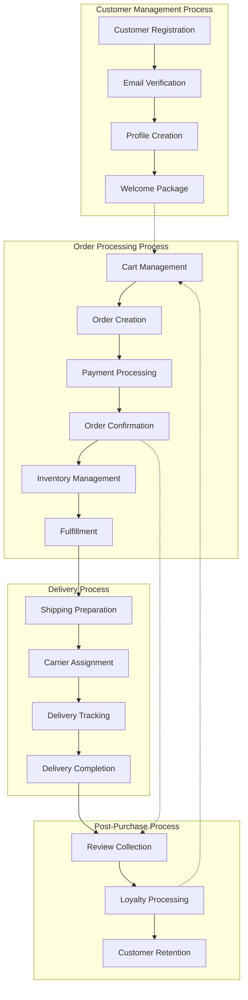
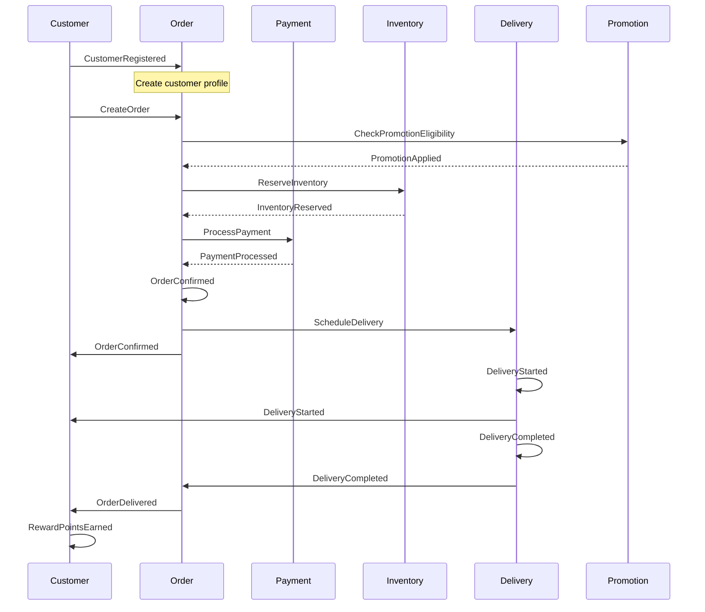
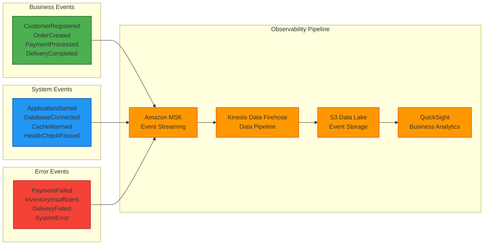

# Event Storming - Big Picture

## Phase 1: Domain Events Discovery

```mermaid
timeline
    title Customer Journey Events
    
    section Registration
        Customer Registration Started : CustomerRegistrationStarted
        Email Verification Sent : EmailVerificationSent
        Customer Registered : CustomerRegistered
        Welcome Email Sent : WelcomeEmailSent
    
    section Shopping
        Product Viewed : ProductViewed
        Product Added to Cart : ProductAddedToCart
        Cart Updated : CartUpdated
        Promotion Applied : PromotionApplied
    
    section Ordering
        Order Created : OrderCreated
        Payment Requested : PaymentRequested
        Payment Processed : PaymentProcessed
        Order Confirmed : OrderConfirmed
        Inventory Reserved : InventoryReserved
    
    section Fulfillment
        Order Shipped : OrderShipped
        Delivery Started : DeliveryStarted
        Order Delivered : OrderDelivered
        Delivery Confirmed : DeliveryConfirmed
    
    section Post-Purchase
        Review Requested : ReviewRequested
        Review Submitted : ReviewSubmitted
        Reward Points Earned : RewardPointsEarned
        Loyalty Status Updated : LoyaltyStatusUpdated
```

## Phase 2: Process Modeling

```mermaid
graph TD
    subgraph "Customer Management Process"
        A[Customer Registration] --> B[Email Verification]
        B --> C[Profile Creation]
        C --> D[Welcome Package]
    end
    
    subgraph "Order Processing Process"
        E[Cart Management] --> F[Order Creation]
        F --> G[Payment Processing]
        G --> H[Order Confirmation]
        H --> I[Inventory Management]
        I --> J[Fulfillment]
    end
    
    subgraph "Delivery Process"
        J --> K[Shipping Preparation]
        K --> L[Carrier Assignment]
        L --> M[Delivery Tracking]
        M --> N[Delivery Completion]
    end
    
    subgraph "Post-Purchase Process"
        N --> O[Review Collection]
        O --> P[Loyalty Processing]
        P --> Q[Customer Retention]
    end
    
    %% Cross-process interactions
    D -.-> E
    H -.-> O
    P -.-> E
```

## Phase 3: Bounded Context Design

```mermaid
graph TB
    subgraph "Customer Context"
        direction TB
        C_AGG[Customer Aggregate]
        C_EVENTS[CustomerRegistered<br/>CustomerProfileUpdated<br/>CustomerSpendingUpdated]
        C_COMMANDS[RegisterCustomer<br/>UpdateProfile<br/>UpdateSpending]
        C_POLICIES[CustomerLoyaltyPolicy<br/>CustomerSegmentationPolicy]
    end
    
    subgraph "Order Context"
        direction TB
        O_AGG[Order Aggregate]
        O_EVENTS[OrderCreated<br/>OrderConfirmed<br/>OrderCancelled]
        O_COMMANDS[CreateOrder<br/>ConfirmOrder<br/>CancelOrder]
        O_POLICIES[OrderDiscountPolicy<br/>OrderValidationPolicy]
    end
    
    subgraph "Payment Context"
        direction TB
        P_AGG[Payment Aggregate]
        P_EVENTS[PaymentRequested<br/>PaymentProcessed<br/>PaymentFailed]
        P_COMMANDS[ProcessPayment<br/>RefundPayment]
        P_POLICIES[PaymentSecurityPolicy<br/>FraudDetectionPolicy]
    end
    
    subgraph "Inventory Context"
        direction TB
        I_AGG[Inventory Aggregate]
        I_EVENTS[InventoryReserved<br/>InventoryUpdated<br/>StockLevelChanged]
        I_COMMANDS[ReserveInventory<br/>UpdateStock<br/>ReleaseReservation]
        I_POLICIES[StockReplenishmentPolicy<br/>AllocationPolicy]
    end
    
    subgraph "Delivery Context"
        direction TB
        D_AGG[Delivery Aggregate]
        D_EVENTS[DeliveryScheduled<br/>DeliveryStarted<br/>DeliveryCompleted]
        D_COMMANDS[ScheduleDelivery<br/>StartDelivery<br/>CompleteDelivery]
        D_POLICIES[DeliveryRoutingPolicy<br/>DeliveryTimePolicy]
    end
    
    subgraph "Promotion Context"
        direction TB
        PR_AGG[Promotion Aggregate]
        PR_EVENTS[PromotionCreated<br/>PromotionApplied<br/>PromotionExpired]
        PR_COMMANDS[CreatePromotion<br/>ApplyPromotion<br/>ExpirePromotion]
        PR_POLICIES[PromotionEligibilityPolicy<br/>PromotionStackingPolicy]
    end
    
    %% Context Relationships
    C_AGG -.->|Customer ID| O_AGG
    O_AGG -.->|Order ID| P_AGG
    O_AGG -.->|Product IDs| I_AGG
    O_AGG -.->|Delivery Request| D_AGG
    O_AGG -.->|Promotion Code| PR_AGG
    
    %% Event Flow
    C_EVENTS -.->|Customer Events| O_EVENTS
    O_EVENTS -.->|Order Events| P_EVENTS
    O_EVENTS -.->|Order Events| I_EVENTS
    O_EVENTS -.->|Order Events| D_EVENTS
    
    classDef aggregate fill:#ffeb3b,stroke:#f57f17,stroke-width:2px
    classDef events fill:#4caf50,stroke:#2e7d32,stroke-width:2px
    classDef commands fill:#2196f3,stroke:#1565c0,stroke-width:2px
    classDef policies fill:#ff9800,stroke:#ef6c00,stroke-width:2px
    
    class C_AGG,O_AGG,P_AGG,I_AGG,D_AGG,PR_AGG aggregate
    class C_EVENTS,O_EVENTS,P_EVENTS,I_EVENTS,D_EVENTS,PR_EVENTS events
    class C_COMMANDS,O_COMMANDS,P_COMMANDS,I_COMMANDS,D_COMMANDS,PR_COMMANDS commands
    class C_POLICIES,O_POLICIES,P_POLICIES,I_POLICIES,D_POLICIES,PR_POLICIES policies
```

## Event Flow Across Contexts

```mermaid
sequenceDiagram
    participant Customer
    participant Order
    participant Payment
    participant Inventory
    participant Delivery
    participant Promotion
    
    Customer->>Order: CustomerRegistered
    Note over Order: Create customer profile
    
    Customer->>Order: CreateOrder
    Order->>Promotion: CheckPromotionEligibility
    Promotion-->>Order: PromotionApplied
    
    Order->>Inventory: ReserveInventory
    Inventory-->>Order: InventoryReserved
    
    Order->>Payment: ProcessPayment
    Payment-->>Order: PaymentProcessed
    
    Order->>Order: OrderConfirmed
    Order->>Delivery: ScheduleDelivery
    Order->>Customer: OrderConfirmed
    
    Delivery->>Delivery: DeliveryStarted
    Delivery->>Customer: DeliveryStarted
    
    Delivery->>Delivery: DeliveryCompleted
    Delivery->>Order: DeliveryCompleted
    Order->>Customer: OrderDelivered
    
    Customer->>Customer: RewardPointsEarned
```

## Observability Events

```mermaid
graph LR
    subgraph "Business Events"
        BE[CustomerRegistered<br/>OrderCreated<br/>PaymentProcessed<br/>DeliveryCompleted]
    end
    
    subgraph "System Events"
        SE[ApplicationStarted<br/>DatabaseConnected<br/>CacheWarmed<br/>HealthCheckPassed]
    end
    
    subgraph "Error Events"
        EE[PaymentFailed<br/>InventoryInsufficient<br/>DeliveryFailed<br/>SystemError]
    end
    
    subgraph "Observability Pipeline"
        MSK[Amazon MSK<br/>Event Streaming]
        FIREHOSE[Kinesis Data Firehose<br/>Data Pipeline]
        S3[S3 Data Lake<br/>Event Storage]
        QUICKSIGHT[QuickSight<br/>Business Analytics]
    end
    
    BE --> MSK
    SE --> MSK
    EE --> MSK
    
    MSK --> FIREHOSE
    FIREHOSE --> S3
    S3 --> QUICKSIGHT
    
    classDef business fill:#4caf50,stroke:#2e7d32,stroke-width:2px
    classDef system fill:#2196f3,stroke:#1565c0,stroke-width:2px
    classDef error fill:#f44336,stroke:#c62828,stroke-width:2px
    classDef pipeline fill:#ff9800,stroke:#ef6c00,stroke-width:2px
    
    class BE business
    class SE system
    class EE error
    class MSK,FIREHOSE,S3,QUICKSIGHT pipeline
```
