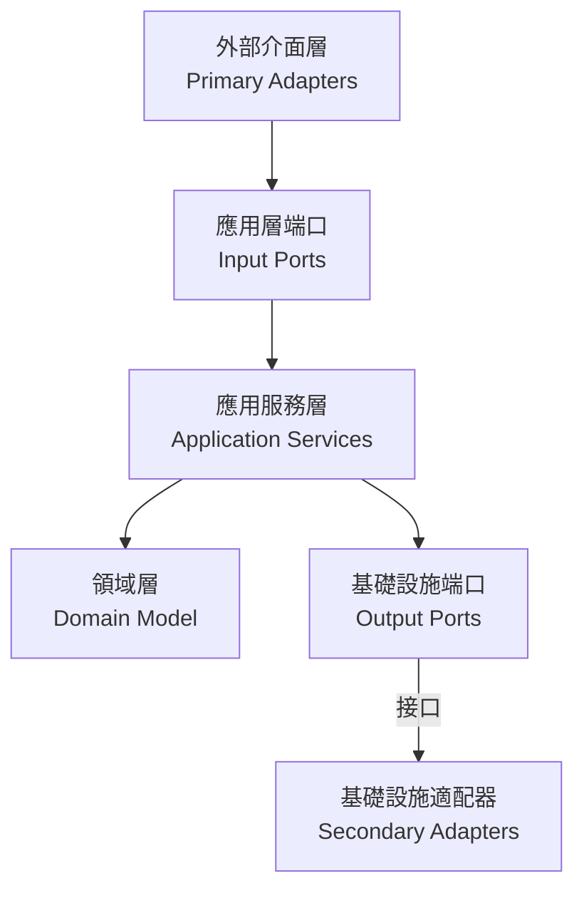

# 六角架構實現總結

本文檔總結了基於六角架構（Hexagonal Architecture）的訂單系統實現。

## 架構概述

六角架構（又稱端口與適配器架構）將應用程序分為三個主要部分：

1. **核心域（內部）**：包含業務邏輯和領域模型
2. **端口（中間層）**：定義與外部世界交互的接口
3. **適配器（外部）**：連接外部世界與應用程序核心

## 實現細節

### 領域層（Domain Layer）

領域模型實現了核心業務邏輯，完全獨立於外部依賴：

- **聚合根**：
  - `Order`：訂單聚合根，包含訂單狀態控制和業務規則

- **值對象**：
  - `OrderId`：訂單唯一標識
  - `Money`：金額值對象
  - `OrderItem`：訂單項值對象

- **枚舉**：
  - `OrderStatus`：訂單狀態及其轉換規則

- **工廠**：
  - `OrderFactory`：負責訂單的創建和重建

### 端口層（Ports Layer）

定義了應用程序與外部世界交互的接口：

- **輸入端口（Primary Ports）**：
  - `OrderManagementUseCase`：定義系統對外提供的所有訂單管理功能

- **輸出端口（Secondary Ports）**：
  - `OrderPersistencePort`：定義訂單持久化操作的接口
  - `PaymentServicePort`：定義支付服務的接口
  - `LogisticsServicePort`：定義物流服務的接口

### 應用服務層（Application Layer）

協調領域對象和外部資源的交互：

- **應用服務**：
  - `OrderApplicationService`：實現訂單管理用例，協調各個端口之間的交互

- **DTO**：
  - `CreateOrderRequest`：創建訂單的請求數據
  - `AddOrderItemRequest`：添加訂單項的請求數據
  - `OrderResponse`：訂單操作的響應數據

### 適配器層（Adapters Layer）

連接外部世界與應用核心：

- **主級適配器（Primary/Driving Adapters）**：
  - `OrderController`：處理HTTP請求，並轉發給應用服務

- **次級適配器（Secondary/Driven Adapters）**：
  - `JpaOrderRepository`：實現訂單持久化操作
  - `ExternalPaymentAdapter`：實現支付服務整合
  - `ExternalLogisticsAdapter`：實現物流服務整合

## 依賴方向

六角架構中的一個核心原則是依賴方向始終指向內部：

## 實現優勢

1. **業務邏輯獨立性**：
   - 領域模型不依賴任何外部技術或框架
   - 可以獨立測試核心業務邏輯

2. **可測試性**：
   - 通過依賴倒置原則，可以輕鬆地模擬外部依賴
   - 可以為每個組件編寫單元測試

3. **靈活的技術選擇**：
   - 可以替換任何外部依賴而不影響核心業務邏輯
   - 例如，可以從JPA切換到MongoDB，只需實現新的適配器

4. **明確的責任邊界**：
   - 每個組件都有明確定義的職責
   - 簡化系統的理解和維護

## 進一步改進

以下是可能的後續改進方向：

1. **實現事件驅動架構**：
   - 完善領域事件的發布和訂閱機制
   - 實現基於事件的跨界上下文通信

2. **微服務拆分**：
   - 考慮將訂單、支付、物流等領域拆分為獨立微服務
   - 定義服務間的契約和通信模式

3. **CQRS模式引入**：
   - 分離命令和查詢職責
   - 優化讀寫性能

4. **添加跨切面關注點**：
   - 實現日誌記錄、性能監控、安全控制等
   - 確保這些關注點不會入侵核心邏輯
