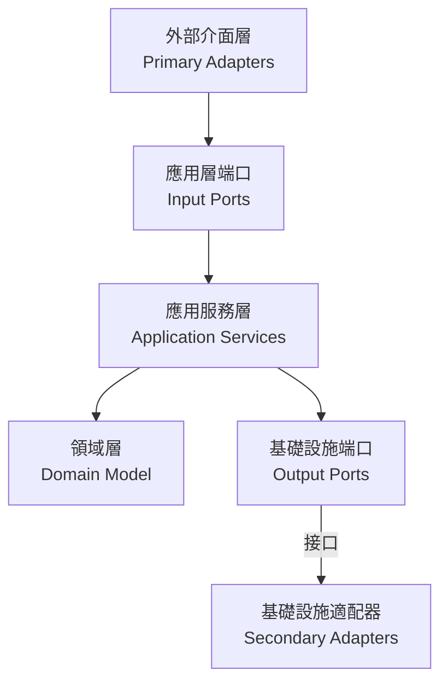

# 六角架構與 Event Storming 整合重構指南

## 架構概述

六角架構（Hexagonal Architecture）將應用程序分為三個主要部分：核心域、端口和適配器。結合 Event Storming 的設計元素，我們可以更有效地組織和實現業務流程。



## Event Storming 設計元素與六角架構的映射

### 1. 命令 (Commands)

在 Event Storming 中，命令代表用戶意圖，在六角架構中映射為：

- **位置**：從主要適配器傳遞到應用服務
- **實現**：作為輸入端口的參數
- **示例**：`CreateOrderCommand`, `AddOrderItemCommand`, `ProcessPaymentCommand`

```java
// 命令對象示例
public class CreateOrderCommand {
    private final String customerId;
    private final String shippingAddress;
    
    // 靜態工廠方法，便於創建
    public static CreateOrderCommand of(String customerId, String shippingAddress) {
        return new CreateOrderCommand(customerId, shippingAddress);
    }
}
```

### 2. 事件 (Events)

領域事件代表系統中發生的重要變化：

- **位置**：由領域模型發布，通過事件總線傳播
- **實現**：領域事件類，包含事件相關數據
- **示例**：`OrderCreatedEvent`, `PaymentCompletedEvent`

```java
// 領域事件示例
public class PaymentCompletedEvent implements DomainEvent {
    private final PaymentId paymentId;
    private final OrderId orderId;
    private final Money amount;
    private final String transactionId;
}
```

### 3. 聚合根 (Aggregates)

聚合根是業務實體的邊界：

- **位置**：位於領域層的核心
- **實現**：帶有 `@AggregateRoot` 註解的類
- **示例**：`Order`, `Payment`, `Inventory`, `Delivery`

```java
// 聚合根示例
@AggregateRoot
public class Order {
    private final OrderId id;
    private final CustomerId customerId;
    private OrderStatus status;
    
    public void submit() {
        // 業務邏輯和狀態轉換
        if (status != OrderStatus.CREATED) {
            throw new IllegalStateException("Cannot submit an order that is not in CREATED state");
        }
        status = OrderStatus.PENDING;
        // 可能發布領域事件
    }
}
```

### 4. 策略 (Policies)

策略是對事件的反應：

- **位置**：通常在應用服務層或專門的策略處理器中
- **實現**：事件監聽器或訂閱者
- **示例**：訂單確認後自動處理支付

```java
// 策略示例（事件監聽器）
@Component
public class OrderPaymentPolicy {
    @EventListener
    public void handleOrderConfirmed(OrderConfirmedEvent event) {
        // 觸發支付處理
    }
}
```

### 5. 讀模型 (Read Models)

讀模型優化查詢操作：

- **位置**：通常在應用服務層或專門的查詢服務中
- **實現**：DTO 類和查詢服務
- **示例**：`OrderSummaryDto`, `OrderDetailsDto`

```java
// 讀模型示例
public class OrderSummaryDto {
    private final String orderId;
    private final String customerName;
    private final BigDecimal totalAmount;
    private final String status;
}
```

## 當前專案架構分析

我們的專案已經實現了六角架構的基本結構，包含以下界限上下文：

1. **訂單上下文 (Order Context)**
2. **支付上下文 (Payment Context)**
3. **庫存上下文 (Inventory Context)**
4. **配送上下文 (Delivery Context)**
5. **通知上下文 (Notification Context)**
6. **工作流上下文 (Workflow Context)**

### 現有架構優勢

1. **清晰的分層**：領域層、應用層、基礎設施層和介面層分離
2. **端口與適配器**：已定義輸入端口（如 `OrderManagementUseCase`）和輸出端口（如 `OrderPersistencePort`）
3. **領域模型獨立**：領域模型不依賴外部技術

### 需要改進的地方

1. **命令模式不一致**：部分功能使用命令對象，部分使用 DTO
2. **事件驅動不完整**：領域事件的使用可以更加系統化
3. **CQRS 模式缺失**：查詢和命令責任未明確分離

## 重構計劃

### 1. 統一命令模式

將所有用戶意圖統一表示為命令對象：

```java
// 控制器中使用命令
@PostMapping
public ResponseEntity<OrderResponse> createOrder(@RequestBody CreateOrderRequest request) {
    // 創建命令對象
    CreateOrderCommand command = CreateOrderCommand.of(
        request.getCustomerId(),
        request.getShippingAddress()
    );
    
    // 執行命令
    OrderResponse response = orderService.createOrder(command);
    return new ResponseEntity<>(response, HttpStatus.CREATED);
}
```

### 2. 增強事件驅動設計

完善領域事件的發布和處理：

```java
// 領域模型中發布事件
public class Order {
    public void confirm() {
        // 業務邏輯
        this.status = OrderStatus.CONFIRMED;
        
        // 發布領域事件
        DomainEventPublisher.publish(new OrderConfirmedEvent(
            this.id,
            this.customerId,
            this.totalAmount
        ));
    }
}

// 應用服務中處理事件
@EventListener
public void handleOrderConfirmed(OrderConfirmedEvent event) {
    // 處理訂單確認後的業務邏輯
    processPayment(event.getOrderId(), event.getAmount());
}
```

### 3. 實現 CQRS 模式

分離查詢和命令責任：

```java
// 命令接口
public interface OrderCommandUseCase {
    void createOrder(CreateOrderCommand command);
    void addOrderItem(AddOrderItemCommand command);
    void submitOrder(SubmitOrderCommand command);
}

// 查詢接口
public interface OrderQueryUseCase {
    OrderDetailsDto getOrderDetails(String orderId);
    List<OrderSummaryDto> getCustomerOrders(String customerId);
}
```

### 4. 完善 Saga 模式

使用 Saga 協調跨聚合根的業務流程：

```java
public class OrderProcessingSaga implements SagaDefinition<OrderSagaContext> {
    @Override
    public void execute(OrderSagaContext context) {
        // 處理支付
        processPayment(context);
        
        // 處理庫存
        processInventory(context);
        
        // 處理物流
        processLogistics(context);
    }
    
    @Override
    public void compensate(OrderSagaContext context, Exception exception) {
        // 補償邏輯
        if (context.isPaymentProcessed()) {
            refundPayment(context);
        }
        // 其他補償步驟...
    }
}
```

## 重構步驟

### 1. 命令模式統一

- 為所有用戶意圖創建命令類
- 更新控制器以使用命令對象
- 修改應用服務以接受命令參數

### 2. 事件驅動增強

- 完善領域事件類型
- 實現可靠的事件發布機制
- 添加事件處理器和策略

### 3. CQRS 實現

- 分離命令和查詢接口
- 創建專用的查詢模型
- 優化查詢性能

### 4. Saga 模式完善

- 實現 Saga 協調器
- 定義補償邏輯
- 處理分佈式事務

## 重構優先級

1. **高優先級**
   - 統一命令模式
   - 完善領域事件

2. **中優先級**
   - 實現 CQRS 分離
   - 增強 Saga 協調器

3. **低優先級**
   - 優化查詢性能
   - 增強監控和可觀測性

## 重構效益

1. **業務意圖明確**
   - 命令對象清晰表達用戶意圖
   - 事件記錄系統狀態變化

2. **系統彈性增強**
   - 組件間鬆耦合
   - 技術實現可替換

3. **可擴展性提高**
   - 新功能易於添加
   - 跨界上下文協作更流暢

4. **可維護性改善**
   - 責任邊界清晰
   - 業務邏輯集中管理

## 結論

結合六角架構和 Event Storming 的設計元素，我們可以創建一個更加靈活、可維護且符合業務需求的系統。通過統一命令模式、增強事件驅動設計、實現 CQRS 模式和完善 Saga 協調器，我們可以更好地表達和實現複雜的業務流程。

這種設計不僅提高了代碼的可讀性和可維護性，還使系統更容易適應業務變化和技術演進。最重要的是，它使技術實現與業務概念保持一致，讓開發團隊和業務團隊能夠使用共同的語言進行溝通。