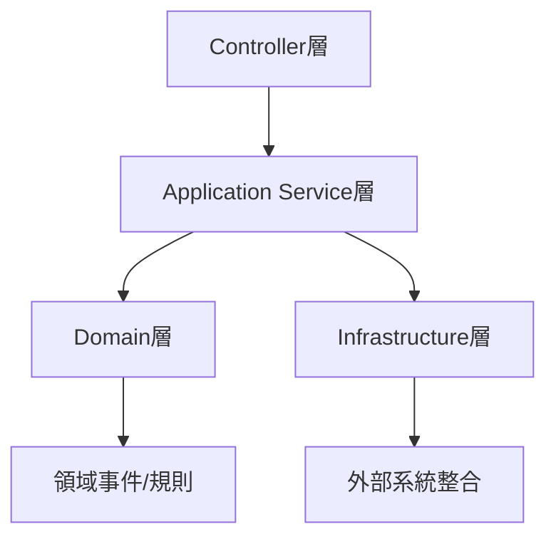

# 六角架構重構指南

## 當前架構分析

目前的專案結構已經具備了DDD的基礎元素，但需要重組以符合六角架構的設計原則。

### 現有元素分析



## 重構計劃

### 1. 包結構重組

```
solid.humank.genaidemo.examples.order/
├── domain/                 # 領域層（核心）
│   ├── model/             # 領域模型
│   ├── service/           # 領域服務
│   └── policy/            # 領域策略
├── application/           # 應用層
│   ├── port/             # 端口定義
│   │   ├── incoming/     # 輸入端口
│   │   └── outgoing/     # 輸出端口
│   └── service/          # 應用服務
└── infrastructure/        # 基礎設施層
    ├── persistence/      # 持久化適配器
    ├── messaging/        # 消息適配器
    └── external/         # 外部系統適配器
```

### 2. 端口定義

#### 輸入端口（Primary Ports）
```java
package solid.humank.genaidemo.examples.order.application.port.incoming;

public interface OrderManagementUseCase {
    OrderResponse createOrder(CreateOrderCommand command);
    OrderResponse addOrderItem(AddOrderItemCommand command);
    // ...其他用例方法
}
```

#### 輸出端口（Secondary Ports）
```java
package solid.humank.genaidemo.examples.order.application.port.outgoing;

public interface OrderRepository {
    void save(Order order);
    Optional<Order> findById(OrderId orderId);
    // ...其他持久化方法
}
```

### 3. 適配器實現

#### Primary Adapters（驅動適配器）
```java
@RestController
@RequestMapping("/api/orders")
public class OrderController implements OrderManagementUseCase {
    private final OrderApplicationService applicationService;
    
    @Override
    public OrderResponse createOrder(CreateOrderCommand command) {
        return applicationService.createOrder(command);
    }
    // ...其他端點實現
}
```

#### Secondary Adapters（被驅動適配器）
```java
@Repository
public class JpaOrderRepository implements OrderRepository {
    private final JpaOrderEntityRepository jpaRepository;
    
    @Override
    public void save(Order order) {
        // 實現持久化邏輯
    }
    // ...其他方法實現
}
```

## 重構步驟

1. **準備工作**
   - 創建新的包結構
   - 定義核心端口接口

2. **領域層重構**
   - 將領域模型移至 `domain/model` 包
   - 確保領域模型不依賴外部組件
   - 重組領域服務和策略

3. **端口層實現**
   - 定義所有輸入端口（用例接口）
   - 定義所有輸出端口（基礎設施接口）
   - 確保端口接口足夠抽象和穩定

4. **適配器層調整**
   - 實現 Primary Adapters（Controller等）
   - 實現 Secondary Adapters（Repository等）
   - 整合外部系統適配器

5. **應用層重組**
   - 調整應用服務以使用端口接口
   - 實現用例協調邏輯
   - 處理跨切面關注點

## 重構優先級

1. **高優先級**
   - 定義核心端口接口
   - 隔離領域模型
   - 實現基本適配器

2. **中優先級**
   - 重組應用服務
   - 完善外部系統整合
   - 補充次要端口實現

3. **低優先級**
   - 優化包結構
   - 重構測試案例
   - 完善文檔

## 重構效益

1. **架構清晰度**
   - 明確的依賴方向
   - 清晰的職責邊界
   - 容易理解的組件關係

2. **可維護性**
   - 領域邏輯集中管理
   - 技術實現易於替換
   - 測試更加容易

3. **擴展性**
   - 新功能容易添加
   - 外部整合更靈活
   - 更好的並行開發支持

## 注意事項

1. **保持向後兼容**
   - 逐步進行重構
   - 確保已有功能正常運行
   - 持續運行測試確保穩定性

2. **領域邏輯保護**
   - 確保領域模型的純粹性
   - 避免技術細節滲透
   - 維護業務規則的完整性

3. **接口設計**
   - 保持端口接口的穩定性
   - 設計合適的抽象級別
   - 考慮未來擴展需求
