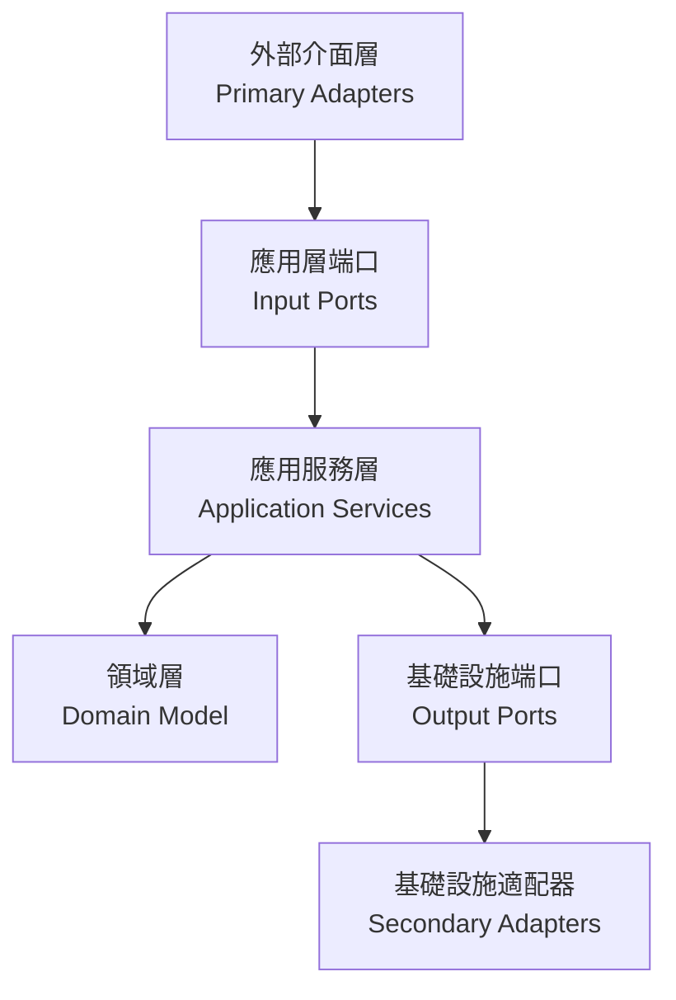

# 分層架構設計分析與建議

## 常見分層架構介紹

### 1. 傳統分層架構 (Traditional Layered Architecture)
- **特點**：
  - 最基本的分層方式：表現層 -> 業務層 -> 持久層
  - 每層只依賴其下層
  - 易於理解和實現
- **缺點**：
  - 層與層之間耦合度高
  - 難以實現業務邏輯的獨立性
  - 測試較為困難

### 2. 洋蔥架構 (Onion Architecture)
- **特點**：
  - 核心是領域模型（Domain Model）
  - 外層依賴內層，內層不知道外層的存在
  - 所有依賴都指向中心
- **優點**：
  - 業務邏輯高度內聚
  - 外部依賴（如資料庫）容易替換
  - 良好的可測試性
- **缺點**：
  - 學習曲線較陡
  - 可能過度抽象化

### 3. 六角架構 (Hexagonal Architecture / Ports and Adapters)
- **特點**：
  - 核心邏輯位於中心
  - 通過端口（Ports）定義接口
  - 使用適配器（Adapters）實現外部整合
- **優點**：
  - 業務邏輯完全獨立
  - 外部依賴可以輕易替換
  - 非常適合微服務架構
- **缺點**：
  - 初期開發成本較高
  - 小型項目可能過度設計

### 4. 簡潔架構 (Clean Architecture)
- **特點**：
  - 結合了洋蔥架構和六角架構的優點
  - 強調依賴規則：依賴只能指向內層
  - 使用接口來解耦
- **優點**：
  - 高度模組化
  - 極佳的可測試性
  - 適應性強
- **缺點**：
  - 架構較為複雜
  - 需要寫更多的接口和轉換代碼

## 推薦架構選擇

基於當前專案的特點，我推薦採用 **六角架構（Hexagonal Architecture）** 作為主要的分層架構設計模式。

### 選擇理由：

1. **完美配合DDD**
   - 目前專案已經在使用DDD的戰術設計元素
   - 六角架構的端口和適配器模式非常適合實現限界上下文（Bounded Context）
   - 便於實現領域事件的發布和訂閱

2. **現有代碼結構易於遷移**
   - 觀察到專案中已有的ACL（防腐層）實現，與六角架構的適配器概念完全吻合
   - 當前的事件驅動設計可以很好地融入端口和適配器模式

3. **技術架構彈性**
   - 支持異步操作和事件驅動（已見於OrderProcessingSaga）
   - 便於整合外部系統（如支付服務）
   - 適合未來的微服務拆分

4. **清晰的責任邊界**
   - 端口定義明確的輸入/輸出邊界
   - 適配器處理所有外部整合
   - 領域邏輯保持純粹性

### 建議的分層結構：

### 實施建議：

1. **領域層（Domain Layer）**：
   - 保持當前的領域模型設計
   - 包含所有業務規則和領域邏輯
   - 不依賴任何外部資源

2. **應用層（Application Layer）**：
   - 定義輸入端口（Input Ports）作為用例
   - 協調領域對象和外部資源
   - 處理事務和領域事件

3. **適配器層（Adapters Layer）**：
   - Primary Adapters：REST控制器、消息監聽器等
   - Secondary Adapters：資料庫訪問、外部服務調用等

4. **端口層（Ports Layer）**：
   - 輸入端口：定義系統功能
   - 輸出端口：定義外部依賴

這種架構將幫助專案：
- 保持領域邏輯的純粹性
- 提升系統的可測試性
- 簡化外部系統整合
- 支持未來的演化和擴展
