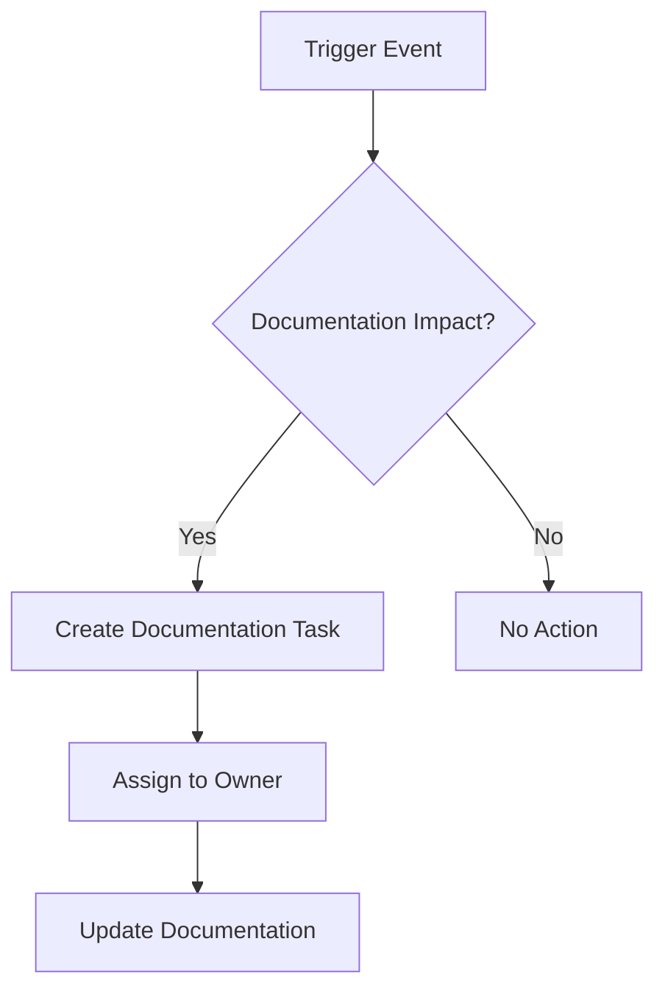

# Documentation Maintenance Guide

> **Last Updated**: 2024-11-09  
> **Owner**: Documentation Team  
> **Status**: Active

## Overview

This guide defines the processes, responsibilities, and workflows for maintaining the Enterprise E-Commerce Platform documentation. Regular maintenance ensures documentation remains accurate, relevant, and valuable to all stakeholders.

## Maintenance Philosophy

- **Living Documentation**: Documentation evolves with the system
- **Continuous Improvement**: Regular reviews and updates
- **Shared Responsibility**: Everyone contributes to documentation quality
- **Automation First**: Automate validation and maintenance where possible

---

## Review Cycles

### Monthly Reviews

**Frequency**: First week of each month  
**Duration**: 2-4 hours  
**Participants**: Documentation team, tech leads

#### Activities

- [ ] Review documentation metrics dashboard
- [ ] Check for broken links and outdated references
- [ ] Review recent code changes for documentation impact
- [ ] Update API documentation for new endpoints
- [ ] Review and address documentation issues/feedback
- [ ] Update changelog and version information

#### Deliverables

- Monthly documentation health report
- List of identified issues and action items
- Updated documentation sections

### Quarterly Reviews

**Frequency**: End of each quarter  
**Duration**: 1-2 days  
**Participants**: All stakeholders, documentation team

#### Activities

- [ ] Comprehensive documentation audit
- [ ] Review all viewpoints and perspectives
- [ ] Validate architecture diagrams against current state
- [ ] Review and update ADRs
- [ ] Stakeholder feedback collection and analysis
- [ ] Documentation coverage analysis
- [ ] Update technology stack documentation
- [ ] Review and update operational runbooks

#### Deliverables

- Quarterly documentation audit report
- Updated documentation roadmap
- Stakeholder feedback summary
- Action plan for next quarter

### Annual Reviews

**Frequency**: End of fiscal year  
**Duration**: 1 week  
**Participants**: All stakeholders, leadership team

#### Activities

- [ ] Complete documentation restructuring review
- [ ] Major version updates and migrations
- [ ] Long-term documentation strategy review
- [ ] Documentation tooling evaluation
- [ ] Training needs assessment
- [ ] Documentation ROI analysis
- [ ] Archive obsolete documentation
- [ ] Plan major documentation initiatives

#### Deliverables

- Annual documentation state report
- Documentation strategy for next year
- Budget and resource planning
- Training plan

---

## Documentation Ownership Model

### Ownership Levels

#### Primary Owner

**Responsibilities**:
- Overall quality and accuracy
- Regular updates and maintenance
- Stakeholder communication
- Review coordination

#### Technical Reviewer

**Responsibilities**:
- Technical accuracy validation
- Code example verification
- Architecture alignment
- Security review

#### Domain Expert

**Responsibilities**:
- Business logic accuracy
- Use case validation
- Terminology consistency
- Requirements alignment

### Ownership Matrix

| Documentation Type | Primary Owner | Technical Reviewer | Domain Expert |
|-------------------|---------------|-------------------|---------------|
| Viewpoints | Architecture Team | Tech Leads | Product Owners |
| Perspectives | Quality Team | Security Team | Compliance Team |
| ADRs | Architecture Team | Tech Leads | Stakeholders |
| API Documentation | Backend Team | API Team | Product Team |
| Operational Docs | Operations Team | DevOps Team | SRE Team |
| Development Guides | Development Team | Tech Leads | Architects |

### Ownership Assignment Process

1. **Identify Documentation**: New or existing documentation needing ownership
2. **Assign Primary Owner**: Based on expertise and responsibility
3. **Assign Reviewers**: Technical and domain experts
4. **Document Assignment**: Update CODEOWNERS file
5. **Communicate**: Notify all parties of assignments
6. **Track**: Monitor ownership effectiveness

---

## Update Workflow

### Trigger Events

Documentation updates are triggered by:

- **Code Changes**: New features, bug fixes, refactoring
- **Architecture Changes**: New patterns, technology changes
- **Process Changes**: New workflows, policy updates
- **Feedback**: User feedback, support tickets
- **Scheduled Reviews**: Monthly, quarterly, annual
- **Incidents**: Post-mortem documentation updates

### Update Process

#### 1. Identify Update Need



#### 2. Create Documentation Task

- **Title**: Clear description of update needed
- **Context**: Why update is needed
- **Scope**: What documentation is affected
- **Priority**: Critical, High, Medium, Low
- **Deadline**: Based on priority and impact

#### 3. Update Documentation

**Process**:
1. Create feature branch: `docs/update-{topic}`
2. Make documentation changes
3. Update diagrams if needed
4. Run validation checks
5. Self-review changes
6. Create pull request

**Checklist**:
- [ ] Content is accurate and complete
- [ ] Links are valid
- [ ] Diagrams are updated
- [ ] Code examples are tested
- [ ] Cross-references are updated
- [ ] Metadata is current
- [ ] Spelling and grammar checked

#### 4. Review Process

**Review Steps**:
1. **Automated Checks**: CI/CD validation
2. **Technical Review**: Accuracy and completeness
3. **Domain Review**: Business logic validation
4. **Editorial Review**: Style and clarity
5. **Approval**: Primary owner approval

**Review Criteria**:
- Technical accuracy
- Completeness
- Clarity and readability
- Consistency with existing docs
- Proper formatting
- Valid links and references

#### 5. Merge and Deploy

- Merge to main branch
- Automatic deployment to documentation site
- Notify stakeholders of updates
- Update changelog

### Emergency Updates

For critical documentation updates (security issues, major bugs):

1. **Immediate Update**: Skip normal review for speed
2. **Fast-Track Review**: Single reviewer approval
3. **Quick Deploy**: Immediate merge and deploy
4. **Post-Update Review**: Full review within 24 hours
5. **Notification**: Alert all stakeholders immediately

---

## Documentation Drift Detection

### Automated Detection

**Tools**:
- `scripts/check-doc-drift.sh`: Detects code-documentation mismatches
- GitHub Actions: Automated drift detection on PRs
- Documentation linter: Checks for outdated content

**Detection Criteria**:
- Code changes without documentation updates
- API changes without API doc updates
- Architecture changes without ADR updates
- Outdated version numbers
- Broken links and references

### Manual Detection

**Monthly Audit**:
- Review recent code changes
- Check for undocumented features
- Validate architecture diagrams
- Review API documentation completeness

**Quarterly Deep Dive**:
- Complete documentation walkthrough
- Stakeholder interviews
- User feedback analysis
- Metrics review

---

## Quality Assurance

### Automated Quality Checks

Run before every commit:

```bash
# Validate all documentation
./scripts/validate-docs.sh

# Check for broken links
./scripts/validate-links.sh

# Validate diagrams
./scripts/validate-diagrams.sh

# Check documentation completeness
./scripts/validate-documentation-completeness.py

# Spell check
./scripts/check-spelling.sh
```

### Manual Quality Checks

**Weekly**:
- Review new documentation
- Check recent updates for quality
- Monitor documentation metrics

**Monthly**:
- Sample documentation review
- User feedback analysis
- Metrics trend analysis

**Quarterly**:
- Comprehensive quality audit
- Stakeholder satisfaction survey
- Documentation effectiveness review

---

## Continuous Improvement

### Feedback Collection

**Channels**:
- Documentation feedback forms
- GitHub issues
- Support tickets
- Stakeholder interviews
- User surveys

**Process**:
1. Collect feedback continuously
2. Categorize and prioritize
3. Create improvement tasks
4. Implement improvements
5. Measure impact

### Metrics-Driven Improvement

**Key Metrics**:
- Documentation coverage
- Update frequency
- Time to update
- User satisfaction
- Search effectiveness
- Link health

**Improvement Cycle**:
1. Analyze metrics
2. Identify improvement areas
3. Plan improvements
4. Implement changes
5. Measure results
6. Iterate

### Best Practices Evolution

**Process**:
- Document lessons learned
- Share best practices
- Update guidelines
- Train team members
- Celebrate successes

---

## Tools and Automation

### Documentation Tools

- **Markdown**: Primary documentation format
- **PlantUML**: Complex diagrams
- **Mermaid**: Simple diagrams
- **GitHub**: Version control and collaboration
- **CI/CD**: Automated validation and deployment

### Automation Scripts

| Script | Purpose | Frequency |
|--------|---------|-----------|
| `validate-docs.sh` | Validate all documentation | Every commit |
| `generate-diagrams.sh` | Generate diagrams | On diagram changes |
| `check-doc-drift.sh` | Detect documentation drift | Daily |
| `validate-links.sh` | Check for broken links | Daily |
| `check-spelling.sh` | Spell check | Every commit |

### CI/CD Integration

**GitHub Actions Workflows**:
- Documentation validation on PRs
- Diagram generation on changes
- Link checking daily
- Drift detection on code changes
- Automated deployment on merge

---

## Training and Onboarding

### New Team Member Onboarding

**Week 1**:
- Documentation structure overview
- Tool training (Markdown, PlantUML, Git)
- Review process introduction
- Ownership model explanation

**Week 2-4**:
- Shadow documentation updates
- Review existing documentation
- Make first documentation contribution
- Participate in review process

### Ongoing Training

**Quarterly**:
- Documentation best practices workshop
- Tool updates and new features
- Lessons learned sharing
- Writing skills improvement

**Annual**:
- Advanced documentation techniques
- Architecture documentation training
- Stakeholder communication skills
- Documentation strategy session

---

## Troubleshooting

### Common Issues

#### Outdated Documentation

**Symptoms**:
- User reports inaccuracies
- Code doesn't match documentation
- Diagrams show old architecture

**Resolution**:
1. Identify affected documentation
2. Create update task with high priority
3. Fast-track review and update
4. Notify stakeholders of changes

#### Broken Links

**Symptoms**:
- Link validation failures
- User reports broken links
- 404 errors in documentation

**Resolution**:
1. Run link validation script
2. Identify broken links
3. Update or remove links
4. Verify fix with validation

#### Documentation Drift

**Symptoms**:
- Code changes without doc updates
- Increasing drift detection alerts
- Stakeholder confusion

**Resolution**:
1. Review recent code changes
2. Identify missing documentation
3. Create documentation tasks
4. Update documentation
5. Improve drift detection

---

## Metrics and Reporting

### Key Performance Indicators

- **Coverage**: % of features documented
- **Freshness**: Average age of documentation
- **Quality**: Validation pass rate
- **Usage**: Page views and search queries
- **Satisfaction**: User feedback scores
- **Velocity**: Time to update documentation

### Reporting Schedule

**Weekly**: Quick metrics dashboard review  
**Monthly**: Detailed metrics report  
**Quarterly**: Comprehensive documentation health report  
**Annual**: Documentation state of the union

---

## Contact and Support

### Documentation Team

- **Lead**: [Name] - [Email]
- **Architects**: [Names] - [Email]
- **Writers**: [Names] - [Email]

### Getting Help

- **Questions**: #documentation Slack channel
- **Issues**: GitHub documentation repository
- **Feedback**: Documentation feedback form
- **Training**: Contact documentation lead

---

## Appendix

### Related Documents

- [Documentation Style Guide](STYLE-GUIDE.md)
- [Documentation Metrics](METRICS.md)
- [Stakeholder Review Plan](STAKEHOLDER-REVIEW-PLAN.md)
- [Review Coordinator Quick Start](REVIEW-COORDINATOR-QUICK-START.md)

### Change History

| Date | Version | Changes | Author |
|------|---------|---------|--------|
| 2024-11-09 | 1.0 | Initial creation | Documentation Team |

---

**Document Version**: 1.0  
**Last Updated**: 2024-11-09  
**Next Review**: 2024-12-09
