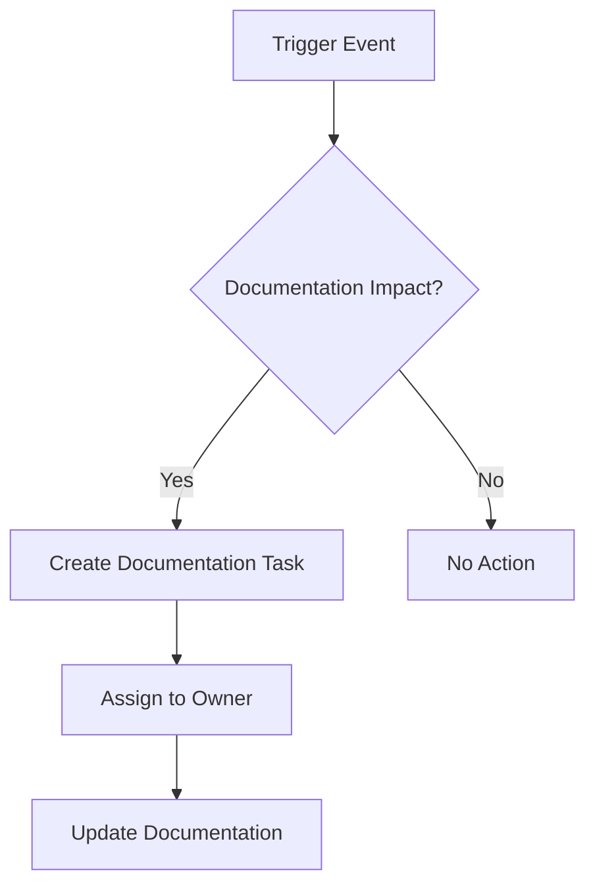

# Documentation Maintenance Guide

> **Last Updated**: 2024-11-09  
> **Owner**: Documentation Team  
> **Status**: Active

## Overview

This guide defines the processes, responsibilities, and workflows for maintaining the Enterprise E-Commerce Platform documentation. Regular maintenance ensures documentation remains accurate, relevant, and valuable to all stakeholders.

## Maintenance Philosophy

- **Living Documentation**: Documentation evolves with the system
- **Continuous Improvement**: Regular reviews and updates
- **Shared Responsibility**: Everyone contributes to documentation quality
- **Automation First**: Automate validation and maintenance where possible

---

## Review Cycles

### Monthly Reviews

**Frequency**: First week of each month  
**Duration**: 2-4 hours  
**Participants**: Documentation team, tech leads

#### Activities

- [ ] Review documentation metrics dashboard
- [ ] Check for broken links and outdated references
- [ ] Review recent code changes for documentation impact
- [ ] Update API documentation for new endpoints
- [ ] Review and address documentation issues/feedback
- [ ] Update changelog and version information

#### Deliverables

- Monthly documentation health report
- List of identified issues and action items
- Updated documentation sections

### Quarterly Reviews

**Frequency**: End of each quarter  
**Duration**: 1-2 days  
**Participants**: All stakeholders, documentation team

#### Activities

- [ ] Comprehensive documentation audit
- [ ] Review all viewpoints and perspectives
- [ ] Validate architecture diagrams against current state
- [ ] Review and update ADRs
- [ ] Stakeholder feedback collection and analysis
- [ ] Documentation coverage analysis
- [ ] Update technology stack documentation
- [ ] Review and update operational runbooks

#### Deliverables

- Quarterly documentation audit report
- Updated documentation roadmap
- Stakeholder feedback summary
- Action plan for next quarter

### Annual Reviews

**Frequency**: End of fiscal year  
**Duration**: 1 week  
**Participants**: All stakeholders, leadership team

#### Activities

- [ ] Complete documentation restructuring review
- [ ] Major version updates and migrations
- [ ] Long-term documentation strategy review
- [ ] Documentation tooling evaluation
- [ ] Training needs assessment
- [ ] Documentation ROI analysis
- [ ] Archive obsolete documentation
- [ ] Plan major documentation initiatives

#### Deliverables

- Annual documentation state report
- Documentation strategy for next year
- Budget and resource planning
- Training plan

---

## Documentation Ownership Model

### Ownership Levels

#### Primary Owner

**Responsibilities**:
- Overall quality and accuracy
- Regular updates and maintenance
- Stakeholder communication
- Review coordination

#### Technical Reviewer

**Responsibilities**:
- Technical accuracy validation
- Code example verification
- Architecture alignment
- Security review

#### Domain Expert

**Responsibilities**:
- Business logic accuracy
- Use case validation
- Terminology consistency
- Requirements alignment

### Ownership Matrix

| Documentation Type | Primary Owner | Technical Reviewer | Domain Expert |
|-------------------|---------------|-------------------|---------------|
| Viewpoints | Architecture Team | Tech Leads | Product Owners |
| Perspectives | Quality Team | Security Team | Compliance Team |
| ADRs | Architecture Team | Tech Leads | Stakeholders |
| API Documentation | Backend Team | API Team | Product Team |
| Operational Docs | Operations Team | DevOps Team | SRE Team |
| Development Guides | Development Team | Tech Leads | Architects |

### Ownership Assignment Process

1. **Identify Documentation**: New or existing documentation needing ownership
2. **Assign Primary Owner**: Based on expertise and responsibility
3. **Assign Reviewers**: Technical and domain experts
4. **Document Assignment**: Update CODEOWNERS file
5. **Communicate**: Notify all parties of assignments
6. **Track**: Monitor ownership effectiveness

---

## Update Workflow

### Trigger Events

Documentation updates are triggered by:

- **Code Changes**: New features, bug fixes, refactoring
- **Architecture Changes**: New patterns, technology changes
- **Process Changes**: New workflows, policy updates
- **Feedback**: User feedback, support tickets
- **Scheduled Reviews**: Monthly, quarterly, annual
- **Incidents**: Post-mortem documentation updates

### Update Process

#### 1. Identify Update Need



#### 2. Create Documentation Task

- **Title**: Clear description of update needed
- **Context**: Why update is needed
- **Scope**: What documentation is affected
- **Priority**: Critical, High, Medium, Low
- **Deadline**: Based on priority and impact

#### 3. Update Documentation

**Process**:
1. Create feature branch: `docs/update-{topic}`
2. Make documentation changes
3. Update diagrams if needed
4. Run validation checks
5. Self-review changes
6. Create pull request

**Checklist**:
- [ ] Content is accurate and complete
- [ ] Links are valid
- [ ] Diagrams are updated
- [ ] Code examples are tested
- [ ] Cross-references are updated
- [ ] Metadata is current
- [ ] Spelling and grammar checked

#### 4. Review Process

**Review Steps**:
1. **Automated Checks**: CI/CD validation
2. **Technical Review**: Accuracy and completeness
3. **Domain Review**: Business logic validation
4. **Editorial Review**: Style and clarity
5. **Approval**: Primary owner approval

**Review Criteria**:
- Technical accuracy
- Completeness
- Clarity and readability
- Consistency with existing docs
- Proper formatting
- Valid links and references

#### 5. Merge and Deploy

- Merge to main branch
- Automatic deployment to documentation site
- Notify stakeholders of updates
- Update changelog

### Emergency Updates

For critical documentation updates (security issues, major bugs):

1. **Immediate Update**: Skip normal review for speed
2. **Fast-Track Review**: Single reviewer approval
3. **Quick Deploy**: Immediate merge and deploy
4. **Post-Update Review**: Full review within 24 hours
5. **Notification**: Alert all stakeholders immediately

---

## Documentation Drift Detection

### Automated Detection

**Tools**:
- `scripts/check-doc-drift.sh`: Detects code-documentation mismatches
- GitHub Actions: Automated drift detection on PRs
- Documentation linter: Checks for outdated content

**Detection Criteria**:
- Code changes without documentation updates
- API changes without API doc updates
- Architecture changes without ADR updates
- Outdated version numbers
- Broken links and references

### Manual Detection

**Monthly Audit**:
- Review recent code changes
- Check for undocumented features
- Validate architecture diagrams
- Review API documentation completeness

**Quarterly Deep Dive**:
- Complete documentation walkthrough
- Stakeholder interviews
- User feedback analysis
- Metrics review

---

## Quality Assurance

### Automated Quality Checks

Run before every commit:

```bash
# Validate all documentation
./scripts/validate-docs.sh

# Check for broken links
./scripts/validate-links.sh

# Validate diagrams
./scripts/validate-diagrams.sh

# Check documentation completeness
./scripts/validate-documentation-completeness.py

# Spell check
./scripts/check-spelling.sh
```

### Manual Quality Checks

**Weekly**:
- Review new documentation
- Check recent updates for quality
- Monitor documentation metrics

**Monthly**:
- Sample documentation review
- User feedback analysis
- Metrics trend analysis

**Quarterly**:
- Comprehensive quality audit
- Stakeholder satisfaction survey
- Documentation effectiveness review

---

## Continuous Improvement

### Feedback Collection

**Channels**:
- Documentation feedback forms
- GitHub issues
- Support tickets
- Stakeholder interviews
- User surveys

**Process**:
1. Collect feedback continuously
2. Categorize and prioritize
3. Create improvement tasks
4. Implement improvements
5. Measure impact

### Metrics-Driven Improvement

**Key Metrics**:
- Documentation coverage
- Update frequency
- Time to update
- User satisfaction
- Search effectiveness
- Link health

**Improvement Cycle**:
1. Analyze metrics
2. Identify improvement areas
3. Plan improvements
4. Implement changes
5. Measure results
6. Iterate

### Best Practices Evolution

**Process**:
- Document lessons learned
- Share best practices
- Update guidelines
- Train team members
- Celebrate successes

---

## Tools and Automation

### Documentation Tools

- **Markdown**: Primary documentation format
- **PlantUML**: Complex diagrams
- **Mermaid**: Simple diagrams
- **GitHub**: Version control and collaboration
- **CI/CD**: Automated validation and deployment

### Automation Scripts

| Script | Purpose | Frequency |
|--------|---------|-----------|
| `validate-docs.sh` | Validate all documentation | Every commit |
| `generate-diagrams.sh` | Generate diagrams | On diagram changes |
| `check-doc-drift.sh` | Detect documentation drift | Daily |
| `validate-links.sh` | Check for broken links | Daily |
| `check-spelling.sh` | Spell check | Every commit |

### CI/CD Integration

**GitHub Actions Workflows**:
- Documentation validation on PRs
- Diagram generation on changes
- Link checking daily
- Drift detection on code changes
- Automated deployment on merge

---

## Training and Onboarding

### New Team Member Onboarding

**Week 1**:
- Documentation structure overview
- Tool training (Markdown, PlantUML, Git)
- Review process introduction
- Ownership model explanation

**Week 2-4**:
- Shadow documentation updates
- Review existing documentation
- Make first documentation contribution
- Participate in review process

### Ongoing Training

**Quarterly**:
- Documentation best practices workshop
- Tool updates and new features
- Lessons learned sharing
- Writing skills improvement

**Annual**:
- Advanced documentation techniques
- Architecture documentation training
- Stakeholder communication skills
- Documentation strategy session

---

## Troubleshooting

### Common Issues

#### Outdated Documentation

**Symptoms**:
- User reports inaccuracies
- Code doesn't match documentation
- Diagrams show old architecture

**Resolution**:
1. Identify affected documentation
2. Create update task with high priority
3. Fast-track review and update
4. Notify stakeholders of changes

#### Broken Links

**Symptoms**:
- Link validation failures
- User reports broken links
- 404 errors in documentation

**Resolution**:
1. Run link validation script
2. Identify broken links
3. Update or remove links
4. Verify fix with validation

#### Documentation Drift

**Symptoms**:
- Code changes without doc updates
- Increasing drift detection alerts
- Stakeholder confusion

**Resolution**:
1. Review recent code changes
2. Identify missing documentation
3. Create documentation tasks
4. Update documentation
5. Improve drift detection

---

## Metrics and Reporting

### Key Performance Indicators

- **Coverage**: % of features documented
- **Freshness**: Average age of documentation
- **Quality**: Validation pass rate
- **Usage**: Page views and search queries
- **Satisfaction**: User feedback scores
- **Velocity**: Time to update documentation

### Reporting Schedule

**Weekly**: Quick metrics dashboard review  
**Monthly**: Detailed metrics report  
**Quarterly**: Comprehensive documentation health report  
**Annual**: Documentation state of the union

---

## Contact and Support

### Documentation Team

- **Lead**: [Name] - [Email]
- **Architects**: [Names] - [Email]
- **Writers**: [Names] - [Email]

### Getting Help

- **Questions**: #documentation Slack channel
- **Issues**: GitHub documentation repository
- **Feedback**: Documentation feedback form
- **Training**: Contact documentation lead

---

## Appendix

### Related Documents

- [Documentation Style Guide](STYLE-GUIDE.md)
- [Documentation Metrics](METRICS.md)
- [Stakeholder Review Plan](STAKEHOLDER-REVIEW-PLAN.md)
- [Review Coordinator Quick Start](REVIEW-COORDINATOR-QUICK-START.md)

### Change History

| Date | Version | Changes | Author |
|------|---------|---------|--------|
| 2024-11-09 | 1.0 | Initial creation | Documentation Team |

---

**Document Version**: 1.0  
**Last Updated**: 2024-11-09  
**Next Review**: 2024-12-09
# Documentation Maintenance Schedule

## Overview

This document defines the recurring maintenance schedule for documentation reviews, updates, and quality checks. Regular maintenance ensures documentation stays accurate, relevant, and useful.

**Established**: 2024-11-09  
**Next Review**: 2024-12-09

---

## Maintenance Cadence

### Daily Tasks (Automated)

**Automated Checks** - Run via CI/CD
- Link validation on every commit
- Diagram generation on PlantUML changes
- Template compliance checks
- Broken reference detection

**Responsibility**: CI/CD Pipeline  
**Escalation**: Slack #documentation-alerts

### Weekly Tasks (Manual)

**Every Monday, 10:00 AM**

**Review Team Meeting** (30 minutes)
- Review new documentation issues
- Triage feedback from previous week
- Assign urgent items
- Update backlog priorities

**Attendees**:
- Documentation Lead
- Technical Writer
- Developer Liaison
- Operations Liaison

**Agenda Template**:
1. Review metrics from previous week
2. Triage new issues (10 min)
3. Review in-progress items (10 min)
4. Plan week's priorities (10 min)

**Every Friday, 3:00 PM**

**Quality Check** (1 hour)
- Run comprehensive validation scripts
- Review documentation metrics
- Check for outdated content
- Update maintenance log

**Responsibility**: Documentation Team  
**Deliverable**: Weekly quality report

### Monthly Tasks

**First Monday of Month, 2:00 PM**

**Comprehensive Documentation Review** (2 hours)

**Attendees**:
- Documentation Team
- Architecture Team Representative
- Development Team Representative
- Operations Team Representative

**Agenda**:
1. Review previous month's metrics (15 min)
2. Assess documentation health (30 min)
3. Review and update backlog (30 min)
4. Plan next month's priorities (30 min)
5. Identify improvement opportunities (15 min)

**Deliverables**:
- Monthly metrics report
- Updated backlog
- Next month's priorities
- Action items list

**Second Tuesday of Month, 10:00 AM**

**Stakeholder Feedback Review** (1 hour)

**Attendees**:
- Documentation Lead
- Product Manager
- Key Stakeholders (rotating)

**Agenda**:
1. Review feedback forms (20 min)
2. Discuss common themes (20 min)
3. Prioritize improvements (20 min)

**Deliverables**:
- Feedback summary
- Prioritized improvement list

**Third Wednesday of Month, 3:00 PM**

**Content Freshness Review** (1.5 hours)

**Focus**: Identify and update outdated content

**Process**:
1. Run automated staleness detection
2. Review documents older than 90 days
3. Verify technical accuracy
4. Update or archive as needed

**Responsibility**: Technical Writer + Domain Experts  
**Deliverable**: Updated content list

**Last Friday of Month**

**Metrics Collection & Reporting** (1 hour)

**Tasks**:
- Collect all documentation metrics
- Generate monthly report
- Update dashboards
- Share with stakeholders

**Responsibility**: Documentation Lead  
**Deliverable**: Monthly metrics report

### Quarterly Tasks

**First Week of Quarter**

**Strategic Documentation Review** (Half Day)

**Attendees**:
- Documentation Team
- Architecture Team
- Development Leadership
- Operations Leadership
- Product Leadership

**Agenda**:
1. Review quarter's achievements (30 min)
2. Assess documentation strategy (1 hour)
3. Plan next quarter (1 hour)
4. Update documentation roadmap (30 min)

**Deliverables**:
- Quarterly review report
- Updated documentation strategy
- Next quarter's roadmap
- Resource allocation plan

**Mid-Quarter**

**Stakeholder Survey** (Ongoing for 2 weeks)

**Process**:
1. Distribute satisfaction survey
2. Collect responses
3. Analyze results
4. Present findings
5. Plan improvements

**Responsibility**: Documentation Lead  
**Deliverable**: Survey results and action plan

**End of Quarter**

**Documentation Audit** (Full Day)

**Focus**: Comprehensive quality assessment

**Tasks**:
- Review all viewpoints and perspectives
- Verify all diagrams are current
- Check all ADRs are up-to-date
- Validate all API documentation
- Review all runbooks
- Assess template compliance

**Responsibility**: Full Documentation Team  
**Deliverable**: Audit report with findings

### Annual Tasks

**January (Q1)**

**Annual Documentation Planning** (Full Day Workshop)

**Attendees**:
- Documentation Team
- All Stakeholders
- Leadership Team

**Agenda**:
1. Review previous year (1 hour)
2. Assess current state (1 hour)
3. Define annual goals (2 hours)
4. Plan major initiatives (2 hours)
5. Allocate resources (1 hour)

**Deliverables**:
- Annual review report
- Documentation goals for year
- Major initiatives roadmap
- Resource plan

**July (Q3)**

**Mid-Year Review** (Half Day)

**Focus**: Progress assessment and course correction

**Agenda**:
1. Review H1 achievements (1 hour)
2. Assess goal progress (1 hour)
3. Adjust H2 plans (1 hour)

**Deliverable**: Mid-year review report

---

## First Maintenance Review

### Scheduled Date

**Date**: Monday, December 9, 2024  
**Time**: 2:00 PM - 4:00 PM (2 hours)  
**Location**: Conference Room A / Zoom Link: [TBD]

### Attendees

**Required**:
- Documentation Lead
- Technical Writer
- Developer Liaison
- Operations Liaison
- Architecture Team Representative

**Optional**:
- Product Manager
- QA Lead
- Additional Stakeholders

### Agenda

**2:00 PM - 2:15 PM**: Welcome & Overview (15 min)
- Review documentation launch
- Discuss initial feedback
- Set expectations for review

**2:15 PM - 2:45 PM**: Metrics Review (30 min)
- Documentation usage statistics
- Quality metrics
- Feedback summary
- Issue resolution status

**2:45 PM - 3:15 PM**: Content Assessment (30 min)
- Review completed documentation
- Identify gaps and issues
- Assess documentation quality
- Discuss improvement areas

**3:15 PM - 3:45 PM**: Backlog Review & Prioritization (30 min)
- Review current backlog
- Prioritize items for next month
- Assign responsibilities
- Set deadlines

**3:45 PM - 4:00 PM**: Action Items & Next Steps (15 min)
- Summarize action items
- Confirm assignments
- Schedule next review
- Closing remarks

### Pre-Meeting Preparation

**By December 6, 2024**:
- [ ] Collect and analyze metrics
- [ ] Compile feedback summary
- [ ] Review backlog items
- [ ] Prepare presentation materials
- [ ] Send calendar invites
- [ ] Share pre-read materials

### Deliverables

- Meeting minutes
- Action items list with owners
- Updated backlog priorities
- Next month's focus areas
- Metrics report

### Follow-Up

**Within 3 Days**:
- Distribute meeting minutes
- Update backlog in tracking system
- Communicate action items
- Schedule follow-up meetings

---

## Recurring Calendar Events

### Created Events

The following recurring calendar events have been created:

1. **Weekly Review Team Meeting**
   - Every Monday, 10:00 AM - 10:30 AM
   - Attendees: Documentation Team
   - Location: Conference Room B / Zoom

2. **Weekly Quality Check**
   - Every Friday, 3:00 PM - 4:00 PM
   - Attendees: Documentation Team
   - Location: Documentation Team Area

3. **Monthly Comprehensive Review**
   - First Monday of Month, 2:00 PM - 4:00 PM
   - Attendees: Documentation + Representatives
   - Location: Conference Room A / Zoom

4. **Monthly Stakeholder Feedback Review**
   - Second Tuesday of Month, 10:00 AM - 11:00 AM
   - Attendees: Documentation Lead + Stakeholders
   - Location: Conference Room B / Zoom

5. **Monthly Content Freshness Review**
   - Third Wednesday of Month, 3:00 PM - 4:30 PM
   - Attendees: Technical Writer + Domain Experts
   - Location: Documentation Team Area

6. **Monthly Metrics Collection**
   - Last Friday of Month, 2:00 PM - 3:00 PM
   - Attendees: Documentation Lead
   - Location: Documentation Team Area

7. **Quarterly Strategic Review**
   - First Week of Quarter (Specific date TBD)
   - Attendees: All Leadership + Documentation Team
   - Location: Large Conference Room / Zoom

### Calendar Management

**Calendar Owner**: Documentation Lead  
**Backup**: Technical Writer

**To Join**:
- Check your calendar for invites
- Accept recurring events
- Set reminders as needed
- Add to your working calendar

**To Modify**:
- Contact Documentation Lead
- Provide at least 1 week notice
- Suggest alternative times
- Confirm with all attendees

---

## Maintenance Responsibilities

### Documentation Lead

**Weekly**:
- Lead review team meetings
- Monitor documentation metrics
- Triage new issues
- Coordinate with stakeholders

**Monthly**:
- Conduct comprehensive reviews
- Generate metrics reports
- Update documentation strategy
- Present to stakeholders

**Quarterly**:
- Lead strategic reviews
- Conduct stakeholder surveys
- Plan next quarter
- Update roadmap

### Technical Writer

**Daily**:
- Review and respond to feedback
- Update documentation as needed
- Monitor quality checks

**Weekly**:
- Participate in team meetings
- Conduct quality checks
- Update content

**Monthly**:
- Lead content freshness reviews
- Update outdated content
- Improve documentation quality

### Developer Liaison

**Weekly**:
- Review technical accuracy
- Provide developer perspective
- Update technical content

**Monthly**:
- Validate technical documentation
- Review API documentation
- Update code examples

### Operations Liaison

**Weekly**:
- Review operational content
- Update runbooks as needed
- Validate procedures

**Monthly**:
- Review operational documentation
- Update deployment guides
- Validate troubleshooting guides

---

## Escalation Process

### Issue Severity Levels

**Critical (P0)**:
- Incorrect information causing production issues
- Security vulnerabilities in documentation
- Broken critical documentation links

**High (P1)**:
- Significant gaps in documentation
- Outdated information affecting operations
- Major usability issues

**Medium (P2)**:
- Minor inaccuracies
- Formatting issues
- Enhancement requests

**Low (P3)**:
- Typos and grammar
- Style improvements
- Nice-to-have additions

### Escalation Path

**P0 - Critical**:
1. Immediate notification to Documentation Lead
2. Fix within 4 hours
3. Post-mortem within 24 hours

**P1 - High**:
1. Notification to Documentation Lead
2. Fix within 2 business days
3. Review in next weekly meeting

**P2 - Medium**:
1. Add to backlog
2. Prioritize in monthly review
3. Fix within 2 weeks

**P3 - Low**:
1. Add to backlog
2. Address as capacity allows
3. Review quarterly

---

## Contact Information

### Documentation Team

**Documentation Lead**:
- Name: [TBD]
- Email: doc-lead@company.com
- Slack: @doc-lead

**Technical Writer**:
- Name: [TBD]
- Email: tech-writer@company.com
- Slack: @tech-writer

**Developer Liaison**:
- Name: [TBD]
- Email: dev-liaison@company.com
- Slack: @dev-liaison

**Operations Liaison**:
- Name: [TBD]
- Email: ops-liaison@company.com
- Slack: @ops-liaison

### Support Channels

- **Slack**: #documentation
- **Email**: documentation-team@company.com
- **Office Hours**: Tuesday & Thursday, 2-3 PM
- **Emergency**: Contact Documentation Lead directly

---

## Appendix

### Maintenance Checklist Templates

#### Weekly Quality Check Checklist

- [ ] Run link validation script
- [ ] Check diagram generation
- [ ] Review new issues
- [ ] Update metrics dashboard
- [ ] Check for broken references
- [ ] Review feedback forms
- [ ] Update maintenance log

#### Monthly Review Checklist

- [ ] Collect monthly metrics
- [ ] Review all feedback
- [ ] Assess documentation health
- [ ] Update backlog priorities
- [ ] Review outdated content
- [ ] Generate monthly report
- [ ] Plan next month's work

#### Quarterly Audit Checklist

- [ ] Review all viewpoints
- [ ] Review all perspectives
- [ ] Validate all diagrams
- [ ] Check all ADRs
- [ ] Review all API docs
- [ ] Validate all runbooks
- [ ] Assess template compliance
- [ ] Generate audit report

---

*This schedule is reviewed and updated quarterly. Last review: 2024-11-09*

**Questions?** Contact the Documentation Team via #documentation or documentation-team@company.com
