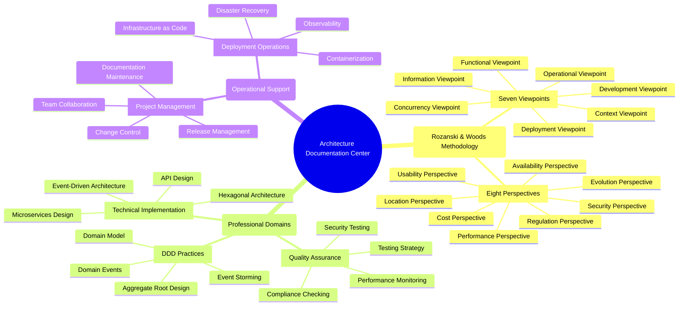

# Architecture Documentation Center

> **Systematic Architecture Documentation Based on Rozanski & Woods Methodology**

Welcome to the documentation center of the Modern Software Architecture Best Practices Example Project! This provides complete architectural documentation, systematically organized using Rozanski & Woods' seven viewpoints and eight perspectives.

## 🌐 Language Versions

- **English Version** (Current): [docs/](.)
- **中文版本**: [docs/zh/](zh/)

## 🎯 Quick Navigation

### 👨‍💼 Navigation by Role

<strong>🏗️ Architects</strong> - System Architecture Design and Decision Making

#### Core Focus Areas
- **[Architecture Viewpoints Overview](viewpoints/README.md)** - Complete introduction to Rozanski & Woods seven viewpoints
- **[Architecture Perspectives Overview](perspectives/README.md)** - Cross-viewpoint quality attribute considerations
- **[Viewpoint-Perspective Cross-Reference Matrix](viewpoint-perspective-matrix.md)** - Complete viewpoint-perspective impact matrix

#### Design Decisions
- **[Architecture Decision Records (ADR)](architecture/adr/)** - Complete record of all important architectural decisions
- **[Architecture Overview](architecture/overview.md)** - Overall system architecture introduction
- **[Rozanski & Woods Architecture Assessment](architecture/rozanski-woods-architecture-assessment.md)** - Architecture excellence evaluation

#### Visual Architecture
- **[System Architecture Overview Diagram](diagrams/mermaid/architecture-overview.md)** - Overall system architecture diagram
- **[DDD Layered Architecture Diagram](diagrams/mermaid/ddd-layered-architecture.md)** - Complete DDD layered architecture
- **[Hexagonal Architecture Diagram](diagrams/mermaid/hexagonal-architecture.md)** - Hexagonal architecture implementation

<strong>👨‍💻 Developers</strong> - Code Implementation and Development Standards

#### Development Guidelines
- **[Development Viewpoint](viewpoints/development/README.md)** - Development and build-related documentation
- **Development Workflow** - Complete development process
- **Hexagonal Architecture Implementation** - Hexagonal architecture development guide

#### Domain-Driven Design
- **[Functional Viewpoint](viewpoints/functional/README.md)** - System functions and responsibilities
- **[Domain Model](viewpoints/functional/domain-model.md)** - DDD domain model design
- **[Aggregate Root Design](viewpoints/functional/aggregates.md)** - Aggregate root design guide
- **[Bounded Contexts](viewpoints/functional/bounded-contexts.md)** - Bounded context delineation

#### API and Integration
- **[API Documentation](api/)** - API-related documentation
- **[MCP Integration Guide](mcp/README.md)** - Model Context Protocol integration

<strong>🚀 DevOps Engineers</strong> - Deployment and Operations

#### Deployment Strategy
- **[Deployment Viewpoint](viewpoints/deployment/README.md)** - Deployment and environment-related documentation
- **[Infrastructure as Code](viewpoints/deployment/infrastructure-as-code.md)** - AWS CDK practices
- **[Production Deployment Checklist](viewpoints/deployment/production-deployment-checklist.md)** - Pre-deployment checks

#### Operations Monitoring
- **[Operational Viewpoint](viewpoints/operational/README.md)** - Operations and maintenance-related documentation
- **[Observability Overview](viewpoints/operational/observability-overview.md)** - Monitoring, logging, tracing systems
- **[Production Environment Observability Testing Guide](viewpoints/operational/production-observability-testing-guide.md)** - 67-page complete testing strategy

#### Infrastructure Diagrams
- **AWS Infrastructure Architecture** - AWS infrastructure architecture
- **Multi-Environment Architecture** - Multi-environment deployment architecture
- **Observability Architecture** - Monitoring system architecture

<strong>🔒 Security Engineers</strong> - Security and Compliance

#### Security Architecture
- **[Security Perspective](perspectives/security/README.md)** - Security and compliance-related documentation
- **[Cross-Viewpoint Security Application](perspectives/security/cross-viewpoint-application.md)** - Security application across viewpoints

#### Compliance Management
- **[Regulation Perspective](perspectives/regulation/README.md)** - Regulatory compliance-related documentation
- **[Availability Perspective](perspectives/availability/README.md)** - Availability and resilience design

#### Security Diagrams
- **[Security Architecture Diagram](diagrams/plantuml/security-architecture-diagram.svg)** - System security architecture
- **[Observability Security Diagram](diagrams/plantuml/observability-diagram.svg)** - Monitoring system security

<strong>⚡ Performance Engineers</strong> - Performance Optimization and Scaling

#### Performance Architecture
- **[Performance Perspective](perspectives/performance/README.md)** - Performance and scalability-related documentation
- **[Concurrency Viewpoint](viewpoints/concurrency/README.md)** - Concurrency and synchronization-related documentation

#### Cost Optimization
- **[Cost Perspective](perspectives/cost/README.md)** - Cost optimization-related documentation
- **[Location Perspective](perspectives/location/README.md)** - Geographic distribution and localization

#### Performance Diagrams
- **Event-Driven Architecture** - Event-driven architecture
- **[CQRS Pattern Diagram](diagrams/plantuml/cqrs-pattern-diagram.svg)** - CQRS pattern implementation

<strong>🎨 Product Managers/Business Analysts</strong> - Business Requirements and Processes

#### Business Processes
- **[Information Viewpoint](viewpoints/information/README.md)** - Data and information flow-related documentation
- **[Domain Events](viewpoints/information/domain-events.md)** - Domain event design

#### User Experience
- **[Usability Perspective](perspectives/usability/README.md)** - User experience-related documentation
- **[Evolution Perspective](perspectives/evolution/README.md)** - Evolution and maintenance-related documentation

#### Business Process Diagrams
- **[Event Storming Diagrams](diagrams/plantuml/event-storming/)** - Business process analysis
- **[Use Case Diagram](diagrams/plantuml/use-case-diagram.svg)** - System functionality overview
- **[Activity Diagram](diagrams/plantuml/activity-diagram-overview.svg)** - Business process diagram

### 🔍 Navigation by Concerns

<strong>🏗️ System Architecture</strong> - Overall Architecture Design

#### Architecture Methodology
- **[Rozanski & Woods Methodology](architecture/rozanski-woods-architecture-assessment.md)** - Complete architecture assessment
- **[Seven Viewpoints Overview](viewpoints/README.md)** - Functional, Information, Concurrency, Development, Deployment, Operational, Context viewpoints
- **[Eight Perspectives Overview](perspectives/README.md)** - Security, Performance, Availability, Evolution, Usability, Regulation, Location, Cost perspectives

#### Architecture Patterns
- **Hexagonal Architecture** - Ports and adapters pattern
- **[Layered Architecture](architecture/layered-architecture-design.md)** - DDD layered architecture design
- **Event-Driven Architecture** - Event-driven pattern

#### Architecture Diagrams
- **[System Overview Diagram](diagrams/mermaid/architecture-overview.md)** - Complete system architecture
- **[DDD Layered Architecture Diagram](diagrams/mermaid/ddd-layered-architecture.md)** - 298-line detailed architecture description
- **[Hexagonal Architecture Diagram](diagrams/mermaid/hexagonal-architecture.md)** - Ports and adapters implementation

<strong>🎯 Domain-Driven Design</strong> - DDD Practices

#### Strategic Design
- **[Bounded Contexts](viewpoints/functional/bounded-contexts.md)** - 13 bounded contexts design
- **[Domain Model](viewpoints/functional/domain-model.md)** - Complete domain model design
- **[Aggregate Root Design](viewpoints/functional/aggregates.md)** - Aggregate root best practices

#### Tactical Design
- **[Domain Events](viewpoints/information/domain-events.md)** - Domain event implementation
- **[Architecture Elements](viewpoints/functional/architecture-elements.md)** - DDD tactical patterns
- **[Implementation Guide](viewpoints/functional/implementation-guide.md)** - DDD implementation guide

#### DDD Diagrams
- **[Domain Model Diagram](diagrams/plantuml/domain-model-diagram.svg)** - Complete domain model
- **[Bounded Context Diagram](diagrams/plantuml/bounded-context-diagram.svg)** - Context delineation
- **[Event Storming](diagrams/plantuml/event-storming/)** - Big Picture, Process Level, Design Level

<strong>📊 Data and Information</strong> - Data Architecture

#### Data Design
- **[Information Viewpoint](viewpoints/information/README.md)** - Data and information flow design
- **[Domain Events](viewpoints/information/domain-events.md)** - Event-driven data flow
- **[Architecture Elements](viewpoints/information/architecture-elements.md)** - Data architecture elements

#### Data Flow
- **[Event Storming](diagrams/plantuml/event-storming/)** - Complete event storming analysis
- **[CQRS Pattern](diagrams/plantuml/cqrs-pattern-diagram.svg)** - Command Query Responsibility Segregation
- **[Event Sourcing](diagrams/plantuml/event-sourcing-diagram.svg)** - Event sourcing pattern

#### Data Diagrams
- **[Data Model Diagram](diagrams/plantuml/data-model-diagram.svg)** - Complete data model
- **Event-Driven Data Flow** - Event-driven data flow
- **[Domain Event Processing](diagrams/plantuml/domain-event-handling/)** - Event processing flow

<strong>🔒 Security and Compliance</strong> - Security Architecture

#### Security Design
- **[Security Perspective](perspectives/security/README.md)** - Comprehensive security architecture design
- **[Cross-Viewpoint Security Application](perspectives/security/cross-viewpoint-application.md)** - Security implementation across viewpoints
- **[Regulation Perspective](perspectives/regulation/README.md)** - Compliance requirements and implementation

#### Security Implementation
- **[Functional Viewpoint Security Considerations](viewpoints/functional/quality-considerations.md)** - Business logic security
- **[Information Viewpoint Security Considerations](viewpoints/information/README.md)** - Data security and privacy
- **[Deployment Viewpoint Security Considerations](viewpoints/deployment/README.md)** - Infrastructure security

#### Security Diagrams
- **[Security Architecture Diagram](diagrams/plantuml/security-architecture-diagram.svg)** - Complete security architecture
- **[Observability Security](diagrams/plantuml/observability-diagram.svg)** - Monitoring system security

<strong>⚡ Performance and Scaling</strong> - Performance Optimization

#### Performance Design
- **[Performance Perspective](perspectives/performance/README.md)** - Performance and scalability design
- **[Concurrency Viewpoint](viewpoints/concurrency/README.md)** - Concurrency and synchronization processing
- **[Cost Perspective](perspectives/cost/README.md)** - Cost-benefit optimization

#### Performance Implementation
- **High-Performance Event Processing** - High-performance event processing
- **[CQRS Pattern](diagrams/plantuml/cqrs-pattern-diagram.svg)** - Read-write separation optimization
- **Performance Monitoring** - Performance monitoring

#### Performance Diagrams
- **[System Performance Architecture](diagrams/mermaid/architecture-overview.md)** - Performance critical paths
- **Scalability Design** - Scalability design
- **Cloud Performance Optimization** - Cloud performance optimization

<strong>🚀 Deployment and Operations</strong> - DevOps Practices

#### Deployment Strategy
- **[Deployment Viewpoint](viewpoints/deployment/README.md)** - Complete deployment strategy
- **[Infrastructure as Code](viewpoints/deployment/infrastructure-as-code.md)** - AWS CDK practices
- **[Production Deployment Checklist](viewpoints/deployment/production-deployment-checklist.md)** - Deployment best practices

#### Operations Monitoring
- **[Operational Viewpoint](viewpoints/operational/README.md)** - Operations and maintenance strategy
- **[Observability Overview](viewpoints/operational/observability-overview.md)** - Monitoring system design
- **[Production Environment Testing](viewpoints/operational/production-observability-testing-guide.md)** - 67-page testing guide

#### Deployment Diagrams
- **[Deployment Architecture Diagram](diagrams/plantuml/deployment-diagram.svg)** - Complete deployment architecture
- **Cloud Infrastructure** - Cloud infrastructure
- **Environment Management Strategy** - Environment management strategy

### 📊 Visual Navigation

<strong>🎨 Architecture Diagrams Overview</strong> - Complete Visual Architecture

#### Mermaid Diagrams (Direct GitHub Display)
- **[System Architecture Overview](diagrams/mermaid/architecture-overview.md)** - Complete 7-layer architecture display
- **[DDD Layered Architecture](diagrams/mermaid/ddd-layered-architecture.md)** - 298-line detailed architecture description
- **[Hexagonal Architecture](diagrams/mermaid/hexagonal-architecture.md)** - Ports and adapters pattern
- **[Event-Driven Architecture](diagrams/mermaid/event-driven-architecture.md)** - Event-driven pattern
- **[API Interaction Diagram](diagrams/mermaid/api-interactions.md)** - API interaction relationships

#### PlantUML Diagrams (Detailed UML Diagrams)
- **[Domain Model Diagram](diagrams/plantuml/domain-model-diagram.svg)** - Complete domain model
- **[Bounded Context Diagram](diagrams/plantuml/bounded-context-diagram.svg)** - Context delineation
- **[Event Storming Series](diagrams/plantuml/event-storming/)** - Big Picture, Process Level, Design Level
- **[Security Architecture Diagram](diagrams/plantuml/security-architecture-diagram.svg)** - Security architecture design
- **[Deployment Architecture Diagram](diagrams/plantuml/deployment-diagram.svg)** - Deployment architecture design

#### Diagram Tools Guide
- **[Diagram Tools Guide](diagrams/diagram-tools-guide.md)** - Mermaid, PlantUML, Excalidraw usage guide
- **[Diagram Generation Report](../reports-summaries/general/generation-report.md)** - Automated diagram generation
- **[UML Standards](diagrams/plantuml/UML-STANDARDS.md)** - UML 2.5 standard practices

## 🔍 Intelligent Search and Navigation

### 🎯 Quick Search Guide

| Search Type | Example Keywords | Related Documentation |
|-------------|------------------|----------------------|
| **Architecture Design** | `viewpoint`, `perspective`, `architecture` | [Viewpoints Overview](viewpoints/README.md), [Perspectives Overview](perspectives/README.md) |
| **Domain-Driven Design** | `DDD`, `aggregate`, `domain event`, `bounded context` | [Domain Model](viewpoints/functional/domain-model.md), [Aggregate Roots](viewpoints/functional/aggregates.md) |
| **Security and Compliance** | `security`, `compliance`, `regulation`, `GDPR` | [Security Perspective](perspectives/security/README.md), [Regulation Perspective](perspectives/regulation/README.md) |
| **Performance Optimization** | `performance`, `scalability`, `caching`, `load balancing` | [Performance Perspective](perspectives/performance/README.md), [Concurrency Viewpoint](viewpoints/concurrency/README.md) |
| **Deployment Operations** | `deployment`, `kubernetes`, `docker`, `observability` | [Deployment Viewpoint](viewpoints/deployment/README.md), [Operational Viewpoint](viewpoints/operational/README.md) |
| **Testing Quality** | `testing`, `performance monitoring`, `quality assurance` | [Testing Documentation](testing/), [Test Performance Monitoring](testing/test-performance-monitoring.md) |
| **API Integration** | `API`, `REST`, `integration`, `frontend` | [API Documentation](api/), Frontend Integration |
| **Diagram Visualization** | `diagram`, `mermaid`, `plantuml`, `architecture diagram` | [Diagrams Overview](diagrams/README.md), [Visual Navigation](#-visual-navigation) |

### 📍 Topic Navigation Map

### 🔗 Cross-Reference System

#### Viewpoint-Perspective Cross-Reference
- **[Complete Cross-Reference Matrix](viewpoint-perspective-matrix.md)** - Impact analysis between viewpoints and perspectives
- **[Cross-Viewpoint Document Links](cross-reference-links.md)** - Link index of all related documents

#### Intelligent Inter-Document Links
- **High Impact Relationships** (🔴): Document combinations requiring deep integration consideration
- **Medium Impact Relationships** (🟡): Document combinations requiring moderate consideration  
- **Low Impact Relationships** (🟢): Document combinations requiring basic consideration

#### Navigation Recommendations
1. **Beginner's Guide**: Start with [Architecture Overview](architecture/overview.md)
2. **Deep Learning**: Follow [Viewpoints Overview](viewpoints/README.md) step by step
3. **Practical Application**: Refer to [Implementation Guide](viewpoints/functional/implementation-guide.md)
4. **Problem Solving**: Use the search table above to quickly locate relevant documentation

## 📚 Rozanski & Woods Methodology

### Seven Architectural Viewpoints

| Viewpoint | Core Focus | Main Stakeholders | High Impact Perspectives | Related Diagrams |
|-----------|------------|-------------------|-------------------------|------------------|
| **[Functional Viewpoint](viewpoints/functional/README.md)** | System functions and responsibilities | Business Analysts, Product Managers | 🔴 Security, Availability, Usability | [Domain Model Diagram](diagrams/plantuml/domain-model-diagram.svg) |
| **[Information Viewpoint](viewpoints/information/README.md)** | Data and information flow | Data Architects, DBAs | 🔴 Security, Performance, Availability, Regulation | [Event Storming](diagrams/plantuml/event-storming/) |
| **[Concurrency Viewpoint](viewpoints/concurrency/README.md)** | Concurrency and synchronization | Performance Engineers, Architects | 🔴 Performance, Availability | Event-Driven Architecture |
| **[Development Viewpoint](viewpoints/development/README.md)** | Development and build | Developers, Technical Leads | 🔴 Security, Evolution, Cost | [Hexagonal Architecture](diagrams/mermaid/hexagonal-architecture.md) |
| **[Deployment Viewpoint](viewpoints/deployment/README.md)** | Deployment and environment | DevOps, SRE | 🔴 Security, Performance, Availability, Location, Cost | [Deployment Architecture Diagram](diagrams/plantuml/deployment-diagram.svg) |
| **[Operational Viewpoint](viewpoints/operational/README.md)** | Operations and maintenance | SRE, Operations Engineers | 🔴 Security, Performance, Availability, Regulation, Cost | Observability Architecture |
| **[Context Viewpoint](viewpoints/context/README.md)** | System boundaries and external dependencies | Architects, Business Analysts, Integration Engineers | 🔴 Security, Regulation, Location, Cost | [System Boundary Diagram](viewpoints/context/README.md#system-boundary-definition) |

### Eight Architectural Perspectives

| Perspective | Quality Attributes | Cross-Viewpoint Impact | Design Strategies | Related Diagrams |
|-------------|-------------------|------------------------|-------------------|------------------|
| **[Security Perspective](perspectives/security/README.md)** | Confidentiality, Integrity, Availability | Affects all viewpoints | Zero Trust, Defense in Depth | [Security Architecture Diagram](diagrams/plantuml/security-architecture-diagram.svg) |
| **[Performance Perspective](perspectives/performance/README.md)** | Response Time, Throughput, Resource Usage | High Impact: Information, Concurrency, Deployment, Operational | Caching, Load Balancing, Optimization | [Performance Architecture Diagram](diagrams/mermaid/architecture-overview.md) |
| **[Availability Perspective](perspectives/availability/README.md)** | Reliability, Fault Tolerance, Recovery Capability | High Impact: Concurrency, Deployment, Operational | Redundancy, Failover, Circuit Breaker | High Availability Architecture |
| **[Evolution Perspective](perspectives/evolution/README.md)** | Maintainability, Extensibility, Flexibility | High Impact: Functional, Development | Modularity, API Version Management | [Evolution Architecture Diagram](diagrams/mermaid/ddd-layered-architecture.md) |
| **[Usability Perspective](perspectives/usability/README.md)** | Ease of Use, Accessibility, User Experience | High Impact: Functional | User-Centered Design, Responsive Design | [API Interaction Diagram](diagrams/mermaid/api-interactions.md) |
| **[Regulation Perspective](perspectives/regulation/README.md)** | Compliance, Auditability, Governance | High Impact: Information, Operational | Privacy by Design, Audit Trail | [Compliance Architecture Diagram](diagrams/plantuml/observability-diagram.svg) |
| **[Location Perspective](perspectives/location/README.md)** | Geographic Distribution, Localization, Latency | High Impact: Deployment | Multi-Region, Edge Computing, CDN | Geographic Distribution Diagram |
| **[Cost Perspective](perspectives/cost/README.md)** | Cost-Effectiveness, Resource Efficiency, Budget | High Impact: Development, Deployment, Operational | Right-Sizing, Auto-Scaling, Monitoring | Cost Optimization Diagram |

### Core Architecture Framework

- **[Viewpoint-Perspective Cross-Reference Matrix](viewpoint-perspective-matrix.md)** - Complete viewpoint-perspective impact matrix
- **[Cross-Viewpoint and Perspective Document Cross-Reference Links](cross-reference-links.md)** - Link index of all related documents
- **[Architecture Decision Records (ADR)](architecture/adr/)** - Complete record of all important architectural decisions
- **[Rozanski & Woods Architecture Assessment](architecture/rozanski-woods-architecture-assessment.md)** - Architecture excellence evaluation

## 📚 Professional Domain Documentation

### 📊 Project Reports and Summaries

- **[Reports and Summaries Center](../reports-summaries/)** - Unified management of all project reports and summaries
  - **[Task Execution Reports](../reports-summaries/task-execution/)** - Task completion reports and automation results
  - **[Architecture Design Reports](../reports-summaries/architecture-design/)** - Architecture decision and design documentation reports
  - **[Diagram Synchronization Reports](../reports-summaries/diagrams/)** - Diagram generation and synchronization reports
  - **[Infrastructure Reports](../reports-summaries/infrastructure/)** - Deployment and infrastructure management reports
  - **[Frontend Development Reports](../reports-summaries/frontend/)** - Frontend development and UI improvement reports
  - **[Testing Quality Reports](../reports-summaries/testing/)** - Test optimization and quality verification reports
  - **[Translation System Reports](../reports-summaries/translation/)** - Translation system and language processing reports
  - **[Project Management Reports](../reports-summaries/project-management/)** - Project status and refactoring reports

### 🔌 API Design and Integration

- **[API Documentation Center](api/README.md)** - Complete API design and integration documentation
- **[Frontend Integration Guide](api/frontend-integration.md)** - Frontend and backend integration best practices
- **[API Versioning Strategy](api/API_VERSIONING_STRATEGY.md)** - API version management and backward compatibility
- **[Observability API](api/observability-api.md)** - Monitoring and observability API design

### 🤖 AI-Assisted Development

- **[MCP Integration Guide](mcp/README.md)** - Model Context Protocol integration and usage
- **[Excalidraw MCP Usage Guide](mcp/excalidraw-mcp-usage-guide.md)** - AI-assisted diagram creation and editing
- **[MCP Setup Checklist](mcp/mcp-setup-checklist.md)** - Complete MCP environment setup guide

### 🧪 Testing and Quality Assurance

- **[Testing Documentation Center](testing/README.md)** - Complete testing strategy and quality assurance
- **[Test Performance Monitoring](testing/test-performance-monitoring.md)** - Test execution performance optimization
- **[HTTP Client Configuration Guide](testing/http-client-configuration-guide.md)** - Test environment HTTP client configuration
- **[New Developer Onboarding Guide](testing/new-developer-onboarding-guide.md)** - Testing environment setup for new developers
- **[Test Optimization Guidelines](testing/test-optimization-guidelines.md)** - Test performance optimization best practices

### 🚀 Deployment and Operations

- **[Deployment Documentation Center](deployment/README.md)** - Complete deployment strategy and operations guide
- **[Docker Guide](deployment/docker-guide.md)** - Containerization best practices
- **[Kubernetes Guide](deployment/kubernetes-guide.md)** - Kubernetes deployment and management
- **[AWS EKS Architecture](deployment/aws-eks-architecture.md)** - AWS EKS deployment architecture
- **[Production Deployment Checklist](deployment/production-deployment-checklist.md)** - Production deployment verification

### 🔍 Observability and Monitoring

- **[Observability Documentation Center](observability/README.md)** - Complete observability system design
- **[Configuration Guide](observability/configuration-guide.md)** - Monitoring system configuration and setup

### 🛠️ Troubleshooting and Support

- **[Troubleshooting Documentation Center](troubleshooting/README.md)** - Common problem solutions and troubleshooting guides
- **[MCP Connection Fix](troubleshooting/mcp-connection-fix.md)** - MCP connection problem solutions
- **[Observability Troubleshooting](troubleshooting/observability-troubleshooting.md)** - Monitoring system troubleshooting

## 📋 Documentation Standards and Guidelines

### 📝 Documentation Creation Standards

- **[Viewpoint Template Guide](templates/viewpoint-template-guide.md)** - Standard template for creating viewpoint documentation
- **[Perspective Template](templates/perspective-template.md)** - Standard template for creating perspective documentation
- **[Metadata Standards](templates/metadata-standards.md)** - Documentation metadata and tagging standards
- **[Diagram Metadata Standards](templates/diagram-metadata-standards.md)** - Diagram documentation metadata standards

### 🔄 Documentation Maintenance

- **[Documentation Maintenance Guide](DOCUMENTATION_MAINTENANCE_GUIDE.md)** - Documentation update and maintenance processes
- **[Cross-Reference Links](cross-reference-links.md)** - Inter-document link management and maintenance
- **[Viewpoint-Perspective Matrix](viewpoint-perspective-matrix.md)** - Impact relationship matrix maintenance

## 🎯 Getting Started Recommendations

### 🚀 For New Team Members

1. **Start Here**: [Architecture Overview](architecture/overview.md)
2. **Understand Methodology**: [Rozanski & Woods Assessment](architecture/rozanski-woods-architecture-assessment.md)
3. **Explore by Role**: Use the role-based navigation above
4. **Deep Dive**: Follow the [Viewpoints Overview](viewpoints/README.md)

### 🔍 For Specific Tasks

- **Architecture Design**: Start with [Viewpoints](viewpoints/README.md) and [Perspectives](perspectives/README.md)
- **Implementation**: Focus on [Development Viewpoint](viewpoints/development/README.md) and [API Documentation](api/)
- **Deployment**: Review [Deployment Viewpoint](viewpoints/deployment/README.md) and [Deployment Documentation](deployment/)
- **Troubleshooting**: Check [Troubleshooting Center](troubleshooting/README.md)

### 📚 For Learning and Reference

- **Complete Architecture**: Follow the full [Rozanski & Woods methodology](#-rozanski--woods-methodology)
- **Visual Learning**: Explore [Architecture Diagrams](#-visual-navigation)
- **Practical Examples**: Review [Project Reports](../reports-summaries/)

---

**Last Updated**: September 24, 2025 11:09 PM (Taipei Time)  
**Maintainer**: Development Team  
**Review Cycle**: Quarterly  
**Next Review**: December 24, 2025
