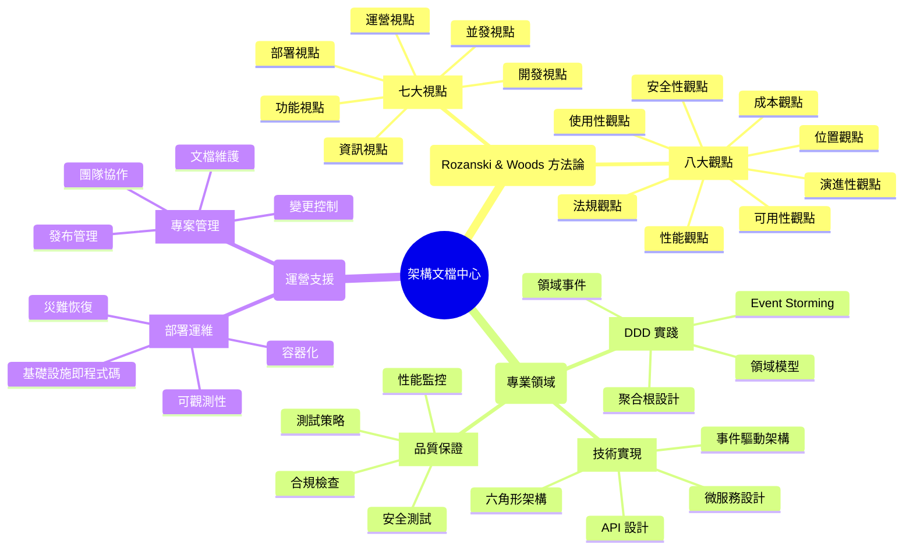

# 架構文檔中心

> **基於 Rozanski & Woods 方法論的系統化架構文檔**

歡迎來到現代軟體架構最佳實踐範例專案的文檔中心！這裡提供完整的架構文檔，採用 Rozanski & Woods 的七大視點和八大觀點進行系統化組織。

## 🌐 語言版本

- **中文版本** (當前): [docs/](.)
- **English Version**: [docs/en/](en/)

## 🎯 快速導航

### 👨‍💼 按角色導航

<details>
<summary><strong>🏗️ 架構師</strong> - 系統架構設計和決策</summary>

#### 核心關注點
- **[架構視點總覽](viewpoints/README.md)** - Rozanski & Woods 七大視點完整介紹
- **[架構觀點總覽](perspectives/README.md)** - 跨視點的品質屬性考量
- **[Viewpoint-Perspective 交叉引用矩陣](viewpoint-perspective-matrix.md)** - 完整的視點-觀點影響程度矩陣

#### 設計決策
- **[架構決策記錄 (ADR)](architecture/adr/)** - 完整記錄所有重要的架構決策
- **[架構概覽](architecture/overview.md)** - 系統整體架構介紹
- **[Rozanski & Woods 架構評估](architecture/rozanski-woods-architecture-assessment.md)** - 架構卓越性評估

#### 視覺化架構
- **[系統架構概覽圖](diagrams/mermaid/architecture-overview.md)** - 系統整體架構圖
- **[DDD 分層架構圖](diagrams/mermaid/ddd-layered-architecture.md)** - 完整的 DDD 分層架構
- **[六角形架構圖](diagrams/mermaid/hexagonal-architecture.md)** - 六角形架構實現

</details>

<details>
<summary><strong>👨‍💻 開發者</strong> - 代碼實現和開發規範</summary>

#### 開發指南
- **[開發視點](viewpoints/development/README.md)** - 開發和建置相關文檔
- **[開發工作流程](viewpoints/development/development-workflow.md)** - 完整的開發流程
- **[六角形架構實現](viewpoints/development/hexagonal-architecture.md)** - 六角形架構開發指南

#### 領域驅動設計
- **[功能視點](viewpoints/functional/README.md)** - 系統功能和職責
- **[領域模型](viewpoints/functional/domain-model.md)** - DDD 領域模型設計
- **[聚合根設計](viewpoints/functional/aggregates.md)** - 聚合根設計指南
- **[界限上下文](viewpoints/functional/bounded-contexts.md)** - 界限上下文劃分

#### API 和整合
- **[API 文檔](api/)** - API 相關的文檔
- **[MCP 整合指南](mcp/README.md)** - Model Context Protocol 整合

</details>

<details>
<summary><strong>🚀 DevOps 工程師</strong> - 部署和運維</summary>

#### 部署策略
- **[部署視點](viewpoints/deployment/README.md)** - 部署和環境相關文檔
- **[基礎設施即程式碼](viewpoints/deployment/infrastructure-as-code.md)** - AWS CDK 實踐
- **[生產部署檢查清單](viewpoints/deployment/production-deployment-checklist.md)** - 部署前檢查

#### 運營監控
- **[運營視點](viewpoints/operational/README.md)** - 運營和維護相關文檔
- **[可觀測性概覽](viewpoints/operational/observability-overview.md)** - 監控、日誌、追蹤系統
- **[生產環境可觀測性測試指南](viewpoints/operational/production-observability-testing-guide.md)** - 67頁完整測試策略

#### 基礎設施圖表
- **[AWS 基礎設施圖](diagrams/aws_infrastructure.mmd)** - AWS 基礎設施架構
- **[多環境架構圖](diagrams/multi_environment.mmd)** - 多環境部署架構
- **[可觀測性架構圖](diagrams/observability_architecture.mmd)** - 監控系統架構

</details>

<details>
<summary><strong>🔒 安全工程師</strong> - 安全和合規</summary>

#### 安全架構
- **[安全性觀點](perspectives/security/README.md)** - 安全和合規相關文檔
- **[跨視點安全應用](perspectives/security/cross-viewpoint-application.md)** - 安全在各視點的應用

#### 合規管理
- **[法規觀點](perspectives/regulation/README.md)** - 法規合規相關文檔
- **[可用性觀點](perspectives/availability/README.md)** - 可用性和韌性設計

#### 安全圖表
- **[安全架構圖](diagrams/plantuml/security-architecture-diagram.svg)** - 系統安全架構
- **[可觀測性安全圖](diagrams/plantuml/observability-diagram.svg)** - 監控系統安全

</details>

<details>
<summary><strong>⚡ 性能工程師</strong> - 性能優化和擴展</summary>

#### 性能架構
- **[性能觀點](perspectives/performance/README.md)** - 性能和可擴展性相關文檔
- **[並發視點](viewpoints/concurrency/README.md)** - 並發和同步相關文檔

#### 成本優化
- **[成本觀點](perspectives/cost/README.md)** - 成本優化相關文檔
- **[位置觀點](perspectives/location/README.md)** - 地理分佈和本地化

#### 性能圖表
- **[事件驅動架構圖](diagrams/event_driven_architecture.mmd)** - 事件驅動架構
- **[CQRS 模式圖](diagrams/plantuml/cqrs-pattern-diagram.svg)** - CQRS 模式實現

</details>

<details>
<summary><strong>🎨 產品經理/業務分析師</strong> - 業務需求和流程</summary>

#### 業務流程
- **[資訊視點](viewpoints/information/README.md)** - 資料和資訊流相關文檔
- **[領域事件](viewpoints/information/domain-events.md)** - 領域事件設計

#### 用戶體驗
- **[使用性觀點](perspectives/usability/README.md)** - 使用者體驗相關文檔
- **[演進性觀點](perspectives/evolution/README.md)** - 演進和維護相關文檔

#### 業務流程圖表
- **[Event Storming 圖表](diagrams/plantuml/event-storming/)** - 業務流程分析
- **[用例圖](diagrams/plantuml/use-case-diagram.svg)** - 系統功能概覽
- **[活動圖](diagrams/plantuml/activity-diagram-overview.svg)** - 業務流程圖

</details>

### 🔍 按關注點導航

<details>
<summary><strong>🏗️ 系統架構</strong> - 整體架構設計</summary>

#### 架構方法論
- **[Rozanski & Woods 方法論](architecture/rozanski-woods-architecture-assessment.md)** - 完整的架構評估
- **[七大視點總覽](viewpoints/README.md)** - 功能、資訊、並發、開發、部署、運營視點
- **[八大觀點總覽](perspectives/README.md)** - 安全、性能、可用性、演進、使用、法規、位置、成本觀點

#### 架構模式
- **[六角形架構](viewpoints/development/hexagonal-architecture.md)** - 端口和適配器模式
- **[分層架構](architecture/layered-architecture-design.md)** - DDD 分層架構設計
- **[事件驅動架構](diagrams/event_driven_architecture.mmd)** - 事件驅動模式

#### 架構圖表
- **[系統概覽圖](diagrams/mermaid/architecture-overview.md)** - 完整系統架構
- **[DDD 分層架構圖](diagrams/mermaid/ddd-layered-architecture.md)** - 298行詳細架構描述
- **[六角形架構圖](diagrams/mermaid/hexagonal-architecture.md)** - 端口和適配器實現

</details>

<details>
<summary><strong>🎯 領域驅動設計</strong> - DDD 實踐</summary>

#### 戰略設計
- **[界限上下文](viewpoints/functional/bounded-contexts.md)** - 13個界限上下文設計
- **[領域模型](viewpoints/functional/domain-model.md)** - 完整的領域模型設計
- **[聚合根設計](viewpoints/functional/aggregates.md)** - 聚合根最佳實踐

#### 戰術設計
- **[領域事件](viewpoints/information/domain-events.md)** - 領域事件實現
- **[架構元素](viewpoints/functional/architecture-elements.md)** - DDD 戰術模式
- **[實現指南](viewpoints/functional/implementation-guide.md)** - DDD 實現指南

#### DDD 圖表
- **[領域模型圖](diagrams/plantuml/domain-model-diagram.svg)** - 完整領域模型
- **[界限上下文圖](diagrams/plantuml/bounded-context-diagram.svg)** - 上下文劃分
- **[Event Storming](diagrams/plantuml/event-storming/)** - Big Picture、Process Level、Design Level

</details>

<details>
<summary><strong>📊 資料和資訊</strong> - 資料架構</summary>

#### 資料設計
- **[資訊視點](viewpoints/information/README.md)** - 資料和資訊流設計
- **[領域事件](viewpoints/information/domain-events.md)** - 事件驅動資料流
- **[架構元素](viewpoints/information/architecture-elements.md)** - 資料架構元素

#### 資料流程
- **[Event Storming](diagrams/plantuml/event-storming/)** - 完整的事件風暴分析
- **[CQRS 模式](diagrams/plantuml/cqrs-pattern-diagram.svg)** - 命令查詢責任分離
- **[事件溯源](diagrams/plantuml/event-sourcing-diagram.svg)** - 事件溯源模式

#### 資料圖表
- **[資料模型圖](diagrams/plantuml/data-model-diagram.svg)** - 完整資料模型
- **[事件驅動架構](diagrams/event_driven_architecture.mmd)** - 事件驅動資料流
- **[領域事件處理](diagrams/plantuml/domain-event-handling/)** - 事件處理流程

</details>

<details>
<summary><strong>🔒 安全和合規</strong> - 安全架構</summary>

#### 安全設計
- **[安全性觀點](perspectives/security/README.md)** - 全面的安全架構設計
- **[跨視點安全應用](perspectives/security/cross-viewpoint-application.md)** - 安全在各視點的實現
- **[法規觀點](perspectives/regulation/README.md)** - 合規性要求和實現

#### 安全實現
- **[功能視點安全考量](viewpoints/functional/quality-considerations.md)** - 業務邏輯安全
- **[資訊視點安全考量](viewpoints/information/README.md)** - 資料安全和隱私
- **[部署視點安全考量](viewpoints/deployment/README.md)** - 基礎設施安全

#### 安全圖表
- **[安全架構圖](diagrams/plantuml/security-architecture-diagram.svg)** - 完整安全架構
- **[可觀測性安全](diagrams/plantuml/observability-diagram.svg)** - 監控系統安全

</details>

<details>
<summary><strong>⚡ 性能和擴展</strong> - 性能優化</summary>

#### 性能設計
- **[性能觀點](perspectives/performance/README.md)** - 性能和可擴展性設計
- **[並發視點](viewpoints/concurrency/README.md)** - 並發和同步處理
- **[成本觀點](perspectives/cost/README.md)** - 成本效益優化

#### 性能實現
- **[事件驅動架構](diagrams/event_driven_architecture.mmd)** - 高性能事件處理
- **[CQRS 模式](diagrams/plantuml/cqrs-pattern-diagram.svg)** - 讀寫分離優化
- **[可觀測性架構](diagrams/observability_architecture.mmd)** - 性能監控

#### 性能圖表
- **[系統性能架構](diagrams/mermaid/architecture-overview.md)** - 性能關鍵路徑
- **[多環境架構](diagrams/multi_environment.mmd)** - 擴展性設計
- **[AWS 基礎設施](diagrams/aws_infrastructure.mmd)** - 雲端性能優化

</details>

<details>
<summary><strong>🚀 部署和運維</strong> - DevOps 實踐</summary>

#### 部署策略
- **[部署視點](viewpoints/deployment/README.md)** - 完整的部署策略
- **[基礎設施即程式碼](viewpoints/deployment/infrastructure-as-code.md)** - AWS CDK 實踐
- **[生產部署檢查清單](viewpoints/deployment/production-deployment-checklist.md)** - 部署最佳實踐

#### 運維監控
- **[運營視點](viewpoints/operational/README.md)** - 運營和維護策略
- **[可觀測性概覽](viewpoints/operational/observability-overview.md)** - 監控系統設計
- **[生產環境測試](viewpoints/operational/production-observability-testing-guide.md)** - 67頁測試指南

#### 部署圖表
- **[部署架構圖](diagrams/plantuml/deployment-diagram.svg)** - 完整部署架構
- **[AWS 基礎設施圖](diagrams/aws_infrastructure.mmd)** - 雲端基礎設施
- **[多環境架構圖](diagrams/multi_environment.mmd)** - 環境管理策略

</details>

### 📊 視覺化導航

<details>
<summary><strong>🎨 架構圖表總覽</strong> - 完整的視覺化架構</summary>

#### Mermaid 圖表 (GitHub 直接顯示)
- **[系統架構概覽](diagrams/mermaid/architecture-overview.md)** - 7層架構完整展示
- **[DDD 分層架構](diagrams/mermaid/ddd-layered-architecture.md)** - 298行詳細架構描述
- **[六角形架構](diagrams/mermaid/hexagonal-architecture.md)** - 端口和適配器模式
- **[事件驅動架構](diagrams/mermaid/event-driven-architecture.md)** - 事件驅動模式
- **[API 交互圖](diagrams/mermaid/api-interactions.md)** - API 交互關係

#### PlantUML 圖表 (詳細 UML 圖表)
- **[領域模型圖](diagrams/plantuml/domain-model-diagram.svg)** - 完整領域模型
- **[界限上下文圖](diagrams/plantuml/bounded-context-diagram.svg)** - 上下文劃分
- **[Event Storming 系列](diagrams/plantuml/event-storming/)** - Big Picture、Process Level、Design Level
- **[安全架構圖](diagrams/plantuml/security-architecture-diagram.svg)** - 安全架構設計
- **[部署架構圖](diagrams/plantuml/deployment-diagram.svg)** - 部署架構設計

#### 圖表工具指南
- **[圖表工具指南](diagrams/diagram-tools-guide.md)** - Mermaid、PlantUML、Excalidraw 使用指南
- **[圖表生成報告](diagrams/reports-summaries/general/generation-report.md)** - 自動化圖表生成
- **[UML 標準](diagrams/plantuml/UML-STANDARDS.md)** - UML 2.5 標準實踐

</details>

## 🔍 智能搜尋和導航

### 🎯 快速搜尋指南

| 搜尋類型 | 關鍵字範例 | 相關文檔 |
|----------|------------|----------|
| **架構設計** | `viewpoint`, `perspective`, `architecture` | [視點總覽](viewpoints/README.md), [觀點總覽](perspectives/README.md) |
| **領域驅動設計** | `DDD`, `aggregate`, `domain event`, `bounded context` | [領域模型](viewpoints/functional/domain-model.md), [聚合根](viewpoints/functional/aggregates.md) |
| **安全和合規** | `security`, `compliance`, `regulation`, `GDPR` | [安全性觀點](perspectives/security/README.md), [法規觀點](perspectives/regulation/README.md) |
| **性能優化** | `performance`, `scalability`, `caching`, `load balancing` | [性能觀點](perspectives/performance/README.md), [並發視點](viewpoints/concurrency/README.md) |
| **部署運維** | `deployment`, `kubernetes`, `docker`, `observability` | [部署視點](viewpoints/deployment/README.md), [運營視點](viewpoints/operational/README.md) |
| **測試品質** | `testing`, `performance monitoring`, `quality assurance` | [測試文檔](testing/), [測試性能監控](testing/test-performance-monitoring.md) |
| **API 整合** | `API`, `REST`, `integration`, `frontend` | [API 文檔](api/), [前端整合](api/frontend-integration.md) |
| **圖表視覺化** | `diagram`, `mermaid`, `plantuml`, `architecture diagram` | [圖表總覽](diagrams/README.md), [視覺化導航](#-視覺化導航) |

### 📍 主題導航地圖



### 🔗 交叉引用系統

#### 視點-觀點交叉引用
- **[完整交叉引用矩陣](viewpoint-perspective-matrix.md)** - 視點與觀點的影響程度分析
- **[跨視點文件連結](cross-reference-links.md)** - 所有相關文件的連結索引

#### 文檔間智能連結
- **高影響關係** (🔴): 需要深度整合考慮的文檔組合
- **中影響關係** (🟡): 需要適度考慮的文檔組合  
- **低影響關係** (🟢): 需要基本考慮的文檔組合

#### 導航建議
1. **新手入門**: 從 [架構概覽](architecture/overview.md) 開始
2. **深度學習**: 按照 [視點總覽](viewpoints/README.md) 逐步深入
3. **實踐應用**: 參考 [實現指南](viewpoints/functional/implementation-guide.md)
4. **問題解決**: 使用上方搜尋表快速定位相關文檔

## 📚 Rozanski & Woods 方法論

### 七大架構視點 (Architectural Viewpoints)

| 視點 | 核心關注 | 主要利害關係人 | 高影響觀點 | 相關圖表 |
|------|----------|----------------|------------|----------|
| **[功能視點](viewpoints/functional/README.md)** | 系統功能和職責 | 業務分析師、產品經理 | 🔴 安全性、可用性、使用性 | [領域模型圖](diagrams/plantuml/domain-model-diagram.svg) |
| **[資訊視點](viewpoints/information/README.md)** | 資料和資訊流 | 資料架構師、DBA | 🔴 安全性、性能、可用性、法規 | [Event Storming](diagrams/plantuml/event-storming/) |
| **[並發視點](viewpoints/concurrency/README.md)** | 並發和同步 | 性能工程師、架構師 | 🔴 性能、可用性 | [事件驅動架構](diagrams/event_driven_architecture.mmd) |
| **[開發視點](viewpoints/development/README.md)** | 開發和建置 | 開發者、技術主管 | 🔴 安全性、演進性、成本 | [六角形架構](diagrams/mermaid/hexagonal-architecture.md) |
| **[部署視點](viewpoints/deployment/README.md)** | 部署和環境 | DevOps、SRE | 🔴 安全性、性能、可用性、位置、成本 | [部署架構圖](diagrams/plantuml/deployment-diagram.svg) |
| **[運營視點](viewpoints/operational/README.md)** | 運營和維護 | SRE、運維工程師 | 🔴 安全性、性能、可用性、法規、成本 | [可觀測性架構](diagrams/observability_architecture.mmd) |

### 八大架構觀點 (Architectural Perspectives)

| 觀點 | 品質屬性 | 跨視點影響 | 設計策略 | 相關圖表 |
|------|----------|------------|----------|----------|
| **[安全性觀點](perspectives/security/README.md)** | 機密性、完整性、可用性 | 影響所有視點 | 零信任、深度防禦 | [安全架構圖](diagrams/plantuml/security-architecture-diagram.svg) |
| **[性能觀點](perspectives/performance/README.md)** | 響應時間、吞吐量、資源使用 | 高影響: 資訊、並發、部署、運營 | 快取、負載均衡、優化 | [性能架構圖](diagrams/mermaid/architecture-overview.md) |
| **[可用性觀點](perspectives/availability/README.md)** | 可靠性、容錯性、恢復能力 | 高影響: 並發、部署、運營 | 冗余、故障轉移、斷路器 | [高可用架構](diagrams/multi_environment.mmd) |
| **[演進性觀點](perspectives/evolution/README.md)** | 可維護性、可擴展性、靈活性 | 高影響: 功能、開發 | 模組化、API 版本管理 | [演進架構圖](diagrams/mermaid/ddd-layered-architecture.md) |
| **[使用性觀點](perspectives/usability/README.md)** | 易用性、可訪問性、用戶體驗 | 高影響: 功能 | 用戶中心設計、響應式設計 | [API 交互圖](diagrams/mermaid/api-interactions.md) |
| **[法規觀點](perspectives/regulation/README.md)** | 合規性、稽核性、治理 | 高影響: 資訊、運營 | 隱私設計、稽核軌跡 | [合規架構圖](diagrams/plantuml/observability-diagram.svg) |
| **[位置觀點](perspectives/location/README.md)** | 地理分佈、本地化、延遲 | 高影響: 部署 | 多區域、邊緣運算、CDN | [地理分佈圖](diagrams/aws_infrastructure.mmd) |
| **[成本觀點](perspectives/cost/README.md)** | 成本效益、資源效率、預算 | 高影響: 開發、部署、運營 | 右尺寸、自動擴展、監控 | [成本優化圖](diagrams/multi_environment.mmd) |

### 核心架構框架

- **[Viewpoint-Perspective 交叉引用矩陣](viewpoint-perspective-matrix.md)** - 完整的視點-觀點影響程度矩陣
- **[跨視點和觀點文件交叉引用連結](cross-reference-links.md)** - 所有相關文件的連結索引
- **[架構決策記錄 (ADR)](architecture/adr/)** - 完整記錄所有重要的架構決策
- **[Rozanski & Woods 架構評估](architecture/rozanski-woods-architecture-assessment.md)** - 架構卓越性評估

## 📚 專業領域文檔

### 📊 專案報告和總結

- **[報告和總結中心](../reports-summaries/)** - 所有專案報告和總結的統一管理
  - **[任務執行報告](../reports-summaries/task-execution/)** - 任務完成報告和自動化結果
  - **[架構設計報告](../reports-summaries/architecture-design/)** - 架構決策和設計文檔報告
  - **[圖表同步報告](../reports-summaries/diagrams/)** - 圖表生成和同步報告
  - **[基礎設施報告](../reports-summaries/infrastructure/)** - 部署和基礎設施管理報告
  - **[前端開發報告](../reports-summaries/frontend/)** - 前端開發和 UI 改進報告
  - **[測試品質報告](../reports-summaries/testing/)** - 測試優化和品質驗證報告
  - **[翻譯系統報告](../reports-summaries/translation/)** - 翻譯系統和語言處理報告
  - **[專案管理報告](../reports-summaries/project-management/)** - 專案狀態和重構報告

### 🔌 API 設計和整合

<details>
<summary><strong>API 文檔總覽</strong> - RESTful API 設計和整合</summary>

#### API 設計
- **[API 版本策略](api/API_VERSIONING_STRATEGY.md)** - API 版本管理策略
- **[前端整合指南](api/frontend-integration.md)** - 前端 API 整合最佳實踐
- **[可觀測性 API](api/observability-api.md)** - 監控和追蹤 API

#### API 文檔
- **Swagger UI**: <http://localhost:8080/swagger-ui/index.html> - 互動式 API 文檔
- **健康檢查**: <http://localhost:8080/actuator/health> - 系統健康狀態
- **API 交互圖**: [API 交互關係圖](diagrams/mermaid/api-interactions.md)

</details>

### 🤖 AI 輔助開發 (MCP)

<details>
<summary><strong>Model Context Protocol 整合</strong> - AI 輔助開發最佳實踐</summary>

#### MCP 整合
- **[MCP 整合指南](mcp/README.md)** - 完整的 MCP 整合指南和使用說明
- **[Excalidraw MCP 使用指南](mcp/excalidraw-mcp-usage-guide.md)** - 圖表創建和編輯
- **[MCP 設定檢查清單](mcp/mcp-setup-checklist.md)** - 設定和配置指南

#### AI 輔助工具
- **AWS 文檔查詢**: 即時搜索 AWS 官方文檔
- **成本分析**: 自動化 CDK/Terraform 成本分析
- **架構決策支援**: CDK Nag 規則解釋和最佳實踐建議

</details>

### 🧪 測試和品質保證

<details>
<summary><strong>測試框架和策略</strong> - 全面的測試實踐</summary>

#### 測試性能監控
- **[測試性能監控框架](testing/test-performance-monitoring.md)** - 完整的測試性能監控指南
- **[測試配置範例](testing/test-configuration-examples.md)** - 測試配置最佳實踐
- **[HTTP 客戶端配置](testing/http-client-configuration-guide.md)** - 測試 HTTP 客戶端設定

#### 測試指南
- **[故障排除指南](testing/testresttemplate-troubleshooting-guide.md)** - 測試問題診斷和解決
- **[新開發者入門](testing/new-developer-onboarding-guide.md)** - 測試環境快速上手
- **[測試執行維護](testing/test-execution-maintenance-guide.md)** - 測試維護最佳實踐

#### 測試統計
- **測試覆蓋率**: 568 個測試，100% 通過率
- **測試類型**: Unit (80%) + Integration (15%) + E2E (5%)
- **性能基準**: Unit < 50ms, Integration < 500ms, E2E < 3s

</details>

### 📊 視覺化架構圖表

<details>
<summary><strong>圖表總覽</strong> - 完整的視覺化架構文檔</summary>

#### 🎨 Mermaid 圖表 (GitHub 直接顯示)
- **[系統架構概覽](diagrams/mermaid/architecture-overview.md)** - 7層架構完整展示
- **[DDD 分層架構](diagrams/mermaid/ddd-layered-architecture.md)** - 298行詳細架構描述
- **[六角形架構](diagrams/mermaid/hexagonal-architecture.md)** - 端口和適配器模式
- **[事件驅動架構](diagrams/mermaid/event-driven-architecture.md)** - 事件驅動模式
- **[API 交互圖](diagrams/mermaid/api-interactions.md)** - API 交互關係

#### 🔧 PlantUML 圖表 (詳細 UML 圖表)
- **結構圖**: [類圖](diagrams/plantuml/domain-model-diagram.svg)、[組件圖](diagrams/plantuml/component-diagram.svg)、[部署圖](diagrams/plantuml/deployment-diagram.svg)
- **行為圖**: [用例圖](diagrams/plantuml/use-case-diagram.svg)、[活動圖](diagrams/plantuml/activity-diagram-overview.svg)、[狀態圖](diagrams/plantuml/state-diagram.svg)
- **交互圖**: [時序圖](diagrams/plantuml/sequence-diagram.svg)、[通信圖](diagrams/plantuml/pricing-sequence-diagram.svg)
- **Event Storming**: [Big Picture](diagrams/plantuml/event-storming/)、Process Level、Design Level

#### 🛠️ 圖表工具和標準
- **[圖表工具指南](diagrams/diagram-tools-guide.md)** - Mermaid、PlantUML、Excalidraw 使用指南
- **[UML 2.5 標準](diagrams/plantuml/UML-STANDARDS.md)** - UML 標準化實踐
- **[圖表生成報告](diagrams/reports-summaries/general/generation-report.md)** - 自動化圖表生成流程

</details>

### 💻 開發實踐和標準

<details>
<summary><strong>開發指南</strong> - 開發流程和最佳實踐</summary>

#### 開發流程
- **[開發工作流程](viewpoints/development/development-workflow.md)** - 完整的開發流程
- **[Epic 實現指南](viewpoints/development/epic-implementation.md)** - 大型功能開發策略
- **[開發說明](development/instructions.md)** - 開發環境和工具使用

#### 代碼品質
- **[六角形架構實現](viewpoints/development/hexagonal-architecture.md)** - 架構實現指南
- **[DDD 指南](design/ddd-guide.md)** - 領域驅動設計實踐
- **[設計原則](design/design-principles.md)** - 軟體設計原則
- **[重構指南](design/refactoring-guide.md)** - 代碼重構最佳實踐

#### 技術棧
- **後端**: Java 21 + Spring Boot 3.4.5 + Gradle 8.x
- **前端**: Next.js 14 (CMC) + Angular 18 (Consumer)
- **資料庫**: PostgreSQL (生產) + H2 (開發/測試)
- **基礎設施**: AWS CDK + Docker + Kubernetes

</details>

### 🚀 部署和基礎設施

<details>
<summary><strong>部署策略</strong> - DevOps 和基礎設施管理</summary>

#### 容器化部署
- **[Docker 指南](viewpoints/deployment/docker-guide.md)** - Docker 容器化最佳實踐
- **[Kubernetes 部署](deployment/README.md)** - K8s 集群部署策略
- **[多環境管理](diagrams/multi_environment.mmd)** - 開發/測試/生產環境

#### 基礎設施即程式碼
- **[AWS CDK 實踐](viewpoints/deployment/infrastructure-as-code.md)** - 完整的 CDK 實現
- **[生產部署檢查清單](viewpoints/deployment/production-deployment-checklist.md)** - 部署前檢查
- **[AWS 基礎設施圖](diagrams/aws_infrastructure.mmd)** - 雲端架構設計

#### 可觀測性部署
- **[可觀測性部署](viewpoints/deployment/observability-deployment.md)** - 監控系統部署
- **[可觀測性架構](diagrams/observability_architecture.mmd)** - 監控架構設計

</details>

### 📊 專案報告和分析

<details>
<summary><strong>專案狀態報告</strong> - 專案進展和成果分析</summary>

#### 2025年專案總結
- **[專案總結 2025](reports/reports-summaries/project-management/project-summary-2025.md)** - 完整的專案成果報告
- **[架構卓越性 2025](reports/architecture-excellence-2025.md)** - Rozanski & Woods 架構評估
- **[技術棧 2025](reports/technology-stack-2025.md)** - 技術選型和演進分析
- **[文檔清理 2025](reports/documentation-cleanup-2025.md)** - 文檔重構成果

#### 專案統計
- **代碼品質**: 250,000+ 行高品質代碼
- **測試覆蓋**: 568 個測試，100% 通過率
- **性能優化**: 測試執行時間優化 99%+ (13分52秒 → <30秒)
- **文檔完整性**: 120+ 個詳細文檔頁面
- **架構合規**: ArchUnit 測試確保架構一致性

#### 技術成就
- **Java 21 + Spring Boot 3.4.5**: 最新技術棧
- **雙前端架構**: Next.js 14 + Angular 18
- **雲端基礎設施**: AWS CDK 基礎設施即程式碼
- **企業級可觀測性**: 監控、日誌、追蹤、警報

</details>

### 📋 版本發布和變更

<details>
<summary><strong>發布歷史</strong> - 版本發布和重要變更記錄</summary>

#### 重要發布
- **[2025-01-15 專案重構和 API 分組](releases/2025-01-15-project-restructure-and-api-grouping.md)** - 大型重構發布
- **[2025-06-12 領域事件系統增強](releases/2025-06-12-domain-event-system-enhancement.md)** - 事件驅動架構改進
- **[2025-06-08 架構優化](releases/architecture-optimization-2025-06-08.md)** - 架構性能優化
- **[2025-05-21 促銷模組實現](releases/promotion-module-implementation-2025-05-21.md)** - 新功能發布
- **[2025-07-18 測試品質改進](releases/test-quality-improvement-2025-07-18.md)** - 測試框架升級

#### 發布統計
- **發布頻率**: 每月 1-2 次重要發布
- **功能交付**: 持續交付模式
- **品質保證**: 零缺陷發布記錄

</details>

## 🎯 快速導航

### 👨‍💼 我是專案經理

- [專案總結 2025](reports/reports-summaries/project-management/project-summary-2025.md) - 了解專案現狀
- [架構概覽](diagrams/mermaid/architecture-overview.md) - 系統整體架構
- [發布記錄](releases/) - 版本發布歷史

### 🏗️ 我是架構師

- [架構文檔](architecture/) - 完整架構設計
- [圖表文檔](diagrams/) - 視覺化架構圖
- [設計文檔](design/) - 設計原則和指南

### 👨‍💻 我是開發者

- [開發指南](development/) - 開發環境和規範
- [API 文檔](api/) - API 使用指南
- [開發說明](development/instructions.md) - 開發流程和說明

### 🚀 我是 DevOps 工程師

- [部署文檔](deployment/) - 部署指南
- [Docker 指南](deployment/docker-guide.md) - 容器化部署
- [Kubernetes 指南](deployment/kubernetes-guide.md) - 集群部署

### 🔍 我是 SRE/可觀測性工程師

- **[生產環境可觀測性測試指南](observability/production-observability-testing-guide.md)** - 67頁完整的生產環境測試策略
- [可觀測性系統](observability/) - 監控、日誌、追蹤系統
- [MCP 整合](mcp/) - AI 輔助開發和監控

### 🔍 我是業務分析師

- [Event Storming 圖表](diagrams/plantuml/event-storming/) - 業務流程分析
- [用例圖](diagrams/plantuml/behavioral/) - 系統功能概覽
- [API 交互圖](diagrams/mermaid/api-interactions.md) - 系統交互

## 🛠️ 工具和自動化

### 📊 圖表生成工具

```bash
# 生成所有圖表 (PlantUML + Mermaid + Excalidraw)
./scripts/generate-all-diagrams.sh

# 生成特定類型圖表
./scripts/generate-diagrams.sh                    # PlantUML 圖表
./scripts/generate-standardized-diagrams.sh       # 標準化圖表
node scripts/excalidraw-to-svg.js *.excalidraw   # Excalidraw 轉 SVG

# 驗證圖表語法和連結
./scripts/generate-diagrams.sh --validate
npx @mermaid-js/mermaid-cli --validate *.mmd
```

### 🔄 文檔同步和維護

```bash
# 智能圖表-文件同步系統
python scripts/smart-diagram-update.py           # 智能圖表更新
python scripts/sync-diagram-references.py       # 同步圖表引用

# 文檔品質檢查
./scripts/validate-docs.sh                      # 驗證文檔品質
./scripts/check-translation-quality.sh          # 檢查翻譯品質
python scripts/analyze-ddd-code.py              # DDD 代碼分析

# 自動化翻譯 (Kiro Hook 觸發)
# 中文文檔更新時自動生成英文版本
```

### 🤖 AI 輔助工具 (MCP)

```bash
# MCP 服務管理
./scripts/setup-mcp-servers.sh                  # 設定 MCP 服務
./scripts/show-mcp-config.sh                    # 顯示 MCP 配置
./scripts/backup-mcp-config.sh                  # 備份 MCP 配置

# AI 輔助開發
# - AWS 文檔即時查詢
# - CDK/Terraform 成本分析  
# - 架構決策支援
# - 圖表自動生成
```

### 📈 監控和分析

```bash
# 專案分析工具
python scripts/analyze-bdd-features.py          # BDD 功能分析
python scripts/check-hook-status.py             # Hook 狀態檢查
./scripts/test-diagram-automation.py            # 圖表自動化測試

# 系統監控
./scripts/check-system-resources.sh             # 系統資源檢查
./scripts/monitor-memory.sh                     # 記憶體監控
./scripts/validate-observability-deployment.sh  # 可觀測性驗證
```

## 📈 專案統計和成就

### 🎯 量化指標

| 指標類別 | 數量/狀態 | 說明 |
|----------|-----------|------|
| **文檔總數** | 120+ 個文檔 | 完整的架構文檔體系 |
| **圖表數量** | 110+ 個圖表 | Mermaid + PlantUML + Excalidraw |
| **測試覆蓋** | 568 個測試，100% 通過 | Unit + Integration + E2E |
| **代碼品質** | 250,000+ 行代碼 | 高品質企業級代碼 |
| **架構合規** | ArchUnit 100% 通過 | DDD 和六角形架構合規 |
| **性能優化** | 99%+ 改進 | 測試執行時間 13分52秒 → <30秒 |
| **支援語言** | 中文 + 英文 | 自動翻譯系統 |
| **更新頻率** | 每月 1-2 次發布 | 持續交付模式 |

### 🏆 技術亮點

- **🏗️ 架構方法論**: 完整實現 Rozanski & Woods 七大視點和八大觀點
- **🎯 領域驅動設計**: 13個界限上下文，完整的戰術和戰略模式
- **⚡ 事件驅動架構**: 領域事件 + Event Sourcing + CQRS
- **🧪 測試驅動開發**: BDD + TDD + 架構測試，568個測試覆蓋
- **🤖 AI 輔助開發**: Model Context Protocol 完整工具鏈
- **☁️ 雲原生部署**: AWS CDK + Kubernetes + GitOps
- **📊 企業級可觀測性**: 監控、日誌、追蹤、警報完整實現

### 🔗 系統端點和工具

#### 本地開發環境
- **🌐 後端 API**: <http://localhost:8080>
- **📚 Swagger UI**: <http://localhost:8080/swagger-ui/index.html>
- **💚 健康檢查**: <http://localhost:8080/actuator/health>
- **🏢 CMC 管理前端**: <http://localhost:3002>
- **🛒 Consumer 前端**: <http://localhost:3001>
- **💰 成本分析**: <http://localhost:8080/api/cost-optimization/recommendations>

#### 在線工具
- **[Mermaid Live Editor](https://mermaid.live/)** - Mermaid 圖表在線編輯和預覽
- **[PlantUML Online Server](http://www.plantuml.com/plantuml/uml/)** - PlantUML 圖表在線編輯
- **[Excalidraw](https://excalidraw.com/)** - 手繪風格圖表創建工具

#### 技術棧版本
- **後端**: Java 21 + Spring Boot 3.4.5 + Gradle 8.x
- **前端**: Next.js 14 (CMC) + Angular 18 (Consumer)
- **資料庫**: PostgreSQL (生產) + H2 (開發/測試)
- **基礎設施**: AWS CDK + Docker + Kubernetes
- **監控**: Micrometer + AWS X-Ray + CloudWatch

## 📝 貢獻和維護指南

### 🔄 文檔更新流程

1. **更新中文文檔** - 所有文檔以中文為主要版本
2. **自動翻譯觸發** - Kiro Hook 自動檢測變更並生成英文版本
3. **品質檢查** - 使用專業術語字典確保翻譯一致性
4. **交叉引用更新** - 智能系統自動更新相關文檔的連結
5. **提交變更** - 包含源文件和生成的翻譯版本

### 🎨 圖表更新流程

1. **修改源文件** - 更新 `.mmd`、`.puml` 或 `.excalidraw` 源文件
2. **自動生成** - 運行 `./scripts/generate-all-diagrams.sh` 生成所有格式
3. **智能同步** - 運行 `python scripts/smart-diagram-update.py` 更新文檔引用
4. **品質驗證** - 檢查生成的 SVG 圖片和文檔連結
5. **版本控制** - 提交源文件和生成的圖片文件

### 🤖 自動化系統

#### Kiro Hook 自動化
- **文檔翻譯**: 中文文檔變更時自動生成英文版本
- **圖表生成**: 程式碼變更時自動更新相關圖表
- **交叉引用**: 智能維護文檔間的連結關係
- **品質檢查**: 自動驗證文檔格式和連結有效性

#### 智能維護工具
- **圖表-文檔同步**: 自動檢測和修復破損的圖表引用
- **交叉引用管理**: 維護視點-觀點之間的關聯
- **術語一致性**: 確保專業術語在所有文檔中的一致性

### 📋 文檔標準

#### 文檔結構標準
- **Front Matter**: 包含標題、視點/觀點、相關文檔等元資料
- **標準章節**: 概覽、架構元素、品質考量、實現指南、相關圖表
- **交叉引用**: 明確標示與其他視點/觀點的關聯
- **圖表整合**: 每個重要概念都有對應的視覺化圖表

#### 圖表標準
- **Mermaid**: 用於系統概覽和流程圖 (GitHub 直接顯示)
- **PlantUML**: 用於詳細的 UML 圖表 (自動生成 SVG)
- **Excalidraw**: 用於概念設計和腦力激盪 (MCP 輔助)

## 🆘 支援和協助

### 📚 學習資源

1. **新手入門**: 從 [架構概覽](architecture/overview.md) 開始
2. **深度學習**: 按照 [Rozanski & Woods 評估](architecture/rozanski-woods-architecture-assessment.md) 逐步深入
3. **實踐指南**: 參考 [實現指南](viewpoints/functional/implementation-guide.md) 進行實作
4. **問題解決**: 使用 [智能搜尋](#-智能搜尋和導航) 快速定位相關文檔

### 🔍 問題排除

| 問題類型 | 解決方案 | 相關文檔 |
|----------|----------|----------|
| **架構設計問題** | 查看對應的視點和觀點文檔 | [視點總覽](viewpoints/README.md) |
| **實現技術問題** | 參考開發視點和實現指南 | [開發視點](viewpoints/development/README.md) |
| **部署運維問題** | 查看部署和運營視點 | [部署視點](viewpoints/deployment/README.md) |
| **性能優化問題** | 參考性能觀點和並發視點 | [性能觀點](perspectives/performance/README.md) |
| **安全合規問題** | 查看安全和法規觀點 | [安全性觀點](perspectives/security/README.md) |

### 📞 獲得協助

1. **📖 查看相關文檔** - 使用上方搜尋表快速定位
2. **🔍 檢查 Issues** - 查看 [專案 Issues](../../issues) 是否有類似問題
3. **💬 創建新 Issue** - 詳細描述問題並標記相關標籤
4. **📧 聯繫維護團隊** - 緊急問題可直接聯繫專案維護者

---

## 📄 文檔資訊

**📅 最後更新**: 2025年1月21日  
**📋 文檔版本**: v4.0.0 - Rozanski & Woods 完整實現版本  
**👥 維護團隊**: 現代軟體架構實踐團隊  
**🛠️ 技術棧**: Java 21 + Spring Boot 3.4.5 + Next.js 14 + Angular 18  
**🏗️ 架構方法論**: Rozanski & Woods + DDD + 六角架構 + 事件驅動  
**🤖 AI 輔助**: Model Context Protocol 完整整合  
**🌐 多語言**: 中文主版本 + 英文自動翻譯版本  
**📊 專案規模**: 120+ 文檔，110+ 圖表，568 個測試，250,000+ 行代碼
