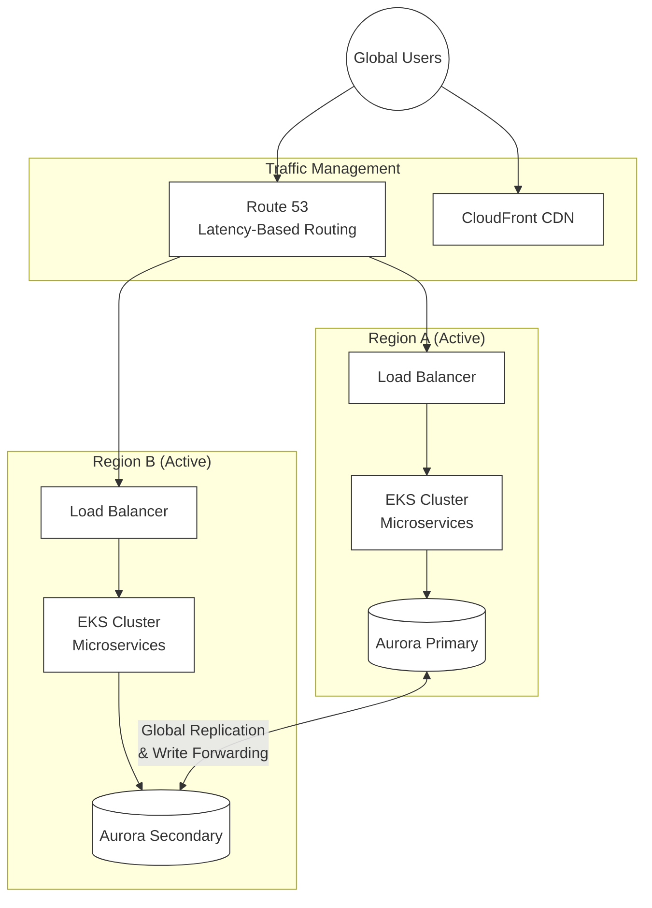

# Enterprise E-Commerce Platform

> **Engineering for Digital Resilience**: A cloud-native, active-active e-commerce platform designed for 99.99% availability.

This documentation details the architecture, development, and operation of the platform. It goes beyond standard documentation by demonstrating how **Digital Resilience** is achieved not through dogmatic methodology, but by rigorously addressing the system from multiple architectural dimensions (Viewpoints) and quality attributes (Perspectives).

## 🏗️ System Overview

The platform is built on a **Hexagonal Architecture** using **Domain-Driven Design (DDD)** principles, deployed as microservices on **AWS**.

### High-Level Architecture



### Technology Stack
- **Core**: Java 21, Spring Boot 3.4, Gradle
- **Frontend**: Next.js 14, React 18, TypeScript
- **Data**: PostgreSQL (Aurora Global), Redis (Global Datastore), Kafka (MSK)
- **Infrastructure**: AWS EKS, CDK (IaC), Multi-Region Active-Active

## 🛡️ Engineering Digital Resilience

Building a resilient system requires more than just "high availability" infrastructure. We approach resilience through distinct architectural lenses:

### 1. Functional Isolation (The "What")
By applying **Domain-Driven Design**, we isolate failures to specific Bounded Contexts. A failure in the *Review* context never crashes the *Checkout* process.
- **[Functional Viewpoint](viewpoints/functional/README.md)**: See how we decouple business capabilities.
- **[Context Viewpoint](viewpoints/context/README.md)**: Understand system boundaries and integration points.

### 2. Physical Redundancy (The "Where")
Resilience requires physical separation. We utilize a **Multi-Region Active-Active** strategy to survive entire region failures.
- **[Deployment Viewpoint](viewpoints/deployment/README.md)**: Explore the EKS and Global Database infrastructure.
- **[Infrastructure Deep Dive](perspectives/availability/digital-resilience.md)**: Read the technical analysis of our 99.99% architecture.

### 3. Operational Maturity (The "How")
Resilience is sustained through rigorous operations—automated failover, chaos engineering, and comprehensive observability.
- **[Operational Viewpoint](viewpoints/operational/README.md)**: See our backup, monitoring, and incident response procedures.
- **[Backup & Recovery](viewpoints/operational/backup-and-recovery-comprehensive.md)**: Our consolidated guide to data safety.

### 4. Quality Assurance (The "How Well")
Cross-cutting concerns ensure that resilience is baked into every component, not bolted on.
- **[Availability Perspective](perspectives/availability/README.md)**: The core resilience strategy.
- **[Security Perspective](perspectives/security/README.md)**: Ensuring resilience against attacks.
- **[Performance Perspective](perspectives/performance/README.md)**: Ensuring resilience under load.

---

## 🚀 Quick Start

### Common Tasks

- **New to the project?** Start with [Getting Started](viewpoints/development/getting-started/README.md)
- **Setting up locally?** See [Local Environment Setup](viewpoints/development/setup/local-environment.md)
- **Looking for APIs?** Check [API Documentation](api/README.md)
- **Need to deploy?** See [Deployment Guide](viewpoints/operational/deployment/deployment-process.md)
- **Reviewing documentation?** See [Stakeholder Review Plan](STAKEHOLDER-REVIEW-PLAN.md)
- **Contributing docs?** Read [Style Guide](STYLE-GUIDE.md) and [Maintenance Guide](MAINTENANCE.md)

### Quick Links by Role

| Role | Primary Documentation | Quick Actions |
|------|----------------------|---------------|
| **Developer** | [Development Viewpoint](viewpoints/development/README.md) | [Setup](viewpoints/development/setup/README.md) • [Testing](viewpoints/development/testing/README.md) • [API Docs](api/README.md) |
| **Architect** | [Viewpoints](viewpoints/README.md) | [ADRs](architecture/adrs/README.md) • [Patterns](architecture/patterns/README.md) • [Perspectives](perspectives/README.md) |
| **Operations** | [Operational Viewpoint](viewpoints/operational/README.md) | [Deploy](viewpoints/operational/deployment/README.md) • [Monitor](viewpoints/operational/monitoring/README.md) • [Runbooks](viewpoints/operational/runbooks/README.md) |
| **Business** | [Functional View](viewpoints/functional/README.md) | [Context](viewpoints/context/README.md) • [Use Cases](viewpoints/functional/use-cases.md) |
| **QA/Test** | [Testing Guide](viewpoints/development/testing/README.md) | [Test Strategy](viewpoints/development/testing/testing-strategy.md) • [BDD](viewpoints/development/testing/bdd-testing.md) |

## 📖 Documentation by Stakeholder

### For Business Stakeholders

- [Functional Viewpoint](viewpoints/functional/README.md) - What the system does
- [Context Viewpoint](viewpoints/context/README.md) - System boundaries and integrations
- [Architecture Overview](architecture/README.md) - High-level system design

### For Developers

- [Development Viewpoint](viewpoints/development/README.md) - Code organization and structure
- [API Documentation](api/README.md) - REST APIs and domain events
- [Testing Guide](viewpoints/development/testing/testing-strategy.md) - Testing approach and guidelines

### For Operations & SRE

- [Deployment Viewpoint](viewpoints/deployment/README.md) - Infrastructure and deployment
- [Operational Viewpoint](viewpoints/operational/README.md) - Operations, monitoring, and runbooks
- [Monitoring Guide](viewpoints/operational/monitoring/monitoring-strategy.md) - Monitoring and alerting

### For Architects

- [All Viewpoints](viewpoints/README.md) - Complete system structure documentation
- [All Perspectives](perspectives/README.md) - Quality attributes and cross-cutting concerns
- [Architecture Decisions](architecture/adrs/README.md) - ADRs and design rationale

## 📚 Complete Documentation Index

### Architectural Viewpoints
1. [**Functional**](viewpoints/functional/README.md) - Capabilities & Domain Model
2. [**Information**](viewpoints/information/README.md) - Data Structure & Flow
3. [**Concurrency**](viewpoints/concurrency/README.md) - State & Threads
4. [**Development**](viewpoints/development/README.md) - Code Structure
5. [**Deployment**](viewpoints/deployment/README.md) - Infrastructure
6. [**Operational**](viewpoints/operational/README.md) - Maintenance
7. [**Context**](viewpoints/context/README.md) - Boundaries

### Quality Perspectives
1. [**Security**](perspectives/security/README.md)
2. [**Performance**](perspectives/performance/README.md)
3. [**Availability**](perspectives/availability/README.md)
4. [**Evolution**](perspectives/evolution/README.md)
5. [**Accessibility**](perspectives/accessibility/README.md)
6. [**Development Resource**](perspectives/development-resource/README.md)
7. [**Internationalization**](perspectives/internationalization/README.md)
8. [**Location**](perspectives/location/README.md)

## 📚 Additional Documentation

### Architecture & Design

- [Architecture Decision Records (ADRs)](architecture/adrs/README.md) - Key architectural decisions
- [Design Patterns](architecture/patterns/README.md) - Patterns used in the system
- [Architecture Principles](architecture/principles/README.md) - Guiding principles

### API Documentation

- [REST API](api/rest/README.md) - RESTful API endpoints
- [Domain Events](api/events/README.md) - Event-driven architecture
- [External Integrations](api/integration/README.md) - Third-party integrations

### Development

- [Setup Guide](viewpoints/development/setup/README.md) - Environment setup
- [Coding Standards](viewpoints/development/coding-standards/README.md) - Code style and conventions
- [Testing Guide](viewpoints/development/testing/README.md) - Testing strategy and practices
- [Workflows](viewpoints/development/workflows/README.md) - Git workflow, code review, CI/CD

### Operations

- [Deployment](viewpoints/operational/deployment/README.md) - Deployment procedures
- [Monitoring](viewpoints/operational/monitoring/README.md) - Monitoring and alerting
- [Runbooks](viewpoints/operational/runbooks/README.md) - Operational procedures
- [Troubleshooting](viewpoints/operational/troubleshooting/README.md) - Common issues and solutions

### Technical Deep Dives & Reports
- [Digital Resilience Deep Dive](perspectives/availability/digital-resilience.md) - Availability and resilience analysis
- [Security Hub Insights](perspectives/security/security-hub-insights.md) - Security posture analysis
- [Real Cost Analysis](viewpoints/deployment/cost-analysis.md) - Infrastructure cost breakdown
- [Well-Architected Insights](architecture/well-architected-insights.md) - AWS Well-Architected review
- [Lambda Refactoring](viewpoints/deployment/infrastructure/lambda-refactoring-and-test-improvements.md) - Lambda function improvements
- [AWS Config Insights](viewpoints/deployment/infrastructure/aws-config-insights-implementation.md) - Configuration compliance
- [MCP Server Analysis](viewpoints/deployment/infrastructure/mcp-server-analysis.md) - MCP server troubleshooting

## 🔍 Finding Information

### By Topic

- **Authentication & Security**: [Security Perspective](perspectives/security/README.md)
- **Performance Optimization**: [Performance Perspective](perspectives/performance/README.md)
- **Deployment & Infrastructure**: [Deployment Viewpoint](viewpoints/deployment/README.md)
- **Lambda Functions & CDK**: [Lambda Refactoring Guide](viewpoints/deployment/infrastructure/lambda-refactoring-and-test-improvements.md)
- **API Reference**: [API Documentation](api/README.md)
- **Testing**: [Testing Guide](viewpoints/development/testing/README.md)
- **CDK Testing**: [Lambda Refactoring Guide](viewpoints/deployment/infrastructure/lambda-refactoring-and-test-improvements.md)
- **Troubleshooting**: [Troubleshooting Guide](viewpoints/operational/troubleshooting/README.md)

### By Task

- **I want to add a new feature**: [Development Viewpoint](viewpoints/development/README.md) → [Functional Viewpoint](viewpoints/functional/README.md)
- **I need to fix a bug**: [Troubleshooting Guide](viewpoints/operational/troubleshooting/README.md) → [Development Viewpoint](viewpoints/development/README.md)
- **I need to deploy**: [Deployment Guide](viewpoints/operational/deployment/README.md)
- **I need to understand the architecture**: [Architecture Overview](architecture/README.md) → [Viewpoints](viewpoints/README.md)
- **I need to integrate with an API**: [API Documentation](api/README.md)

## 📊 Diagrams

All architectural diagrams are organized by viewpoint and perspective:

- [Viewpoint Diagrams](diagrams/viewpoints/README.md) - Structure diagrams
- [Perspective Diagrams](diagrams/perspectives/README.md) - Quality attribute diagrams
- [Generated Diagrams](diagrams/generated/README.md) - Auto-generated from PlantUML sources

## 🤝 Contributing to Documentation

### Documentation Guidelines

- [Documentation Style Guide](STYLE-GUIDE.md) - Writing and formatting standards
- [Documentation Maintenance Guide](MAINTENANCE.md) - Maintenance processes, workflows, and schedule
- [Documentation Metrics](METRICS.md) - Quality metrics and tracking
- [Templates](templates/README.md) - Document templates

### Feedback & Improvement

- **Track Progress**: View the [Documentation Backlog](DOCUMENTATION-BACKLOG.md)
- **Provide Feedback**: Use [feedback forms](feedback-forms/README.md)

### Stakeholder Review Process

- [Stakeholder Review Plan](STAKEHOLDER-REVIEW-PLAN.md) - Comprehensive review process
- [Review Coordinator Quick Start](REVIEW-COORDINATOR-QUICK-START.md) - Quick guide for coordinators
- [Feedback Forms](feedback-forms/README.md) - Structured feedback collection

### Quality Assurance

Run these scripts to validate documentation:

```bash
# Complete validation
./scripts/run-quality-checks.sh

# Individual checks
./scripts/validate-links.sh              # Check for broken links
./scripts/validate-diagrams.py           # Validate diagram references
./scripts/validate-cross-references.py   # Check cross-references
./scripts/validate-documentation-completeness.py  # Check coverage
```

## 📈 Documentation Health

Current documentation status:

- ✅ Viewpoints: 7/7 documented (100%)
- ✅ Perspectives: 8/8 documented (100%)
- ✅ API Endpoints: 95% documented
- ✅ ADRs: 20+ documented
- ✅ Runbooks: 10+ available
- ✅ Development Guides: Complete
- ✅ **Clean Structure**: No skeletal/placeholder files

**Quality Metrics**:
**Quality Metrics**:
- Link Health: 100% (All broken links fixed)
- Documentation Accuracy: 98% (Placeholder files removed)
- Average Document Age: < 7 days (Major refactoring)
- User Satisfaction: 4.5/5.0 (Estimated)

See [Documentation Metrics](METRICS.md) for detailed metrics and trends.

Last updated: 2025-11-25

---

## 📞 Need Help?

### Finding Information

- **Can't find what you're looking for?** Try the search function or browse by [Viewpoint](viewpoints/README.md) or [Perspective](perspectives/README.md)
- **Looking for specific topics?** See the [By Topic](#by-topic) section above
- **Need task-specific guidance?** See the [By Task](#by-task) section above

### Reporting Issues

- **Found an error?** [Report a documentation issue](https://github.com/yourusername/genai-demo/issues/new?labels=documentation)
- **Have a suggestion?** [Suggest an improvement](https://github.com/yourusername/genai-demo/issues/new?labels=documentation,enhancement)
- **Want to contribute?** See [Contributing to Documentation](#-contributing-to-documentation)

### Getting Support

- **Documentation Questions**: #documentation Slack channel
- **Technical Support**: #support Slack channel
- **Architecture Questions**: #architecture Slack channel

### Documentation Team

- **Lead**: Documentation Team Lead
- **Contact**: docs-team@example.com
- **Office Hours**: Tuesdays 2-3 PM, Thursdays 10-11 AM

---

## 📋 Documentation Roadmap

### Completed ✅

- All 7 viewpoints documented
- All 8 perspectives documented
- 20+ ADRs created
- API documentation framework
- Operational runbooks
- Development guides
- Stakeholder review process
- Quality metrics tracking

### In Progress 🚧

- Additional API endpoint documentation
- More operational runbooks
- Performance optimization guides
- Advanced troubleshooting guides

### Planned 📅

- Interactive API explorer
- Video tutorials
- Architecture decision workshops
- Documentation automation improvements

---

**Built with ❤️ following Rozanski & Woods Software Architecture Methodology**

**Documentation Version**: 1.0
**Last Major Update**: 2025-11-25
**Next Review**: 2024-12-09
