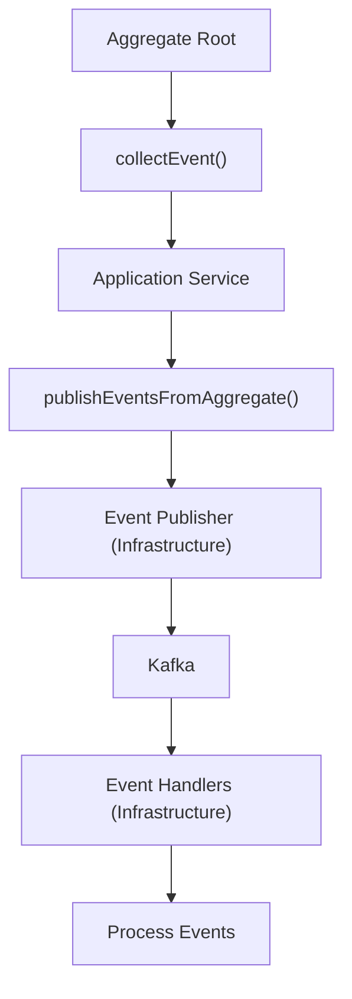

# Domain Events API Documentation

## Overview

This documentation describes the domain events published by the e-commerce platform. Domain events are immutable records of significant business occurrences that have happened in the system. They enable loose coupling between bounded contexts and support event-driven architecture patterns.

**Last Updated**: 2025-10-25

---

## Event-Driven Architecture Approach

### Core Principles

1. **Events as First-Class Citizens**: Domain events are core to our architecture, enabling asynchronous communication between bounded contexts
2. **Immutability**: Once published, events cannot be modified
3. **Event Sourcing Ready**: Events contain all necessary data for event handlers to process independently
4. **Eventual Consistency**: Cross-context operations achieve consistency through event processing

### Event Publishing Flow



### Event Structure

All domain events follow a consistent structure:

```java
public record DomainEvent(
    UUID eventId,              // Unique event identifier
    LocalDateTime occurredOn,  // When the event occurred
    String eventType,          // Type of event (e.g., "CustomerCreated")
    String aggregateId,        // ID of the aggregate that generated the event
    // ... event-specific payload fields
) implements DomainEvent { }
```

---

## Event Categories

Events are organized by bounded context:

| Context | Event Count | Description |
|---------|-------------|-------------|
| [Customer](contexts/customer-events.md) | 5+ | Customer lifecycle events |
| [Order](contexts/order-events.md) | 10+ | Order processing events |
| [Product](contexts/product-events.md) | 6+ | Product catalog events |
| [Payment](contexts/payment-events.md) | 5+ | Payment processing events |
| [Inventory](contexts/inventory-events.md) | 4+ | Inventory management events |
| [Shipping](contexts/shipping-events.md) | 6+ | Shipping and logistics events |
| [Promotion](contexts/promotion-events.md) | 4+ | Promotion and discount events |
| [Notification](contexts/notification-events.md) | 3+ | Notification events |
| [Review](contexts/review-events.md) | 4+ | Product review events |
| [Shopping Cart](contexts/shopping-cart-events.md) | 5+ | Shopping cart events |
| [Pricing](contexts/pricing-events.md) | 3+ | Pricing calculation events |
| [Seller](contexts/seller-events.md) | 5+ | Seller management events |
| [Delivery](contexts/delivery-events.md) | 5+ | Delivery tracking events |

**Total Events**: 65+ domain events across 13 bounded contexts

---

## Event Catalog

For a complete list of all events, see the [Event Catalog](event-catalog.md).

---

## Event Schemas

JSON schemas for all events are available in the [schemas/](schemas/) directory. These schemas can be used for:

- Event validation
- Code generation
- Documentation generation
- Contract testing

---

## Event Consumption

### Subscribing to Events

Event handlers must:

1. Extend `AbstractDomainEventHandler<T>`
2. Be annotated with `@Component`
3. Implement idempotency checks
4. Use `@TransactionalEventListener(phase = AFTER_COMMIT)`

Example:

```java
@Component
public class OrderSubmittedEventHandler 
    extends AbstractDomainEventHandler<OrderSubmittedEvent> {
    
    @Override
    @Transactional
    public void handle(OrderSubmittedEvent event) {
        // Check idempotency
        if (isEventAlreadyProcessed(event.getEventId())) {
            return;
        }
        
        // Process event
        inventoryService.reserveItems(event.orderId());
        notificationService.sendOrderConfirmation(event.customerId());
        
        // Mark as processed
        markEventAsProcessed(event.getEventId());
    }
    
    @Override
    public Class<OrderSubmittedEvent> getSupportedEventType() {
        return OrderSubmittedEvent.class;
    }
}
```

### Event Ordering

Events are published in the order they are collected by the aggregate root. However, due to the distributed nature of the system, events may be processed out of order by different handlers. Handlers must be designed to handle out-of-order events gracefully.

### Event Replay

Events are stored in Kafka topics with configurable retention periods. This enables:

- Event replay for debugging
- Rebuilding read models
- Audit trails
- Analytics

---

## Event Versioning

### Schema Evolution

Events follow a schema evolution strategy to maintain backward compatibility:

1. **Additive Changes**: New optional fields can be added
2. **Optional Fields**: Use `Optional<T>` for fields that may not exist in older versions
3. **Factory Methods**: Provide multiple factory methods for different versions

Example:

```java
public record CustomerCreatedEvent(
    CustomerId customerId,
    CustomerName customerName,
    Email email,
    MembershipLevel membershipLevel,
    // V2 fields using Optional for backward compatibility
    Optional<LocalDate> birthDate,
    Optional<Address> address,
    UUID eventId,
    LocalDateTime occurredOn
) implements DomainEvent {
    
    // V2 factory method
    public static CustomerCreatedEvent create(
        CustomerId customerId, 
        CustomerName customerName, 
        Email email,
        MembershipLevel membershipLevel,
        LocalDate birthDate,
        Address address
    ) {
        // Implementation
    }
    
    // V1 factory method (backward compatible)
    public static CustomerCreatedEvent createLegacy(
        CustomerId customerId, 
        CustomerName customerName, 
        Email email,
        MembershipLevel membershipLevel
    ) {
        // Implementation with empty Optional fields
    }
}
```

### Version Compatibility

- **Breaking Changes**: Require new event types (e.g., `CustomerCreatedV2Event`)
- **Non-Breaking Changes**: Use Optional fields and factory methods
- **Deprecation**: Old event versions are marked as deprecated but continue to work

---

## Event Monitoring

### Key Metrics

- **Event Publication Rate**: Events published per second
- **Event Processing Latency**: Time from publication to processing
- **Event Processing Failures**: Failed event processing attempts
- **Event Replay Count**: Number of event replays

### Dashboards

Event metrics are available in:

- Grafana: Event Processing Dashboard
- CloudWatch: Event Metrics
- Kafka Manager: Topic Metrics

### Alerts

Critical alerts are configured for:

- Event processing failures > 1%
- Event processing latency > 5 seconds
- Event publication failures
- Kafka topic lag > 1000 messages

---

## Best Practices

### Event Design

1. **Include All Necessary Data**: Events should contain all data needed by handlers
2. **Use Past Tense**: Event names should use past tense (e.g., `OrderSubmitted`, not `SubmitOrder`)
3. **Be Specific**: Event names should clearly describe what happened
4. **Avoid Sensitive Data**: Don't include passwords or other sensitive information

### Event Handling

1. **Idempotency**: Handlers must be idempotent (safe to process multiple times)
2. **Error Handling**: Implement proper error handling and logging
3. **Transaction Boundaries**: Use appropriate transaction boundaries
4. **Compensation**: Implement compensation logic for failed operations

### Event Testing

1. **Unit Tests**: Test event creation and validation
2. **Integration Tests**: Test event publishing and handling
3. **Contract Tests**: Verify event schemas match expectations
4. **End-to-End Tests**: Test complete event flows

---

## Related Documentation

- **Domain Events Implementation**: See `.kiro/steering/domain-events.md`
- **Event Storming**: See `.kiro/examples/architecture/event-storming-guide.md`
- **DDD Patterns**: See `.kiro/steering/ddd-tactical-patterns.md`
- **Architecture Viewpoints**: See `docs/viewpoints/information/data-flow.md`

---

## Quick Links

- [Event Catalog](event-catalog.md) - Complete list of all events
- [Event Schemas](schemas/) - JSON schemas for all events
- [Customer Events](contexts/customer-events.md)
- [Order Events](contexts/order-events.md)
- [Product Events](contexts/product-events.md)
- [Payment Events](contexts/payment-events.md)

---

## Support

For questions or issues related to domain events:

- **Technical Questions**: Contact the Architecture Team
- **Event Schema Changes**: Submit a PR with schema updates
- **New Events**: Follow the ADR process for new event types
- **Event Processing Issues**: Check the Event Processing Dashboard

---

**Document Version**: 1.0  
**Last Updated**: 2025-10-25  
**Owner**: Architecture Team
