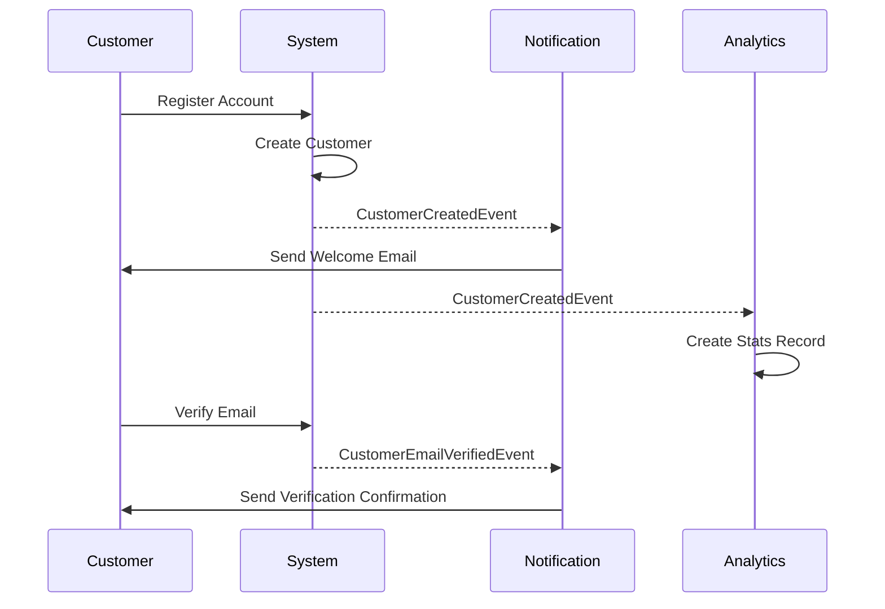
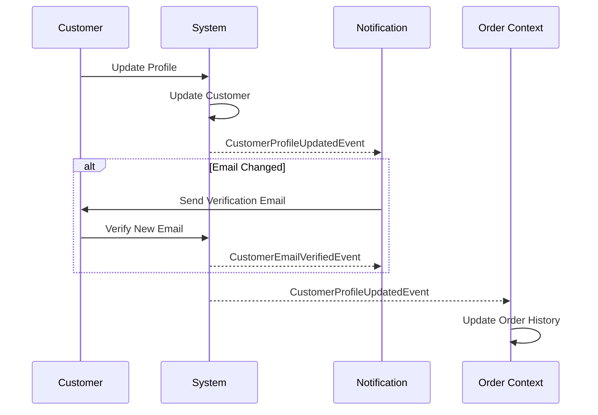

# Customer Context Events

## Overview

This document describes all domain events published by the Customer bounded context. These events capture significant changes in customer lifecycle, profile management, and account status.

**Last Updated**: 2025-10-25

---

## Event List

| Event Name | Trigger | Frequency | Priority |
|------------|---------|-----------|----------|
| `CustomerCreatedEvent` | Customer registration | High | P0 |
| `CustomerProfileUpdatedEvent` | Profile edit | High | P1 |
| `CustomerEmailVerifiedEvent` | Email verification | Medium | P1 |
| `CustomerPasswordChangedEvent` | Password change | Low | P2 |
| `CustomerDeactivatedEvent` | Account closure | Low | P1 |
| `CustomerReactivatedEvent` | Account reactivation | Low | P1 |
| `CustomerMembershipUpgradedEvent` | Membership upgrade | Low | P0 |

---

## CustomerCreatedEvent

### Description

Published when a new customer successfully registers an account in the system.

### Event Structure

```java
public record CustomerCreatedEvent(
    CustomerId customerId,
    CustomerName customerName,
    Email email,
    MembershipLevel membershipLevel,
    Optional<LocalDate> birthDate,
    Optional<Address> address,
    UUID eventId,
    LocalDateTime occurredOn
) implements DomainEvent {
    
    public static CustomerCreatedEvent create(
        CustomerId customerId,
        CustomerName customerName,
        Email email,
        MembershipLevel membershipLevel,
        LocalDate birthDate,
        Address address
    ) {
        var metadata = DomainEvent.createEventMetadata();
        return new CustomerCreatedEvent(
            customerId, customerName, email, membershipLevel,
            Optional.ofNullable(birthDate),
            Optional.ofNullable(address),
            metadata.eventId(), metadata.occurredOn()
        );
    }
}
```

### Payload Fields

| Field | Type | Required | Description |
|-------|------|----------|-------------|
| `customerId` | CustomerId | Yes | Unique customer identifier |
| `customerName` | CustomerName | Yes | Customer's full name |
| `email` | Email | Yes | Customer's email address |
| `membershipLevel` | MembershipLevel | Yes | Initial membership level (STANDARD, PREMIUM, VIP) |
| `birthDate` | Optional<LocalDate> | No | Customer's birth date (V2 field) |
| `address` | Optional<Address> | No | Customer's primary address (V2 field) |
| `eventId` | UUID | Yes | Unique event identifier |
| `occurredOn` | LocalDateTime | Yes | Event timestamp |

### Example JSON

```json
{
  "eventType": "CustomerCreated",
  "eventId": "550e8400-e29b-41d4-a716-446655440000",
  "occurredOn": "2025-10-25T10:30:00Z",
  "customerId": "CUST-001",
  "customerName": "張小明",
  "email": "ming.chang@example.com",
  "membershipLevel": "STANDARD",
  "birthDate": "1990-05-15",
  "address": {
    "street": "台北市信義區信義路五段7號",
    "city": "台北市",
    "postalCode": "110"
  }
}
```

### Event Handlers

| Handler | Action | Context |
|---------|--------|---------|
| `WelcomeEmailHandler` | Send welcome email | Notification |
| `CustomerStatsHandler` | Create customer statistics record | Analytics |
| `LoyaltyProgramHandler` | Initialize loyalty points | Promotion |

### Related Events

- Triggers: `NotificationSentEvent` (welcome email)
- Follows: None (initial event)

---

## CustomerProfileUpdatedEvent

### Description

Published when a customer updates their profile information (name, address, phone, etc.).

### Event Structure

```java
public record CustomerProfileUpdatedEvent(
    CustomerId customerId,
    CustomerName newName,
    Email newEmail,
    Phone newPhone,
    Optional<Address> newAddress,
    Map<String, String> changedFields,
    UUID eventId,
    LocalDateTime occurredOn
) implements DomainEvent {
    
    public static CustomerProfileUpdatedEvent create(
        CustomerId customerId,
        CustomerName newName,
        Email newEmail,
        Phone newPhone,
        Address newAddress,
        Map<String, String> changedFields
    ) {
        var metadata = DomainEvent.createEventMetadata();
        return new CustomerProfileUpdatedEvent(
            customerId, newName, newEmail, newPhone,
            Optional.ofNullable(newAddress),
            changedFields,
            metadata.eventId(), metadata.occurredOn()
        );
    }
}
```

### Payload Fields

| Field | Type | Required | Description |
|-------|------|----------|-------------|
| `customerId` | CustomerId | Yes | Customer identifier |
| `newName` | CustomerName | Yes | Updated customer name |
| `newEmail` | Email | Yes | Updated email address |
| `newPhone` | Phone | Yes | Updated phone number |
| `newAddress` | Optional<Address> | No | Updated address |
| `changedFields` | Map<String, String> | Yes | Map of changed field names to old values |
| `eventId` | UUID | Yes | Unique event identifier |
| `occurredOn` | LocalDateTime | Yes | Event timestamp |

### Example JSON

```json
{
  "eventType": "CustomerProfileUpdated",
  "eventId": "660e8400-e29b-41d4-a716-446655440001",
  "occurredOn": "2025-10-25T14:20:00Z",
  "customerId": "CUST-001",
  "newName": "張小明",
  "newEmail": "ming.chang.new@example.com",
  "newPhone": "+886-912-345-678",
  "newAddress": {
    "street": "台北市大安區敦化南路二段105號",
    "city": "台北市",
    "postalCode": "106"
  },
  "changedFields": {
    "email": "ming.chang@example.com",
    "address": "台北市信義區信義路五段7號"
  }
}
```

### Event Handlers

| Handler | Action | Context |
|---------|--------|---------|
| `CustomerSearchIndexHandler` | Update search index | Search |
| `EmailVerificationHandler` | Send verification email if email changed | Notification |
| `OrderHistoryHandler` | Update customer info in order history | Order |

### Related Events

- May trigger: `CustomerEmailVerifiedEvent` (if email changed)
- Follows: `CustomerCreatedEvent`

---

## CustomerEmailVerifiedEvent

### Description

Published when a customer successfully verifies their email address.

### Event Structure

```java
public record CustomerEmailVerifiedEvent(
    CustomerId customerId,
    Email verifiedEmail,
    LocalDateTime verifiedAt,
    UUID eventId,
    LocalDateTime occurredOn
) implements DomainEvent {
    
    public static CustomerEmailVerifiedEvent create(
        CustomerId customerId,
        Email verifiedEmail
    ) {
        var metadata = DomainEvent.createEventMetadata();
        return new CustomerEmailVerifiedEvent(
            customerId, verifiedEmail,
            LocalDateTime.now(),
            metadata.eventId(), metadata.occurredOn()
        );
    }
}
```

### Payload Fields

| Field | Type | Required | Description |
|-------|------|----------|-------------|
| `customerId` | CustomerId | Yes | Customer identifier |
| `verifiedEmail` | Email | Yes | Verified email address |
| `verifiedAt` | LocalDateTime | Yes | Verification timestamp |
| `eventId` | UUID | Yes | Unique event identifier |
| `occurredOn` | LocalDateTime | Yes | Event timestamp |

### Example JSON

```json
{
  "eventType": "CustomerEmailVerified",
  "eventId": "770e8400-e29b-41d4-a716-446655440002",
  "occurredOn": "2025-10-25T10:35:00Z",
  "customerId": "CUST-001",
  "verifiedEmail": "ming.chang@example.com",
  "verifiedAt": "2025-10-25T10:35:00Z"
}
```

### Event Handlers

| Handler | Action | Context |
|---------|--------|---------|
| `CustomerStatusHandler` | Update customer verification status | Customer |
| `PromotionEligibilityHandler` | Enable verified-only promotions | Promotion |

### Related Events

- Follows: `CustomerCreatedEvent` or `CustomerProfileUpdatedEvent`

---

## CustomerPasswordChangedEvent

### Description

Published when a customer successfully changes their password.

### Event Structure

```java
public record CustomerPasswordChangedEvent(
    CustomerId customerId,
    LocalDateTime changedAt,
    String changeReason,
    UUID eventId,
    LocalDateTime occurredOn
) implements DomainEvent {
    
    public static CustomerPasswordChangedEvent create(
        CustomerId customerId,
        String changeReason
    ) {
        var metadata = DomainEvent.createEventMetadata();
        return new CustomerPasswordChangedEvent(
            customerId,
            LocalDateTime.now(),
            changeReason,
            metadata.eventId(), metadata.occurredOn()
        );
    }
}
```

### Payload Fields

| Field | Type | Required | Description |
|-------|------|----------|-------------|
| `customerId` | CustomerId | Yes | Customer identifier |
| `changedAt` | LocalDateTime | Yes | Password change timestamp |
| `changeReason` | String | Yes | Reason for change (USER_INITIATED, FORCED_RESET, SECURITY_POLICY) |
| `eventId` | UUID | Yes | Unique event identifier |
| `occurredOn` | LocalDateTime | Yes | Event timestamp |

### Example JSON

```json
{
  "eventType": "CustomerPasswordChanged",
  "eventId": "880e8400-e29b-41d4-a716-446655440003",
  "occurredOn": "2025-10-25T16:45:00Z",
  "customerId": "CUST-001",
  "changedAt": "2025-10-25T16:45:00Z",
  "changeReason": "USER_INITIATED"
}
```

### Event Handlers

| Handler | Action | Context |
|---------|--------|---------|
| `SecurityAuditHandler` | Log security event | Security |
| `NotificationHandler` | Send password change confirmation email | Notification |

### Related Events

- Follows: `CustomerCreatedEvent`

---

## CustomerDeactivatedEvent

### Description

Published when a customer account is deactivated (soft delete).

### Event Structure

```java
public record CustomerDeactivatedEvent(
    CustomerId customerId,
    String deactivationReason,
    LocalDateTime deactivatedAt,
    UUID eventId,
    LocalDateTime occurredOn
) implements DomainEvent {
    
    public static CustomerDeactivatedEvent create(
        CustomerId customerId,
        String deactivationReason
    ) {
        var metadata = DomainEvent.createEventMetadata();
        return new CustomerDeactivatedEvent(
            customerId,
            deactivationReason,
            LocalDateTime.now(),
            metadata.eventId(), metadata.occurredOn()
        );
    }
}
```

### Payload Fields

| Field | Type | Required | Description |
|-------|------|----------|-------------|
| `customerId` | CustomerId | Yes | Customer identifier |
| `deactivationReason` | String | Yes | Reason for deactivation |
| `deactivatedAt` | LocalDateTime | Yes | Deactivation timestamp |
| `eventId` | UUID | Yes | Unique event identifier |
| `occurredOn` | LocalDateTime | Yes | Event timestamp |

### Example JSON

```json
{
  "eventType": "CustomerDeactivated",
  "eventId": "990e8400-e29b-41d4-a716-446655440004",
  "occurredOn": "2025-10-25T18:00:00Z",
  "customerId": "CUST-001",
  "deactivationReason": "Customer requested account closure",
  "deactivatedAt": "2025-10-25T18:00:00Z"
}
```

### Event Handlers

| Handler | Action | Context |
|---------|--------|---------|
| `CustomerAccessHandler` | Revoke access tokens | Security |
| `SubscriptionHandler` | Cancel active subscriptions | Subscription |
| `DataRetentionHandler` | Schedule data deletion per GDPR | Compliance |

### Related Events

- May trigger: `SubscriptionCancelledEvent`
- Follows: `CustomerCreatedEvent`

---

## CustomerReactivatedEvent

### Description

Published when a previously deactivated customer account is reactivated.

### Event Structure

```java
public record CustomerReactivatedEvent(
    CustomerId customerId,
    LocalDateTime reactivatedAt,
    UUID eventId,
    LocalDateTime occurredOn
) implements DomainEvent {
    
    public static CustomerReactivatedEvent create(
        CustomerId customerId
    ) {
        var metadata = DomainEvent.createEventMetadata();
        return new CustomerReactivatedEvent(
            customerId,
            LocalDateTime.now(),
            metadata.eventId(), metadata.occurredOn()
        );
    }
}
```

### Payload Fields

| Field | Type | Required | Description |
|-------|------|----------|-------------|
| `customerId` | CustomerId | Yes | Customer identifier |
| `reactivatedAt` | LocalDateTime | Yes | Reactivation timestamp |
| `eventId` | UUID | Yes | Unique event identifier |
| `occurredOn` | LocalDateTime | Yes | Event timestamp |

### Example JSON

```json
{
  "eventType": "CustomerReactivated",
  "eventId": "aa0e8400-e29b-41d4-a716-446655440005",
  "occurredOn": "2025-10-26T09:00:00Z",
  "customerId": "CUST-001",
  "reactivatedAt": "2025-10-26T09:00:00Z"
}
```

### Event Handlers

| Handler | Action | Context |
|---------|--------|---------|
| `CustomerAccessHandler` | Restore access | Security |
| `WelcomeBackHandler` | Send welcome back email | Notification |

### Related Events

- Follows: `CustomerDeactivatedEvent`

---

## CustomerMembershipUpgradedEvent

### Description

Published when a customer's membership level is upgraded (e.g., STANDARD → PREMIUM → VIP).

### Event Structure

```java
public record CustomerMembershipUpgradedEvent(
    CustomerId customerId,
    MembershipLevel previousLevel,
    MembershipLevel newLevel,
    String upgradeReason,
    LocalDateTime upgradedAt,
    UUID eventId,
    LocalDateTime occurredOn
) implements DomainEvent {
    
    public static CustomerMembershipUpgradedEvent create(
        CustomerId customerId,
        MembershipLevel previousLevel,
        MembershipLevel newLevel,
        String upgradeReason
    ) {
        var metadata = DomainEvent.createEventMetadata();
        return new CustomerMembershipUpgradedEvent(
            customerId, previousLevel, newLevel, upgradeReason,
            LocalDateTime.now(),
            metadata.eventId(), metadata.occurredOn()
        );
    }
}
```

### Payload Fields

| Field | Type | Required | Description |
|-------|------|----------|-------------|
| `customerId` | CustomerId | Yes | Customer identifier |
| `previousLevel` | MembershipLevel | Yes | Previous membership level |
| `newLevel` | MembershipLevel | Yes | New membership level |
| `upgradeReason` | String | Yes | Reason for upgrade (PURCHASE, LOYALTY_POINTS, PROMOTION) |
| `upgradedAt` | LocalDateTime | Yes | Upgrade timestamp |
| `eventId` | UUID | Yes | Unique event identifier |
| `occurredOn` | LocalDateTime | Yes | Event timestamp |

### Example JSON

```json
{
  "eventType": "CustomerMembershipUpgraded",
  "eventId": "bb0e8400-e29b-41d4-a716-446655440006",
  "occurredOn": "2025-10-25T12:00:00Z",
  "customerId": "CUST-001",
  "previousLevel": "STANDARD",
  "newLevel": "PREMIUM",
  "upgradeReason": "PURCHASE",
  "upgradedAt": "2025-10-25T12:00:00Z"
}
```

### Event Handlers

| Handler | Action | Context |
|---------|--------|---------|
| `BenefitsHandler` | Activate premium benefits | Promotion |
| `PricingHandler` | Update pricing tier | Pricing |
| `NotificationHandler` | Send upgrade congratulations | Notification |

### Related Events

- May trigger: `PromotionActivatedEvent`
- Follows: `CustomerCreatedEvent`

---

## Event Flow Diagrams

### Customer Registration Flow



### Profile Update Flow



---

## Testing Guidelines

### Unit Tests

```java
@Test
void should_create_customer_created_event_with_all_fields() {
    // Given
    CustomerId customerId = CustomerId.of("CUST-001");
    CustomerName name = new CustomerName("張小明");
    Email email = new Email("ming.chang@example.com");
    MembershipLevel level = MembershipLevel.STANDARD;
    
    // When
    CustomerCreatedEvent event = CustomerCreatedEvent.create(
        customerId, name, email, level, null, null
    );
    
    // Then
    assertThat(event.customerId()).isEqualTo(customerId);
    assertThat(event.customerName()).isEqualTo(name);
    assertThat(event.email()).isEqualTo(email);
    assertThat(event.membershipLevel()).isEqualTo(level);
    assertThat(event.eventId()).isNotNull();
    assertThat(event.occurredOn()).isNotNull();
}
```

### Integration Tests

```java
@SpringBootTest
@ActiveProfiles("test")
class CustomerEventIntegrationTest {
    
    @Autowired
    private CustomerService customerService;
    
    @Autowired
    private DomainEventPublisher eventPublisher;
    
    @Test
    void should_publish_customer_created_event_when_customer_registered() {
        // Given
        CreateCustomerCommand command = new CreateCustomerCommand(
            "張小明", "ming.chang@example.com", "password123"
        );
        
        // When
        Customer customer = customerService.registerCustomer(command);
        
        // Then
        verify(eventPublisher).publish(any(CustomerCreatedEvent.class));
    }
}
```

---

## Related Documentation

- **Event Catalog**: [event-catalog.md](../event-catalog.md)
- **Customer API**: `docs/api/rest/endpoints/customers.md`
- **Domain Events Guide**: `.kiro/steering/domain-events.md`
- **Customer Aggregate**: `docs/viewpoints/functional/bounded-contexts.md#customer-context`

---

**Document Version**: 1.0  
**Last Updated**: 2025-10-25  
**Owner**: Customer Domain Team
