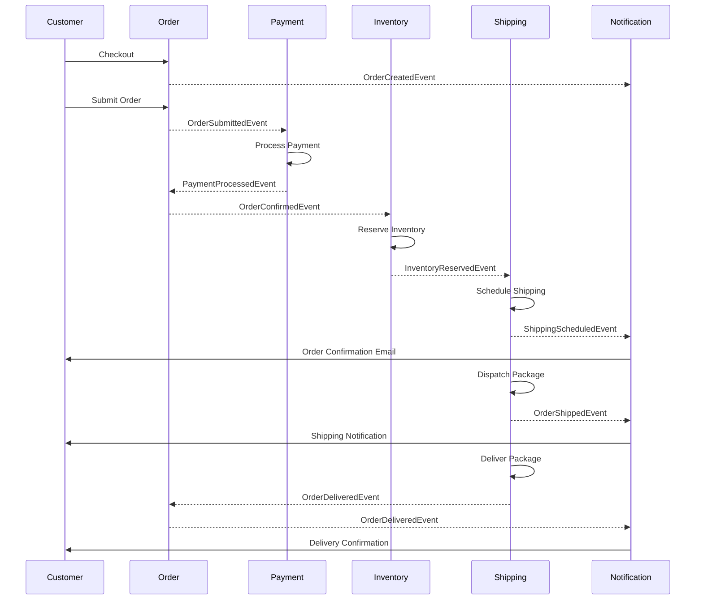
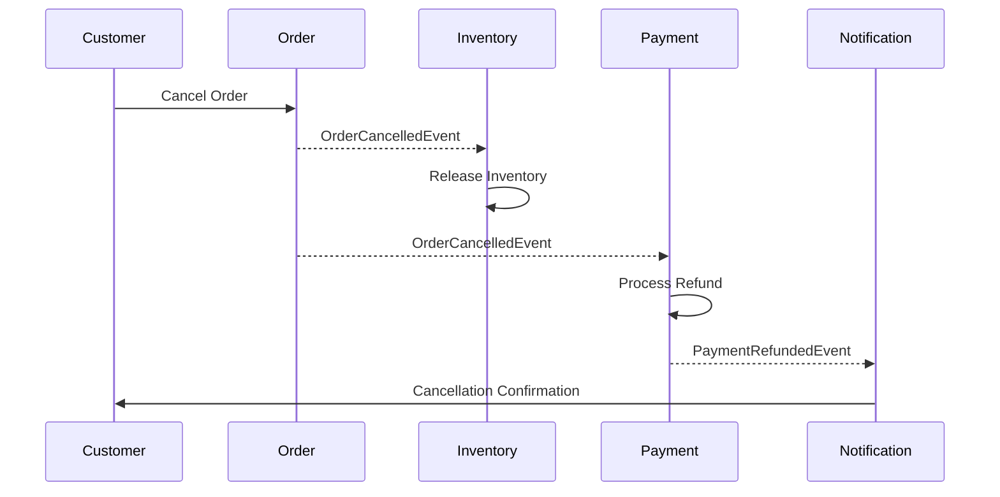

# Order Context Events

## Overview

This document describes all domain events published by the Order bounded context. These events capture the complete order lifecycle from creation through delivery, including order modifications, cancellations, and returns.

**Last Updated**: 2025-10-25

---

## Event List

| Event Name | Trigger | Frequency | Priority |
|------------|---------|-----------|----------|
| `OrderCreatedEvent` | Checkout initiation | Very High | P0 |
| `OrderSubmittedEvent` | Order submission | Very High | P0 |
| `OrderConfirmedEvent` | Payment success | Very High | P0 |
| `OrderCancelledEvent` | Order cancellation | Medium | P1 |
| `OrderShippedEvent` | Shipping dispatch | High | P0 |
| `OrderDeliveredEvent` | Delivery confirmation | High | P0 |
| `OrderReturnedEvent` | Return request | Low | P1 |
| `OrderRefundedEvent` | Refund processing | Low | P1 |
| `OrderItemAddedEvent` | Item addition | Medium | P2 |
| `OrderItemRemovedEvent` | Item removal | Medium | P2 |
| `OrderItemQuantityChangedEvent` | Quantity update | Medium | P2 |

---

## OrderCreatedEvent

### Description

Published when a new order is created from a shopping cart during checkout initiation.

### Event Structure

```java
public record OrderCreatedEvent(
    OrderId orderId,
    CustomerId customerId,
    List<OrderItemDto> items,
    Money subtotal,
    ShippingAddress shippingAddress,
    UUID eventId,
    LocalDateTime occurredOn
) implements DomainEvent {
    
    public static OrderCreatedEvent create(
        OrderId orderId,
        CustomerId customerId,
        List<OrderItem> items,
        Money subtotal,
        ShippingAddress shippingAddress
    ) {
        var metadata = DomainEvent.createEventMetadata();
        return new OrderCreatedEvent(
            orderId, customerId,
            items.stream().map(OrderItemDto::from).toList(),
            subtotal, shippingAddress,
            metadata.eventId(), metadata.occurredOn()
        );
    }
}
```

### Payload Fields

| Field | Type | Required | Description |
|-------|------|----------|-------------|
| `orderId` | OrderId | Yes | Unique order identifier |
| `customerId` | CustomerId | Yes | Customer who created the order |
| `items` | List<OrderItemDto> | Yes | List of order items |
| `subtotal` | Money | Yes | Order subtotal before tax and shipping |
| `shippingAddress` | ShippingAddress | Yes | Delivery address |
| `eventId` | UUID | Yes | Unique event identifier |
| `occurredOn` | LocalDateTime | Yes | Event timestamp |

### Example JSON

```json
{
  "eventType": "OrderCreated",
  "eventId": "100e8400-e29b-41d4-a716-446655440000",
  "occurredOn": "2025-10-25T10:00:00Z",
  "orderId": "ORD-2025-001",
  "customerId": "CUST-001",
  "items": [
    {
      "productId": "PROD-001",
      "productName": "iPhone 15 Pro",
      "quantity": 1,
      "unitPrice": {
        "amount": 35900,
        "currency": "TWD"
      }
    }
  ],
  "subtotal": {
    "amount": 35900,
    "currency": "TWD"
  },
  "shippingAddress": {
    "recipientName": "張小明",
    "street": "台北市信義區信義路五段7號",
    "city": "台北市",
    "postalCode": "110",
    "phone": "+886-912-345-678"
  }
}
```

### Event Handlers

| Handler | Action | Context |
|---------|--------|---------|
| `OrderValidationHandler` | Validate order details | Order |
| `InventoryCheckHandler` | Check product availability | Inventory |
| `PricingCalculationHandler` | Calculate final price | Pricing |

### Related Events

- Triggers: `PriceCalculatedEvent`, `TaxCalculatedEvent`
- Follows: `CartCheckedOutEvent`
- Precedes: `OrderSubmittedEvent`

---

## OrderSubmittedEvent

### Description

Published when a customer submits an order for processing after reviewing order details.

### Event Structure

```java
public record OrderSubmittedEvent(
    OrderId orderId,
    CustomerId customerId,
    Money totalAmount,
    int itemCount,
    PaymentMethod paymentMethod,
    UUID eventId,
    LocalDateTime occurredOn
) implements DomainEvent {
    
    public static OrderSubmittedEvent create(
        OrderId orderId,
        CustomerId customerId,
        Money totalAmount,
        int itemCount,
        PaymentMethod paymentMethod
    ) {
        var metadata = DomainEvent.createEventMetadata();
        return new OrderSubmittedEvent(
            orderId, customerId, totalAmount, itemCount, paymentMethod,
            metadata.eventId(), metadata.occurredOn()
        );
    }
}
```

### Payload Fields

| Field | Type | Required | Description |
|-------|------|----------|-------------|
| `orderId` | OrderId | Yes | Order identifier |
| `customerId` | CustomerId | Yes | Customer identifier |
| `totalAmount` | Money | Yes | Total order amount including tax and shipping |
| `itemCount` | int | Yes | Total number of items |
| `paymentMethod` | PaymentMethod | Yes | Selected payment method |
| `eventId` | UUID | Yes | Unique event identifier |
| `occurredOn` | LocalDateTime | Yes | Event timestamp |

### Example JSON

```json
{
  "eventType": "OrderSubmitted",
  "eventId": "110e8400-e29b-41d4-a716-446655440001",
  "occurredOn": "2025-10-25T10:05:00Z",
  "orderId": "ORD-2025-001",
  "customerId": "CUST-001",
  "totalAmount": {
    "amount": 37695,
    "currency": "TWD"
  },
  "itemCount": 1,
  "paymentMethod": "CREDIT_CARD"
}
```

### Event Handlers

| Handler | Action | Context |
|---------|--------|---------|
| `PaymentInitiationHandler` | Initiate payment processing | Payment |
| `InventoryReservationHandler` | Reserve inventory | Inventory |
| `OrderStatusHandler` | Update order status to PENDING | Order |

### Related Events

- Triggers: `PaymentInitiatedEvent`, `InventoryReservedEvent`
- Follows: `OrderCreatedEvent`
- Precedes: `OrderConfirmedEvent`

---

## OrderConfirmedEvent

### Description

Published when an order is confirmed after successful payment processing.

### Event Structure

```java
public record OrderConfirmedEvent(
    OrderId orderId,
    CustomerId customerId,
    PaymentId paymentId,
    Money paidAmount,
    LocalDateTime confirmedAt,
    UUID eventId,
    LocalDateTime occurredOn
) implements DomainEvent {
    
    public static OrderConfirmedEvent create(
        OrderId orderId,
        CustomerId customerId,
        PaymentId paymentId,
        Money paidAmount
    ) {
        var metadata = DomainEvent.createEventMetadata();
        return new OrderConfirmedEvent(
            orderId, customerId, paymentId, paidAmount,
            LocalDateTime.now(),
            metadata.eventId(), metadata.occurredOn()
        );
    }
}
```

### Payload Fields

| Field | Type | Required | Description |
|-------|------|----------|-------------|
| `orderId` | OrderId | Yes | Order identifier |
| `customerId` | CustomerId | Yes | Customer identifier |
| `paymentId` | PaymentId | Yes | Payment transaction identifier |
| `paidAmount` | Money | Yes | Amount paid |
| `confirmedAt` | LocalDateTime | Yes | Confirmation timestamp |
| `eventId` | UUID | Yes | Unique event identifier |
| `occurredOn` | LocalDateTime | Yes | Event timestamp |

### Example JSON

```json
{
  "eventType": "OrderConfirmed",
  "eventId": "120e8400-e29b-41d4-a716-446655440002",
  "occurredOn": "2025-10-25T10:10:00Z",
  "orderId": "ORD-2025-001",
  "customerId": "CUST-001",
  "paymentId": "PAY-2025-001",
  "paidAmount": {
    "amount": 37695,
    "currency": "TWD"
  },
  "confirmedAt": "2025-10-25T10:10:00Z"
}
```

### Event Handlers

| Handler | Action | Context |
|---------|--------|---------|
| `ShippingScheduleHandler` | Schedule shipping | Shipping |
| `OrderConfirmationEmailHandler` | Send confirmation email | Notification |
| `InvoiceGenerationHandler` | Generate invoice | Billing |
| `LoyaltyPointsHandler` | Award loyalty points | Promotion |

### Related Events

- Triggers: `ShippingScheduledEvent`, `NotificationSentEvent`
- Follows: `PaymentProcessedEvent`
- Precedes: `OrderShippedEvent`

---

## OrderCancelledEvent

### Description

Published when an order is cancelled by the customer or system (e.g., payment failure, out of stock).

### Event Structure

```java
public record OrderCancelledEvent(
    OrderId orderId,
    CustomerId customerId,
    String cancellationReason,
    CancellationSource source,
    LocalDateTime cancelledAt,
    UUID eventId,
    LocalDateTime occurredOn
) implements DomainEvent {
    
    public static OrderCancelledEvent create(
        OrderId orderId,
        CustomerId customerId,
        String cancellationReason,
        CancellationSource source
    ) {
        var metadata = DomainEvent.createEventMetadata();
        return new OrderCancelledEvent(
            orderId, customerId, cancellationReason, source,
            LocalDateTime.now(),
            metadata.eventId(), metadata.occurredOn()
        );
    }
}
```

### Payload Fields

| Field | Type | Required | Description |
|-------|------|----------|-------------|
| `orderId` | OrderId | Yes | Order identifier |
| `customerId` | CustomerId | Yes | Customer identifier |
| `cancellationReason` | String | Yes | Reason for cancellation |
| `source` | CancellationSource | Yes | Who cancelled (CUSTOMER, SYSTEM, ADMIN) |
| `cancelledAt` | LocalDateTime | Yes | Cancellation timestamp |
| `eventId` | UUID | Yes | Unique event identifier |
| `occurredOn` | LocalDateTime | Yes | Event timestamp |

### Example JSON

```json
{
  "eventType": "OrderCancelled",
  "eventId": "130e8400-e29b-41d4-a716-446655440003",
  "occurredOn": "2025-10-25T11:00:00Z",
  "orderId": "ORD-2025-001",
  "customerId": "CUST-001",
  "cancellationReason": "Customer requested cancellation",
  "source": "CUSTOMER",
  "cancelledAt": "2025-10-25T11:00:00Z"
}
```

### Event Handlers

| Handler | Action | Context |
|---------|--------|---------|
| `InventoryReleaseHandler` | Release reserved inventory | Inventory |
| `PaymentRefundHandler` | Process refund if paid | Payment |
| `CancellationEmailHandler` | Send cancellation confirmation | Notification |

### Related Events

- Triggers: `InventoryReleasedEvent`, `PaymentRefundedEvent`
- Can follow: `OrderCreatedEvent`, `OrderSubmittedEvent`, `OrderConfirmedEvent`

---

## OrderShippedEvent

### Description

Published when an order is shipped and dispatched to the customer.

### Event Structure

```java
public record OrderShippedEvent(
    OrderId orderId,
    CustomerId customerId,
    ShippingId shippingId,
    String trackingNumber,
    String carrier,
    LocalDateTime shippedAt,
    LocalDateTime estimatedDelivery,
    UUID eventId,
    LocalDateTime occurredOn
) implements DomainEvent {
    
    public static OrderShippedEvent create(
        OrderId orderId,
        CustomerId customerId,
        ShippingId shippingId,
        String trackingNumber,
        String carrier,
        LocalDateTime estimatedDelivery
    ) {
        var metadata = DomainEvent.createEventMetadata();
        return new OrderShippedEvent(
            orderId, customerId, shippingId, trackingNumber, carrier,
            LocalDateTime.now(), estimatedDelivery,
            metadata.eventId(), metadata.occurredOn()
        );
    }
}
```

### Payload Fields

| Field | Type | Required | Description |
|-------|------|----------|-------------|
| `orderId` | OrderId | Yes | Order identifier |
| `customerId` | CustomerId | Yes | Customer identifier |
| `shippingId` | ShippingId | Yes | Shipping record identifier |
| `trackingNumber` | String | Yes | Carrier tracking number |
| `carrier` | String | Yes | Shipping carrier name |
| `shippedAt` | LocalDateTime | Yes | Shipping timestamp |
| `estimatedDelivery` | LocalDateTime | Yes | Estimated delivery date |
| `eventId` | UUID | Yes | Unique event identifier |
| `occurredOn` | LocalDateTime | Yes | Event timestamp |

### Example JSON

```json
{
  "eventType": "OrderShipped",
  "eventId": "140e8400-e29b-41d4-a716-446655440004",
  "occurredOn": "2025-10-26T09:00:00Z",
  "orderId": "ORD-2025-001",
  "customerId": "CUST-001",
  "shippingId": "SHIP-2025-001",
  "trackingNumber": "TW1234567890",
  "carrier": "黑貓宅急便",
  "shippedAt": "2025-10-26T09:00:00Z",
  "estimatedDelivery": "2025-10-27T18:00:00Z"
}
```

### Event Handlers

| Handler | Action | Context |
|---------|--------|---------|
| `ShippingNotificationHandler` | Send shipping notification | Notification |
| `TrackingUpdateHandler` | Enable tracking updates | Shipping |
| `DeliveryScheduleHandler` | Schedule delivery | Delivery |

### Related Events

- Triggers: `ShippingDispatchedEvent`, `NotificationSentEvent`
- Follows: `OrderConfirmedEvent`
- Precedes: `OrderDeliveredEvent`

---

## OrderDeliveredEvent

### Description

Published when an order is successfully delivered to the customer.

### Event Structure

```java
public record OrderDeliveredEvent(
    OrderId orderId,
    CustomerId customerId,
    ShippingId shippingId,
    LocalDateTime deliveredAt,
    String deliverySignature,
    DeliveryStatus deliveryStatus,
    UUID eventId,
    LocalDateTime occurredOn
) implements DomainEvent {
    
    public static OrderDeliveredEvent create(
        OrderId orderId,
        CustomerId customerId,
        ShippingId shippingId,
        String deliverySignature,
        DeliveryStatus deliveryStatus
    ) {
        var metadata = DomainEvent.createEventMetadata();
        return new OrderDeliveredEvent(
            orderId, customerId, shippingId,
            LocalDateTime.now(), deliverySignature, deliveryStatus,
            metadata.eventId(), metadata.occurredOn()
        );
    }
}
```

### Payload Fields

| Field | Type | Required | Description |
|-------|------|----------|-------------|
| `orderId` | OrderId | Yes | Order identifier |
| `customerId` | CustomerId | Yes | Customer identifier |
| `shippingId` | ShippingId | Yes | Shipping record identifier |
| `deliveredAt` | LocalDateTime | Yes | Delivery timestamp |
| `deliverySignature` | String | No | Delivery signature/proof |
| `deliveryStatus` | DeliveryStatus | Yes | Delivery status (DELIVERED, LEFT_AT_DOOR, etc.) |
| `eventId` | UUID | Yes | Unique event identifier |
| `occurredOn` | LocalDateTime | Yes | Event timestamp |

### Example JSON

```json
{
  "eventType": "OrderDelivered",
  "eventId": "150e8400-e29b-41d4-a716-446655440005",
  "occurredOn": "2025-10-27T14:30:00Z",
  "orderId": "ORD-2025-001",
  "customerId": "CUST-001",
  "shippingId": "SHIP-2025-001",
  "deliveredAt": "2025-10-27T14:30:00Z",
  "deliverySignature": "張小明",
  "deliveryStatus": "DELIVERED"
}
```

### Event Handlers

| Handler | Action | Context |
|---------|--------|---------|
| `DeliveryConfirmationHandler` | Send delivery confirmation | Notification |
| `ReviewRequestHandler` | Request product review | Review |
| `OrderCompletionHandler` | Mark order as completed | Order |

### Related Events

- Triggers: `NotificationSentEvent`, `ReviewRequestedEvent`
- Follows: `OrderShippedEvent`

---

## OrderReturnedEvent

### Description

Published when a customer initiates a return for a delivered order.

### Event Structure

```java
public record OrderReturnedEvent(
    OrderId orderId,
    CustomerId customerId,
    ReturnId returnId,
    List<ReturnItemDto> returnItems,
    String returnReason,
    LocalDateTime returnRequestedAt,
    UUID eventId,
    LocalDateTime occurredOn
) implements DomainEvent {
    
    public static OrderReturnedEvent create(
        OrderId orderId,
        CustomerId customerId,
        ReturnId returnId,
        List<ReturnItem> returnItems,
        String returnReason
    ) {
        var metadata = DomainEvent.createEventMetadata();
        return new OrderReturnedEvent(
            orderId, customerId, returnId,
            returnItems.stream().map(ReturnItemDto::from).toList(),
            returnReason, LocalDateTime.now(),
            metadata.eventId(), metadata.occurredOn()
        );
    }
}
```

### Payload Fields

| Field | Type | Required | Description |
|-------|------|----------|-------------|
| `orderId` | OrderId | Yes | Order identifier |
| `customerId` | CustomerId | Yes | Customer identifier |
| `returnId` | ReturnId | Yes | Return request identifier |
| `returnItems` | List<ReturnItemDto> | Yes | Items being returned |
| `returnReason` | String | Yes | Reason for return |
| `returnRequestedAt` | LocalDateTime | Yes | Return request timestamp |
| `eventId` | UUID | Yes | Unique event identifier |
| `occurredOn` | LocalDateTime | Yes | Event timestamp |

### Example JSON

```json
{
  "eventType": "OrderReturned",
  "eventId": "160e8400-e29b-41d4-a716-446655440006",
  "occurredOn": "2025-10-28T10:00:00Z",
  "orderId": "ORD-2025-001",
  "customerId": "CUST-001",
  "returnId": "RET-2025-001",
  "returnItems": [
    {
      "productId": "PROD-001",
      "quantity": 1,
      "reason": "產品瑕疵"
    }
  ],
  "returnReason": "產品有瑕疵，要求退貨",
  "returnRequestedAt": "2025-10-28T10:00:00Z"
}
```

### Event Handlers

| Handler | Action | Context |
|---------|--------|---------|
| `ReturnProcessingHandler` | Process return request | Order |
| `ReturnLabelHandler` | Generate return shipping label | Shipping |
| `ReturnNotificationHandler` | Send return confirmation | Notification |

### Related Events

- Triggers: `ReturnLabelCreatedEvent`
- Follows: `OrderDeliveredEvent`
- Precedes: `OrderRefundedEvent`

---

## OrderRefundedEvent

### Description

Published when a refund is processed for a returned or cancelled order.

### Event Structure

```java
public record OrderRefundedEvent(
    OrderId orderId,
    CustomerId customerId,
    RefundId refundId,
    Money refundAmount,
    String refundReason,
    RefundMethod refundMethod,
    LocalDateTime refundedAt,
    UUID eventId,
    LocalDateTime occurredOn
) implements DomainEvent {
    
    public static OrderRefundedEvent create(
        OrderId orderId,
        CustomerId customerId,
        RefundId refundId,
        Money refundAmount,
        String refundReason,
        RefundMethod refundMethod
    ) {
        var metadata = DomainEvent.createEventMetadata();
        return new OrderRefundedEvent(
            orderId, customerId, refundId, refundAmount,
            refundReason, refundMethod, LocalDateTime.now(),
            metadata.eventId(), metadata.occurredOn()
        );
    }
}
```

### Payload Fields

| Field | Type | Required | Description |
|-------|------|----------|-------------|
| `orderId` | OrderId | Yes | Order identifier |
| `customerId` | CustomerId | Yes | Customer identifier |
| `refundId` | RefundId | Yes | Refund transaction identifier |
| `refundAmount` | Money | Yes | Refund amount |
| `refundReason` | String | Yes | Reason for refund |
| `refundMethod` | RefundMethod | Yes | Refund method (ORIGINAL_PAYMENT, STORE_CREDIT) |
| `refundedAt` | LocalDateTime | Yes | Refund timestamp |
| `eventId` | UUID | Yes | Unique event identifier |
| `occurredOn` | LocalDateTime | Yes | Event timestamp |

### Example JSON

```json
{
  "eventType": "OrderRefunded",
  "eventId": "170e8400-e29b-41d4-a716-446655440007",
  "occurredOn": "2025-10-29T15:00:00Z",
  "orderId": "ORD-2025-001",
  "customerId": "CUST-001",
  "refundId": "REF-2025-001",
  "refundAmount": {
    "amount": 37695,
    "currency": "TWD"
  },
  "refundReason": "產品瑕疵退貨",
  "refundMethod": "ORIGINAL_PAYMENT",
  "refundedAt": "2025-10-29T15:00:00Z"
}
```

### Event Handlers

| Handler | Action | Context |
|---------|--------|---------|
| `PaymentRefundHandler` | Process payment refund | Payment |
| `InventoryRestockHandler` | Restock returned items | Inventory |
| `RefundNotificationHandler` | Send refund confirmation | Notification |

### Related Events

- Triggers: `PaymentRefundedEvent`, `InventoryAdjustedEvent`
- Follows: `OrderReturnedEvent` or `OrderCancelledEvent`

---

## OrderItemAddedEvent

### Description

Published when an item is added to an existing order (before submission).

### Event Structure

```java
public record OrderItemAddedEvent(
    OrderId orderId,
    ProductId productId,
    int quantity,
    Money unitPrice,
    UUID eventId,
    LocalDateTime occurredOn
) implements DomainEvent { }
```

### Example JSON

```json
{
  "eventType": "OrderItemAdded",
  "eventId": "180e8400-e29b-41d4-a716-446655440008",
  "occurredOn": "2025-10-25T10:02:00Z",
  "orderId": "ORD-2025-001",
  "productId": "PROD-002",
  "quantity": 1,
  "unitPrice": {
    "amount": 1990,
    "currency": "TWD"
  }
}
```

---

## OrderItemRemovedEvent

### Description

Published when an item is removed from an existing order (before submission).

### Event Structure

```java
public record OrderItemRemovedEvent(
    OrderId orderId,
    ProductId productId,
    int removedQuantity,
    UUID eventId,
    LocalDateTime occurredOn
) implements DomainEvent { }
```

---

## OrderItemQuantityChangedEvent

### Description

Published when the quantity of an item in an order is changed (before submission).

### Event Structure

```java
public record OrderItemQuantityChangedEvent(
    OrderId orderId,
    ProductId productId,
    int oldQuantity,
    int newQuantity,
    UUID eventId,
    LocalDateTime occurredOn
) implements DomainEvent { }
```

---

## Event Flow Diagrams

### Complete Order Processing Flow



### Order Cancellation Flow



---

## Testing Guidelines

### Unit Tests

```java
@Test
void should_create_order_submitted_event_with_correct_data() {
    // Given
    OrderId orderId = OrderId.of("ORD-2025-001");
    CustomerId customerId = CustomerId.of("CUST-001");
    Money totalAmount = Money.of(37695, "TWD");
    
    // When
    OrderSubmittedEvent event = OrderSubmittedEvent.create(
        orderId, customerId, totalAmount, 1, PaymentMethod.CREDIT_CARD
    );
    
    // Then
    assertThat(event.orderId()).isEqualTo(orderId);
    assertThat(event.totalAmount()).isEqualTo(totalAmount);
    assertThat(event.eventId()).isNotNull();
}
```

### Integration Tests

```java
@SpringBootTest
@ActiveProfiles("test")
class OrderEventIntegrationTest {
    
    @Test
    void should_publish_order_confirmed_event_after_payment_success() {
        // Given
        Order order = createTestOrder();
        Payment payment = processPayment(order);
        
        // When
        orderService.confirmOrder(order.getId(), payment.getId());
        
        // Then
        verify(eventPublisher).publish(any(OrderConfirmedEvent.class));
    }
}
```

---

## Related Documentation

- **Event Catalog**: [event-catalog.md](../event-catalog.md)
- **Order API**: `docs/api/rest/endpoints/orders.md`
- **Payment Events**: [payment-events.md](payment-events.md)
- **Shipping Events**: [shipping-events.md](shipping-events.md)
- **Order Aggregate**: `docs/viewpoints/functional/bounded-contexts.md#order-context`

---

**Document Version**: 1.0  
**Last Updated**: 2025-10-25  
**Owner**: Order Domain Team
