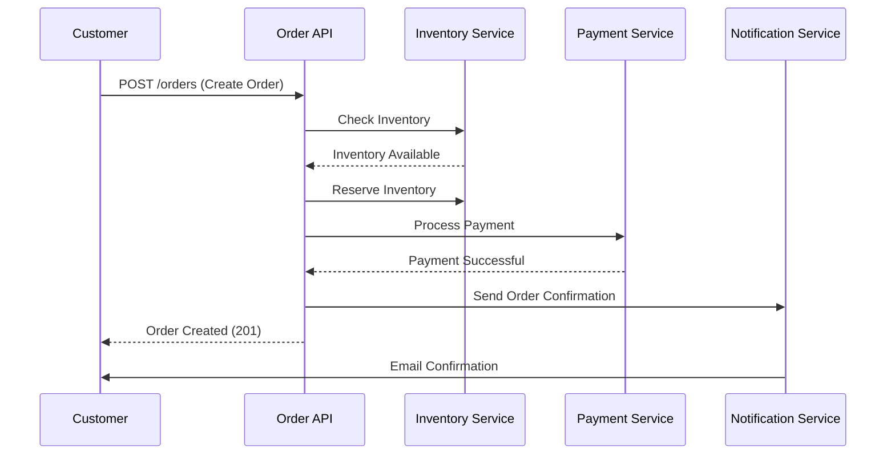

# Order API

## Overview

The Order API provides endpoints for managing customer orders, including order creation, retrieval, updates, and cancellation. Orders represent the complete purchase transaction from cart to delivery.

**Base Path**: `/api/v1/orders`

**Authentication**: Required for all endpoints

## Order Lifecycle

```
CREATED → PENDING → CONFIRMED → PROCESSING → SHIPPED → DELIVERED
                                     ↓
                                 CANCELLED
```

## Endpoints

### Create Order (Submit Order)

Create a new order from shopping cart.

**Endpoint**: `POST /api/v1/orders`

**Authentication**: Required

**Request Body**:
```json
{
  "customerId": "cust-123",
  "items": [
    {
      "productId": "prod-456",
      "quantity": 2,
      "price": 500.00
    },
    {
      "productId": "prod-789",
      "quantity": 1,
      "price": 1000.00
    }
  ],
  "shippingAddress": {
    "street": "123 Main St",
    "city": "Taipei",
    "state": "Taiwan",
    "postalCode": "10001",
    "country": "TW"
  },
  "billingAddress": {
    "street": "123 Main St",
    "city": "Taipei",
    "state": "Taiwan",
    "postalCode": "10001",
    "country": "TW"
  },
  "paymentMethod": "CREDIT_CARD",
  "promotionCode": "SUMMER2025"
}
```

**Validation Rules**:
- `customerId`: Required, must exist
- `items`: Required, at least 1 item
- `items[].productId`: Required, must exist and be in stock
- `items[].quantity`: Required, must be > 0
- `shippingAddress`: Required
- `paymentMethod`: Required (CREDIT_CARD, DEBIT_CARD, BANK_TRANSFER, CASH_ON_DELIVERY)

**Success Response** (201 Created):
```json
{
  "data": {
    "id": "order-789",
    "orderNumber": "ORD-2025-001",
    "customerId": "cust-123",
    "status": "PENDING",
    "items": [
      {
        "id": "item-1",
        "productId": "prod-456",
        "productName": "Wireless Mouse",
        "quantity": 2,
        "unitPrice": 500.00,
        "subtotal": 1000.00
      },
      {
        "id": "item-2",
        "productId": "prod-789",
        "productName": "Mechanical Keyboard",
        "quantity": 1,
        "unitPrice": 1000.00,
        "subtotal": 1000.00
      }
    ],
    "subtotal": 2000.00,
    "discount": 200.00,
    "shippingFee": 100.00,
    "tax": 95.00,
    "totalAmount": 1995.00,
    "currency": "TWD",
    "shippingAddress": {
      "street": "123 Main St",
      "city": "Taipei",
      "state": "Taiwan",
      "postalCode": "10001",
      "country": "TW"
    },
    "paymentMethod": "CREDIT_CARD",
    "paymentStatus": "PENDING",
    "createdAt": "2025-10-25T10:30:00Z",
    "updatedAt": "2025-10-25T10:30:00Z"
  },
  "metadata": {
    "requestId": "req-abc-123",
    "timestamp": "2025-10-25T10:30:00Z",
    "version": "v1"
  }
}
```

**Error Responses**:
- `400 Bad Request`: Validation errors
- `401 Unauthorized`: Missing or invalid token
- `409 Conflict`: Insufficient inventory

**curl Example**:
```bash
curl -X POST https://api.ecommerce.com/api/v1/orders \
  -H "Authorization: Bearer YOUR_JWT_TOKEN" \
  -H "Content-Type: application/json" \
  -d '{
    "customerId": "cust-123",
    "items": [
      {
        "productId": "prod-456",
        "quantity": 2,
        "price": 500.00
      }
    ],
    "shippingAddress": {
      "street": "123 Main St",
      "city": "Taipei",
      "state": "Taiwan",
      "postalCode": "10001",
      "country": "TW"
    },
    "paymentMethod": "CREDIT_CARD"
  }'
```

---

### Get Order by ID

Retrieve a specific order by its ID.

**Endpoint**: `GET /api/v1/orders/{id}`

**Authentication**: Required

**Authorization**: User can access own orders, or ADMIN role required

**Path Parameters**:
- `id`: Order ID (e.g., `order-789`)

**Success Response** (200 OK):
```json
{
  "data": {
    "id": "order-789",
    "orderNumber": "ORD-2025-001",
    "customerId": "cust-123",
    "customerName": "John Doe",
    "status": "SHIPPED",
    "items": [
      {
        "id": "item-1",
        "productId": "prod-456",
        "productName": "Wireless Mouse",
        "productImage": "https://cdn.ecommerce.com/products/prod-456.jpg",
        "quantity": 2,
        "unitPrice": 500.00,
        "subtotal": 1000.00
      }
    ],
    "subtotal": 2000.00,
    "discount": 200.00,
    "shippingFee": 100.00,
    "tax": 95.00,
    "totalAmount": 1995.00,
    "currency": "TWD",
    "shippingAddress": {
      "street": "123 Main St",
      "city": "Taipei",
      "state": "Taiwan",
      "postalCode": "10001",
      "country": "TW"
    },
    "billingAddress": {
      "street": "123 Main St",
      "city": "Taipei",
      "state": "Taiwan",
      "postalCode": "10001",
      "country": "TW"
    },
    "paymentMethod": "CREDIT_CARD",
    "paymentStatus": "PAID",
    "trackingNumber": "TW123456789",
    "estimatedDelivery": "2025-10-28T00:00:00Z",
    "createdAt": "2025-10-25T10:30:00Z",
    "updatedAt": "2025-10-26T14:00:00Z",
    "shippedAt": "2025-10-26T14:00:00Z"
  }
}
```

**Error Responses**:
- `401 Unauthorized`: Missing or invalid token
- `403 Forbidden`: Insufficient permissions
- `404 Not Found`: Order not found

**curl Example**:
```bash
curl -X GET https://api.ecommerce.com/api/v1/orders/order-789 \
  -H "Authorization: Bearer YOUR_JWT_TOKEN"
```

---

### List Orders

Retrieve a paginated list of orders.

**Endpoint**: `GET /api/v1/orders`

**Authentication**: Required

**Authorization**: 
- Regular users see only their own orders
- ADMIN role can see all orders

**Query Parameters**:
- `page`: Page number (0-based, default: 0)
- `size`: Page size (default: 20, max: 100)
- `sort`: Sort field and direction (default: `createdAt,desc`)
- `status`: Filter by status (PENDING, CONFIRMED, PROCESSING, SHIPPED, DELIVERED, CANCELLED)
- `customerId`: Filter by customer ID (ADMIN only)
- `startDate`: Filter orders created after this date (ISO 8601)
- `endDate`: Filter orders created before this date (ISO 8601)

**Success Response** (200 OK):
```json
{
  "data": {
    "content": [
      {
        "id": "order-789",
        "orderNumber": "ORD-2025-001",
        "customerId": "cust-123",
        "customerName": "John Doe",
        "status": "SHIPPED",
        "totalAmount": 1995.00,
        "currency": "TWD",
        "itemCount": 2,
        "paymentStatus": "PAID",
        "createdAt": "2025-10-25T10:30:00Z",
        "shippedAt": "2025-10-26T14:00:00Z"
      }
    ],
    "page": {
      "number": 0,
      "size": 20,
      "totalElements": 50,
      "totalPages": 3,
      "first": true,
      "last": false
    }
  }
}
```

**curl Example**:
```bash
# List own orders
curl -X GET "https://api.ecommerce.com/api/v1/orders?page=0&size=20&status=SHIPPED" \
  -H "Authorization: Bearer YOUR_JWT_TOKEN"

# Admin: List all orders with date filter
curl -X GET "https://api.ecommerce.com/api/v1/orders?startDate=2025-10-01T00:00:00Z&endDate=2025-10-31T23:59:59Z" \
  -H "Authorization: Bearer ADMIN_JWT_TOKEN"
```

---

### Update Order Status

Update the status of an order.

**Endpoint**: `PATCH /api/v1/orders/{id}/status`

**Authentication**: Required

**Authorization**: ADMIN or SELLER role required

**Path Parameters**:
- `id`: Order ID

**Request Body**:
```json
{
  "status": "CONFIRMED",
  "notes": "Order confirmed and ready for processing"
}
```

**Valid Status Transitions**:
- `PENDING` → `CONFIRMED` or `CANCELLED`
- `CONFIRMED` → `PROCESSING` or `CANCELLED`
- `PROCESSING` → `SHIPPED` or `CANCELLED`
- `SHIPPED` → `DELIVERED`

**Success Response** (200 OK):
```json
{
  "data": {
    "id": "order-789",
    "status": "CONFIRMED",
    "statusHistory": [
      {
        "status": "PENDING",
        "timestamp": "2025-10-25T10:30:00Z",
        "updatedBy": "system"
      },
      {
        "status": "CONFIRMED",
        "timestamp": "2025-10-25T11:00:00Z",
        "updatedBy": "admin-user",
        "notes": "Order confirmed and ready for processing"
      }
    ],
    "updatedAt": "2025-10-25T11:00:00Z"
  }
}
```

**Error Responses**:
- `400 Bad Request`: Invalid status transition
- `401 Unauthorized`: Missing or invalid token
- `403 Forbidden`: Insufficient permissions
- `404 Not Found`: Order not found
- `409 Conflict`: Invalid state transition

**curl Example**:
```bash
curl -X PATCH https://api.ecommerce.com/api/v1/orders/order-789/status \
  -H "Authorization: Bearer ADMIN_JWT_TOKEN" \
  -H "Content-Type: application/json" \
  -d '{
    "status": "CONFIRMED",
    "notes": "Order confirmed and ready for processing"
  }'
```

---

### Cancel Order

Cancel an order.

**Endpoint**: `POST /api/v1/orders/{id}/cancel`

**Authentication**: Required

**Authorization**: User can cancel own orders (if eligible), or ADMIN role required

**Path Parameters**:
- `id`: Order ID

**Request Body**:
```json
{
  "reason": "Changed my mind",
  "refundMethod": "ORIGINAL_PAYMENT_METHOD"
}
```

**Cancellation Rules**:
- Can cancel if status is PENDING or CONFIRMED
- Cannot cancel if status is PROCESSING, SHIPPED, or DELIVERED
- Refund processed automatically for paid orders

**Success Response** (200 OK):
```json
{
  "data": {
    "id": "order-789",
    "status": "CANCELLED",
    "cancellationReason": "Changed my mind",
    "refundStatus": "PROCESSING",
    "refundAmount": 1995.00,
    "cancelledAt": "2025-10-25T12:00:00Z"
  }
}
```

**Error Responses**:
- `401 Unauthorized`: Missing or invalid token
- `403 Forbidden`: Insufficient permissions
- `404 Not Found`: Order not found
- `409 Conflict`: Order cannot be cancelled (already shipped)

**curl Example**:
```bash
curl -X POST https://api.ecommerce.com/api/v1/orders/order-789/cancel \
  -H "Authorization: Bearer YOUR_JWT_TOKEN" \
  -H "Content-Type: application/json" \
  -d '{
    "reason": "Changed my mind",
    "refundMethod": "ORIGINAL_PAYMENT_METHOD"
  }'
```

---

### Add Tracking Information

Add shipping tracking information to an order.

**Endpoint**: `POST /api/v1/orders/{id}/tracking`

**Authentication**: Required

**Authorization**: ADMIN or SELLER role required

**Path Parameters**:
- `id`: Order ID

**Request Body**:
```json
{
  "trackingNumber": "TW123456789",
  "carrier": "Taiwan Post",
  "estimatedDelivery": "2025-10-28T00:00:00Z",
  "trackingUrl": "https://tracking.taiwanpost.com/TW123456789"
}
```

**Success Response** (200 OK):
```json
{
  "data": {
    "id": "order-789",
    "trackingNumber": "TW123456789",
    "carrier": "Taiwan Post",
    "estimatedDelivery": "2025-10-28T00:00:00Z",
    "trackingUrl": "https://tracking.taiwanpost.com/TW123456789",
    "status": "SHIPPED",
    "shippedAt": "2025-10-26T14:00:00Z"
  }
}
```

**curl Example**:
```bash
curl -X POST https://api.ecommerce.com/api/v1/orders/order-789/tracking \
  -H "Authorization: Bearer ADMIN_JWT_TOKEN" \
  -H "Content-Type: application/json" \
  -d '{
    "trackingNumber": "TW123456789",
    "carrier": "Taiwan Post",
    "estimatedDelivery": "2025-10-28T00:00:00Z"
  }'
```

---

### Get Order Invoice

Retrieve the invoice for an order.

**Endpoint**: `GET /api/v1/orders/{id}/invoice`

**Authentication**: Required

**Authorization**: User can access own order invoices, or ADMIN role required

**Path Parameters**:
- `id`: Order ID

**Query Parameters**:
- `format`: Invoice format (PDF, HTML, default: PDF)

**Success Response** (200 OK):
```json
{
  "data": {
    "invoiceNumber": "INV-2025-001",
    "orderId": "order-789",
    "orderNumber": "ORD-2025-001",
    "issueDate": "2025-10-25T10:30:00Z",
    "dueDate": "2025-11-25T10:30:00Z",
    "customer": {
      "name": "John Doe",
      "email": "john@example.com",
      "address": {
        "street": "123 Main St",
        "city": "Taipei",
        "postalCode": "10001"
      }
    },
    "items": [
      {
        "description": "Wireless Mouse",
        "quantity": 2,
        "unitPrice": 500.00,
        "total": 1000.00
      }
    ],
    "subtotal": 2000.00,
    "discount": 200.00,
    "tax": 95.00,
    "total": 1995.00,
    "currency": "TWD",
    "downloadUrl": "https://api.ecommerce.com/api/v1/orders/order-789/invoice/download"
  }
}
```

**curl Example**:
```bash
# Get invoice metadata
curl -X GET https://api.ecommerce.com/api/v1/orders/order-789/invoice \
  -H "Authorization: Bearer YOUR_JWT_TOKEN"

# Download PDF invoice
curl -X GET "https://api.ecommerce.com/api/v1/orders/order-789/invoice?format=PDF" \
  -H "Authorization: Bearer YOUR_JWT_TOKEN" \
  -o invoice.pdf
```

---

### Get Order History

Retrieve the complete history of status changes for an order.

**Endpoint**: `GET /api/v1/orders/{id}/history`

**Authentication**: Required

**Authorization**: User can access own order history, or ADMIN role required

**Path Parameters**:
- `id`: Order ID

**Success Response** (200 OK):
```json
{
  "data": {
    "orderId": "order-789",
    "history": [
      {
        "status": "CREATED",
        "timestamp": "2025-10-25T10:30:00Z",
        "updatedBy": "system",
        "notes": "Order created"
      },
      {
        "status": "PENDING",
        "timestamp": "2025-10-25T10:30:05Z",
        "updatedBy": "system",
        "notes": "Awaiting payment confirmation"
      },
      {
        "status": "CONFIRMED",
        "timestamp": "2025-10-25T11:00:00Z",
        "updatedBy": "admin-user",
        "notes": "Payment confirmed"
      },
      {
        "status": "PROCESSING",
        "timestamp": "2025-10-26T09:00:00Z",
        "updatedBy": "warehouse-system",
        "notes": "Order being prepared"
      },
      {
        "status": "SHIPPED",
        "timestamp": "2025-10-26T14:00:00Z",
        "updatedBy": "logistics-system",
        "notes": "Order shipped with tracking number TW123456789"
      }
    ]
  }
}
```

**curl Example**:
```bash
curl -X GET https://api.ecommerce.com/api/v1/orders/order-789/history \
  -H "Authorization: Bearer YOUR_JWT_TOKEN"
```

---

## Order Submission Flow

### Complete Order Flow



### Step-by-Step Process

1. **Create Order**: Customer submits order with items and shipping info
2. **Validate Items**: System validates all products exist and are in stock
3. **Reserve Inventory**: System reserves inventory for order items
4. **Calculate Totals**: System calculates subtotal, discounts, tax, shipping
5. **Process Payment**: System processes payment via payment gateway
6. **Confirm Order**: System confirms order and updates status
7. **Send Notifications**: System sends confirmation email to customer
8. **Prepare Shipment**: Warehouse prepares order for shipping

## Data Models

### Order Object

```json
{
  "id": "string",
  "orderNumber": "string",
  "customerId": "string",
  "customerName": "string",
  "status": "PENDING | CONFIRMED | PROCESSING | SHIPPED | DELIVERED | CANCELLED",
  "items": [
    {
      "id": "string",
      "productId": "string",
      "productName": "string",
      "quantity": "number",
      "unitPrice": "number",
      "subtotal": "number"
    }
  ],
  "subtotal": "number",
  "discount": "number",
  "shippingFee": "number",
  "tax": "number",
  "totalAmount": "number",
  "currency": "string",
  "shippingAddress": "Address",
  "billingAddress": "Address",
  "paymentMethod": "string",
  "paymentStatus": "PENDING | PAID | FAILED | REFUNDED",
  "trackingNumber": "string",
  "estimatedDelivery": "string (ISO 8601)",
  "createdAt": "string (ISO 8601)",
  "updatedAt": "string (ISO 8601)",
  "shippedAt": "string (ISO 8601)",
  "deliveredAt": "string (ISO 8601)",
  "cancelledAt": "string (ISO 8601)"
}
```

### Order Status

| Status | Description | Next Possible Status |
|--------|-------------|---------------------|
| CREATED | Order just created | PENDING |
| PENDING | Awaiting payment | CONFIRMED, CANCELLED |
| CONFIRMED | Payment confirmed | PROCESSING, CANCELLED |
| PROCESSING | Being prepared | SHIPPED, CANCELLED |
| SHIPPED | In transit | DELIVERED |
| DELIVERED | Delivered to customer | - |
| CANCELLED | Order cancelled | - |

### Payment Methods

| Method | Code | Description |
|--------|------|-------------|
| Credit Card | CREDIT_CARD | Visa, Mastercard, JCB |
| Debit Card | DEBIT_CARD | Bank debit card |
| Bank Transfer | BANK_TRANSFER | Direct bank transfer |
| Cash on Delivery | CASH_ON_DELIVERY | Pay upon delivery |

## Business Rules

1. **Inventory Reservation**: Inventory is reserved when order is created
2. **Payment Timeout**: Unpaid orders are cancelled after 24 hours
3. **Cancellation Window**: Orders can be cancelled before shipping
4. **Refund Processing**: Refunds processed within 7-14 business days
5. **Minimum Order**: Minimum order amount is $100 TWD
6. **Maximum Items**: Maximum 50 items per order

## Error Codes

| Code | Description | Solution |
|------|-------------|----------|
| `ORDER_INSUFFICIENT_INVENTORY` | Not enough inventory | Reduce quantity or remove item |
| `ORDER_PAYMENT_FAILED` | Payment processing failed | Check payment details |
| `ORDER_CANNOT_BE_CANCELLED` | Order already shipped | Contact support |
| `ORDER_INVALID_STATUS_TRANSITION` | Invalid status change | Check current status |
| `ORDER_MINIMUM_AMOUNT_NOT_MET` | Order below minimum | Add more items |
| `ORDER_NOT_FOUND` | Order ID not found | Check order ID |

## Related Documentation

- [Customer API](customers.md) - Customer management
- [Product API](products.md) - Product catalog
- [Payment API](payments.md) - Payment processing
- [Authentication](../authentication.md) - Authentication and authorization
- [Error Handling](../error-handling.md) - Error codes and troubleshooting

---

**Last Updated**: 2025-10-25  
**API Version**: v1
