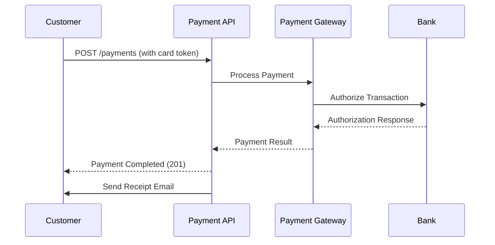
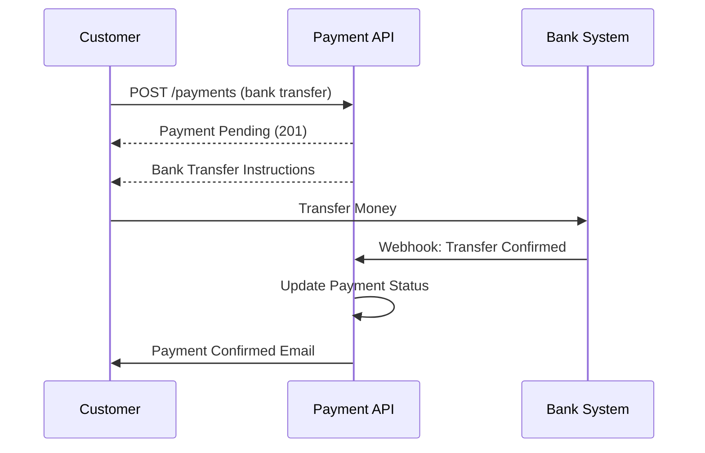

# Payment API

## Overview

The Payment API provides secure endpoints for processing payments, managing payment methods, and handling refunds. All payment operations are PCI-DSS compliant.

**Base Path**: `/api/v1/payments`

**Authentication**: Required for all endpoints

**Security**: All payment data is encrypted and tokenized

## Endpoints

### Process Payment

Process a payment for an order.

**Endpoint**: `POST /api/v1/payments`

**Authentication**: Required

**Request Body**:
```json
{
  "orderId": "order-789",
  "amount": 1995.00,
  "currency": "TWD",
  "paymentMethod": "CREDIT_CARD",
  "paymentDetails": {
    "cardToken": "tok_1234567890abcdef",
    "cardholderName": "John Doe",
    "billingAddress": {
      "street": "123 Main St",
      "city": "Taipei",
      "postalCode": "10001",
      "country": "TW"
    }
  },
  "savePaymentMethod": true
}
```

**Validation Rules**:
- `orderId`: Required, must exist
- `amount`: Required, must match order total
- `currency`: Required, must match order currency
- `paymentMethod`: Required (CREDIT_CARD, DEBIT_CARD, BANK_TRANSFER, CASH_ON_DELIVERY)
- `paymentDetails.cardToken`: Required for card payments (never send raw card numbers)

**Success Response** (201 Created):
```json
{
  "data": {
    "id": "pay-123",
    "orderId": "order-789",
    "amount": 1995.00,
    "currency": "TWD",
    "status": "COMPLETED",
    "paymentMethod": "CREDIT_CARD",
    "transactionId": "txn-abc123",
    "cardLast4": "4242",
    "cardBrand": "Visa",
    "receiptUrl": "https://api.ecommerce.com/api/v1/payments/pay-123/receipt",
    "createdAt": "2025-10-25T10:30:00Z",
    "completedAt": "2025-10-25T10:30:05Z"
  },
  "metadata": {
    "requestId": "req-abc-123",
    "timestamp": "2025-10-25T10:30:05Z",
    "version": "v1"
  }
}
```

**Error Responses**:
- `400 Bad Request`: Validation errors
- `401 Unauthorized`: Missing or invalid token
- `402 Payment Required`: Insufficient funds
- `409 Conflict`: Payment already processed
- `422 Unprocessable Entity`: Payment declined

**curl Example**:
```bash
curl -X POST https://api.ecommerce.com/api/v1/payments \
  -H "Authorization: Bearer YOUR_JWT_TOKEN" \
  -H "Content-Type: application/json" \
  -d '{
    "orderId": "order-789",
    "amount": 1995.00,
    "currency": "TWD",
    "paymentMethod": "CREDIT_CARD",
    "paymentDetails": {
      "cardToken": "tok_1234567890abcdef",
      "cardholderName": "John Doe"
    }
  }'
```

---

### Get Payment by ID

Retrieve payment details.

**Endpoint**: `GET /api/v1/payments/{id}`

**Authentication**: Required

**Authorization**: User can access own payments, or ADMIN role required

**Path Parameters**:
- `id`: Payment ID

**Success Response** (200 OK):
```json
{
  "data": {
    "id": "pay-123",
    "orderId": "order-789",
    "customerId": "cust-123",
    "amount": 1995.00,
    "currency": "TWD",
    "status": "COMPLETED",
    "paymentMethod": "CREDIT_CARD",
    "transactionId": "txn-abc123",
    "cardLast4": "4242",
    "cardBrand": "Visa",
    "cardExpiry": "12/2026",
    "billingAddress": {
      "street": "123 Main St",
      "city": "Taipei",
      "postalCode": "10001",
      "country": "TW"
    },
    "receiptUrl": "https://api.ecommerce.com/api/v1/payments/pay-123/receipt",
    "refundable": true,
    "refundedAmount": 0.00,
    "createdAt": "2025-10-25T10:30:00Z",
    "completedAt": "2025-10-25T10:30:05Z"
  }
}
```

**Error Responses**:
- `401 Unauthorized`: Missing or invalid token
- `403 Forbidden`: Insufficient permissions
- `404 Not Found`: Payment not found

**curl Example**:
```bash
curl -X GET https://api.ecommerce.com/api/v1/payments/pay-123 \
  -H "Authorization: Bearer YOUR_JWT_TOKEN"
```

---

### List Payments

Retrieve a paginated list of payments.

**Endpoint**: `GET /api/v1/payments`

**Authentication**: Required

**Authorization**: 
- Regular users see only their own payments
- ADMIN role can see all payments

**Query Parameters**:
- `page`: Page number (default: 0)
- `size`: Page size (default: 20)
- `sort`: Sort field (default: `createdAt,desc`)
- `status`: Filter by status (PENDING, PROCESSING, COMPLETED, FAILED, REFUNDED)
- `orderId`: Filter by order ID
- `customerId`: Filter by customer ID (ADMIN only)
- `startDate`: Filter payments after this date
- `endDate`: Filter payments before this date

**Success Response** (200 OK):
```json
{
  "data": {
    "content": [
      {
        "id": "pay-123",
        "orderId": "order-789",
        "amount": 1995.00,
        "currency": "TWD",
        "status": "COMPLETED",
        "paymentMethod": "CREDIT_CARD",
        "cardLast4": "4242",
        "createdAt": "2025-10-25T10:30:00Z"
      }
    ],
    "page": {
      "number": 0,
      "size": 20,
      "totalElements": 50,
      "totalPages": 3
    }
  }
}
```

**curl Example**:
```bash
curl -X GET "https://api.ecommerce.com/api/v1/payments?status=COMPLETED&page=0&size=20" \
  -H "Authorization: Bearer YOUR_JWT_TOKEN"
```

---

### Refund Payment

Process a full or partial refund.

**Endpoint**: `POST /api/v1/payments/{id}/refund`

**Authentication**: Required

**Authorization**: ADMIN or SUPPORT role required

**Path Parameters**:
- `id`: Payment ID

**Request Body**:
```json
{
  "amount": 1995.00,
  "reason": "Customer requested refund",
  "refundType": "FULL"
}
```

**Refund Types**:
- `FULL`: Refund entire payment amount
- `PARTIAL`: Refund specified amount

**Validation Rules**:
- `amount`: Required for partial refunds, must be <= original amount
- `reason`: Required, 10-500 characters
- Payment must be in COMPLETED status
- Cannot refund more than original amount

**Success Response** (200 OK):
```json
{
  "data": {
    "id": "refund-456",
    "paymentId": "pay-123",
    "orderId": "order-789",
    "amount": 1995.00,
    "currency": "TWD",
    "status": "PROCESSING",
    "reason": "Customer requested refund",
    "refundMethod": "ORIGINAL_PAYMENT_METHOD",
    "estimatedCompletionDate": "2025-11-01T00:00:00Z",
    "createdAt": "2025-10-25T14:00:00Z"
  }
}
```

**Error Responses**:
- `400 Bad Request`: Invalid refund amount
- `401 Unauthorized`: Missing or invalid token
- `403 Forbidden`: Insufficient permissions
- `404 Not Found`: Payment not found
- `409 Conflict`: Payment not refundable

**curl Example**:
```bash
curl -X POST https://api.ecommerce.com/api/v1/payments/pay-123/refund \
  -H "Authorization: Bearer ADMIN_JWT_TOKEN" \
  -H "Content-Type: application/json" \
  -d '{
    "amount": 1995.00,
    "reason": "Customer requested refund",
    "refundType": "FULL"
  }'
```

---

### Get Refund Status

Check the status of a refund.

**Endpoint**: `GET /api/v1/payments/refunds/{refundId}`

**Authentication**: Required

**Authorization**: User can access own refunds, or ADMIN role required

**Path Parameters**:
- `refundId`: Refund ID

**Success Response** (200 OK):
```json
{
  "data": {
    "id": "refund-456",
    "paymentId": "pay-123",
    "orderId": "order-789",
    "amount": 1995.00,
    "currency": "TWD",
    "status": "COMPLETED",
    "reason": "Customer requested refund",
    "refundMethod": "ORIGINAL_PAYMENT_METHOD",
    "transactionId": "refund-txn-xyz789",
    "createdAt": "2025-10-25T14:00:00Z",
    "completedAt": "2025-10-27T10:00:00Z"
  }
}
```

**Refund Status**:
- `PENDING`: Refund initiated
- `PROCESSING`: Being processed by payment gateway
- `COMPLETED`: Refund completed
- `FAILED`: Refund failed

**curl Example**:
```bash
curl -X GET https://api.ecommerce.com/api/v1/payments/refunds/refund-456 \
  -H "Authorization: Bearer YOUR_JWT_TOKEN"
```

---

### Save Payment Method

Save a payment method for future use.

**Endpoint**: `POST /api/v1/payments/methods`

**Authentication**: Required

**Request Body**:
```json
{
  "type": "CREDIT_CARD",
  "cardToken": "tok_1234567890abcdef",
  "cardholderName": "John Doe",
  "billingAddress": {
    "street": "123 Main St",
    "city": "Taipei",
    "postalCode": "10001",
    "country": "TW"
  },
  "setAsDefault": true
}
```

**Success Response** (201 Created):
```json
{
  "data": {
    "id": "pm-789",
    "customerId": "cust-123",
    "type": "CREDIT_CARD",
    "cardLast4": "4242",
    "cardBrand": "Visa",
    "cardExpiry": "12/2026",
    "isDefault": true,
    "createdAt": "2025-10-25T15:00:00Z"
  }
}
```

**Security Note**: Card details are tokenized and never stored in plain text.

**curl Example**:
```bash
curl -X POST https://api.ecommerce.com/api/v1/payments/methods \
  -H "Authorization: Bearer YOUR_JWT_TOKEN" \
  -H "Content-Type: application/json" \
  -d '{
    "type": "CREDIT_CARD",
    "cardToken": "tok_1234567890abcdef",
    "cardholderName": "John Doe",
    "setAsDefault": true
  }'
```

---

### List Payment Methods

Retrieve saved payment methods.

**Endpoint**: `GET /api/v1/payments/methods`

**Authentication**: Required

**Success Response** (200 OK):
```json
{
  "data": {
    "methods": [
      {
        "id": "pm-789",
        "type": "CREDIT_CARD",
        "cardLast4": "4242",
        "cardBrand": "Visa",
        "cardExpiry": "12/2026",
        "isDefault": true,
        "createdAt": "2025-10-25T15:00:00Z"
      },
      {
        "id": "pm-790",
        "type": "DEBIT_CARD",
        "cardLast4": "5555",
        "cardBrand": "Mastercard",
        "cardExpiry": "06/2027",
        "isDefault": false,
        "createdAt": "2025-10-20T10:00:00Z"
      }
    ]
  }
}
```

**curl Example**:
```bash
curl -X GET https://api.ecommerce.com/api/v1/payments/methods \
  -H "Authorization: Bearer YOUR_JWT_TOKEN"
```

---

### Delete Payment Method

Remove a saved payment method.

**Endpoint**: `DELETE /api/v1/payments/methods/{id}`

**Authentication**: Required

**Path Parameters**:
- `id`: Payment method ID

**Success Response** (204 No Content)

**Error Responses**:
- `401 Unauthorized`: Missing or invalid token
- `404 Not Found`: Payment method not found
- `409 Conflict`: Cannot delete default payment method (set another as default first)

**curl Example**:
```bash
curl -X DELETE https://api.ecommerce.com/api/v1/payments/methods/pm-789 \
  -H "Authorization: Bearer YOUR_JWT_TOKEN"
```

---

### Get Payment Receipt

Download payment receipt.

**Endpoint**: `GET /api/v1/payments/{id}/receipt`

**Authentication**: Required

**Authorization**: User can access own receipts, or ADMIN role required

**Path Parameters**:
- `id`: Payment ID

**Query Parameters**:
- `format`: Receipt format (PDF, HTML, default: PDF)

**Success Response** (200 OK):
- Content-Type: application/pdf or text/html
- Returns receipt document

**curl Example**:
```bash
# Download PDF receipt
curl -X GET "https://api.ecommerce.com/api/v1/payments/pay-123/receipt?format=PDF" \
  -H "Authorization: Bearer YOUR_JWT_TOKEN" \
  -o receipt.pdf

# View HTML receipt
curl -X GET "https://api.ecommerce.com/api/v1/payments/pay-123/receipt?format=HTML" \
  -H "Authorization: Bearer YOUR_JWT_TOKEN"
```

---

### Verify Payment

Verify payment status (for async payment methods).

**Endpoint**: `POST /api/v1/payments/{id}/verify`

**Authentication**: Required

**Path Parameters**:
- `id`: Payment ID

**Use Case**: For payment methods that require async verification (bank transfers, etc.)

**Success Response** (200 OK):
```json
{
  "data": {
    "id": "pay-123",
    "status": "COMPLETED",
    "verifiedAt": "2025-10-25T16:00:00Z",
    "transactionId": "txn-abc123"
  }
}
```

**curl Example**:
```bash
curl -X POST https://api.ecommerce.com/api/v1/payments/pay-123/verify \
  -H "Authorization: Bearer YOUR_JWT_TOKEN"
```

---

## Payment Flow

### Credit Card Payment Flow



### Bank Transfer Flow



## Data Models

### Payment Object

```json
{
  "id": "string",
  "orderId": "string",
  "customerId": "string",
  "amount": "number",
  "currency": "string",
  "status": "PENDING | PROCESSING | COMPLETED | FAILED | REFUNDED",
  "paymentMethod": "CREDIT_CARD | DEBIT_CARD | BANK_TRANSFER | CASH_ON_DELIVERY",
  "transactionId": "string",
  "cardLast4": "string",
  "cardBrand": "string",
  "cardExpiry": "string",
  "billingAddress": "Address",
  "receiptUrl": "string",
  "refundable": "boolean",
  "refundedAmount": "number",
  "createdAt": "string (ISO 8601)",
  "completedAt": "string (ISO 8601)",
  "failedAt": "string (ISO 8601)"
}
```

### Payment Status

| Status | Description | Next Possible Status |
|--------|-------------|---------------------|
| PENDING | Payment initiated | PROCESSING, FAILED |
| PROCESSING | Being processed | COMPLETED, FAILED |
| COMPLETED | Payment successful | REFUNDED |
| FAILED | Payment failed | - |
| REFUNDED | Payment refunded | - |

### Payment Methods

| Method | Code | Processing Time | Refund Time |
|--------|------|----------------|-------------|
| Credit Card | CREDIT_CARD | Instant | 5-7 days |
| Debit Card | DEBIT_CARD | Instant | 5-7 days |
| Bank Transfer | BANK_TRANSFER | 1-3 days | 3-5 days |
| Cash on Delivery | CASH_ON_DELIVERY | On delivery | N/A |

## Security Considerations

### PCI-DSS Compliance

1. **Never Send Raw Card Data**: Always use tokenized card data
2. **Use HTTPS**: All payment requests must use HTTPS
3. **Secure Token Storage**: Tokens are encrypted at rest
4. **Access Control**: Strict role-based access to payment data
5. **Audit Logging**: All payment operations are logged

### Card Tokenization

**Process**:
1. Customer enters card details on secure form
2. Frontend sends card data directly to payment gateway
3. Gateway returns a token
4. Frontend sends token to API (never raw card data)
5. API processes payment using token

**Example (Frontend)**:
```javascript
// Use payment gateway SDK to tokenize card
const token = await paymentGateway.createToken({
  cardNumber: '4242424242424242',
  expMonth: '12',
  expYear: '2026',
  cvc: '123'
});

// Send token to API (not raw card data)
const response = await fetch('/api/v1/payments', {
  method: 'POST',
  headers: {
    'Authorization': `Bearer ${accessToken}`,
    'Content-Type': 'application/json'
  },
  body: JSON.stringify({
    orderId: 'order-789',
    amount: 1995.00,
    paymentMethod: 'CREDIT_CARD',
    paymentDetails: {
      cardToken: token.id,  // Use token, not raw card
      cardholderName: 'John Doe'
    }
  })
});
```

### 3D Secure Authentication

For enhanced security, 3D Secure (3DS) authentication is supported:

1. Customer initiates payment
2. System checks if 3DS is required
3. Customer redirected to bank's 3DS page
4. Customer completes authentication
5. Customer redirected back to complete payment

## Business Rules

1. **Payment Timeout**: Pending payments expire after 24 hours
2. **Refund Window**: Refunds allowed within 30 days
3. **Partial Refunds**: Multiple partial refunds allowed up to original amount
4. **Failed Payment Retry**: Maximum 3 retry attempts
5. **Currency Matching**: Payment currency must match order currency

## Error Codes

| Code | Description | Solution |
|------|-------------|----------|
| `PAYMENT_DECLINED` | Card declined by bank | Try different card or contact bank |
| `PAYMENT_INSUFFICIENT_FUNDS` | Insufficient funds | Add funds or use different card |
| `PAYMENT_INVALID_CARD` | Invalid card details | Check card number and expiry |
| `PAYMENT_EXPIRED` | Payment session expired | Restart payment process |
| `PAYMENT_ALREADY_PROCESSED` | Payment already completed | Check payment status |
| `REFUND_AMOUNT_EXCEEDS_ORIGINAL` | Refund amount too high | Check original payment amount |
| `REFUND_NOT_ALLOWED` | Payment not refundable | Check refund eligibility |

## Testing

### Test Card Numbers

For testing in sandbox environment:

| Card Number | Brand | Result |
|-------------|-------|--------|
| 4242424242424242 | Visa | Success |
| 5555555555554444 | Mastercard | Success |
| 4000000000000002 | Visa | Declined |
| 4000000000009995 | Visa | Insufficient funds |

**Test Mode**: Use `test_` prefix for tokens in sandbox

## Related Documentation

- [Order API](orders.md) - Order management
- [Customer API](customers.md) - Customer management
- [Authentication](../authentication.md) - Authentication and authorization
- [Error Handling](../error-handling.md) - Error codes and troubleshooting
- [Security Perspective](../../../perspectives/security/) - Security architecture

---

**Last Updated**: 2025-10-25  
**API Version**: v1  
**PCI-DSS Compliance**: Level 1
