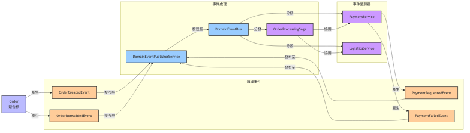

# 系統架構概覽

本文檔提供了對系統架構的高層次視圖，包括主要組件及其交互方式。

## 六角形架構（Hexagonal Architecture）

## 領域驅動設計架構

## 事件驅動架構

## 架構特點

### 六角形架構（端口和適配器）特點

1. **領域核心獨立性**：業務邏輯位於中心，不依賴於外部技術實現。
2. **端口定義抽象接口**：
   - 入站端口（Primary/Driving Ports）：定義系統對外提供的服務（如OrderManagementUseCase）。
   - 出站端口（Secondary/Driven Ports）：定義系統需要的外部依賴（如OrderPersistencePort）。
3. **適配器實現具體技術**：
   - 入站適配器（Primary/Driving Adapters）：處理外部請求（如REST控制器）。
   - 出站適配器（Secondary/Driven Adapters）：與外部系統交互（如數據庫存儲、外部服務）。
4. **可測試性**：業務邏輯可以獨立測試，不依賴於外部技術實現。
5. **技術替換簡單**：可以輕鬆替換技術實現，不影響核心業務邏輯。

### 領域驅動設計（DDD）特點

1. **豐富的領域模型**：使用聚合根、實體、值對象等概念建立豐富的領域模型。
2. **領域事件**：通過事件捕獲領域內發生的重要變化，實現模塊間鬆散耦合。
3. **聚合邊界**：明確定義一致性邊界，保證業務規則的完整性。
4. **領域服務**：處理不適合放在單一實體或值對象中的業務邏輯。
5. **防腐層（ACL）**：通過轉換層隔離外部系統，防止外部概念滲透到領域模型中。
6. **規格模式**：使用規格（Specification）封裝業務規則，提高可讀性和可維護性。

### 分層架構特點

1. **嚴格的依賴方向**：上層依賴下層，下層不依賴上層。
2. **分層結構**：
   - **介面層**：處理用戶交互，只依賴應用層。
   - **應用層**：協調領域對象完成用例，只依賴領域層。
   - **領域層**：包含業務核心邏輯和規則，不依賴其他層。
   - **基礎設施層**：提供技術實現，依賴領域層，實現領域層定義的接口。
3. **數據轉換**：
   - 每一層使用自己的數據模型（DTO）。
   - 層與層之間通過映射器（Mapper）進行數據轉換。
4. **關注點分離**：每一層有明確的職責，促進代碼組織和維護。

### 事件驅動架構特點

1. **事件溯源**：通過事件記錄系統狀態變化，可以重建系統狀態。
2. **鬆散耦合**：事件發布者不需要知道事件消費者，消費者訂閱感興趣的事件。
3. **擴展性**：可以輕鬆添加新的事件監聽器，不影響現有功能。
4. **SAGA模式**：通過事件協調跨聚合或跨系統的複雜業務流程。

### 整體架構優勢

1. **關注點分離**：每一層都有明確的職責，促進代碼組織和維護。
2. **模塊化**：系統被分解為鬆散耦合的模塊，便於開發和維護。
3. **適應複雜業務**：能夠處理複雜的業務邏輯和規則。
4. **演進架構**：系統可以隨著業務需求的變化而演進，不需要大規模重構。
5. **團隊協作**：不同的團隊可以專注於不同的模塊，減少衝突。
6. **持續交付**：支持增量開發和部署，促進持續交付。
7. **架構一致性**：通過架構測試確保系統符合預定的架構規則。
