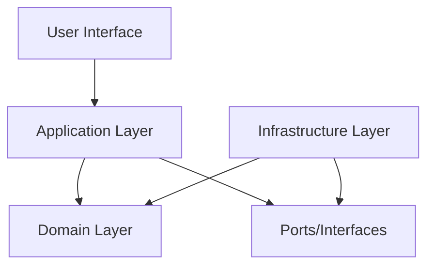

# ADR-001: DDD + Hexagonal Architecture Foundation

## Status

**Accepted** - 2024-01-15

## Context

The GenAI Demo project requires a robust software architecture that can:

- Handle complex e-commerce business logic with clear domain boundaries
- Support multiple interfaces (REST API, CMC frontend, Consumer frontend)
- Enable independent testing and deployment of business logic
- Facilitate team collaboration and code maintainability
- Support future microservices evolution

### Business Objectives

- Implement comprehensive e-commerce platform with customer management, order processing, inventory, and payment systems
- Support complex business rules like membership levels, promotions, and pricing strategies
- Enable rapid feature development while maintaining code quality
- Prepare for potential microservices decomposition

### Technical Constraints

- Java 21 and Spring Boot 3.4.5 technology stack
- Need for comprehensive testing strategy (Unit, Integration, BDD, Architecture)
- Multiple deployment environments (development, staging, production)
- Integration with external systems (payment gateways, logistics providers)

## Decision

We adopt **Domain-Driven Design (DDD) combined with Hexagonal Architecture** as our core software architecture pattern.

### Architecture Components

#### 1. DDD Tactical Patterns

```java
@AggregateRoot(name = "Customer", boundedContext = "Customer", version = "2.0")
public class Customer implements AggregateRootInterface {
    // Encapsulates customer business rules and invariants
    // Collects domain events for cross-aggregate communication
}

@ValueObject
public record CustomerId(String value) {
    // Immutable value object with validation
}

public record CustomerCreatedEvent(...) implements DomainEvent {
    // Domain event for cross-bounded context communication
}
```

#### 2. Hexagonal Architecture Layers

```
interfaces/     → Primary Adapters (REST Controllers, Web UI)
application/    → Use Cases and Application Services  
domain/         → Core Business Logic (Aggregates, Entities, Value Objects)
infrastructure/ → Secondary Adapters (Repositories, External Services)
```

#### 3. Dependency Flow



### Implementation Strategy

#### Domain Layer Design

- **Aggregates**: Customer, Order, Product, Inventory, Payment
- **Value Objects**: Money, CustomerId, OrderId, Email, Address
- **Domain Events**: CustomerCreated, OrderSubmitted, PaymentProcessed
- **Domain Services**: Complex business logic spanning multiple aggregates

#### Application Layer Design

- **Application Services**: Orchestrate use cases and coordinate aggregates
- **Command/Query Separation**: Clear separation of write and read operations
- **Event Publishing**: Publish domain events for cross-aggregate communication

#### Infrastructure Layer Design

- **Repository Adapters**: JPA implementations of domain repositories
- **External Service Adapters**: Payment gateways, logistics providers
- **Event Publishers**: Kafka for production, in-memory for development

## Consequences

### Positive Outcomes

#### Business Benefits

- **Clear Domain Boundaries**: Business logic is explicitly modeled and easily understood
- **Ubiquitous Language**: Consistent terminology between business and technical teams
- **Rapid Feature Development**: Well-defined patterns accelerate new feature implementation
- **Business Rule Integrity**: Aggregates ensure business invariants are maintained

#### Technical Benefits

- **Testability**: Hexagonal architecture enables comprehensive testing at all layers
- **Maintainability**: Clear separation of concerns reduces coupling and complexity
- **Flexibility**: Easy to swap implementations (databases, external services)
- **Evolution Path**: Natural progression to microservices along bounded context lines

#### Team Collaboration

- **Shared Understanding**: DDD patterns provide common vocabulary for developers
- **Independent Development**: Teams can work on different bounded contexts independently
- **Code Reviews**: Consistent patterns make code reviews more effective
- **Knowledge Transfer**: New team members can quickly understand the architecture

### Negative Outcomes

#### Complexity Overhead

- **Learning Curve**: Team needs training on DDD and hexagonal architecture concepts
- **Initial Development Speed**: More upfront design work required
- **Code Volume**: More interfaces and abstractions increase codebase size

#### Implementation Challenges

- **Aggregate Boundaries**: Requires careful analysis to define correct boundaries
- **Event Consistency**: Managing eventual consistency across aggregates
- **Performance Considerations**: Additional abstraction layers may impact performance

### Mitigation Strategies

- **Training Program**: Comprehensive DDD training for development team
- **Architecture Reviews**: Regular reviews to ensure pattern compliance
- **Performance Monitoring**: Continuous monitoring to identify bottlenecks
- **Incremental Adoption**: Gradual implementation starting with core domains

## Alternatives Considered

### 1. Traditional Layered Architecture

**Pros**: Simple, familiar to most developers
**Cons**: Tight coupling, difficult to test, business logic scattered across layers
**Verdict**: Rejected due to maintainability concerns

### 2. Clean Architecture

**Pros**: Similar benefits to hexagonal architecture
**Cons**: Less emphasis on domain modeling, more complex dependency rules
**Verdict**: Considered but DDD+Hexagonal provides better domain focus

### 3. Microservices from Start

**Pros**: Ultimate scalability and independence
**Cons**: Premature complexity, distributed system challenges
**Verdict**: Deferred - start with modular monolith, evolve to microservices

## Well-Architected Framework Assessment

### Operational Excellence

- **Automation**: Clear patterns enable automated testing and deployment
- **Monitoring**: Domain events provide excellent observability hooks
- **Documentation**: Self-documenting code through ubiquitous language

### Security

- **Principle of Least Privilege**: Hexagonal ports limit access to domain logic
- **Input Validation**: Value objects provide built-in validation
- **Audit Trail**: Domain events create comprehensive audit logs

### Reliability

- **Fault Isolation**: Bounded contexts limit failure blast radius
- **Data Consistency**: Aggregates ensure transactional consistency
- **Recovery**: Event sourcing enables system state reconstruction

### Performance Efficiency

- **Caching Strategy**: Clear read/write separation enables effective caching
- **Resource Optimization**: Aggregate boundaries optimize database access patterns
- **Scalability**: Bounded contexts provide natural scaling boundaries

### Cost Optimization

- **Development Efficiency**: Reduced debugging and maintenance costs
- **Resource Utilization**: Efficient aggregate design minimizes resource usage
- **Team Productivity**: Clear patterns reduce development time

## Implementation Guidelines

### Aggregate Design Rules

1. **Single Responsibility**: Each aggregate manages one business concept
2. **Consistency Boundary**: Maintain invariants within aggregate boundaries
3. **Event-Driven Communication**: Use domain events for cross-aggregate operations
4. **Size Optimization**: Keep aggregates small for performance

### Testing Strategy

```java
// Unit Tests - Domain Logic
@Test
void shouldUpgradeMembershipWhenSpendingThresholdReached() {
    // Test pure business logic without infrastructure
}

// Integration Tests - Application Services
@Test
void shouldProcessOrderWithInventoryReservation() {
    // Test use case orchestration
}

// Architecture Tests - Pattern Compliance
@Test
void domainLayerShouldNotDependOnInfrastructure() {
    // Validate architectural constraints
}
```

### Event Design Patterns

```java
// Event-First Design
public record CustomerSpendingUpdatedEvent(
    CustomerId customerId,
    Money newTotalSpending,
    Money previousTotalSpending,
    UUID eventId,
    LocalDateTime occurredOn
) implements DomainEvent {
    
    public static CustomerSpendingUpdatedEvent create(
        CustomerId customerId, 
        Money newTotal, 
        Money previousTotal
    ) {
        var metadata = DomainEvent.createEventMetadata();
        return new CustomerSpendingUpdatedEvent(
            customerId, newTotal, previousTotal,
            metadata.eventId(), metadata.occurredOn()
        );
    }
}
```

## Related Decisions

- [ADR-002: Bounded Context Design Strategy](./ADR-002-bounded-context-design.md)
- [ADR-003: Domain Events and CQRS Implementation](./ADR-003-domain-events-cqrs.md)
- [ADR-004: Spring Boot Profile Configuration Strategy](./ADR-004-spring-boot-profiles.md)

## References

- [Domain-Driven Design by Eric Evans](https://www.domainlanguage.com/ddd/)
- [Hexagonal Architecture by Alistair Cockburn](https://alistair.cockburn.us/hexagonal-architecture/)
- [Implementing Domain-Driven Design by Vaughn Vernon](https://www.informit.com/store/implementing-domain-driven-design-9780321834577)
- [Clean Architecture by Robert Martin](https://blog.cleancoder.com/uncle-bob/2012/08/13/the-clean-architecture.html)
