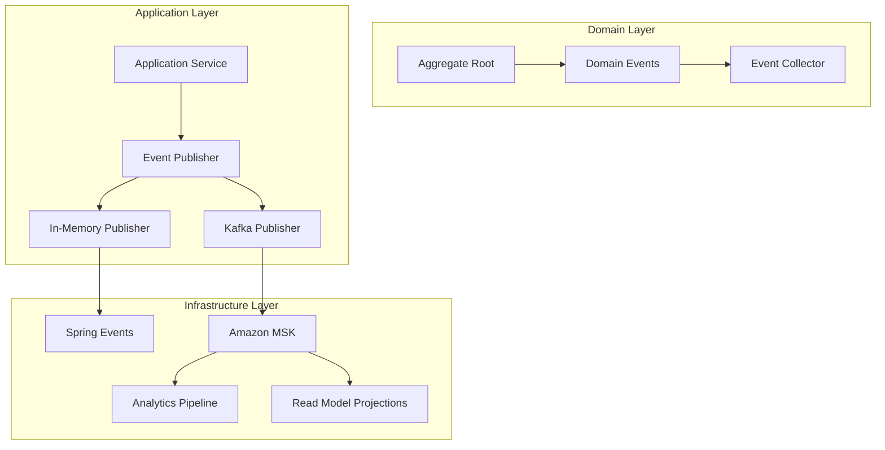

# ADR-003: Domain Events and CQRS Implementation

## Status

**Accepted** - 2024-01-15

## Context

The GenAI Demo e-commerce platform requires robust event-driven architecture to handle complex business workflows, cross-aggregate communication, and eventual consistency across bounded contexts. The system must support both development and production environments with different event publishing strategies.

### Business Requirements

- **Cross-Aggregate Coordination**: Order processing involves Customer, Inventory, Payment, and Delivery contexts
- **Audit Trail**: Complete business event history for compliance and analytics
- **Real-time Analytics**: Business intelligence dashboards require real-time event streaming
- **Scalability**: Event-driven architecture to support future microservices evolution

### Technical Requirements

- **Development Environment**: Simple, fast event processing for debugging
- **Production Environment**: Reliable, scalable event streaming with MSK
- **Event Sourcing**: Capability to rebuild aggregate state from events
- **CQRS**: Separate read and write models for optimal performance

## Decision

We implement **Domain Events with CQRS pattern** using profile-based event publishing strategies and comprehensive event sourcing capabilities.

### Architecture Overview



### Implementation Strategy

#### 1. Domain Event Design

**Event Interface**

```java
public interface DomainEvent extends Serializable {
    UUID getEventId();
    LocalDateTime getOccurredOn();
    String getEventType();
    String getAggregateId();
    
    static EventMetadata createEventMetadata() {
        return new EventMetadata(UUID.randomUUID(), LocalDateTime.now());
    }
    
    record EventMetadata(UUID eventId, LocalDateTime occurredOn) {}
}
```

**Event Implementation (Records)**

```java
public record CustomerCreatedEvent(
    CustomerId customerId,
    CustomerName customerName,
    Email email,
    MembershipLevel membershipLevel,
    UUID eventId,
    LocalDateTime occurredOn
) implements DomainEvent {
    
    public static CustomerCreatedEvent create(
        CustomerId customerId, 
        CustomerName customerName, 
        Email email,
        MembershipLevel membershipLevel
    ) {
        DomainEvent.EventMetadata metadata = DomainEvent.createEventMetadata();
        return new CustomerCreatedEvent(
            customerId, customerName, email, membershipLevel,
            metadata.eventId(), metadata.occurredOn()
        );
    }
    
    @Override
    public String getEventType() {
        return "CustomerCreated";
    }
    
    @Override
    public String getAggregateId() {
        return customerId.getValue();
    }
}
```

#### 2. Aggregate Root Event Collection

**Event Collection Pattern**

```java
@AggregateRoot(name = "Customer", boundedContext = "Customer", version = "2.0")
public class Customer implements AggregateRootInterface {
    
    private final AggregateStateTracker<Customer> stateTracker = 
        new AggregateStateTracker<>(this);
    
    public void updateProfile(CustomerName newName, Email newEmail, Phone newPhone) {
        // 1. Execute business logic first
        validateProfileUpdate(newName, newEmail, newPhone);
        
        // 2. Update state
        this.name = newName;
        this.email = newEmail;
        this.phone = newPhone;
        
        // 3. Collect domain event
        collectEvent(CustomerProfileUpdatedEvent.create(
            this.id, newName, newEmail, newPhone
        ));
    }
    
    public void upgradeMembership(MembershipLevel newLevel) {
        if (canUpgradeToLevel(newLevel)) {
            MembershipLevel previousLevel = this.membershipLevel;
            this.membershipLevel = newLevel;
            
            collectEvent(MembershipLevelUpgradedEvent.create(
                this.id, previousLevel, newLevel, this.totalSpending
            ));
        }
    }
}
```

#### 3. Profile-Based Event Publishing

**Development Profile - In-Memory Publisher**

```java
@Component
@Profile("dev")
public class InMemoryDomainEventPublisher implements DomainEventPublisher {
    
    private final ApplicationEventPublisher springEventPublisher;
    
    @Override
    public void publish(DomainEvent event) {
        log.debug("Publishing event in-memory: {}", event.getEventType());
        springEventPublisher.publishEvent(event);
    }
    
    @Override
    public void publishAll(List<DomainEvent> events) {
        events.forEach(this::publish);
    }
}
```

**Production Profile - Kafka Publisher**

```java
@Component
@Profile("production")
public class KafkaDomainEventPublisher implements DomainEventPublisher {
    
    private final KafkaTemplate<String, DomainEvent> kafkaTemplate;
    private final DeadLetterService deadLetterService;
    
    @Override
    @Retryable(
        value = {TransientException.class},
        maxAttempts = 3,
        backoff = @Backoff(delay = 1000, multiplier = 2)
    )
    public void publish(DomainEvent event) {
        String topic = getTopicForEvent(event);
        
        kafkaTemplate.send(topic, event.getAggregateId(), event)
            .addCallback(
                result -> log.info("Event published: {}", event.getEventId()),
                failure -> handlePublishFailure(event, failure)
            );
    }
    
    private String getTopicForEvent(DomainEvent event) {
        return "genai-demo." + event.getEventType().toLowerCase();
    }
    
    @Recover
    public void recover(TransientException ex, DomainEvent event) {
        log.error("All retry attempts failed for event: {}", event.getEventId());
        deadLetterService.send(event, ex);
    }
}
```

#### 4. Application Service Integration

**Event Publishing in Application Services**

```java
@Service
@Transactional
public class CustomerApplicationService {
    
    private final CustomerRepository customerRepository;
    private final DomainEventApplicationService domainEventService;
    
    public void updateCustomerProfile(UpdateProfileCommand command) {
        // 1. Load aggregate
        Customer customer = customerRepository.findById(command.customerId())
            .orElseThrow(() -> new CustomerNotFoundException(command.customerId()));
        
        // 2. Execute business operation (events are collected)
        customer.updateProfile(command.name(), command.email(), command.phone());
        
        // 3. Save aggregate
        customerRepository.save(customer);
        
        // 4. Publish collected events
        domainEventService.publishEventsFromAggregate(customer);
    }
}
```

#### 5. Cross-Context Event Handling

**Event Handler Implementation**

```java
@Component
public class CustomerEventHandler extends AbstractDomainEventHandler<CustomerCreatedEvent> {
    
    private final NotificationService notificationService;
    private final AnalyticsService analyticsService;
    
    @Override
    @TransactionalEventListener(phase = TransactionPhase.AFTER_COMMIT)
    public void handle(CustomerCreatedEvent event) {
        // Implement idempotency check
        if (isEventAlreadyProcessed(event.getEventId())) {
            return;
        }
        
        try {
            // Send welcome notification
            notificationService.sendWelcomeEmail(
                event.email(), event.customerName()
            );
            
            // Update analytics
            analyticsService.recordCustomerRegistration(event);
            
            // Create customer statistics record
            customerStatsService.createStatsRecord(event.customerId());
            
            // Mark event as processed
            markEventAsProcessed(event.getEventId());
            
        } catch (Exception e) {
            log.error("Error processing CustomerCreatedEvent", e);
            throw new DomainEventProcessingException("Failed to process customer creation", e);
        }
    }
    
    @Override
    public Class<CustomerCreatedEvent> getSupportedEventType() {
        return CustomerCreatedEvent.class;
    }
}
```

#### 6. CQRS Read Model Projections

**Order Summary Projection**

```java
@Component
public class OrderSummaryProjectionHandler {
    
    private final OrderSummaryRepository orderSummaryRepository;
    
    @EventHandler
    public void on(OrderCreatedEvent event) {
        OrderSummary summary = OrderSummary.builder()
            .orderId(event.orderId())
            .customerId(event.customerId())
            .status(event.status())
            .totalAmount(event.totalAmount())
            .createdAt(event.occurredOn())
            .build();
            
        orderSummaryRepository.save(summary);
    }
    
    @EventHandler
    public void on(OrderStatusChangedEvent event) {
        OrderSummary summary = orderSummaryRepository.findById(event.orderId())
            .orElseThrow(() -> new OrderSummaryNotFoundException(event.orderId()));
            
        summary.updateStatus(event.newStatus(), event.occurredOn());
        orderSummaryRepository.save(summary);
    }
}
```

#### 7. Event Sourcing Implementation

**Event Store Interface**

```java
public interface EventStore {
    void store(DomainEvent event);
    List<DomainEvent> getEventsForAggregate(String aggregateId);
    List<DomainEvent> getEventsByType(String eventType);
    List<DomainEvent> getAllEvents();
}
```

**JPA Event Store (Development)**

```java
@Component
@Profile("development")
public class JpaEventStore implements EventStore {
    
    private final StoredEventRepository repository;
    private final ObjectMapper objectMapper;
    
    @Override
    @Transactional
    public void store(DomainEvent event) {
        StoredEvent storedEvent = new StoredEvent(
            event.getEventId().toString(),
            event.getEventType(),
            event.getAggregateId(),
            getAggregateType(event),
            serializeEvent(event),
            event.getOccurredOn(),
            getNextVersion(event.getAggregateId())
        );
        
        repository.save(storedEvent);
    }
    
    @Override
    public List<DomainEvent> getEventsForAggregate(String aggregateId) {
        return repository.findByAggregateIdOrderByVersionAsc(aggregateId)
            .stream()
            .map(this::deserializeEvent)
            .toList();
    }
}
```

**Aggregate Reconstruction**

```java
@Component
public class AggregateReconstruction {
    
    private final EventStore eventStore;
    
    public <T extends AggregateRootInterface> T reconstructAggregate(
        String aggregateId, 
        Class<T> aggregateType
    ) {
        List<DomainEvent> events = eventStore.getEventsForAggregate(aggregateId);
        
        if (events.isEmpty()) {
            throw new AggregateNotFoundException(aggregateId);
        }
        
        T aggregate = createEmptyAggregate(aggregateType);
        
        for (DomainEvent event : events) {
            aggregate.apply(event);
        }
        
        aggregate.markEventsAsCommitted();
        return aggregate;
    }
}
```

## Consequences

### Positive Outcomes

#### Business Benefits

- **Audit Trail**: Complete business event history for compliance
- **Real-time Analytics**: Immediate business intelligence updates
- **Process Flexibility**: Easy to modify business workflows
- **Scalability**: Event-driven architecture supports growth

#### Technical Benefits

- **Loose Coupling**: Bounded contexts communicate through events
- **Eventual Consistency**: Proper handling of distributed data
- **Testability**: Easy to test event-driven workflows
- **Observability**: Events provide excellent monitoring hooks

#### Development Benefits

- **Profile Separation**: Different strategies for dev/prod environments
- **Debugging**: In-memory events simplify development debugging
- **Performance**: Optimized read models through CQRS
- **Maintainability**: Clear separation of command and query responsibilities

### Negative Outcomes

#### Complexity Challenges

- **Eventual Consistency**: Requires careful handling of timing issues
- **Event Ordering**: Complex event sequencing across aggregates
- **Error Handling**: Distributed error handling complexity
- **Debugging**: Cross-context debugging can be challenging

#### Operational Challenges

- **Event Schema Evolution**: Managing event format changes over time
- **Dead Letter Handling**: Failed event processing management
- **Performance**: Event processing overhead
- **Storage**: Event store storage requirements

### Mitigation Strategies

#### Technical Mitigations

- **Event Versioning**: Schema evolution with backward compatibility
- **Idempotency**: All event handlers are idempotent
- **Circuit Breakers**: Prevent cascade failures
- **Monitoring**: Comprehensive event processing monitoring

#### Operational Mitigations

- **Dead Letter Queues**: Failed event recovery mechanisms
- **Event Replay**: Capability to replay events for recovery
- **Performance Monitoring**: Track event processing performance
- **Storage Optimization**: Event store archival strategies

## Event Design Patterns

### 1. Event-First Design

```java
// Design events before implementing business logic
public record CustomerSpendingUpdatedEvent(
    CustomerId customerId,
    Money newTotalSpending,
    Money previousTotalSpending,
    MembershipLevel previousLevel,
    MembershipLevel newLevel,
    UUID eventId,
    LocalDateTime occurredOn
) implements DomainEvent {
    
    public boolean isMembershipUpgrade() {
        return newLevel.isHigherThan(previousLevel);
    }
}
```

### 2. Event Enrichment

```java
// Include all necessary data in events
public record OrderSubmittedEvent(
    OrderId orderId,
    CustomerId customerId,
    List<OrderItem> items,
    Money totalAmount,
    Money discountAmount,
    String shippingAddress,
    PaymentMethod paymentMethod,
    UUID eventId,
    LocalDateTime occurredOn
) implements DomainEvent {
    // Event contains all data needed by handlers
}
```

### 3. Event Correlation

```java
// Correlate related events
public record PaymentProcessedEvent(
    PaymentId paymentId,
    OrderId orderId,        // Correlation ID
    CustomerId customerId,  // Correlation ID
    Money amount,
    PaymentStatus status,
    UUID eventId,
    LocalDateTime occurredOn
) implements DomainEvent {
    // Multiple correlation IDs for flexible querying
}
```

## Well-Architected Framework Assessment

### Operational Excellence

- **Monitoring**: Events provide comprehensive system observability
- **Automation**: Event-driven automation and orchestration
- **Documentation**: Events serve as living documentation of business processes

### Security

- **Audit Trail**: Complete audit log through event history
- **Data Protection**: Sensitive data handling in event payloads
- **Access Control**: Event-based access control patterns

### Reliability

- **Fault Tolerance**: Event replay capability for recovery
- **Consistency**: Eventual consistency patterns
- **Backup**: Event store provides natural backup mechanism

### Performance Efficiency

- **CQRS**: Optimized read and write models
- **Async Processing**: Non-blocking event processing
- **Caching**: Event-based cache invalidation

### Cost Optimization

- **Resource Efficiency**: Event-driven scaling
- **Storage Optimization**: Event store lifecycle management
- **Processing Efficiency**: Targeted event processing

## Related Decisions

- [ADR-001: DDD + Hexagonal Architecture Foundation](./ADR-001-ddd-hexagonal-architecture.md)
- [ADR-002: Bounded Context Design Strategy](./ADR-002-bounded-context-design.md)
- \1

## References

- [Domain Events Pattern](https://martinfowler.com/eaaDev/DomainEvent.html)
- [CQRS Pattern](https://martinfowler.com/bliki/CQRS.html)
- [Event Sourcing](https://martinfowler.com/eaaDev/EventSourcing.html)
- [Implementing Domain-Driven Design](https://www.informit.com/store/implementing-domain-driven-design-9780321834577)
