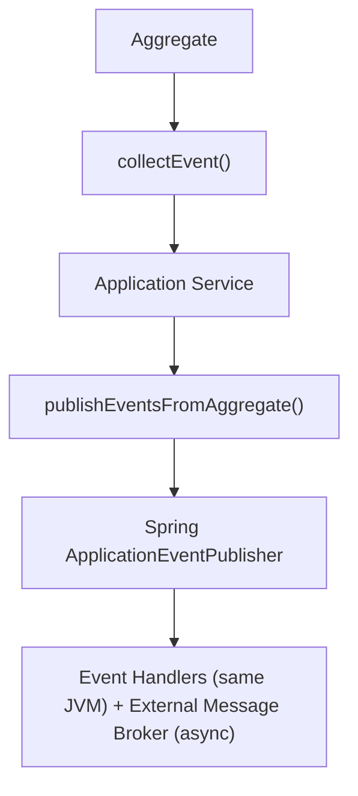

# ADR-003: Use Domain Events for Cross-Context Communication

## Status

**Accepted** - 2025-10-24

## Context

### Problem Statement

The Enterprise E-Commerce Platform consists of 13 bounded contexts that need to communicate and stay synchronized. We need a mechanism that:

- Maintains loose coupling between bounded contexts
- Ensures eventual consistency across contexts
- Supports asynchronous processing for scalability
- Enables audit trails and event sourcing capabilities
- Allows new contexts to subscribe to events without modifying existing code
- Preserves domain knowledge in the event stream

### Business Context

**Business Drivers**:

- Need for independent development and deployment of bounded contexts
- Requirement for audit trails and compliance (GDPR, PCI-DSS)
- Expected high transaction volume (1000+ orders/second at peak)
- Need for real-time notifications and analytics
- Support for eventual consistency in distributed system

**Constraints**:

- Must integrate with existing AWS infrastructure
- Team has limited experience with event-driven architecture
- Need to maintain data consistency across contexts
- Must support both synchronous and asynchronous operations

### Technical Context

**Current State**:

- Hexagonal Architecture adopted (ADR-002)
- PostgreSQL for primary database (ADR-001)
- 13 bounded contexts identified
- Spring Boot 3.4.5 + Java 21

**Requirements**:

- Loose coupling between bounded contexts
- Eventual consistency support
- Event replay capability
- Scalable event processing
- Event versioning support
- Dead letter queue for failed events

## Decision Drivers

1. **Loose Coupling**: Bounded contexts should not directly depend on each other
2. **Scalability**: System must handle high event volumes
3. **Auditability**: Complete audit trail of all business events
4. **Flexibility**: Easy to add new event consumers
5. **Consistency**: Eventual consistency across contexts
6. **Reliability**: Guaranteed event delivery
7. **Evolution**: Support for event schema evolution
8. **DDD Alignment**: Events represent domain concepts

## Considered Options

### Option 1: Domain Events with Event Bus

**Description**: Use domain events published through an in-process event bus (Spring ApplicationEventPublisher) with optional external messaging

**Architecture**:



**Pros**:

- ✅ Aligns perfectly with DDD tactical patterns
- ✅ Events are first-class domain concepts
- ✅ Loose coupling between bounded contexts
- ✅ Easy to add new event handlers
- ✅ Supports both sync and async processing
- ✅ Built-in Spring Boot support
- ✅ Testable in isolation
- ✅ Event sourcing ready

**Cons**:

- ⚠️ Requires external message broker for cross-service events
- ⚠️ Need to handle event versioning
- ⚠️ Eventual consistency complexity

**Cost**: Low - leverages Spring Boot features

**Risk**: **Low** - Well-established pattern in DDD

### Option 2: Direct REST API Calls

**Description**: Bounded contexts communicate via synchronous REST API calls

**Pros**:

- ✅ Simple to implement
- ✅ Immediate consistency
- ✅ Easy to debug

**Cons**:

- ❌ Tight coupling between contexts
- ❌ Cascading failures
- ❌ Poor scalability
- ❌ No audit trail
- ❌ Difficult to add new consumers
- ❌ Violates bounded context independence

**Cost**: Low initial, high maintenance

**Risk**: **High** - Creates distributed monolith

### Option 3: Shared Database

**Description**: Multiple contexts share the same database tables

**Pros**:

- ✅ Immediate consistency
- ✅ Simple queries across contexts

**Cons**:

- ❌ Violates bounded context boundaries
- ❌ Tight coupling at data level
- ❌ Cannot deploy contexts independently
- ❌ Schema changes affect multiple contexts
- ❌ No clear ownership
- ❌ Violates DDD principles

**Cost**: Low initial, very high maintenance

**Risk**: **Critical** - Destroys bounded context isolation

### Option 4: Message Queue Only (No Domain Events)

**Description**: Direct publishing to message queue without domain events

**Pros**:

- ✅ Loose coupling
- ✅ Asynchronous processing
- ✅ Scalable

**Cons**:

- ❌ Events not part of domain model
- ❌ Violates DDD principles
- ❌ Harder to test
- ❌ No in-process event handling
- ❌ Infrastructure concerns leak into domain

**Cost**: Medium

**Risk**: **Medium** - Misses DDD benefits

## Decision Outcome

**Chosen Option**: **Domain Events with Event Bus**

### Rationale

Domain Events were selected for the following reasons:

1. **DDD Alignment**: Events are first-class domain concepts, not infrastructure concerns
2. **Loose Coupling**: Bounded contexts communicate through events, not direct calls
3. **Flexibility**: New event handlers can be added without modifying existing code
4. **Auditability**: Complete event stream provides audit trail
5. **Scalability**: Asynchronous event processing supports high volumes
6. **Testability**: Events can be tested in isolation without infrastructure
7. **Evolution**: Event versioning supports schema evolution
8. **Hexagonal Architecture Fit**: Events flow through ports and adapters naturally

**Implementation Strategy**:

- Aggregates collect events during business operations
- Application services publish events after successful transactions
- Spring ApplicationEventPublisher for in-process events
- External message broker (Kafka) for cross-service events
- Event handlers in infrastructure layer

**Why Not REST**: Direct REST calls create tight coupling and cascading failures. Events provide loose coupling and better scalability.

**Why Not Shared Database**: Violates bounded context boundaries and prevents independent deployment.

## Impact Analysis

### Stakeholder Impact

| Stakeholder | Impact Level | Description | Mitigation |
|-------------|--------------|-------------|------------|
| Development Team | High | Need to learn event-driven patterns | Training, examples, pair programming |
| Architects | Positive | Clear communication patterns | Event catalog, documentation |
| QA Team | Medium | Need to test eventual consistency | Testing guides, event replay tools |
| Operations | Medium | Monitor event processing | Dashboards, alerts for event lag |
| Business | Positive | Better audit trails | Event-based reporting |

### Impact Radius

**Selected Impact Radius**: **System**

Affects:

- All bounded contexts (event publishing and handling)
- Application services (event publishing)
- Infrastructure layer (event handlers)
- Testing strategy (event-based testing)
- Monitoring (event metrics)

### Risk Assessment

| Risk | Probability | Impact | Mitigation Strategy |
|------|-------------|--------|---------------------|
| Eventual consistency bugs | Medium | High | Comprehensive testing, event replay, monitoring |
| Event versioning issues | Medium | Medium | Schema evolution strategy, event upcasting |
| Event ordering problems | Low | Medium | Use event timestamps, idempotent handlers |
| Event loss | Low | Critical | Reliable message broker, dead letter queue |
| Performance degradation | Low | Medium | Async processing, event batching |

**Overall Risk Level**: **Low**

## Implementation Plan

### Phase 1: Foundation (Week 1-2)

- [x] Define DomainEvent interface
- [x] Create AggregateRoot base class with event collection
- [x] Implement DomainEventApplicationService for publishing
- [x] Set up Spring ApplicationEventPublisher integration
- [x] Create example events (CustomerCreated, OrderSubmitted)

### Phase 2: Event Handlers (Week 3-4)

- [x] Create AbstractDomainEventHandler base class
- [x] Implement event handlers for Customer context
- [x] Implement event handlers for Order context
- [x] Add idempotency checks
- [x] Implement retry mechanism

### Phase 3: External Messaging (Week 5-6)

- [ ] Integrate with Kafka (ADR-005)
- [ ] Implement event publisher adapter
- [ ] Implement event consumer adapter
- [ ] Add dead letter queue
- [ ] Set up monitoring

### Phase 4: Event Sourcing (Future)

- [ ] Implement event store
- [ ] Add event replay capability
- [ ] Create event-based projections
- [ ] Implement CQRS patterns

### Rollback Strategy

**Trigger Conditions**:

- Eventual consistency causes critical business issues
- Event processing lag > 5 minutes consistently
- Event loss > 0.1%
- Team unable to manage complexity

**Rollback Steps**:

1. Switch to synchronous REST calls for critical paths
2. Keep events for audit trail only
3. Simplify event handlers
4. Re-evaluate after addressing issues

**Rollback Time**: 1 week

## Monitoring and Success Criteria

### Success Metrics

- ✅ Event publishing success rate > 99.9%
- ✅ Event processing lag < 1 second (95th percentile)
- ✅ Zero event loss
- ✅ Event handler idempotency 100%
- ✅ New event handlers added without modifying existing code
- ✅ Complete audit trail of all business events

### Monitoring Plan

**Event Metrics**:

```java
@Component
public class EventMetrics {
    private final Counter eventsPublished;
    private final Counter eventsProcessed;
    private final Counter eventsFailed;
    private final Timer eventProcessingTime;
    
    // Track event publishing and processing
}
```

**Alerts**:

- Event processing lag > 5 seconds
- Event failure rate > 1%
- Dead letter queue size > 100
- Event handler execution time > 1 second

**Review Schedule**:

- Daily: Check event processing metrics
- Weekly: Review failed events
- Monthly: Event schema evolution review
- Quarterly: Event-driven architecture review

## Consequences

### Positive Consequences

- ✅ **Loose Coupling**: Bounded contexts are independent
- ✅ **Scalability**: Asynchronous processing handles high volumes
- ✅ **Auditability**: Complete event stream for compliance
- ✅ **Flexibility**: Easy to add new event consumers
- ✅ **Testability**: Events can be tested in isolation
- ✅ **Evolution**: Event versioning supports schema changes
- ✅ **DDD Alignment**: Events are domain concepts
- ✅ **Resilience**: Failures don't cascade across contexts

### Negative Consequences

- ⚠️ **Eventual Consistency**: Not all operations are immediately consistent
- ⚠️ **Complexity**: More moving parts to manage
- ⚠️ **Debugging**: Harder to trace event flows
- ⚠️ **Testing**: Need to test eventual consistency scenarios
- ⚠️ **Event Versioning**: Need to manage schema evolution

### Technical Debt

**Identified Debt**:

1. No event store yet (acceptable for MVP)
2. Manual event versioning (can be improved with schema registry)
3. Limited event replay capability (future enhancement)

**Debt Repayment Plan**:

- **Q2 2026**: Implement event store for event sourcing
- **Q3 2026**: Add schema registry for event versioning
- **Q4 2026**: Implement event replay and CQRS patterns

## Related Decisions

- [ADR-002: Adopt Hexagonal Architecture](002-adopt-hexagonal-architecture.md) - Events flow through ports and adapters
- [ADR-005: Use Apache Kafka for Event Streaming](005-use-kafka-for-event-streaming.md) - External message broker
- [ADR-001: Use PostgreSQL for Primary Database](001-use-postgresql-for-primary-database.md) - Event persistence

## Notes

### Event Structure

```java
public record CustomerCreatedEvent(
    CustomerId customerId,
    CustomerName customerName,
    Email email,
    MembershipLevel membershipLevel,
    UUID eventId,
    LocalDateTime occurredOn
) implements DomainEvent {
    
    public static CustomerCreatedEvent create(
        CustomerId customerId,
        CustomerName customerName,
        Email email,
        MembershipLevel membershipLevel
    ) {
        var metadata = DomainEvent.createEventMetadata();
        return new CustomerCreatedEvent(
            customerId, customerName, email, membershipLevel,
            metadata.eventId(), metadata.occurredOn()
        );
    }
}
```

### Event Publishing Flow

```java
// 1. Aggregate collects events
public class Customer extends AggregateRoot {
    public void register() {
        // Business logic
        collectEvent(CustomerCreatedEvent.create(id, name, email, level));
    }
}

// 2. Application service publishes events
@Service
@Transactional
public class CustomerApplicationService {
    public void registerCustomer(RegisterCustomerCommand command) {
        Customer customer = new Customer(command);
        customerRepository.save(customer);
        eventService.publishEventsFromAggregate(customer);
    }
}

// 3. Event handler processes events
@Component
public class CustomerCreatedEventHandler extends AbstractDomainEventHandler<CustomerCreatedEvent> {
    @Override
    @TransactionalEventListener(phase = TransactionPhase.AFTER_COMMIT)
    public void handle(CustomerCreatedEvent event) {
        // Send welcome email
        // Create reward account
        // Update analytics
    }
}
```

### Event Versioning Strategy

**Schema Evolution Pattern**:

```java
// V1: Original event
public record CustomerCreatedEvent(
    CustomerId customerId,
    CustomerName customerName,
    Email email,
    MembershipLevel membershipLevel,
    UUID eventId,
    LocalDateTime occurredOn
) implements DomainEvent { }

// V2: Add optional fields
public record CustomerCreatedEvent(
    CustomerId customerId,
    CustomerName customerName,
    Email email,
    MembershipLevel membershipLevel,
    Optional<LocalDate> birthDate,  // New field
    Optional<Address> address,      // New field
    UUID eventId,
    LocalDateTime occurredOn
) implements DomainEvent { }
```

### Event Catalog

| Event | Publisher | Consumers | Description |
|-------|-----------|-----------|-------------|
| CustomerCreated | Customer Context | Email, Reward, Analytics | New customer registered |
| OrderSubmitted | Order Context | Inventory, Payment, Notification | Order placed |
| PaymentProcessed | Payment Context | Order, Accounting | Payment completed |
| InventoryReserved | Inventory Context | Order, Logistics | Items reserved |
| OrderShipped | Logistics Context | Customer, Notification | Order shipped |

---

**Document Status**: ✅ Accepted  
**Last Reviewed**: 2025-10-24  
**Next Review**: 2026-01-24 (Quarterly)
