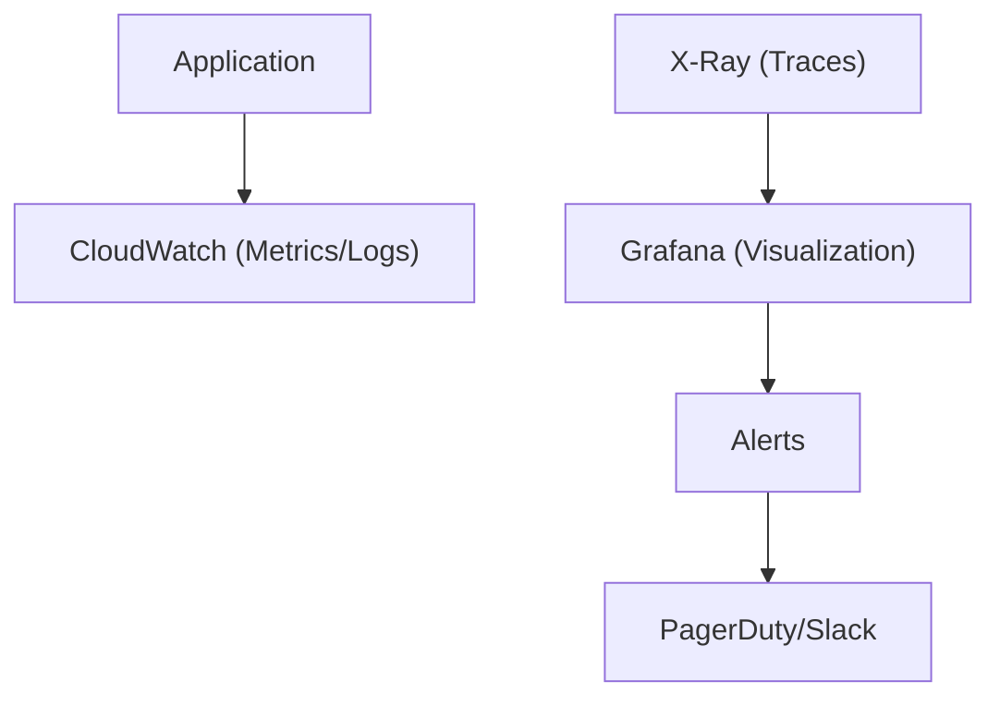

# ADR-008: Use CloudWatch + X-Ray + Grafana for Observability

## Status

**Accepted** - 2025-10-24

## Context

### Problem Statement

The Enterprise E-Commerce Platform requires comprehensive observability to:

- Monitor system health and performance in real-time
- Trace requests across distributed services
- Detect and diagnose issues quickly
- Provide business and technical metrics
- Support SLA compliance (99.9% uptime)
- Enable proactive alerting and incident response
- Visualize metrics in intuitive dashboards
- Support debugging and troubleshooting

### Business Context

**Business Drivers**:

- 99.9% uptime SLA requirement
- Need for rapid incident detection and response
- Regulatory compliance requiring audit trails
- Business metrics for decision-making
- Cost optimization through performance monitoring
- Customer experience monitoring

**Constraints**:

- AWS cloud infrastructure (ADR-007)
- Budget: $2,000/month for observability tools
- Team has limited observability experience
- Need for 24/7 monitoring and alerting
- Must integrate with existing AWS services

### Technical Context

**Current State**:

- AWS cloud infrastructure
- Spring Boot microservices
- EKS for container orchestration
- PostgreSQL, Kafka, Redis
- Multiple bounded contexts
- Event-driven architecture

**Requirements**:

- Metrics collection (business and technical)
- Distributed tracing across services
- Log aggregation and analysis
- Real-time alerting
- Custom dashboards
- Performance monitoring
- Error tracking
- Cost monitoring

## Decision Drivers

1. **AWS Integration**: Native integration with AWS services
2. **Distributed Tracing**: Trace requests across microservices
3. **Cost**: Stay within budget constraints
4. **Ease of Use**: Intuitive dashboards and alerting
5. **Scalability**: Handle high metric volumes
6. **Customization**: Create custom dashboards and metrics
7. **Team Skills**: Minimize learning curve
8. **Reliability**: High availability monitoring platform

## Considered Options

### Option 1: CloudWatch + X-Ray + Grafana (Hybrid Approach)

**Description**: Use AWS native services for collection with Grafana for visualization

**Architecture**:



**Pros**:

- ✅ Native AWS integration (no agents needed)
- ✅ X-Ray provides distributed tracing
- ✅ CloudWatch handles metrics and logs
- ✅ Grafana provides superior visualization
- ✅ Cost-effective (CloudWatch included, Grafana OSS free)
- ✅ Scalable and reliable
- ✅ Easy AWS service monitoring
- ✅ Supports custom metrics
- ✅ Unified dashboard in Grafana

**Cons**:

- ⚠️ Need to manage Grafana instance
- ⚠️ Multiple tools to learn
- ⚠️ CloudWatch query language learning curve

**Cost**:

- CloudWatch: ~$500/month (included in AWS usage)
- X-Ray: ~$300/month (traces)
- Grafana: $0 (self-hosted OSS) or $200/month (Grafana Cloud)
- Total: ~$800-1,000/month

**Risk**: **Low** - AWS-native with proven visualization

### Option 2: Datadog (All-in-One)

**Description**: Comprehensive observability platform

**Pros**:

- ✅ All-in-one solution
- ✅ Excellent UI and dashboards
- ✅ Strong APM capabilities
- ✅ Good AWS integration
- ✅ Machine learning anomaly detection

**Cons**:

- ❌ Expensive ($15-31/host/month + $5/million spans)
- ❌ Vendor lock-in
- ❌ Cost scales with usage
- ❌ Estimated $3,000-5,000/month

**Cost**: $3,000-5,000/month (exceeds budget)

**Risk**: **Medium** - Cost overruns likely

### Option 3: Prometheus + Grafana + Jaeger

**Description**: Open-source observability stack

**Pros**:

- ✅ Open source and free
- ✅ Powerful query language (PromQL)
- ✅ Excellent Grafana integration
- ✅ Jaeger for distributed tracing
- ✅ Large community

**Cons**:

- ❌ Need to manage infrastructure
- ❌ Prometheus storage limitations
- ❌ Complex setup and maintenance
- ❌ No native AWS service metrics
- ❌ Requires exporters for AWS services
- ❌ High operational overhead

**Cost**: Infrastructure costs ~$500-800/month

**Risk**: **Medium** - High operational complexity

### Option 4: New Relic

**Description**: Commercial APM and observability platform

**Pros**:

- ✅ Comprehensive APM
- ✅ Good AWS integration
- ✅ User-friendly interface
- ✅ Strong support

**Cons**:

- ❌ Expensive ($99-349/host/month)
- ❌ Vendor lock-in
- ❌ Cost scales with data ingestion
- ❌ Estimated $2,500-4,000/month

**Cost**: $2,500-4,000/month (exceeds budget)

**Risk**: **Medium** - Cost concerns

### Option 5: CloudWatch Only

**Description**: Use only AWS CloudWatch for all observability

**Pros**:

- ✅ Native AWS integration
- ✅ No additional infrastructure
- ✅ Cost-effective
- ✅ Easy setup

**Cons**:

- ❌ Limited visualization capabilities
- ❌ Poor dashboard customization
- ❌ Expensive for high-cardinality metrics
- ❌ Limited query capabilities
- ❌ No distributed tracing (need X-Ray separately)

**Cost**: ~$800/month

**Risk**: **Low** - But limited capabilities

## Decision Outcome

**Chosen Option**: **CloudWatch + X-Ray + Grafana (Hybrid Approach)**

### Rationale

The hybrid approach was selected for the following reasons:

1. **Cost-Effective**: Stays well within $2,000/month budget
2. **AWS Native**: CloudWatch and X-Ray integrate seamlessly with AWS services
3. **Superior Visualization**: Grafana provides better dashboards than CloudWatch
4. **Distributed Tracing**: X-Ray provides request tracing across services
5. **Scalability**: All components scale with application growth
6. **Flexibility**: Can add custom metrics and dashboards easily
7. **Team Skills**: Leverages AWS knowledge, Grafana is intuitive
8. **Reliability**: AWS-managed services for collection, proven Grafana for visualization

**Implementation Strategy**:

**Metrics Collection**: CloudWatch

- Application metrics via Micrometer
- AWS service metrics (RDS, EKS, MSK)
- Custom business metrics
- Log aggregation

**Distributed Tracing**: X-Ray

- Request tracing across services
- Service map visualization
- Performance bottleneck identification
- Error tracking

**Visualization**: Grafana

- Unified dashboards for all metrics
- Custom business dashboards
- Alert management
- Team collaboration

**Why Not Datadog/New Relic**: Cost exceeds budget significantly. CloudWatch + Grafana provides 80% of functionality at 30% of cost.

**Why Not Prometheus Stack**: High operational overhead to manage Prometheus, Jaeger, and exporters. CloudWatch is managed service.

**Why Not CloudWatch Only**: Limited visualization and dashboard capabilities. Grafana provides much better user experience.

## Impact Analysis

### Stakeholder Impact

| Stakeholder | Impact Level | Description | Mitigation |
|-------------|--------------|-------------|------------|
| Development Team | Medium | Need to instrument code with metrics | Training, examples, libraries |
| Operations Team | High | Primary users of monitoring tools | Training, runbooks, dashboards |
| Business Team | Positive | Access to business metrics | Custom dashboards, training |
| On-Call Engineers | High | Use for incident response | Runbooks, alert configuration |
| Architects | Positive | System health visibility | Architecture dashboards |

### Impact Radius

**Selected Impact Radius**: **System**

Affects:

- All microservices (instrumentation)
- Infrastructure monitoring
- Incident response procedures
- SLA tracking and reporting
- Performance optimization
- Cost monitoring

### Risk Assessment

| Risk | Probability | Impact | Mitigation Strategy |
|------|-------------|--------|---------------------|
| Grafana availability | Low | High | Run Grafana in HA mode, regular backups |
| CloudWatch costs | Medium | Medium | Set up billing alerts, optimize metric collection |
| Alert fatigue | High | Medium | Careful alert threshold tuning, escalation policies |
| Missing metrics | Medium | High | Comprehensive instrumentation checklist |
| X-Ray sampling overhead | Low | Low | Configure appropriate sampling rates |

**Overall Risk Level**: **Low**

## Implementation Plan

### Phase 1: CloudWatch Setup (Week 1-2)

- [x] Configure CloudWatch agent on EKS

  ```yaml
  # CloudWatch agent ConfigMap
  apiVersion: v1
  kind: ConfigMap
  metadata:
    name: cloudwatch-config
  data:
    cwagentconfig.json: |
      {
        "metrics": {
          "namespace": "ECommerce/Application",
          "metrics_collected": {
            "cpu": {"measurement": [{"name": "cpu_usage_idle"}]},
            "mem": {"measurement": [{"name": "mem_used_percent"}]}
          }
        }
      }
  ```

- [x] Set up log groups for each service
- [x] Configure metric filters
- [x] Create initial CloudWatch dashboards

### Phase 2: Application Instrumentation (Week 2-3)

- [ ] Add Micrometer dependencies

  ```xml
  <dependency>
    <groupId>io.micrometer</groupId>
    <artifactId>micrometer-registry-cloudwatch2</artifactId>
  </dependency>
  ```

- [ ] Configure CloudWatch metrics

  ```java
  @Configuration
  public class MetricsConfiguration {
      @Bean
      public CloudWatchMeterRegistry cloudWatchMeterRegistry(
          CloudWatchConfig config,
          CloudWatchAsyncClient client) {
          return new CloudWatchMeterRegistry(config, Clock.SYSTEM, client);
      }
  }
  ```

- [ ] Add custom business metrics

  ```java
  @Component
  public class OrderMetrics {
      private final Counter ordersCreated;
      private final Timer orderProcessingTime;
      
      public OrderMetrics(MeterRegistry registry) {
          this.ordersCreated = Counter.builder("orders.created")
              .tag("type", "business")
              .register(registry);
          this.orderProcessingTime = Timer.builder("orders.processing.time")
              .register(registry);
      }
  }
  ```

### Phase 3: X-Ray Integration (Week 3-4)

- [ ] Add X-Ray SDK dependencies

  ```xml
  <dependency>
    <groupId>com.amazonaws</groupId>
    <artifactId>aws-xray-recorder-sdk-spring</artifactId>
  </dependency>
  ```

- [ ] Configure X-Ray daemon on EKS

  ```yaml
  apiVersion: apps/v1
  kind: DaemonSet
  metadata:
    name: xray-daemon
  spec:
    template:
      spec:
        containers:

        - name: xray-daemon

          image: amazon/aws-xray-daemon
          ports:

          - containerPort: 2000

            protocol: UDP
  ```

- [ ] Instrument application with X-Ray

  ```java
  @Configuration
  public class XRayConfiguration {
      @Bean
      public Filter tracingFilter() {
          return new AWSXRayServletFilter("ECommerceService");
      }
  }
  ```

- [ ] Configure sampling rules

  ```json
  {
    "version": 2,
    "rules": [
      {
        "description": "Customer API",
        "service_name": "customer-service",
        "http_method": "*",
        "url_path": "/api/v1/customers/*",
        "fixed_target": 1,
        "rate": 0.1
      }
    ],
    "default": {
      "fixed_target": 1,
      "rate": 0.05
    }
  }
  ```

### Phase 4: Grafana Setup (Week 4-5)

- [ ] Deploy Grafana on EKS

  ```yaml
  apiVersion: apps/v1
  kind: Deployment
  metadata:
    name: grafana
  spec:
    replicas: 2
    template:
      spec:
        containers:

        - name: grafana

          image: grafana/grafana:latest
          ports:

          - containerPort: 3000

  ```

- [ ] Configure CloudWatch data source

  ```yaml
  apiVersion: 1
  datasources:

  - name: CloudWatch

    type: cloudwatch
    jsonData:
      authType: default
      defaultRegion: us-east-1
  ```

- [ ] Configure X-Ray data source
- [ ] Set up persistent storage for dashboards

### Phase 5: Dashboard Creation (Week 5-6)

- [ ] Create technical dashboards
  - System health dashboard
  - Application performance dashboard
  - Infrastructure dashboard
  - Database performance dashboard

- [ ] Create business dashboards
  - Order metrics dashboard
  - Customer metrics dashboard
  - Revenue dashboard
  - Conversion funnel dashboard

- [ ] Create SLA dashboard
  - Uptime tracking
  - Response time percentiles
  - Error rates
  - Availability metrics

### Phase 6: Alerting Configuration (Week 6-7)

- [ ] Configure CloudWatch alarms

  ```typescript
  new cloudwatch.Alarm(this, 'HighErrorRate', {
    metric: new cloudwatch.Metric({
      namespace: 'ECommerce/Application',
      metricName: 'ErrorRate',
      statistic: 'Average',
    }),
    threshold: 1,
    evaluationPeriods: 2,
    comparisonOperator: cloudwatch.ComparisonOperator.GREATER_THAN_THRESHOLD,
  });
  ```

- [ ] Set up Grafana alerts
- [ ] Configure notification channels (Slack, PagerDuty)
- [ ] Create escalation policies
- [ ] Document alert runbooks

### Phase 7: Training and Documentation (Week 7-8)

- [ ] Create monitoring runbooks
- [ ] Conduct team training
- [ ] Document dashboard usage
- [ ] Create troubleshooting guides
- [ ] Set up on-call rotation

### Rollback Strategy

**Trigger Conditions**:

- Monitoring costs exceed $2,500/month
- System performance degradation > 10%
- Team unable to use tools effectively
- Critical monitoring gaps

**Rollback Steps**:

1. Simplify to CloudWatch only
2. Remove Grafana infrastructure
3. Use CloudWatch native dashboards
4. Reduce X-Ray sampling rate
5. Re-evaluate after addressing issues

**Rollback Time**: 1 week

## Monitoring and Success Criteria

### Success Metrics

- ✅ Mean Time to Detect (MTTD) < 5 minutes
- ✅ Mean Time to Resolve (MTTR) < 30 minutes
- ✅ Alert accuracy > 95% (low false positives)
- ✅ Dashboard load time < 3 seconds
- ✅ 100% of critical services monitored
- ✅ Observability costs < $1,500/month
- ✅ Team satisfaction > 4/5

### Monitoring Plan

**Observability Metrics**:

- Metric collection rate
- Trace sampling rate
- Dashboard query performance
- Alert response times
- Cost tracking

**Review Schedule**:

- Daily: Check alert status and incidents
- Weekly: Review dashboard usage and metrics
- Monthly: Cost optimization review
- Quarterly: Observability strategy review

## Consequences

### Positive Consequences

- ✅ **Comprehensive Visibility**: Metrics, logs, and traces in one place
- ✅ **Cost-Effective**: Stays within budget
- ✅ **AWS Native**: Seamless integration with AWS services
- ✅ **Superior Visualization**: Grafana provides excellent dashboards
- ✅ **Distributed Tracing**: X-Ray enables request flow analysis
- ✅ **Scalable**: Handles growth without infrastructure changes
- ✅ **Flexible**: Easy to add custom metrics and dashboards
- ✅ **Reliable**: AWS-managed collection services

### Negative Consequences

- ⚠️ **Multiple Tools**: Need to learn CloudWatch, X-Ray, and Grafana
- ⚠️ **Grafana Management**: Need to maintain Grafana infrastructure
- ⚠️ **Query Complexity**: CloudWatch query language has learning curve
- ⚠️ **Alert Tuning**: Requires ongoing effort to reduce false positives

### Technical Debt

**Identified Debt**:

1. Grafana not yet in HA mode (acceptable for MVP)
2. Limited custom dashboards initially (will grow)
3. Alert thresholds need tuning (ongoing process)
4. Some services not fully instrumented (gradual rollout)

**Debt Repayment Plan**:

- **Q1 2026**: Deploy Grafana in HA mode
- **Q2 2026**: Complete instrumentation of all services
- **Q3 2026**: Implement advanced alerting with ML
- **Q4 2026**: Add business intelligence dashboards

## Related Decisions


## Notes

### Key Metrics to Monitor

**Technical Metrics**:

- Response time (p50, p95, p99)
- Error rate (4xx, 5xx)
- Throughput (requests/second)
- CPU and memory usage
- Database query performance
- Cache hit rates
- Queue depths

**Business Metrics**:

- Orders per minute
- Revenue per hour
- Customer registrations
- Conversion rates
- Cart abandonment rate
- Average order value
- Customer lifetime value

### Sample Grafana Dashboard

```json
{
  "dashboard": {
    "title": "E-Commerce Platform Overview",
    "panels": [
      {
        "title": "Request Rate",
        "targets": [
          {
            "expr": "sum(rate(http_requests_total[5m]))",
            "datasource": "CloudWatch"
          }
        ]
      },
      {
        "title": "Error Rate",
        "targets": [
          {
            "expr": "sum(rate(http_requests_total{status=~\"5..\"}[5m]))",
            "datasource": "CloudWatch"
          }
        ]
      },
      {
        "title": "Response Time (p95)",
        "targets": [
          {
            "expr": "histogram_quantile(0.95, rate(http_request_duration_seconds_bucket[5m]))",
            "datasource": "CloudWatch"
          }
        ]
      }
    ]
  }
}
```

### Alert Configuration Example

```yaml
# Grafana alert rules
apiVersion: 1
groups:

  - name: ecommerce-alerts

    interval: 1m
    rules:

      - alert: HighErrorRate

        expr: rate(http_requests_total{status=~"5.."}[5m]) > 0.01
        for: 5m
        labels:
          severity: critical
        annotations:
          summary: "High error rate detected"
          description: "Error rate is {{ $value }} errors/sec"
          
      - alert: HighResponseTime

        expr: histogram_quantile(0.95, rate(http_request_duration_seconds_bucket[5m])) > 2
        for: 5m
        labels:
          severity: warning
        annotations:
          summary: "High response time detected"
          description: "95th percentile is {{ $value }} seconds"
```

### X-Ray Service Map

X-Ray automatically generates service maps showing:

- Service dependencies
- Request flow
- Latency at each hop
- Error rates per service
- Bottleneck identification

### Cost Optimization Tips

1. **Optimize Metric Collection**:
   - Use metric filters instead of custom metrics where possible
   - Aggregate metrics before sending to CloudWatch
   - Use appropriate metric resolution (1-minute vs 5-minute)

2. **X-Ray Sampling**:
   - Use intelligent sampling (1 request/second + 5% of additional)
   - Increase sampling for error traces
   - Reduce sampling for health checks

3. **Log Management**:
   - Set appropriate log retention periods
   - Use log filtering to reduce volume
   - Archive old logs to S3

4. **Grafana Optimization**:
   - Use query caching
   - Optimize dashboard refresh rates
   - Use variables for efficient queries

---

**Document Status**: ✅ Accepted  
**Last Reviewed**: 2025-10-24  
**Next Review**: 2026-01-24 (Quarterly)
