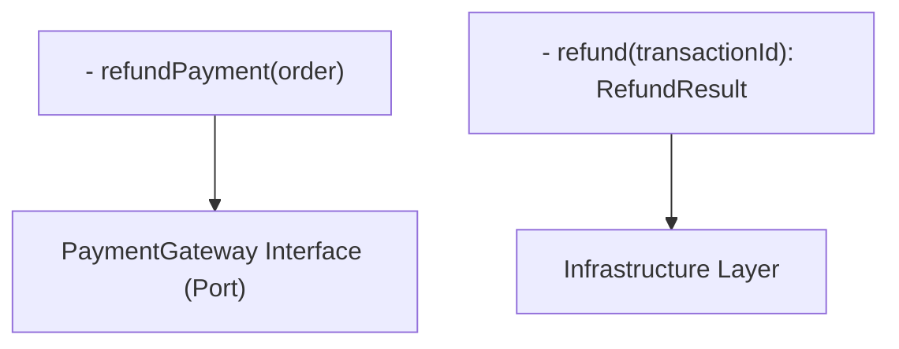

# ADR-036: Third-Party Integration Pattern

## Status

**Status**: Accepted

**Date**: 2025-10-25

**Decision Makers**: Architecture Team, Backend Team, Security Team

## Context

### Problem Statement

The Enterprise E-Commerce Platform needs to integrate with multiple third-party services for critical business functions:

- **Payment Gateways**: Stripe, PayPal for payment processing
- **Logistics Providers**: FedEx, UPS, DHL for shipping and tracking
- **Email Services**: SendGrid, AWS SES for transactional emails
- **SMS Services**: Twilio for SMS notifications
- **Analytics**: Google Analytics, Mixpanel for user behavior tracking

We need to decide on an integration pattern that:

- Isolates third-party dependencies from core business logic
- Handles third-party service failures gracefully
- Supports switching between providers without major code changes
- Ensures security and data protection
- Provides monitoring and observability

This decision impacts:

- System reliability and fault tolerance
- Code maintainability and testability
- Vendor lock-in and flexibility
- Security and compliance
- Development complexity

### Business Context

**Business Drivers**:

- Critical business functions depend on third-party services
- Need flexibility to switch providers (cost, features, reliability)
- Minimize impact of third-party service outages
- Support multiple payment gateways for different markets
- Comply with PCI-DSS for payment processing
- Maintain high availability despite third-party failures

**Business Constraints**:

- Payment processing is critical (cannot fail)
- Email delivery is important but not critical
- Shipping integration required for order fulfillment
- Third-party service costs must be optimized
- Compliance requirements (PCI-DSS, GDPR)
- SLA requirements: 99.9% availability

**Business Requirements**:

- Support multiple payment gateways (Stripe, PayPal)
- Support multiple logistics providers (FedEx, UPS, DHL)
- Graceful degradation when third-party services fail
- Ability to switch providers without downtime
- Comprehensive logging and monitoring
- Secure handling of sensitive data (credit cards, personal info)

### Technical Context

**Current Architecture**:

- Backend: Spring Boot microservices with Hexagonal Architecture (ADR-002)
- Event System: Domain Events via Kafka (ADR-003, ADR-005)
- Communication: REST for sync, Kafka for async (ADR-031)
- Deployment: AWS EKS (ADR-018)
- Observability: CloudWatch + X-Ray + Grafana (ADR-008)

**Technical Constraints**:

- Must integrate with Hexagonal Architecture (ports and adapters)
- Must handle third-party API rate limits
- Must handle third-party service timeouts and failures
- Must support API versioning (third-party APIs evolve)
- Must secure sensitive data (PCI-DSS compliance)
- Must provide comprehensive error handling

**Dependencies**:

- ADR-002: Hexagonal Architecture (adapter pattern for integrations)
- ADR-003: Domain Events (event-driven integration)
- ADR-005: Apache Kafka (async communication)
- ADR-031: Inter-Service Communication (communication patterns)

## Decision Drivers

- **Isolation**: Isolate third-party dependencies from core business logic
- **Flexibility**: Easy to switch between providers
- **Reliability**: Graceful handling of third-party failures
- **Security**: Secure handling of sensitive data
- **Testability**: Easy to test without calling real third-party APIs
- **Observability**: Comprehensive monitoring and logging
- **Maintainability**: Clean, maintainable integration code

## Considered Options

### Option 1: Adapter Pattern with Anti-Corruption Layer

**Description**:
Implement third-party integrations as adapters in the infrastructure layer, with an anti-corruption layer to translate between domain models and third-party APIs.

**Pros** ✅:

- **Clean Architecture**: Aligns with Hexagonal Architecture (ADR-002)
- **Isolation**: Core business logic isolated from third-party APIs
- **Flexibility**: Easy to switch providers by implementing new adapter
- **Testability**: Easy to mock adapters for testing
- **Domain Protection**: Anti-corruption layer protects domain model
- **Multiple Providers**: Support multiple providers simultaneously
- **Gradual Migration**: Can migrate from one provider to another gradually

**Cons** ❌:

- **Boilerplate Code**: More code to write (interfaces, adapters, translators)
- **Complexity**: Additional abstraction layer
- **Performance**: Translation overhead (minimal)
- **Learning Curve**: Team needs to understand adapter pattern

**Cost**:

- **Implementation Cost**: 4 person-weeks (implement adapters for all integrations)
- **Maintenance Cost**: 1 person-day/month
- **Total Cost of Ownership (3 years)**: ~$30,000

**Risk**: Low

**Risk Description**: Proven pattern with extensive production usage

**Effort**: Medium

**Effort Description**: Moderate implementation effort, clear pattern to follow

### Option 2: Direct Integration with Wrapper Classes

**Description**:
Directly integrate with third-party SDKs using thin wrapper classes for error handling and logging.

**Pros** ✅:

- **Simple**: Minimal abstraction, straightforward implementation
- **Fast Development**: Quick to implement
- **Less Code**: Fewer classes and interfaces
- **Direct Access**: Full access to third-party SDK features
- **Performance**: No translation overhead

**Cons** ❌:

- **Tight Coupling**: Business logic coupled to third-party APIs
- **Hard to Switch**: Difficult to switch providers
- **Hard to Test**: Difficult to test without calling real APIs
- **Domain Pollution**: Third-party models leak into domain layer
- **Vendor Lock-in**: Tightly coupled to specific providers
- **Maintenance**: Changes in third-party APIs affect business logic

**Cost**:

- **Implementation Cost**: 2 person-weeks
- **Maintenance Cost**: 2 person-days/month (higher due to coupling)
- **Total Cost of Ownership (3 years)**: ~$40,000 (higher maintenance)

**Risk**: High

**Risk Description**: Tight coupling leads to maintenance issues

**Effort**: Low

**Effort Description**: Quick to implement initially

### Option 3: Integration Service Layer (Separate Microservice)

**Description**:
Create separate integration microservices for each third-party service (Payment Service, Email Service, Shipping Service).

**Pros** ✅:

- **Complete Isolation**: Third-party integrations completely isolated
- **Independent Deployment**: Can deploy integration services independently
- **Technology Flexibility**: Can use different languages/frameworks
- **Team Ownership**: Dedicated teams for integration services
- **Scalability**: Scale integration services independently

**Cons** ❌:

- **Operational Overhead**: More services to deploy and monitor
- **Network Latency**: Additional network hops
- **Complexity**: Distributed system complexity
- **Debugging**: Harder to debug across services
- **Cost**: Higher infrastructure costs
- **Overkill**: Too complex for current scale

**Cost**:

- **Implementation Cost**: 8 person-weeks (create separate services)
- **Infrastructure Cost**: $1,000/month (additional EKS nodes, databases)
- **Maintenance Cost**: 2 person-days/month
- **Total Cost of Ownership (3 years)**: ~$80,000

**Risk**: Medium

**Risk Description**: Increased operational complexity

**Effort**: High

**Effort Description**: Significant implementation and operational effort

## Decision Outcome

**Chosen Option**: Option 1 - Adapter Pattern with Anti-Corruption Layer

**Rationale**:
We chose the Adapter Pattern with Anti-Corruption Layer as our third-party integration strategy. This decision prioritizes clean architecture, flexibility, and maintainability:

1. **Hexagonal Architecture Alignment**: Adapter pattern is core to Hexagonal Architecture (ADR-002). Third-party integrations implemented as adapters in infrastructure layer, keeping domain layer pure.

2. **Domain Protection**: Anti-corruption layer translates between domain models and third-party APIs. Domain model remains clean and independent of third-party data structures.

3. **Provider Flexibility**: Easy to switch providers by implementing new adapter. Support multiple providers simultaneously (e.g., Stripe and PayPal for payments).

4. **Testability**: Easy to test business logic with mock adapters. No need to call real third-party APIs in tests. Can test error scenarios easily.

5. **Fault Isolation**: Third-party failures isolated to adapter layer. Business logic continues working with fallback strategies or graceful degradation.

6. **Gradual Migration**: Can migrate from one provider to another gradually. Run both providers in parallel during migration, route traffic based on feature flags.

7. **Proven Pattern**: Adapter pattern is well-established and widely used. Clear separation of concerns, easy to understand and maintain.

8. **Cost-Effective**: Moderate implementation cost with low maintenance cost. Long-term benefits outweigh initial investment.

**Integration Architecture**:

## Impact Analysis

### Stakeholder Impact

| Stakeholder | Impact Level | Description | Mitigation Strategy |
|-------------|--------------|-------------|-------------------|
| Backend Team | High | Need to implement adapters for all integrations | Adapter templates, code examples, training |
| Security Team | Medium | Need to review adapter security | Security review checklist, PCI-DSS compliance |
| DevOps Team | Medium | Need to monitor third-party integrations | Monitoring dashboards, alerting |
| QA Team | Medium | Need to test with mock adapters | Mock adapter implementations, testing guidelines |
| Business Team | Low | Transparent change, improved reliability | Communication about benefits |

### Impact Radius Assessment

**Selected Impact Radius**: System

**Impact Description**:

- **System**: Integration pattern affects all third-party integrations
  - All third-party integrations implemented as adapters
  - All adapters follow consistent pattern
  - All adapters include error handling and retry logic
  - All adapters monitored and logged

### Affected Components

- **Payment Service**: Stripe and PayPal adapters
- **Email Service**: SendGrid and AWS SES adapters
- **Shipping Service**: FedEx, UPS, DHL adapters
- **SMS Service**: Twilio adapter
- **Analytics Service**: Google Analytics, Mixpanel adapters
- **Domain Services**: Use adapter interfaces (ports)
- **Testing Framework**: Mock adapters for testing

### Risk Assessment

| Risk | Probability | Impact | Mitigation Strategy | Owner |
|------|-------------|--------|-------------------|-------|
| Adapter implementation errors | Medium | Medium | Code reviews, testing | Backend Team |
| Third-party API changes | Medium | Medium | API versioning, monitoring | Backend Team |
| Performance overhead | Low | Low | Performance testing, optimization | Backend Team |
| Security vulnerabilities | Low | High | Security reviews, PCI-DSS compliance | Security Team |
| Provider switching complexity | Low | Medium | Comprehensive testing, gradual migration | Backend Team |

**Overall Risk Level**: Low

**Risk Mitigation Plan**:

- Comprehensive code reviews for all adapters
- Extensive testing with mock and real adapters
- Security reviews for sensitive data handling
- Performance testing to validate overhead is minimal
- Monitoring and alerting for third-party failures
- Documentation and training for team

## Implementation Plan

### Phase 1: Adapter Framework (Timeline: Week 1)

**Objectives**:

- Define adapter interfaces (ports)
- Create adapter base classes
- Implement error handling framework

**Tasks**:

- [ ] Define PaymentGateway interface (port)
- [ ] Define EmailService interface (port)
- [ ] Define ShippingProvider interface (port)
- [ ] Create AbstractPaymentAdapter base class
- [ ] Create AbstractEmailAdapter base class
- [ ] Create AbstractShippingAdapter base class
- [ ] Implement retry logic with exponential backoff
- [ ] Implement circuit breaker for third-party calls
- [ ] Create adapter exception hierarchy
- [ ] Document adapter pattern guidelines

**Deliverables**:

- Adapter interfaces and base classes
- Error handling framework
- Adapter pattern guidelines

**Success Criteria**:

- Clear adapter interfaces defined
- Reusable base classes with error handling
- Documentation complete

### Phase 2: Payment Gateway Adapters (Timeline: Week 1-2)

**Objectives**:

- Implement Stripe adapter
- Implement PayPal adapter
- Ensure PCI-DSS compliance

**Tasks**:

- [ ] Implement StripePaymentAdapter
  - charge() method with Stripe API integration
  - refund() method with Stripe API integration
  - Anti-corruption layer: Domain ↔ Stripe models
  - Error handling and retry logic
  - Idempotency key handling
- [ ] Implement PayPalPaymentAdapter
  - charge() method with PayPal API integration
  - refund() method with PayPal API integration
  - Anti-corruption layer: Domain ↔ PayPal models
  - Error handling and retry logic
- [ ] Implement payment adapter factory (select adapter based on config)
- [ ] Security review for PCI-DSS compliance
- [ ] Create mock payment adapter for testing
- [ ] Integration tests with Stripe/PayPal sandbox

**Deliverables**:

- Stripe and PayPal adapters
- Payment adapter factory
- Mock adapter for testing
- Security review report

**Success Criteria**:

- Payment processing working with both Stripe and PayPal
- PCI-DSS compliance validated
- Integration tests passing

### Phase 3: Email and Shipping Adapters (Timeline: Week 2-3)

**Objectives**:

- Implement email service adapters
- Implement shipping provider adapters
- Test all integrations

**Tasks**:

- [ ] Implement SendGridEmailAdapter
- [ ] Implement AwsSesEmailAdapter
- [ ] Implement email adapter factory
- [ ] Implement FedExShippingAdapter
- [ ] Implement UpsShippingAdapter
- [ ] Implement DhlShippingAdapter
- [ ] Implement shipping adapter factory
- [ ] Create mock adapters for testing
- [ ] Integration tests with real APIs (sandbox)
- [ ] Document adapter usage

**Deliverables**:

- Email and shipping adapters
- Adapter factories
- Mock adapters
- Integration tests

**Success Criteria**:

- Email sending working with SendGrid and AWS SES
- Shipping integration working with FedEx, UPS, DHL
- All integration tests passing

### Phase 4: Monitoring and Operations (Timeline: Week 3-4)

**Objectives**:

- Set up monitoring for third-party integrations
- Create operational runbooks
- Train team on adapter pattern

**Tasks**:

- [ ] Configure metrics for adapter calls (success rate, latency, errors)
- [ ] Create Grafana dashboards for third-party integrations
- [ ] Set up CloudWatch alarms for adapter failures
- [ ] Configure X-Ray tracing for adapter calls
- [ ] Create operational runbooks for adapter issues
- [ ] Document troubleshooting procedures
- [ ] Conduct training sessions on adapter pattern
- [ ] Create adapter implementation guide
- [ ] Perform load testing with real third-party APIs

**Deliverables**:

- Monitoring dashboards and alerts
- Operational runbooks
- Training materials
- Load testing results

**Success Criteria**:

- All adapter metrics visible in Grafana
- Alerts triggering correctly for failures
- Team trained on adapter pattern
- Load testing validates performance

### Rollback Strategy

**Trigger Conditions**:

- Critical adapter failures affecting business operations
- Security vulnerabilities discovered
- Performance degradation > 50%
- Third-party integration completely broken

**Rollback Steps**:

1. **Immediate Action**: Switch to fallback provider or disable feature
2. **Service Rollback**: Deploy previous version without new adapters
3. **Configuration Rollback**: Restore previous integration configuration
4. **Validation**: Verify third-party integrations working
5. **Root Cause Analysis**: Investigate issues and plan remediation

**Rollback Time**: 10-15 minutes

**Rollback Testing**: Test rollback procedure in staging environment

## Monitoring and Success Criteria

### Success Metrics

| Metric | Target | Measurement Method | Review Frequency |
|--------|--------|-------------------|------------------|
| Adapter Success Rate | > 99.5% | Adapter metrics | Real-time |
| Adapter Latency (p95) | < 2 seconds | Adapter metrics | Real-time |
| Third-Party API Errors | < 0.5% | Error logs | Daily |
| Circuit Breaker Trips | < 10/day | Circuit breaker metrics | Daily |
| Provider Switch Time | < 5 minutes | Manual testing | Monthly |

### Monitoring Plan

**Dashboards**:

- **Third-Party Integration Dashboard**: Success rate, latency, errors per provider
- **Payment Gateway Dashboard**: Payment success rate, refund rate, transaction volume
- **Email Service Dashboard**: Email delivery rate, bounce rate, send volume
- **Shipping Provider Dashboard**: Shipment creation rate, tracking updates, errors

**Alerts**:

- **Critical**: Payment gateway failure (PagerDuty)
- **Critical**: Circuit breaker open for > 5 minutes (PagerDuty)
- **Warning**: Third-party API error rate > 1% (Slack)
- **Warning**: Adapter latency > 5 seconds (Slack)
- **Info**: Provider switched (Slack)

**Review Schedule**:

- **Real-time**: Automated monitoring and alerting
- **Daily**: Review third-party integration metrics and errors
- **Weekly**: Analyze provider performance and costs
- **Monthly**: Comprehensive integration review and optimization

### Key Performance Indicators (KPIs)

- **Reliability KPI**: Adapter success rate > 99.5%
- **Performance KPI**: Adapter latency < 2 seconds (p95)
- **Flexibility KPI**: Provider switch time < 5 minutes
- **Security KPI**: Zero PCI-DSS compliance violations

## Consequences

### Positive Consequences ✅

- **Clean Architecture**: Domain layer isolated from third-party dependencies
- **Flexibility**: Easy to switch providers or support multiple providers
- **Testability**: Easy to test with mock adapters
- **Maintainability**: Clear separation of concerns
- **Fault Isolation**: Third-party failures don't affect domain logic
- **Gradual Migration**: Can migrate providers without downtime
- **Domain Protection**: Anti-corruption layer protects domain model
- **Observability**: Centralized monitoring for all integrations

### Negative Consequences ❌

- **Boilerplate Code**: More code to write (interfaces, adapters, translators) (Mitigation: Adapter templates and base classes)
- **Complexity**: Additional abstraction layer (Mitigation: Clear documentation and training)
- **Performance Overhead**: Translation overhead (Mitigation: Minimal overhead, validated by testing)

### Technical Debt

**Debt Introduced**:

- **Adapter Maintenance**: Need to maintain adapters for each provider
- **API Version Management**: Need to handle third-party API version changes
- **Testing Overhead**: Need to test both mock and real adapters

**Debt Repayment Plan**:

- **Automation**: Automate adapter testing with sandbox APIs
- **Documentation**: Maintain comprehensive adapter documentation
- **Monitoring**: Continuous monitoring for API changes
- **Refactoring**: Regular refactoring to keep adapters clean

### Long-term Implications

This decision establishes the Adapter Pattern as our standard for third-party integrations for the next 3-5 years. As the platform evolves:

- Add new adapters for new third-party services
- Migrate to new providers by implementing new adapters
- Deprecate old adapters when providers are no longer used
- Keep adapters updated with third-party API changes
- Monitor adapter performance and optimize as needed

The Adapter Pattern provides foundation for flexible, maintainable third-party integrations while protecting our domain model and business logic.

## Related Decisions

### Related ADRs

- [ADR-031: Inter-Service Communication](031-inter-service-communication-protocol.md) - Communication patterns

### Affected Viewpoints

- [Functional Viewpoint](../../viewpoints/functional/README.md) - Third-party integrations
- [Deployment Viewpoint](../../viewpoints/deployment/README.md) - Adapter deployment
- [Operational Viewpoint](../../viewpoints/operational/README.md) - Integration monitoring

### Affected Perspectives

- [Security Perspective](../../perspectives/security/README.md) - Secure data handling
- [Availability Perspective](../../perspectives/availability/README.md) - Fault tolerance
- [Evolution Perspective](../../perspectives/evolution/README.md) - Provider flexibility

## Notes

### Assumptions

- Team understands Hexagonal Architecture and Adapter Pattern
- Third-party services provide sandbox environments for testing
- Third-party APIs are relatively stable (no frequent breaking changes)
- PCI-DSS compliance requirements understood
- Monitoring infrastructure available

### Constraints

- Must comply with PCI-DSS for payment processing
- Must handle third-party API rate limits
- Must support multiple providers simultaneously
- Must provide comprehensive error handling
- Must integrate with existing observability stack

### Open Questions

- Should we implement adapter versioning for API version management?
- How to handle third-party API deprecations?
- Should we cache third-party API responses?
- How to handle third-party webhook integrations?

### Follow-up Actions

- [ ] Create adapter interface templates - Architecture Team
- [ ] Implement payment gateway adapters - Backend Team
- [ ] Implement email service adapters - Backend Team
- [ ] Implement shipping provider adapters - Backend Team
- [ ] Conduct PCI-DSS security review - Security Team
- [ ] Set up monitoring dashboards - DevOps Team
- [ ] Create operational runbooks - DevOps Team
- [ ] Conduct adapter pattern training - Tech Lead

### References

- [Hexagonal Architecture](https://alistair.cockburn.us/hexagonal-architecture/)
- [Adapter Pattern](https://refactoring.guru/design-patterns/adapter)
- [Anti-Corruption Layer](https://docs.microsoft.com/en-us/azure/architecture/patterns/anti-corruption-layer)
- [Stripe API Documentation](https://stripe.com/docs/api)
- [PayPal API Documentation](https://developer.paypal.com/docs/api/overview/)
- [PCI-DSS Compliance](https://www.pcisecuritystandards.org/)
- [Circuit Breaker Pattern](https://martinfowler.com/bliki/CircuitBreaker.html)

---

**ADR Template Version**: 1.0  
**Last Template Update**: 2025-01-17
