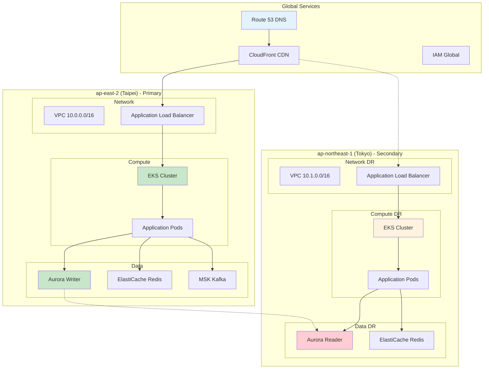

# AWS Architecture Overview - GenAI Demo Complete Architecture Documentation

**Document Version**: 1.0  
**Last Updated**: September 24, 2025 5:15 PM (Taipei Time)  
**Author**: Architecture Team  
**Status**: Active

## 📋 Document Navigation

This document provides a complete overview of the GenAI Demo AWS architecture, including detailed design specifications, IAM permission relationships, DNS resolution flows, and deployment architecture.

### 🏗️ Core Architecture Documentation

#### [Infrastructure Viewpoint - AWS Resource Architecture Design](../viewpoints/infrastructure/aws-resource-architecture.md)
- **Content**: Complete AWS resource architecture design
- **Focus**: CDK Stack architecture, network design, compute resources, data storage
- **Target Audience**: Architects, Infrastructure Engineers
- **Key Diagrams**: Overall architecture diagram, CDK Stack relationship diagram, network architecture diagram

#### [Security Viewpoint - IAM Permissions and Security Architecture](../viewpoints/security/iam-permissions-architecture.md)
- **Content**: IAM roles, Service Accounts, permission relationships
- **Focus**: IRSA architecture, permission matrix, encryption strategy, network security
- **Target Audience**: Security Engineers, DevOps Engineers
- **Key Diagrams**: IAM permission flow diagram, IRSA sequence diagram, security architecture diagram

#### [Operational Viewpoint - DNS Resolution and Disaster Recovery](../viewpoints/operational/dns-disaster-recovery.md)
- **Content**: DNS resolution flow, failover mechanisms, disaster recovery
- **Focus**: Route 53 configuration, health checks, automatic failover
- **Target Audience**: Operations Engineers, SRE Engineers
- **Key Diagrams**: DNS resolution flow diagram, failover sequence diagram, monitoring architecture diagram

#### [Deployment Viewpoint - Deployment Architecture and Processes](../viewpoints/deployment/deployment-architecture.md)
- **Content**: CI/CD pipelines, environment management, deployment strategies
- **Focus**: GitHub Actions, containerized deployment, rolling updates, automatic rollback
- **Target Audience**: DevOps Engineers, Development Engineers
- **Key Diagrams**: CI/CD flow diagram, deployment strategy diagram, rollback mechanism diagram

## 🎯 Quick Navigation Guide

### Documentation by Role

#### 🏗️ Architect
**Primary Focus**: Overall system design, technology selection, architectural decisions
```
Recommended Reading Order:
1. Infrastructure Viewpoint - Understand overall architecture design
2. Security Viewpoint - Understand security architecture and permission design
3. Operational Viewpoint - Understand operations and disaster recovery design
4. Deployment Viewpoint - Understand deployment and delivery processes
```

#### 🔒 Security Engineer
**Primary Focus**: IAM permissions, encryption, compliance, security monitoring
```
Recommended Reading Order:
1. Security Viewpoint - Detailed security architecture and permission design
2. Infrastructure Viewpoint - Understand network security and infrastructure
3. Operational Viewpoint - Understand security monitoring and incident response
```

#### ⚙️ DevOps Engineer
**Primary Focus**: CI/CD, deployment, monitoring, automation
```
Recommended Reading Order:
1. Deployment Viewpoint - CI/CD processes and deployment strategies
2. Infrastructure Viewpoint - Infrastructure automation
3. Security Viewpoint - IAM and Service Account configuration
4. Operational Viewpoint - Monitoring and troubleshooting
```

#### 🛠️ Operations Engineer
**Primary Focus**: Monitoring, troubleshooting, disaster recovery, performance optimization
```
Recommended Reading Order:
1. Operational Viewpoint - DNS, monitoring, disaster recovery
2. Infrastructure Viewpoint - Resource configuration and monitoring architecture
3. Deployment Viewpoint - Deployment monitoring and rollback processes
```

#### 💻 Developer
**Primary Focus**: Application deployment, development environment, CI/CD processes
```
Recommended Reading Order:
1. Deployment Viewpoint - CI/CD processes and environment management
2. Infrastructure Viewpoint - Application runtime environment
3. Operational Viewpoint - Application monitoring and troubleshooting
```

### Documentation by Scenario

#### 🚀 New Project Startup
**Scenario**: Understanding the entire system architecture, preparing to start development
```
Reading Path:
1. This document (Architecture Overview) - Gain overall understanding
2. Infrastructure Viewpoint - Understand infrastructure
3. Security Viewpoint - Understand security requirements
4. Deployment Viewpoint - Understand development processes
```

#### 🔧 Troubleshooting
**Scenario**: System issues occurred, need quick identification and resolution
```
Reading Path:
1. Operational Viewpoint - Troubleshooting manual and monitoring
2. Infrastructure Viewpoint - Infrastructure architecture
3. Security Viewpoint - Permission and security checks
```

#### 📈 Performance Optimization
**Scenario**: System performance needs optimization, looking for bottlenecks and improvements
```
Reading Path:
1. Infrastructure Viewpoint - Resource configuration and auto-scaling
2. Operational Viewpoint - Performance monitoring and optimization
3. Deployment Viewpoint - Deployment strategy optimization
```

#### 🛡️ Security Review
**Scenario**: Conducting security review, checking compliance
```
Reading Path:
1. Security Viewpoint - Complete security architecture
2. Infrastructure Viewpoint - Network security configuration
3. Operational Viewpoint - Security monitoring and incident response
```

## 🌐 System Architecture Overview

### Multi-Region Active-Active Architecture

GenAI Demo adopts a Multi-Region Active-Active architecture, primarily deployed in Taipei (ap-east-2) and Tokyo (ap-northeast-1) regions:



### Core Design Principles

1. **High Availability**: 99.9% availability target, Multi-AZ deployment
2. **Auto Scaling**: KEDA + HPA + Cluster Autoscaler three-tier scaling
3. **Zero Trust Security**: IAM + RBAC + Network Segmentation
4. **Observability**: CloudWatch + X-Ray + Grafana comprehensive monitoring
5. **Automation**: Fully automated CI/CD and infrastructure management

## 🔑 Key Technical Components

### Compute Platform
- **Amazon EKS**: Kubernetes 1.28, managed control plane
- **EC2 Managed Node Groups**: t3.medium/large instances, auto-scaling
- **KEDA**: Event-driven Pod auto-scaling
- **Application Load Balancer**: Layer 7 load balancing

### Data Storage
- **Aurora Global Database**: PostgreSQL 15.4, cross-region replication
- **ElastiCache Redis**: Distributed caching and session storage
- **Amazon MSK**: Kafka message queues, event-driven architecture

### Network and Security
- **VPC**: Multi-tier network architecture, public/private/database subnets
- **Security Groups**: Fine-grained network access control
- **IAM Roles for Service Accounts (IRSA)**: Pod-level AWS permissions
- **AWS KMS**: Data encryption key management

### Monitoring and Observability
- **CloudWatch**: Metrics, logs, alarms
- **X-Ray**: Distributed tracing
- **Amazon Managed Grafana**: Unified monitoring dashboard
- **Container Insights**: EKS cluster monitoring

## 🚀 Deployment and Operations

### CI/CD Process
1. **GitHub Actions**: Automated build, test, deployment
2. **Amazon ECR**: Container image storage
3. **AWS CDK**: Infrastructure as Code
4. **Kubernetes**: Container orchestration and deployment

### Disaster Recovery
- **RTO**: < 5 minutes (Recovery Time Objective)
- **RPO**: < 1 minute (Recovery Point Objective)
- **Automatic Failover**: Triggered by Route 53 health checks
- **Cross-Region Backup**: Aurora Global Database automatic replication

## 📊 Performance and Cost

### Performance Targets
- **API Response Time**: < 2 seconds (95th percentile)
- **Availability**: 99.9%
- **Auto Scaling**: Support 10x traffic growth
- **DNS Resolution**: < 100ms

### Cost Optimization
- **Spot Instances**: 30% of nodes use Spot instances
- **Auto Scaling**: Dynamic adjustment based on actual load
- **Reserved Instances**: RDS uses 1-year Reserved Instances
- **Intelligent Tiering**: S3 automatic cost optimization

## 🔗 Related Resources

### Internal Documentation
- [Development Standards](../development-standards.md) - Development standards and guidelines
- [Security Standards](../security-standards.md) - Security implementation standards
- [Performance Standards](../performance-standards.md) - Performance optimization guidelines

### External References
- [AWS Well-Architected Framework](https://aws.amazon.com/architecture/well-architected/)
- [EKS Best Practices](https://aws.github.io/aws-eks-best-practices/)
- [Kubernetes Documentation](https://kubernetes.io/docs/)

## 📞 Support and Contact

### Technical Support
- **Architecture Issues**: Architecture Team
- **Security Issues**: Security Team  
- **Operations Issues**: Operations Team
- **Development Issues**: Development Team

### Emergency Contact
- **P0 Incidents**: PagerDuty automatic call
- **P1 Incidents**: Slack #incident-response
- **General Issues**: Slack #genai-demo-support

---

**Document Maintenance**: This document is continuously updated as the system evolves  
**Version Control**: All changes are recorded in Git history  
**Review Cycle**: Comprehensive review and update every quarter