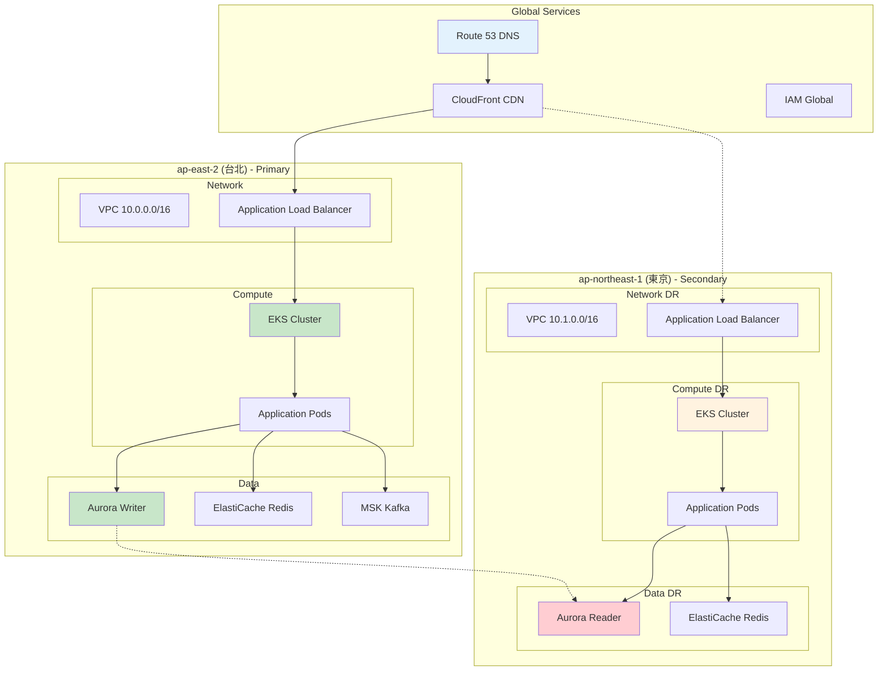

# AWS 架構總覽 - GenAI Demo 完整架構文檔

**文件版本**: 1.0  
**最後更新**: 2025年9月24日 下午5:15 (台北時間)  
**作者**: Architecture Team  
**狀態**: Active

## 📋 文檔導航

本文檔提供 GenAI Demo AWS 架構的完整概覽，包含詳細的設計說明、IAM 權限關係、DNS 解析流程和部署架構。

### 🏗️ 核心架構文檔

#### [Infrastructure Viewpoint - AWS 資源架構設計](../viewpoints/infrastructure/aws-resource-architecture.md)
- **內容**: 完整的 AWS 資源架構設計
- **重點**: CDK Stack 架構、網路設計、計算資源、資料儲存
- **適用對象**: 架構師、基礎設施工程師
- **關鍵圖表**: 整體架構圖、CDK Stack 關係圖、網路架構圖

#### [Security Viewpoint - IAM 權限與安全架構](../viewpoints/security/iam-permissions-architecture.md)
- **內容**: IAM 角色、Service Account、權限關係
- **重點**: IRSA 架構、權限矩陣、加密策略、網路安全
- **適用對象**: 安全工程師、DevOps 工程師
- **關鍵圖表**: IAM 權限流程圖、IRSA 序列圖、安全架構圖

#### [Operational Viewpoint - DNS 解析與災難恢復](../viewpoints/operational/dns-disaster-recovery.md)
- **內容**: DNS 解析流程、故障轉移機制、災難恢復
- **重點**: Route 53 配置、健康檢查、自動故障轉移
- **適用對象**: 運維工程師、SRE 工程師
- **關鍵圖表**: DNS 解析流程圖、故障轉移時序圖、監控架構圖

#### [Deployment Viewpoint - 部署架構與流程](../viewpoints/deployment/deployment-architecture.md)
- **內容**: CI/CD 流水線、環境管理、部署策略
- **重點**: GitHub Actions、容器化部署、滾動更新、自動回滾
- **適用對象**: DevOps 工程師、開發工程師
- **關鍵圖表**: CI/CD 流程圖、部署策略圖、回滾機制圖

## 🎯 快速導航指南

### 按角色查看相關文檔

#### 🏗️ 架構師 (Architect)
**主要關注**: 整體系統設計、技術選型、架構決策
```
推薦閱讀順序:
1. Infrastructure Viewpoint - 了解整體架構設計
2. Security Viewpoint - 了解安全架構和權限設計
3. Operational Viewpoint - 了解運維和災難恢復設計
4. Deployment Viewpoint - 了解部署和交付流程
```

#### 🔒 安全工程師 (Security Engineer)
**主要關注**: IAM 權限、加密、合規性、安全監控
```
推薦閱讀順序:
1. Security Viewpoint - 詳細的安全架構和權限設計
2. Infrastructure Viewpoint - 了解網路安全和基礎設施
3. Operational Viewpoint - 了解安全監控和事件回應
```

#### ⚙️ DevOps 工程師 (DevOps Engineer)
**主要關注**: CI/CD、部署、監控、自動化
```
推薦閱讀順序:
1. Deployment Viewpoint - CI/CD 流程和部署策略
2. Infrastructure Viewpoint - 基礎設施自動化
3. Security Viewpoint - IAM 和 Service Account 配置
4. Operational Viewpoint - 監控和故障處理
```

#### 🛠️ 運維工程師 (Operations Engineer)
**主要關注**: 監控、故障處理、災難恢復、效能優化
```
推薦閱讀順序:
1. Operational Viewpoint - DNS、監控、災難恢復
2. Infrastructure Viewpoint - 資源配置和監控架構
3. Deployment Viewpoint - 部署監控和回滾流程
```

#### 💻 開發工程師 (Developer)
**主要關注**: 應用部署、開發環境、CI/CD 流程
```
推薦閱讀順序:
1. Deployment Viewpoint - CI/CD 流程和環境管理
2. Infrastructure Viewpoint - 應用運行環境
3. Operational Viewpoint - 應用監控和故障排除
```

### 按場景查看相關文檔

#### 🚀 新專案啟動
**場景**: 了解整個系統架構，準備開始開發
```
閱讀路徑:
1. 本文檔 (架構總覽) - 獲得整體認知
2. Infrastructure Viewpoint - 了解基礎設施
3. Security Viewpoint - 了解安全要求
4. Deployment Viewpoint - 了解開發流程
```

#### 🔧 故障排除
**場景**: 系統出現問題，需要快速定位和解決
```
閱讀路徑:
1. Operational Viewpoint - 故障排除手冊和監控
2. Infrastructure Viewpoint - 基礎設施架構
3. Security Viewpoint - 權限和安全檢查
```

#### 📈 效能優化
**場景**: 系統效能需要優化，尋找瓶頸和改進點
```
閱讀路徑:
1. Infrastructure Viewpoint - 資源配置和自動擴展
2. Operational Viewpoint - 效能監控和優化
3. Deployment Viewpoint - 部署策略優化
```

#### 🛡️ 安全審查
**場景**: 進行安全審查，檢查合規性
```
閱讀路徑:
1. Security Viewpoint - 完整的安全架構
2. Infrastructure Viewpoint - 網路安全配置
3. Operational Viewpoint - 安全監控和事件回應
```

## 🌐 系統架構概覽

### Multi-Region Active-Active 架構

GenAI Demo 採用 Multi-Region Active-Active 架構，主要部署在台北 (ap-east-2) 和東京 (ap-northeast-1) 兩個區域：



### 核心設計原則

1. **高可用性**: 99.9% 可用性目標，Multi-AZ 部署
2. **自動擴展**: KEDA + HPA + Cluster Autoscaler 三層擴展
3. **零信任安全**: IAM + RBAC + 網路分段
4. **可觀測性**: CloudWatch + X-Ray + Grafana 全面監控
5. **自動化**: 完全自動化的 CI/CD 和基礎設施管理

## 🔑 關鍵技術組件

### 計算平台
- **Amazon EKS**: Kubernetes 1.28，託管控制平面
- **EC2 Managed Node Groups**: t3.medium/large 實例，自動擴展
- **KEDA**: 事件驅動的 Pod 自動擴展
- **Application Load Balancer**: 七層負載均衡

### 資料儲存
- **Aurora Global Database**: PostgreSQL 15.4，跨區域複製
- **ElastiCache Redis**: 分散式快取和會話儲存
- **Amazon MSK**: Kafka 訊息佇列，事件驅動架構

### 網路與安全
- **VPC**: 多層網路架構，公有/私有/資料庫子網
- **Security Groups**: 細粒度的網路存取控制
- **IAM Roles for Service Accounts (IRSA)**: Pod 級別的 AWS 權限
- **AWS KMS**: 資料加密金鑰管理

### 監控與可觀測性
- **CloudWatch**: 指標、日誌、告警
- **X-Ray**: 分散式追蹤
- **Amazon Managed Grafana**: 統一監控儀表板
- **Container Insights**: EKS 叢集監控

## 🚀 部署與運維

### CI/CD 流程
1. **GitHub Actions**: 自動化建構、測試、部署
2. **Amazon ECR**: 容器映像儲存
3. **AWS CDK**: 基礎設施即程式碼
4. **Kubernetes**: 容器編排和部署

### 災難恢復
- **RTO**: < 5 分鐘 (Recovery Time Objective)
- **RPO**: < 1 分鐘 (Recovery Point Objective)
- **自動故障轉移**: Route 53 健康檢查觸發
- **跨區域備份**: Aurora Global Database 自動複製

## 📊 效能與成本

### 效能目標
- **API 回應時間**: < 2 秒 (95th percentile)
- **可用性**: 99.9%
- **自動擴展**: 支援 10x 流量增長
- **DNS 解析**: < 100ms

### 成本優化
- **Spot Instances**: 30% 節點使用 Spot 實例
- **自動擴展**: 基於實際負載動態調整
- **Reserved Instances**: RDS 使用 1 年期預留實例
- **Intelligent Tiering**: S3 自動成本優化

## 🔗 相關資源

### 內部文檔
- [Development Standards](../development-standards.md) - 開發標準和指南
- [Security Standards](../security-standards.md) - 安全實作標準
- [Performance Standards](../performance-standards.md) - 效能優化指南

### 外部參考
- [AWS Well-Architected Framework](https://aws.amazon.com/architecture/well-architected/)
- [EKS Best Practices](https://aws.github.io/aws-eks-best-practices/)
- [Kubernetes Documentation](https://kubernetes.io/docs/)

## 📞 支援與聯絡

### 技術支援
- **架構問題**: Architecture Team
- **安全問題**: Security Team  
- **運維問題**: Operations Team
- **開發問題**: Development Team

### 緊急聯絡
- **P0 事件**: PagerDuty 自動呼叫
- **P1 事件**: Slack #incident-response
- **一般問題**: Slack #genai-demo-support

---

**文件維護**: 本文檔隨著系統演進持續更新  
**版本控制**: 所有變更都會記錄在 Git 歷史中  
**審查週期**: 每季度進行一次全面審查和更新