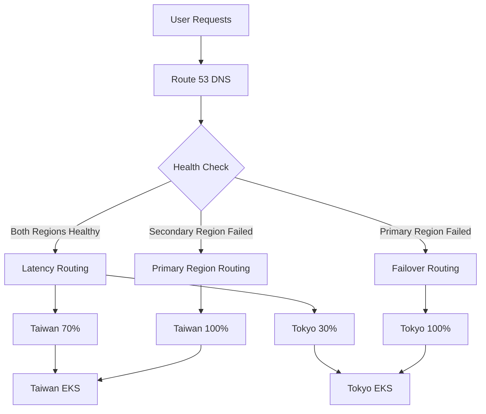
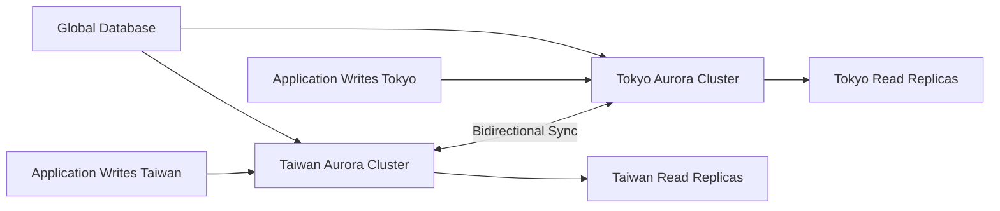
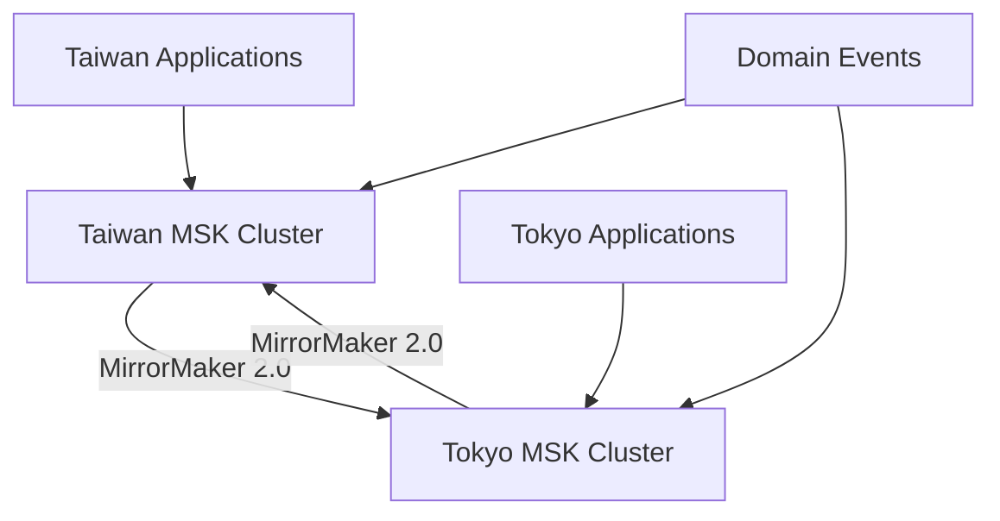
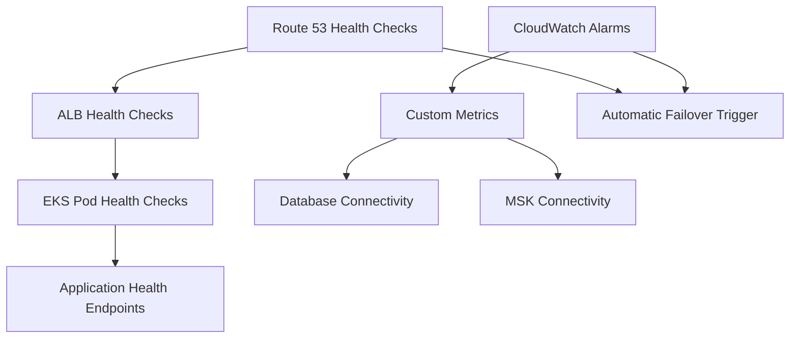
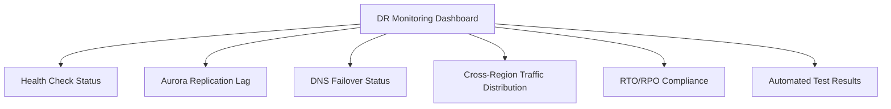

# Disaster Recovery Architecture Design Document

## Overview

This document provides a detailed description of the disaster recovery (DR) architecture design for the GenAI Demo project, adopting an **Active-Active multi-region deployment model** to ensure business continuity and zero data loss.

## Design Principles

### Core Objectives

- **RTO (Recovery Time Objective)**: < 60 seconds
- **RPO (Recovery Point Objective)**: 0 seconds (zero data loss)
- **Availability Target**: 99.99% (annual downtime < 53 minutes)
- **Automation Level**: Fully automated failover

### Architecture Principles

1. **Active-Active Mode**: Both regions provide services simultaneously
2. **Automatic Failover**: Automatic switching without manual intervention
3. **Data Consistency**: Ensure cross-region data synchronization
4. **Monitoring-Driven**: Intelligent routing based on health checks

## Active-Active Architecture Design

### Regional Configuration

#### Primary Region

- **Region**: Taiwan (ap-east-2)
- **Role**: Primary service region, handles most traffic
- **Priority**: High priority, latency-optimized routing

#### Secondary Region  

- **Region**: Tokyo (ap-northeast-1)
- **Role**: Backup service region, provides simultaneous service
- **Priority**: Secondary priority, failover target

### Traffic Distribution Strategy



#### Normal Traffic Distribution

- **Taiwan (Primary Region)**: 70% traffic
- **Tokyo (Secondary Region)**: 30% traffic
- **Routing Strategy**: Latency-based intelligent routing

#### Failure Traffic Distribution

- **Primary Region Failure**: 100% traffic routed to Tokyo
- **Secondary Region Failure**: 100% traffic routed to Taiwan
- **Switch Time**: < 60 seconds (DNS TTL + health check interval)

## Infrastructure Components

### 1. DNS and Traffic Management

#### Route 53 Configuration

```typescript
// Primary region failover record
const primaryFailoverRecord = new route53.ARecord(this, 'PrimaryFailoverRecord', {
    zone: hostedZone,
    recordName: 'api.kimkao.io',
    target: route53.RecordTarget.fromAlias(new targets.LoadBalancerTarget(primaryLoadBalancer)),
    ttl: cdk.Duration.seconds(60), // Short TTL ensures fast switching
    setIdentifier: 'primary-failover',
    failover: route53.FailoverType.PRIMARY,
    healthCheckId: primaryHealthCheck.attrHealthCheckId
});

// Latency-based routing record (normal situation)
const latencyBasedRecord = new route53.ARecord(this, 'LatencyBasedRecord', {
    zone: hostedZone,
    recordName: 'api-latency.kimkao.io',
    target: route53.RecordTarget.fromAlias(new targets.LoadBalancerTarget(primaryLoadBalancer)),
    region: 'ap-east-2',
    setIdentifier: 'taiwan-latency',
    healthCheckId: primaryHealthCheck.attrHealthCheckId
});
```

#### Health Check Configuration

- **Check Interval**: 30 seconds
- **Failure Threshold**: 3 consecutive failures
- **Check Endpoint**: `/actuator/health`
- **Protocol**: HTTPS
- **Timeout**: 10 seconds

### 2. Database Architecture - Aurora Global Database

#### Active-Active Data Synchronization



#### Database Configuration

- **Engine**: Aurora PostgreSQL 15.4
- **Mode**: Global Database with Cross-Region Replication
- **Sync Latency**: < 1 second (typically < 100ms)
- **Backup Strategy**: Cross-region automatic backup
- **Encryption**: Encryption at rest and in transit

#### Conflict Resolution Strategy

```sql
-- Use timestamp and region identifier to resolve write conflicts
CREATE TABLE conflict_resolution (
    id UUID PRIMARY KEY,
    data JSONB,
    region VARCHAR(20),
    created_at TIMESTAMP WITH TIME ZONE DEFAULT NOW(),
    updated_at TIMESTAMP WITH TIME ZONE DEFAULT NOW(),
    version INTEGER DEFAULT 1
);

-- Conflict resolution trigger
CREATE OR REPLACE FUNCTION resolve_conflicts()
RETURNS TRIGGER AS $
BEGIN
    -- Last-write-wins strategy based on timestamp
    IF NEW.updated_at > OLD.updated_at THEN
        RETURN NEW;
    ELSE
        RETURN OLD;
    END IF;
END;
$ LANGUAGE plpgsql;
```

### 3. Application Layer Architecture

#### EKS Cluster Configuration

```yaml
# Taiwan EKS Configuration
taiwan_cluster:
  region: ap-east-2
  node_groups:
    - name: primary-nodes
      instance_types: [m6i.large, m6i.xlarge]
      min_size: 3
      max_size: 20
      desired_size: 6
  
# Tokyo EKS Configuration  
tokyo_cluster:
  region: ap-northeast-1
  node_groups:
    - name: secondary-nodes
      instance_types: [m6i.large, m6i.xlarge]
      min_size: 2
      max_size: 15
      desired_size: 4
```

#### Application Deployment Strategy

- **Deployment Mode**: Blue-Green deployment
- **Service Mesh**: Istio (cross-region traffic management)
- **Configuration Management**: ConfigMap + Secrets cross-region sync
- **Image Registry**: ECR cross-region replication

### 4. Message Queue - MSK Cross-Region Replication

#### MSK Configuration



#### Event Replication Strategy

- **Tool**: Kafka MirrorMaker 2.0
- **Mode**: Bidirectional replication
- **Latency**: < 500ms
- **Topic Strategy**: Automatic topic creation and synchronization

## Automated Failover Mechanism

### 1. Failure Detection

#### Health Check Levels



#### Failure Detection Metrics

1. **HTTP Health Check**: `/actuator/health` endpoint
2. **Database Connection**: Aurora connection pool status
3. **Message Queue**: MSK producer/consumer status
4. **Application Metrics**: Error rate, response time, throughput

### 2. Automatic Failover Process

#### Step Functions Workflow

```json
{
  "Comment": "Automatic disaster recovery failover workflow",
  "StartAt": "ValidateHealthStatus",
  "States": {
    "ValidateHealthStatus": {
      "Type": "Task",
      "Resource": "arn:aws:lambda:ap-northeast-1:account:function:dr-health-validator",
      "Next": "PromoteAuroraCluster"
    },
    "PromoteAuroraCluster": {
      "Type": "Task", 
      "Resource": "arn:aws:lambda:ap-northeast-1:account:function:dr-aurora-promoter",
      "Next": "UpdateDNSRouting"
    },
    "UpdateDNSRouting": {
      "Type": "Task",
      "Resource": "arn:aws:lambda:ap-northeast-1:account:function:dr-dns-updater", 
      "Next": "SendNotification"
    },
    "SendNotification": {
      "Type": "Task",
      "Resource": "arn:aws:states:::sns:publish",
      "End": true
    }
  }
}
```

#### Failover Steps

1. **Failure Detection** (0-30 seconds)
   - Route 53 health check failure
   - CloudWatch alarm trigger
   - EventBridge rule activation

2. **Automatic Switch** (30-45 seconds)
   - Aurora Global Database promotion
   - DNS record update (TTL=60 seconds)
   - Traffic rerouting

3. **Validation and Notification** (45-60 seconds)
   - New region health check
   - Service availability verification
   - Operations team notification

### 3. Failure Recovery Process

#### Automatic Recovery Detection

```python
def check_primary_region_recovery():
    """Check primary region recovery status"""
    health_checks = [
        check_alb_health(),
        check_database_connectivity(), 
        check_application_health(),
        check_msk_connectivity()
    ]
    
    if all(health_checks):
        trigger_failback_process()
        return True
    return False
```

#### Failure Recovery Steps

1. **Continuous Monitoring**: Check primary region status every 5 minutes
2. **Recovery Validation**: 3 consecutive health checks pass
3. **Data Synchronization**: Ensure data consistency
4. **Traffic Failback**: Gradually switch traffic back to primary region

## Chaos Engineering Testing

### 1. Automated Test Scenarios

#### Monthly DR Testing

```bash
# Execute on first Sunday of each month at 2 AM
cron: "0 2 ? * SUN#1 *"

# Test scenarios
test_scenarios:
  - health_check_failure_simulation
  - network_partition_test  
  - database_failover_test
  - dns_propagation_test
  - end_to_end_failover_test
```

#### Test Types

1. **Health Check Failure Simulation**
   - Simulate ALB health check failure
   - Verify automatic failover
   - Measure RTO compliance

2. **Network Partition Testing**
   - Simulate inter-region network interruption
   - Test application independent operation capability
   - Verify data consistency

3. **Database Failover Testing**
   - Aurora cluster failure simulation
   - Automatic promotion testing
   - Data integrity verification

### 2. Test Automation Scripts

#### Failover Testing

```javascript
// Execute complete failover test
async function runFailoverTest() {
    const testResults = {
        timestamp: new Date().toISOString(),
        tests: []
    };
    
    // 1. Health check validation
    const healthTest = await validateHealthChecks();
    testResults.tests.push({
        name: 'health_check_validation',
        success: healthTest.success,
        duration: healthTest.duration,
        rto_compliance: healthTest.duration < 60000 // < 60 seconds
    });
    
    // 2. DNS failover speed test
    const dnsTest = await testDNSFailoverSpeed();
    testResults.tests.push({
        name: 'dns_failover_speed',
        success: dnsTest.success,
        propagation_time: dnsTest.propagationTime,
        rto_compliance: dnsTest.propagationTime < 60000
    });
    
    // 3. Aurora replication lag test
    const auroraTest = await testAuroraReplicationLag();
    testResults.tests.push({
        name: 'aurora_replication_lag',
        success: auroraTest.success,
        replication_lag: auroraTest.lag,
        rpo_compliance: auroraTest.lag < 1000 // < 1 second
    });
    
    return testResults;
}
```

## Monitoring and Alerting

### 1. Key Metrics Monitoring

#### RTO/RPO Compliance Metrics

```yaml
metrics:
  rto_compliance:
    description: "Failover time compliance"
    threshold: 60 # seconds
    alarm_threshold: 80 # seconds
    
  rpo_compliance:
    description: "Data loss compliance" 
    threshold: 0 # seconds
    alarm_threshold: 1 # seconds
    
  availability:
    description: "Service availability"
    threshold: 99.99 # percentage
    alarm_threshold: 99.9 # percentage
```

#### CloudWatch Dashboard



### 2. Alert Configuration

#### Critical Alerts

1. **Primary Region Health Check Failure**
   - Threshold: 3 consecutive failures
   - Action: Trigger automatic failover
   - Notification: Immediate SNS notification

2. **Aurora Replication Lag Too High**
   - Threshold: > 1 second
   - Action: Investigate database performance
   - Notification: Operations team alert

3. **DNS Failover Failure**
   - Threshold: Failover timeout
   - Action: Manual intervention procedure
   - Notification: Emergency alert

## Cost Optimization

### 1. Resource Configuration Strategy

#### Regional Resource Allocation

```yaml
taiwan_region:
  eks_nodes: 6 # Primary load
  aurora_instances: 2 # writer + reader
  msk_brokers: 3 # High availability configuration
  
tokyo_region:
  eks_nodes: 4 # Backup load  
  aurora_instances: 2 # writer + reader
  msk_brokers: 3 # High availability configuration
```

#### Cost Optimization Measures

1. **Spot Instances**: Use Spot instances for non-critical workloads
2. **Auto Scaling**: Dynamic scaling based on traffic
3. **Reserved Instances**: Use Reserved Instances for base capacity
4. **Data Lifecycle**: Automatic data archiving and cleanup

### 2. Cost Monitoring

- **Monthly Cost Reports**: Automatic cost analysis generation
- **Cost Alerts**: Automatic alerts when exceeding budget
- **Resource Utilization**: Continuous monitoring of resource usage efficiency

## Security Considerations

### 1. Data Security

#### Encryption Strategy

- **Encryption in Transit**: TLS 1.3 for all communications
- **Encryption at Rest**: Comprehensive encryption for Aurora, MSK, EBS
- **Key Management**: AWS KMS cross-region key replication

#### Access Control

```json
{
  "Version": "2012-10-17",
  "Statement": [
    {
      "Effect": "Allow",
      "Principal": {
        "AWS": "arn:aws:iam::account:role/DRAutomationRole"
      },
      "Action": [
        "rds:FailoverGlobalCluster",
        "route53:ChangeResourceRecordSets",
        "states:StartExecution"
      ],
      "Resource": "*",
      "Condition": {
        "StringEquals": {
          "aws:RequestedRegion": ["ap-east-2", "ap-northeast-1"]
        }
      }
    }
  ]
}
```

### 2. Compliance

#### Audit Logs

- **CloudTrail**: All API call records
- **VPC Flow Logs**: Network traffic monitoring
- **Application Logs**: Cross-region log aggregation

#### Data Sovereignty

- **Data Localization**: Ensure data complies with local regulations
- **Cross-Border Data Transfer**: Comply with GDPR and other regulatory requirements

## Operations Manual

### 1. Daily Operations Checklist

#### Daily Checks

- [ ] Health check status normal
- [ ] Aurora replication lag < 1 second
- [ ] Cross-region traffic distribution normal
- [ ] No critical alerts

#### Weekly Checks  

- [ ] DR test results review
- [ ] Cost usage analysis
- [ ] Security scan results
- [ ] Performance metrics trends

#### Monthly Checks

- [ ] Complete DR drill
- [ ] Capacity planning assessment
- [ ] Documentation updates
- [ ] Team training

### 2. Failure Handling Procedures

#### Automatic Failover Failure

```bash
# 1. Check failover status
aws stepfunctions describe-execution --execution-arn <execution-arn>

# 2. Manually trigger failover
aws rds failover-global-cluster --global-cluster-identifier <cluster-id>

# 3. Update DNS records
aws route53 change-resource-record-sets --hosted-zone-id <zone-id> --change-batch file://failover-dns.json

# 4. Verify service status
curl -f https://api.kimkao.io/actuator/health
```

#### Data Inconsistency Handling

```sql
-- Check data consistency
SELECT 
    region,
    COUNT(*) as record_count,
    MAX(updated_at) as last_update
FROM distributed_table 
GROUP BY region;

-- Manual data synchronization
CALL sync_cross_region_data('taiwan', 'tokyo');
```

## Disaster Recovery Testing Plan

### 1. Test Types and Frequency

| Test Type | Frequency | Scope | RTO Target | RPO Target |
|-----------|-----------|-------|------------|------------|
| Health Check Test | Daily | Automated | < 30s | 0s |
| DNS Failover Test | Weekly | Automated | < 60s | 0s |
| Database Failover Test | Monthly | Semi-automated | < 60s | 0s |
| Complete DR Drill | Quarterly | Manual | < 60s | 0s |
| Annual DR Review | Yearly | Comprehensive | < 60s | 0s |

### 2. Test Success Criteria

#### Technical Metrics

- **RTO Compliance**: Failover time < 60 seconds
- **RPO Compliance**: Data loss = 0
- **Service Availability**: Availability > 99.9% during failover
- **Data Consistency**: 100% cross-region data consistency

#### Business Metrics  

- **User Experience**: Users unaware of failover
- **Transaction Integrity**: All in-progress transactions handled correctly
- **System Performance**: No significant performance degradation after failover

## Future Improvement Plan

### 2025 Roadmap

#### Q1 2025: Enhanced Monitoring

- [ ] Real-time user experience monitoring
- [ ] AI-driven anomaly detection
- [ ] Predictive failure analysis

#### Q2 2025: Multi-Cloud Support

- [ ] Azure region integration
- [ ] Hybrid cloud failover
- [ ] Multi-cloud cost optimization

#### Q3 2025: Intelligent Operations

- [ ] Automated capacity planning
- [ ] Intelligent failure root cause analysis
- [ ] Automated repair recommendations

#### Q4 2025: Global Deployment

- [ ] More region support
- [ ] Edge computing integration
- [ ] Global load balancing

## Conclusion

This Active-Active disaster recovery architecture design provides:

1. **High Availability**: 99.99% service availability guarantee
2. **Fast Recovery**: RTO < 60 seconds, RPO = 0 seconds
3. **Automation**: Fully automated failure detection and recovery
4. **Cost Effectiveness**: Optimized resource configuration and cost control
5. **Security Compliance**: Comprehensive security measures and compliance guarantees

This design ensures that the GenAI Demo project can maintain business continuity in any disaster situation, providing uninterrupted service experience for users.

---

**Document Version**: v1.0  
**Last Updated**: December 2024  
**Responsible Team**: DevOps & SRE Team  
**Review Status**: Reviewed
