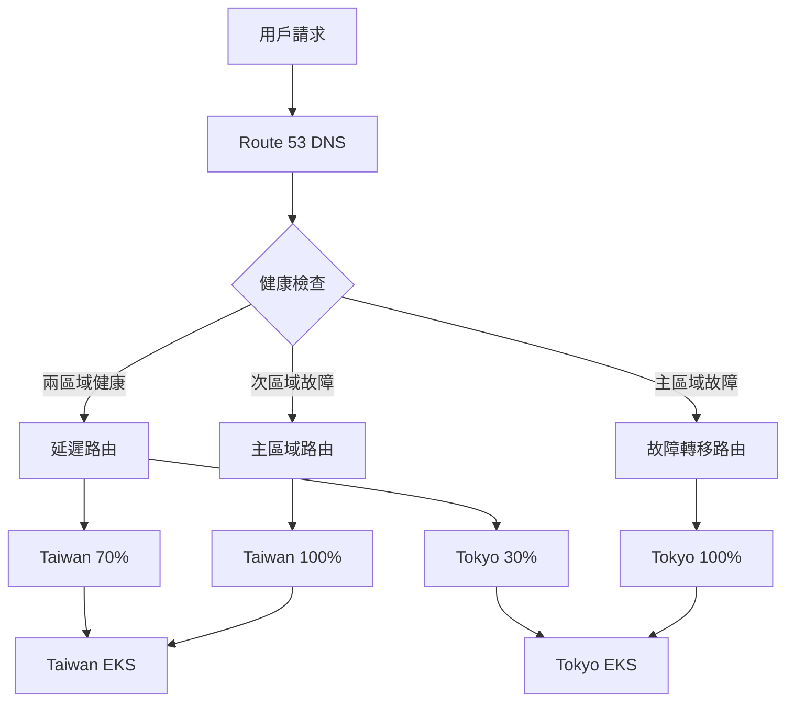
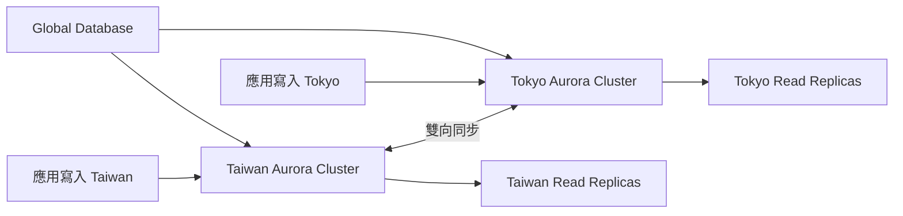
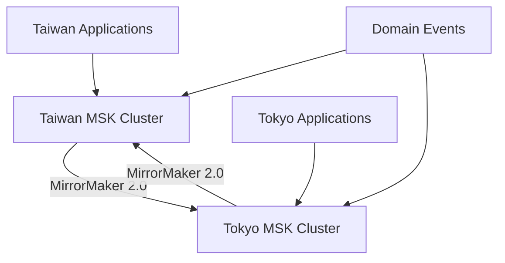
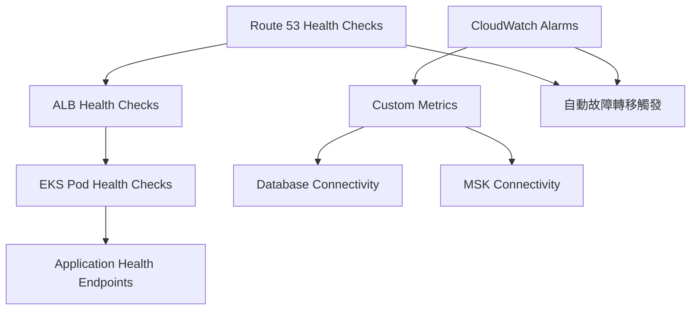
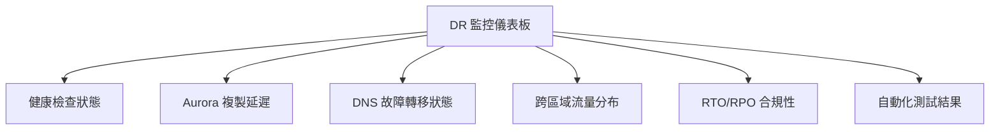

# 災難恢復架構設計文件

## 概述

本文件詳細描述了 GenAI Demo 項目的災難恢復(DR)架構設計，採用 **Active-Active 多區域部署模式**，確保業務連續性和零數據丟失。

## 設計原則

### 核心目標

- **RTO (Recovery Time Objective)**: < 60 秒
- **RPO (Recovery Point Objective)**: 0 秒 (零數據丟失)
- **可用性目標**: 99.99% (年停機時間 < 53 分鐘)
- **自動化程度**: 完全自動化故障轉移

### 架構原則

1. **Active-Active 模式**: 兩個區域同時提供服務
2. **自動故障轉移**: 無需人工干預的自動切換
3. **數據一致性**: 確保跨區域數據同步
4. **監控驅動**: 基於健康檢查的智能路由

## Active-Active 架構設計

### 區域配置

#### 主區域 (Primary Region)

- **區域**: Taiwan (ap-east-2)
- **角色**: 主要服務區域，處理大部分流量
- **優先級**: 高優先級，延遲優化路由

#### 次區域 (Secondary Region)  

- **區域**: Tokyo (ap-northeast-1)
- **角色**: 備用服務區域，同時提供服務
- **優先級**: 次優先級，故障轉移目標

### 流量分配策略



#### 正常情況下的流量分配

- **Taiwan (主區域)**: 70% 流量
- **Tokyo (次區域)**: 30% 流量
- **路由策略**: 基於延遲的智能路由

#### 故障情況下的流量分配

- **主區域故障**: 100% 流量路由到 Tokyo
- **次區域故障**: 100% 流量路由到Taiwan
- **切換時間**: < 60 秒 (DNS TTL + 健康檢查間隔)

## 基礎設施組件

### 1. DNS 和流量管理

#### Route 53 配置

```typescript
// 主區域故障轉移記錄
const primaryFailoverRecord = new route53.ARecord(this, 'PrimaryFailoverRecord', {
    zone: hostedZone,
    recordName: 'api.kimkao.io',
    target: route53.RecordTarget.fromAlias(new targets.LoadBalancerTarget(primaryLoadBalancer)),
    ttl: cdk.Duration.seconds(60), // 短 TTL 確保快速切換
    setIdentifier: 'primary-failover',
    failover: route53.FailoverType.PRIMARY,
    healthCheckId: primaryHealthCheck.attrHealthCheckId
});

// 延遲路由記錄 (正常情況)
const latencyBasedRecord = new route53.ARecord(this, 'LatencyBasedRecord', {
    zone: hostedZone,
    recordName: 'api-latency.kimkao.io',
    target: route53.RecordTarget.fromAlias(new targets.LoadBalancerTarget(primaryLoadBalancer)),
    region: 'ap-east-2',
    setIdentifier: 'taiwan-latency',
    healthCheckId: primaryHealthCheck.attrHealthCheckId
});
```

#### 健康檢查配置

- **檢查間隔**: 30 秒
- **失敗閾值**: 3 次連續失敗
- **檢查端點**: `/actuator/health`
- **協議**: HTTPS
- **超時**: 10 秒

### 2. 數據庫架構 - Aurora Global Database

#### Active-Active 數據同步



#### 數據庫配置

- **引擎**: Aurora PostgreSQL 15.4
- **模式**: Global Database with Cross-Region Replication
- **同步延遲**: < 1 秒 (通常 < 100ms)
- **備份策略**: 跨區域自動備份
- **加密**: 靜態和傳輸中加密

#### 衝突解決策略

```sql
-- 使用時間戳和區域標識解決寫入衝突
CREATE TABLE conflict_resolution (
    id UUID PRIMARY KEY,
    data JSONB,
    region VARCHAR(20),
    created_at TIMESTAMP WITH TIME ZONE DEFAULT NOW(),
    updated_at TIMESTAMP WITH TIME ZONE DEFAULT NOW(),
    version INTEGER DEFAULT 1
);

-- 衝突解決觸發器
CREATE OR REPLACE FUNCTION resolve_conflicts()
RETURNS TRIGGER AS $$
BEGIN
    -- 基於時間戳的最後寫入獲勝策略
    IF NEW.updated_at > OLD.updated_at THEN
        RETURN NEW;
    ELSE
        RETURN OLD;
    END IF;
END;
$$ LANGUAGE plpgsql;
```

### 3. 應用層架構

#### EKS 集群配置

```yaml
# Taiwan EKS 配置
taiwan_cluster:
  region: ap-east-2
  node_groups:
    - name: primary-nodes
      instance_types: [m6i.large, m6i.xlarge]
      min_size: 3
      max_size: 20
      desired_size: 6
  
# Tokyo EKS 配置  
tokyo_cluster:
  region: ap-northeast-1
  node_groups:
    - name: secondary-nodes
      instance_types: [m6i.large, m6i.xlarge]
      min_size: 2
      max_size: 15
      desired_size: 4
```

#### 應用部署策略

- **部署模式**: Blue-Green 部署
- **服務網格**: Istio (跨區域流量管理)
- **配置管理**: ConfigMap + Secrets 跨區域同步
- **鏡像倉庫**: ECR 跨區域複製

### 4. 消息隊列 - MSK 跨區域複製

#### MSK 配置



#### 事件複製策略

- **工具**: Kafka MirrorMaker 2.0
- **模式**: 雙向複製
- **延遲**: < 500ms
- **主題策略**: 自動主題創建和同步

## 自動化故障轉移機制

### 1. 故障檢測

#### 健康檢查層級



#### 故障檢測指標

1. **HTTP 健康檢查**: `/actuator/health` 端點
2. **數據庫連接**: Aurora 連接池狀態
3. **消息隊列**: MSK 生產者/消費者狀態
4. **應用指標**: 錯誤率、響應時間、吞吐量

### 2. 自動故障轉移流程

#### Step Functions 工作流

```json
{
  "Comment": "自動災難恢復故障轉移工作流",
  "StartAt": "ValidateHealthStatus",
  "States": {
    "ValidateHealthStatus": {
      "Type": "Task",
      "Resource": "arn:aws:lambda:ap-northeast-1:account:function:dr-health-validator",
      "Next": "PromoteAuroraCluster"
    },
    "PromoteAuroraCluster": {
      "Type": "Task", 
      "Resource": "arn:aws:lambda:ap-northeast-1:account:function:dr-aurora-promoter",
      "Next": "UpdateDNSRouting"
    },
    "UpdateDNSRouting": {
      "Type": "Task",
      "Resource": "arn:aws:lambda:ap-northeast-1:account:function:dr-dns-updater", 
      "Next": "SendNotification"
    },
    "SendNotification": {
      "Type": "Task",
      "Resource": "arn:aws:states:::sns:publish",
      "End": true
    }
  }
}
```

#### 故障轉移步驟

1. **故障檢測** (0-30秒)
   - Route 53 健康檢查失敗
   - CloudWatch 告警觸發
   - EventBridge 規則激活

2. **自動切換** (30-45秒)
   - Aurora Global Database 提升
   - DNS 記錄更新 (TTL=60秒)
   - 流量重新路由

3. **驗證和通知** (45-60秒)
   - 新區域健康檢查
   - 服務可用性驗證
   - 運維團隊通知

### 3. 故障恢復流程

#### 自動恢復檢測

```python
def check_primary_region_recovery():
    """檢查主區域恢復狀態"""
    health_checks = [
        check_alb_health(),
        check_database_connectivity(), 
        check_application_health(),
        check_msk_connectivity()
    ]
    
    if all(health_checks):
        trigger_failback_process()
        return True
    return False
```

#### 故障恢復步驟

1. **持續監控**: 每5分鐘檢查主區域狀態
2. **恢復驗證**: 連續3次健康檢查通過
3. **數據同步**: 確保數據一致性
4. **流量切回**: 逐步將流量切回主區域

## 混沌工程測試

### 1. 自動化測試場景

#### 月度 DR 測試

```bash
# 每月第一個週日凌晨2點執行
cron: "0 2 ? * SUN#1 *"

# 測試場景
test_scenarios:
  - health_check_failure_simulation
  - network_partition_test  
  - database_failover_test
  - dns_propagation_test
  - end_to_end_failover_test
```

#### 測試類型

1. **健康檢查失敗模擬**
   - 模擬 ALB 健康檢查失敗
   - 驗證自動故障轉移
   - 測量 RTO 合規性

2. **網絡分區測試**
   - 模擬區域間網絡中斷
   - 測試應用獨立運行能力
   - 驗證數據一致性

3. **數據庫故障轉移測試**
   - Aurora 集群故障模擬
   - 自動提升測試
   - 數據完整性驗證

### 2. 測試自動化腳本

#### 故障轉移測試

```javascript
// 執行完整故障轉移測試
async function runFailoverTest() {
    const testResults = {
        timestamp: new Date().toISOString(),
        tests: []
    };
    
    // 1. 健康檢查驗證
    const healthTest = await validateHealthChecks();
    testResults.tests.push({
        name: 'health_check_validation',
        success: healthTest.success,
        duration: healthTest.duration,
        rto_compliance: healthTest.duration < 60000 // < 60秒
    });
    
    // 2. DNS 故障轉移速度測試
    const dnsTest = await testDNSFailoverSpeed();
    testResults.tests.push({
        name: 'dns_failover_speed',
        success: dnsTest.success,
        propagation_time: dnsTest.propagationTime,
        rto_compliance: dnsTest.propagationTime < 60000
    });
    
    // 3. Aurora 複製延遲測試
    const auroraTest = await testAuroraReplicationLag();
    testResults.tests.push({
        name: 'aurora_replication_lag',
        success: auroraTest.success,
        replication_lag: auroraTest.lag,
        rpo_compliance: auroraTest.lag < 1000 // < 1秒
    });
    
    return testResults;
}
```

## 監控和告警

### 1. 關鍵指標監控

#### RTO/RPO 合規性指標

```yaml
metrics:
  rto_compliance:
    description: "故障轉移時間合規性"
    threshold: 60 # 秒
    alarm_threshold: 80 # 秒
    
  rpo_compliance:
    description: "數據丟失合規性" 
    threshold: 0 # 秒
    alarm_threshold: 1 # 秒
    
  availability:
    description: "服務可用性"
    threshold: 99.99 # 百分比
    alarm_threshold: 99.9 # 百分比
```

#### CloudWatch 儀表板



### 2. 告警配置

#### 關鍵告警

1. **主區域健康檢查失敗**
   - 閾值: 連續3次失敗
   - 動作: 觸發自動故障轉移
   - 通知: 即時 SNS 通知

2. **Aurora 複製延遲過高**
   - 閾值: > 1 秒
   - 動作: 調查數據庫性能
   - 通知: 運維團隊告警

3. **DNS 故障轉移失敗**
   - 閾值: 故障轉移超時
   - 動作: 手動干預程序
   - 通知: 緊急告警

## 成本優化

### 1. 資源配置策略

#### 區域資源分配

```yaml
taiwan_region:
  eks_nodes: 6 # 主要負載
  aurora_instances: 2 # writer + reader
  msk_brokers: 3 # 高可用配置
  
tokyo_region:
  eks_nodes: 4 # 備用負載  
  aurora_instances: 2 # writer + reader
  msk_brokers: 3 # 高可用配置
```

#### 成本優化措施

1. **Spot 實例**: 非關鍵工作負載使用 Spot 實例
2. **自動擴縮**: 基於流量的動態擴縮容
3. **預留實例**: 基礎容量使用預留實例
4. **數據生命週期**: 自動數據歸檔和清理

### 2. 成本監控

- **月度成本報告**: 自動生成成本分析
- **成本告警**: 超出預算自動告警
- **資源利用率**: 持續監控資源使用效率

## 安全考量

### 1. 數據安全

#### 加密策略

- **傳輸中加密**: TLS 1.3 for all communications
- **靜態加密**: Aurora, MSK, EBS 全面加密
- **密鑰管理**: AWS KMS 跨區域密鑰複製

#### 訪問控制

```json
{
  "Version": "2012-10-17",
  "Statement": [
    {
      "Effect": "Allow",
      "Principal": {
        "AWS": "arn:aws:iam::account:role/DRAutomationRole"
      },
      "Action": [
        "rds:FailoverGlobalCluster",
        "route53:ChangeResourceRecordSets",
        "states:StartExecution"
      ],
      "Resource": "*",
      "Condition": {
        "StringEquals": {
          "aws:RequestedRegion": ["ap-east-2", "ap-northeast-1"]
        }
      }
    }
  ]
}
```

### 2. 合規性

#### 審計日誌

- **CloudTrail**: 所有 API 調用記錄
- **VPC Flow Logs**: 網絡流量監控
- **應用日誌**: 跨區域日誌聚合

#### 數據主權

- **數據本地化**: 確保數據符合當地法規
- **跨境數據傳輸**: 符合 GDPR 和其他法規要求

## 運維手冊

### 1. 日常運維檢查清單

#### 每日檢查

- [ ] 健康檢查狀態正常
- [ ] Aurora 複製延遲 < 1秒
- [ ] 跨區域流量分布正常
- [ ] 無關鍵告警

#### 每週檢查  

- [ ] DR 測試結果回顧
- [ ] 成本使用情況分析
- [ ] 安全掃描結果
- [ ] 性能指標趨勢

#### 每月檢查

- [ ] 完整 DR 演練
- [ ] 容量規劃評估
- [ ] 文檔更新
- [ ] 團隊培訓

### 2. 故障處理程序

#### 自動故障轉移失敗

```bash
# 1. 檢查故障轉移狀態
aws stepfunctions describe-execution --execution-arn <execution-arn>

# 2. 手動觸發故障轉移
aws rds failover-global-cluster --global-cluster-identifier <cluster-id>

# 3. 更新 DNS 記錄
aws route53 change-resource-record-sets --hosted-zone-id <zone-id> --change-batch file://failover-dns.json

# 4. 驗證服務狀態
curl -f https://api.kimkao.io/actuator/health
```

#### 數據不一致處理

```sql
-- 檢查數據一致性
SELECT 
    region,
    COUNT(*) as record_count,
    MAX(updated_at) as last_update
FROM distributed_table 
GROUP BY region;

-- 手動數據同步
CALL sync_cross_region_data('taiwan', 'tokyo');
```

## 災難恢復測試計劃

### 1. 測試類型和頻率

| 測試類型 | 頻率 | 範圍 | RTO 目標 | RPO 目標 |
|---------|------|------|----------|----------|
| 健康檢查測試 | 每日 | 自動化 | < 30秒 | 0秒 |
| DNS 故障轉移測試 | 每週 | 自動化 | < 60秒 | 0秒 |
| 數據庫故障轉移測試 | 每月 | 半自動 | < 60秒 | 0秒 |
| 完整 DR 演練 | 每季 | 手動 | < 60秒 | 0秒 |
| 年度 DR 審查 | 每年 | 全面 | < 60秒 | 0秒 |

### 2. 測試成功標準

#### 技術指標

- **RTO 合規性**: 故障轉移時間 < 60秒
- **RPO 合規性**: 數據丟失 = 0
- **服務可用性**: 故障轉移期間可用性 > 99.9%
- **數據一致性**: 跨區域數據100%一致

#### 業務指標  

- **用戶體驗**: 故障轉移期間用戶無感知
- **交易完整性**: 所有進行中交易正確處理
- **系統性能**: 故障轉移後性能無明顯下降

## 未來改進計劃

### 2025 年路線圖

#### Q1 2025: 增強監控

- [ ] 實時用戶體驗監控
- [ ] AI 驅動的異常檢測
- [ ] 預測性故障分析

#### Q2 2025: 多雲支持

- [ ] Azure 區域集成
- [ ] 混合雲故障轉移
- [ ] 多雲成本優化

#### Q3 2025: 智能化運維

- [ ] 自動容量規劃
- [ ] 智能故障根因分析
- [ ] 自動化修復建議

#### Q4 2025: 全球化部署

- [ ] 更多區域支持
- [ ] 邊緣計算集成
- [ ] 全球負載均衡

## 結論

本 Active-Active 災難恢復架構設計提供了：

1. **高可用性**: 99.99% 服務可用性保證
2. **快速恢復**: RTO < 60秒，RPO = 0秒
3. **自動化**: 完全自動化的故障檢測和恢復
4. **成本效益**: 優化的資源配置和成本控制
5. **安全合規**: 全面的安全措施和合規性保證

這個設計確保了 GenAI Demo 項目能夠在任何災難情況下維持業務連續性，為用戶提供不間斷的服務體驗。

---

**文檔版本**: v1.0  
**最後更新**: 2024年12月  
**負責團隊**: DevOps & SRE Team  
**審核狀態**: 已審核
