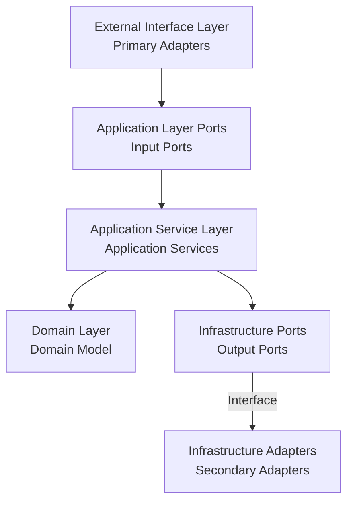

# Hexagonal Architecture Implementation Summary

This document summarizes the order system implementation based on Hexagonal Architecture.

## Architecture Overview

!Hexagonal Architecture

Hexagonal Architecture (also known as Ports and Adapters Architecture) divides the application into three main parts:

1. **Core Domain (Internal)**: Contains business logic and domain models
2. **Ports (Middle Layer)**: Defines interfaces for interacting with the external world
3. **Adapters (External)**: Connects the external world with the application core

## Bounded Contexts

The system is divided into six main bounded contexts, each focusing on a specific business domain:

1. **Order Context**
   - Responsible for order creation, modification, and lifecycle management
   - Core aggregate root: `Order`
   - Main value objects: `OrderId`, `OrderItem`, `OrderStatus`

2. **Payment Context**
   - Handles order payments, refunds, and payment status management
   - Core aggregate root: `Payment`
   - Main value objects: `PaymentId`, `PaymentMethod`, `PaymentStatus`

3. **Inventory Context**
   - Manages product inventory, reservations, and releases
   - Core aggregate root: `Inventory`
   - Main value objects: `InventoryId`, `ReservationId`, `InventoryStatus`

4. **Delivery Context**
   - Handles order delivery and logistics
   - Core aggregate root: `Delivery`
   - Main value objects: `DeliveryId`, `DeliveryStatus`

5. **Notification Context**
   - Manages system notification sending and status
   - Core aggregate root: `Notification`
   - Main value objects: `NotificationId`, `NotificationType`, `NotificationChannel`, `NotificationStatus`

6. **Workflow Context**
   - Coordinates the entire lifecycle of orders from creation to completion
   - Core aggregate root: `OrderWorkflow`
   - Main value objects: `WorkflowId`, `WorkflowStatus`

## Implementation Details

### Domain Layer

The domain model implements core business logic, completely independent of external dependencies:

- **Aggregate Roots**:
  - `Order`: Order aggregate root, containing order state control and business rules
  - `Inventory`: Inventory aggregate root, managing product inventory and reservations
  - `Delivery`: Delivery aggregate root, managing order delivery processes
  - `Payment`: Payment aggregate root, handling order payments and refunds
  - `Notification`: Notification aggregate root, managing system notification sending and status
  - `OrderWorkflow`: Workflow aggregate root, coordinating order processing flows

- **Value Objects**:
  - `OrderId`, `CustomerId`: Unique identifiers
  - `Money`: Money value object, encapsulating amount and currency
  - `OrderItem`: Order item value object
  - `OrderStatus`, `DeliveryStatus`, `PaymentStatus`, `NotificationStatus`, `WorkflowStatus`: Status enums and their transition rules
  - `PaymentMethod`, `NotificationChannel`, `NotificationType`: Business concept value objects

- **Factories**:
  - `OrderFactory`: Responsible for order creation and reconstruction
  - `DomainFactory`: Generic factory interface

- **Domain Events**:
  - `OrderCreatedEvent`: Order creation event
  - `OrderItemAddedEvent`: Order item addition event
  - `PaymentRequestedEvent`: Payment request event
  - `PaymentCompletedEvent`: Payment completion event
  - `PaymentFailedEvent`: Payment failure event

### Ports Layer

Defines interfaces for application interaction with the external world:

- **Input Ports (Primary Ports)**:
  - `OrderManagementUseCase`: Defines all order management functions provided by the system
  - `PaymentManagementUseCase`: Defines payment management functions

- **Output Ports (Secondary Ports)**:
  - `OrderPersistencePort`: Defines interfaces for order persistence operations
  - `OrderRepository`: Repository interface defined by the domain layer
  - `PaymentServicePort`: Defines payment service interface
  - `LogisticsServicePort`: Defines logistics service interface

### Application Service Layer

Coordinates interaction between domain objects and external resources:

- **Application Services**:
  - `OrderApplicationService`: Implements order management use cases, coordinating interactions between various ports
  - `PaymentApplicationService`: Implements payment management use cases

- **DTOs**:
  - `CreateOrderRequestDto`: Request data for creating orders
  - `AddOrderItemRequestDto`: Request data for adding order items
  - `OrderResponse`: Response data for order operations
  - `PaymentRequestDto`, `PaymentResponseDto`: Data transfer objects for payment-related operations

- **Commands**:
  - `CreateOrderCommand`: Create order command
  - `AddOrderItemCommand`: Add order item command
  - `ProcessPaymentCommand`: Process payment command

### Adapters Layer

Connects the external world with the application core:

- **Primary/Driving Adapters**:
  - `OrderController`: Handles HTTP requests and forwards them to application services
  - `PaymentController`: Handles payment-related HTTP requests

- **Secondary/Driven Adapters**:
  - `OrderRepositoryAdapter`: Implements order persistence operations
  - `JpaOrderRepository`: Spring Data JPA repository
  - `ExternalPaymentAdapter`: Implements payment service integration
  - `ExternalLogisticsAdapter`: Implements logistics service integration

- **Anti-Corruption Layer**:
  - `LogisticsAntiCorruptionLayer`: Isolates differences from external logistics systems

### Infrastructure Layer

Provides technical implementation and cross-cutting concerns:

- **Persistence**:
  - `JpaOrderEntity`, `JpaOrderItemEntity`: JPA entity classes
  - `OrderMapper`: Conversion between domain models and JPA entities

- **Event Handling**:
  - `SimpleEventBus`: Simple event bus implementation

- **Saga Coordinator**:
  - `OrderProcessingSaga`: Coordinates various steps of order processing
  - `SagaDefinition`: Saga definition interface

## Integration Between Contexts

Bounded contexts integrate through the following methods:

1. **Domain Events**:
   - Order context publishes `OrderCreatedEvent`, payment context subscribes and processes
   - Payment context publishes `PaymentCompletedEvent`, order context subscribes and updates order status

2. **Saga Coordinator**:
   - `OrderProcessingSaga` coordinates interactions between order, payment, inventory, and delivery contexts
   - Implements cross-context business processes and compensation logic

3. **Workflow Context**:
   - `OrderWorkflow` aggregate root manages the entire lifecycle from order creation to completion
   - Coordinates state transitions between different contexts

4. **Shared Kernel**:
   - Value objects in the `common` package (such as `Money`, `OrderId`) are shared across multiple contexts
   - Provides unified infrastructure services (such as event publishing)

## Dependency Direction

A core principle in hexagonal architecture is that dependencies always point inward:

## Implementation Advantages

1. **Business Logic Independence**:
   - Domain models don't depend on any external technologies or frameworks
   - Core business logic can be tested independently
   - Example: `Order` aggregate root doesn't depend on Spring or JPA

2. **Testability**:
   - Through dependency inversion principle, external dependencies can be easily mocked
   - Unit tests can be written for each component
   - Example: `OrderApplicationService` can be tested using a mocked `PaymentServicePort`

3. **Flexible Technology Choices**:
   - Any external dependency can be replaced without affecting core business logic
   - Example: Can switch from JPA to MongoDB by implementing new adapters

4. **Clear Responsibility Boundaries**:
   - Each component has clearly defined responsibilities
   - Simplifies system understanding and maintenance
   - Example: `OrderController` only handles HTTP requests, contains no business logic

## Design Patterns in the Project

1. **Factory Pattern**:
   - `OrderFactory` is responsible for creating and reconstructing order aggregate roots
   - Encapsulates complex object creation logic

2. **Adapter Pattern**:
   - `OrderRepositoryAdapter` adapts domain repository interface to JPA implementation
   - `ExternalPaymentAdapter` adapts external payment systems to internal interfaces

3. **Command Pattern**:
   - Uses command objects (like `CreateOrderCommand`) to encapsulate requests
   - Supports parameterization and serialization of operations

4. **Observer Pattern**:
   - Implements loose coupling communication between components through domain events
   - Example: `OrderCreatedEvent` notifies other components that an order has been created

5. **Saga Pattern**:
   - `OrderProcessingSaga` coordinates complex business processes across multiple aggregate roots
   - Provides compensation mechanisms to handle failure scenarios

## Further Improvements

The following are potential directions for future improvements:

1. **Implement Event-Driven Architecture**:
   - Enhance domain event publishing and subscription mechanisms
   - Implement event-based cross-bounded context communication
   - Consider using Apache Kafka or RabbitMQ for event delivery

2. **Microservice Decomposition**:
   - Consider splitting order, payment, logistics domains into independent microservices
   - Define contracts and communication patterns between services
   - Use API gateway for unified external interfaces

3. **Introduce CQRS Pattern**:
   - Separate command and query responsibilities
   - Create dedicated read models for complex queries
   - Optimize read and write performance

4. **Add Cross-Cutting Concerns**:
   - Implement unified logging and monitoring mechanisms
   - Enhance security controls and authentication/authorization
   - Implement distributed tracing to improve system observability

5. **Enhance Error Handling**:
   - Implement more fine-grained business exceptions
   - Unified exception handling mechanisms
   - Provide more user-friendly error responses

6. **Optimize Saga Implementation**:
   - Implement persistent Saga state
   - Support Saga recovery and retry
   - Enhance robustness of compensation logic
