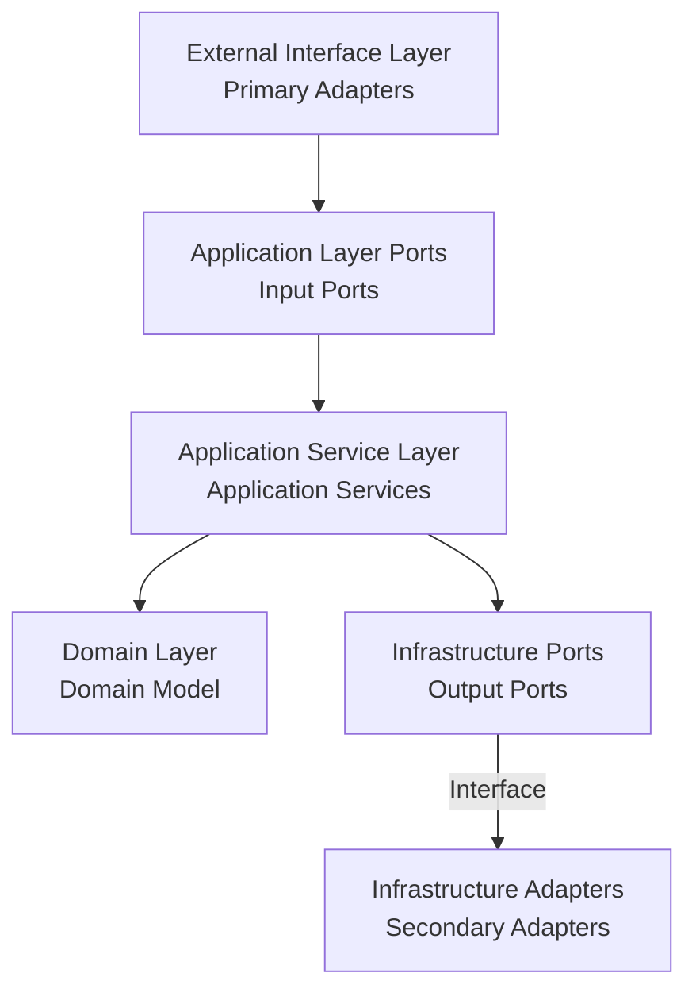

# Hexagonal Architecture and Event Storming Integration Refactoring Guide

## Architecture Overview

Hexagonal Architecture divides applications into three main parts: core domain, ports, and adapters. By combining Event Storming design elements, we can more effectively organize and implement business processes.



## Mapping Event Storming Design Elements to Hexagonal Architecture

### 1. Commands

In Event Storming, commands represent user intent, mapped in hexagonal architecture as:

- **Location**: Passed from primary adapters to application services
- **Implementation**: As parameters to input ports
- **Examples**: `CreateOrderCommand`, `AddOrderItemCommand`, `ProcessPaymentCommand`

```java
// Command object example
public class CreateOrderCommand {
    private final String customerId;
    private final String shippingAddress;
    
    // Static factory method for easy creation
    public static CreateOrderCommand of(String customerId, String shippingAddress) {
        return new CreateOrderCommand(customerId, shippingAddress);
    }
}
```

### 2. Events

Domain events represent important changes in the system:

- **Location**: Published by domain models, propagated through event bus
- **Implementation**: Domain event classes containing event-related data
- **Examples**: `OrderCreatedEvent`, `PaymentCompletedEvent`

```java
// Domain event example
public class PaymentCompletedEvent implements DomainEvent {
    private final PaymentId paymentId;
    private final OrderId orderId;
    private final Money amount;
    private final String transactionId;
}
```

### 3. Aggregates

Aggregate roots are boundaries of business entities:

- **Location**: At the core of the domain layer
- **Implementation**: Classes annotated with `@AggregateRoot`
- **Examples**: `Order`, `Payment`, `Inventory`, `Delivery`

```java
// Aggregate root example
@AggregateRoot
public class Order {
    private final OrderId id;
    private final CustomerId customerId;
    private OrderStatus status;
    
    public void submit() {
        // Business logic and state transition
        if (status != OrderStatus.CREATED) {
            throw new IllegalStateException("Cannot submit an order that is not in CREATED state");
        }
        status = OrderStatus.PENDING;
        // May publish domain events
    }
}
```

### 4. Policies

Policies are reactions to events:

- **Location**: Usually in application service layer or dedicated policy handlers
- **Implementation**: Event listeners or subscribers
- **Examples**: Automatically process payment after order confirmation

```java
// Policy example (event listener)
@Component
public class OrderPaymentPolicy {
    @EventListener
    public void handleOrderConfirmed(OrderConfirmedEvent event) {
        // Trigger payment processing
    }
}
```

### 5. Read Models

Read models optimize query operations:

- **Location**: Usually in application service layer or dedicated query services
- **Implementation**: DTO classes and query services
- **Examples**: `OrderSummaryDto`, `OrderDetailsDto`

```java
// Read model example
public class OrderSummaryDto {
    private final String orderId;
    private final String customerName;
    private final BigDecimal totalAmount;
    private final String status;
}
```

## Current Project Architecture Analysis

Our project has implemented the basic structure of hexagonal architecture, including the following bounded contexts:

1. **Order Context**
2. **Payment Context**
3. **Inventory Context**
4. **Delivery Context**
5. **Notification Context**
6. **Workflow Context**

### Existing Architecture Advantages

1. **Clear Layering**: Separation of domain, application, infrastructure, and interface layers
2. **Ports and Adapters**: Defined input ports (like `OrderManagementUseCase`) and output ports (like `OrderPersistencePort`)
3. **Independent Domain Model**: Domain model doesn't depend on external technologies

### Areas for Improvement

1. **Inconsistent Command Pattern**: Some features use command objects, others use DTOs
2. **Incomplete Event-Driven Design**: Domain event usage can be more systematic
3. **Missing CQRS Pattern**: Query and command responsibilities not clearly separated

## Refactoring Plan

### 1. Unify Command Pattern

Represent all user intents uniformly as command objects:

```java
// Using commands in controllers
@PostMapping
public ResponseEntity<OrderResponse> createOrder(@RequestBody CreateOrderRequest request) {
    // Create command object
    CreateOrderCommand command = CreateOrderCommand.of(
        request.getCustomerId(),
        request.getShippingAddress()
    );
    
    // Execute command
    OrderResponse response = orderService.createOrder(command);
    return new ResponseEntity<>(response, HttpStatus.CREATED);
}
```

### 2. Enhance Event-Driven Design

Improve domain event publishing and handling:

```java
// Publishing events in domain model
public class Order {
    public void confirm() {
        // Business logic
        this.status = OrderStatus.CONFIRMED;
        
        // Publish domain event
        DomainEventPublisher.publish(new OrderConfirmedEvent(
            this.id,
            this.customerId,
            this.totalAmount
        ));
    }
}

// Handling events in application services
@EventListener
public void handleOrderConfirmed(OrderConfirmedEvent event) {
    // Handle business logic after order confirmation
    processPayment(event.getOrderId(), event.getAmount());
}
```

### 3. Implement CQRS Pattern

Separate query and command responsibilities:

```java
// Command interface
public interface OrderCommandUseCase {
    void createOrder(CreateOrderCommand command);
    void addOrderItem(AddOrderItemCommand command);
    void submitOrder(SubmitOrderCommand command);
}

// Query interface
public interface OrderQueryUseCase {
    OrderDetailsDto getOrderDetails(String orderId);
    List<OrderSummaryDto> getCustomerOrders(String customerId);
}
```

### 4. Improve Saga Pattern

Use Saga to coordinate business processes across aggregate roots:

```java
public class OrderProcessingSaga implements SagaDefinition<OrderSagaContext> {
    @Override
    public void execute(OrderSagaContext context) {
        // Process payment
        processPayment(context);
        
        // Process inventory
        processInventory(context);
        
        // Process logistics
        processLogistics(context);
    }
    
    @Override
    public void compensate(OrderSagaContext context, Exception exception) {
        // Compensation logic
        if (context.isPaymentProcessed()) {
            refundPayment(context);
        }
        // Other compensation steps...
    }
}
```

## Refactoring Steps

### 1. Command Pattern Unification

- Create command classes for all user intents
- Update controllers to use command objects
- Modify application services to accept command parameters

### 2. Event-Driven Enhancement

- Improve domain event types
- Implement reliable event publishing mechanism
- Add event handlers and policies

### 3. CQRS Implementation

- Separate command and query interfaces
- Create dedicated query models
- Optimize query performance

### 4. Saga Pattern Improvement

- Implement Saga coordinator
- Define compensation logic
- Handle distributed transactions

## Refactoring Priority

1. **High Priority**
   - Unify command pattern
   - Improve domain events

2. **Medium Priority**
   - Implement CQRS separation
   - Enhance Saga coordinator

3. **Low Priority**
   - Optimize query performance
   - Enhance monitoring and observability

## Refactoring Benefits

1. **Clear Business Intent**
   - Command objects clearly express user intent
   - Events record system state changes

2. **Enhanced System Resilience**
   - Loose coupling between components
   - Replaceable technical implementations

3. **Improved Scalability**
   - Easy to add new features
   - Smoother cross-bounded context collaboration

4. **Better Maintainability**
   - Clear responsibility boundaries
   - Centralized business logic management

## Conclusion

By combining hexagonal architecture with Event Storming design elements, we can create a more flexible, maintainable system that aligns with business requirements. Through unifying command patterns, enhancing event-driven design, implementing CQRS patterns, and improving Saga coordinators, we can better express and implement complex business processes.

This design not only improves code readability and maintainability but also makes the system more adaptable to business changes and technical evolution. Most importantly, it keeps technical implementation aligned with business concepts, enabling development and business teams to communicate using a common language.