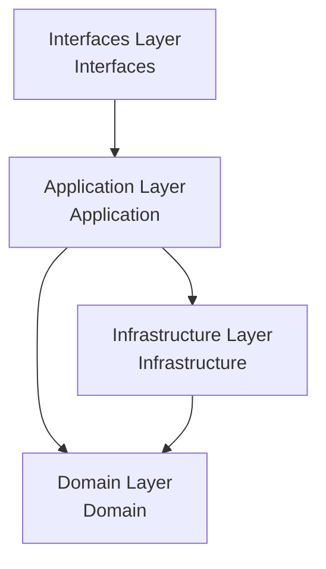
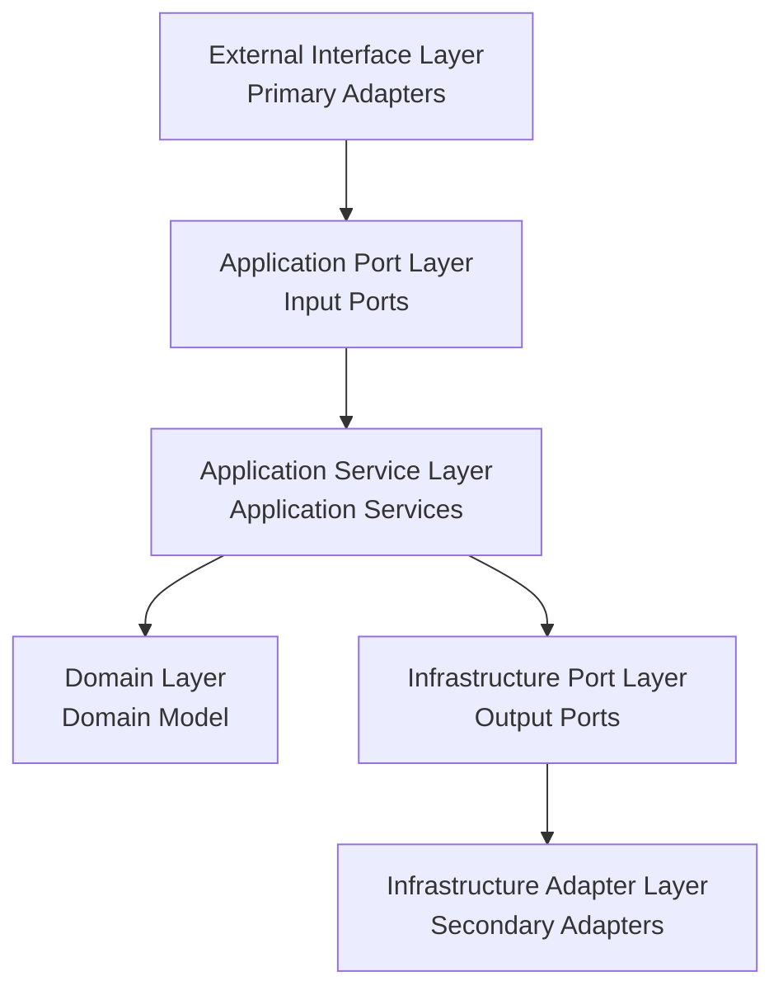

# Layered Architecture Design Analysis and Recommendations

## Common Layered Architecture Introduction

### 1. Traditional Layered Architecture
- **Characteristics**:
  - Basic layering approach: Presentation Layer -> Business Layer -> Persistence Layer
  - Each layer only depends on the layer below
  - Easy to understand and implement
- **Disadvantages**:
  - High coupling between layers
  - Difficult to achieve business logic independence
  - Testing is challenging

### 2. Onion Architecture
- **Characteristics**:
  - Core is the Domain Model
  - Outer layers depend on inner layers, inner layers are unaware of outer layers
  - All dependencies point toward the center
- **Advantages**:
  - Highly cohesive business logic
  - External dependencies (like databases) are easily replaceable
  - Good testability
- **Disadvantages**:
  - Steep learning curve
  - May lead to over-abstraction

### 3. Hexagonal Architecture (Ports and Adapters)
- **Characteristics**:
  - Core logic at the center
  - Interfaces defined through ports
  - External integrations implemented using adapters
- **Advantages**:
  - Business logic is completely independent
  - External dependencies can be easily replaced
  - Very suitable for microservices architecture
- **Disadvantages**:
  - Higher initial development cost
  - May be over-engineered for small projects

### 4. Clean Architecture
- **Characteristics**:
  - Combines advantages of Onion and Hexagonal architectures
  - Emphasizes dependency rule: dependencies can only point inward
  - Uses interfaces for decoupling
- **Advantages**:
  - Highly modular
  - Excellent testability
  - Strong adaptability
- **Disadvantages**:
  - Complex architecture
  - Requires more interfaces and conversion code

## Current Project Architecture Analysis

Our project adopts Hexagonal Architecture as the main layered architecture design pattern, combined with Domain-Driven Design (DDD) and Event-Driven Architecture (EDA) concepts.

### Existing Layer Structure

### 1. Domain Layer
- **Location**: `solid.humank.genaidemo.domain`
- **Responsibility**: Contains core business logic and domain model
- **Main Elements**:
  - **Aggregate Roots**: `Order`, `Payment`, `Inventory`, `Delivery`, `Notification`, `OrderWorkflow`
  - **Value Objects**: `OrderId`, `Money`, `OrderStatus`, `DeliveryStatus`
  - **Domain Events**: `OrderCreatedEvent`, `PaymentCompletedEvent`
  - **Domain Services**: `PaymentService`
  - **Factories**: `OrderFactory`
  - **Repository Interfaces**: `OrderRepository`, `PaymentRepository`

### 2. Application Layer
- **Location**: `solid.humank.genaidemo.application`
- **Responsibility**: Coordinates domain objects and external resources, implements use cases
- **Main Elements**:
  - **Use Case Interfaces**: `OrderManagementUseCase`, `PaymentManagementUseCase`
  - **Application Services**: `OrderApplicationService`, `PaymentApplicationService`
  - **Command Objects**: `CreateOrderCommand`, `AddOrderItemCommand`, `ProcessPaymentCommand`
  - **DTOs (Data Transfer Objects)**: `OrderResponse`, `PaymentResponseDto`
  - **Output Ports**: `OrderPersistencePort`, `PaymentServicePort`, `LogisticsServicePort`

### 3. Infrastructure Layer
- **Location**: `solid.humank.genaidemo.infrastructure`
- **Responsibility**: Provides technical implementations and external system integrations
- **Main Elements**:
  - **Repository Implementations**: `OrderRepositoryAdapter`, `JpaOrderRepository`
  - **External System Adapters**: `ExternalPaymentAdapter`, `ExternalLogisticsAdapter`
  - **ORM Entities**: `JpaOrderEntity`, `JpaOrderItemEntity`
  - **Event Handling**: `SimpleEventBus`
  - **Saga Coordinators**: `OrderProcessingSaga`
  - **Anti-Corruption Layer**: `LogisticsAntiCorruptionLayer`

### 4. Interfaces Layer
- **Location**: `solid.humank.genaidemo.interfaces`
- **Responsibility**: Handles user interactions and external requests
- **Main Elements**:
  - **Controllers**: `OrderController`, `PaymentController`
  - **Request/Response Models**: `CreateOrderRequest`, `OrderResponse`
  - **API Endpoints**: REST API definitions
  - **Exception Handling**: Global exception handlers

## Applied Design Patterns and Concepts

### 1. Ports and Adapters Pattern
- **Input Ports**: Define system functionality interfaces, such as `OrderManagementUseCase`
- **Output Ports**: Define system interfaces to external dependencies, such as `OrderPersistencePort`
- **Primary Adapters**: External components implementing input ports, such as `OrderController`
- **Secondary Adapters**: External components implementing output ports, such as `OrderRepositoryAdapter`

### 2. Command Pattern
- **Command Objects**: Objects encapsulating user intent, such as `CreateOrderCommand`
- **Command Handlers**: Components handling commands, typically application services
- **Command Factories**: Static methods creating command objects, such as `CreateOrderCommand.of()`

### 3. Domain Event Pattern
- **Event Objects**: Represent events occurring in the domain, such as `OrderCreatedEvent`
- **Event Publishing**: Publish events through `DomainEventPublisherService`
- **Event Subscription**: Handle events through event listeners

### 4. Repository Pattern
- **Repository Interfaces**: Define persistence operation interfaces, such as `OrderRepository`
- **Repository Implementations**: Implement persistence operations, such as `OrderRepositoryAdapter`
- **Query Methods**: Define data query methods, such as `findById`, `findByCustomerId`

### 5. Factory Pattern
- **Domain Factories**: Components creating complex domain objects, such as `OrderFactory`
- **Factory Methods**: Methods encapsulating object creation logic, such as `create`, `reconstitute`

### 6. Value Object Pattern
- **Immutability**: Value objects cannot be modified once created, such as `Money`
- **Equality Comparison**: Equality based on attribute values rather than identity
- **Self-Contained Validation**: Value objects contain their own validation logic

### 7. Saga Pattern
- **Process Coordination**: Coordinate business processes across multiple aggregate roots, such as `OrderProcessingSaga`
- **Compensating Transactions**: Handle rollback operations in failure scenarios
- **State Management**: Manage state of long-running business processes

### 8. Anti-Corruption Layer Pattern
- **External System Isolation**: Isolate differences in external systems, such as `LogisticsAntiCorruptionLayer`
- **Model Translation**: Translate between different models
- **Interface Adaptation**: Adapt incompatible interfaces

### 9. Dependency Injection Pattern
- **Constructor Injection**: Inject dependencies through constructors
- **Interface Dependencies**: Depend on interfaces rather than concrete implementations
- **Inversion of Control**: Transfer dependency control to external containers

## Recommended Architecture Choice

Based on the current project implementation, we should continue to improve the application of Hexagonal Architecture and strengthen the following aspects:

### 1. Unified Command Pattern Application
- Ensure all user intents are expressed through command objects
- Create command objects in controllers and pass them to application services
- Maintain immutability and self-contained validation of command objects

### 2. Enhanced Event-Driven Architecture
- Improve domain event publishing and subscription mechanisms
- Implement Event Sourcing to record system state changes
- Use Event Bus for cross-bounded context communication

### 3. Implement CQRS Pattern
- Separate command and query responsibilities
- Create dedicated read models for complex queries
- Optimize read and write performance

### 4. Improve Saga Coordinators
- Implement persistent Saga state
- Enhance robustness of compensation logic
- Support Saga recovery and retry

### Recommended Layer Structure:

### Implementation Recommendations:

1. **Domain Layer**:
   - Maintain current domain model design
   - Enhance use of domain events
   - Ensure clear aggregate root boundaries

2. **Application Layer**:
   - Uniformly use command objects
   - Implement CQRS separation
   - Improve Saga coordinators

3. **Infrastructure Layer**:
   - Enhance event persistence
   - Improve external system adapters
   - Implement distributed tracing

4. **Interfaces Layer**:
   - Standardize API response formats
   - Enhance error handling
   - Implement API versioning

This architecture will help the project:
- Maintain purity of domain logic
- Improve system testability
- Simplify external system integration
- Support future evolution and expansion
